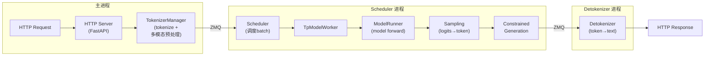
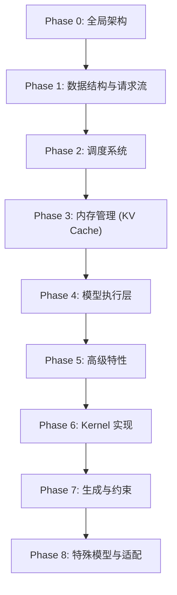

# SGLang 推理引擎学习笔记

本系列笔记聚焦于 SGLang (v0.5.9)的推理引擎核心（srt 和 sgl-kernel），目标是深入理解其设计与实现。

> **默认场景**: Qwen3.5 混合架构模型（Full Attention + Linear Attention/GatedDeltaNet + MoE + MTP）
>
> **启用特性**: PD 分离 + Chunked Prefill + ViT DP + Overlap Schedule + 多模态缓存 + EPLB + MTP + 线性注意力

## 端到端 Pipeline

## 学习路线

学习采用**自顶向下**的方式：先理解全局架构，再逐层深入细节。

## 笔记目录

### Phase 0: 全局架构
- `01-architecture.md` - 系统架构、进程模型、event_loop_overlap、请求生命周期

### Phase 1: 数据结构
- `02-core-data-structures.md` - Req、ScheduleBatch、ModelWorkerBatch、ForwardBatch、MultimodalInputs

### Phase 2: 调度系统
- `03-scheduler.md` - Scheduler 事件循环、批次调度、retraction、结果处理
- `04-schedule-policy.md` - PrefillAdder、In-batch prefix caching、优先级抢占
- `05-chunked-prefill.md` - 分块预填充、多模态分块、PD 分离场景

### Phase 3: 内存管理
- `06-memory-pool.md` - GPU/Host 内存池设计、KVCache 变体、分配器
- `07-radix-cache.md` - RadixAttention 前缀缓存、逐出策略、锁机制

### Phase 4: 模型执行
- `08-model-runner.md` - ModelRunner、CUDA Graph、ForwardBatch
- `09-attention-backends.md` - FlashInfer、FlashAttention、Triton、线性注意力、TBO 等 17 种后端
- `10-model-loading.md` - 模型加载、权重处理、量化支持
- `11-multimodal.md` - 多模态完整生命周期、VIT 处理、图像缓存

### Phase 5: 高级特性
- `12-speculative-decoding.md` - EAGLE、NGram 投机解码
- `13-parallel-strategies.md` - TP/PP/EP/DP 并行策略、EPLB、Elastic EP
- `14-pd-disaggregation.md` - Prefill-Decode 分离、KV 事件管理
- `24-batch-overlap.md` - Batch Overlap（SBO/TBO）计算-通信重叠优化

### Phase 6: Kernel 实现
- `15-sgl-kernel-overview.md` - sgl-kernel 架构
- `16-attention-kernels.md` - Attention kernel 实现
- `17-moe-kernels.md` - MoE kernel 实现
- `18-quantization.md` - 量化实现详解

### Phase 7: 生成与约束
- `19-sampling-and-generation.md` - 采样参数、惩罚机制、LogitsProcessor、Sampler
- `20-constrained-generation.md` - Grammar Backend、JSON Schema、词表掩码、跳跃解码
- `21-reasoning-and-function-call.md` - 推理解析 (ReasoningParser)、函数调用 (FunctionCallParser)

### Phase 8: 特殊模型与适配
- `22-embedding-and-rerank.md` - Embedding/Rerank 模型 (Pooler, CrossEncodingPooler, SparsePooler)
- `23-lora.md` - LoRA 适配器 (S-LoRA, Punica, 内存池, 多后端)

## 核心文件速查

| 模块 | 关键文件 | 行号 | 说明 |
|------|----------|------|------|
| 入口 | `srt/entrypoints/engine.py` | ~900 | Engine 类，进程启动 |
| 调度 | `srt/managers/scheduler.py` | 1135 | event_loop_overlap |
| 调度 | `srt/managers/scheduler.py` | 1875 | get_next_batch_to_run |
| 批次 | `srt/managers/schedule_batch.py` | 512 | Req 类 |
| 批次 | `srt/managers/schedule_batch.py` | 1202 | ScheduleBatch 类 |
| 批次 | `srt/managers/schedule_batch.py` | 2337 | ModelWorkerBatch 类 |
| 前向 | `srt/model_executor/forward_batch_info.py` | 231 | ForwardBatch 类 |
| 模式 | `srt/model_executor/forward_batch_info.py` | 74 | ForwardMode 枚举 |
| 策略 | `srt/managers/schedule_policy.py` | - | 调度策略 |
| 内存 | `srt/mem_cache/memory_pool.py` | - | KV Cache 内存池 |
| 缓存 | `srt/mem_cache/radix_cache.py` | - | Radix 前缀缓存 |
| 执行 | `srt/model_executor/model_runner.py` | - | 模型前向 |
| 多模态 | `srt/multimodal/processors/qwen_vl.py` | 233 | QwenVLImageProcessor |
| Attention | `srt/layers/attention/` | - | 各种 Attention 后端 |
| 投机 | `srt/speculative/eagle_worker.py` | - | EAGLE 实现 |
| 采样 | `srt/sampling/sampling_params.py` | - | SamplingParams 定义 |
| 采样 | `srt/sampling/sampling_batch_info.py` | - | 批次采样状态 |
| 采样 | `srt/layers/sampler.py` | - | Sampler (logits→token) |
| 惩罚 | `srt/sampling/penaltylib/` | - | 频率/存在/最小长度惩罚 |
| 约束 | `srt/constrained/base_grammar_backend.py` | - | Grammar 后端基类 |
| 约束 | `srt/constrained/xgrammar_backend.py` | - | XGrammar 后端 |
| 推理解析 | `srt/parser/reasoning_parser.py` | - | ReasoningParser |
| 函数调用 | `srt/function_call/function_call_parser.py` | - | FunctionCallParser |
| 函数调用 | `srt/function_call/base_format_detector.py` | - | 检测器基类 |
| Embedding | `srt/layers/pooler.py` | - | Pooler, CrossEncodingPooler |
| Embedding | `srt/entrypoints/openai/serving_embedding.py` | - | /v1/embeddings 端点 |
| Rerank | `srt/entrypoints/openai/serving_rerank.py` | - | /v1/rerank 端点 |
| LoRA | `srt/lora/lora_manager.py` | - | LoRA 核心管理器 |
| LoRA | `srt/lora/lora_registry.py` | - | LoRA 注册表 (请求路由) |
| LoRA | `srt/lora/mem_pool.py` | - | LoRA GPU 内存池 |
| LoRA | `srt/lora/layers.py` | - | LoRA 模块替换层 |
| 重叠 | `srt/batch_overlap/two_batch_overlap.py` | - | TBO 双批重叠 |
| 重叠 | `srt/batch_overlap/single_batch_overlap.py` | - | SBO 单批重叠 |
| EPLB | `srt/eplb/eplb_manager.py` | - | 专家负载均衡管理 |
| 弹性EP | `srt/elastic_ep/elastic_ep.py` | - | 弹性专家并行 |
| DLLM | `srt/dllm/` | - | 分布式 LLM |
| SWA内存 | `srt/mem_cache/swa_memory_pool.py` | - | SWA 双池内存 |
| SWA缓存 | `srt/mem_cache/swa_radix_cache.py` | - | SWA Radix 缓存 |
| KV事件 | `srt/disaggregation/kv_events.py` | - | PD 分离事件系统 |

## 学习建议

1. **代码阅读优先级**：先看数据结构定义，再看处理逻辑
2. **关注数据流转**: Req → ScheduleBatch → ModelWorkerBatch → ForwardBatch
3. **理解 overlap 机制**: event_loop_overlap 是默认调度模式
4. **结合测试用例**：`test/srt/` 下有大量使用示例
5. **善用日志**：`SGLANG_LOG_LEVEL=debug` 观察运行时行为
