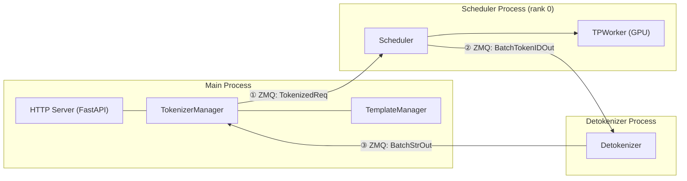
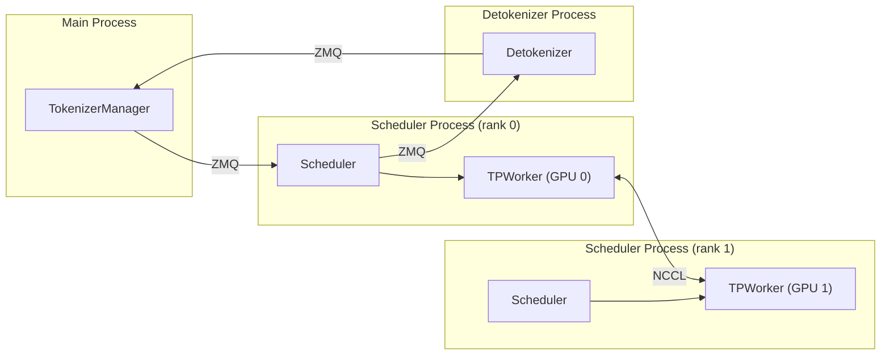
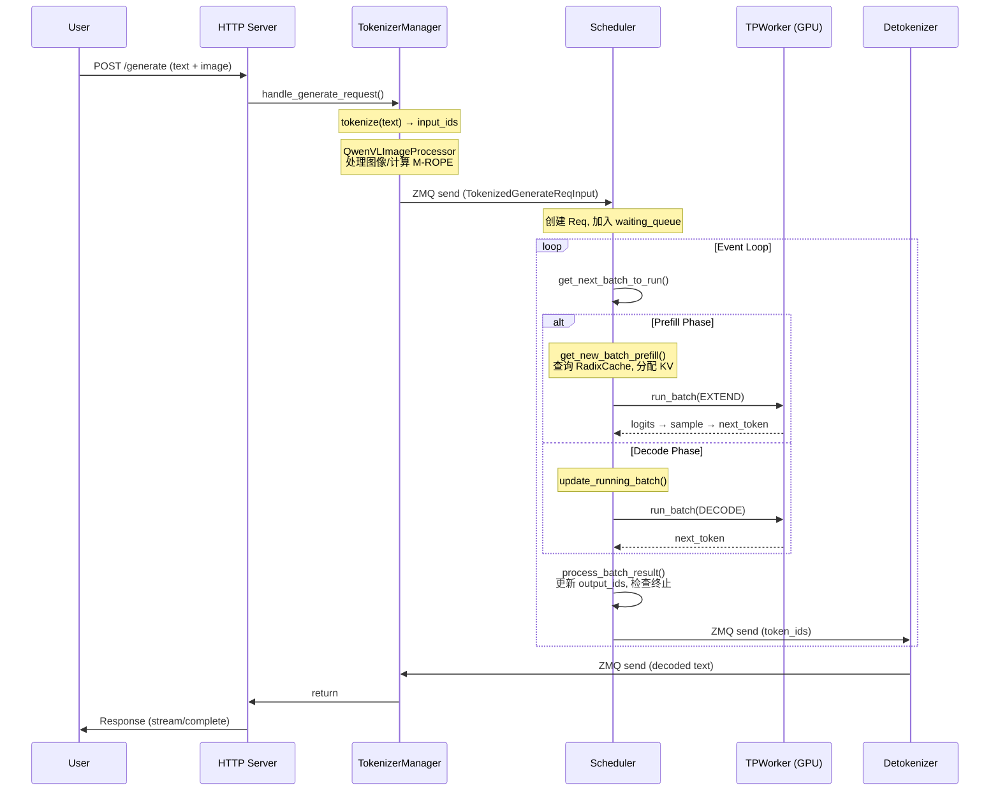
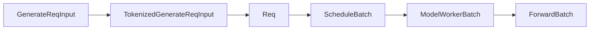

# SGLang 系统架构详解

> **默认场景**: Qwen/Qwen3-VL-235B-A22B-Thinking 多模态模型
>
> **启用特性**: PD 分离 + Chunked Prefill + ViT DP + Overlap Schedule + 多模态缓存

## 1. 进程模型

SGLang 采用多进程架构，核心进程包括：

**单卡 (TP=1) 进程模型**:



通信是**单向环形**: TokenizerManager → Scheduler → Detokenizer → TokenizerManager。

**多卡 (TP>1) 进程模型**:



TP>1 时每个 rank 一个 Scheduler 进程，但**只有 rank 0** 持有 ZMQ 连接负责外部通信，TP 间通过 **NCCL** 同步。

### 1.1 各进程职责

| 进程 | 组件 | 职责 |
|------|------|------|
| Main | HTTP Server | 接收 HTTP/gRPC 请求 |
| Main | TokenizerManager | 文本分词(text->token_id)、多模态预处理 (Qwen3-VL 图像/视频处理) |
| Subprocess | Scheduler (×TP) | 批次调度、GPU 执行；仅 rank 0 负责 ZMQ 通信 |
| Subprocess | Detokenizer | token 解码为文本(token_id -> text) |

### 1.2 进程间通信

使用 **ZMQ (ZeroMQ)** 进行进程间通信，形成单向环形:
1. **TokenizerManager → Scheduler (rank 0)**: 发送 tokenized 请求 (`TokenizedGenerateReqInput`)
2. **Scheduler (rank 0) → Detokenizer**: 发送生成的 token IDs (`BatchTokenIDOutput`)
3. **Detokenizer → TokenizerManager**: 发送解码后的文本 (`BatchStrOutput`)

> **注意**: TokenizerManager 不直接与 Detokenizer 通信，所有请求必须经过 Scheduler 中转。(前向时)

**关键代码位置**:
- 进程启动: `srt/entrypoints/engine.py:_launch_subprocesses()` (L900，函数定义位置)
- HTTP 方式调用: `srt/entrypoints/http_server.py` (L1692，import 并调用 `_launch_subprocesses`)
- Python API 方式: `srt/entrypoints/engine.py:Engine.__init__()` (L160，同样调用 `_launch_subprocesses`)
- ZMQ 通信: `srt/managers/tokenizer_communicator_mixin.py`

## 2. 核心组件

### 2.1 TokenizerManager (主进程)

**文件**: `srt/managers/tokenizer_manager.py`

职责：
1. 接收原始请求 (文本 + 多模态数据)
2. Tokenize 文本
3. 处理多模态输入 (图像/视频/音频)
4. 发送 TokenizedGenerateReqInput 给 Scheduler
5. 接收并返回结果

```python
# 核心类
class TokenizerManager:
    def __init__(self, server_args, port_args):
        self.tokenizer = get_tokenizer(...)  # 加载 tokenizer
        self.mm_processor = get_mm_processor(...)  # 多模态处理器 (如 QwenVLImageProcessor)
```

**Qwen3-VL 多模态处理器**: `srt/multimodal/processors/qwen_vl.py:QwenVLImageProcessor` (L223)

```python
# Qwen3-VL 处理器支持的模型
class QwenVLImageProcessor(SGLangBaseProcessor):
    models = [
        Qwen2VLForConditionalGeneration,
        Qwen2_5_VLForConditionalGeneration,
        Qwen3VLForConditionalGeneration,  # Qwen3-VL
        Qwen3VLMoeForConditionalGeneration,
        Qwen3OmniMoeForConditionalGeneration,
    ]
```

### 2.2 Scheduler (子进程)

**文件**: `srt/managers/scheduler.py`

职责：
1. 管理请求队列 (waiting_queue, running_batch)
2. 调度 Prefill/Decode 批次
3. 管理 KV Cache
4. 调用 TPWorker 执行模型前向

```python
# 核心类
class Scheduler:
    def __init__(self, ...):
        self.waiting_queue = []      # 等待队列 init_running_status
        self.running_batch = None    # 正在运行的批次 init_running_status
        self.tree_cache = RadixCache(...)  # 前缀缓存 init_cache_with_memory_pool
        self.tp_worker = TPWorker(...)     # 模型执行器 init_model_worker
```

### 2.3 TPWorker (Scheduler 内)

**文件**: `srt/managers/tp_worker.py`

职责：
1. 加载模型权重
2. 执行模型前向传播
3. 管理 CUDA Graph

### 2.4 DetokenizerManager (子进程)

**文件**: `srt/managers/detokenizer_manager.py`

职责：
1. 接收 token IDs
2. 解码为文本
3. 处理流式输出

## 3. 事件循环 (event_loop_overlap)

SGLang 默认使用 **overlap 模式** 的事件循环，通过 CPU/GPU 重叠执行来提高吞吐量。

**文件**: `srt/managers/scheduler.py:event_loop_overlap()` (L1099)

### 3.1 Overlap 机制原理

```mermaid
gantt
    title CPU/GPU Overlap Pipeline (event_loop_overlap)
    dateFormat X
    axisFormat %s

    section CPU
    Phase1+2 recv+schedule (N)       :a1, 0, 3
    Phase5 process_result(N-1)       :a3, 4, 7
    Phase6 launch_sample(N)          :a4, 7, 8
    Phase1+2 recv+schedule (N+1)     :a5, 8, 11
    Phase5 process_result(N)         :a7, 12, 15
    Phase6 launch_sample(N+1)        :a8, 15, 16

    section GPU
    forward(N)                       :b1, 3, 12
    forward(N+1)                     :b2, 11, 20
```



每轮循环的阶段对应 `event_loop_overlap()` 代码:

| 阶段 | 操作 | 与 GPU 关系 |
|------|------|------------|
| Phase 1 | `recv_requests()` + `process_input_requests()` | GPU forward(N-1) 已完成 |
| Phase 2 | `get_next_batch_to_run()` | 调度下一个批次 |
| Phase 3 | `run_batch(batch)` | **启动** GPU forward(N)，异步执行 |
| Phase 4 | (disable_overlap 时) 立即处理结果 | — |
| Phase 5 | `pop_and_process()` 处理 N-1 结果 | **与 GPU forward(N) 重叠** |
| Phase 6 | `launch_batch_sample_if_needed()` | 与 GPU forward(N) 重叠 |

**核心思想**: GPU forward(N) 异步执行期间，CPU **只重叠做** `process_batch_result(N-1)` + `launch_batch_sample`。而 `recv_requests` 和 `get_next_batch` 在 `run_batch` **之前**执行（Phase 1-2），不与当前 forward 重叠。

GPU 两次 forward 之间有短暂间隙，这是 Phase 1+2（接收请求 + 调度）的 CPU 开销，无法避免。

### 3.2 event_loop_overlap 代码结构

`event_loop_overlap()` 的核心是一个 **result_queue 延迟处理**机制：当前批次的结果放入队列，等到下一轮循环、GPU 已经在处理新批次时再由 CPU 处理。连续 prefill 或特殊模式下会禁用 overlap，立即处理结果。

> **详细代码分析、流程图、`is_disable_overlap_for_batch` 条件、`result_queue` 机制**: 见 **03-scheduler.md §2**

### 3.3 get_next_batch_to_run() 调度逻辑

**文件**: `srt/managers/scheduler.py:get_next_batch_to_run()` (L1778)

调度的统一入口，按以下顺序决定下一个批次：
1. 处理上轮 chunked prefill 残留请求（缓存 + 释放 `req_pool_idx`）
2. 合并上轮 prefill 完成的请求到 `running_batch`
3. 尝试 `get_new_batch_prefill()` 创建新 prefill 批次
4. 无新 prefill 时，`update_running_batch()` 继续 decode

**调度优先级**: Prefill > Decode（例外：`batch_is_full` 为 True 且无 `chunked_req` 时跳过 prefill）

> **完整流程图、代码分析、"为什么没有 get_new_batch_decode"**: 见 **03-scheduler.md §4**

## 4. 请求生命周期 (以 Qwen3-VL 多模态请求为例)

一个包含图像的生成请求的完整流程：



**详细步骤分解** (按时间顺序):

```
步骤 1 ─ 用户请求到达
│  POST /v1/chat/completions (text + image)
▼
步骤 2 ─ HTTP Server 接收 (http_server.py)
│  FastAPI 路由 → handle_generate_request()
▼
步骤 3 ─ TokenizerManager 处理 (主进程)
│  3a. tokenize(text) → input_ids
│  3b. QwenVLImageProcessor.process_mm_data_async()
│      ├─ 加载图像/视频数据
│      ├─ smart_resize() 调整图像尺寸
│      ├─ 计算 mrope_positions (多模态旋转位置编码)
│      └─ 构造 MultimodalInputs
│  3c. 组装 TokenizedGenerateReqInput
│
│  ── ZMQ send ──→
▼
步骤 4 ─ Scheduler 接收 (handle_generate_request)
│  4a. 创建 Req 对象 (req.multimodal_inputs = MultimodalInputs)
│  4b. 加入 waiting_queue
▼
步骤 5 ─ Scheduler.event_loop_overlap() 调度
│  5a. get_next_batch_to_run()
│      ├─ [Prefill] get_new_batch_prefill()
│      │   ├─ 从 waiting_queue 选取请求
│      │   ├─ 查询 RadixCache (前缀复用)
│      │   ├─ 分配 KV Cache
│      │   └─ 构造 ScheduleBatch (forward_mode=EXTEND)
│      └─ [Decode] update_running_batch()
│          ├─ 检查内存，必要时 retract
│          └─ 准备 decode 批次
│  5b. run_batch(batch)
│      ├─ batch.get_model_worker_batch() → ModelWorkerBatch
│      └─ model_worker.forward_batch_generation()
│          ├─ 模型前向 (含视觉编码器 ViT)
│          ├─ logits → 采样 → next_token
│          └─ 返回 GenerationBatchResult
│  5c. process_batch_result()  (与下一轮 GPU forward 重叠)
│      ├─ 更新 req.output_ids
│      ├─ 检查终止条件 (EOS, max_tokens)
│      └─ 发送结果到 Detokenizer
│
│  ── ZMQ send ──→
▼
步骤 6 ─ Detokenizer 解码
│  6a. decode(token_ids) → text
│  6b. 发送回 TokenizerManager
│
│  ── ZMQ send ──→
▼
步骤 7 ─ TokenizerManager 返回给用户
   HTTP Response (stream/complete)
```

## 5. 核心数据结构与转换链

SGLang 的批次数据在不同层级有不同的表示，形成完整的转换链：



> **详细说明**: 各数据结构的字段定义、转换方法及生命周期管理见 **02-core-data-structures.md**。

**输出数据**:

```python
# Token 输出 (io_struct.py)
BatchTokenIDOutput:
    rids: List[str]              # 请求 IDs
    output_token_ids: List[List[int]]

# 最终输出 (io_struct.py)
BatchStrOutput:
    rids: List[str]
    output_strs: List[str]       # 解码后的文本
```

## 6. 源码阅读建议

### 6.1 入门顺序

SGLang 有两种启动方式，入口不同:

**方式 A: HTTP Server (默认，`python -m sglang.launch_server`)**

1. **先看 HTTP Server 入口**: `srt/entrypoints/launch_server.py` → `srt/entrypoints/http_server.py`
   - `launch_server.py` 解析命令行参数，调用 `http_server.py:launch_server()`
   - `launch_server()` 内调用 `_launch_subprocesses()` 启动 Scheduler、Detokenizer 等子进程
   - 然后启动 FastAPI HTTP 服务

**方式 B: Engine Python API (`sgl.Engine()`)**

1. **看 Engine**: `srt/entrypoints/engine.py`
   - `Engine.__init__()` 同样调用 `_launch_subprocesses()` 启动子进程
   - 适用于 Python 程序直接集成，不启动 HTTP 服务

两种方式殊途同归: 都通过 `_launch_subprocesses()` 启动相同的子进程架构。

2. **再看 Scheduler 初始化**: `srt/managers/scheduler.py`
   - `__init__()` 方法
   - 理解各组件如何初始化

3. **跟踪一个请求**:
   - `TokenizerManager.handle_generate_request()`
   - `Scheduler.handle_generate_request()`
   - `Scheduler.event_loop_overlap()`

### 6.2 关键函数

| 函数 | 文件 | 行号 | 作用 |
|------|------|------|------|
| `_launch_subprocesses()` | engine.py | ~900 | 启动所有进程 |
| `event_loop_overlap()` | scheduler.py | 1099 | 主调度循环 (默认) |
| `get_next_batch_to_run()` | scheduler.py | 1778 | 获取下一批次 (统一入口) |
| `get_new_batch_prefill()` | scheduler.py | 1861 | 创建 Prefill 批次 |
| `update_running_batch()` | scheduler.py | 2073 | 更新 Decode 批次 |
| `run_batch()` | scheduler.py | 2162 | 执行批次前向 |
| `forward_batch_generation()` | tp_worker.py | - | 模型前向 |

### 6.3 核心数据结构

| 数据结构 | 文件 | 行号 | 说明 |
|----------|------|------|------|
| `Req` | schedule_batch.py | 484 | 请求级别状态 |
| `ScheduleBatch` | schedule_batch.py | 1156 | 调度层批次 |
| `ModelWorkerBatch` | schedule_batch.py | 2189 | Worker 层批次 |
| `ForwardBatch` | forward_batch_info.py | 227 | GPU 层批次 |
| `ForwardMode` | forward_batch_info.py | 70 | 前向模式枚举 |

## 7. 下一步

理解了全局架构后，下一步深入学习：
- **02**: 核心数据结构详解 (`Req`, `ScheduleBatch`, `ModelWorkerBatch`, `ForwardBatch`)
