# SGLang 调度系统详解

> **默认场景**: Qwen3.5 混合架构模型（Full Attention + Linear Attention/GatedDeltaNet + MoE + MTP）
>
> **启用特性**: PD 分离 + Chunked Prefill + ViT DP + Overlap Schedule + 多模态缓存 + EPLB + MTP + 线性注意力
>
> 调度官方Blog: https://lmsys.org/blog/2024-12-04-sglang-v0-4/ 

## 1. Scheduler 概览

**文件**: `srt/managers/scheduler.py:253`

Scheduler 是 SGLang 的核心调度器，运行在独立的子进程中，负责：
- 接收 tokenized 请求
- 管理请求队列和批次
- 调度 GPU 执行
- 处理输出结果

### 1.1 类继承结构

```python
class Scheduler(
    SchedulerOutputProcessorMixin,      # 输出处理
    SchedulerUpdateWeightsMixin,        # 权重更新
    SchedulerProfilerMixin,             # 性能分析
    SchedulerMetricsMixin,              # 指标收集
    SchedulerDisaggregationDecodeMixin, # PD 分离 - Decode 端
    SchedulerDisaggregationPrefillMixin,# PD 分离 - Prefill 端
    SchedulerMultiplexMixin,            # PD 复用
    SchedulerRuntimeCheckerMixin,       # 运行时检查
    SchedulerPPMixin,                   # Pipeline Parallel
    SchedulerDPAttnMixin,               # DP Attention
    SchedulerDllmMixin,                 # dLLM 支持
):
```

### 1.2 核心状态

```python
class Scheduler:
    def init_running_status(self):
        # ========== 请求队列 ==========
        self.waiting_queue: List[Req] = []         # 等待 prefill 的请求
        # 正在 decode 的批次
        self.running_batch: ScheduleBatch = ScheduleBatch(reqs=[], batch_is_full=False)
        # 当前正在执行的批次
        self.cur_batch: Optional[ScheduleBatch] = None
        # 上一个执行的批次 (用于 overlap)
        self.last_batch: Optional[ScheduleBatch] = None
        # ========== Chunked Prefill ==========
         # 正在分块处理的请求
        self.chunked_req: Req = None              
        # ========== 计数器 ==========
        # 前向计数
        self.forward_ct = 0                        
```

## 2. 事件循环架构

### 2.1 Multi-step Scheduling vs. Overlap Scheduling

这部分对比参考  https://zhuanlan.zhihu.com/p/1992587332189197731

**Multi-step Scheduling**

在 normal scheduler 中，每一轮生成 Token 都要负担一轮 Python 的调度成本，能否降低 CPU 调度的频率，比如生成多轮 token，再进行一次 CPU 调度？这就是 multi-step scheduling 的核心思想：Amortize（摊薄）。CPU 不再每生成一个 Token 就介入一次，而是一次性给 GPU 下达一个多轮指令，譬如当前 Batch 请连续跑 5 个步（Steps），再返回给 CPU，进行一次调度。具体而言，在 CPU 不介入的情况下，GPU 内部会运行一个固化的循环 Kernel，每一轮推理（Forward）结束后，GPU 直接在显存（VRAM）中进行采样，并将得到的 Token ID 直接填入下一轮的输入 Buffer。在这多步运行期间，生成的 Token 完全不回传给 Python。

这种 amortize 的策略虽然摊薄了 CPU 开销，却牺牲了推理系统的灵活性。首先，EOS 响应滞后；如果某个请求在第 2 步就输出了结束符（EOS），由于 CPU 正在“休眠”，GPU 会毫无察觉地继续跑完剩下的 3 步，造成显存和算力的空转。其次，无法满足调度调整，高优先级的请求（Preemption）必须等待整个 Multi-step 周期结束才能被加入队列。

**Overlap Scheduling**

与之相对的另一种调度优化方法是 Overlap Scheduling，它并不试图减少调度的频率，依然坚持单步调度，而是通过一种极其巧妙的重叠机制，把 CPU 的开销彻底隐藏在 GPU 的计算之内。但是，自回归推理中，第 步必须依赖第 步的输出 Token。如果 CPU 不等 GPU 采样完就去调度下一轮，它根本不知道输入 Token 是多少。

SGLang 引入了 `FutureMap` 机制，实现了一种预填充策略：

1. CPU 侧：符号化链接（Symbolic Linking）：当 CPU 准备 Batch N 的推理指令时，它会预先在 GPU 的 `FutureMap` 中预留（Reserve）一组物理槽位。尽管 Batch N 还没结束，CPU 已经知道 Batch N 产生的 Token，肯定会被分配到 FutureMap 的 X 号槽位。在 CPU 准备 Batch N+1 的输入张量时，通过符号引用，将 X 号槽位的地址直接填入 N+1 的输入位置。CPU 在数值尚未产生时，就已经在逻辑上完成了 Batch N (Output) -> Batch N+1 (Input) 的拓扑链接。
2. GPU 侧：延迟解析（Lazy Resolution）：Batch N+1 的指令被发射到 `forward_stream`。在它启动真正的推理算子前，会先跑一个极小的 Resolve Kernel。由于 `forward_stream` 是顺序执行（FIFO）的，Batch N 的采样算子（Sample）必然已经先于 N+1 完成了填充动作——即把真实的 Token ID 写入了 `FutureMap` 的第 X 号槽位。Resolve Kernel 此时只需根据索引，从显存的 `FutureMap[X]` 位置读出真实值，原地替换输入张量。
3. 通过这种预先链接的机制，CPU 可以在完全不触碰真实数据、不进行跨设备同步的前提下，不断向 GPU 发射后续的计算指令，从而实现 Overlap Scheduling。

分析完了原理，我们来看实际的重叠关系。在 `event_loop_overlap` 的单次迭代中，四个阶段按序执行：Pre Schedule → Launch Compute → Post Schedule → Launch Sample。其中 GPU 和 CPU 之间的真正重叠对是：

1. **Compute N+1 (GPU)** 与 **Post Schedule N (CPU)** 重叠——GPU 执行当前批次的前向推理时，CPU 同时处理上一批次的结果
2. **Sample N+1 (GPU)** 与 **Pre Schedule N+2 (CPU)** 重叠（跨迭代）——GPU 执行延迟采样时，CPU 已进入下一轮迭代开始接收和调度新请求

> **注意**: Pre Schedule N+1 是 Compute N+1 的**前置条件**（`forward_stream.wait_stream(default_stream)` 要求 default_stream 上的 Pre Schedule 先完成），因此 Pre Schedule N+1 **不能**与同批次的 Compute N+1 或 Sample N+1 重叠。

Overlap Scheduling 的调度策略仍旧是灵活的，支持细粒度的资源控制，支持完善的 EOS 响应，支持抢占。当然，代价是实现复杂，需要使用 CUDA Stream 和 Future 映射管理。


SGLang 提供两种事件循环模式：

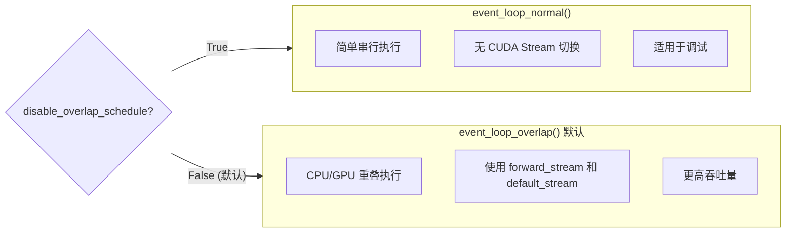

### 2.2 四阶段模型

**文件**: `scheduler.py:1135`

`event_loop_overlap` 的每次迭代可分为四个阶段：

| 阶段 | 名称 | 运行位置 | 代码 | 说明 |
|------|------|----------|------|------|
| ① | **Pre Schedule** | CPU (`default_stream`) | `recv_requests()` + `process_input_requests()` + `get_next_batch_to_run()` | 接收请求、合并上轮 prefill、调度决策 |
| ② | **Compute** | GPU (`forward_stream`) | `run_batch()` → `forward_batch_generation()` | 模型前向推理（含 `resolve_future`） |
| ③ | **Post Schedule** | CPU (`default_stream`) | `pop_and_process()` → `process_batch_result()` | 处理**上一轮**批次结果（更新 output_ids、检查终止、发送到 Detokenizer） |
| ④ | **Sample** | GPU (`forward_stream`) | `launch_batch_sample_if_needed()` | 延迟采样（投机解码等场景，非投机路径在 ② 内完成） |

### 2.3 同步点与 Overlap 关系

在 `forward_stream` 上的 GPU 操作开始前，都有一个显式同步点 `forward_stream.wait_stream(default_stream)`，确保 `default_stream` 上的 CPU 工作已完成：

- **同步点 A** (`scheduler.py:2310`): Compute 开始前，等待 Pre Schedule 完成
- **同步点 B** (`scheduler.py:2415`): Sample 开始前，等待 Post Schedule 完成

这两个同步点决定了精确的 overlap 关系。以下用 ASCII 时序图展示**连续三次迭代**的 CPU/GPU 重叠：

```
时间轴 ─────────────────────────────────────────────────────────────────────────────────────────────→
       │ 迭代 N                          │ 迭代 N+1                        │ 迭代 N+2              │

       ┌──────────┐                      ┌──────────┐                      ┌──────────┐
CPU:   │ Pre N    │                      │ Pre N+1  │                      │ Pre N+2  │
       │ recv +   │                      │ recv +   │                      │ recv +   │
       │ schedule │                      │ schedule │                      │ schedule │
       └────┬─────┘                      └────┬─────┘                      └────┬─────┘
            │                                 │                                 │
            ▼ sync A                          ▼ sync A                          ▼ sync A
       ╔════════════════╗               ╔════════════════╗               ╔════════════════╗
GPU:   ║   Compute N    ║               ║  Compute N+1   ║               ║  Compute N+2   ║
       ║   forward()    ║               ║   forward()    ║               ║   forward()    ║
       ╚════════════════╝               ╚════════════════╝               ╚════════════════╝
            │  ┌─────────────────┐           │  ┌─────────────────┐           │
            │  │   Post N-1      │           │  │   Post N        │           │
CPU:        │  │ process_result  │           │  │ process_result  │           │  ...
            │  │ (处理 N-1 结果)  │           │  │ (处理 N 结果)    │           │
            │  └────────┬────────┘           │  └────────┬────────┘           │
            │           │                    │           │                    │
            │           ▼ sync B             │           ▼ sync B             │
            │      ╔══════════╗              │      ╔══════════╗              │
GPU:        │      ║ Sample N ║              │      ║Sample N+1║              │
            │      ╚══════════╝              │      ╚══════════╝              │
            │           │  ┌──────────┐      │           │  ┌──────────┐      │
            │           │  │ Pre N+1  │      │           │  │ Pre N+2  │      │
            │           └──│ recv +   │──────┘           └──│ recv +   │──────┘
            │              │ schedule │                     │ schedule │
            │              └──────────┘                     └──────────┘
            │                   ↑                                ↑
            │                   │                                │
            └───────────────────┴── 跨迭代 overlap ──────────────┴──────────────────────────────────
                           Sample N (GPU) 与 Pre N+1 (CPU) 并行

重叠关系图解:
┌────────────────────────────────────────────────────────────────────────────────────────────────┐
│  Compute N+1 (GPU)  ════════════════════════════════════════════════                           │
│                     ↕ 同迭代内并行                                                              │
│  Post N (CPU)       ───────────────────                                                        │
│                                                                                                 │
│  Sample N+1 (GPU)                       ════════════                                           │
│                                         ↕ 跨迭代并行                                            │
│  Pre N+2 (CPU)                          ────────────                                           │
└────────────────────────────────────────────────────────────────────────────────────────────────┘
```

**重叠对总结**:

| GPU 操作 | 并行的 CPU 操作 | 重叠类型 |
|----------|----------------|---------|
| Compute N+1 | Post Schedule N (`process_batch_result`) | ✅ 同迭代内并行 |
| Sample N+1 | Pre Schedule N+2 (`recv + schedule`) | ✅ 跨迭代并行 |
| Compute N+1 | Pre Schedule N+1 | ❌ 串行（sync A 阻塞） |
| Sample N+1 | Post Schedule N+1 | ❌ 串行（sync B 阻塞） |

### 2.4 CUDA 异步执行模型：Overlap 的根基

Overlap Scheduling 之所以能实现 CPU/GPU 并行，根基在于 **CUDA 的异步执行模型**——CPU 负责"投递"（launch），GPU 负责"执行"（execute），投递动作本身是异步的。

#### 2.4.1 Stream 是 GPU 侧的命令队列

CUDA Stream 本质上是一个**提交给 GPU 的操作序列**（命令队列）。CPU 往 stream 里"投递"工作（kernel launch、异步 memcpy 等），投递完**立刻返回**——CPU 不等 GPU 执行完。同一个 stream 内的操作按 FIFO 顺序执行，不同 stream 间的操作可以并发。

SGLang 使用三条 stream，但它们的创建位置不同：

```python
# forward_stream 由 TpModelWorker 创建，通过 get_worker_info() 返回给 Scheduler
# scheduler.py:583
self.forward_stream = self.tp_worker.get_worker_info()[...]  # 来自 ModelRunner

# init_overlap() 中获取 default_stream 并创建 copy_stream
# scheduler.py:990-1002
self.default_stream = self.device_module.current_stream()  # 默认 CUDA stream (stream 0)
self.forward_stream_ctx = self.device_module.stream(self.forward_stream)  # 包装为 context manager
self.copy_stream    = self.device_module.Stream()           # 独立 stream，用于异步数据拷贝
```

> **为什么 forward_stream 由 ModelRunner 创建？** 因为 ModelRunner 在初始化时需要用 forward_stream 来 profile 最大 token 数和构建 CUDA Graph，这些操作发生在 Scheduler 的 `init_overlap()` 之前。

> **注意**：`default_stream` 不是"给 CPU 用的 stream"——它是 PyTorch 的默认 CUDA stream。Pre Schedule 阶段的**主体是纯 CPU 的 Python 逻辑**（网络 I/O、调度决策、数据结构维护），但其中可能包含少量 tensor 操作（如 token 处理、radix cache 查找等），这些 tensor 操作会默认提交到 `default_stream`。

#### 2.4.2 Kernel Launch 是异步的——Overlap 的根本来源

```
CPU 时间线:  ──[launch kernel A]──[做其他CPU工作]──[launch kernel B]──→
                    │                                    │
GPU 时间线:  ───────[=====执行 kernel A=====]────────────[==执行 B==]──→
```

CPU 调用 `forward_batch_generation()` 时，只是把一系列 CUDA kernel **提交**到 `forward_stream`，这个"提交"动作非常快（微秒级）。提交完，CPU 立刻返回，继续执行 Python 代码（Post Schedule）。与此同时，GPU 在 `forward_stream` 上按序执行那些 kernel。

**这就是 overlap 的根本来源：CPU 提交完工作就走，GPU 在后台执行。**

#### 2.4.3 GPU 侧同步 vs CPU 侧同步

SGLang 的两个同步点 `forward_stream.wait_stream(default_stream)` 是 **GPU 侧同步**，不阻塞 CPU：

| 同步操作 | 谁被阻塞 | 效果 | 是否破坏 overlap |
|---------|---------|------|:---:|
| `forward_stream.wait_stream(default_stream)` | **GPU** (`forward_stream`) | forward_stream 等 default_stream 完成后才开始执行新 kernel；**CPU 不等** | ❌ 不破坏 |
| `torch.cuda.synchronize()` | **CPU** | CPU 等所有 GPU stream 完成 | ✅ 破坏 |
| `tensor.item()` / `tensor.cpu()` | **CPU** | 隐式同步，CPU 等 GPU 算完才能取值 | ✅ 破坏 |
| `stream.synchronize()` | **CPU** | CPU 等该 stream 完成 | ✅ 破坏 |
| `torch.cuda.Event` + `record/wait` | **GPU** | GPU 侧事件同步，**CPU 不等** | ❌ 不破坏 |

具体地，`scheduler.py:2310` 的 `self.forward_stream.wait_stream(self.default_stream)` 执行时：
1. **CPU 执行这行后立刻返回**（只是在 forward_stream 的命令队列里插入了一个"等待 default_stream"的屏障）
2. **GPU 的 forward_stream** 会等到 default_stream 上的操作完成后，才开始执行 `forward_batch_generation` 的 kernel

因此：Pre Schedule 是 Compute 的前置条件，**不是因为 CPU 在等 GPU，而是 GPU 的 forward_stream 在等 default_stream**。

#### 2.4.4 维持 Overlap 的关键：避免 CPU↔GPU 同步

要保持 overlap 窗口，CPU 在 "launch compute" 到 "Post Schedule 结束" 这段时间内**绝对不能有 CPU-GPU 同步点**，否则 CPU 就会被 GPU 拖住，overlap 窗口消失。

```
✅ 不阻塞 CPU 的操作（安全）:
   stream_A.wait_stream(stream_B)      # GPU 侧依赖
   kernel launch / 异步 memcpy         # 异步提交
   torch.cuda.Event + record/wait      # GPU 侧事件
   cudaMemcpyAsync + pinned memory     # 异步拷贝

❌ 会阻塞 CPU 的操作（破坏 overlap）:
   torch.cuda.synchronize()            # CPU 等所有 GPU 完成
   tensor.item()                       # CPU 等 GPU 算完取标量
   tensor.cpu()                        # CPU 等 GPU 算完拷回数据
   stream.synchronize()                # CPU 等某个 stream 完成
   cudaMemcpy（同步拷贝）               # CPU 等拷贝完成
```

这正是 SGLang 引入 `FutureMap` 的原因——当 batch N 的结果还在 GPU 上时，CPU 不去 `.item()` 取结果，而是用 future 占位符。等到 Post Schedule 阶段（GPU 已完成）再通过 `resolve_future` 在 GPU 侧读取真实值。

#### 2.4.5 完整的 CPU/GPU 时间线

```
迭代 N:
CPU:  [Pre Schedule N]──launch──[Post Schedule N-1]────launch──[等 GPU 或做轻量工作]
                           │(异步,立即返回)            │(异步)
GPU:  [等default_stream]──[=====Compute N=====]──[等default_stream]──[Sample N]
      ↑ sync A                                   ↑ sync B
      GPU侧屏障,CPU不等                           GPU侧屏障,CPU不等

迭代 N+1:
CPU:  [Pre Schedule N+1]──launch──[Post Schedule N]──launch──...
                              │                         │
GPU:                   [===Compute N+1===]      [Sample N+1]

真正的并行窗口:
  ┌───────────────────────────────────────────────────┐
  │ Compute N+1 (GPU 执行) ║ Post Schedule N (CPU 执行) │  ← 同时段
  │ Sample N+1  (GPU 执行) ║ Pre Schedule N+2 (CPU 执行) │  ← 跨迭代
  └───────────────────────────────────────────────────┘

关键: CPU 的 "launch" 动作是微秒级的异步提交,
     提交完立刻返回去做 CPU 工作 (Post Schedule / Pre Schedule),
     GPU 在后台独立执行 kernel。
```

### 2.5 单次迭代代码对照

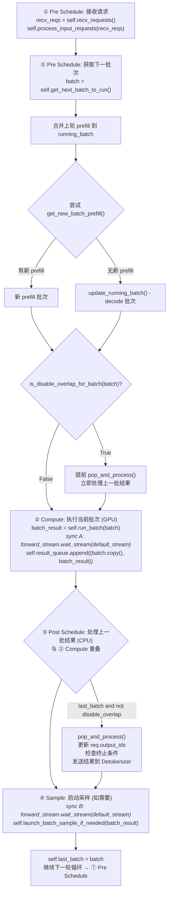

> **`is_disable_overlap_for_batch` 详解**: 当连续两个 Prefill 批次时，会禁用 overlap 以改善第一个 Prefill 的 TTFT。实际延迟的是 CPU 操作时间（~2-10ms），而非 GPU 计算时间。详见 **§22.1**。

### 2.6 Overlap 时序图（修正版）

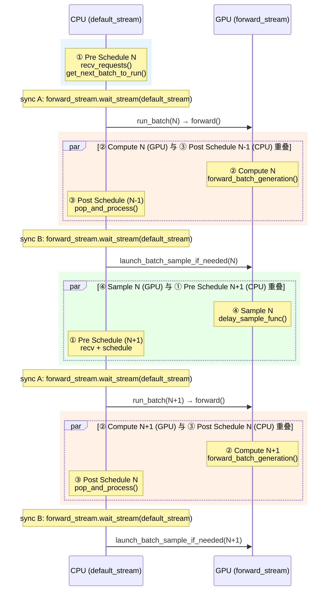

> **注意**: 图中 sync A / sync B 是 `forward_stream.wait_stream(default_stream)` 的两次调用。Pre Schedule **必须**在 Compute 之前完成（sync A 阻塞），Post Schedule **必须**在 Sample 之前完成（sync B 阻塞）。因此 CPU 端的工作窗口是：Compute 期间做 Post Schedule，Sample 期间做下一轮的 Pre Schedule。

### 2.7 result_queue 机制

```python
# scheduler.py:1137
self.result_queue: Deque[Tuple[ScheduleBatch, BatchResult]] = deque()

# 延迟处理: 当前批次的结果放入队列，下一轮循环处理
batch_result = self.run_batch(batch)
self.result_queue.append((batch.copy(), batch_result))

# 下一轮循环时处理
def pop_and_process():
    tmp_batch, tmp_result = self.result_queue.popleft()
    self.process_batch_result(tmp_batch, tmp_result)
```

### 2.8 FutureMap 详解

**文件**: `srt/managers/overlap_utils.py`

FutureMap 是 Overlap 调度的核心数据结构，解决了 **GPU 异步执行下的数据依赖问题**。

#### 2.8.1 核心问题

在 Overlap 模式下，当为 Round N+1 准备 `input_ids` 时，Round N 的采样结果**还在 GPU 上异步计算**：

```
Round N:
  CPU: [Pre N] → [run_batch(N)] → [Post N-1] → [Sample N-1]
                       │              ↑
                       ↓              │
  GPU:          Compute N ────────────┘ (async)
```

问题：`prepare_for_decode()` 需要 `self.input_ids = self.output_ids`，但 output_ids 还没准备好！

#### 2.8.2 解决方案：Future Token 机制

使用**负数索引**作为占位符，表示"这个 token ID 将来会由第 X 个请求的采样结果填充"：

```python
# scheduler.py:2330 - 在 overlap 模式下
future_indices_or_next_token_ids = -future_indices.indices
# 例如: tensor([-1, -2, -3, -4]) 而不是实际的 token IDs
```

在下一轮 forward 开始前**解析**负索引：

```python
# overlap_utils.py:18-24
@torch.compile(dynamic=True, backend=get_compiler_backend())
def _resolve_future_token_ids(input_ids, future_token_ids_map):
    input_ids[:] = torch.where(
        input_ids < 0,                                    # 如果是负数
        future_token_ids_map[torch.clamp(-input_ids, min=0)],  # 从 map 查真实值
        input_ids,                                        # 否则保持不变
    )
```

#### 2.8.3 设计优势

**省略 GPU→CPU→GPU 往返**：

| 模式 | 数据流 |
|------|-------|
| 非 Overlap | GPU sample → CPU (sync) → Python list → GPU tensor |
| Overlap | GPU sample → `store_to_map` (GPU) → `resolve_future` (GPU) |

调度阶段**只需批次大小和序列长度**，不需要真实 token ID，负索引足够。

#### 2.8.4 数据结构

```python
class FutureMap:
    def __init__(self, max_running_requests, chunked_prefill_size, context_len, device, spec_algo):
        self.future_ct = 0  # 循环 buffer 计数器
        
        # Buffer 大小计算
        max_num_chunks = (context_len + chunked_prefill_size - 1) // chunked_prefill_size
        self.future_limit = max_running_requests * (3 + max_num_chunks)
        self.future_buffer_len = self.future_limit + 2 * max_running_requests
        
        # 非投机模式: 只存 token_ids
        self.token_ids_buf = torch.empty((self.future_buffer_len,), dtype=torch.int64, device=device)
        
        # 投机模式: 额外存储 (延迟初始化)
        # self.topk_p_buf, self.topk_index_buf, self.verified_id_buf, ...
```

**循环 Buffer 布局**：

```
时间 →
╔════════════════════════════════════════════════════════════╗
║  Slot: | 0 | 1 | 2 | 3 | 4 | 5 | 6 | 7 | 8 | ... | limit  ║
╠════════════════════════════════════════════════════════════╣
║  T=0:  |D0 |D1 |D2 |D3 | - | - | - | - | - |              ║  (Decode batch 4 reqs)
║  T=1:  |D0 |D1 |D2 |D3 |P0 |P1 |P2 | - | - |              ║  (+ Prefill 3 tokens)
║  T=2:  | - | - | - | - |P0 |P1 |P2 |D4 |D5 |              ║  (D0-D3 resolved)
║  ...                                                       ║
╚════════════════════════════════════════════════════════════╝
```

#### 2.8.5 生命周期

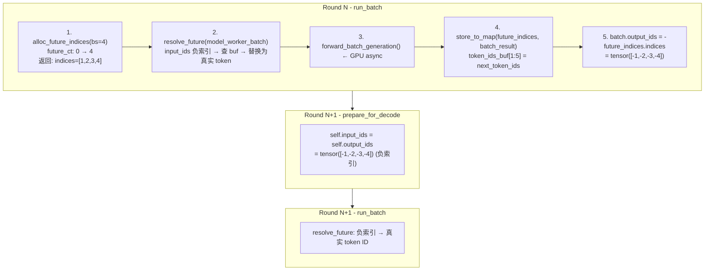

#### 2.8.6 投机解码的扩展

对于 EAGLE 等投机解码，FutureMap 额外存储：

| 字段 | 用途 |
|------|------|
| `topk_p_buf` | Top-k 概率 |
| `topk_index_buf` | Top-k 索引 |
| `verified_id_buf` | 验证后的 token ID |
| `new_seq_lens_buf` | 新序列长度 |
| `hidden_states_buf` | 隐藏状态 (可选) |

投机解码**更依赖** FutureMap，因为数据量远大于普通 decode 的单个 token ID。

#### 2.8.7 EOS 导致的额外 Forward

Overlap 模式下，**遇到 EOS 会多执行一次 forward**：

```
Round N: 采样得到 EOS → store_to_map(EOS)
                        ↓
Round N+1: 还不知道 N 产生了 EOS
           resolve_future → 替换为 EOS
           forward(input_ids=[..., EOS, ...])  ← 多余的 forward
                        ↓
Post N:    process_batch_result → check_finished → req 标记 finished
                        ↓
Next Pre:  filter_batch → 移除 finished 请求
```

**代价与收益**：
- 代价：一次多余的 forward + 多占一轮 KV cache slot
- 收益：Overlap 带来的 GPU 利用率提升远大于此代价
- 正确性：多余输出被丢弃，不影响结果

## 3. 请求处理流程

### 3.1 请求接收与分发

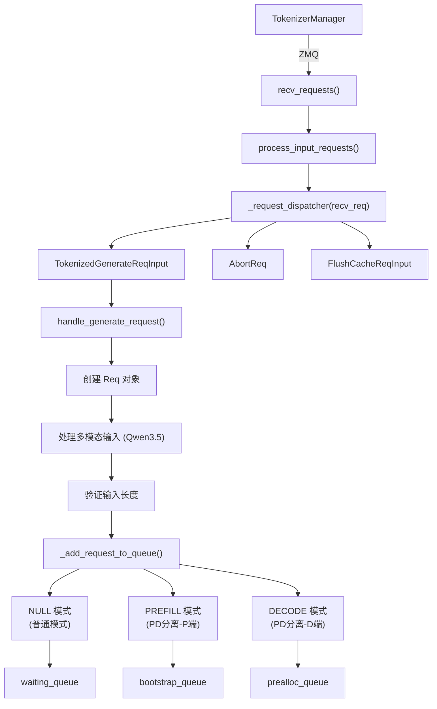

### 3.2 handle_generate_request 详解

**文件**: `scheduler.py:1481`

```python
def handle_generate_request(self, recv_req: TokenizedGenerateReqInput):
    # 1. 创建 Req 对象
    req = Req(
        recv_req.rid,
        recv_req.input_text,
        recv_req.input_ids,
        recv_req.sampling_params,
        # ... 其他参数 ...
        disagg_mode=self.disaggregation_mode,
    )

    # 2. 处理多模态输入 (Qwen3.5)
    if recv_req.mm_inputs is not None:
        image_inputs = self._get_multimodal_inputs(recv_req.mm_inputs)
        # 扩展图像 token
        req.origin_input_ids = self.pad_input_ids_func(
            req.origin_input_ids, image_inputs
        )
        req.extend_image_inputs(image_inputs)

    # 3. 验证输入长度
    error_msg = validate_input_length(req, self.max_req_input_len, ...)
    if error_msg:
        req.set_finish_with_abort(error_msg)

    # 4. 初始化 grammar (如需要)
    if req.sampling_params.json_schema:
        req.grammar = self.grammar_backend.init_grammar(...)

    # 5. 加入队列
    self._add_request_to_queue(req)
```

### 3.3 _add_request_to_queue 路由

```python
def _add_request_to_queue(self, req: Req, is_retracted: bool = False):
    if self.disaggregation_mode == DisaggregationMode.NULL:
        # 普通模式: 直接加入 waiting_queue
        self._prefetch_kvcache(req)
        self.waiting_queue.append(req)

    elif self.disaggregation_mode == DisaggregationMode.PREFILL:
        # PD 分离 - Prefill 端: 加入 bootstrap_queue
        self.disagg_prefill_bootstrap_queue.add(req, ...)

    elif self.disaggregation_mode == DisaggregationMode.DECODE:
        # PD 分离 - Decode 端: 加入 prealloc_queue
        self.disagg_decode_prealloc_queue.add(req, is_retracted=is_retracted)
```

## 4. 批次调度核心

### 4.1 get_next_batch_to_run

**文件**: `scheduler.py:1875`

这是调度的统一入口，决定下一个要运行的batch。

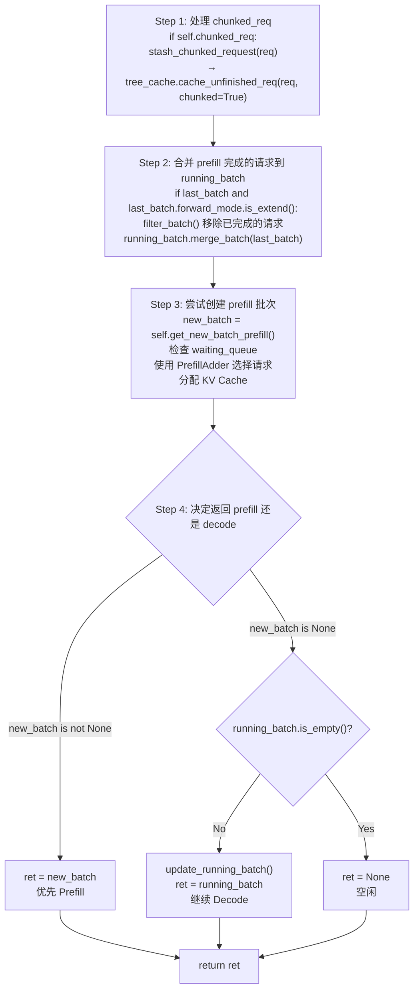

**调度优先级**: **Prefill > Decode** (例外：`batch_is_full == True` 且无 `chunked_req` 时，直接跳过 prefill 进入 decode；PD 分离 prefill-only 模式下无 decode)

### 4.2 get_new_batch_prefill

**文件**: `scheduler.py:1960`

从 waiting_queue 创建 prefill batch。

> **注意**: 实际代码分为两层——`get_new_batch_prefill()` 是外层 wrapper，负责创建 `PrefillDelayerSinglePassExecutor`（DP Attention 场景下协调各 worker 的 prefill 时机）；核心选择逻辑在 `_get_new_batch_prefill_raw()` 中。以下为简化合并展示：

```python
def get_new_batch_prefill(self) -> Optional[ScheduleBatch]:
    # 1. 检查是否允许 prefill
    if (self.running_batch.batch_is_full or len(self.waiting_queue) == 0
        ) and self.chunked_req is None:
        return None

    # 2. 计算优先级
    self.policy.calc_priority(self.waiting_queue)

    # 3. 创建 PrefillAdder
    adder = PrefillAdder(
        page_size=self.page_size,
        tree_cache=self.tree_cache,
        token_to_kv_pool_allocator=self.token_to_kv_pool_allocator,
        running_batch=self.running_batch,
        new_token_ratio=self.new_token_ratio,
        rem_input_tokens=self.max_prefill_tokens,
        rem_chunk_tokens=self.chunked_prefill_size,
    )

    # 4. 添加 chunked_req (如有)
    if self.chunked_req is not None:
        self.chunked_req = adder.add_chunked_req(self.chunked_req)

    # 5. 从 waiting_queue 选择请求
    for req in self.waiting_queue:
        req.init_next_round_input(self.tree_cache)  # 查询前缀缓存
        result = adder.add_one_req(req, ...)
        if result != AddReqResult.CONTINUE:
            break

    # 6. 创建批次
    if adder.can_run_list:
        # 从 waiting_queue 移除已选请求
        # 创建 ScheduleBatch
        new_batch = ScheduleBatch.init_new(
            reqs=adder.can_run_list,
            req_to_token_pool=self.req_to_token_pool,
            token_to_kv_pool_allocator=self.token_to_kv_pool_allocator,
            tree_cache=self.tree_cache,
            model_config=self.model_config,
        )
        new_batch.prepare_for_extend()
        return new_batch

    return None
```

### 4.3 update_running_batch

**文件**: `scheduler.py:2203`

更新正在 decode 的批次。

```python
def update_running_batch(self, batch: ScheduleBatch) -> Optional[ScheduleBatch]:
    # 1. 过滤已完成的请求
    batch.filter_batch(v1_spec_info_filtered=True)
    if batch.is_empty():
        return batch

    # 2. 检查是否 OOM，必要时 retract
    if not batch.check_decode_mem(...):
        retracted_reqs, new_token_ratio, reqs_to_abort = batch.retract_decode(...)
        self.new_token_ratio = new_token_ratio
        for req in retracted_reqs:
            self._add_request_to_queue(req, is_retracted=True)

    # 3. 准备 decode 数据
    batch.prepare_for_decode()
    return batch
```

### 4.4 为什么没有 get_new_batch_decode()?

SGLang 的设计中，decode 批次不需要单独创建函数：

1. **Prefill 完成后**，请求通过 `get_next_batch_to_run()` 的 Step 2 自动合并到 `running_batch`
2. **`update_running_batch()`** 负责更新 decode 批次（检查内存、处理 retraction、`prepare_for_decode()`）
3. `running_batch` 会持续进行 decode 直到所有请求完成

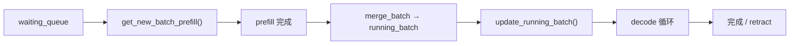

## 5. PrefillAdder

**文件**: `schedule_policy.py:316`

PrefillAdder 负责选择要 prefill 的请求，管理三层 token 预算 (总预算 / 输入预算 / 分块预算)。核心流程：
- 计算每个请求的 token 需求 (`extend_input_len + max_new_tokens`)
- 在预算允许范围内依次添加请求到 `can_run_list`
- 支持 chunked prefill：预算不够时截断请求

> **详细说明**: PrefillAdder 的预算计算、`add_one_req` 流程、chunked prefill 分块逻辑及 AddReqResult 状态见 **04-schedule-policy.md**。

## 6. 调度策略 (SchedulePolicy)

**文件**: `schedule_policy.py:80`

### 6.1 策略类型

```python
class CacheAwarePolicy(Enum):
    """缓存感知策略"""
    LPM = "lpm"           # Longest Prefix Match - 最长前缀匹配
    DFS_WEIGHT = "dfs-weight"  # DFS 权重

class CacheAgnosticPolicy(Enum):
    """缓存无关策略"""
    FCFS = "fcfs"         # First Come First Serve - 先进先出
    LOF = "lof"           # Longest Output First - 最长输出优先
    RANDOM = "random"     # 随机
```

### 6.2 优先级计算

```python
def calc_priority(self, waiting_queue: List[Req]) -> bool:
    if self.policy == CacheAgnosticPolicy.FCFS:
        if self.enable_priority_scheduling:
            self._sort_by_priority_and_fcfs(waiting_queue, ...)
        return False

    if isinstance(self.policy, CacheAwarePolicy):
        # 计算前缀匹配
        self._compute_prefix_matches(waiting_queue, policy)

        if policy == CacheAwarePolicy.LPM:
            # 按最长前缀排序
            self._sort_by_longest_prefix(waiting_queue, ...)
        elif policy == CacheAwarePolicy.DFS_WEIGHT:
            # 按 DFS 权重排序
            self._sort_by_dfs_weight(waiting_queue, self.tree_cache)
```

## 7. run_batch 执行流程

**文件**: `scheduler.py:2278`

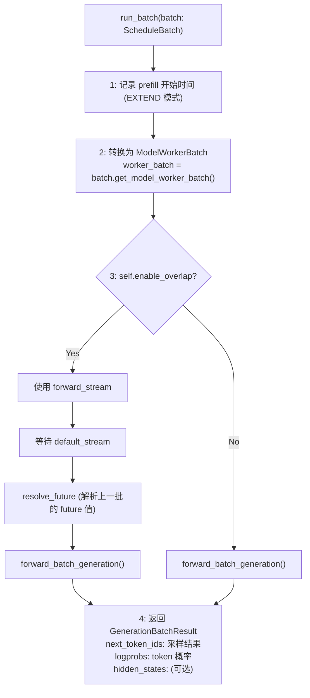

## 8. PD 分离模式

### 8.1 架构概览

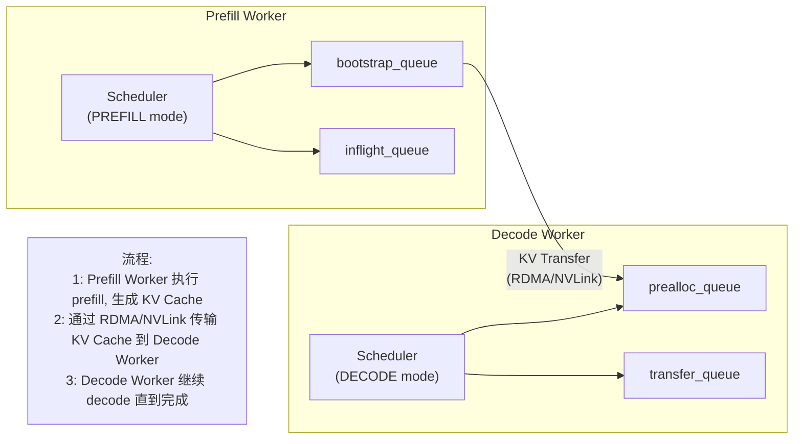

### 8.2 Prefill 端队列

```python
# scheduler.py:975
self.disagg_prefill_bootstrap_queue = PrefillBootstrapQueue(...)
self.disagg_prefill_inflight_queue: List[Req] = []  # 正在传输 KV 的请求
```

### 8.3 Decode 端队列

```python
# scheduler.py:920
self.disagg_decode_transfer_queue = DecodeTransferQueue(...)  # 等待 KV 传输
self.disagg_decode_prealloc_queue = DecodePreallocQueue(...)  # 预分配 KV
```

## 9. Retraction 机制 (OOM 处理)

> **完整配置参数表**: 见 **§19**

**文件**: `scheduler.py:2203` - `update_running_batch()`

当 decode 阶段 KV Cache 不足时，会触发 retraction (请求回退)。

### 9.1 触发条件

```python
def update_running_batch(self, batch: ScheduleBatch):
    # 检查 decode 内存是否足够
    if not batch.check_decode_mem(self.decode_mem_cache_buf_multiplier):
        # 触发 retraction
        retracted_reqs, new_token_ratio, reqs_to_abort = batch.retract_decode(...)
```

### 9.2 Retraction 流程

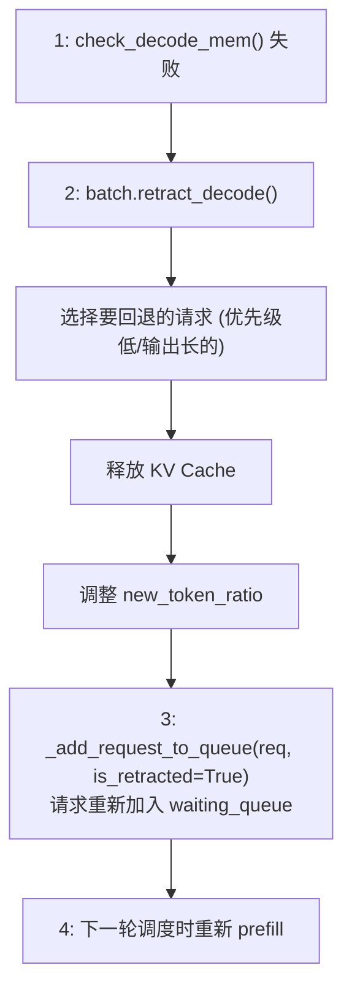

### 9.3 new_token_ratio 动态调整

**文件**: `scheduler.py:835-847, 2240-2243`

#### 核心作用

`new_token_ratio` 是一个**动态预留比例**，用于在 Prefill 调度时估算每个 running 请求未来 decode 阶段需要的 KV cache 空间。

**为什么需要预留？**
- Prefill 完成后，请求进入 decode 阶段，持续生成 token 直到 EOS 或 max_new_tokens
- 如果不预留空间，新 prefill 会占满 KV cache，导致 running 请求 decode 时无空间 → OOM

**为什么不预留 100%？**

| 策略 | 效果 |
|------|------|
| `ratio = 1.0` (100%) | 保守，不会 OOM，但同时 running 的请求少，吞吐量低 |
| `ratio = 0.1` (10%) | 激进，吞吐量高，但可能 OOM |
| `ratio = 0.7 → 0.1` (动态) | 平衡：启动保守，逐渐放宽；OOM 时回调 |

**关键公式**:
```python
预留空间 = (max_new_tokens - 已生成tokens) × new_token_ratio
```

#### 初始化

```python
init_new_token_ratio = min(
    SGLANG_INIT_NEW_TOKEN_RATIO * schedule_conservativeness,  # 默认 0.7 * 1.0
    1.0
)
min_new_token_ratio = min(
    init_new_token_ratio * SGLANG_MIN_NEW_TOKEN_RATIO_FACTOR,  # 默认 0.7 * 0.14 ≈ 0.098
    1.0
)
new_token_ratio_decay = (init_new_token_ratio - min_new_token_ratio) / SGLANG_NEW_TOKEN_RATIO_DECAY_STEPS
new_token_ratio = init_new_token_ratio  # 初始值 0.7
```

#### 正常衰减

每轮 forward 后:
```python
self.new_token_ratio = max(
    self.new_token_ratio - self.new_token_ratio_decay,  # 每轮减少 ~0.001
    self.min_new_token_ratio,                           # 收敛到 ~0.098
)
```

#### OOM 回调 (retract_decode)

```python
# schedule_batch.py retract_decode()
new_estimate_ratio = (
    total_decoded_tokens + SGLANG_RETRACT_DECODE_STEPS * len(self.reqs)
) / (total_max_new_tokens + 1)
new_estimate_ratio = min(1.0, new_estimate_ratio)
```

### 9.4 在 PrefillAdder 中的使用

**文件**: `schedule_policy.py:350-397`

PrefillAdder 初始化时，计算 running_batch 中所有请求的预留空间:

```python
# PrefillAdder.__init__()
if running_batch is not None:
    self.rem_total_token_offset += sum(
        [self._get_running_request_total_token_offset(r) for r in running_batch.reqs]
    )

def _get_running_request_total_token_offset(self, req: Req) -> int:
    return (
        min((req.sampling_params.max_new_tokens - len(req.output_ids)), CLIP_MAX_NEW_TOKENS)
        * self.new_token_ratio  # ← 预留比例
    )
```

**`rem_total_tokens` 计算**:
```python
@property
def rem_total_tokens(self):
    available_and_evictable = allocator.available_size() + tree_cache.evictable_size()
    return available_and_evictable - self.rem_total_token_offset
    #                                 ↑ 扣除 running 请求的预留空间
```

**调度决策**:
```python
# add_one_req() 检查
if self.ceil_paged_tokens(req.extend_input_len) > self.rem_total_tokens:
    return AddReqResult.NO_TOKEN  # KV cache 不足，拒绝该请求
```

### 9.5 完整生命周期图

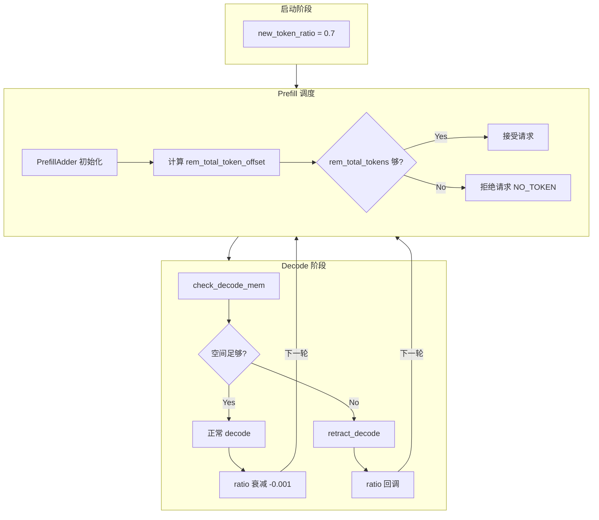

**关键理解**: 每次创建 PrefillAdder 时都会基于当前 `new_token_ratio` 重新计算预留空间，因此 ratio 的动态调整会立即影响下一轮调度。

## 10. 结果处理流程

**文件**: `scheduler_output_processor_mixin.py`

### 10.1 process_batch_result 分发

```python
# scheduler.py:2447
def process_batch_result(self, batch, result):
    if batch.forward_mode.is_decode():          # decode 最高频，放在第一个分支
        self.process_batch_result_decode(batch, result)
    elif batch.forward_mode.is_extend():
        self.process_batch_result_prefill(batch, result)
    elif batch.forward_mode.is_prebuilt():      # PD 分离 decode 端
        self.process_batch_result_prebuilt(batch)
    elif batch.forward_mode.is_idle():          # DP Attention idle 批次
        self.process_batch_result_idle(batch, result)

    self.log_batch_result_stats(batch, result)
    self._maybe_clear_mm_inputs(batch)
    self.maybe_send_health_check_signal()
```

> **为什么 decode 放第一个？** 在稳态运行中，decode 是最高频的 forward mode（每个请求只 prefill 一次，但会 decode 多轮），将其放在 if-elif 链的第一个位置可以减少分支判断开销。

### 10.2 Prefill 结果处理

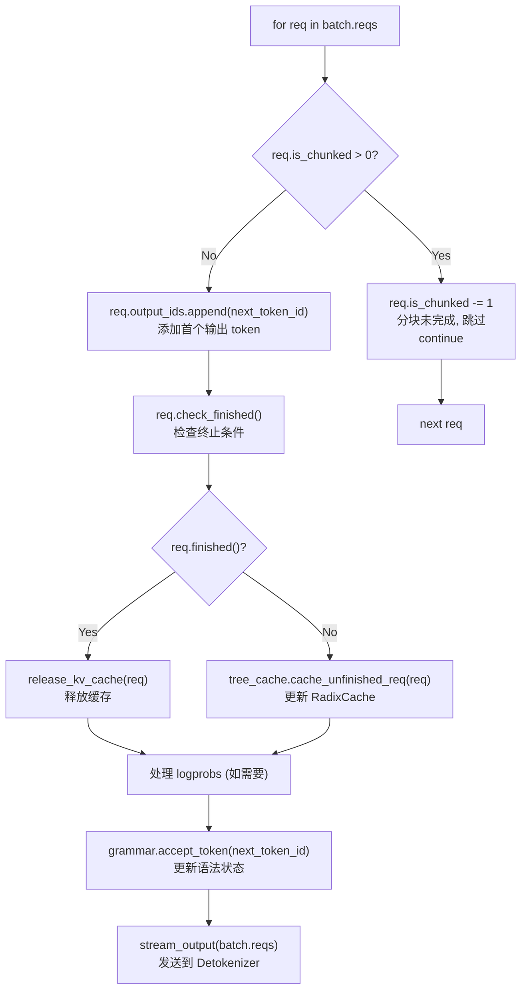

### 10.3 Decode 结果处理

```python
def process_batch_result_decode(self, batch, result):
    for i, (req, next_token_id) in enumerate(zip(batch.reqs, next_token_ids)):
        # 1. 添加 token
        req.output_ids.append(next_token_id)  # 普通 decode
        # 或 req.output_ids.extend(next_token_id)  # spec v2

        # 2. 检查完成
        req.check_finished(new_accepted_len)

        # 3. 释放 KV Cache (如完成)
        if req.finished():
            release_kv_cache(req, self.tree_cache)

        # 4. 更新 logprobs
        if req.return_logprob:
            req.output_token_logprobs_val.append(...)

    # 5. 流式输出
    self.stream_output(batch.reqs, batch.return_logprob)
```

## 11. Mixed Chunk 模式

**启用条件**: `--enable-mixed-chunk`

### 11.1 概念

在同一批次中混合 chunked prefill 和 decode 请求。

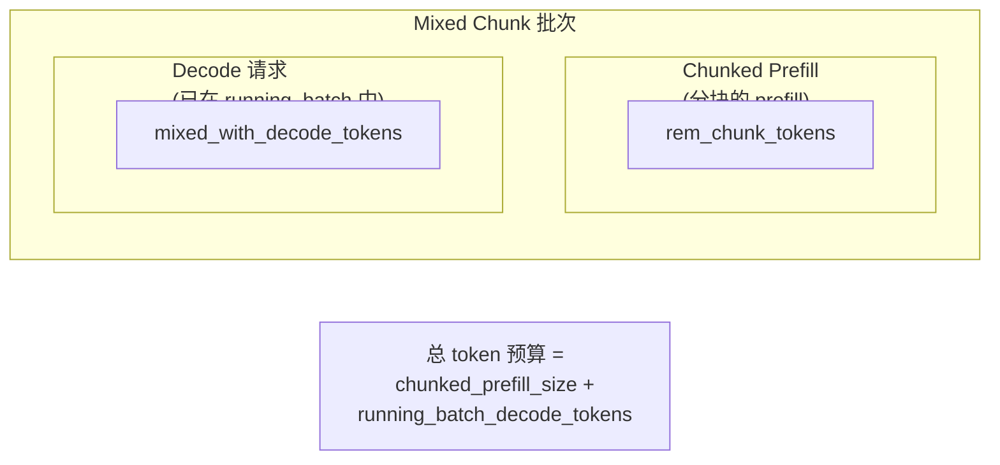

### 11.2 PrefillAdder 中的处理

```python
# schedule_policy.py:317
adder = PrefillAdder(
    ...
    mixed_with_decode_tokens=running_bs if self.is_mixed_chunk else 0,
)
```

## 12. Grammar Queue 机制

**文件**: `scheduler.py:2450`

用于异步初始化 grammar (如 JSON Schema)。

### 12.1 流程

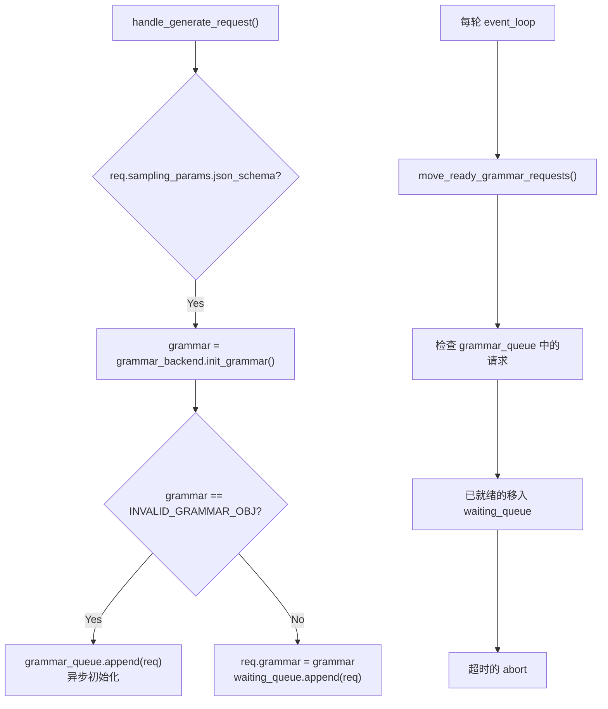

## 13. Priority 调度与 Preemption

**文件**: `schedule_policy.py:668`

### 13.1 优先级抢占条件

```python
def preempt_to_schedule(self, req: Req, server_args: ServerArgs) -> bool:
    # 遍历 running 请求，找可抢占的
    for running_req in sorted_valid_running_reqs:
        priority_diff = (req.priority - running_req.priority) * (-priority_sign)

        # 优先级差需超过阈值
        if priority_diff > self.priority_scheduling_preemption_threshold:
            preemptible_reqs.append(running_req)
```

### 13.2 抢占执行

```python
# 释放被抢占请求的资源
for running_req in preemptible_reqs:
    self.running_batch.release_req(i, ...)

# 过滤批次
self.running_batch.filter_batch(keep_indices=keep_indices)

# 记录被抢占请求
self.preempt_list.extend(preemptible_reqs)
```

## 14. LoRA 批次管理

**文件**: `scheduler.py:2030`

### 14.1 LoRA Slot 检查

```python
# get_new_batch_prefill 中
if self.enable_lora:
    lora_set = set([req.lora_id for req in self.running_batch.reqs])

for req in self.waiting_queue:
    if self.enable_lora:
        new_lora_set = lora_set | set([req.lora_id for req in adder.can_run_list]) | {req.lora_id}

        if not self.tp_worker.can_run_lora_batch(new_lora_set):
            # 跳过会触发 adapter 切换的请求
            if req.lora_id is not None:
                continue
```

## 15. Embedding 请求处理

**文件**: `scheduler.py:1810`

Embedding 请求与 generation 请求的区别：

| 特性 | Generation | Embedding |
|------|------------|-----------|
| 输出 | token 序列 | 向量 |
| 终止条件 | EOS/max_tokens | prefill 完成 |
| KV Cache | 需要 | 可选 |
| 流式输出 | 支持 | 不支持 |

```python
def handle_embedding_request(self, recv_req):
    req = Req(
        ...,
        is_embedding=True,
    )
    # 直接加入 waiting_queue
    self.waiting_queue.append(req)
```

## 16. 调度器 Mixin 架构

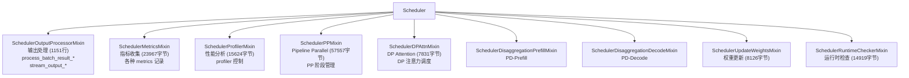

## 17. 关键配置参数 (完整版)

| 参数 | 默认值 | 说明 |
|------|--------|------|
| `disable_overlap_schedule` | False | 禁用 overlap 调度 |
| `chunked_prefill_size` | -1 | Chunked prefill 大小 (-1 禁用) |
| `enable_mixed_chunk` | False | 混合 chunked prefill + decode |
| `max_prefill_tokens` | 计算 | 单批最大 prefill token 数 |
| `max_running_requests` | 计算 | 最大并发请求数 |
| `schedule_policy` | "fcfs" | 调度策略 |
| `new_token_ratio` | 0.7 | 新 token 预留比例 (`SGLANG_INIT_NEW_TOKEN_RATIO * schedule_conservativeness`) |
| `min_new_token_ratio` | ~0.098 | 最小新 token 预留比例 (`init_ratio * 0.14`) |
| `new_token_ratio_decay` | ~0.001 | 预留比例衰减速率 (`(init - min) / 600`) |
| `disaggregation_mode` | "null" | PD 分离模式 |
| `enable_priority_scheduling` | False | 启用优先级调度 |
| `priority_scheduling_preemption_threshold` | 0 | 抢占阈值 |
| `prefill_max_requests` | None | Prefill 批次最大请求数 |

## 18. 调试与监控

### 18.1 环境变量

```bash
# 测试 retraction
SGLANG_TEST_RETRACT=1
SGLANG_TEST_RETRACT_INTERVAL=100

# 日志级别
SGLANG_LOG_LEVEL=debug

# Grammar 超时
SGLANG_GRAMMAR_TIMEOUT=300
```

### 18.2 关键日志

```python
# Retraction 日志
logger.warning(f"KV cache pool is full. Retract requests. #retracted_reqs: {len(retracted_reqs)}")

# Grammar 错误
logger.error(f"Grammar accept_token failed for req {req.rid}")
```

## 19. batch_is_full 完整逻辑

**文件**: `scheduler.py`

`batch_is_full` 是 `running_batch` 的布尔标志，控制是否跳过 prefill 调度。

### 19.1 设为 True 的场景

| 行号 | 触发位置 | 条件 |
|------|---------|------|
| L2006 | `_get_new_batch_prefill_raw()` | `get_num_allocatable_reqs(running_bs) <= 0` 且有 `chunked_req`（请求槽位满） |
| L2072 | `_get_new_batch_prefill_raw()` 循环中 | `len(can_run_list) >= get_num_allocatable_reqs(running_bs)` |
| L2077 | `_get_new_batch_prefill_raw()` 循环中 | PD 分离 PREFILL 模式下 `req_to_token_pool` 用尽 |
| L2113 | `_get_new_batch_prefill_raw()` 循环中 | `AddReqResult.NO_TOKEN` (通用) |
| L2109 | `_get_new_batch_prefill_raw()` 循环中 | `AddReqResult.NO_TOKEN` + hierarchical cache（条件性设置） |

### 19.2 重置为 False 的场景

| 行号 | 触发位置 | 条件 |
|------|---------|------|
| L749 | `init_running_status()` | 初始化 |
| L1910 | `get_next_batch_to_run()` | `filter_batch()` 后 batch_size 减小 |
| L1988 | `_get_new_batch_prefill_raw()` | `try_preemption` 时重置以尝试抢占 |
| L2209 | `update_running_batch()` | `filter_batch()` 后 batch 为空 |
| L2263 | `update_running_batch()` | decode 批次收缩 |
| L2868 | retraction 处理完成 | 重置以允许新 prefill |

## 20. is_disable_overlap_for_batch 条件

**文件**: `scheduler.py:1190-1212`

```python
def is_disable_overlap_for_batch(self, batch: ScheduleBatch) -> bool:
    # 条件 1: 连续 prefill
    disable_overlap_for_batch = (
        envs.SGLANG_DISABLE_CONSECUTIVE_PREFILL_OVERLAP.get()  # 环境变量控制
        and batch and batch.forward_mode.is_extend()
        and self.last_batch and self.last_batch.forward_mode.is_extend()
    )

    # 条件 2: spec_v2 + grammar + decode + result_queue 非空
    need_grammar_sync = (
        batch and batch.is_spec_v2 and batch.has_grammar
        and batch.forward_mode.is_decode()
        and len(self.result_queue) > 0
    )

    return disable_overlap_for_batch or need_grammar_sync
```

### 20.1 条件 1: 连续 Prefill 禁用 Overlap 的原因

**核心目的**: 改善第一个 Prefill 请求的 **TTFT (Time To First Token)**。

#### 正常 Overlap 时序 (Prefill N → Prefill N+1)

在 overlap 模式下，Prefill N 的结果（第一个生成的 token）**不会立即返回**，而是要等到 Round N+1 的 `run_batch(N+1)` 发射后才在 `pop_and_process()` 中处理：

```
Round N:
  CPU: [Pre N] → [run_batch(N)] → [Post N-1] → [Sample N launch] → update last_batch=N
                      │
  GPU:          Prefill N (async) ────────────────────────────────────→

Round N+1:
  CPU: [Pre N+1] → [run_batch(N+1)] → [Post N] → [Sample N+1 launch]
         │               │               │
         │               │               └── copy_done.synchronize() 等待 N 的结果
         │               │                   这里才处理 Prefill N 的结果并返回第一个 token！
         │               │
         └───────────────┴── TTFT 额外延迟 = 这段 CPU 时间
```

#### 实际延迟时间分析

**延迟的不是 GPU 计算时间，而是 CPU 操作时间**：

| 延迟来源 | 操作内容 | 量级 |
|---------|---------|------|
| Sample N kernel launch | CPU 提交采样 kernel 到 GPU | ~100μs |
| Pre N+1 | `recv_requests()` + `process_input_requests()` + `get_next_batch_to_run()` | ~1-5ms |
| run_batch(N+1) kernel launch | CPU 提交 forward kernel 到 GPU | ~100-500μs |
| **总延迟** | | **~2-10ms** |

高并发场景下（大量请求涌入），`process_input_requests` 和 `get_next_batch_to_run` 的调度逻辑变复杂，延迟可能更长。

#### 禁用 Overlap 后的时序

```python
# scheduler.py L1124-1125
if disable_overlap_for_batch:
    pop_and_process()  # ← 先处理上一批的结果！
```

```
Round N+1 (disable_overlap=True):
  CPU: [Pre N+1] → [pop_and_process()] → [run_batch(N+1)] → ...
                          │
                          └── copy_done.synchronize() 阻塞等待 Prefill N 完成
                              立即处理 Prefill N 的结果，发送第一个 token！
                          │
  GPU:    ───Prefill N───┘     [gap]     ───Prefill N+1───
                                  ↑
                           GPU 空闲！
```

#### Trade-off

| 方面 | 启用 Overlap | 禁用 Overlap (连续 Prefill) |
|------|-------------|---------------------------|
| TTFT | 较差（延迟 2-10ms） | 更好（立即返回） |
| GPU 利用率 | 高（无间隙） | 略低（有 gap） |
| 吞吐量 | 较好 | 略差 |

#### 为什么 Prefill→Decode 不需要禁用？

- **Decode 耗时很短**（只生成一个 token，GPU 时间 ~1-5ms）
- 延迟 Post N 的时间 ≈ Decode N+1 的 GPU 时间，影响不大
- 但 **Prefill N → Prefill N+1**，两个都很长（可能 50-500ms），累积延迟明显

#### 典型场景

高并发场景，请求不断涌入：
```
Prefill_1 → Prefill_2 → Prefill_3 → Decode_1 → ...
```

如果不禁用 overlap：
- Prefill_1 的第一个 token 要等 Prefill_2 发射后才返回
- Prefill_2 的第一个 token 要等 Prefill_3 发射后才返回
- 用户感知的 TTFT 被人为拉长

禁用后，每个 Prefill 完成后立即处理结果，用户更快看到第一个 token。

### 20.2 条件 2: spec_v2 + grammar 场景

**条件**: 投机解码 V2 + grammar 约束的组合尚不支持 overlap 模式。

```python
need_grammar_sync = (
    batch and batch.is_spec_v2 and batch.has_grammar
    and batch.forward_mode.is_decode()
    and len(self.result_queue) > 0
)
```

投机解码需要验证 draft tokens 是否被 target model 接受，grammar 约束需要同步更新状态。两者组合时，必须等上一批结果完全处理完才能继续，否则 grammar 状态可能不一致。

## 21. stream_output 发送机制

**文件**: `scheduler_output_processor_mixin.py:788-1097`

### 21.1 流式判断

```python
if req.finished():
    should_output = True  # 完成的请求一定输出

elif req.stream:
    # 流式请求: 按 stream_interval 间隔输出
    stream_interval = req.sampling_params.stream_interval or self.stream_interval
    should_output = len(req.output_ids) % stream_interval == 0
    if should_output:
        should_output &= not req.check_match_stop_str_prefix()  # 防止输出 stop_str 前缀

else:
    # 非流式请求: 每 50 token 强制输出一次 (DEFAULT_FORCE_STREAM_INTERVAL = 50)
    should_output = len(req.output_ids) % 50 == 0
```

### 21.2 输出数据打包

```python
# 打包到 BatchTokenIDOutput
BatchTokenIDOutput(
    rids=[req.rid, ...],
    output_token_ids=[output_ids[send_token_offset:], ...],  # 增量
    finished_reasons=[req.finished_reason.to_json() if finished else None, ...],
    # ... metrics: prompt_tokens, completion_tokens, cached_tokens, queue_times ...
)
```

### 21.3 增量解码

```python
# Req.init_incremental_detokenize() (schedule_batch.py:901)
# 首次: 初始化 surr_offset 和 read_offset
surr_offset = max(read_offset - 5, 0)  # INIT_INCREMENTAL_DETOKENIZATION_OFFSET = 5
surr_and_decode_ids = origin_input_ids[surr_offset:] + output_ids
# 后续: 仅追加新 output_ids
surr_and_decode_ids.extend(output_ids[cur_decode_ids_len:])
```

维护 `read_offset` + `surr_offset` 实现增量 detokenization，`surr_offset` 前移 5 个 token 确保跨 token 边界的正确解码。

## 22. check_finished 终止条件

**文件**: `schedule_batch.py:1029-1059`

检查顺序（短路逻辑，命中即返回）:

```python
def check_finished(self, new_accepted_len: int = 1):
    if self.finished():                          return  # 1. 已完成
    if self.to_finish:                                   # 2. to_finish → finished_reason
        self.finished_reason = self.to_finish; return
    if len(output_ids) >= max_new_tokens:                # 3. 长度限制 → FINISH_LENGTH
        ...; return
    if self.grammar and self.grammar.is_terminated():    # 4. 语法约束完成 → FINISH_MATCHED_TOKEN
        ...; return
    if self._check_token_based_finish(new_tokens):       # 5. stop_token_ids / EOS
        return
    if self._check_vocab_boundary_finish(new_tokens):    # 6. NaN / 越界 token
        return
    if self._check_str_based_finish():                   # 7. stop_strs / stop_regex
        return
```

**终止类型**:
| 类型 | 含义 |
|------|------|
| `FINISH_LENGTH` | 达到 max_new_tokens |
| `FINISH_MATCHED_TOKEN` | 命中 stop_token_ids 或 EOS |
| `FINISH_MATCHED_STR` | 命中 stop_strs |
| `FINISHED_MATCHED_REGEX` | 命中 stop_regex |
| `FINISH_ABORT` | 请求被中止 (abort/validate 失败) |

**`to_finish` vs `finished_reason`**: `to_finish` 是中间标记（abort 场景下设置），下一轮 `check_finished` 时转为 `finished_reason`，确保当轮结果仍被正常处理。

## 23. launch_batch_sample_if_needed

**文件**: `scheduler.py:2405-2420`

```python
def launch_batch_sample_if_needed(self, batch_result: GenerationBatchResult):
    if batch_result is None or batch_result.delay_sample_func is None:
        return  # 无延迟采样则跳过

    with self.forward_stream_ctx:
        self.forward_stream.wait_stream(self.default_stream)
        _batch_result = batch_result.delay_sample_func()  # 执行延迟采样
        assert _batch_result is batch_result
        self.future_map.store_to_map(batch_result.future_indices, batch_result)  # 存入 FutureMap
        batch_result.copy_to_cpu(return_logprob=self.cur_batch.return_logprob)   # 异步 D2H
```

**调用时机**: `event_loop_overlap` 的 Phase 6，与 GPU forward(N) 重叠执行。

**延迟采样场景**: 投机解码时，draft model forward 完成后推迟采样到验证阶段，此函数在 forward_stream 上执行该延迟采样。

## 24. _prefetch_kvcache

**文件**: `scheduler.py:1700-1720`

```python
def _prefetch_kvcache(self, req: Req):
    if self.enable_hicache_storage:
        req.init_next_round_input(self.tree_cache)
        if req.last_node.backuped:  # 仅当节点已备份到 host 时
            last_hash = req.last_host_node.get_last_hash_value()
            matched_len = len(req.prefix_indices) + req.host_hit_length
            new_input_tokens = req.fill_ids[matched_len:]
            self.tree_cache.prefetch_from_storage(
                req.rid, req.last_host_node, new_input_tokens, last_hash, prefix_keys
            )
```

**调用时机**: `_add_request_to_queue()` 中，请求加入 `waiting_queue` 之前。

**目的**: 在请求等待调度期间，异步从 host (CPU/SSD) 预加载 KV cache 到 GPU，与后续 CPU 调度操作重叠，减少实际 prefill 时的 host→device 传输延迟。

## 25. DP Attention 对调度的影响

**文件**: `scheduler_dp_attn_mixin.py`, `dp_attention.py`, `data_parallel_controller.py`

### 25.1 MLP Sync 机制

`prepare_mlp_sync_batch()` 在每轮调度时通过 `all_gather` 同步各 DP rank 的 batch 信息（6 个值）:

| 索引 | 字段 | 含义 |
|------|------|------|
| 0 | `num_tokens` | 本 rank 的 token 数 |
| 1 | `num_tokens_for_logprob` | logprob 计算的 token 数 |
| 2 | `can_cuda_graph` | 是否可用 CUDA Graph |
| 3 | `is_extend_in_batch` | 是否包含 extend |
| 4 | `local_can_run_tbo` | 是否可运行 TBO |
| 5 | `local_forward_mode` | 本 rank 的 forward mode |

**汇总逻辑**: `can_cuda_graph = min(all ranks)`（全部满足才启用）；`is_extend_in_batch = max(all ranks)`（任一有 extend 就标记）。

### 25.2 Idle Batch

某些 DP rank 无任务时创建 `ForwardMode.IDLE` 批次参与 MLP 同步，确保 all_gather 不会阻塞。

### 25.3 DpPaddingMode

```python
class DpPaddingMode(IntEnum):
    MAX_LEN = auto()  # all_gather_into_tensor (padding to max)
    SUM_LEN = auto()  # all_reduce (padding to sum)
```

选择逻辑:
- **EXTEND 时**: 固定 `SUM_LEN`
- **DECODE 时**: `sum_len * 2 > max_len * dp_size` 时选 `MAX_LEN`，否则 `SUM_LEN`（最小化通信量）

### 25.4 CUDA Graph

仅当**所有** DP rank 均为 decode/idle 时可用 CUDA Graph。

### 25.5 DataParallelController (负载均衡)

| 策略 | 方法 | 说明 |
|------|------|------|
| `ROUND_ROBIN` | 轮询 | 默认策略 |
| `DECODE_ROUND_ROBIN` | 解码轮询 | PD 分离 decode 模式专用 |
| `SHORTEST_QUEUE` | 最短队列 | 使用 `DPBudget` 动态追踪负载 |
| `MINIMUM_TOKENS` | 最少 token | 已弃用，回退到 round_robin |

## 26. schedule_enhancer (Prefill 空闲缩减)

**文件**: `scheduler_enhancer.py`

### 26.1 触发条件

全部满足才启用:
- `schedule_policy == "fcfs"`
- `enable_dp_attention == True`
- `disaggregation_mode == "null"`（非 PD 分离）
- `disable_overlap_schedule == False`

### 26.2 核心逻辑

```python
def get_schedule_decision(self, running_batch):
    tp0_info = self.get_schedule_info(running_batch)  # all_gather 各 rank 的 running_bs
    if (
        int(tp0_info[:, 0].min()) < self.max_running_requests
        and int(tp0_info[:, 0].max()) == self.max_running_requests
    ):
        # 部分 DP rank 满、部分未满 → 跳过 prefill 避免 idle
        self.stable_count += 1
        if self.stable_count < 30:  # max_stable_count
            return False  # 跳过 prefill
    self.stable_count = 0
    return True  # 正常 prefill
```

**集成点**: `get_new_batch_prefill()` 开头检查 `schedule_enhancer.get_schedule_decision()`，返回 False 时直接跳过 prefill 进入 decode，让满载 rank 有时间完成请求释放槽位。

## 27. PP (Pipeline Parallel) 对调度的影响

**文件**: `scheduler_pp_mixin.py`

### 27.1 独立事件循环

PP 模式使用 `event_loop_pp()` 替代 `event_loop_overlap()`。

### 27.2 微批次循环

```python
pp_loop_size = pp_size + pp_async_batch_depth  # 微批次总数

for mb_id in range(pp_loop_size):
    # 1. recv_requests() + process_input_requests()
    # 2. _pp_send_pyobj_to_next_stage() (async)  ← 异步发送请求到下一 PP stage
    # 3. get_next_batch_to_run()
    # 4. _pp_recv_proxy_tensors()                 ← 同步接收上一 stage 的中间结果
    # 5. _pp_launch_batch()                       ← 执行当前 stage 的 forward
    # 6. _pp_process_batch_result()               ← 处理上一个微批次的结果
    # 7. _pp_send_dict_to_next_stage() (async)    ← 异步发送中间结果到下一 stage
```

### 27.3 阶段间通信

- **仅 `attn_tp_rank=0` 参与**: P2P 通信不涉及所有 TP rank
- **异步发送**: `_pp_send_pyobj_to_next_stage(async_send=True)` 不阻塞当前 stage
- **同步接收**: `_pp_recv_proxy_tensors()` 阻塞等待上一 stage 完成

### 27.4 PD 分离下的 PP

有专门的 `event_loop_pp_disagg_prefill()` 和 `event_loop_pp_disagg_decode()` 处理 KV 传输共识，支持 PP + PD 分离的组合部署。

## 28. PrefillDelayer

**文件**: `srt/managers/prefill_delayer.py` (256行)

**为什么需要**: DP Attention 场景下，不同 worker 的 waiting_queue 深度不同。如果各 worker 独立决定 prefill 时机，会导致负载不均——一个 worker 在 prefill 大请求，另一个已经完成进入 idle，而 DP all-reduce 要求所有 worker 同步，idle 的 worker 只能空等 GPU。PrefillDelayer 通过全局协商让各 worker 对齐 prefill 时机，提升 DP workers 间的 GPU 利用率。

**默认状态**: `enable_prefill_delayer = false`（`server_args.py` L342），DP Attention 场景推荐开启。

### 28.1 核心机制

每轮调度时，通过 NCCL `all_gather` 在所有 DP workers 间同步两个信息：本 worker 是否有可 prefill 的请求（`local_prefillable`）、是否触发水位线强制允许（`local_token_watermark_force_allow`）。

汇总后判断全局状态，决策逻辑如下：

| 全局状态 | 含义 | 决策 | 原因 |
|---------|------|------|------|
| `"all"` | 所有 DP worker 都有可 prefill 的请求 | 允许 prefill | 全员同步 prefill，无浪费 |
| `"none"` | 没有任何 DP worker 有可 prefill 的请求 | 允许（无意义） | 不影响调度 |
| `"mixed"` | 部分有、部分没有 | 延迟，最多 `max_delay_passes` 轮 | 等待其他 worker 也积累请求 |

`"mixed"` 状态下的特殊处理：
1. **水位线强制允许**: 若任一 worker 的 `token_usage < token_usage_low_watermark`，立即允许 prefill，防止 KV cache 利用率过低
2. **延迟计数**: 维护 `_State.delayed_count`，每轮 mixed 状态递增，达到 `max_delay_passes` 后超时强制允许
3. **状态重置**: 一旦决策为允许（无论原因），状态重置为 `None`，下轮重新开始

### 28.2 与调度策略的协作

PrefillDelayer 的协商逻辑嵌入在 `get_new_batch_prefill()` 的调用链中（`scheduler.py:1960-1975`）：

```python
def get_new_batch_prefill(self):
    # 1. 创建单轮协商执行器
    if self.prefill_delayer:
        _, token_usage, _, _ = self._get_token_info()
        executor = PrefillDelayerSinglePassExecutor(self.prefill_delayer, token_usage)

    # 2. 核心选择逻辑（executor 传入 PrefillAdder）
    ret = self._get_new_batch_prefill_raw(prefill_delayer_single_pass=executor)

    # 3. 记录指标
    if self.prefill_delayer:
        executor.finalize(actual_prefill=ret is not None)

    return ret
```

在 `_get_new_batch_prefill_raw()` 内部，`PrefillAdder.add_one_req()` 会调用 `executor.negotiate_should_allow_prefill()`，若协商不允许则返回 `AddReqResult.OTHER`，跳过该请求的 prefill。

## 29. SchedulerRecvSkipper

**文件**: `srt/managers/scheduler_recv_skipper.py` (38行)

基于 ForwardMode 的加权计数器，决定是否跳过 `recv_requests()` 调用。在高负载 decode 场景下，频繁的 recv 会增加 CPU 开销，SchedulerRecvSkipper 通过计数器机制减少不必要的 recv 调用。

## 30. SchedulerRuntimeCheckerMixin

**文件**: `srt/managers/scheduler_runtime_checker_mixin.py` (364行)

运行时检查 mixin，提供：
- **Token 使用率监控**: `_get_token_info()` 定期检查 KV Cache 的 token 使用率
- **混合架构 Token 信息**: 对于 Mamba 模型提供 `_get_mamba_token_info()`，对于 SWA（滑动窗口注意力）混合模型提供 `_get_swa_token_info()`。Qwen3.5 的 GatedDeltaNet 线性注意力层走 `_check_hybrid_memory()` 路径
- **Watchdog**: `create_scheduler_watchdog()` 监控 `forward_ct` 计数器，检测调度器是否卡死，超时后触发告警

## 31. SchedulerInputBlocker

**文件**: `srt/managers/scheduler_input_blocker.py` (106行)

输入阻塞逻辑，专门用于 **colocated batch generation** 场景（通过 `SGLANG_ENABLE_COLOCATED_BATCH_GEN` 环境变量启用）。在权重更新期间阻塞新请求输入，确保更新过程不受干扰。

状态机：`UNBLOCKED → BLOCKED → GLOBAL_UNBLOCK_BARRIER → UNBLOCKED`
- `BLOCKED`: 收到 `BlockReqInput(BLOCK)` 后进入，缓存所有新请求到 `_pending_reqs`
- `GLOBAL_UNBLOCK_BARRIER`: 收到 `BlockReqInput(UNBLOCK)` 后进入，通过 `PollBasedBarrier` 等待所有 TP rank 同步解锁
- `UNBLOCKED`: barrier 完成后释放所有缓存的请求

## 32. 下一步

- **04**: 调度策略深入 (DFS-weight、In-batch prefix caching)
- **05**: Chunked Prefill 分块预填充
- **06**: 内存池设计 (ReqToTokenPool, KVCache)
- **07**: RadixCache 前缀缓存
