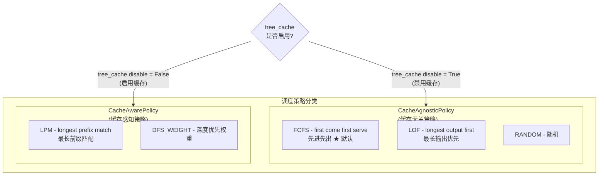
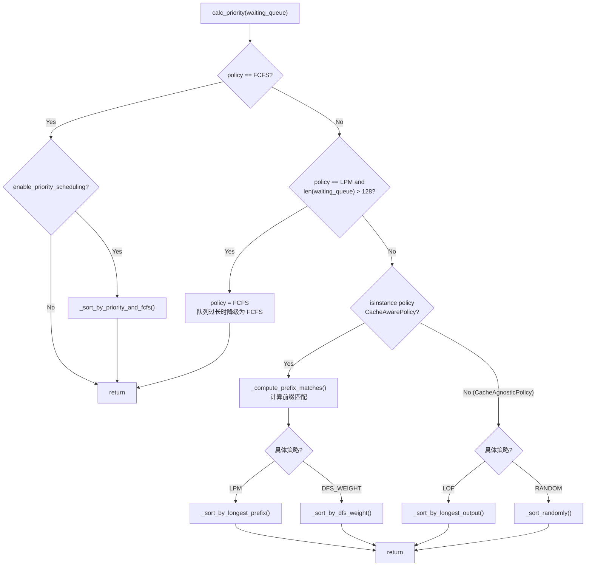
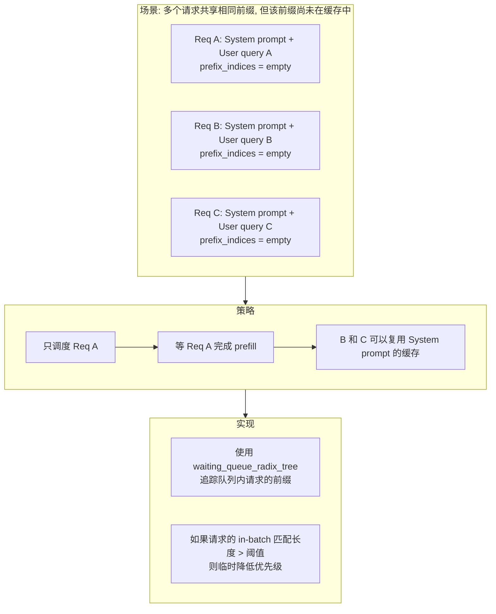
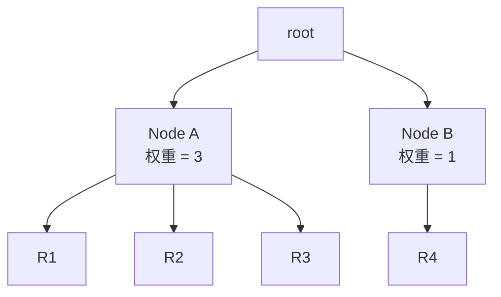
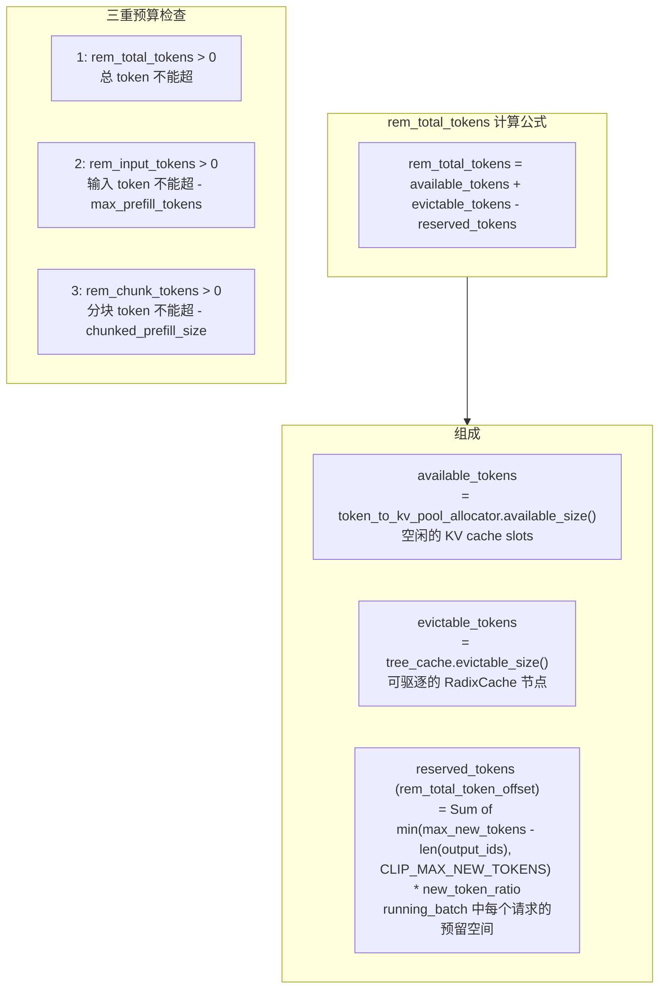
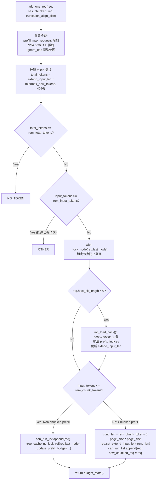
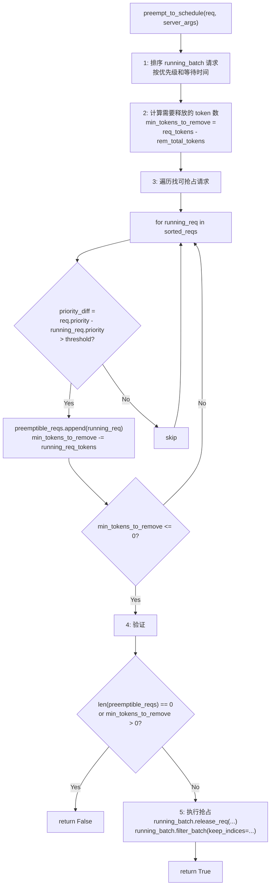

# SGLang 调度策略详解

> **默认场景**: Qwen/Qwen3-VL-235B-A22B-Thinking 多模态模型
>
> **启用特性**: PD 分离 + Chunked Prefill + ViT DP + Overlap Schedule + 多模态缓存

## 1. 调度策略概览

**文件**: `srt/managers/schedule_policy.py`

调度策略决定了 waiting_queue 中请求的执行顺序，直接影响缓存命中率和系统吞吐量。

### 1.1 策略分类



## 2. SchedulePolicy 类

**文件**: `schedule_policy.py:80`

### 2.1 初始化

```python
class SchedulePolicy:
    def __init__(
        self,
        policy: str,
        tree_cache: BasePrefixCache,
        enable_hierarchical_cache: bool,
        enable_priority_scheduling: bool,
        schedule_low_priority_values_first: bool,
    ):
        self.policy = self._validate_and_adjust_policy(policy, tree_cache)
        self.tree_cache = tree_cache
        self.enable_priority_scheduling = enable_priority_scheduling
        self.priority_sign = 1 if schedule_low_priority_values_first else -1

        # 用于 in-batch prefix caching
        self.waiting_queue_radix_tree = RadixCache.create_simulated()
```

### 2.2 calc_priority 流程



## 3. LPM 策略 (Longest Prefix Match)

优先选择与现有缓存匹配最长前缀的请求，适用于高缓存命中率场景。

### 3.1 前缀匹配计算

```python
def _compute_prefix_matches(self, waiting_queue: List[Req], policy):
    for r in waiting_queue:
        prefix_ids = r.origin_input_ids + r.output_ids
        extra_key = r.extra_key  # LoRA adapter ID 或 cache_salt

        # 查询 tree_cache 获取匹配结果
        match_result = self.tree_cache.match_prefix(
            rid=r.rid,
            key=RadixKey(token_ids=prefix_ids, extra_key=extra_key)
        )

        # 更新请求的前缀信息
        r.prefix_indices = match_result.device_indices
        r.last_node = match_result.last_device_node
        r.last_host_node = match_result.last_host_node
        r.host_hit_length = match_result.host_hit_length
```

### 3.2 排序逻辑

```python
def _sort_by_longest_prefix(waiting_queue, temporary_deprioritized):
    waiting_queue.sort(
        key=lambda r: (
            -len(r.prefix_indices)  # 前缀越长优先级越高
            if r.rid not in temporary_deprioritized
            else float("inf")  # 被降优先级的排最后
        )
    )
```

## 4. In-Batch Prefix Caching

**目的**: 避免同时调度共享前缀但没有缓存的请求，提高缓存利用率。

### 4.1 机制



### 4.2 阈值配置

```python
# 检查阈值: 现有缓存匹配 < 此值时才检查 in-batch
IN_BATCH_PREFIX_CACHING_CHECK_THRESHOLD = 32

# 降优先级阈值: in-batch 匹配 > 此值时降低优先级
IN_BATCH_PREFIX_CACHING_DEPRIORITIZE_THRESHOLD = 32
```

### 4.3 代码逻辑

```python
if len(r.prefix_indices) <= IN_BATCH_PREFIX_CACHING_CHECK_THRESHOLD:
    # 在 waiting_queue 的模拟 radix tree 中查找匹配
    match_result = self.waiting_queue_radix_tree.match_prefix(...)
    in_batch_matching_prefixes = match_result.device_indices

    if len(in_batch_matching_prefixes) >= IN_BATCH_PREFIX_CACHING_DEPRIORITIZE_THRESHOLD:
        temporary_deprioritized.add(r.rid)  # 降低优先级
    else:
        # 插入到模拟 tree 中
        self.waiting_queue_radix_tree.insert(...)
```

## 5. DFS-Weight 策略

**深度优先权重**: 按照 RadixCache 树结构进行深度优先遍历，优先调度同一分支的请求。

### 5.1 权重计算

```python
def _sort_by_dfs_weight(waiting_queue, tree_cache):
    # 1. 统计每个节点下的请求数
    last_node_to_reqs = defaultdict(list)
    for req in waiting_queue:
        last_node_to_reqs[req.last_node].append(req)

    # 2. 计算每个节点的权重 (子树中的请求总数)
    node_to_weight = defaultdict(int)
    for node in last_node_to_reqs:
        node_to_weight[node] = len(last_node_to_reqs[node])
    _calc_weight(tree_cache.root_node, node_to_weight)

    # 3. DFS 遍历，按权重排序子节点
    waiting_queue.clear()
    _get_dfs_priority(tree_cache.root_node, node_to_weight, last_node_to_reqs, waiting_queue)
```

### 5.2 DFS 遍历

```python
def _get_dfs_priority(cur_node, node_to_priority, last_node_to_reqs, q):
    # 子节点按权重降序排列
    childs = sorted(cur_node.children.values(), key=lambda x: -node_to_priority[x])

    for child in childs:
        _get_dfs_priority(child, node_to_priority, last_node_to_reqs, q)

    # 当前节点的请求加入队列
    q.extend(last_node_to_reqs[cur_node])
```

### 5.3 优势



> **权重计算**:
> - Node A 权重 = 3 (R1 + R2 + R3)
> - Node B 权重 = 1 (R4)
>
> **DFS 遍历顺序**: R1, R2, R3, R4
> 同一分支的请求连续调度，最大化缓存局部性

## 6. PrefillAdder 详解

**文件**: `schedule_policy.py:316`

PrefillAdder 负责从 waiting_queue 选择请求构建 prefill 批次。

### 6.1 核心属性

```python
class PrefillAdder:
    def __init__(self, ...):
        # Token 预算
        self.rem_input_tokens     # 剩余输入 token 预算
        self.rem_chunk_tokens     # 剩余分块 token 预算
        self.rem_total_token_offset  # 预留的 token 数

        # 结果列表
        self.can_run_list = []    # 可运行的请求
        self.preempt_list = []    # 被抢占的请求
        self.new_chunked_req = None  # 新的分块请求

        # 特殊模式
        self.is_hybrid_swa        # Sliding Window Attention
        self.is_hybrid_ssm_cache  # Mamba 缓存
```

### 6.2 Token 预算计算



**rem_total_token_offset 精确公式**:

```python
# schedule_policy.py PrefillAdder.__init__
rem_total_token_offset = 0
for req in running_batch.reqs:
    rem_total_token_offset += min(
        max(req.sampling_params.max_new_tokens - len(req.output_ids), 0),
        CLIP_MAX_NEW_TOKENS,  # 默认 4096
    )
rem_total_token_offset = int(rem_total_token_offset * new_token_ratio)
```

### 6.3 add_one_req 流程



### 6.4 _lock_node 与 Hierarchical Cache

#### `_lock_node` (schedule_policy.py:473)

`_lock_node` 是一个 **context manager**，用于在 `add_one_req` 期间锁定 RadixCache 节点，防止被缓存驱逐策略淘汰：

```python
@contextmanager
def _lock_node(self, last_node: TreeNode):
    try:
        self.tree_cache.inc_lock_ref(last_node)  # lock_ref += 1
        yield None
    finally:
        self.tree_cache.dec_lock_ref(last_node)   # lock_ref -= 1
```

**为什么需要锁**: `add_one_req` 分两步检查预算（锁前粗检查 + 锁内精确检查），获取锁后 `rem_total_tokens` 可能已改变（因为 `inc_lock_ref` 会将节点标记为不可驱逐），需要重新检查。

#### Hierarchical Cache: `init_load_back` (schedule_policy.py:606)

当启用 `enable_hicache_storage` 且请求的 `host_hit_length > 0` 时，说明在 host (CPU/SSD) 上有额外的缓存命中，需要加载回 GPU：

```python
if req.host_hit_length > 0:
    new_indices, req.last_node = self.tree_cache.init_load_back(
        req.last_host_node, req.host_hit_length
    )
    req.prefix_indices = torch.cat([req.prefix_indices, new_indices])
    req.set_extend_input_len(len(req.fill_ids) - len(req.prefix_indices))
```

**`real_input_tokens` 计算**: 初始 token 预算检查时考虑 host 命中长度：
```python
real_input_tokens = req.extend_input_len - req.host_hit_length  # 扣除 host 缓存
real_input_tokens = ceil_paged_tokens(real_input_tokens)         # 按 page_size 向上对齐
```

### 6.5 AddReqResult 状态

```python
class AddReqResult(Enum):
    CONTINUE = auto()  # 可以继续添加请求
    NO_TOKEN = auto()  # token 预算不足
    OTHER = auto()     # 其他原因停止 (批次满、对齐等)
```

## 7. Chunked Prefill 处理

> **完整专题**：Chunked Prefill 的完整生命周期、多模态分块、PD 分离场景等详见 [`05-chunked-prefill.md`](05-chunked-prefill.md)。

### 7.1 add_chunked_req

处理已经在进行 chunked prefill 的请求：

```python
def add_chunked_req(self, req: Req):
    # 计算本轮可处理的 token 数
    _rem_tokens = min(self.rem_chunk_tokens, int(self.rem_total_tokens))

    # 内存泄漏保护: 即使预算不足也必须处理 chunked_req
    if _rem_tokens <= 0:
        _rem_tokens = self.rem_chunk_tokens

    # 截断输入
    truncated = req.extend_input_len > _rem_tokens
    req.set_extend_input_len(min(req.extend_input_len, _rem_tokens))
    req.fill_ids = req.fill_ids[: len(req.prefix_indices) + req.extend_input_len]

    self.can_run_list.append(req)
    self._update_prefill_budget(...)

    # 返回 None 表示 chunked prefill 完成
    return req if truncated else None
```

### 7.2 截断对齐

```python
# 按 page_size 对齐
trunc_len = rem_chunk_tokens // page_size * page_size

# 可选: 按 truncation_align_size 对齐 (如 FlashInfer split size)
if truncation_align_size is not None:
    if trunc_len < truncation_align_size:
        return AddReqResult.OTHER
    trunc_len = truncation_align_size * (trunc_len // truncation_align_size)
```

## 8. 优先级抢占 (Priority Preemption)

**文件**: `schedule_policy.py:668`

### 8.1 preempt_to_schedule 流程



### 8.2 优先级差阈值

```python
# 只有优先级差超过阈值才允许抢占
priority_scheduling_preemption_threshold = 0  # 默认为 0

# 低优先级值优先 vs 高优先级值优先
priority_sign = 1 if schedule_low_priority_values_first else -1
```

## 9. ignore_eos 特殊处理

**场景**: `sampling_params.ignore_eos = True` 时，请求不会因 EOS token 终止。

### 9.1 add_one_req_ignore_eos

```python
def add_one_req_ignore_eos(self, req: Req):
    # 特殊的内存估算: 考虑所有请求的实际 token 生成情况
    def add_req_state(r, insert_sort=False):
        new_token_ratio = 1.0 if r.sampling_params.ignore_eos else self.new_token_ratio
        tokens_left = r.sampling_params.max_new_tokens * new_token_ratio - len(r.output_ids)
        tokens_occupied = len(r.origin_input_ids) + len(r.output_ids)
        self.req_states.append((tokens_left, tokens_occupied))

    # 按 tokens_left 排序后检查内存
    self.req_states.sort(key=lambda x: x[0])

    # 验证: 即使所有请求都生成到 max_new_tokens 也不会 OOM
    for i, (tokens_left, tokens_occupied) in enumerate(self.req_states):
        bs = len(self.req_states) - i
        min_free_tokens = cur_rem_tokens + tokens_freed - tokens_left * bs
        if min_free_tokens <= IGNORE_EOS_RESERVE_TOKENS * bs:
            return AddReqResult.NO_TOKEN
        tokens_freed += tokens_occupied
```

## 10. CLIP_MAX_NEW_TOKENS

**目的**: 防止 max_new_tokens 过大导致调度过于保守。

```python
CLIP_MAX_NEW_TOKENS = 4096  # 默认值，可通过环境变量覆盖

# 在计算 token 需求时裁剪
total_tokens = req.extend_input_len + min(
    max(req.sampling_params.max_new_tokens - len(req.output_ids), 0),
    CLIP_MAX_NEW_TOKENS,  # ← 防止过大估算
)
```

**注意**: 这只影响调度估算，不影响实际生成长度。

## 11. 关键配置参数

| 参数 | 默认值 | 环境变量 | 说明 |
|------|--------|----------|------|
| `schedule_policy` | "fcfs" | - | 调度策略 |
| `CLIP_MAX_NEW_TOKENS` | 4096 | `SGLANG_CLIP_MAX_NEW_TOKENS_ESTIMATION` | max_new_tokens 裁剪 |
| `IN_BATCH_PREFIX_CACHING_CHECK_THRESHOLD` | 32 | 同名 | In-batch 检查阈值 |
| `IN_BATCH_PREFIX_CACHING_DEPRIORITIZE_THRESHOLD` | 32 | 同名 | In-batch 降优先级阈值 |
| `priority_scheduling_preemption_threshold` | 0 | - | 抢占优先级差阈值 |

## 12. 策略选择建议

| 场景 | 推荐策略 | 原因 |
|------|----------|------|
| 通用场景 | FCFS (默认) | 先到先服务，保证公平 |
| 长队列 (>128) | 自动降级 FCFS | LPM 计算开销大 |
| 树状对话 | DFS-WEIGHT | 优化缓存局部性 |
| 公平性要求高 | FCFS | 先到先服务 |
| 优先处理长输出 | LOF | 避免长请求饥饿 |
| 禁用缓存 | FCFS | CacheAware 无意义 |

## 13. 下一步

- **05**: Chunked Prefill 分块预填充 (chunked_prefill.md)
- **06**: KV Cache 内存池设计 (memory_pool.py)
- **07**: RadixCache 前缀缓存实现 (radix_cache.py)
