# SGLang 内存池设计详解

> **默认场景**: Qwen/Qwen3-VL-235B-A22B-Thinking 多模态模型
>
> **启用特性**: PD 分离 + Chunked Prefill + ViT DP + Overlap Schedule + 多模态缓存

## 1. 内存池架构概览

**核心文件**:
- `srt/mem_cache/memory_pool.py` - GPU 内存池
- `srt/mem_cache/allocator.py` - 索引分配器
- `srt/mem_cache/memory_pool_host.py` - Host 内存池
- `srt/mem_cache/radix_cache.py` - 前缀缓存 (Tree Cache)

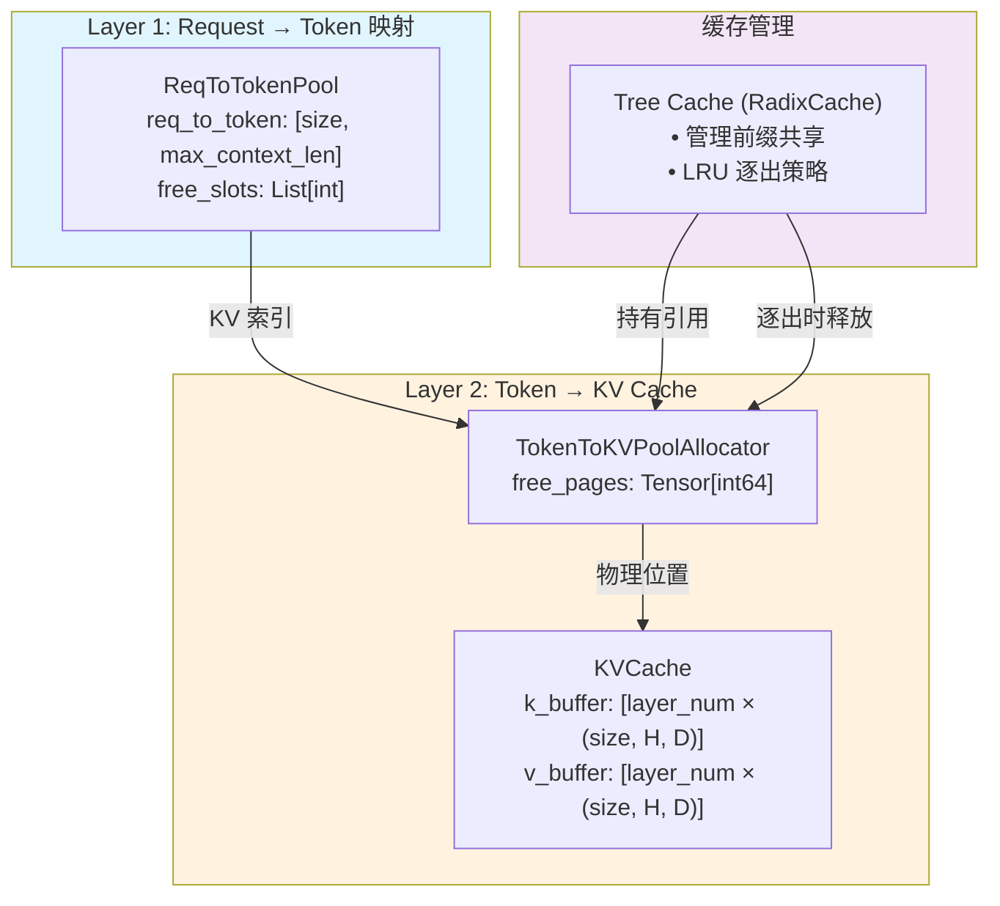

**详细架构图**:

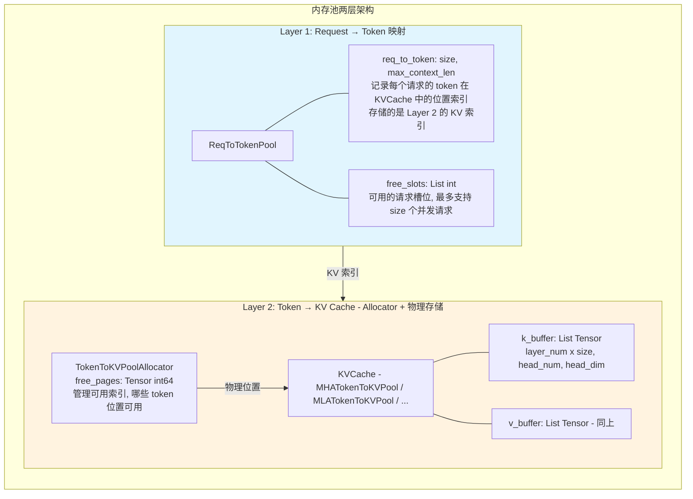

### 1.1 三者一句话定义与请求示例

| 组件 | 一句话用途 | 存储内容 |
|------|-----------|---------|
| **ReqToTokenPool** | 请求级别的"目录"：记录每个请求的每个 token 位置对应哪个 KV slot | `req_to_token[req_id, pos] → kv_slot_index`，一个 2D int32 张量 |
| **TokenToKVPoolAllocator** | 索引管理器：决定哪些 KV slot 是空闲可用的 | `free_pages: Tensor[int64]`，一个一维的空闲索引列表 |
| **KVCache (如 MHATokenToKVPool)** | 真正的物理 KV buffer：保存每层的 K/V 张量数据 | `k_buffer[layer][slot, H, D]` 和 `v_buffer[layer][slot, H, D]` |

**KVCache 是真正保存 KV 数据的物理 buffer。** Allocator 只管"哪些 slot 号可用"，ReqToTokenPool 只管"哪个请求的哪个位置对应哪个 slot 号"。三者的关系是：

```
请求来了 → ReqToTokenPool 分配一个请求行
        → Allocator 从 free_pages 分出 N 个 slot 号
        → slot 号写入 ReqToTokenPool 的对应行
        → 模型前向时，用 slot 号索引 KVCache 的物理 buffer 写入/读取 K/V
```

#### 请求示例

假设 req_0 的 prompt 有 5 个 token，prefix cache 命中了前 3 个（slot 号 [42, 17, 88]），需要新算后 2 个：

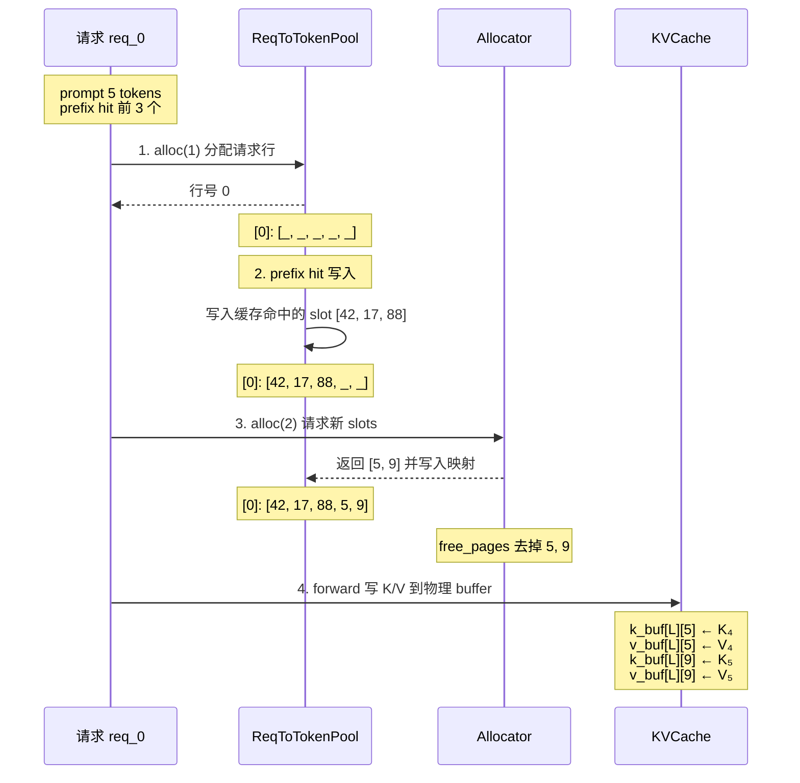


#### 调用链

**Prefill (extend) 路径：**

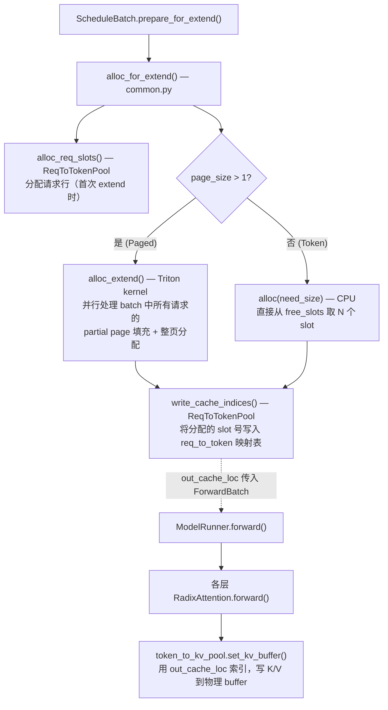

> **关键点**：`alloc_for_extend()` 阶段只是分配 slot 号并写入映射表，**物理 K/V 数据的写入**在模型前向时由每一层 Attention 的 `set_kv_buffer()` 完成。

**Decode 路径：**

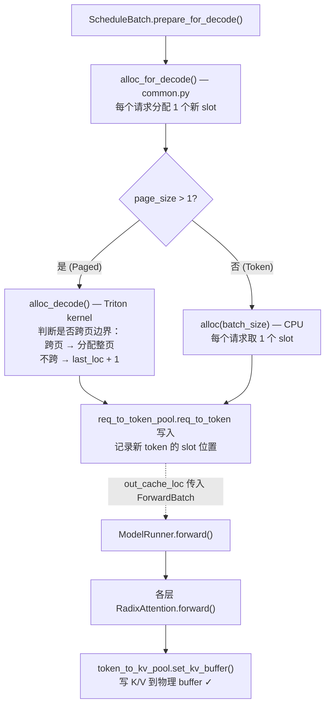

> **Decode 也调用 `set_kv_buffer()`**：和 Prefill 一样，Decode 阶段每一层 Attention 都会通过 `out_cache_loc` 把当前 step 计算出的 K/V 写入物理 buffer。区别仅在于 Decode 每个请求只写 1 个 token 的 K/V。

**释放路径：**

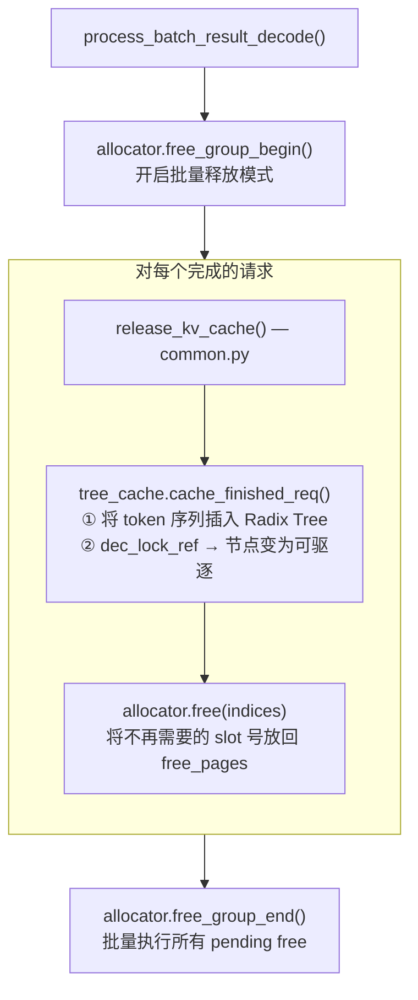

> **释放 ≠ 删除 KV**：`free()` 只是把 slot 号放回空闲列表，物理 buffer 中的旧数据不会被清零（下次 `set_kv_buffer` 会直接覆盖）。通过 `cache_finished_req()` 插入 Radix Tree 后，被缓存的 slot 不会被 free，只有 Tree Cache 驱逐时才会释放。

#### Buffer 管理和碎片

**Allocator 管的是索引号（哪些 slot 空闲），不是内存分配。** KVCache 的物理 buffer 在**启动时就全部预分配好了**（`torch.zeros`），运行时不再触发 CUDA malloc。Allocator 相当于一个"号码牌发放机"。

**free 有没有碎片？** 严格说**有逻辑碎片但不影响性能**：

```
初始:     free_pages = [1, 2, 3, 4, 5, 6, 7, 8, 9, 10]  ← 连续
alloc(3): 拿走 [1,2,3]
alloc(4): 拿走 [4,5,6,7]
free([1,2,3]): free_pages = [8, 9, 10, 1, 2, 3]          ← 不连续了！
alloc(5): 拿走 [8, 9, 10, 1, 2]                           ← 跨了"原始边界"
```

这些 slot 号在物理 buffer 上确实不连续，但**完全没关系**，因为 KV cache 的读写都是通过 scatter/gather 索引（`buffer[loc]`）进行的，不要求物理连续。这跟传统内存分配的碎片完全不同 — 传统碎片会导致"有总量但分配不出大块"，而这里**不需要大块连续分配**，只要有足够数量的空闲 slot 就行。

`page_size=1` 时就是 slot 池：可以理解为"启动时把所有 slot 号放进一个袋子里，需要就拿出来，用完就放回去"。不管 slot 号多乱，只要袋子里还有号码就能分配。

`page_size>1` 时也类似，只是粒度变成了"页号"。一个页固定包含 page_size 个连续 slot。free 时用 `torch.unique(idx // page_size)` 还原为页号放回。页内部不会有碎片（要么整页占用，要么整页空闲——除了最后一个 partial page，但那个由 alloc_extend 的 Part 1 逻辑处理）。

### 1.2 与 Tree Cache 的关系

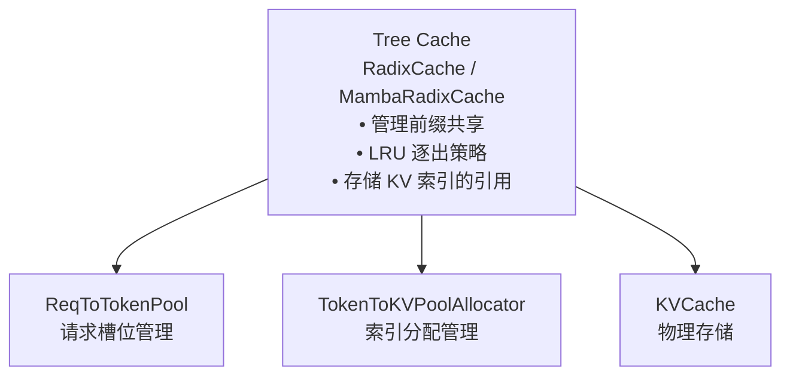

**关键理解**:
- **两层架构**: ReqToTokenPool 管理请求，TokenToKVPoolAllocator + KVCache 管理 Token 存储
- **Tree Cache** 不是内存池的一部分，而是**上层的缓存管理策略**
  - Tree Cache 持有 KV 索引的「引用」
  - 当 Tree Cache 逐出节点时，调用 `token_to_kv_pool_allocator.free()` 释放索引

## 2. ReqToTokenPool

**文件**: `memory_pool.py:78`

管理请求 ID 到 token 位置的映射，请求级别，每个slot里面是该请求上下午长度的token id 在kv中的位置

### 2.1 数据结构

```python
class ReqToTokenPool:
    def __init__(self, size, max_context_len, device, enable_memory_saver):
        # 核心张量: [请求数, 最大上下文长度]
        self.req_to_token = torch.zeros(
            (size, max_context_len), dtype=torch.int32, device=device
        )
        # 可用请求槽位
        self.free_slots = list(range(size))
```

### 2.2 核心操作

| 方法 | 功能 |
|------|------|
| `alloc(need_size)` | 分配 N 个请求槽位 |
| `free(free_index)` | 释放请求槽位 |
| `write(indices, values)` | 写入 token 位置映射 |

## 3. KVCache 变体

### 3.1 类继承关系

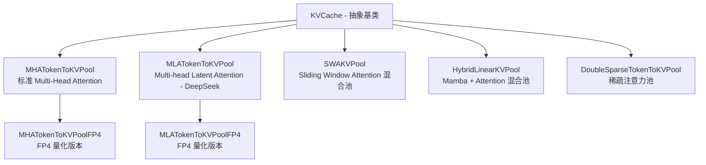

### 3.2 MHATokenToKVPool

**标准的 Multi-Head Attention KV Cache**

```python
class MHATokenToKVPool(KVCache):
    def __init__(self, size, page_size, dtype, head_num, head_dim, layer_num, ...):
        self.k_buffer = [
            torch.zeros((size + page_size, head_num, head_dim), dtype=store_dtype)
            for _ in range(layer_num)
        ]
        self.v_buffer = [
            torch.zeros((size + page_size, head_num, v_head_dim), dtype=store_dtype)
            for _ in range(layer_num)
        ]
```

> **为什么是 `size + page_size` 而不是 `size`？**
>
> 1. **索引 0 是 dummy slot**：用于 padding 填充（ForwardBatch 中 `out_cache_loc` 对 padding 请求填 0，指向这个 dummy）。
> 2. **page-aligned 访问的安全边界**：当 `page_size > 1` 时，Attention kernel 可能以 page 为粒度读写 KV buffer（一次访问 `page_size` 个连续 slot）。如果 buffer 正好只有 `size` 个 slot，对最后一个 page 的访问可能越界。多分配 `page_size` 个 slot 作为安全边界，确保 `buffer[last_page_start : last_page_start + page_size]` 不会 out-of-bounds。
> 3. **当 `page_size=1` 时**：只多分配 1 个 slot（dummy slot 本身），几乎无额外开销。

**内存布局**:
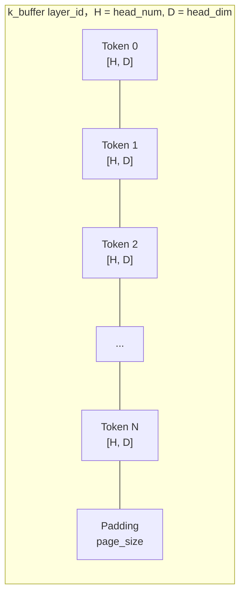

### 3.3 MLATokenToKVPool

**Multi-head Latent Attention (DeepSeek-V2 模型)**

```python
class MLATokenToKVPool(KVCache):
    def __init__(self, ..., kv_lora_rank, qk_rope_head_dim, ...):
        self.kv_lora_rank = kv_lora_rank
        self.qk_rope_head_dim = qk_rope_head_dim

        # MLA 使用压缩的 KV 表示
        # Shape: [size, kv_lora_rank + qk_rope_head_dim]
        self.kv_buffer = [Å
            torch.zeros((size + page_size, kv_lora_rank + qk_rope_head_dim), ...)
            for _ in range(layer_num)
        ]
```

**优势**: 通过低秩压缩大幅减少 KV 缓存内存

### 3.4 SWAKVPool

**Sliding Window Attention 混合池**

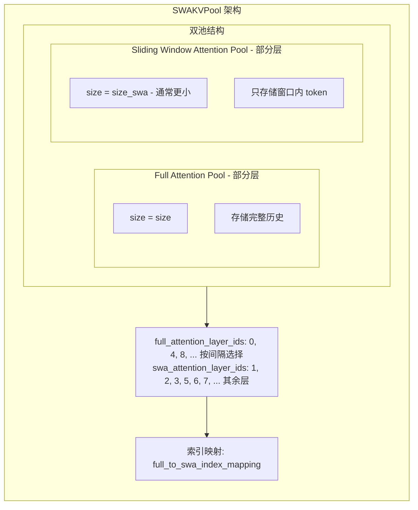

### 3.5 HybridLinearKVPool

**Mamba + Attention 混合模型 (Mamba2, Falcon-Mamba, Bamba 等)**

> **重要**: 当模型包含 Mamba 层 (通过 `hybrid_gdn_config` 或 `mamba2_config` 检测) 时，
> SGLang 使用此池来同时管理 Attention 层的 KV Cache 和 Mamba 层的 SSM 状态。

```python
class HybridLinearKVPool(KVCache):
    def __init__(self, ..., full_attention_layer_ids, mamba_pool, ...):
        # 仅 Full Attention 层使用 KV Cache
        self.full_kv_pool = MHATokenToKVPool(
            layer_num=len(full_attention_layer_ids),  # 只为 Attention 层分配
            ...
        )
        # 映射: layer_id → 在 full_kv_pool 中的索引
        self.full_attention_layer_id_mapping = {
            id: i for i, id in enumerate(full_attention_layer_ids)
        }
        # Mamba 层使用 SSM 状态存储 (由 HybridReqToTokenPool 管理)
        self.mamba_pool = mamba_pool  # 来自 HybridReqToTokenPool
```

**架构详解**:

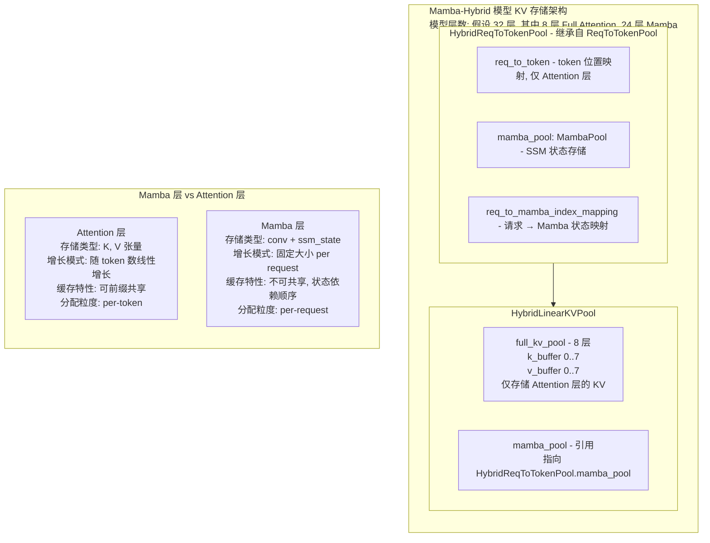

**MambaRadixCache 的特殊处理**:

普通 RadixCache 只需管理 KV 索引，而 MambaRadixCache 需要同时管理:

```python
class TreeNode:  # mamba_radix_cache.py
    def __init__(self):
        self.key = ...                # token IDs
        self.value = ...              # KV 索引 (Attention 层)
        self.mamba_value = ...        # Mamba 状态索引
        # 双锁机制
        self.full_lock_ref = 0        # 保护 KV Cache
        self.mamba_lock_ref = 0       # 保护 Mamba 状态
```

**为什么需要双锁?**
- Mamba 状态是**顺序依赖**的，不同请求即使前缀相同也需要不同的 Mamba 状态副本
- 因此 `mamba_lock_ref` 和 `full_lock_ref` 分开管理，允许独立逐出

## 4. Allocator 分配器

### 4.1 TokenToKVPoolAllocator

**基础分配器，无分页**

```python
class TokenToKVPoolAllocator(BaseTokenToKVPoolAllocator):
    def __init__(self, size, dtype, device, kvcache, need_sort):
        self.page_size = 1  # 无分页，每次分配单个 token

    def alloc(self, need_size: int):
        if need_size > len(self.free_pages):
            return None
        select_index = self.free_pages[:need_size]
        self.free_pages = self.free_pages[need_size:]
        return select_index

    def free(self, free_index: torch.Tensor):
        self.free_pages = torch.cat((self.free_pages, free_index))
```

### 4.2 PagedTokenToKVPoolAllocator

**分页分配器，支持 extend/decode 优化**


#### 4.2.1 为什么 Paged 版本需要 alloc_extend / alloc_decode？

**核心原因：page 对齐。** 当 page_size=1 时，每个 token 就是一个独立 slot，`alloc(N)` 直接拿 N 个就行。但 page_size>1 时（如 16 或 64），会出现三个普通版不需要考虑的问题：

1. **部分页填充**：请求可能上次 prefill 只用了某页的一半，extend 时要先填满这半页（用 `last_loc` 定位）
2. **跨页边界**：decode 时新增 1 个 token，如果恰好跨页边界就需要分配整页，否则直接 `last_loc+1`
3. **批量页分配**：多个请求各需要不同数量的新页，用 Triton kernel（`allocator.py:302` / `allocator.py:382`）并行计算每个请求的需求然后一次分配

```
page_size=1:  alloc(7) → 拿 7 个 slot，完事
page_size=4:  extend 场景示例:
  请求已有 seq_len=6, 已占用 slot [0,1,2,3, 4,5]
                                    ─page 0─  ─page 1(部分)─
  page 1 有 4 个 slot [4,5,6,7]，已用 2 个(4,5)，还剩 2 个空位(6,7)

  现在要 extend 7 tokens（extend_len = seq_len_new - prefix_len）:
    Part 1: 填充 page 1 剩余 2 个空位 → slot [6, 7]           (2 tokens)
    Part 2: 分配完整新页 → 1 整页 × 4 slots → page 3 → [12,13,14,15] (4 tokens)
            (page 2 可能已被其他请求占用，分配器跳过)
    Part 3: 剩余 1 token 开新页 → page 5 → slot [20]          (1 token)
            (page 5 的剩余 3 个空位留给后续 decode)
  → 返回的新分配 indices: [6, 7, 12, 13, 14, 15, 20] = 7 slots ✓
```

> **为什么需要 Triton kernel？**
>
> 这不只是"Python 循环慢"的问题。**核心原因是 batch 中每个请求的分配需求都不一样**（有的缺 1 个填满旧页，有的缺 3 个；有的需要 2 个新页，有的只需 0 个）。用 Triton kernel 可以在 GPU 上**并行计算所有请求的需求量**（Part 1/2/3 各需多少 slot），然后通过 `prefix_sum` 一次性从 `free_pages` 中分配，避免逐请求串行处理。`alloc_extend` 的 Triton kernel（`allocator.py:302`）和 `alloc_decode` 的 Triton kernel（`allocator.py:382`）都是这个模式。

### 4.3 SWATokenToKVPoolAllocator

**双池分配器，同时管理 Full 和 SWA 池**

```python
class SWATokenToKVPoolAllocator(BaseTokenToKVPoolAllocator):
    def __init__(self, size, size_swa, ...):
        self.full_attn_allocator = TokenToKVPoolAllocator(size, ...)
        self.swa_attn_allocator = TokenToKVPoolAllocator(size_swa, ...)
        self.full_to_swa_index_mapping = torch.empty(size + size_swa + 1, ...)

    def alloc(self, need_size):
        # 同时从两个池分配
        alloc_full_indices = self.full_attn_allocator.alloc(need_size)
        alloc_swa_indices = self.swa_attn_allocator.alloc(need_size)
        # 建立映射
        self.full_to_swa_index_mapping[alloc_full_indices] = alloc_swa_indices
        return alloc_full_indices
```

## 5. MambaPool 与 Mamba 状态管理

### 5.1 MambaPool 数据结构

**文件**: `memory_pool.py:128`

```python
class MambaPool:
    @dataclass
    class State:
        conv: List[torch.Tensor]   # 卷积状态
        temporal: torch.Tensor     # SSM 状态

    def __init__(self, size, cache_params, ...):
        # Shape: [num_mamba_layers, size + 1, conv_shape...]
        self.mamba_cache = self.State(
            conv=[torch.zeros((num_layers, size+1) + conv_shape) for ...],
            temporal=torch.zeros((num_layers, size+1) + temporal_shape)
        )
```

### 5.2 Mamba State vs KV Cache 的核心区别

| 特性 | KVCache | MambaPool |
|------|---------|-----------|
| 存储内容 | K, V 张量 | conv + SSM temporal 状态 |
| 增长模式 | 随 token 线性增长 (append-only) | 固定大小 (滚动更新) |
| 分配粒度 | per-token | per-request |
| Prefix 共享 | 可在任意 token 位置断开/复用 | 只能在 checkpoint 位置接续 |
| 更新方式 | 新 token 追加，旧 token 保留 | 每处理一个 token，原地更新 |

**一个请求只有一个 Mamba 状态，并且是滚动更新的。** 每处理一个 token，conv state 和 SSM temporal state 都会原地更新（像 RNN 的 hidden state）。不像 KV cache 是"append only"的。

```
KV Cache:  token 1 → [K1,V1], token 2 → [K1,V1,K2,V2], ... → 逐个追加
Mamba:     token 1 → state_1, token 2 → state_2 (覆盖), ... → 滚动替换
```

### 5.3 Prefix Cache + Mamba：Checkpoint 对齐问题

Mamba 状态和 KV Cache 状态是**相互独立**的。KV Cache 是每个 token 都有，可以任意截断。但 Mamba 状态（Conv state + SSM state）是**Block 级别不可分割**的。

SGLang 中 Mamba 状态的 checkpoint 保存由两个参数控制，它们的用途不同：

| 参数 | 值 | 作用域 | 用途 |
|------|-----|--------|------|
| `FLA_CHUNK_SIZE` | 64 | **Prefill** | Flash Linear Attention 算法的 chunk 粒度。Prefill 时在每个 chunk 边界（64 的倍数位置）可以产生 Mamba checkpoint。这是**算法层面的最小对齐单位**。 |
| `mamba_track_interval` | 256 (默认) | **Decode** | Decode 阶段 checkpoint 保存频率。每当 `seq_len % 256 == 0`（`schedule_batch.py:1930`）时触发 checkpoint 保存。**必须是 FLA_CHUNK_SIZE 的整数倍**（256 = 64 × 4）。 |

**两者的关系**：
- `FLA_CHUNK_SIZE` 是底层算法约束，决定 checkpoint 的**最小可能间隔**
- `mamba_track_interval` 是上层策略选择，决定 Decode 阶段**实际保存间隔**（更大间隔 = 更少 MambaPool 占用，但 prefix miss 时重算代价更大）
- Prefill 阶段的 checkpoint 位置由 `(extend_input_len // FLA_CHUNK_SIZE) * FLA_CHUNK_SIZE` 计算（`schedule_batch.py:1638`）

**有效前缀长度** = `min(KV Cache 命中长度, 最近有效的 Mamba Checkpoint 位置)`
- KV Cache 命中是 per-token 粒度，可以精确到任意位置
- Mamba checkpoint 命中只能在上述对齐位置，两者**取 min** 得到真正可复用的前缀长度

#### 场景 1：prefix cache 了 230 tokens

```
Radix Tree 节点：[tokens 0..229] → 有 KV cache indices
但 Mamba checkpoint 只在 FLA_CHUNK_SIZE 对齐位置有效

230 不是 64 的整数倍 (230 / 64 = 3.59)
最近的 checkpoint 位置 = floor(230 / 64) × 64 = 192

结果：
  - KV cache 命中 230 tokens ✓
  - Mamba 状态只在 position 192 处有 checkpoint
  - 有效 prefix = 192 tokens（取 min）
  - tokens 192..229 需要重新计算 Mamba 状态（但可以复用 KV cache）
```

#### 场景 2：prefix cache 了 280 tokens

```
280 / 64 = 4.375
最近的 checkpoint = floor(280 / 64) × 64 = 256

两种情况:
(a) 如果节点在 256 位置有 mamba_value:
    - 有效 prefix = 256 tokens（mamba checkpoint 所在位置）
    - tokens 256..279 复用 KV，但需要重新跑 Mamba 层

(b) 如果 256 位置的节点是 tombstone（mamba_value 被 evict 了）:
    - 继续往回找最近的有 mamba_value 的节点
    - 比如 192 位置有，那有效 prefix = 192
    - tokens 192..279 需要重新跑 Mamba 层
```

这就是 `_match_prefix_helper`（`mamba_radix_cache.py:900`）中 `best_value_len` / `best_last_node` 的逻辑：沿着 radix tree 走到最远的 KV 匹配，但只返回到**最深的有 mamba_value 的节点**位置。

#### Mamba Prefix Matching 完整示例

```
Radix Tree (MambaRadixCache):

      [root] mamba=None
        |
   [node A: tokens 0..191]     mamba=slot_3 ← checkpoint @ 192
        |
   [node B: tokens 192..255]   mamba=None   ← TOMBSTONE (已evict)
        |
   [node C: tokens 256..319]   mamba=slot_7 ← checkpoint @ 320

新请求: prompt = tokens 0..279

match_prefix 结果:
  KV match = 280 tokens (走到 node C 的一部分)
  best_last_node = node A (最深的有 mamba_value 的节点)
  有效 prefix = 192 tokens
  mamba_branching_seqlen = 192

处理:
  1. COW: 复制 node A 的 mamba state (slot_3) → 请求私有 slot
     (cow_mamba=True, mamba_radix_cache.py:424)
  2. Prefill tokens 192..279:
     - Attention 层: tokens 192..279 的 KV 已缓存(复用)，不需要重算
     - Mamba 层: 从 position 192 的 checkpoint 开始，重新跑 tokens 192..279 更新 state
  3. 在 FLA_CHUNK_SIZE 对齐位置保存新 mamba checkpoint
```

### 5.4 KV Cache 和 Mamba 的管理关系

**独立管理，但 prefix 匹配时取 min。**

1. **存储层面**：完全独立
   - KV cache → `TokenToKVPoolAllocator` + `KVCache` 物理 buffer
   - Mamba state → `MambaPool`（独立的 slot 池，`memory_pool.py:128`）
   - 显存预算按比例分配：`mamba_full_memory_ratio = 0.9`（默认 Mamba 占剩余显存的 90%）

2. **逐出层面**：独立的双 LRU 链表
   - `full_lru_list`：管 KV cache 的逐出
   - `mamba_lru_list`：管 Mamba state 的逐出
   - 可以只逐出 Mamba（创建 tombstone），KV 保留

3. **前缀匹配层面**：取 min
   - `_match_prefix_helper` 返回的有效前缀长度 = min(KV 匹配长度, 最深 mamba checkpoint 位置)

### 5.5 Ping-Pong Buffer 机制

当 `mamba_scheduler_strategy == "extra_buffer"` 时，每个请求分配 **2 个** mamba state buffer，交替读写：

```
Chunk N:   读 buffer[0], 写 buffer[1]
Chunk N+1: 读 buffer[1], 写 buffer[0]   ← 由 get_mamba_ping_pong_other_idx 切换
```

**目的**：支持 chunked prefill 的 overlap schedule。在计算当前 chunk 时，上一个 chunk 的 state 仍然可读（用于 Post Schedule 阶段缓存到 radix tree），不会因写操作被破坏。

相关字段（`schedule_batch.py` Req 类）：
- `mamba_pool_idx`: 在 MambaPool 中的 slot 索引
- `mamba_ping_pong_track_buffer`: `Tensor[2]` — 两个交替 buffer 的索引
- `mamba_next_track_idx`: 0 或 1，当前写目标
- `mamba_last_track_seqlen`: FLA_CHUNK_SIZE 对齐的已保存位置
- `mamba_branching_seqlen`: prefix cache 匹配后的有效 mamba 位置

### 5.6 Cache Hit 率与设计权衡

**Mamba 开启后有效前缀命中率会下降**，原因：

1. **Checkpoint 粒度限制**：只在 64 的倍数位置有有效 checkpoint，不像 KV 可以精确到每个 token
2. **Mamba state 更容易被 evict**：每个 checkpoint 的存储成本远大于对应数量的 KV token（固定大小的 conv+SSM state），mamba pool 容量有限
3. **每个请求需要 3 个 mamba slot**（running + 2 ping-pong），进一步限制可缓存的 checkpoint 数量

**显存分配 Trade-off**：

| 策略 | 效果 | 代价 |
|------|------|------|
| 增加 mamba cache 容量 | 更多 checkpoint → 更高命中率 | KV cache 容量下降 → 可并发请求数减少 |
| 减少 mamba track interval | 更频繁 checkpoint → 更细粒度匹配 | 每个请求需要更多 checkpoint slot |
| 提高 `mamba_full_memory_ratio` | 更多 mamba 显存 | 更少 KV 显存 |

**Tombstone 机制的设计本质**：

这是 Mamba/SSM 模型的**本质限制**带来的妥协：
- KV cache 天然是 append-only 的，可以在任意 token 位置断开/复用
- Mamba state 是**递归累积**的，必须从某个 checkpoint 开始才能继续（就像 RNN 的 hidden state）
- Tombstone 机制：KV cache 保留（注意力层还能用），mamba state 按需 evict/recompute
- **本质上是用"重算 mamba state 的计算成本"换"减少显存占用"**

## 6. Host 内存池 (Hierarchical Cache)

**文件**: `memory_pool_host.py`

### 6.1 HostKVCache

```python
class HostKVCache:
    def __init__(self, device_pool, host_to_device_ratio, host_size, ...):
        # Host 端 KV 缓存 (CPU 或 pinned memory)
        self.k_buffer = []
        self.v_buffer = []

    def load_to_device_per_layer(self, device_pool, host_indices, device_indices, layer_id):
        # 从 Host 加载到 Device (per-layer for overlap)
        pass

    def backup_from_device_all_layer(self, device_pool, host_indices, device_indices):
        # 从 Device 备份到 Host
        pass
```

### 6.2 层级缓存架构

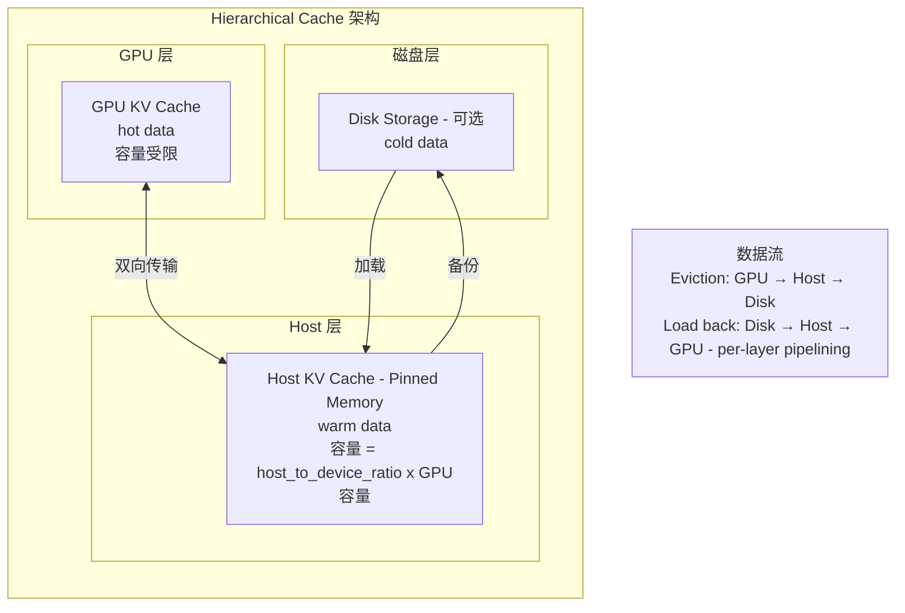

## 7. 内存分配流程

### 7.1 Prefill 分配

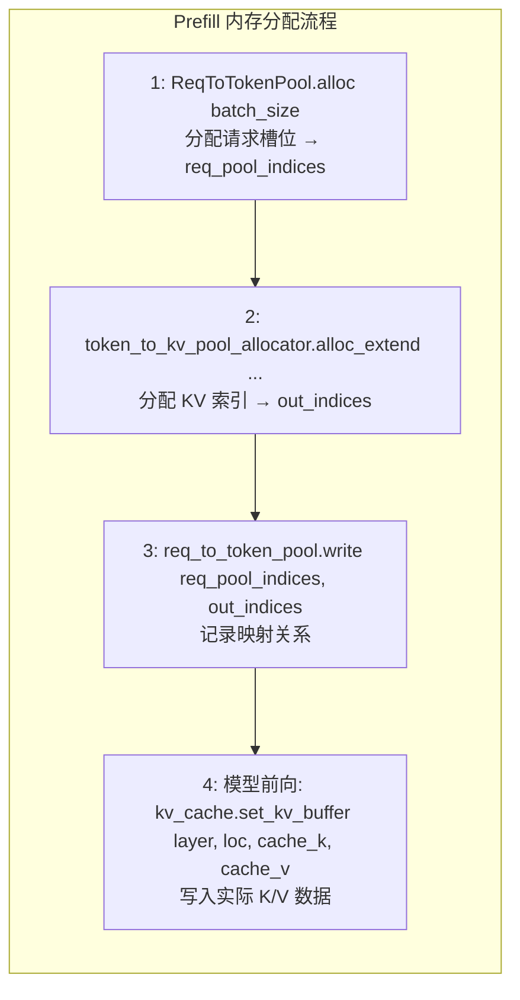

### 7.2 Decode 分配

```python
# 每个请求只需 1 个新 token
out_indices = token_to_kv_pool_allocator.alloc_decode(
    seq_lens=batch.seq_lens,
    last_loc=batch.last_loc,
)
```

## 8. 关键配置参数

| 参数 | 默认值 | 说明 |
|------|--------|------|
| `mem_fraction_static` | 0.9 | 静态内存分配比例 |
| `page_size` | 16 | 分页大小 |
| `kv_cache_dtype` | auto | KV 缓存数据类型 |
| `host_to_device_ratio` | 0 | Host 缓存比例 |

## 9. 内存优化技术

### 9.1 Memory Saver

```python
# 延迟分配 GPU 内存
memory_saver_adapter = TorchMemorySaverAdapter.create(enable=enable_memory_saver)
with memory_saver_adapter.region(GPU_MEMORY_TYPE_KV_CACHE):
    self.k_buffer = torch.zeros(...)
```

### 9.2 Custom Memory Pool (NVLink)

```python
# 用于 PD 分离的自定义内存池
self.enable_custom_mem_pool, self.custom_mem_pool, _ = maybe_init_custom_mem_pool(device)
with torch.cuda.use_mem_pool(self.custom_mem_pool):
    # 分配可以跨 GPU 高效传输的内存
```

## 10. 显存占用分析与 OOM 机制

### 10.1 显存占用分类

| 类别 | 分配时机 | 是否预分配 | 生命周期 |
|------|---------|-----------|---------|
| 模型权重 | 启动时 | ✅ 静态 | 全程常驻 |
| KV Cache | 启动时 | ✅ 静态 | 全程常驻 |
| 模型激活 | 前向时 | ❌ 动态 | 单次 forward |
| ViT 激活 | 图片处理时 | ❌ 动态 | 图片处理期间 |
| 图片像素 | 请求到达时 | ❌ 动态 | 请求处理期间 |
| 多模态 embedding | ViT 后 | ⚠️ 缓存 | LRU 管理 |

### 10.2 静态显存 (启动时分配)

#### 模型权重

```python
# 加载模型时一次性分配
model = AutoModelForCausalLM.from_pretrained(...)
# 权重大小 ≈ 参数量 × bytes_per_param
```

#### KV Cache

```python
# memory_pool.py - 启动时预分配
self.k_buffer = [torch.zeros((size + page_size, head_num, head_dim), ...) for _ in range(layer_num)]
self.v_buffer = [torch.zeros((size + page_size, head_num, head_dim), ...) for _ in range(layer_num)]
```

**计算公式**:
```
KV Cache 大小 = 2 × layers × max_tokens × num_kv_heads × head_dim × bytes_per_elem
```

**关键理解**: KV cache 物理内存**启动时一次性分配完毕**，运行时 allocator 只管理索引，不触发 CUDA allocator。

### 10.3 动态显存 (运行时分配)

#### 模型激活

- **Attention**: Q/K/V 投影、attention scores、softmax 中间结果
- **FFN/MoE**: 上投影、激活函数、下投影中间结果
- **大小**: 与 `batch_size × seq_len` 成正比

#### ViT 激活 (多模态)

```python
# 处理图片时的中间激活
pixel_values = image.to(cuda)  # 动态分配
vit_embeddings = vit_model(pixel_values)  # 中间激活
```

**风险场景**:
- 超大图片 (4K+) → patch 数量多 → ViT 激活大
- 多图请求 → 累积激活

#### 图片像素到 CUDA

```python
# mm_utils.py - 请求处理时
pixel_values = pixel_values.to(device)  # 动态拷贝到 GPU
```

### 10.4 OOM 类型对比

#### SGLang 逻辑 OOM (KV Cache)

**特点**: 可检测、可恢复

```python
# allocator.py - 返回 None 而非触发 CUDA 错误
def alloc(self, need_size: int):
    if need_size > len(self.free_pages):
        return None  # ← 逻辑层面的 "OOM"
    ...
```

**检测点**:

| 阶段 | 检测函数 | 处理方式 |
|------|---------|---------|
| Prefill 调度 | `PrefillAdder.rem_total_tokens` | 拒绝新请求 |
| Decode 阶段 | `batch.check_decode_mem()` | 触发 Retraction |

#### 真正的 CUDA OOM

**特点**: 无法提前检测、进程崩溃

| 场景 | 原因 | SGLang 防护 |
|------|------|------------|
| 模型激活过大 | batch_size × seq_len 过大 | `max_running_requests`, `max_prefill_tokens` 间接限制 |
| ViT 激活过大 | 超大图片 | 无精确限制 |
| 碎片累积 | PyTorch allocator 碎片 | 依赖 PyTorch 自身整理 |

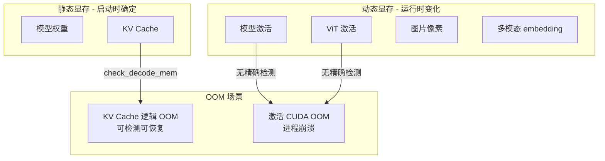

### 10.5 OOM 预防机制

#### 核心问题

真正的 CUDA OOM **原则上不可完全避免**，因为动态显存（activation、ViT 激活等）的实际大小取决于:
- 输入图片的实际分辨率/数量
- 模型的实际计算路径
- PyTorch allocator 的行为

**没有精确的运行时检测机制**，只能靠启动时的估算。

#### 自动估算机制

SGLang 会根据 GPU 型号**自动计算**关键参数，用户通常不需要手动指定：

```python
# server_args.py:909-951 - 自动计算 mem_fraction_static

reserved_mem = 512  # 元数据常量 (MB)

# 1. Activation 预留: chunked_prefill_size × 1.5 GB
#    系数 1.5 是经验值，未来可通过 dummy run 更精确估算
reserved_mem += max(chunked_prefill_size, 2048) * 1.5

# 2. CUDA Graph 预留: cuda_graph_max_bs × 2 GB
reserved_mem += cuda_graph_max_bs * 2

# 3. 并行度调整
reserved_mem += tp_size * pp_size / 8 * 1024

# 4. DP Attention 额外开销
if enable_dp_attention:
    reserved_mem += cuda_graph_max_bs * dp_size * 3

# 5. 投机解码额外开销
if speculative_algorithm == "STANDALONE":
    reserved_mem += 6 * 1024

# 最终计算
mem_fraction_static = (gpu_mem - reserved_mem) / gpu_mem
```

#### GPU 型号 → 默认配置

| GPU 显存 | 代表型号 | chunked_prefill_size | cuda_graph_max_bs |
|----------|----------|---------------------|------------------|
| < 20GB | T4, 4080 | 2048 | 8 |
| 20-35GB | A10, 4090, 5090 | 2048 | 24 (TP<4) / 80 |
| 35-60GB | A100-40G, L40 | 4096 | 32 (TP<4) / 160 |
| 60-90GB | H100, A100-80G | 8192 | 256 (TP<4) / 512 |
| 90-160GB | H20, H200 | 8192 | 256 (TP<4) / 512 |
| > 160GB | B200, MI300 | 16384 | 512 |

#### VLM 额外调整

多模态模型需要额外降低 `mem_fraction_static`：

```python
# server_args.py:4877-4913 - adjust_mem_fraction_for_vlm

# 基础降低系数
base_mem_fraction_reduction_ratio = 0.95

# 根据 ViT 复杂度动态调整 (0.8 ~ 1.05)
current_complexity = vit_num_layers * (vit_hidden_size ** 2)
baseline_complexity = 24 * (1024 ** 2)  # ViT-L/14
complexity_ratio = current_complexity / baseline_complexity

# 每增长 100% 复杂度，降低 10%
dynamic_adjustment_factor = 1.0 - 0.1 * (complexity_ratio - 1.0)
dynamic_adjustment_factor = clamp(dynamic_adjustment_factor, 0.8, 1.05)

# 最终调整
mem_fraction_static *= 0.95 * dynamic_adjustment_factor
```

#### 用户可调参数

| 参数 | 作用 | 使用场景 |
|------|------|----------|
| `--mem-fraction-static 0.75` | 降低 KV Cache 占比，预留更多动态空间 | 自动估算不准时手动调低 |
| `--chunked-prefill-size 2048` | 限制单次 prefill token 数 | 减少 activation 峰值 |

#### 预防策略决策树

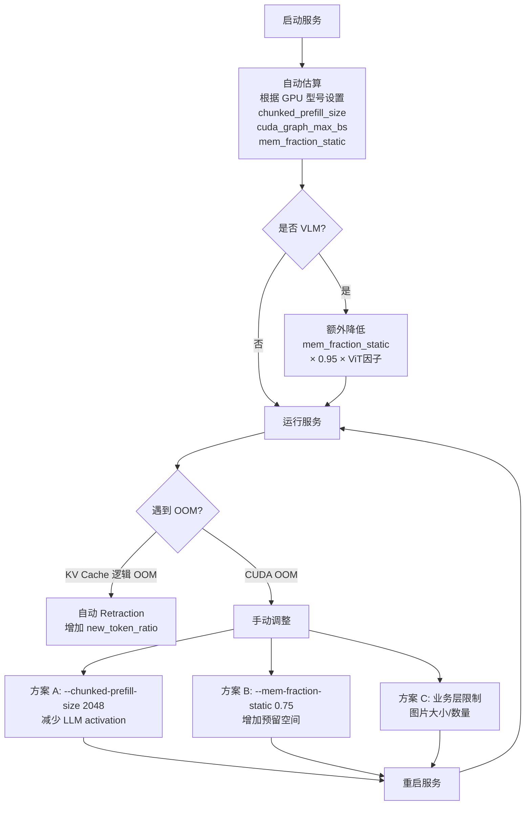

#### 核心结论

1. **逻辑 OOM (KV Cache)**: 有检测、有恢复 → Retraction 机制自动处理
2. **真正 CUDA OOM (Activation)**: 无精确检测 → 只能靠经验估算 + 手动调参
3. **没有银弹**: VLM 的图片大小/数量不可预测，只能通过经验调参或业务层限制

### 10.6 碎片问题

#### KV Cache: 逻辑碎片无害

基于页的分配，页大小固定:

```
初始:        free_pages = [1, 2, 3, 4, 5, 6, 7, 8, 9, 10]  ← 连续
alloc(3):    拿走 [1,2,3]
alloc(4):    拿走 [4,5,6,7]
free([1,2,3]): free_pages = [8, 9, 10, 1, 2, 3]            ← 不连续了！
alloc(5):    拿走 [8, 9, 10, 1, 2]                           ← 跨了"原始边界"
```

这些 slot 号在物理 buffer 上确实不连续，但**完全没关系**：

| 传统内存碎片 | KV Cache "碎片" |
|-------------|----------------|
| 有总量但分配不出大块连续空间 | 只需要有足够**数量**的空闲 slot |
| `malloc(1MB)` 可能因碎片失败 | `alloc(100)` 只要 `len(free_pages) >= 100` |
| 读写依赖连续地址 | 读写通过 scatter/gather 索引 `buffer[loc]` |

**本质区别**：KV cache 的访问模式是 `buffer[scattered_indices]`，不要求物理连续，所以"碎片"不影响分配效率也不影响读写性能。

`page_size>1` 时也类似，粒度变成"页号"。free 时 `torch.unique(idx // page_size)` 还原为页号放回。页内不会有碎片（整页分配/整页回收），partial page 由 alloc_extend 的 Part 1 逻辑处理。

#### 多模态 embedding: 可能有碎片

```python
# multimodal_cache.py - 动态分配
class MultiModalStaticCache:
    def set(self, mm_hash, embedding, ...):
        while self.current_size + data_size > self.max_size:
            self.mm_cache.popitem(last=False)  # 驱逐 LRU
        self.mm_cache[mm_hash] = embedding  # 每个 tensor 独立分配
```

不同大小图片的 embedding 动态分配/释放，可能产生 CUDA allocator 碎片，但通常不严重:
- PyTorch CUDA allocator 有碎片整理机制
- embedding 相比 KV cache 较小
- `max_size` 限制了缓存总量

### 10.7 显存监控

```python
# 运行时监控
torch.cuda.memory_allocated()      # 当前分配
torch.cuda.memory_reserved()       # 当前保留 (含 allocator 缓存)
torch.cuda.max_memory_allocated()  # 峰值

# SGLang metrics
stats.kv_cache_usage      # KV Cache 使用率
stats.running_req_count   # 运行请求数
```

## 11. 下一步

- **06**: RadixCache 前缀缓存 (radix_cache.py)
- **07**: ModelRunner 与 CUDA Graph
