# SGLang RadixCache 前缀缓存详解

> **默认场景**: Qwen3.5 混合架构模型（Full Attention + Linear Attention/GatedDeltaNet + MoE + MTP）
>
> **启用特性**: PD 分离 + Chunked Prefill + ViT DP + Overlap Schedule + 多模态缓存 + EPLB + MTP + 线性注意力

## 本章定位
- 主题范围: RadixCache 命中、锁与驱逐。

## 设计 Why（为什么这么设计）
- 前缀树缓存提升复用率，但必须与锁和驱逐策略协同。
- 核心取舍: 吞吐 vs 时延、显存 vs 计算、通用性 vs 特化。

## 阅读建议（进阶）
1. 先抓目标函数和边界条件，再读具体实现。
2. 先看调用链和状态变化，再看局部优化细节。
3. 源码锚点以“路径 + 类/函数”为主，避免依赖易漂移行号。

## 1. RadixCache 概览

**核心文件**:
- `python/sglang/srt/mem_cache/radix_cache.py` - 基础 RadixCache
- `python/sglang/srt/mem_cache/base_prefix_cache.py` - 抽象基类
- `python/sglang/srt/mem_cache/evict_policy.py` - 逐出策略
- `python/sglang/srt/mem_cache/swa_radix_cache.py` - SWA 变体
- `python/sglang/srt/mem_cache/mamba_radix_cache.py` - Mamba 变体
- `python/sglang/srt/mem_cache/hiradix_cache.py` - 层级缓存变体

### 1.1 什么是 RadixAttention?

RadixAttention 是 SGLang 的核心创新，通过 **Radix Tree (基数树)** 数据结构高效管理 KV Cache 的前缀共享。

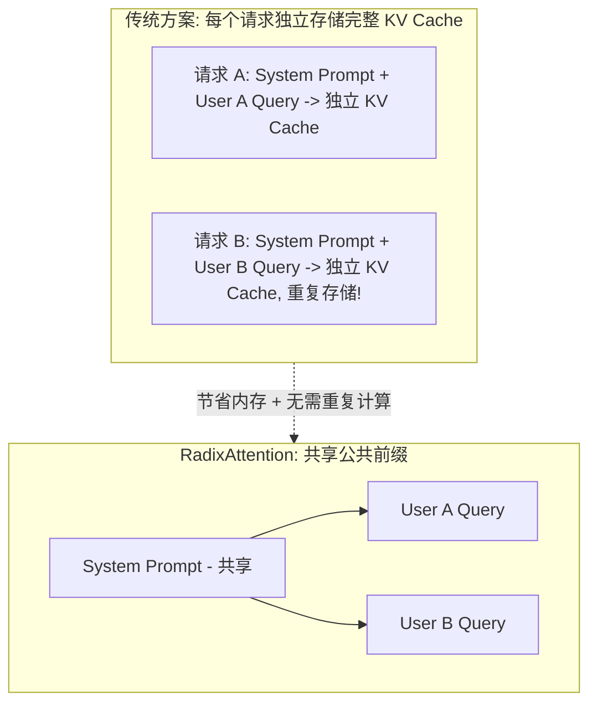

### 1.2 类继承关系

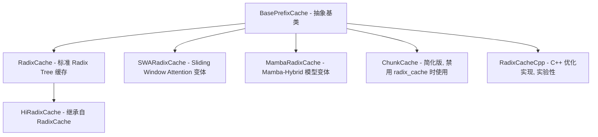

## 2. 核心数据结构

### 2.1 RadixKey

```python
class RadixKey:
    def __init__(self, token_ids: List[int], extra_key: Optional[str] = None,
                 is_bigram: bool = False):
        self.token_ids = token_ids  # Token ID 序列
        self.extra_key = extra_key  # 额外键 (LoRA ID, cache_salt 等)
        self.is_bigram = is_bigram  # 是否为 EAGLE bigram key
```

**用途**:
- `token_ids`: 实际的 token 序列，用于前缀匹配
- `extra_key`: 隔离不同 LoRA 或数据集的缓存命名空间

### 2.2 TreeNode

```python
class TreeNode:
    def __init__(self, id=None, priority=0):
        self.children = defaultdict(TreeNode)  # 子节点 (按首 token 索引)
        self.parent: TreeNode = None           # 父节点
        self.key: RadixKey = None              # 本节点存储的 token 序列
        self.value: torch.Tensor = None        # KV Cache 索引

        # 锁和访问控制
        self.lock_ref = 0                      # 引用计数 (防止逐出)
        self.last_access_time = time.monotonic()
        self.creation_time = time.monotonic()
        self.hit_count = 0                     # 访问次数 (LFU 用)
        self.priority = priority               # 优先级 (Priority eviction)

        # Hierarchical Cache 相关
        self.host_value: torch.Tensor = None   # Host 端 KV 索引
        self.host_ref_counter = 0              # Host 引用计数
        self.hash_value: List[str] = None      # SHA256 块哈希

```

### 2.3 TreeNode.value 的含义与使用

- **类型**: `Optional[torch.Tensor]` (dtype=int64)
- **内容**: 存储的是 KV Cache 的**物理 slot 索引**（与 Allocator 分配的索引一致）

**数据流向**：TreeNode.value 的写入和读取分两个阶段：

```
写入（请求完成时）:
  req_to_token_pool[req_id, 0..seq_len]  →  TreeNode.value
  ↑                                          ↑
  模型前向过程中通过 set_kv_buffer()       cache_finished_req() / cache_unfinished_req()
  写入的 KV slot 索引                      将这些索引拷贝到 Radix Tree 节点

读取（新请求匹配时）:
  match_prefix() 沿 Tree 路径拼接所有节点的 value
  → prefix_indices = [node1.value, node2.value, ...]
  → 写入新请求的 req_to_token_pool[new_req_id, 0..prefix_len]
  → 新请求的 Attention 层直接用这些 slot 索引读取已缓存的 KV（零拷贝复用）
```

- `key` 存储 token IDs（用于匹配），`value` 存储对应的 KV 物理位置（用于复用）。两者一一对应：`key[i]` 这个 token 的 KV 数据存在 `value[i]` 指向的物理 buffer 位置。

### 2.4 Radix Tree 结构示例

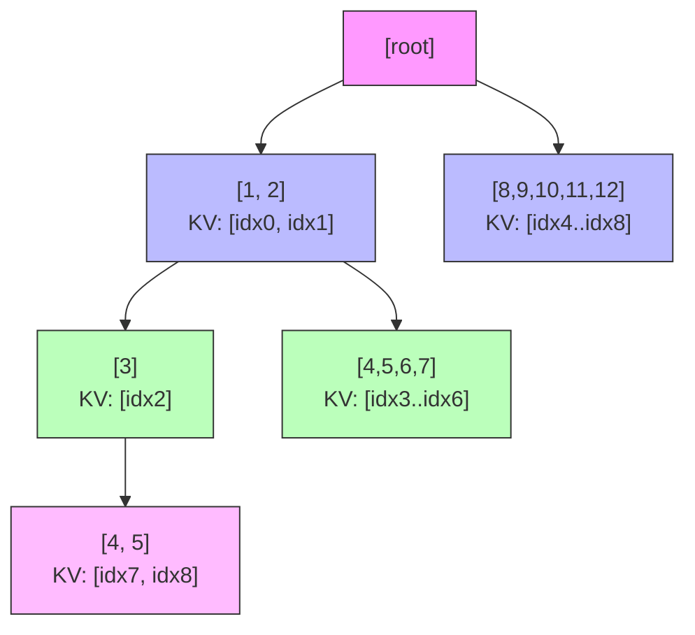

**插入序列说明**:

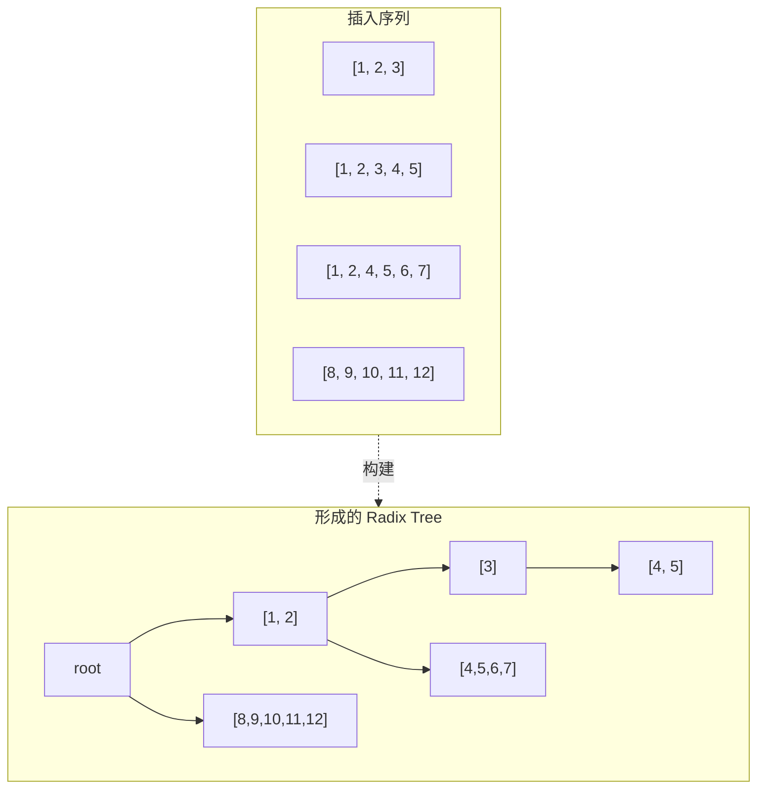

每个节点的 value 存储对应 token 的 KV 索引

## 3. 核心操作

### 3.1 match_prefix

**最长前缀匹配**

```python
def match_prefix(self, params: MatchPrefixParams) -> MatchResult:
    """
    查找 key 在 Radix Tree 中的最长公共前缀

    参数:
        params.key: RadixKey - token_ids + extra_key
        params.cow_mamba: bool - Mamba Copy-On-Write (MambaRadixCache 专用)
        params.req: Req - 请求对象 (MambaRadixCache 专用)

    匹配逻辑:
    - 内部先调用 maybe_bigram_convert() 处理 EAGLE bigram 转换
    - 底层使用 **Token ID 逐个比较** (`_key_match_page_size1`) 或按页比较 (`_key_match_paged`)
    - `extra_key` (如 LoRA ID) 通过 `get_child_key_fn` 影响子节点查找路径，
      实现逻辑上的命名空间隔离，不同 `extra_key` 的请求不会匹配到彼此的节点

    返回:
        MatchResult(
            device_indices: 匹配到的 KV 索引
            last_device_node: 匹配终止的节点
            last_host_node: (HiCache) Host 端匹配节点
            host_hit_length: Host 端命中长度 (HiCache)
            mamba_branching_seqlen: Mamba 分支点 (MambaRadixCache)
        )
    """
```

**匹配流程**:

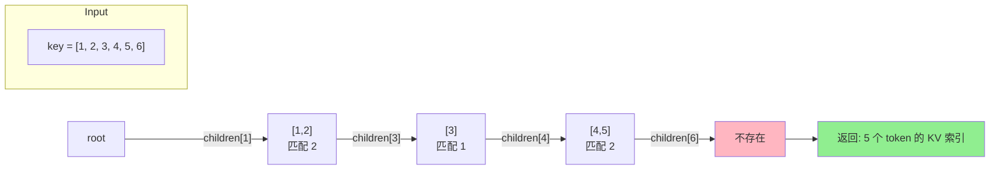

**详细步骤**:

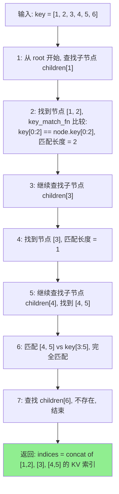

### 3.2 insert

**插入新序列**

```python
def insert(self, params: InsertParams) -> InsertResult:
    """
    插入 token 序列及其 KV 索引到树中

    参数:
        params.key: RadixKey - token_ids + extra_key
        params.value: torch.Tensor - KV 索引
        params.priority: int - 优先级
        params.chunked: bool - 是否为 chunked prefill 中间插入

    返回: InsertResult(prefix_len=已存在的前缀长度, mamba_exist=...)
    """
```

**关键细节**:
- 如果前缀已存在，只插入新增部分
- 返回 `total_prefix_length` 告知调用方哪些 KV 已存在（可释放）

### 3.3 _split_node

**节点分裂**

当匹配在节点中间结束时，需要分裂节点：

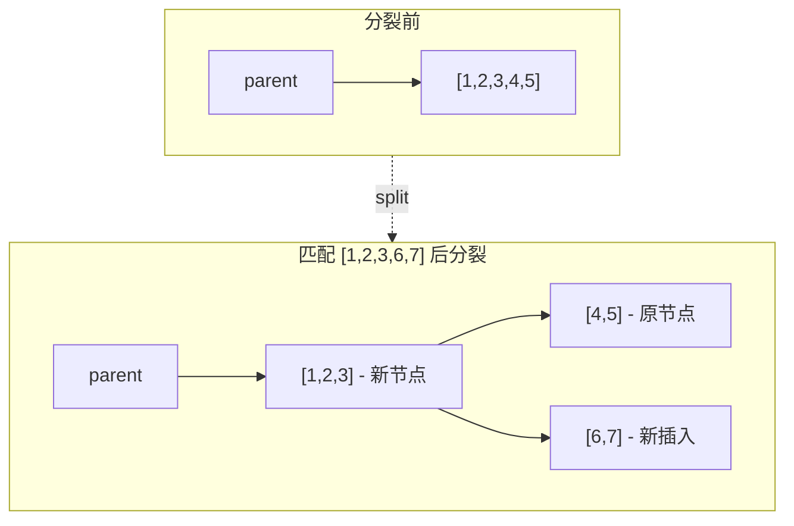

```python
def _split_node(self, key: RadixKey, child: TreeNode, split_len: int):
    new_node = TreeNode(priority=child.priority)
    new_node.key = child.key[:split_len]
    new_node.value = child.value[:split_len]
    new_node.children = {get_child_key(child.key[split_len:]): child}
    child.key = child.key[split_len:]
    child.value = child.value[split_len:]
    # ... 更新父子关系
```

## 4. 锁机制 (lock_ref)

### 4.1 为什么需要锁?

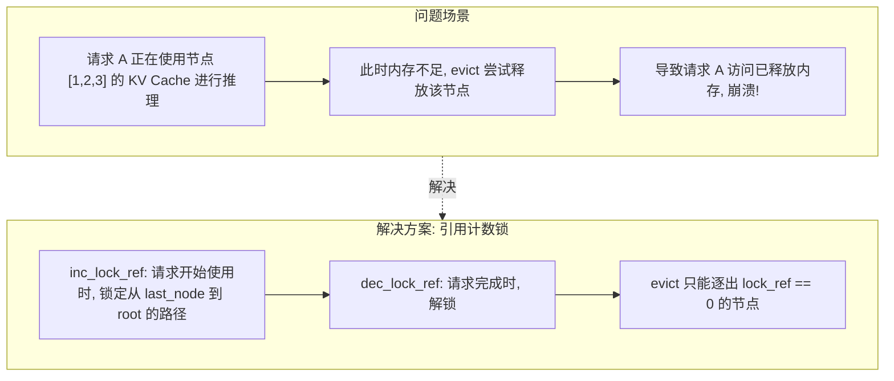

### 4.2 实现细节

```python
def inc_lock_ref(self, node: TreeNode):
    """锁定从 node 到 root 的整个路径"""
    delta = 0
    while node != self.root_node:
        if node.lock_ref == 0:
            # 从 evictable 转为 protected
            self.evictable_size_ -= len(node.key)
            self.protected_size_ += len(node.key)
            delta -= len(node.key)
        node.lock_ref += 1
        self._update_leaf_status(node)  # 维护 evictable_leaves set
        node = node.parent
    return delta

def dec_lock_ref(self, node: TreeNode):
    """解锁路径"""
    delta = 0
    while node != self.root_node:
        if node.lock_ref == 1:
            # 从 protected 转为 evictable
            self.evictable_size_ += len(node.key)
            self.protected_size_ -= len(node.key)
            delta += len(node.key)
        node.lock_ref -= 1
        self._update_leaf_status(node)  # 维护 evictable_leaves set
        node = node.parent
    return delta
```

> **`_update_leaf_status(node)`**: 每次 lock_ref 变化后都调用，判断节点是否应加入/移出 `evictable_leaves` set。判断逻辑：节点未被驱逐 (`not evicted`) 且 `lock_ref == 0` 且所有子节点都已被驱逐时，才是 evictable leaf。

## 5. 逐出策略

**文件**: `python/sglang/srt/mem_cache/evict_policy.py`

| 策略 | 优先级计算 | 适用场景 |
|------|-----------|---------|
| **LRU** | `last_access_time` | 热点数据保留 (默认) |
| **LFU** | `(hit_count, last_access_time)` | 高频访问优先 |
| **FIFO** | `creation_time` | 按创建顺序 |
| **MRU** | `-last_access_time` | 最近使用优先逐出 |
| **FILO** | `-creation_time` | 后进先出 |
| **Priority** | `(priority, last_access_time)` | 请求优先级感知 |

### 5.1 evict() 流程

```python
def evict(self, params: EvictParams) -> EvictResult:
    num_tokens = params.num_tokens
    leaves = list(self.evictable_leaves)  # 使用维护好的 evictable_leaves set
    eviction_heap = [
        (self.eviction_strategy.get_priority(node), node) for node in leaves
    ]
    heapq.heapify(eviction_heap)

    num_evicted = 0
    while num_evicted < num_tokens and len(eviction_heap):
        _priority, x = heapq.heappop(eviction_heap)
        self.token_to_kv_pool_allocator.free(x.value)  # 释放 KV
        num_evicted += len(x.value)
        self._delete_leaf(x)                            # 删除节点

        # 如果父节点变成叶子且未被锁定，可能成为下一个逐出候选
        if len(x.parent.children) == 0 and x.parent.lock_ref == 0:
            new_priority = self.eviction_strategy.get_priority(x.parent)
            heapq.heappush(eviction_heap, (new_priority, x.parent))

    return EvictResult(num_tokens_evicted=num_evicted)
```

> **关键区别**: 实际实现使用 `self.evictable_leaves` (一个 `set`) 而非“每次逐出前全树收集叶子节点”的遍历策略。`evictable_leaves` 由 `_update_leaf_status()` 实时维护，避免每次 evict 都遍历整棵树。

## 6. 请求生命周期中的缓存操作

### 6.1 cache_finished_req

**作用**: 请求生命周期结束时调用，完成两件事：
1. **固化 KV Cache**：将该请求的 token 序列和对应的 KV slot 索引插入 Radix Tree，使**下一轮具有相同前缀的请求**可以直接命中并复用这些 KV 数据。
2. **释放资源**：释放与树中已有节点重复的 KV 索引、释放 page 对齐截断的 unaligned tail、解锁节点（`dec_lock_ref` → `lock_ref` 降为 0 → 节点变为**可驱逐**状态）。被固化到 Tree 的 KV slot **不会立即 free**，而是留在 Tree 中等待后续请求复用或 LRU 驱逐时才释放。`req_to_token_pool.free(req_pool_idx)` 由 Scheduler 在外部调用，不在此方法内。

**关键动作**:

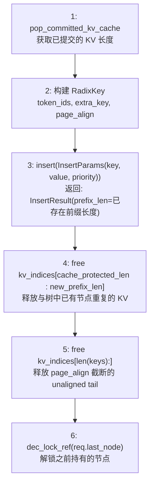

> **注意**: `req_to_token_pool.free(req_pool_idx)` 不在 `cache_finished_req` 内部执行，而是由 Scheduler 在外部调用。Step 5 释放的是 page 对齐后多余的 KV 索引（unaligned tail）。

### 6.2 cache_unfinished_req

用于 **Chunked Prefill**，请求未完成但需要中间缓存：

```python
def cache_unfinished_req(self, req: Req, chunked=False):
    # 插入当前已处理的 token
    new_prefix_len = self.insert(radix_key, kv_indices)

    # 释放重复部分
    self.token_to_kv_pool_allocator.free(kv_indices[cache_protected_len:new_prefix_len])

    # 重新匹配以获取最新的节点引用
    match_result = self.match_prefix(radix_key)
    new_last_node = match_result.last_device_node

    # 更新请求的 prefix_indices 供下一个 chunk 使用
    req.prefix_indices = new_indices
    req.cache_protected_len = len(new_indices)

    # 更新锁
    self.dec_lock_ref(req.last_node)
    self.inc_lock_ref(new_last_node)
    req.last_node = new_last_node
```

## 7. Page Size 与对齐

当 `page_size > 1` 时，匹配和插入以 page 为单位：

```python
if self.page_size != 1:
    page_aligned_len = len(key) // self.page_size * self.page_size
    key = key[:page_aligned_len]
```

**影响**:
- 匹配粒度变粗 (以 page_size 个 token 为单位)
- 部分页 (partial page) 需要特殊处理，不能进入 RadixCache

## 8. extra_key 命名空间隔离

```python
# 不同 LoRA 的请求共享相同 system prompt 也不会混用
key1 = RadixKey([1,2,3], extra_key="lora_adapter_A")
key2 = RadixKey([1,2,3], extra_key="lora_adapter_B")
# key1 和 key2 被视为完全不同的缓存条目
```

命名空间隔离确保:
- 不同 LoRA adapter 的 KV Cache 不会混用
- 不同 `cache_salt` 的请求隔离

## 9. EAGLE Bigram 转换

对于 EAGLE 投机解码，使用 bigram key：

```python
def convert_to_bigram_key(token_ids: List[int]) -> List[int]:
    """
    [1, 2, 3, 4] → [(1,2), (2,3), (3,4)]
    """
    return [combine(token_ids[i], token_ids[i+1]) for i in range(len(token_ids)-1)]
```

这允许 EAGLE 的 draft model 共享 target model 的部分 KV Cache。

## 10. Scheduler 集成

```python
- 源码锚点: `python/sglang/srt/managers/scheduler.py`
if disable_radix_cache and chunked_prefill:
    # 禁用 radix cache 时使用简化版
    if self.is_hybrid_swa:
        self.tree_cache = SWAChunkCache(params)
    else:
        self.tree_cache = ChunkCache(params)
else:
    if SGLANG_EXPERIMENTAL_CPP_RADIX_TREE:
        self.tree_cache = RadixCacheCpp(params, server_args)  # C++ 实验性实现
    elif self.enable_hierarchical_cache:
        self.tree_cache = HiRadixCache(params, server_args)   # 层级缓存 (继承 RadixCache)
    elif self.is_hybrid_swa:
        self.tree_cache = SWARadixCache(params)               # SWA 混合架构
    elif self.is_hybrid_ssm:
        self.tree_cache = MambaRadixCache(params)             # Mamba 混合架构
    elif server_args.enable_lmcache:
        self.tree_cache = LMCRadixCache(params, ...)          # LMCache 集成
    else:
        self.tree_cache = RadixCache(params)                  # 默认
```

## 11. 配置参数

| 参数 | 默认值 | 说明 |
|------|--------|------|
| `disable_radix_cache` | False | 禁用前缀缓存 |
| `radix_eviction_policy` | "lru" | 逐出策略 |
| `page_size` | 16 | 页大小 |
| `enable_hierarchical_cache` | False | 启用层级缓存 |

## 12. 多模态 Chunked Prefill 与缓存命中案例

### 12.1 场景设定

```
假设:
  chunk_size = 512 tokens
  image1 token 数 = 1024 (> chunk_size，需要 2 个 chunk)
  image2 token 数 = 768  (> chunk_size，需要 2 个 chunk)
  image3 token 数 = 896  (> chunk_size，需要 2 个 chunk)
  text1 token 数 = 100

请求:
  req1: text1 + image1 + image2
  req2: text1 + image1 + image3
```

### 12.2 req1 处理流程 (首次请求)

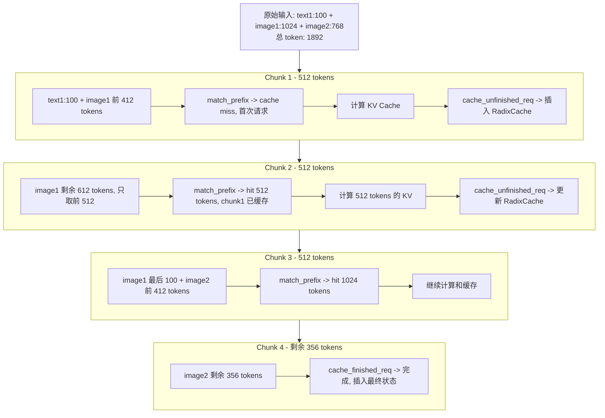

### 12.3 req2 部分命中场景

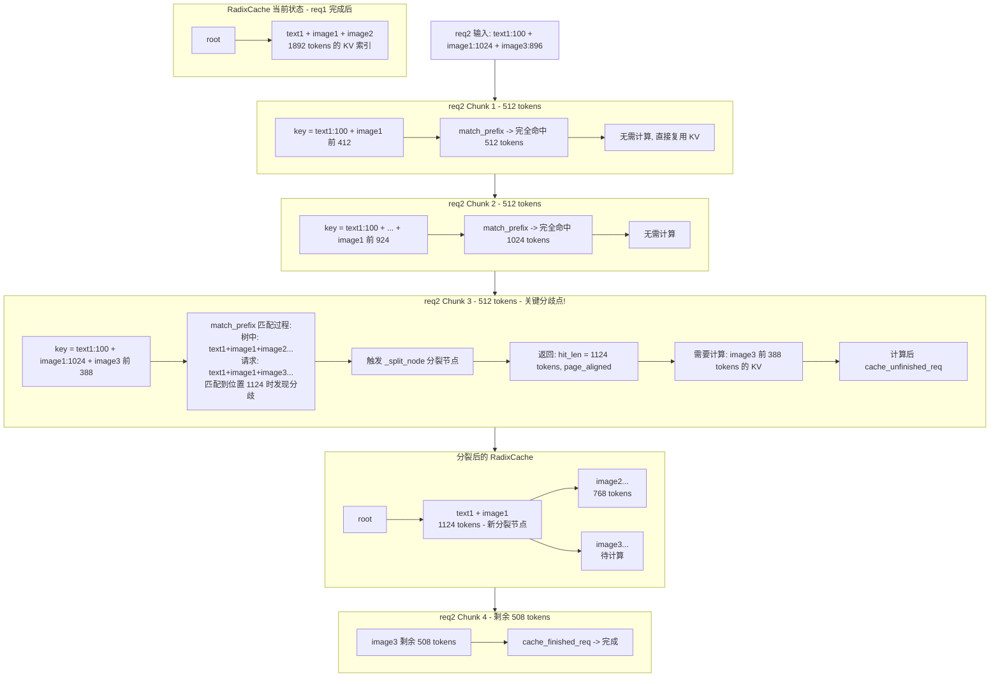

### 12.4 req3 并发场景：req1 未完成时 req3 到达（与 req2 输入相同）

> **核心问题**: 缓存复用是否必须等请求生命周期结束（`cache_finished_req`）？还是在请求执行过程中就可以被后续请求命中？

**结论**: **不需要等待**。`cache_unfinished_req()` 使得每完成一个 chunk，中间结果就立即固化到 Radix Tree，后续请求在下一个调度轮次即可命中。

#### 场景设定

```
req1: text1:100 + image1:1024 + image2:768  (总 1892 tokens)
req3: text1:100 + image1:1024 + image3:896  (总 2020 tokens, 与 req2 输入相同)
chunk_size = 512

关键时序: req3 在 req1 完成 Chunk 2 后、Chunk 3 前到达
```

#### Scheduler 单线程事件循环

SGLang Scheduler 是**单线程事件循环**，每个 step 只处理一个 prefill batch。Chunked 请求在每个 chunk 完成后会被移出 running batch，在下一轮重新调度。这保证了 `cache_unfinished_req` → `match_prefix` 的顺序一致性：

```
scheduler.py:
    self.tree_cache.cache_unfinished_req(self.chunked_req, chunked=True)
    → insert 当前已完成 chunk 的 KV 到 Tree
    → req_to_token_pool.free(chunked_req.req_pool_idx)  # 释放旧槽位
    → 下一轮 get_new_batch_prefill() 重新分配 req_pool_idx
```

#### 完整时序

```
Step 1: req1 Chunk 1 (tokens 0-511)
─────────────────────────────────────────────────────────────────────
  Scheduler:
    → get_new_batch_prefill(): 从 waiting_queue 取出 req1
    → match_prefix(req1) → cache miss (首次)
    → PrefillAdder: extend_len=1892 > chunk_size=512, 标记为 chunked
    → 计算 tokens[0..511] 的 KV
  完成后:
    → cache_unfinished_req(req1): insert [0..511] 到 Tree
    → Tree: [root] → [0..511] (lock_ref=1, req1 持有)
    → req1 移出 running batch, 等待下一轮重新调度

Step 2: req1 Chunk 2 (tokens 512-1023)
─────────────────────────────────────────────────────────────────────
  Scheduler:
    → get_new_batch_prefill(): req1 作为 self.chunked_req 优先重新加入
    → 接续前缀 [0..511], 计算 tokens[512..1023]
  完成后:
    → cache_unfinished_req(req1): insert [0..1023] 到 Tree
    → Tree: [root] → [0..1023] (lock_ref=1)

  同时: req3 到达, 加入 waiting_queue (此时 req1 未完成!)

Step 3: req1 Chunk 3 + req3 被调度 (可能同一 batch)
─────────────────────────────────────────────────────────────────────
  Scheduler:
    → get_new_batch_prefill():
      1) req1 (chunked_req) 优先加入, 继续处理 tokens[1024..1535]
      2) req3 从 waiting_queue 取出
         → match_prefix(req3): 对比 Tree 中 [0..1023]
         → req3 tokens[0..1023] = text1 + image1 前 924  ← 与 req1 完全相同!
         → 命中 1024 tokens! inc_lock_ref → lock_ref=2
         → extend_len = 2020-1024 = 996 > chunk_size=512, req3 也变成 chunked
         → req3 被标记为 chunked, 只计算 tokens[1024..1535]

  注意: 一个 batch 中只允许一个 chunked_req, 所以 req1 和 req3 不会同时
  作为 chunked_req。实际调度是:
    → req1 Chunk 3 先执行 (chunked_req 优先)
    → req1 cache_unfinished_req → Tree 扩展到 [0..1535]
    → 下一轮 req3 才被调度

Step 4: req3 首次实际计算
─────────────────────────────────────────────────────────────────────
  此时 Tree 状态: [root] → [0..1535] (req1 已推进到 1536 tokens)

  Scheduler:
    → match_prefix(req3): 比对 req3 tokens[0..2019] 与 Tree [0..1535]
    → tokens[0..1123] (text1 + 完整 image1) 完全匹配!
    → token 1124: req3=image3_pad vs Tree=image2_pad → 分歧!
    → 命中 1124 tokens (page_aligned 后可能是 1120)

  Tree 变化 (req3 的 cache_unfinished_req 触发 _split_node):
    [root] → [text1+image1: 1124 tokens]
                  ├── [image2...: 412 tokens]  ← req1 的分支
                  └── [image3...: 512 tokens]  ← req3 的新分支

  req3 实际计算: 2020 - 1124 = 896 tokens 中的前 512 tokens

Step 5-6: req1 Chunk 4 (完成) + req3 Chunk 2 (完成)
─────────────────────────────────────────────────────────────────────
  req1: cache_finished_req → dec_lock_ref → image2 分支 lock_ref 降为 0
  req3: cache_finished_req → dec_lock_ref → 所有节点可驱逐

  最终 Tree:
    [root] → [text1+image1: 1124 tokens] (lock_ref=0)
                  ├── [image2...: 768 tokens]  (lock_ref=0)
                  └── [image3...: 896 tokens]  (lock_ref=0)
```

#### 关键结论

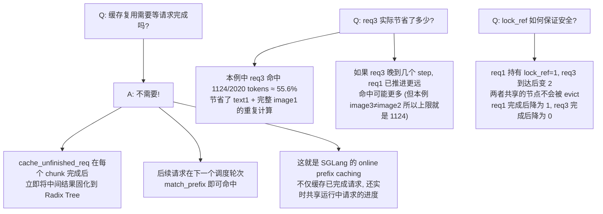

> **代码路径**: `python/sglang/srt/managers/scheduler.py` → `radix_cache.py cache_unfinished_req` → `insert` + `match_prefix` → `inc_lock_ref`

### 12.5 Page Alignment 对部分命中的影响

```python
# page_size = 16 时的对齐
actual_match = 1124
page_aligned_match = (1124 // 16) * 16  # = 1120

# 结果: 虽然精确匹配到 1124，但只能复用 1120 tokens
# 后 4 tokens 需要重新计算 (页对齐开销)
```

### 12.6 多模态缓存隔离机制

> **注意**: `extra_key` 用于 **LoRA ID 和 cache_salt**，不是多模态图片隔离！

```python
- 源码锚点: `python/sglang/srt/managers/schedule_batch.py`
# extra key for classifying the request (e.g. cache_salt)
if lora_id is not None:
    extra_key = (extra_key or "") + lora_id  # LoRA ID 拼接到 extra_key
```

**多模态图片如何隔离?**

图片通过 **pad_value (图片 hash)** 嵌入到 token_ids 中：

```python
# MultimodalDataItem.set_pad_value()
self.hash = hash_feature(self.feature)  # 图片内容 hash
self.pad_value = self.hash % (1 << 30)  # 作为 token 占位符

# 最终 token_ids 示例:
# [text_tokens..., pad_value_image1, pad_value_image1, ..., pad_value_image2, ...]
```

因此，不同图片组合的请求：
- **不同 pad_value** -> 不同 token_ids -> 自然不会匹配
- **不需要 extra_key** 来隔离多模态

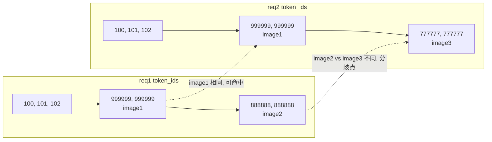

### 12.7 并发请求间的缓存共享

**关键点**: 请求**无需等待生命周期结束**即可共享缓存。`cache_unfinished_req()` 使得请求**每完成一个 chunk 就立即将进度固化到 Radix Tree**，后续请求可以实时复用。

#### 时序示例：req1 未完成时 req3 进入

假设 req1 和 req3 的输入完全相同，启用 chunked prefill（chunk_size=512）：

```
时间轴:
─────────────────────────────────────────────────────────
t0: req1 到达 (2048 tokens)
    → Chunk 1 (0-511) 计算完成
    → cache_unfinished_req(): 将 [0..511] 的 KV 插入 Tree, inc_lock_ref()
    → Tree: [root] → [0..511] (lock_ref=1, req1 持有)

t1: req1 Chunk 2 (512-1023) 计算完成
    → cache_unfinished_req(): 将 [0..1023] 的 KV 更新到 Tree
    → Tree: [root] → [0..1023] (lock_ref=1, req1 持有)

t2: req3 到达 (相同 2048 tokens), 此时 req1 仍在运行!
    → match_prefix(): 匹配到 [0..1023] 的节点 (req1 已缓存的部分)
    → 命中 1024 tokens! 直接复用 KV, 无需重算
    → inc_lock_ref() → lock_ref=2 (req1 + req3 共同持有)
    → req3 只需从 token 1024 开始计算

t3: req1 Chunk 3 (1024-1535) 计算完成
    → cache_unfinished_req(): Tree 更新为 [0..1535]
    → req3 的下一个 chunk 可能再次命中更多

t4: req1 完成
    → cache_finished_req(): dec_lock_ref() → lock_ref=1 (只剩 req3)
    → 节点仍不可驱逐 (lock_ref > 0)

t5: req3 完成
    → cache_finished_req(): dec_lock_ref() → lock_ref=0
    → 节点变为可驱逐 (等待 LRU)
─────────────────────────────────────────────────────────
```

**核心机制**：
- `cache_unfinished_req()` 是 chunked prefill 的关键 — 每个 chunk 完成后都将中间结果固化到 Tree
- 后续请求**不需要等前一个请求完成**，只要前一个请求已提交的 chunk 就能立刻复用
- `lock_ref` 引用计数确保多个请求共同持有的节点不会被提前驱逐
- 这就是 SGLang 的 **online prefix caching** — 不仅缓存历史请求，还实时共享正在运行的请求

---

## 13. MambaRadixCache 详解

### 13.1 Mamba-Hybrid 模型的特殊挑战

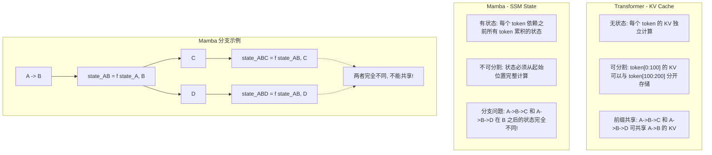

### 13.2 MambaRadixCache 双锁机制

```python
# MambaRadixCache 的 TreeNode
class TreeNode:
    # KV Cache 相关 (Attention 层)
    self.value: torch.Tensor = None           # KV 索引
    self.full_lock_ref = 0                    # KV 锁

    # Mamba State 相关 (SSM 层)
    self.mamba_value: torch.Tensor = None     # Mamba 状态索引
    self.mamba_lock_ref = 0                   # Mamba 锁

    # LRU 链表 (分开管理)
    self.prev, self.next = None, None         # KV LRU
    self.mamba_prev, self.mamba_next = None, None  # Mamba LRU
```

**不变量 (Invariant)**:

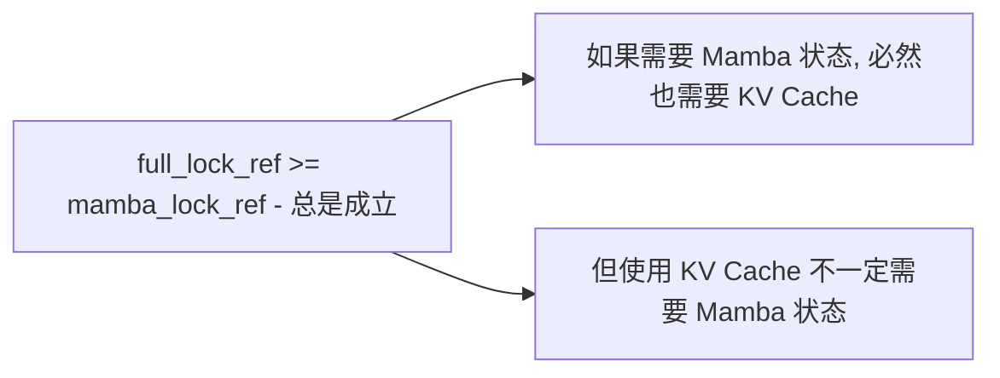

### 13.3 Mamba Tombstone (墓碑节点)

当节点被分裂时，Mamba 状态无法分割：

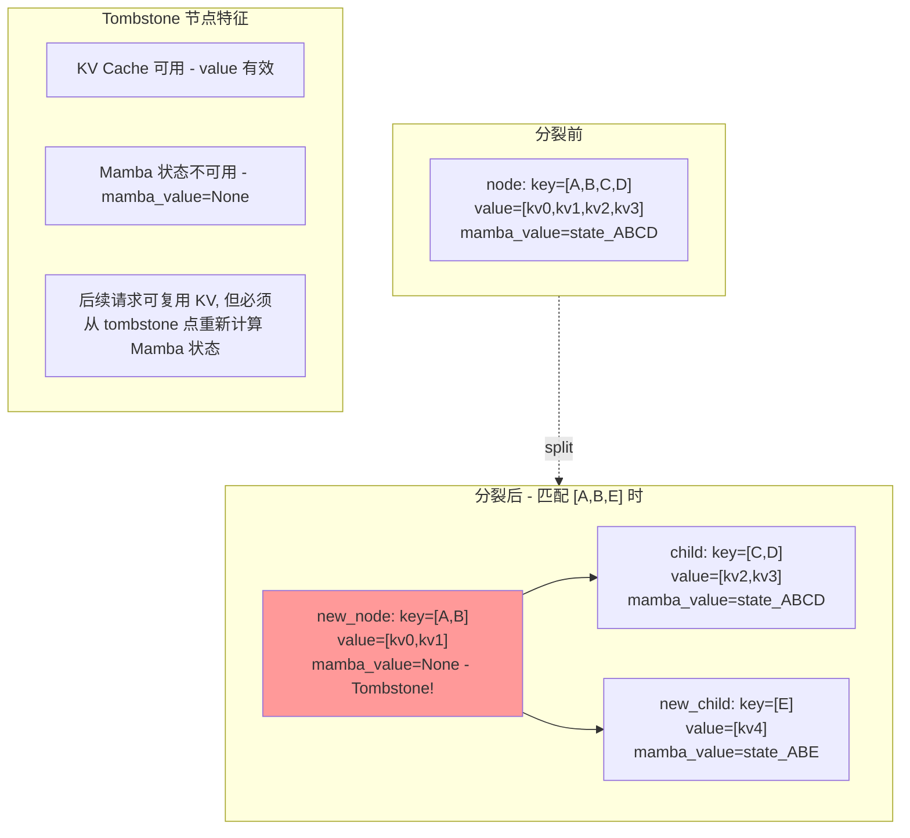

**Tombstone 存在的根本原因**:

Mamba 状态 (SSM state) 是**不可分割**的，只在 Chunk 边界 (`mamba_cache_chunk_size`，可配置) 有意义。当节点在中间位置被分裂 (Split) 时，新的中间节点无法拥有有意义的 Mamba 状态，因此置为 `None`（即 tombstone）。但 KV Cache 是 per-token 的，分裂后依然有效。

**KV Cache 与 Mamba State 的独立性**:

> **是的，KV cache 和 Mamba state 是完全独立的。** 它们由不同的物理存储管理（KVCache pool vs MambaPool），互不依赖。一个 token 的 KV cache 存在并不意味着它的 Mamba state 也存在，反之亦然。
>
> **Tombstone 的实际含义**就是这种独立性的体现：节点的 KV cache 有效（`value` 非空），但 Mamba state 无效（`mamba_value=None`）。当新请求匹配到 tombstone 节点时：
> - **Attention 层**：直接复用该节点的 KV cache（零拷贝）
> - **Mamba 层**：需要**回退到最近一个有 mamba_value 的祖先节点**，从那个 checkpoint 开始重新跑 Mamba 前向，更新 state
>
> 这就是 `_match_prefix_helper` 中 `best_value_len` / `best_last_node` 追踪最深有效 mamba 节点的逻辑 — 沿着 Tree 走到最远的 KV 匹配，但返回的 mamba 复用位置退回到最深的非 tombstone 节点。

### 13.4 cow_mamba (Copy-On-Write) 机制

cow_mamba 逻辑位于 `_match_post_processor()` 方法中（不在 `match_prefix` 本体），通过 `MatchPrefixParams` 传入参数：

```python
def _match_post_processor(self, params: MatchPrefixParams,
                          value, last_node, best_value_len) -> MatchResult:
    cow_mamba = params.cow_mamba
    req = params.req

    # ... LRU 更新、mamba_branching_seqlen 计算 ...

    # Copy mamba state to req local space if cow is true
    if cow_mamba and last_node.mamba_value is not None:
        if req.mamba_pool_idx is None:
            dst_index = self.req_to_token_pool.mamba_pool.alloc(1)
            # 分配失败时: 锁定 last_node 防止被驱逐, 触发 evict, 再重试
            if dst_index is None:
                self.inc_lock_ref(last_node)
                self.evict(EvictParams(num_tokens=0, mamba_num=1))
                dst_index = self.req_to_token_pool.mamba_pool.alloc(1)
                self.dec_lock_ref(last_node)
            src_index = last_node.mamba_value
            self.req_to_token_pool.mamba_pool.copy_from(src_index, dst_index)
            req.mamba_pool_idx = dst_index[0]
        else:
            # 已有 mamba_pool_idx, 直接覆盖
            src_index = last_node.mamba_value
            dst_index = req.mamba_pool_idx.unsqueeze(0)
            self.req_to_token_pool.mamba_pool.copy_from(src_index, dst_index)
```

**为什么需要 Copy-On-Write?**

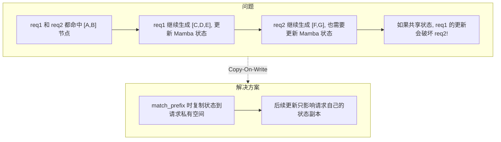

### 13.5 mamba_branching_seqlen

```python
# _match_prefix_helper 返回值 (注意: 返回完整 value list, 不做截断)
return value, best_last_node, best_value_len
# value: List[torch.Tensor] - 所有匹配节点的 KV 索引列表 (未截断)
# best_last_node: TreeNode - 最深的有 mamba_value 的节点
# best_value_len: int - best_last_node 对应的 value 列表长度

# mamba_branching_seqlen 在 _match_post_processor 中计算:
if len(value) > best_value_len:
    mamba_cache_chunk_size = get_global_server_args().mamba_cache_chunk_size  # 可配置
    total_matched = sum(len(v) for v in value)
    mamba_cache_chunk_aligned_seqlen = (
        total_matched // mamba_cache_chunk_size
    ) * mamba_cache_chunk_size
    mamba_branching_seqlen = (
        mamba_cache_chunk_aligned_seqlen if mamba_cache_chunk_aligned_seqlen > 0 else None
    )
```

**作用**: 告诉调度器从哪个位置开始需要重新计算 Mamba 状态

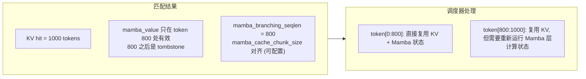

### 13.6 Chunked Prefill 与 Mamba 的特殊关联

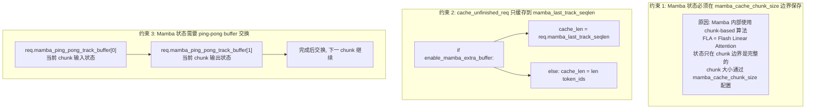

### 13.7 Mamba Eviction 策略

```python
# 两个独立的 LRU 链表
self.full_lru_list = LRUList(mamba=False)   # 管理 KV Cache
self.mamba_lru_list = LRUList(mamba=True)   # 管理 Mamba 状态

def evict_mamba(self, mamba_num: int) -> int:
    """只逐出 Mamba 状态，保留 KV Cache"""
    x = self.mamba_lru_list.get_lru_no_lock()
    mamba_num_evicted = 0
    while mamba_num_evicted < mamba_num and self.mamba_lru_list.in_list(x):
        if len(x.children) > 0:
            # 情况 1: 内部节点 → tombstone (保留节点结构)
            self.req_to_token_pool.mamba_pool.free(x.mamba_value)
            mamba_num_evicted += len(x.mamba_value)
            x_next = self.mamba_lru_list.get_prev_no_lock(x)
            self.mamba_lru_list.remove_node(x)
            self._tombstone_internal_node(x)  # mamba_value=None, 节点保留
        else:
            # 情况 2: 叶子节点 → 完全删除 (释放 KV + Mamba)
            _, mamba_evicted_delta, _, x_next = self._evict_leaf_node(x, True)
            mamba_num_evicted += mamba_evicted_delta
        x = x_next

def evict(self, num_tokens: int):
    """逐出 KV Cache (同时会释放 Mamba 状态)"""
    # 先尝试只逐出 Mamba 状态释放内存
    # 如果不够，再逐出 KV Cache
```

**逐出优先级**:
1. 先逐出 Mamba 状态：内部节点变为 tombstone（保留 KV），叶子节点完全删除
2. 如果 KV 内存不足，再通过 `evict_full` 逐出完整节点

---

## 14. SWA RadixCache

**文件**: `python/sglang/srt/mem_cache/swa_radix_cache.py` (1188行)

管理 Full Attention 和 SWA 两种 attention 层的缓存。Llama4、Step3p5 等 SWA 混合架构模型需要同时维护两套缓存树。

> **注意**: Qwen3.5 的混合架构是 Full Attention + Linear Attention (GatedDeltaNet)，不使用 SWA。SWA 混合架构适用于 Llama4、Step3p5、GptOss、MiMoV2 等模型。

### 核心类

| 类 | 行号 | 说明 |
|----|------|------|
| `TreeNode` | L58 | 缓存树节点 |
| `LRUList` | L118 | LRU 逐出列表 |
| `SWARadixCache(BasePrefixCache)` | L339 | SWA Radix 缓存主类 |

## 15. BasePrefixCache 接口重构

**文件**: `python/sglang/srt/mem_cache/base_prefix_cache.py`

SGLang 引入了结构化参数类，统一了各 RadixCache 子类的接口：

| 参数类 | 说明 |
|--------|------|
| `MatchPrefixParams`  | 前缀匹配参数：key、cow_mamba、req |
| `InsertParams`  | 插入参数：key、value、mamba_value、prev_prefix_len、swa_evicted_seqlen、chunked、priority |
| `InsertResult`  | 插入结果：prefix_len、mamba_exist |
| `EvictParams`  | 逐出参数：num_tokens、swa_num_tokens、mamba_num |
| `EvictResult`  | 逐出结果：num_tokens_evicted、swa_num_tokens_evicted、mamba_num_evicted |
| `MatchResult`  | 匹配结果：device/host 索引、命中长度、mamba 分支信息 |

## 16. 存储后端更新

**文件**: `srt/mem_cache/storage/`

SGLang 支持多个外部存储后端：

| 后端 | 目录 | 说明 |
|------|------|------|
| NIXL | `nixl/` | NVIDIA NIXL 高性能传输 |
| aibrix_kvcache | `aibrix_kvcache/` | AIBrix KV Cache 存储 |
| EIC | `eic/` | EIC 存储后端 |
| HF3FS | `hf3fs/` | HuggingFace 3FS 文件系统 |
| LMCache | `lmcache/` | LMCache 集成 |
| Mooncake | `mooncake_store/` | Mooncake 分布式存储 |

## 17. Mamba RadixCache

**文件**: `python/sglang/srt/mem_cache/mamba_radix_cache.py` (1232行)

为 Qwen3.5 等包含线性注意力层的模型提供 Mamba 状态的 Radix 缓存支持。

| 类 | 行号 | 说明 |
|----|------|------|
| `TreeNode` | L63 | 缓存树节点 |
| `LRUList` | L117 | LRU 逐出列表 |
| `MambaRadixCache(BasePrefixCache)` | L371 | Mamba Radix 缓存主类 |

## 18. 下一步

- **08**: ModelRunner 与 CUDA Graph
- **09**: Attention 后端 (FlashInfer, FlashAttention)

## 与其他章节关系
- 为 `03/04/05` 提供前缀复用基础。


## 最小可验证实验
- 固定模型和负载，仅切换本章机制开关。
- 记录 TTFT、TPOT、吞吐、显存峰值与回退率。
- 总结收益场景、退化场景、推荐默认值。


## 常见误解
- 命中前缀就能完全复用。
