# SGLang ModelRunner 与 CUDA Graph 详解

> **默认场景**: Qwen3.5 混合架构模型（Full Attention + Linear Attention/GatedDeltaNet + MoE + MTP）
>
> **启用特性**: PD 分离 + Chunked Prefill + ViT DP + Overlap Schedule + 多模态缓存 + EPLB + MTP + 线性注意力

## 1. ModelRunner 概览

**核心文件**:
- `srt/model_executor/model_runner.py` - 模型执行器 (2454 行)
- `srt/model_executor/cuda_graph_runner.py` - CUDA Graph 管理 (948 行)
- `srt/model_executor/forward_batch_info.py` - ForwardBatch 定义 (1293 行)

### 1.1 职责分工

```mermaid
flowchart LR
    subgraph Scheduler
        S1["管理请求生命周期<br/>add_req, process_batch"]
        S2["调度决策<br/>哪些请求进入批次"]
        S3["输出: ModelWorkerBatch<br/>高层批次信息"]
    end

    subgraph ModelRunner
        M1["执行模型 forward pass"]
        M2["管理 CUDA Graph"]
        M3["采样下一个 token"]
        M4["输入: ForwardBatch<br/>低层 GPU 张量"]
    end

    subgraph CudaGraphRunner
        C1["捕获和重放 CUDA Graph"]
        C2["管理不同 batch size 的图"]
        C3["优化 decode 阶段的<br/>kernel launch 开销"]
    end

    Scheduler -->|ModelWorkerBatch| ModelRunner -->|ForwardBatch| CudaGraphRunner
```

### 1.2 TpModelWorker - Scheduler 与 ModelRunner 之间的桥梁

**核心文件**: `srt/managers/tp_worker.py:205`

`TpModelWorker` 是运行在 GPU 进程中的工作者类，负责连接 Scheduler 和 ModelRunner。

**主要职责**:
1. **接收批次**: 从 Scheduler 接收 `ModelWorkerBatch`（解耦后的纯数据容器，不含 Req 对象）。
2. **转换数据**: 调用 `ForwardBatch.init_new(model_worker_batch, model_runner)` 将其转换为 GPU 上的 `ForwardBatch`，添加 positions、attn_backend 等全局引用。
3. **执行前向**: 调用 `ModelRunner.forward()` 执行模型计算。
4. **执行采样**: 调用 `ModelRunner.sample()` 生成下一个 token ID。
5. **投机解码**: 作为基类被 `EagleWorker` 等继承。EagleWorker 可以创建多个 `ModelRunner` 实例（不同 `draft_model_idx`），每个加载独立的 Draft Model 权重，协调 Draft 和 Target 模型的交互。

**重要特性**:
- **真实权重加载**: TpModelWorker 始终加载**真实模型权重** (通过 `model_runner.load_model()`)。即使是投机解码的 Draft Worker，也加载真实的 Draft 模型权重，不存在 dummy weight 模式。
- **内存池桥接**: 通过 `get_memory_pool()` 方法向 Scheduler 暴露 ModelRunner 持有的内存池（`req_to_token_pool`、`token_to_kv_pool_allocator`），使 Scheduler 可以管理 KV Cache 分配。

### 1.3 核心概念深入理解

#### 1.3.1 三层数据结构的转换

| 数据结构 | 所在组件 | 主要内容 |
|----------|---------|---------|
| ScheduleBatch | Scheduler | Req 对象列表、调度策略信息、内存池引用、CPU 侧元数据 |
| ModelWorkerBatch | TpModelWorker | 仅前向计算所需字段（input_ids, seq_lens, sampling_info 等），不含 Req 对象和调度策略 |
| ForwardBatch | ModelRunner | 纯 GPU tensor + 全局对象引用（attn_backend, token_to_kv_pool） |

**转换流程**:


**为什么需要三层？**

1. **解耦调度与执行**: ScheduleBatch 持有 Req 对象和内存池引用（调度关心），ModelWorkerBatch 只保留前向计算需要的数据（执行关心）。这使得 Overlap 模式下 Scheduler 可以立刻回收 ScheduleBatch 做下一轮调度
2. **屏蔽不同层对数据的感知**: 每层组件只需关心自己的数据结构，降低耦合
3. **减少不必要的数据传递**: 只传递下游需要的字段
4. **抽象分层**: Scheduler 不需要知道 GPU tensor 细节，ModelRunner 不需要知道调度策略

#### 1.3.2 ForwardMode 深入理解

| 模式 | 场景 | 分块维度 | 每次处理 | 特点 |
|------|------|---------|---------|------|
| EXTEND | 正常 Prefill / Chunked Prefill | Token 维度 | 部分 token，**全部层** | KV Cache 逐 chunk 写入 |
| DECODE | 纯 Decode | - | 1 token/request，全部层 | 可用 CUDA Graph |
| MIXED | Chunked Prefill + Decode | Token 维度 | 混合 batch | 避免 Decode 饥饿 |
| SPLIT_PREFILL | PDMux (PD 复用) | **Layer 维度** | 全部 token，**部分层** | 与 Decode 并行执行 |

**MIXED 模式的意义**:
- Chunked Prefill 将长 prompt 分成多个 chunk
- 在等待下一个 chunk 的间隙，Decode 请求可以"插队"
- 一个 batch 内同时包含 prefill 和 decode 的请求
- 避免 Decode 请求长时间等待

## 2. ForwardMode 枚举

```python
class ForwardMode(IntEnum):
    EXTEND = auto()          # Prefill / 扩展模式
    DECODE = auto()          # Decode 模式 (逐 token 生成)
    MIXED = auto()           # 混合批次 (prefill + decode)
    IDLE = auto()            # 空闲模式 (无实际计算)
    TARGET_VERIFY = auto()   # 投机解码验证模式
    DRAFT_EXTEND = auto()    # Draft 模型扩展
    DRAFT_EXTEND_V2 = auto() # Draft 模型扩展 v2
    PREBUILT = auto()        # 预构建模式
    SPLIT_PREFILL = auto()   # 分层 Prefill (逐层执行)
    DLLM_EXTEND = auto()     # Diffusion LLM 扩展
```

### 2.1 模式判断方法

```python
# 常用判断
forward_mode.is_decode()           # DECODE
forward_mode.is_extend()           # EXTEND, DRAFT_EXTEND
forward_mode.is_prefill()          # EXTEND, MIXED, DRAFT_EXTEND
forward_mode.is_cuda_graph()       # DECODE, TARGET_VERIFY, DLLM_EXTEND
forward_mode.is_split_prefill()    # SPLIT_PREFILL
```

## 3. ForwardBatch 数据结构

```python
@dataclass
class ForwardBatch:
    """存储 forward pass 的所有输入"""

    # 基本信息
    forward_mode: ForwardMode
    batch_size: int
    input_ids: torch.Tensor          # [num_tokens]
    positions: torch.Tensor          # [num_tokens] 位置编码

    # 内存池引用
    req_pool_indices: torch.Tensor   # [batch_size] 请求槽位
    seq_lens: torch.Tensor           # [batch_size] 序列长度
    out_cache_loc: torch.Tensor      # [num_tokens] 输出 KV 位置

    # Extend 特有
    extend_num_tokens: int           # 本次扩展的 token 数
    extend_seq_lens: torch.Tensor    # [batch_size]
    extend_prefix_lens: torch.Tensor # [batch_size]
    extend_start_loc: torch.Tensor   # [batch_size] 每个请求的起始位置

    # Attention 后端
    attn_backend: AttentionBackend
    req_to_token_pool: ReqToTokenPool
    token_to_kv_pool: BaseKVCache

    # Sampling
    sampling_info: SamplingBatchInfo
    return_logprob: bool
    top_logprobs_nums: List[int]

    # 投机解码
    spec_algorithm: SpeculativeAlgorithm
    spec_info: Optional[SpecInput]

    # LoRA
    lora_ids: Optional[List[str]]

```

> **为什么 ForwardBatch 持有 attn_backend / req_to_token_pool / token_to_kv_pool？**
>
> 这些对象属于 `ModelRunner`（全局唯一），但通过 `ForwardBatch` 传递到模型各层。原因：
> 1. **避免修改模型 forward 签名**：模型层（如 `RadixAttention.forward()`）需要访问 `attn_backend` 来执行 attention 计算、需要 `token_to_kv_pool` 来写入 KV cache。如果不通过 ForwardBatch 传递，就得修改所有模型 forward 方法的签名，或者引入全局变量。
> 2. **全局变量的问题**：使用全局变量看似简单，但在 DP（数据并行）场景下每个 rank 可能有不同的 attn_backend 配置，全局变量无法区分。ForwardBatch 是 per-request-batch 的，天然支持这种差异。
> 3. **在 `ForwardBatch.init_new()` 中赋值**（`forward_batch_info.py`）：这些全局引用从 `model_runner` 拷贝过来，不是 per-batch 创建的新对象。

## 4. ModelRunner 核心方法

### 4.1 forward 方法

```python
def forward(
    self,
    forward_batch: ForwardBatch,
    skip_attn_backend_init: bool = False,
    pp_proxy_tensors: Optional[PPProxyTensors] = None,
) -> ModelRunnerOutput:
```

**执行流程**:

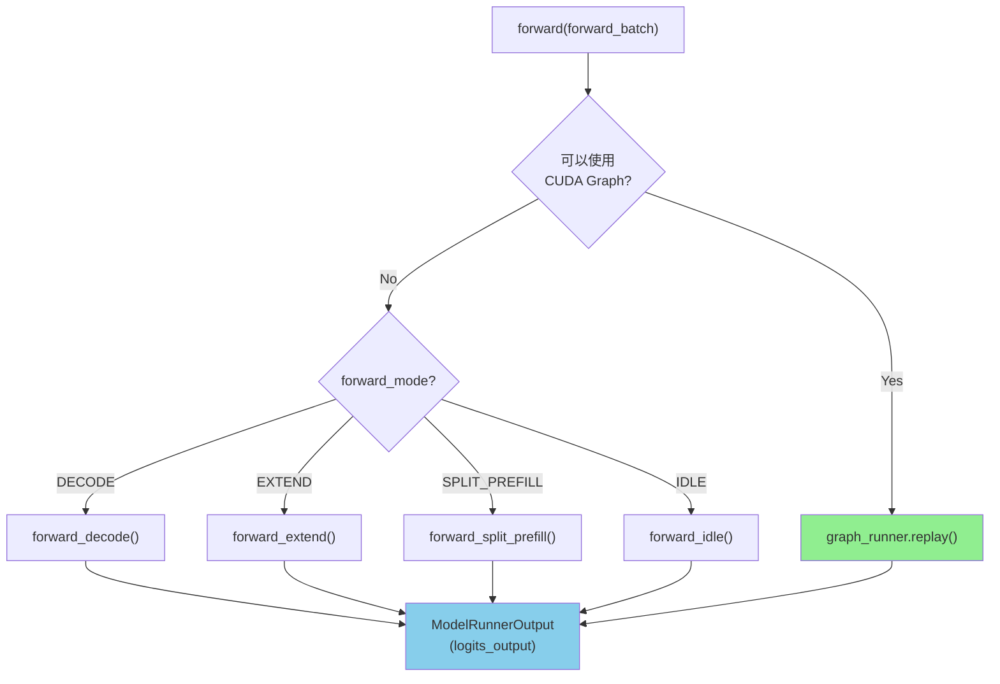

### 4.2 forward_decode

```python
def forward_decode(
    self,
    forward_batch: ForwardBatch,
    skip_attn_backend_init: bool = False,
) -> LogitsProcessorOutput:
    if not skip_attn_backend_init:
        self.attn_backend.init_forward_metadata(forward_batch)

    return self.model.forward(
        forward_batch.input_ids,
        forward_batch.positions,
        forward_batch,
    )
```

### 4.3 forward_extend

```python
def forward_extend(
    self,
    forward_batch: ForwardBatch,
    skip_attn_backend_init: bool = False,
) -> LogitsProcessorOutput:
    # 尝试 Piecewise CUDA Graph (长序列优化)
    if self.piecewise_cuda_graph_runner and piecewise_runner.can_run(forward_batch):
        return self.piecewise_cuda_graph_runner.replay(forward_batch)

    if not skip_attn_backend_init:
        self.attn_backend.init_forward_metadata(forward_batch)

    return self.model.forward(
        forward_batch.input_ids,
        forward_batch.positions,
        forward_batch,
    )
```

### 4.4 forward_idle

**用途**: 用于 DP Attention (数据并行注意力) 场景。

**触发条件**: 当某个 Worker 在当前 step 没有被分配到任何请求 (IDLE 状态)，但仍需参与 NCCL 集合通信 (AllReduce/AllGather) 以防止死锁。

**如果没有 forward_idle 会怎样？** DP Attention 中所有 rank 必须同步参与 AllReduce。如果一个 rank 没有请求就跳过 forward，其他 rank 会在 AllReduce 处永远等待 → **NCCL 死锁**。

```python
def forward_idle(self, forward_batch: ForwardBatch):
    # 关键: 不初始化 attn_backend metadata
    # 因为没有实际请求，attention 元数据无意义
    # 但仍然运行模型 forward 以参与 NCCL 通信
    return self.model.forward(
        forward_batch.input_ids,     # 空的 input_ids (0 tokens)
        forward_batch.positions,     # 空的 positions
        forward_batch,
    )
```

**输入**：`input_ids` 为空张量（0 个 token），`batch_size=0`。模型内部的 NCCL AllReduce 仍然会被调用（即使数据为空），确保所有 rank 同步。

### 4.5 forward_split_prefill

**用途**: 用于 **PDMux (Prefill-Decode Multiplexing)** 场景。详见 §8。

简述：将 Prefill 分解为**逐层执行**，使得 Prefill 和 Decode 可以在同一时间步交错进行，减少 Decode 请求的延迟抖动。

### 4.6 skip_attn_backend_init 参数

- **含义**: 为 `True` 时跳过 `attn_backend.init_forward_metadata()`，即不重新构建 kv_indptr / kv_indices 等索引结构。
- **使用场景**: **仅用于投机解码 (EAGLE/EAGLE-V2)**，核心原因是 EAGLE 将"准备 attention metadata"和"执行 model forward"解耦，使得 metadata 可以提前或一次性准备，多次 forward 复用。

> [!IMPORTANT]
> `tp_worker.py:402-405` 的 FIXME 注释指出这个参数设计并不完美，未来可能被重构。

#### 场景 1: Draft Model 多步循环 (Multi-Step Draft)

EAGLE Draft 模型在一次 `draft_forward()` 中需要连续执行 `speculative_num_steps` 步，每步生成 TopK 候选 token。所有步共享同一套 attention metadata（seq_lens 不变，只是 position +1），因此在**循环前一次性初始化**，循环内跳过：

```python
# eagle_worker.py:549-554 (EAGLE V1)
if not forward_batch.forward_mode.is_idle() and self.speculative_num_steps > 1:
    self.draft_attn_backend.init_forward_metadata(forward_batch)  # 循环前初始化一次

parent_list, top_scores_index, draft_tokens = self.draft_forward(forward_batch)

# eagle_worker.py:653-654 (循环内每一步)
for i in range(num_steps):
    # ... 更新 input_ids, positions, out_cache_loc ...
    logits_output = self.draft_model_runner.forward(
        forward_batch, skip_attn_backend_init=True  # ← 跳过
    ).logits_output
```

EAGLE V2 同理 (`eagle_worker_v2.py:286-292, 394-395`)。

#### 场景 2: Draft Extend (验证后补充 KV Cache)

验证完成后，被接受的 token 需要写入 Draft Model 的 KV Cache（"draft extend"）。此时先**手动调用 `init_forward_metadata`**，然后 `forward()` 时跳过：

```python
# eagle_worker.py:946-952 (非 CUDA Graph 路径)
if not forward_batch.forward_mode.is_idle():
    self.draft_model_runner.attn_backend.init_forward_metadata(forward_batch)

logits_output = self.draft_model_runner.forward(
    forward_batch, skip_attn_backend_init=True  # ← 跳过，因为上面已初始化
).logits_output
```

V2 的 `_draft_extend_for_decode` 类似 (`eagle_worker_v2.py:518-520`)。

#### 场景 3: V2 Overlapped Verify (Target 模型验证)

EAGLE V2 的核心优化：在 Draft 执行 `build_tree_kernel_efficient` 的同时，**在另一个 CUDA Stream 上提前准备 Target 模型的验证 metadata**：

```python
# eagle_info_v2.py:244-257 (在 plan_stream 上执行)
can_run_cuda_graph = bool(
    target_worker.model_runner.graph_runner
    and target_worker.model_runner.graph_runner.can_run(verify_forward_batch)
)
if can_run_cuda_graph:
    target_worker.model_runner.graph_runner.replay_prepare(verify_forward_batch)
else:
    if not batch.forward_mode.is_idle():
        target_worker.model_runner.attn_backend.init_forward_metadata(
            verify_forward_batch
        )

# eagle_worker_v2.py:699-703 (在 main stream 上，直接跳过)
forward_batch_output = self.target_worker.forward_batch_generation(
    model_worker_batch=None,
    forward_batch=verify_forward_batch,
    is_verify=True,
    skip_attn_backend_init=True,  # ← metadata 已在 plan_stream 上准备好
)
```

#### 总结

```
┌──────────────────────────────────────────────────────────────────────────────┐
│ 场景                     │ 谁调 init_forward_metadata │ 谁跳过 forward     │
├──────────────────────────┼───────────────────────────┼───────────────────────┤
│ 1. Draft 多步循环         │ 循环前一次性调用           │ 循环内每步的 forward │
│ 2. Draft Extend          │ forward 前手动调用         │ forward 自身        │
│ 3. V2 Overlapped Verify  │ plan_stream 上提前调用     │ main stream 的 forward│
└──────────────────────────┴───────────────────────────┴───────────────────────┘

核心思想: EAGLE 解耦了 "准备 attention metadata" 与 "执行 model forward"，
         使得 metadata 可以 (1) 一次准备多次复用，或 (2) 在不同 stream 上流水线化。
```

### 4.7 sample

```python
def sample(
    self,
    logits_output: LogitsProcessorOutput,
    forward_batch: ForwardBatch,
) -> torch.Tensor:
    """采样下一个 token"""

    # 1. 预处理 logits (应用 bias, regex mask 等)
    self._preprocess_logits(logits_output, forward_batch.sampling_info)

    # 2. 调用 sampler
    next_token_ids = self.sampler(
        logits_output,
        forward_batch.sampling_info,
        forward_batch.return_logprob,
        forward_batch.top_logprobs_nums,
    )

    return next_token_ids
```

## 5. CUDA Graph 详解

### 5.1 为什么需要 CUDA Graph?

**Decode 阶段的瓶颈**: 每步只生成 1 token/request，计算量极小（相比 Prefill 的数千 token），但 CPU 端的 kernel launch 开销成为主要瓶颈。一次 Transformer 层的 forward 涉及数十个小 kernel（QKV 投影、RoPE、Attention、MLP 各层、LayerNorm、AllReduce 等），每个 kernel 的 launch 延迟约 5-10μs，累积起来可达毫秒级。

```
传统执行 (逐个 Launch):
┌──────────────────────────────────────────────────────────────────────────────┐
│ CPU: │ launch │ wait │ launch │ wait │ launch │ wait │ launch │ ...        │
│      │ kern1  │      │ kern2  │      │ kern3  │      │ kern4  │            │
├──────────────────────────────────────────────────────────────────────────────┤
│ GPU: │        │ run  │        │ run  │        │ run  │        │ run  │     │
│      │  idle  │  k1  │  idle  │  k2  │  idle  │  k3  │  idle  │  k4  │    │
└──────────────────────────────────────────────────────────────────────────────┘
         ↑ gap    ↑ gap    ↑ gap    ↑ gap
      CPU launch 开销导致 GPU 出现空闲间隙 (bubble)
      Decode 阶段每个 kernel 计算量极小，bubble 占比可达 30-50%

CUDA Graph 执行 (一次提交):
┌──────────────────────────────────────────────────────────────────────────────┐
│ CPU: │ replay │                   (空闲，可做其他工作)                        │
│      │ graph  │                                                             │
├──────────────────────────────────────────────────────────────────────────────┤
│ GPU: │ k1 │ k2 │ k3 │ k4 │ k5 │ ...  │  连续执行，无 bubble                 │
└──────────────────────────────────────────────────────────────────────────────┘
      单次 replay ≈ 一次 kernel launch 的开销
      所有 kernel 按录制顺序连续执行，GPU 利用率接近 100%
```

**约束**: CUDA Graph 要求执行图的拓扑结构固定（同样的 kernel、同样的形状），因此需要按 batch_size 分别捕获。输入数据通过 `cudaMemcpy` 复制到固定地址的 buffer 中。

### 5.2 CudaGraphRunner 架构

```python
class CudaGraphRunner:
    def __init__(self, model_runner: ModelRunner):
        # 获取需要捕获的 batch size 列表
        self.capture_bs, self.compile_bs = get_batch_sizes_to_capture(model_runner)
        # capture_bs: 所有需要捕获的 batch size 列表
        # compile_bs: 其中 <= torch_compile_max_bs 的子集 (用于 torch.compile)
        #
        # 示例 (enable_torch_compile=True, torch_compile_max_bs=32):
        #   capture_bs = [1, 2, 4, 8, 16, 32, 64, 128, 256]
        #   compile_bs = [1, 2, 4, 8, 16, 32]  ← bs<=32 才 compile
        #
        # 捕获时:
        #   bs=16 → in compile_bs → patch_model(enable=True) → torch.compile + CUDA Graph
        #   bs=64 → not in compile_bs → patch_model(enable=False) → 仅 CUDA Graph, 无 compile
        #
        # compile_bs 存在的原因: 大 bs 时 torch.compile 编译时间长且收益有限,
        # 因为大 bs 的 GPU 利用率已经很高, kernel fusion 的边际收益小

        # 存储捕获的图
        self.graphs: Dict[int, torch.cuda.CUDAGraph] = {}
        self.output_buffers: Dict[int, LogitsProcessorOutput] = {}

        # 输入 buffer (预分配，复用)
        self.buffers: GraphInputBuffers = GraphInputBuffers.create(...)

        # 捕获所有 batch size
        self.capture()
```

### 5.3 捕获流程 (capture)

```python
def capture(self):
    # 从大到小捕获，利用内存共享
    for bs in reversed(self.capture_bs):
        with patch_model(self.model, bs in self.compile_bs, ...):
            graph, output = self.capture_one_batch_size(bs, forward)
            self.graphs[bs] = graph
            self.output_buffers[bs] = output
```

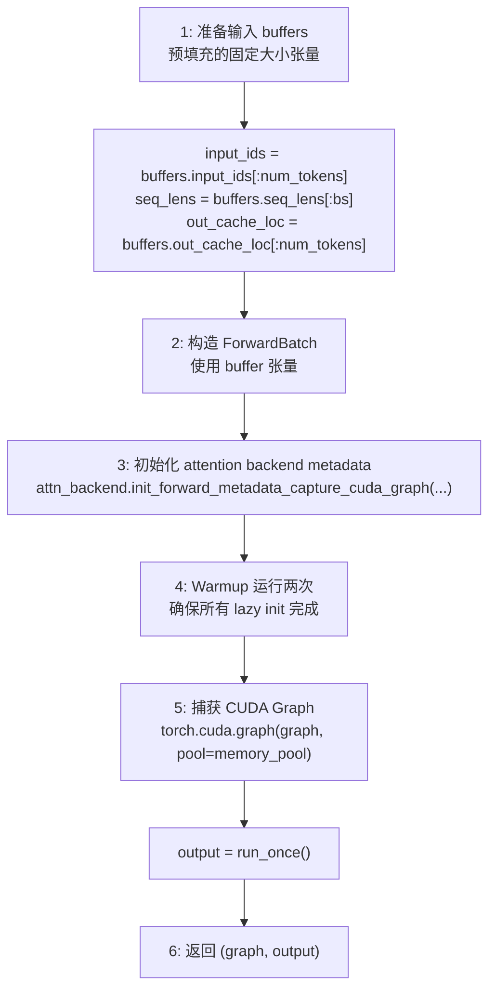

### 5.4 重放流程 (replay)

```python
def replay(self, forward_batch: ForwardBatch) -> LogitsProcessorOutput:
    # 1. 找到合适的 batch size (向上取整)
    index = bisect.bisect_left(self.capture_bs, forward_batch.batch_size)
    bs = self.capture_bs[index]

    # 2. 将实际数据复制到 buffer
    self.buffers.populate_from_forward_batch(forward_batch, ...)

    # 3. 更新 attention backend metadata
    attn_backend.init_forward_metadata_replay_cuda_graph(...)

    # 4. 重放图
    self.graphs[bs].replay()

    # 5. 返回预分配的输出 buffer
    return self.output_buffers[bs]
```

### 5.5 can_run 判断详解

```python
def can_run(self, forward_batch: ForwardBatch) -> bool:
    # 1. batch_size 检查
    is_bs_supported = cuda_graph_bs <= self.max_bs
    
    # 2. Encoder-Decoder 混合批次检查
    # 注意: Qwen-VL 等 Decoder-only 模型不受此限制 (始终为 True)
    # 仅 Mllama (Encoder-Decoder) 需要检查
    is_encoder_lens_supported = torch.all(forward_batch.encoder_lens > 0)
    
    # 3. Hidden state 捕获模式检查
    capture_hidden_mode_matches = (
        requested_mode == CaptureHiddenMode.NULL or 
        requested_mode == self.capture_hidden_mode
    )
    
    # 4. Two-Batch Overlap (TBO) 检查
    # TBO 将 batch 切分为两半，在不同 Stream 上重叠执行 Attention 和 MLP
    is_tbo_supported = forward_batch.can_run_tbo
    
    # 5. N-gram 投机解码检查
    is_ngram_supported = (bs * num_tokens_per_bs == input_ids.numel())
    
    return all([is_bs_supported, is_encoder_lens_supported, ...])
```

#### 各条件详解

| 条件 | 含义 | 失败场景 |
|------|------|---------|
| `is_bs_supported` | batch_size 在预捕获范围内 | 高并发时请求数超过 max_bs |
| `is_encoder_lens_supported` | 所有请求都有 encoder 输出（**仅 Mllama**，Qwen-VL 始终 True） | Mllama 混合批次：部分请求有图片 + 部分纯文本 |
| `capture_hidden_mode_matches` | hidden states 捕获模式匹配 | 需要返回 hidden states 但图没捕获该模式 |
| `is_tbo_supported` | Two-Batch Overlap 兼容（见下方 TBO 详解） | TBO 不可用时（如 Extend + A2A MoE Low Latency 模式） |
| `is_ngram_supported` | N-gram 投机解码 token 数匹配 | 投机解码时实际 token 数与预期不符 |

#### is_encoder_lens_supported 详解

**背景**: 仅针对 **Encoder-Decoder 架构** 模型（目前仅 Mllama）。
**注意**: Qwen-VL, LLaVA 等是 Decoder-only 架构，不受此检查影响 (始终通过)。

```
场景：Mixed Batch（混合批次）
┌────────────────────────────────────────────┐
│ Batch 内同时有：                            │
│   - Request A: 图片+文本 (encoder_lens=196) │
│   - Request B: 纯文本    (encoder_lens=0)   │
└────────────────────────────────────────────┘

问题：CUDA Graph 捕获时假设所有请求结构相同
     - 捕获时：所有请求都有 encoder 输出
     - 重放时：部分请求没有 encoder 输出
     → Attention mask、cross-attention 的计算路径不同
     → 固定的图无法处理这种动态分支
```

#### Fallback 机制

当 `can_run()` 返回 False 时：

```python
# model_runner.py forward() 逻辑
if forward_mode.is_cuda_graph() and self.cuda_graph_runner.can_run(batch):
    return self.cuda_graph_runner.replay(batch)  # 用 CUDA Graph
else:
    return self.forward_decode(batch)  # 降级到普通执行，有 launch 开销
```

#### TBO (Two-Batch Overlap) 详解

**核心文件**: `srt/batch_overlap/two_batch_overlap.py`

**TBO 是什么？** 将一个 batch 拆分为两个子 batch，在**不同 CUDA Stream** 上重叠执行 Attention 和 MLP，从而隐藏 MoE 通信开销。

**拆分策略**（`compute_split_seq_index`）：
- **Decode/TARGET_VERIFY**: 按序列数量**对半拆分** → `split_index = batch_size // 2`
- **Extend (Prefill)**: 按 token 数量**平衡拆分** → 使两半的 token 总量尽量接近

**工作原理**：
```
原始 Batch: [req0, req1, req2, req3]   (split_seq_index = 2)
  ↓ 拆分
子 Batch A: [req0, req1]  → Stream 0: Attention → 等待 MoE → MLP
子 Batch B: [req2, req3]  → Stream 1: 等待 Attention → MoE → 等待 MLP
  ↓ 重叠
Stream 0: [Attention_A] [     MoE_A     ] [MLP_A]
Stream 1:    [Attention_B] [     MoE_B     ] [MLP_B]
```

**何时不可用**（`can_run_tbo = False`）:
- Extend 模式 + A2A MoE + DeepEP Low Latency 同时启用时
- `tbo_split_seq_index` 计算为 None 时（如 batch 太小无法拆分）

## 6. Batch Size 填充策略

### 6.1 get_batch_sizes_to_capture

```python
def get_batch_sizes_to_capture(model_runner):
    # 默认捕获列表 (2 的幂次 + 中间值)
    capture_bs = server_args.cuda_graph_bs
    # 例: [1, 2, 4, 6, 8, 12, 16, 24, 32, 48, 64, 96, 128, 192, 256]

    # 添加最大 running requests
    capture_bs += [model_runner.req_to_token_pool.size]

    # 过滤超出范围的值
    capture_bs = [bs for bs in capture_bs if bs <= req_to_token_pool.size]

    return sorted(set(capture_bs))
```

### 6.2 Batch Size Padding

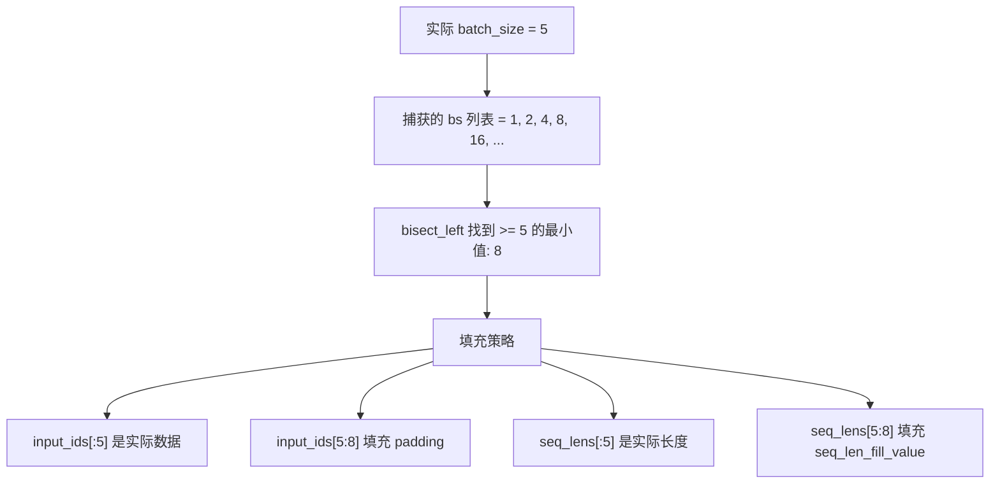

### 6.3 Padding 机制细节

当实际 batch size (`raw_bs`) 不在捕获列表中时，需要 pad 到最近的 `bs`：

| 字段 | 填充值 | 来源/原因 |
|------|--------|----------|
| `seq_lens` | `1` (FlashInfer) 或 `0` (Triton/FA) | `attn_backend.get_cuda_graph_seq_len_fill_value()` |
| `out_cache_loc` | `0` (dummy slot) | 写入物理 buffer 的 slot 0（dummy），不影响真实 KV |
| `input_ids` | `0` | padding 部分的 input 无意义（结果会被丢弃） |
| `positions` | `0` | 同上 |
| `encoder_lens` | `0` | 仅 Mllama 使用 |

**填充是否影响计算？** 会产生少量无用计算，但**不影响正确性**：
- Padding 请求的 `seq_len=1/0`，Attention 计算量极小
- Padding 请求的 KV 写入 dummy slot 0（不覆盖任何真实 KV）
- 最终输出通过切片丢弃 padding 部分

**结果如何取出？** `replay` 返回后，输出 logits 被切片回实际大小：
```python
# forward_batch_info.py - CUDA Graph 输出恢复
if forward_mode.is_decode():
    logits_output.next_token_logits = logits_output.next_token_logits[:raw_bs]
elif forward_mode.is_extend():
    logits_output.next_token_logits = logits_output.next_token_logits[:seq_lens_sum]
```

## 7. torch.compile 集成

### 7.1 配置

```python
def set_torch_compile_config():
    torch._inductor.config.coordinate_descent_tuning = True
    torch._inductor.config.triton.unique_kernel_names = True
    torch._inductor.config.fx_graph_cache = True
    torch._dynamo.config.accumulated_cache_size_limit = 1024
```

### 7.2 patch_model

```python
@contextmanager
def patch_model(model, enable_compile, num_tokens, tp_group):
    if enable_compile:
        # 进入 torch.compile 模式
        _to_torch(model, reverse=False, num_tokens=num_tokens)
        yield torch.compile(
            torch.no_grad()(model.forward),
            mode="max-autotune-no-cudagraphs",
        )
        # 退出 torch.compile 模式
        _to_torch(model, reverse=True, num_tokens=num_tokens)
    else:
        yield model.forward
```

### 7.3 为什么先 compile 再 capture？

`patch_model` 在捕获 CUDA Graph 之前调用 `torch.compile`，**顺序非常重要**：

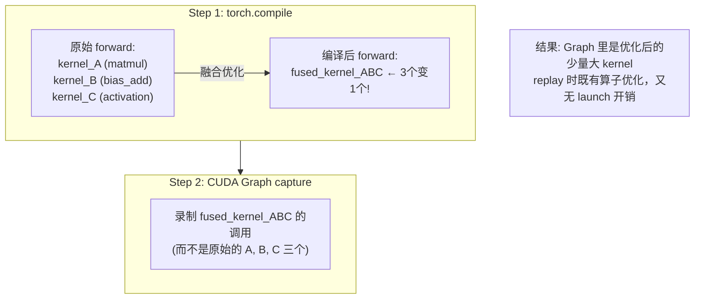

**顺序为什么重要？**

| 顺序 | 结果 |
|------|------|
| ✅ 先 compile 再 capture | compile 产出优化后的 kernel → capture 录制优化后的 kernel → replay 执行融合后的高效 kernel |
| ❌ 先 capture 再 compile | capture 录制原始 kernel → 图已固定无法再优化 → compile 的优化结果无法应用 |

**类比**:
- `torch.compile` = 把食谱优化（合并步骤、选更好的食材）
- `CUDA Graph` = 把优化后的食谱录成视频，以后照着做不用再看文字
- 必须先优化食谱，再录视频

### 7.4 CustomOp 与 torch.compile

SGLang 的自定义算子 (`CustomOp` 子类，`custom_op.py`) 在 `torch.compile` 下的行为：

```python
# custom_op.py enter_torch_compile()
def enter_torch_compile(self, num_tokens: int):
    if "FusedMoE" in self.__class__.__name__:
        if num_tokens == 1:  # ← 仅 bs=1 时切换
            self._forward_method = fused_moe_forward_native
    elif "TopK" in self.__class__.__name__:
        if num_tokens == 1:  # ← 仅 bs=1 时切换
            self._forward_method = self.forward_native
    else:
        self._forward_method = self.forward_native  # 其他算子总是切换
```

**为什么 FusedMoE/TopK 只在 `num_tokens==1` 时切换？**
- `num_tokens > 1` 时，FusedMoE CUDA kernel 的性能远优于 Python native 实现
- 但 `num_tokens==1`（Decode 阶段典型场景）时，kernel launch 开销占比大，native 实现被 torch.compile 融合后反而更快
- 所以大 bs 的 CUDA Graph 不做 compile（FusedMoE 保持 CUDA kernel），只有小 bs 的图才 compile

**Piecewise 模式**: Attention, MoE, AllReduce 是 **Split Ops** (图边界)，不参与编译，在图之间独立执行。
- 编译器只优化 Split Ops 之间的"胶水代码"（如 LayerNorm, Residual Add, Activation 等）

## 8. forward_split_prefill 详解

### 8.1 用途

`forward_split_prefill` 用于 **PDMux (Prefill-Decode Multiplexing)** 场景，将 Prefill 分解为**逐层执行**，与 Decode 交错进行：

```python
def forward_split_prefill(
    self,
    forward_batch: ForwardBatch,
    reinit_attn_backend: bool = False,
    forward_count: int = 1,  # 本次执行几层
) -> LogitsProcessorOutput:
    # 执行 [split_index, next_split_index) 层
    next_split_index = min(
        forward_batch.split_index + forward_count,
        self.model_config.num_hidden_layers,
    )
    ret = self.model.forward_split_prefill(
        forward_batch.input_ids,
        forward_batch.positions,
        forward_batch,
        (forward_batch.split_index, next_split_index),
    )
    forward_batch.split_index = next_split_index
    return ret
```

### 8.2 与 Overlap Schedule 配合

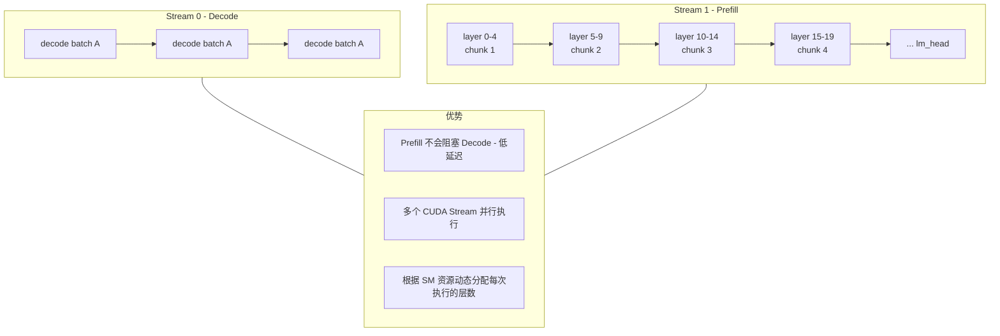

### 8.3 实现细节

#### 每次执行多少层？

由 `forward_count` 参数控制，PDMux 调度器根据 SM 资源和延迟要求动态决定：

```python
def forward_split_prefill(
    self,
    forward_batch: ForwardBatch,
    forward_count: int = 1,  # 控制每次执行几层
) -> LogitsProcessorOutput:
    next_split_index = min(
        forward_batch.split_index + forward_count,
        self.model_config.num_hidden_layers,
    )
    # 执行 [split_index, next_split_index) 这些层
    ret = self.model.forward_split_prefill(..., (split_index, next_split_index))
    forward_batch.split_index = next_split_index
    return ret
```

#### 多 Stream 交错执行

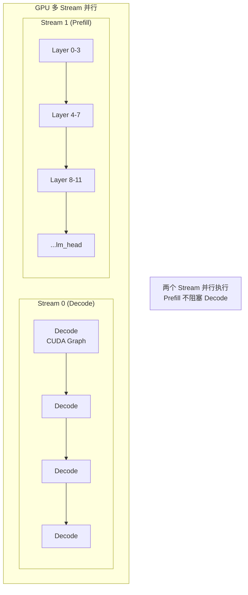

**交错逻辑** (伪代码):
```python
while prefill_not_done:
    # Stream 1: 执行 Prefill 的几层
    stream1.run(forward_split_prefill, forward_count=4)
    
    # Stream 0: 同时执行一轮 Decode (CUDA Graph replay)
    stream0.run(forward_decode)
    
    # 两个 Stream 并行执行，互不阻塞
```

#### 中间状态存储

ForwardBatch 保存跨调用的中间状态：

```python
@dataclass
class ForwardBatch:
    # Split Prefill 的中间状态
    hidden_states: torch.Tensor = None      # 当前层的输出
    residual: torch.Tensor = None           # 残差连接
    model_specific_states: Dict[str, any] = None  # 模型特定状态
    split_index: int = 0                    # 当前执行到第几层
```

**执行流程**:
```
第一次调用 (forward_count=4):
├── split_index = 0
├── 执行 layer 0~3
├── 保存 hidden_states, residual 到 forward_batch
└── split_index = 4

第二次调用 (forward_count=4):
├── split_index = 4
├── 从 forward_batch 读取上次的 hidden_states
├── 执行 layer 4~7
├── 更新 hidden_states
└── split_index = 8

... 继续直到所有层完成 + lm_head
```

**关键点**:
- `hidden_states` 和 `residual` 在 GPU 上保持，不需要 CPU↔GPU 传输
- forward_batch 对象在调用之间被保留
- `split_index` 记录进度，确保下次从正确位置继续

### 8.4 SPLIT_PREFILL vs EXTEND 对比

| 特性 | EXTEND (普通 Prefill) | SPLIT_PREFILL (PDMux) |
|------|----------------------|----------------------|
| **分块维度** | Token 维度 (Chunked Prefill) | Layer 维度 |
| **每次处理** | 部分 token，全部层 | 全部 token，部分层 |
| **中间状态** | KV Cache 已写入，下个 chunk 继续 | hidden_states 暂存，下几层继续 |
| **与 Decode 关系** | 顺序执行（或 MIXED batch） | 并行执行（多 Stream） |
| **目标** | 控制单次 prefill 内存峰值 | 降低 Decode 延迟抖动 |

## 9. 三种 CUDA Graph 对比

### 9.1 概览

| 特性 | Decode CUDA Graph | Piecewise CUDA Graph | VIT CUDA Graph |
|------|-------------------|----------------------|----------------|
| **目标阶段** | Decode (is_decode=True) | Prefill/Extend (LLM 部分) | Vision Encoder (ViT 部分) |
| **捕获维度** | batch_size | num_tokens | seq_len (image patch 数) |
| **捕获时机** | 启动时预捕获所有 bs | 启动时预捕获 | **懒加载** — 首次遇到新 shape 时 |
| **典型场景** | 逐 token 生成 | MoE 模型长序列 Prefill | Qwen2.5-VL / Qwen3.5 |
| **独立性** | 独立 | 独立（与 Decode CG 可共存） | **独立于 Piecewise**，用标准 `torch.cuda.CUDAGraph` |
| **torch.compile** | 可选（compile_bs 子集） | 内置 | **不使用** |
| **文件** | cuda_graph_runner.py | piecewise_cuda_graph_runner.py | vit_cuda_graph_runner.py |
| **开启方式** | 默认开启 | `--enable-piecewise-cuda-graph` | `SGLANG_VIT_ENABLE_CUDA_GRAPH=1` |

### 9.2 Decode CUDA Graph

```python
# CudaGraphRunner
capture_forward_mode = ForwardMode.DECODE  # 或 TARGET_VERIFY

# 按 batch_size 捕获
self.capture_bs = [1, 2, 4, 8, 16, 32, 64, 128, 256]
for bs in self.capture_bs:
    num_tokens = bs * 1  # Decode: 1 token per request
    self.graphs[bs] = capture_one_batch_size(bs, ...)
```

**开启条件**:
- `forward_mode.is_cuda_graph()` → True (DECODE, TARGET_VERIFY, DLLM_EXTEND)
- `batch_size <= max_bs` (在捕获范围内)
- 非 mixed batch (encoder-decoder 场景)
- capture_hidden_mode 匹配

**关闭条件**:
- `--disable-cuda-graph` 参数
- EAGLE Draft Worker 临时禁用 (初始化时)
- batch_size 超出捕获范围
- 返回 logprob 时如果 start_len 条件不满足

### 9.3 Piecewise CUDA Graph

> [!IMPORTANT]
> **"Piecewise" 的含义**: 模型的 fx 计算图被 `split_ops` 切割成多个 **"piece"（片段）**，每个片段独立捕获为一个 CUDA Graph。切割点处的算子（Attention、AllReduce 等）作为 **live ops** 在片段之间实时执行，**不被任何 graph 捕获**。

#### 9.3.1 为什么要分片？

Attention 和 AllReduce 的行为依赖运行时参数（seq_len、kv_indices 等），无法固定在 CUDA Graph 中。Piecewise 的解决方案是：把这些动态算子"挖出来"作为 live ops，只捕获它们之间的静态计算部分（MLP、LayerNorm、投影等）。

#### 9.3.2 split_ops 与分片过程

```python
# compilation_config.py:18-22
self.split_ops = [
    "sglang.unified_attention_with_output",  # Attention
    "sglang.gdn_with_output",               # GDN (Mamba/线性注意力)
    "sglang.inplace_all_reduce",             # TP AllReduce
]
```

`split_graph()` (`backend.py:213-256`) 将 fx 图按 `split_ops` 切割：

```
原始 fx 图 (一个 Transformer 层):
┌──────────────────────────────────────────────────────────────────────┐
│ QKV_proj → RoPE → Attention → O_proj → AllReduce → LN → Gate_Up → │
│ Act → Down_proj → AllReduce → LN                                    │
└──────────────────────────────────────────────────────────────────────┘

split_ops 切割后:
┌──────────┐   ┌───────────┐   ┌──────────┐   ┌────────────┐   ┌────┐
│ Piece 0  │   │ Live Op 1 │   │ Piece 2  │   │ Live Op 3  │   │ P4 │
│ QKV_proj │ → │ Attention │ → │ O_proj   │ → │ AllReduce  │ → │ LN │
│ RoPE     │   │ (实时执行) │   │          │   │ (实时执行)  │   │ .. │
│ [Graph]  │   │ [不捕获]   │   │ [Graph]  │   │ [不捕获]    │   │[G] │
└──────────┘   └───────────┘   └──────────┘   └────────────┘   └────┘

每个 [Graph] piece 独立捕获为 CUDA Graph
每个 [不捕获] live op 在 piece 之间实时执行
```

#### 9.3.3 捕获维度与时机

```python
# PiecewiseCudaGraphRunner
capture_forward_mode = ForwardMode.EXTEND  # Prefill/Extend 阶段

# 按 num_tokens (不是 batch_size) 捕获
self.capture_num_tokens = [128, 256, 512, 1024, 2048, 4096, ...]
for num_tokens in self.capture_num_tokens:
    self.graphs[num_tokens] = capture_one_batch_size(num_tokens, ...)
```

每个 piece 的捕获采用 **懒惰策略** (`cuda_piecewise_backend.py:151-190`)：
1. **第 1 次调用**: warmup（不捕获），让 PyTorch 分配内部 buffer
2. **第 2 次调用**: 实际捕获 CUDA Graph
3. **第 3+ 次调用**: replay

#### 9.3.4 与 Decode CUDA Graph 的对比

| 维度 | Decode CUDA Graph | Piecewise CUDA Graph |
|------|-------------------|---------------------|
| **ForwardMode** | DECODE | EXTEND |
| **捕获粒度** | 整个 forward (all layers) | 每个 piece (split_ops 之间的子图) |
| **捕获维度** | `batch_size` (1,2,4,...,256) | `num_tokens` (128,...,chunked_prefill_size) |
| **Attention** | 被捕获在 graph 内 | **不被捕获**，作为 live op 实时执行 |
| **AllReduce** | 被捕获在 graph 内 | **不被捕获**，作为 live op 实时执行 |
| **torch.compile** | 可选（独立的 `enable_torch_compile`） | 内置（piece 内的 MLP/LN 自动编译） |
| **图的数量** | N 个（N = 捕获的 bs 数量） | M × L 个（M = num_tokens 数, L = pieces/layer） |

> **共存关系**: Piecewise (EXTEND) 和 Decode (DECODE) 针对**不同 ForwardMode**，**可以同时开启**，互不冲突：
> - `forward_mode == EXTEND` → 尝试 Piecewise Graph
> - `forward_mode == DECODE` → 尝试 Decode Graph
> - 两者在不同的 step 使用，永远不会同时 replay

**关键区别**:
1. **捕获的是 Language Model 部分** (不含 VIT)
2. **使用 `input_embeds`** 作为输入 (VIT 输出复制到固定 buffer)
3. Piecewise **包含** 了自己的 torch.compile 流程（捕获时对 MLP/LayerNorm 等 segment 编译），因此与 `server_args.enable_torch_compile` (全局 compile) **冲突**，不能同时开启。
4. ViT CUDA Graph **也独立**：它只捕获 ViT Encoder 的 blocks + merger 部分，不涉及 LLM 层，三者互不干扰。

### 9.4 VIT CUDA Graph (Vision Encoder)

> **SGLang 有独立的 VIT CUDA Graph！** 通过 `SGLANG_VIT_ENABLE_CUDA_GRAPH=1` 启用。

**核心实现**: `srt/multimodal/vit_cuda_graph_runner.py`

```python
class ViTCudaGraphRunner:
    """捕获 blocks + merger + deepstack merger 部分到 CUDA Graph"""

    def __init__(self, vit: nn.Module):
        self.block_graphs: Dict[int, torch.cuda.CUDAGraph] = {}  # seq_len -> graph
        self.block_output: Dict[int, torch.Tensor] = {}
        self.block_input: Dict[int, torch.Tensor] = {}

    def _get_graph_key(self, x_3d: torch.Tensor) -> int:
        return x_3d.shape[0]  # 使用 seq_len 作为 key (不是 batch_size!)

    def run(self, x, cu_seqlens, ...):
        graph_key = self._get_graph_key(x_3d)
        if graph_key not in self.block_graphs:
            self.create_graph(...)  # 懒加载创建
        return self.replay(graph_key, x_3d, ...)
```

**VIT CUDA Graph 特点**:
1. **按 seq_len 捕获** (不是 batch_size)，因为 image patch 数量决定 seq_len
2. **懒加载捕获** - 首次遇到新 shape 时创建图，非启动时预捕获
3. **支持 Qwen2.5-VL 窗口注意力** (`fullatt_block_indexes`, `cu_window_seqlens`)
4. **支持 Qwen3.5 deepstack** (`deepstack_visual_indexes`, `deepstack_merger_list`)

**Qwen3.5 调用流程**:
```python
# qwen3_vl.py forward()
def forward(self, x, grid_thw):
    if envs.SGLANG_VIT_ENABLE_CUDA_GRAPH.get():
        return self.forward_with_cuda_graph(x, grid_thw)
    # 正常执行...

def forward_with_cuda_graph(self, x, grid_thw):
    x = self.patch_embed(x)          # 不在 Graph 中
    pos_embeds = self.fast_pos_embed_interpolate(grid_thw)  # 不在 Graph 中
    x += pos_embeds
    # blocks + merger + deepstack 通过 CUDA Graph 执行
    return self.cuda_graph_runner.run(x=x, ...)
```

**开启条件**:
```bash
export SGLANG_VIT_ENABLE_CUDA_GRAPH=1
```

**注意**:
- ViTCudaGraphRunner **独立于** PiecewiseCudaGraph，使用标准 `torch.cuda.CUDAGraph`。
- **不使用 torch.compile**。
- 在模型内部初始化 (如 `qwen3_vl.py`)，而非 ModelRunner。
- 仅支持 `triton_attn` 和 `fa3` attention backend
- `patch_embed` 和 `pos_embed` 在图外执行

### 9.5 开启/关闭条件总结

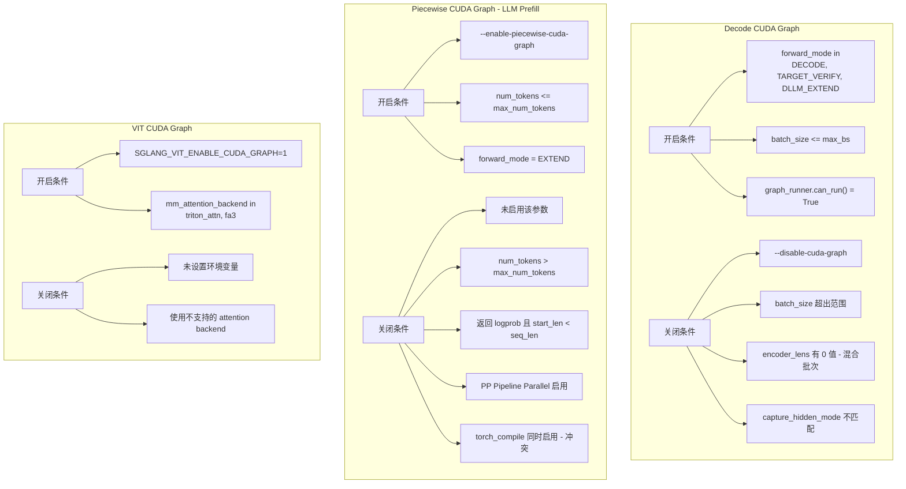

### 9.6 流量波动场景分析

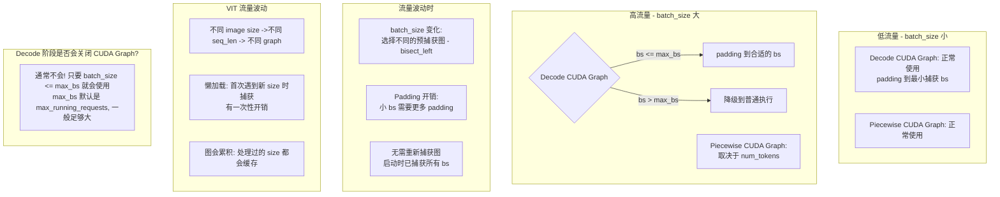

## 10. torch.compile vs CUDA Graph 对比

### 10.1 技术原理对比

| 特性 | torch.compile | CUDA Graph |
|------|---------------|------------|
| **层级** | Python/PyTorch 图编译 | CUDA Runtime 级别 |
| **优化目标** | kernel fusion, 算子优化 | 消除 kernel launch 开销 |
| **动态性** | 支持动态 shape (有限制) | **固定 shape** |
| **JIT 编译** | 是 (首次运行慢) | 否 (捕获时一次性开销) |
| **适用阶段** | Compute-bound (Prefill) | Memory-bound (Decode) |

### 10.2 核心区别

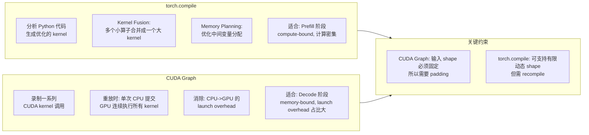

### 10.3 组合使用场景

```python
# 1. Decode CUDA Graph + torch.compile (CudaGraphRunner)
class CudaGraphRunner:
    def __init__(self):
        if server_args.enable_torch_compile:
            # 在 CUDA Graph 捕获前先 torch.compile
            self.compile_bs = [bs for bs in self.capture_bs if bs <= torch_compile_max_bs]

    def capture_one_batch_size(self, bs, forward):
        with patch_model(model, bs in self.compile_bs):
            # 先 compile 优化 kernel，再捕获成 Graph
            graph = capture(forward(...))

# 2. Piecewise CUDA Graph + torch.compile (PiecewiseCudaGraphRunner)
class PiecewiseCudaGraphRunner:
    def __init__(self):
        # 必须配合使用
        self.compile_config = CompilationConfig(
            piecewise_cuda_graph_tokens,
            piecewise_cuda_graph_compiler,  # "eager" or "inductor"
        )
        with set_compiled(True), enable_piecewise_cuda_graph_compile():
            self.warmup_torch_compile(num_tokens)
            self.capture()

# 3. VIT CUDA Graph (不使用 torch.compile)
class ViTCudaGraphRunner:
    # 直接捕获，无 torch.compile
    pass
```

### 10.4 各模块组合使用情况

| 组件 | torch.compile | CUDA Graph | 说明 |
|------|---------------|------------|------|
| **Decode (LLM)** | 可选 | 默认开启 | torch.compile 优化 kernel，Graph 减少 launch |
| **Prefill (LLM)** | - | Piecewise 可选 | Piecewise 用于 MoE 模型，内置 torch.compile |
| **VIT Encoder** | 不使用 | 可选 | 仅用 Graph，不用 compile |
| **EAGLE Draft** | 可选 | 可选 | 类似 Decode |

### 10.5 如何选择

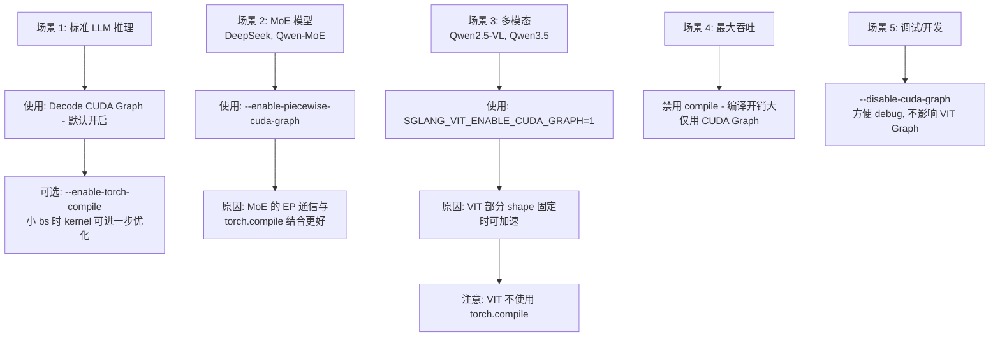

### 10.6 常见误区澄清

- **推理中是否 Recompile?**: **不会**。`torch.compile` 只在启动时的 capture 阶段执行（`CudaGraphRunner.capture()` 循环中 `patch_model()` 触发）。Capture 完成后调用 `leave_torch_compile()` 恢复原始 dispatch，之后的推理全部通过 `graph.replay()` 执行，**没有 Python 层面的模型调用**，因此不会触发 dynamo guard check 或 recompile。`cache_size_limit=1024` 是在 capture 阶段用于避免不同 bs 之间的 guard miss，不是推理时用的。
- **MoE 默认开启 Piecewise?**: 否。Piecewise 需显式 `--enable-piecewise-cuda-graph` 开启。但开启后会自动识别 MoE 层作为 split op。

### 10.7 Piecewise CUDA Graph 代码示例

用于长序列 Prefill 的优化 (进一步代码细节可参考 §9.3):

```python
def init_piecewise_cuda_graphs(self):
    # 收集 attention 和 MoE 层
    for layer in self.model.model.layers:
        if hasattr(layer, "self_attn"):
            self.attention_layers.append(layer.self_attn.attn)
        if hasattr(layer, "mlp") and hasattr(layer.mlp, "experts"):
            self.moe_layers.append(layer.mlp.experts)

    self.piecewise_cuda_graph_runner = PiecewiseCudaGraphRunner(self)
```

## 11. 初始化流程

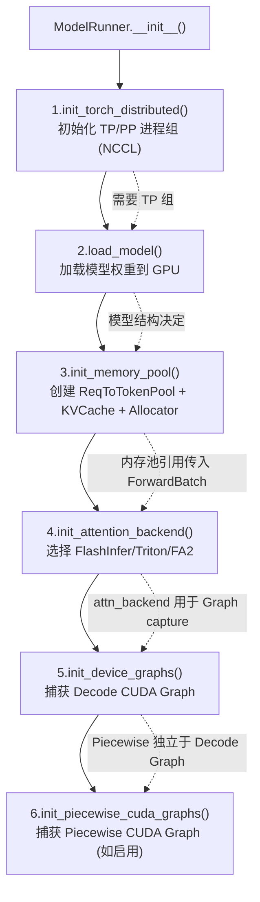

> **依赖链**：TP 组 → 模型权重 → 内存池 → Attention 后端 → CUDA Graph。每一步都依赖前一步的结果。

## 12. 内存管理

### 12.1 全局图内存池

```python
# cuda_graph_runner.py
global_graph_memory_pool = None

def get_global_graph_memory_pool():
    return global_graph_memory_pool

def set_global_graph_memory_pool(val):
    global global_graph_memory_pool
    global_graph_memory_pool = val

# 首次捕获时设置
if get_global_graph_memory_pool() is None:
    set_global_graph_memory_pool(torch.cuda.graph_pool_handle())
```

### 12.2 GraphInputBuffers

```python
@dataclass
class GraphInputBuffers:
    input_ids: torch.Tensor           # [max_num_token]
    req_pool_indices: torch.Tensor    # [max_bs]
    seq_lens: torch.Tensor            # [max_bs]
    seq_lens_cpu: torch.Tensor        # [max_bs] (host)
    out_cache_loc: torch.Tensor       # [max_num_token]
    positions: torch.Tensor           # [max_num_token]

    # 用于 CUDA Graph replay 时填充数据
    def populate_from_forward_batch(self, forward_batch, ...):
        self.input_ids[:num_tokens].copy_(forward_batch.input_ids)
        self.seq_lens[:bs].copy_(forward_batch.seq_lens)
        ...
```

### 12.3 CUDA Graph 的固定地址约束

**核心限制**: CUDA Graph 捕获时录制的是**指针地址**，不是数据值。

```
捕获时: kernel_A(ptr=0x7f8a0000, ...)  ← 录下这个地址
重放时: 还是调用 kernel_A(ptr=0x7f8a0000, ...)  ← 地址不变！
```

**这就是为什么需要 GraphInputBuffers**:

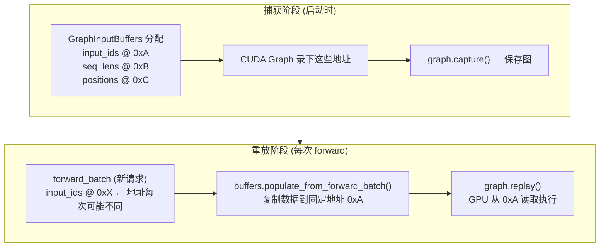

**如果没有 GraphInputBuffers 会怎样？**

```python
# ❌ 错误做法：直接用 forward_batch 的 tensor
graph.replay()  # 图内部还在读旧地址 0x7f8a0000
                # 但 forward_batch.input_ids 可能在 0x7f8b0000
                # → 读到错误数据或 CUDA crash！
```

**关键代码路径**:
```python
# cuda_graph_runner.py:787
seq_lens_cpu = buffers.populate_from_forward_batch(
    forward_batch=forward_batch,  # 新数据源（地址不固定）
    raw_bs=raw_bs,
    bs=bs,
    ...
)
# 内部实现: self.input_ids[:n].copy_(forward_batch.input_ids)
```

## 13. 配置参数

| 参数 | 默认值 | 说明 |
|------|--------|------|
| `disable_cuda_graph` | False | 禁用 CUDA Graph |
| `cuda_graph_bs` | auto | 捕获的 batch size 列表 |
| `enable_torch_compile` | False | 启用 torch.compile |
| `torch_compile_max_bs` | 32 | torch.compile 最大 bs |
| `enable_piecewise_cuda_graph` | False | 启用分段 CUDA Graph |
| `disable_cuda_graph_padding` | False | 禁用 bs padding |

## 14. 多模态请求执行流程

以 Qwen3.5 处理带图片请求为例：

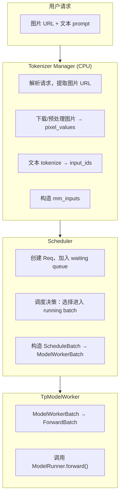

### 14.1 Prefill 阶段详解

```mermaid
flowchart TB
    subgraph Prefill["ModelRunner.forward() - EXTEND 模式"]
        P1["forward_mode = EXTEND"]
        
        subgraph VIT["VIT 处理"]
            V1["pixel_values → patch_embed"]
            V2["pos_embed 计算"]
            V3["VIT blocks (可能用 VIT CUDA Graph)"]
            V4["all_gather 收集多卡结果 (如果 DP)"]
        end
        
        subgraph Merge["Embedding 融合"]
            M1["text_embeds = embed_tokens(input_ids)"]
            M2["hidden_states = merge(text_embeds, image_embeds)"]
        end
        
        subgraph LLM["LLM Layers"]
            L1["32~80 层 transformer blocks"]
            L2["写入 KV Cache"]
            L3["不用 Decode CUDA Graph"]
            L4["可选: Piecewise CUDA Graph"]
        end
        
        subgraph Output["输出"]
            O1["lm_head → logits"]
            O2["sample → next_token"]
        end
        
        P1 --> VIT --> Merge --> LLM --> Output
    end
```

### 14.2 Decode 阶段详解

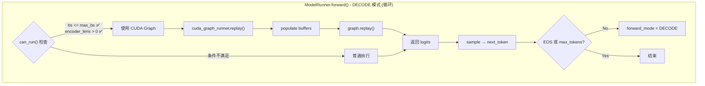

### 14.3 各阶段 CUDA Graph 使用总结

| 阶段 | CUDA Graph 类型 | 是否使用 | 条件 |
|------|----------------|---------|------|
| VIT 处理 | VIT CUDA Graph | 可选 | `SGLANG_VIT_ENABLE_CUDA_GRAPH=1` |
| LLM Prefill | Piecewise CUDA Graph | 可选 | `--enable-piecewise-cuda-graph` |
| LLM Decode (纯) | Decode CUDA Graph | ✅ 默认开启 | `can_run() = True` |
| LLM Decode (MIXED) | Decode CUDA Graph | ❌ 通常不用 | forward_mode 不是 DECODE |

## 15. 调试技巧

### 15.1 查看捕获的 batch size

```python
# 启动日志中会显示
logger.info(f"Capture cuda graph bs {self.capture_bs}")
```

### 15.2 禁用 CUDA Graph 调试

```bash
python -m sglang.launch_server ... --disable-cuda-graph
```

### 15.3 Profile CUDA Graph

```python
# 启用 profiler
--enable-profile-cuda-graph
# 输出: cuda_graph_runner_memory_usage.pickle
```

## 16. ModelRunner 核心要点总结

### 必须掌握的概念

| 概念 | 要点 | 关键代码位置 |
|------|------|-------------|
| **三层数据结构** | ScheduleBatch → ModelWorkerBatch → ForwardBatch 的转换与设计原因 | `forward_batch_info.py:init_new()` |
| **ForwardMode** | EXTEND/DECODE/MIXED/SPLIT_PREFILL 的区别与使用场景 | `forward_batch_info.py:70-180` |
| **CUDA Graph 原理** | 解决 kernel launch 开销，固定地址约束 | `cuda_graph_runner.py` |
| **GraphInputBuffers** | 预分配固定地址 buffer，replay 时 copy 数据 | `input_buffers.py` |
| **can_run() 判断** | 5 个条件决定是否使用 CUDA Graph | `cuda_graph_runner.py:373-437` |
| **torch.compile + CUDA Graph** | 先 compile 优化 kernel，再 capture 录制 | `cuda_graph_runner.py:140-170` |

### 关键执行路径

```
ModelRunner.forward()
├── forward_mode.is_cuda_graph() && can_run()?
│   ├── Yes → cuda_graph_runner.replay()
│   │         ├── bisect_left 选择合适的 bs
│   │         ├── buffers.populate_from_forward_batch()
│   │         └── graph.replay()
│   └── No → 根据 forward_mode 分发
│            ├── DECODE → forward_decode()
│            ├── EXTEND → forward_extend()
│            ├── SPLIT_PREFILL → forward_split_prefill()
│            └── IDLE → forward_idle()
└── sample() → next_token_ids
```

### 常见问题排查

| 问题 | 可能原因 | 排查方法 |
|------|---------|---------|
| Decode 延迟突然升高 | CUDA Graph fallback 到普通执行 | 检查 `can_run()` 条件，看日志是否有 fallback |
| 启动时间很长 | CUDA Graph 捕获多个 bs | 减少 `cuda_graph_bs` 列表大小 |
| 显存 OOM | CUDA Graph 占用过多 | 减少捕获的 bs 数量，或用 `--disable-cuda-graph` |
| 多模态请求慢 | VIT CUDA Graph 未开启 | 设置 `SGLANG_VIT_ENABLE_CUDA_GRAPH=1` |

### 性能调优建议

| 场景 | 建议配置 |
|------|---------|
| 标准 LLM 推理 | 默认配置 (Decode CUDA Graph 开启) |
| MoE 模型 | `--enable-piecewise-cuda-graph` |
| 多模态模型 | `SGLANG_VIT_ENABLE_CUDA_GRAPH=1` |
| 调试/开发 | `--disable-cuda-graph` |
| 低延迟优先 | 开启 PDMux (`--enable-pdmux`) |

## 17. Batch Overlap 集成 (v0.5.9 新增)

ModelRunner 在 `forward()` 方法中与 `batch_overlap/` 模块协作，支持 SBO/TBO 两种重叠模式。

**文件**: `srt/model_executor/model_runner.py` (2688行)

### 关键方法 (v0.5.9 行号)

| 方法 | 行号 | 说明 |
|------|------|------|
| `ModelRunner` 类定义 | L278 | 主类 |
| `forward_decode` | L2284 | Decode 前向 |
| `forward_extend` | L2307 | Extend 前向 |
| `forward_idle` | L2347 | Idle 前向 |
| `forward_split_prefill` | L2366 | Split Prefill 前向 |
| `forward` | L2387 | 统一前向入口 |

当启用 batch overlap 时，ModelRunner 使用 SBO 或 TBO 的 forward 路径替代标准 forward，在 MoE 层的 all-to-all 通信与 attention 计算之间实现重叠。

> **详细分析**: 见 **24-batch-overlap.md**

## 18. KV Cache Mixin (v0.5.9 新增)

**文件**: `srt/model_executor/model_runner_kv_cache_mixin.py`

KV Cache 管理逻辑从 model_runner.py 抽取到独立 mixin，包括：
- KV Cache 的初始化和配置
- 内存池的创建和管理
- CUDA Graph 中 KV Cache 的处理

## 19. 其他新增模块 (v0.5.9)

| 文件 | 说明 |
|------|------|
| `input_buffers.py` (8047行) | CUDA Graph 输入缓冲区管理（`GraphInputBuffers` 类），从 ModelRunner 重构出来 |
| `hook_manager.py` (83行) | Hook 管理器，支持在 forward 过程中注入自定义逻辑 |
| `cpu_graph_runner.py` | CPU Graph Runner，用于 CPU 端的图执行 |
| `piecewise_cuda_graph_runner.py` | 分段 CUDA Graph Runner，支持更灵活的图捕获策略 |
| `forward_batch_deepseek_mha_mixin.py` (9681行) | DeepSeek MHA 专用的 ForwardBatch 扩展 |

## 20. 下一步

- **09**: Attention 后端 (FlashInfer, FlashAttention, Triton)
- **10**: 模型加载、权重处理、量化支持
