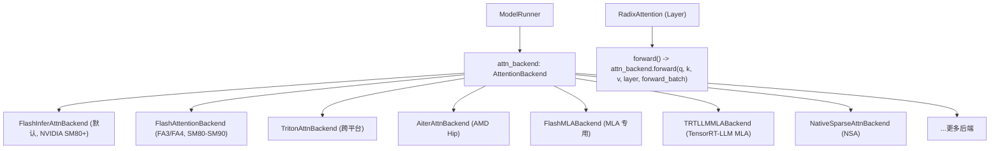
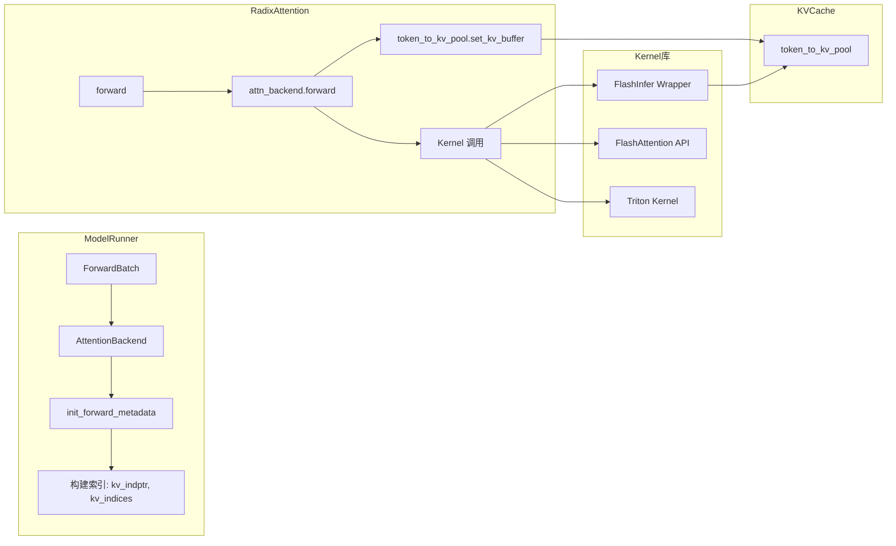
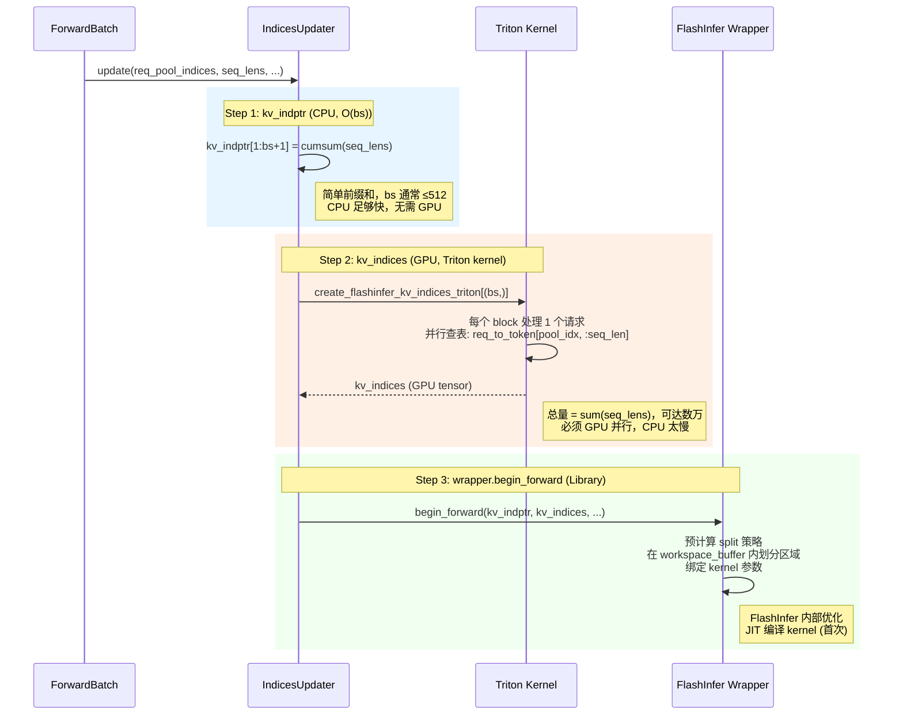
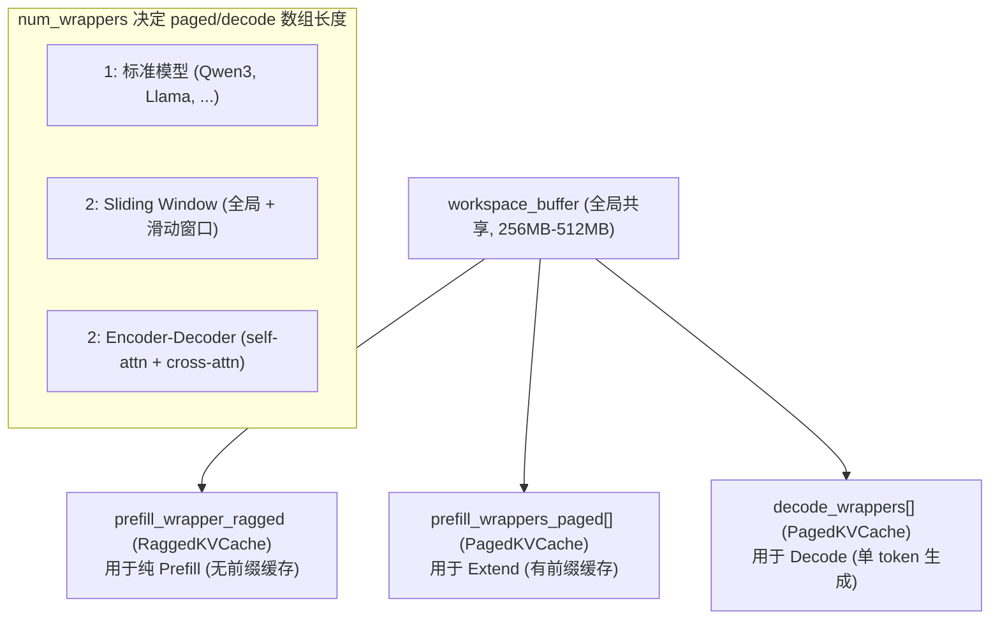
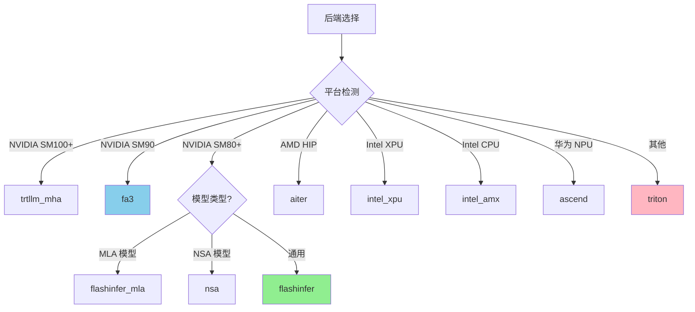
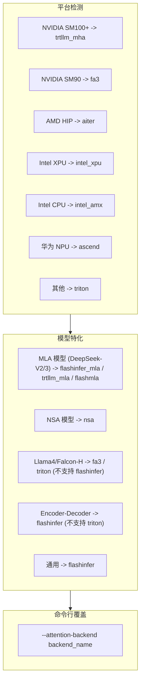
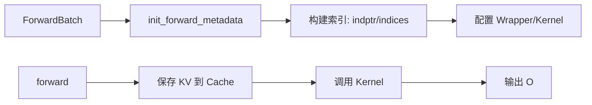

# 08: Attention 后端

## 1. 概述

Attention 后端是 SGLang 中负责执行注意力计算的核心组件。不同的后端针对不同的硬件和场景进行了优化。



### 1.1 核心理解：Backend 的本质

#### Q0: Attention Backend 到底在做什么？

> [!IMPORTANT]
> **一句话答案**: Attention Backend = **索引准备** + **硬件/阶段选择** + **调用专用 Kernel 库**

Attention Backend **不实现** Attention 的数学公式 (`Softmax(QK^T/√d_k)·V`)，而是：
1. 根据 `ForwardBatch` 构建 Kernel 需要的索引结构
2. 根据硬件平台和 ForwardMode 选择合适的 Kernel
3. 调用专用库 (FlashInfer/FlashAttention/Triton) 执行实际计算

#### 1.1.1 三层职责边界

```
┌──────────────────┬─────────────────────────────────────────────────────────────────┐
│ 层次              │ 职责                                                             │
├──────────────────┼─────────────────────────────────────────────────────────────────┤
│ Backend (调度层)  │ 索引计算、Wrapper 管理、硬件/阶段分发、CUDA Graph 状态管理         │
│ Kernel (计算层)   │ 实际 Attention 矩阵运算 (FlashInfer/FlashAttention/Triton kernel)│
│ KVCache (存储层)  │ KV 数据的物理存储、读写、页表管理                                  │
└──────────────────┴─────────────────────────────────────────────────────────────────┘
```

#### 1.1.2 Backend 不做什么

| ❌ 不负责 | ✅ 由谁负责 |
|----------|-----------|
| Attention 数学计算 | FlashInfer/FA 等 Kernel 库 |
| KV Cache 内存分配 | `TokenToKVPoolAllocator` |
| 请求调度 | `Scheduler` |
| 采样逻辑 | `Sampler` |

#### 1.1.3 与其他组件的关系



#### 1.1.4 Kernel 库的调用示例

```python
# FlashInfer 后端 - 调用 flashinfer 库
from flashinfer import BatchDecodeWithPagedKVCacheWrapper
o = decode_wrapper.forward(q, kv_buffer, sm_scale=..., logits_soft_cap=...)

# FlashAttention 后端 - 调用 sgl_kernel (封装的 FA)
from sgl_kernel.flash_attn import flash_attn_with_kvcache
o = flash_attn_with_kvcache(q, k_cache, v_cache, cache_seqlens=..., block_table=...)

# Triton 后端 - 调用 SGLang 自己写的 Triton kernel
from sglang.srt.layers.attention.triton_ops.decode_attention import decode_attention_fwd
decode_attention_fwd(q, k_cache, v_cache, o, kv_indptr=..., kv_indices=..., num_kv_splits=...)
```

### 1.2 RadixAttention 的角色

> [!IMPORTANT]
> `RadixAttention` 是一个 **`nn.Module` 调度器**，它**不实现** Attention 数学运算，而是持有层级元数据（head 配置、scale、sliding window 等）并将计算委托给 `AttentionBackend`。

```python
# python/sglang/srt/layers/radix_attention.py
class RadixAttention(nn.Module):
    def __init__(self, num_heads, head_dim, scaling, num_kv_heads, layer_id,
                 logit_cap=0.0, sliding_window_size=-1, is_cross_attention=False, ...):
        self.tp_q_head_num = num_heads
        self.tp_k_head_num = num_kv_heads
        self.head_dim = head_dim
        self.scaling = scaling
        self.layer_id = layer_id
        self.sliding_window_size = sliding_window_size or -1
        self.is_cross_attention = is_cross_attention
        # ... 存储层级元数据，无 attention 计算逻辑

    def forward(self, q, k, v, forward_batch, save_kv_cache=True, **kwargs):
        # 路径 1: Piecewise CUDA Graph (torch.compile 上下文)
        if forward_batch.forward_mode.is_extend() and get_forward_context() is not None:
            torch.ops.sglang.unified_attention_with_output(
                q, k, v, output, save_kv_cache, self.layer_id, **kwargs
            )
            return output
        # 路径 2: 标准调度 → 委托给 Backend
        return forward_batch.attn_backend.forward(q, k, v, self, forward_batch, ...)
```

> **为什么叫 "Radix"？** 这个名字来自 SGLang 的 **Radix Tree 前缀缓存系统** (RadixCache)。RadixAttention 的设计与 RadixCache 紧密耦合：通过 `forward_batch.token_to_kv_pool` 读写由 Radix Tree 管理的 KV Cache slot，使得 prefix sharing 对 Attention 层透明。每个 Transformer 层实例化一个 RadixAttention，它作为模型定义（`nn.Module`）和推理引擎（`AttentionBackend`）之间的桥梁。

> **为什么不直接用 AttentionBackend？为什么需要这个中间层？**
>
> 核心原因是 **关注点分离**：
> 1. **模型定义层** (Qwen3Attention 等) 只关心 Q/K/V 的线性变换，不关心 KV Cache 怎么存、用哪个 kernel
> 2. **AttentionBackend** 只关心索引构建和 kernel 调度，不关心每层的 head 数量、scale、是否 sliding window
> 3. **RadixAttention 桥接两者**：它作为 `nn.Module` 嵌入模型结构，**持有每层的固定参数**（head 数量、scale、layer_id、sliding_window_size），在 `forward()` 时将 `self`（层参数）传递给 Backend，让 Backend 据此选择正确的 wrapper 和配置
>
> 如果没有 RadixAttention，要么模型定义层需要感知 Backend API（耦合），要么 Backend 需要为每层维护参数表（冗余）。RadixAttention 让模型代码保持 HuggingFace 风格的简洁性，同时让 Backend 获得所需的层级信息。

```
┌──────────────────────────────────────────────────────────────────────────┐
│  模型定义 (HuggingFace 风格)                                              │
│  Qwen3Attention / LlamaAttention / ...                                   │
│     self.attn = RadixAttention(num_heads, head_dim, ...)                 │
│        ↓ forward(q, k, v, forward_batch)                                 │
├──────────────────────────────────────────────────────────────────────────┤
│  RadixAttention (nn.Module 桥梁)                                         │
│     • 持有: layer_id, scaling, sliding_window_size, is_cross_attention   │
│     • 不持有: 任何计算 kernel 或 KV Cache 引用                              │
│     • 转发: attn_backend.forward(q, k, v, self, forward_batch)           │
│        ↓ self = layer 参数 (让 Backend 知道 head 数量、scale 等)           │
├──────────────────────────────────────────────────────────────────────────┤
│  AttentionBackend (计算调度)                                              │
│     FlashInfer / FlashAttention / Triton / ...                           │
│     • 根据 layer.sliding_window_size 选择 wrapper idx                     │
│     • 调用专用 kernel 执行实际计算                                          │
└──────────────────────────────────────────────────────────────────────────┘
```

---

## 2. 基础接口 (AttentionBackend)

`base_attn_backend.py` 定义了所有后端必须实现的接口：

```python
class AttentionBackend(ABC):

    @abstractmethod
    def init_forward_metadata(self, forward_batch: ForwardBatch):
        """每次 forward 前初始化元数据"""
        pass

    def forward(self, q, k, v, layer, forward_batch, save_kv_cache=True):
        """主入口，根据 forward_mode 分发到具体方法"""
        if forward_batch.forward_mode.is_decode():
            return self.forward_decode(...)
        else:
            return self.forward_extend(...)

    @abstractmethod
    def forward_decode(self, q, k, v, layer, forward_batch, save_kv_cache=True):
        """Decode 阶段 (单 token 生成)"""
        pass

    @abstractmethod
    def forward_extend(self, q, k, v, layer, forward_batch, save_kv_cache=True):
        """Extend/Prefill 阶段 (多 token 处理)"""
        pass

    # CUDA Graph 支持
    def init_cuda_graph_state(self, max_bs, max_num_tokens): ...
    def init_forward_metadata_capture_cuda_graph(...): ...
    def init_forward_metadata_replay_cuda_graph(...): ...
    def get_cuda_graph_seq_len_fill_value(self): ...
```

## 3. 后端注册机制

`attention_registry.py` 使用装饰器模式注册后端：

```python
ATTENTION_BACKENDS = {}

def register_attention_backend(name):
    def decorator(fn):
        ATTENTION_BACKENDS[name] = fn
        return fn
    return decorator

@register_attention_backend("flashinfer")
def create_flashinfer_backend(runner):
    if not runner.use_mla_backend:
        return FlashInferAttnBackend(runner)
    else:
        return FlashInferMLAAttnBackend(runner)

@register_attention_backend("triton")
def create_triton_backend(runner):
    if runner.server_args.enable_double_sparsity:
        return DoubleSparseAttnBackend(runner)
    else:
        return TritonAttnBackend(runner)

@register_attention_backend("fa3")
def create_flashattention_v3_backend(runner):
    assert torch.cuda.get_device_capability()[0] >= 8
    return FlashAttentionBackend(runner)
```

## 4. 后端列表

| 后端 | 目标平台 | 适用模型 | 特点 |
|------|----------|----------|------|
| `flashinfer` | NVIDIA SM80+ | 通用 | 默认后端, 高性能 |
| `flashinfer_mla` | NVIDIA SM80+ | DeepSeek-V2/3 | MLA 优化 |
| `fa3` | NVIDIA SM80-SM90 | 通用 | FlashAttention v3 |
| `fa4` | NVIDIA SM90+ | 通用 | FlashAttention v4 |
| `triton` | 跨平台 | 通用 | 可定制, 易调试 |
| `aiter` | AMD HIP | 通用 | AMD 专用优化 |
| `wave` | AMD HIP | 通用 | AMD 替代方案 |
| `flashmla` | NVIDIA | MLA | 专用 MLA kernel |
| `trtllm_mla` | NVIDIA | MLA | TensorRT-LLM MLA |
| `trtllm_mha` | NVIDIA | 通用 | TensorRT-LLM MHA |
| `cutlass_mla` | NVIDIA | MLA | CUTLASS MLA |
| `nsa` | NVIDIA | NSA 模型 | Native Sparse Attention |
| `torch_native` | 通用 | 通用 | PyTorch 原生 |
| `flex_attention` | NVIDIA | 通用 | PyTorch Flex Attention |
| `intel_amx` | Intel CPU | 通用 | AMX 加速 |
| `intel_xpu` | Intel XPU | 通用 | XPU 优化 |
| `ascend` | 华为 NPU | 通用 | Ascend 优化 |
| `dual_chunk_flash_attn` | NVIDIA | 长序列 | 双块 FA |

### 4.1 索引格式与构建 (核心机制)

> [!IMPORTANT]
> **索引构建是 Backend 的核心工作**。Attention 是唯一需要**随机访问 KV Cache** 的计算单元，由于 Prefix Caching 和 Paged Memory，KV 在物理上不连续。

#### 4.1.1 为什么需要索引？

```
问题场景:
┌─────────────────────────────────────────────────────────────────────────┐
│ 请求 A: "What is the capital of France?" (seq_len=7, 前缀命中 5 tokens)  │
│ 请求 B: "Hello world" (seq_len=2, 无前缀命中)                            │
│ 请求 C: 共享请求 A 的前缀 (seq_len=10, 前缀命中 5 tokens)                 │
└─────────────────────────────────────────────────────────────────────────┘

KV Cache 物理布局 (Paged, 不连续):
┌────┬────┬────┬────┬────┬────┬────┬────┬────┬────┬────┬────┐
│ 0  │ 1  │ 2  │ 3  │ 4  │ 5  │ 6  │ 7  │ 8  │ 9  │ 10 │ 11 │ ...
├────┼────┼────┼────┼────┼────┼────┼────┼────┼────┼────┼────┤
│ A0 │ A1 │ A2 │ A3 │ A4 │ B0 │ B1 │ A5 │ A6 │ C5 │ C6 │ C7 │ ...
└────┴────┴────┴────┴────┴────┴────┴────┴────┴────┴────┴────┘
      ↑                   ↑         ↑
      A,C 共享前缀        B 独立     A 新 token    C 新 token

Attention 需要知道: 对于每个请求，它的 KV 在哪些物理位置？
```

#### 4.1.2 三种索引格式对比

| 格式 | 使用后端 | 数据结构 | 适用场景 |
|------|---------|----------|---------|
| **indptr/indices** | FlashInfer, Triton | CSR-like 稀疏格式 | 通用，支持变长 |
| **page_table** | FlashAttention | `[bs, max_pages]` 密集表 | Paged KV |
| **cu_seqlens** | FlashAttention | 累积序列长度 | Varlen (连续内存) |

#### 4.1.3 indptr/indices 格式详解 (FlashInfer/Triton)

```python
# 示例: 3 个请求，seq_lens = [7, 2, 10]
# 请求 A 的 KV 位置: [0, 1, 2, 3, 4, 7, 8]
# 请求 B 的 KV 位置: [5, 6]
# 请求 C 的 KV 位置: [0, 1, 2, 3, 4, 9, 10, 11, 12, 13] (共享前缀)

kv_indptr = [0, 7, 9, 19]  # 累积指针: 每个请求的 KV 在 indices 中的起始位置
#             ↑  ↑  ↑   ↑
#            起始 A结束 B结束 C结束

kv_indices = [0, 1, 2, 3, 4, 7, 8,   # 请求 A 的 7 个 KV 位置
              5, 6,                   # 请求 B 的 2 个 KV 位置
              0, 1, 2, 3, 4, 9, 10, 11, 12, 13]  # 请求 C 的 10 个 KV 位置

# 访问请求 i 的 KV:
# kv_indices[kv_indptr[i] : kv_indptr[i+1]]
```

**indptr/indices 的优势**:
- 支持任意长度的请求
- 支持 Prefix Sharing (共享的 KV 位置可以重复出现)
- 无需 padding，内存紧凑

#### 4.1.4 page_table 格式详解 (FlashAttention)

```python
# FlashAttention 使用密集的 page_table
# page_size = 16, 3 个请求，max_pages = 2

page_table = torch.tensor([
    [0, 1],   # 请求 A: page 0 (tokens 0-15), page 1 (tokens 16-31)
    [2, -1],  # 请求 B: page 2, 无第二页
    [0, 3],   # 请求 C: page 0 (共享), page 3
])  # shape: [bs, max_pages]

cache_seqlens = torch.tensor([7, 2, 10])  # 实际序列长度
```

> **`page_size=1` vs `page_size=16` 对比**:
>
> | 维度 | `page_size=1` (FlashInfer 默认) | `page_size=16` (FlashAttention 典型) |
> |------|------|------|
> | 索引格式 | `kv_indices` = token 级别的物理地址 | `page_table[bs, max_pages]` = page 级别 |
> | 粒度 | 每个 token 独立寻址 | 16 个 token 打包为一个 page |
> | 内部碎片 | 无 (精确分配) | 最后一个 page 可能浪费 ≤15 slots |
> | Prefix Sharing | token 级别：共享 token 直接复用相同 slot | page 级别：只有整页可共享 |
> | 寻址开销 | 每个 token 需要 1 次间接查找 | 每个 page 需要 1 次查找 + page 内偏移 |
>
> ```python
> # page_size=1 的 "page_table" 实际上退化为 token→slot 映射
> # 等价于 indptr/indices 格式中的 kv_indices
> # 示例: 3 个请求, seq_lens = [7, 2, 10]
> page_table = torch.tensor([
>     [0, 1, 2, 3, 4, 7, 8, -1, -1, -1],  # 请求 A: 每个 token 独立寻址
>     [5, 6, -1, -1, -1, -1, -1, -1, -1, -1],  # 请求 B
>     [0, 1, 2, 3, 4, 9, 10, 11, 12, 13],  # 请求 C: 前 5 个与 A 共享
> ])  # shape: [bs, max_seq_len], 需要大量 padding (-1)
> ```
>
> 这就是为什么 `page_size=1` 更适合 CSR (indptr/indices) 格式而非密集 page_table：CSR 无需 padding，内存更紧凑。

#### 4.1.5 索引构建三步流水线 (FlashInfer)

> 索引构建是 `init_forward_metadata()` 的核心工作，分 3 步完成，有明确的 **CPU→GPU→Library** 边界：



begin_forward是plan接口

#### 4.1.6 create_flashinfer_kv_indices_triton 核心逻辑

```python
# sglang/srt/layers/attention/utils.py
@triton.jit
def create_flashinfer_kv_indices_triton(
    req_to_token,        # [max_bs, max_context_len] 请求→token位置映射
    req_pool_indices,    # [bs] 当前 batch 的请求索引
    paged_kernel_lens,   # [bs] 每个请求的 KV 长度
    kv_indptr,           # [bs+1] 累积指针
    kv_start_idx,        # [bs] 起始偏移 (用于 SWA)
    kv_indices,          # [sum(seq_lens)] 输出: 实际 KV 位置
    req_to_token_stride, # req_to_token 的 stride
):
    # 每个 block 处理一个请求
    req_idx = tl.program_id(0)
    
    # 获取该请求在 req_to_token 中的行索引
    pool_idx = tl.load(req_pool_indices + req_idx)
    
    # 获取该请求的 KV 长度
    seq_len = tl.load(paged_kernel_lens + req_idx)
    
    # 获取输出的起始位置
    out_start = tl.load(kv_indptr + req_idx)
    
    # 获取 KV 起始偏移 (用于 Sliding Window)
    kv_start = tl.load(kv_start_idx + req_idx) if kv_start_idx else 0
    
    # 批量拷贝: req_to_token[pool_idx, kv_start:kv_start+seq_len] → kv_indices[out_start:]
    for i in range(seq_len):
        kv_loc = tl.load(req_to_token + pool_idx * req_to_token_stride + kv_start + i)
        tl.store(kv_indices + out_start + i, kv_loc)
```

#### 4.1.7 不同后端的索引需求对比

| 后端 | 需要的索引 | 构建方式 |
|------|-----------|---------|
| FlashInfer | `kv_indptr`, `kv_indices`, `kv_last_page_len` | `IndicesUpdater` + Triton kernel |
| FlashAttention | `page_table`, `cu_seqlens_q`, `cu_seqlens_k` | 直接从 `req_to_token` 切片 |
| Triton | `kv_indptr`, `kv_indices`, `qo_indptr` | 类似 FlashInfer |
| FlashMLA | `block_kv_indices` (block 级别) | 需要 PAGE_SIZE 对齐 |

---

## 5. FlashInfer 后端 (深入详解)

FlashInfer 是 SGLang 默认的 Attention 后端，由 [flashinfer-ai](https://github.com/flashinfer-ai/flashinfer) 提供高性能 kernel。

### 5.1 Qwen3 / Qwen3.5 特殊处理

```python
# flashinfer_backend.py L162-172
# Qwen2/Qwen3 模型需要更大的 workspace
if (
    "Qwen2ForCausalLM" in model_runner.model_config.hf_config.architectures
    or "Qwen3ForCausalLM" in model_runner.model_config.hf_config.architectures
    or "Qwen3VLForConditionalGeneration" in ...
    or "Qwen3VLMoeForConditionalGeneration" in ...
):
    envs.SGLANG_FLASHINFER_WORKSPACE_SIZE.set(512 * 1024 * 1024)  # 512MB
```

> [!NOTE]
> Qwen3 系列模型（包括 Qwen3.5 235B）由于其 attention head 配置和序列长度，需要更大的 FlashInfer workspace buffer。SGLang 自动检测并设置为 512MB。

### 5.2 核心架构



#### 5.2.1 `num_wrappers` 决策逻辑

```python
# flashinfer_backend.py __init__()
if model_runner.sliding_window_size is not None:
    self.num_wrappers = 2                               # 全局 + 滑动窗口
    self.dispatch_reason = WrapperDispatch.SLIDING_WINDOW
elif model_runner.model_config.is_encoder_decoder:
    self.num_wrappers = 2                               # self-attn + cross-attn
    self.dispatch_reason = WrapperDispatch.CROSS_ATTENTION
else:
    self.num_wrappers = 1                               # 标准模型
    self.dispatch_reason = None
```

每个 `RadixAttention` 层调用 forward 时，Backend 通过 `_get_wrapper_idx(layer)` 选择正确的 wrapper：

```python
def _get_wrapper_idx(self, layer: RadixAttention):
    if self.num_wrappers == 1:
        return 0  # 所有层共用同一个 wrapper
    if self.dispatch_reason == WrapperDispatch.SLIDING_WINDOW:
        return layer.sliding_window_size == -1  # 0=窗口层, 1=全局层
    if self.dispatch_reason == WrapperDispatch.CROSS_ATTENTION:
        return layer.is_cross_attention         # 0=self-attn, 1=cross-attn
```

> **设计要点**: `num_wrappers=2` 时，两个 wrapper 持有**不同的索引数据**（如窗口层只索引最近 N 个 token，全局层索引全部 token），但共享同一个 `workspace_buffer`。

#### 5.2.2 `workspace_buffer` 共享机制

```python
# flashinfer_backend.py — 全局单例 workspace
global_workspace_buffer = None  # 模块级全局变量

class FlashInferAttnBackend:
    def __init__(self, model_runner, ...):
        global global_workspace_buffer
        if global_workspace_buffer is None:
            global_workspace_buffer = torch.empty(
                workspace_size, dtype=torch.uint8, device=model_runner.device
            )
        self.workspace_buffer = global_workspace_buffer  # 所有 wrapper 共享

        # 以下所有 wrapper 传入同一个 workspace_buffer:
        self.prefill_wrapper_ragged = BatchPrefillWithRaggedKVCacheWrapper(
            self.workspace_buffer, "NHD", ...)
        for _ in range(self.num_wrappers):
            self.prefill_wrappers_paged.append(
                BatchPrefillWithPagedKVCacheWrapper(self.workspace_buffer, ...))
            self.decode_wrappers.append(
                BatchDecodeWithPagedKVCacheWrapper(self.workspace_buffer, ...))
```

> **为什么可以共享？** 同一时刻只有一种 forward 模式在执行（Decode 或 Extend），所以 decode_wrappers 和 prefill_wrappers 不会同时使用 workspace。即使 `num_wrappers=2`，两个同类 wrapper 也在同一个 kernel launch 中依次处理不同的层（不是并行），因此不会冲突。

### 5.3 Wrapper 类型

| Wrapper | 类型 | 场景 | 说明 |
|---------|------|------|------|
| `BatchPrefillWithRaggedKVCacheWrapper` | Ragged | 纯 Prefill | 新请求，无前缀命中 |
| `BatchPrefillWithPagedKVCacheWrapper` | Paged | Extend | 有前缀命中，需查页表 |
| `BatchDecodeWithPagedKVCacheWrapper` | Paged | Decode | 单 token 生成 |

### 5.4 Metadata 结构

```python
@dataclass
class DecodeMetadata:
    decode_wrappers: List[BatchDecodeWithPagedKVCacheWrapper]

@dataclass
class PrefillMetadata:
    prefill_wrappers: List[BatchPrefillWithPagedKVCacheWrapper]
    use_ragged: bool              # True = 使用 ragged wrapper (纯 prefill)
    extend_no_prefix: bool        # True = 无前缀命中
    multi_item_params: Optional[MultiItemScoringParams]  # 多项评分 (reranker)
```

### 5.5 Forward 流程

#### Decode 流程

```python
def forward_decode(self, q, k, v, layer, forward_batch, save_kv_cache=True):
    # 1. 获取对应的 decode wrapper
    decode_wrapper = self.forward_metadata.decode_wrappers[self._get_wrapper_idx(layer)]

    # 2. 保存新生成 token 的 KV 到 cache
    if save_kv_cache:
        forward_batch.token_to_kv_pool.set_kv_buffer(
            layer, cache_loc, k, v, layer.k_scale, layer.v_scale
        )

    # 3. 调用 FlashInfer decode kernel
    o = decode_wrapper.forward(
        q.view(-1, layer.tp_q_head_num, layer.head_dim),
        forward_batch.token_to_kv_pool.get_kv_buffer(layer.layer_id),
        sm_scale=layer.scaling,
        logits_soft_cap=layer.logit_cap,
        k_scale=layer.k_scale_float,  # 必须用 float 避免 D2H copy
        v_scale=layer.v_scale_float,
    )

    return o.view(-1, layer.tp_q_head_num * layer.head_dim)
```

#### Extend 流程 (有前缀)

```python
def forward_extend(self, q, k, v, layer, forward_batch, save_kv_cache=True):
    prefill_wrapper = self.forward_metadata.prefill_wrappers[...]

    if not self.forward_metadata.use_ragged:
        # 情况 1: 有前缀命中 -> 使用 Paged wrapper
        forward_batch.token_to_kv_pool.set_kv_buffer(...)
        o = prefill_wrapper.forward(...)

    elif self.forward_metadata.extend_no_prefix:
        # 情况 2: 无前缀 -> 使用 Ragged wrapper (最优)
        o = self.prefill_wrapper_ragged.forward(q, k, v, causal=True)

    else:
        # 情况 3: 部分前缀命中 -> Cascade: Ragged + Paged 合并
        o1, s1 = self.prefill_wrapper_ragged.forward_return_lse(q, k, v)  # 新 KV
        o2, s2 = prefill_wrapper.forward_return_lse(q, cached_kv)         # 缓存 KV
        o, _ = merge_state(o1, s1, o2, s2)  # Log-Sum-Exp 合并
```

### 5.6 IndicesUpdater

FlashInfer 使用 `IndicesUpdater` 来计算 wrapper 需要的索引数据：

```python
class FlashInferIndicesUpdaterDecode:
    def update(self, req_pool_indices, seq_lens, seq_lens_cpu, seq_lens_sum,
               decode_wrappers, encoder_lens, spec_info, ...):
        # 1. 计算 kv_indptr (KV 累积位置)
        # 2. 计算 kv_indices (实际 KV 位置)
        # 3. 计算 kv_last_page_len (最后一页长度)
        # 4. 调用 wrapper.plan() 或 wrapper.begin_forward()

class FlashInferIndicesUpdaterPrefill:
    def update(self, req_pool_indices, seq_lens, ..., prefix_lens, ...):
        # 类似 decode，但还需处理 qo_indptr (query 位置)
```

### 5.7 Wrapper 的 begin_forward/plan 机制

FlashInfer 的 Wrapper 在执行 `forward()` 前需要先调用 `begin_forward()` 或 `plan()` 进行预处理：

```python
# IndicesUpdater 调用 Wrapper 的初始化
def call_begin_forward(self, wrapper, req_pool_indices, paged_kernel_lens, ...):
    # 1. 计算累积指针
    kv_indptr[1:bs+1] = torch.cumsum(paged_kernel_lens, dim=0)
    
    # 2. 构建 kv_indices
    create_flashinfer_kv_indices_triton[(bs,)](
        self.req_to_token, req_pool_indices, paged_kernel_lens,
        kv_indptr, kv_start_idx, kv_indices, ...
    )
    
    # 3. 调用 wrapper 初始化
    wrapper.begin_forward(
        kv_indptr, kv_indices, kv_last_page_len,
        num_qo_heads, num_kv_heads, head_dim, page_size,
        data_type=self.data_type,
        q_data_type=self.q_data_type,
    )
```

**begin_forward() 内部做了什么**:

| 步骤 | 操作 | 说明 |
|------|------|------|
| 1 | 预计算 split 参数 | 根据序列长度决定 KV 分片策略 |
| 2 | 分配 workspace buffer | 在 `workspace_buffer` 内划分内部使用区域 |
| 3 | 绑定 kernel 参数 | 将 indptr/indices 等绑定到 kernel |
| 4 | 编译 kernel (首次) | JIT 编译 CUDA kernel |

**plan() vs begin_forward()**:
- `plan()`: 新版 API，支持更多优化选项 (如 `disable_split_kv`)
- `begin_forward()`: 传统 API，兼容性更好
- SGLang 会根据 FlashInfer 版本自动选择

### 5.8 Cascade (merge_state) 原理与场景

#### 5.8.1 什么时候需要 Cascade？

当 Extend 请求**部分前缀命中**时，KV 来自两个来源：
1. **缓存的 KV**: 已存在于 KVCache 中 (Paged 访问)
2. **新计算的 KV**: 当前请求新增的 token (Ragged 访问)

```
请求: "What is the capital of France? The answer is"
                ↓
前缀命中: "What is the capital of France?"  → 从 KVCache 读取 (Paged)
新增部分: " The answer is"                  → 新计算 (Ragged)
```

#### 5.8.2 Cascade 实现

```python
# flashinfer_backend.py forward_extend() 情况 3
# 新 KV 的 attention (使用 Ragged wrapper)
o1, s1 = self.prefill_wrapper_ragged.forward_return_lse(
    q, k, v, causal=True, sm_scale=layer.scaling
)  # s1 = log-sum-exp 值

# 缓存 KV 的 attention (使用 Paged wrapper)
o2, s2 = prefill_wrapper.forward_return_lse(
    q, kv_buffer, sm_scale=layer.scaling
)  # s2 = log-sum-exp 值

# 合并两个 attention 结果
o, _ = merge_state(o1, s1, o2, s2)
```

#### 5.8.3 Log-Sum-Exp 合并的数学原理

Attention 的 Softmax 归一化需要全局 denominator，Cascade 通过 LSE 技巧合并：

```
标准 Attention: O = Softmax(QK^T/√d) · V

分块 Attention:
  O1 = Softmax(QK1^T/√d) · V1,  LSE1 = log(Σ exp(QK1^T/√d))
  O2 = Softmax(QK2^T/√d) · V2,  LSE2 = log(Σ exp(QK2^T/√d))

合并:
  LSE = log(exp(LSE1) + exp(LSE2))
  O = (exp(LSE1 - LSE) · O1 + exp(LSE2 - LSE) · O2)
```

这保证了数值稳定性，结果与一次性计算完全等价。

### 5.9 Ragged vs Paged 内存布局

#### 5.9.1 布局对比

```
Ragged (连续存储):
┌─────────────────────────────────────────────────────┐
│ 请求 A 的 KV (token 0-6)  │ 请求 B 的 KV (token 0-1) │
└─────────────────────────────────────────────────────┘
  kv_indptr = [0, 7, 9]
  无需 kv_indices (直接按顺序访问)

Paged (分页存储, page_size=1):
┌────┬────┬────┬────┬────┬────┬────┬────┬────┬────┐
│ S0 │ S1 │ S2 │ S3 │ S4 │ S5 │ S6 │ S7 │ S8 │... │  ← slot (物理位置)
├────┼────┼────┼────┼────┼────┼────┼────┼────┼────┤
│ A0 │ A1 │ B0 │ A2 │ C0 │ A3 │ A4 │ B1 │ C1 │... │  ← token (逻辑内容)
└────┴────┴────┴────┴────┴────┴────┴────┴────┴────┘
  kv_indptr = [0, 5, 7, 9]
  kv_indices = [0, 1, 3, 5, 6, 2, 7, 4, 8]  (需要间接索引)
```

> **Ragged vs Paged 的本质区别**:
>
> | 维度 | Ragged | Paged |
> |------|--------|-------|
> | KV 数据来源 | **当前 forward 新计算**的 Q/K/V tensor | **已持久化到 KVCache** 的历史 KV |
> | 物理布局 | 连续 (batch 内各请求的 KV 按序排列) | 不连续 (由 allocator 分配 slot，可能分散) |
> | 寻址方式 | `kv_indptr` + 顺序访问 | `kv_indptr` + `kv_indices` 间接索引 |
> | 性能特点 | 连续访问 → 高 memory bandwidth 利用率 | scatter/gather → 有寻址开销，但支持 prefix sharing |
>
> **为什么缓存的 KV 一定是 "Paged"？** 因为 KV Cache 由 `TokenToKVPoolAllocator` 管理，不同请求的 slot 在分配和释放过程中会交错排列，物理上不连续。即使 `page_size=1`（每个 "page" 只有 1 个 token），仍然需要 `kv_indices` 做间接寻址——此时 "Paged" 实际上是 **token 级间接寻址**，不存在传统意义上的 "页"。

#### 5.9.2 选择策略

| 场景 | 推荐 Wrapper | 原因 |
|------|-------------|------|
| 纯 Prefill (无前缀) | Ragged | 新请求的 K/V 在当前 forward 中连续产生，直接以 Ragged tensor 传入 kernel，避免先写入 KVCache 再读出的额外 round-trip |
| Extend (有前缀) | Paged | 前缀的 KV 已在 KVCache 中（物理不连续），必须通过 `kv_indices` 间接寻址访问 |
| 部分前缀命中 | Ragged + Paged Cascade | 新 KV 用 Ragged（连续），缓存 KV 用 Paged（间接），通过 LSE 合并两个 partial attention |
| Decode | Paged | 所有 KV 都在 KVCache 中，decode 只产出 1 个新 token 的 KV，不值得 Ragged 优化 |

> **纯 Prefill 为什么性能最优？** 当所有 KV 都是新计算的（`extend_no_prefix=True`），kernel 直接从连续的 `k`, `v` tensor 读取，无需任何间接寻址。这避免了：(1) `set_kv_buffer` 的写开销；(2) `kv_indices` 的 gather 开销；(3) page boundary 对齐的复杂逻辑。但一旦有任何前缀命中，缓存的 KV 必须从 KVCache 读取，就不得不使用 Paged wrapper。

#### 5.9.3 代码中的选择逻辑

```python
# flashinfer_backend.py init_forward_metadata()
if forward_batch.forward_mode.is_decode():
    # Decode 总是使用 Paged
    self.forward_metadata = DecodeMetadata(decode_wrappers=...)

elif forward_batch.forward_mode.is_extend():
    extend_no_prefix = not any(forward_batch.extend_prefix_lens_cpu)
    
    use_ragged = (
        extend_no_prefix and              # 条件 1: 无前缀命中 (所有 KV 都是新计算的)
        not is_in_piecewise_cuda_graph()   # 条件 2: 不在 Piecewise CUDA Graph 中
    )

    self.forward_metadata = PrefillMetadata(
        prefill_wrappers=...,
        use_ragged=use_ragged,
        extend_no_prefix=extend_no_prefix,
    )
```

> **为什么 Piecewise CUDA Graph 中不能用 Ragged？** CUDA Graph 要求所有 kernel 的输入 buffer 地址在捕获时固定。Ragged wrapper 直接使用当前 forward 的 `k`, `v` tensor（每次 forward 可能不同地址），而 Paged wrapper 使用预分配的 KVCache buffer（地址固定）+ `kv_indices`（可更新的 GPU tensor，地址固定但内容可变）。因此在 CUDA Graph 模式下只能使用 Paged wrapper。

---

## 6. CUDA Graph 与 Attention Backend

> [!NOTE]
> CUDA Graph 的详细机制 (捕获原理、固定地址约束、batch size 填充策略) 请参考 [08-model-runner.md §5-7](./08-model-runner.md#5-cuda-graph-runner)。
> 本节仅介绍 **Attention Backend 特有的** CUDA Graph 接口。

### 6.1 Backend 需要实现的 CUDA Graph 接口

| 方法 | 调用时机 | 作用 |
|------|---------|------|
| `init_cuda_graph_state(max_bs, max_num_tokens)` | 启动时 | 预分配固定 buffer (kv_indices, custom_mask 等) |
| `init_forward_metadata_capture_cuda_graph(...)` | 捕获时 | 创建 `use_cuda_graph=True` 的 Wrapper |
| `init_forward_metadata_replay_cuda_graph(...)` | 重放时 | 更新已捕获 Wrapper 的索引数据 |
| `get_cuda_graph_seq_len_fill_value()` | 初始化时 | 返回 padding 请求的 seq_len 填充值 |

### 6.2 get_cuda_graph_seq_len_fill_value 的作用

不同后端对 padding 请求的 `seq_len` 有不同要求：

| 后端 | 返回值 | 原因 |
|------|-------|------|
| FlashInfer | **1** | kernel 内部有 `seq_len > 0` 检查 |
| Triton | 0 | 可以处理 seq_len=0 |
| FlashAttention | 0 | 可以处理 seq_len=0 |
| MLA 后端 | 1 | 继承自 FlashInfer |

```python
# cuda_graph_runner.py 使用此值填充 padding 请求
seq_len_fill_value = attn_backend.get_cuda_graph_seq_len_fill_value()
self.seq_lens.fill_(seq_len_fill_value)  # 默认填充
```

### 6.3 FlashInfer 的 CUDA Graph Wrapper 创建

```python
# 捕获时创建特殊 Wrapper
wrapper = BatchDecodeWithPagedKVCacheWrapper(
    self.workspace_buffer,
    "NHD",
    use_cuda_graph=True,  # 关键: 启用 CUDA Graph 模式
    paged_kv_indptr_buffer=self.cuda_graph_kv_indptr[:bs+1],
    paged_kv_indices_buffer=self.cuda_graph_kv_indices,
    paged_kv_last_page_len_buffer=self.kv_last_page_len[:bs],
)

# 重放时复用已捕获的 Wrapper，仅更新索引
wrappers = self.decode_cuda_graph_metadata[bs]
self.indices_updater_decode.update(..., decode_wrappers=wrappers)
```

---

## 7. FlashAttention 后端 (FA3/FA4)

### 7.1 架构

```python
class FlashAttentionBackend(AttentionBackend):
    def __init__(self, model_runner, fa_impl_ver=3):
        self.fa_impl_ver = fa_impl_ver  # 3 或 4

        # 用于 merge 多个 attention 结果
        from sgl_kernel.flash_attn import flash_attn_varlen_func, flash_attn_with_kvcache

@dataclass
class FlashAttentionMetadata:
    query_start_loc: torch.Tensor      # [bs+1], query 累积位置
    max_query_len: int
    seq_lens_int32: torch.Tensor       # [bs], 序列长度
    page_table: torch.Tensor           # [bs, max_pages], 页表
    max_seq_len_k: int

    # Local Attention 支持 (chunked prefill)
    local_attn_metadata: Optional[LocalAttentionMetadata] = None
```

### 7.2 Local Attention (Chunked Prefill)

```python
@dataclass
class LocalAttentionMetadata:
    local_query_start_loc: torch.Tensor
    local_seqused_k: torch.Tensor
    local_block_table: torch.Tensor
    local_max_query_len: int
    local_max_seq_len: int

def make_local_attention_virtual_batches(
    attn_chunk_size,      # 注意力块大小 (如 8192)
    query_start_loc_np,   # Query 起始位置
    seq_lens_np,          # 序列长度
    block_table,          # 页表
    page_size,
):
    """将长序列拆分成多个 local attention 块"""
    # 每个块作为独立的 "virtual batch item"
    # 实现 chunked prefill 时的 local attention window
```

### 7.3 Forward 实现

```python
def forward_extend(self, q, k, v, layer, forward_batch, save_kv_cache=True):
    # 保存 KV
    if save_kv_cache:
        forward_batch.token_to_kv_pool.set_kv_buffer(...)

    metadata = self.forward_metadata

    if metadata.local_attn_metadata is not None:
        # Local Attention (chunked)
        o = flash_attn_varlen_func(
            q, k, v,
            cu_seqlens_q=metadata.local_attn_metadata.local_query_start_loc,
            cu_seqlens_k=...,
            max_seqlen_q=metadata.local_attn_metadata.local_max_query_len,
            max_seqlen_k=metadata.local_attn_metadata.local_max_seq_len,
            window_size=(-1, -1),  # 或指定窗口
        )
    else:
        # 标准 Paged Attention
        o = flash_attn_with_kvcache(
            q, k_cache, v_cache,
            cache_seqlens=metadata.seq_lens_int32,
            block_table=metadata.page_table,
            causal=True,
        )

    return o

def forward_decode(self, q, k, v, layer, forward_batch, save_kv_cache=True):
    # Decode 使用 flash_attn_with_kvcache
    o = flash_attn_with_kvcache(
        q.unsqueeze(1),  # [bs, 1, heads, head_dim]
        k_cache, v_cache,
        cache_seqlens=metadata.seq_lens_int32,
        block_table=metadata.page_table,
        causal=True,
    )
    return o.squeeze(1)
```

## 8. Triton 后端

Triton 后端是 SGLang 自己用 [Triton](https://triton-lang.org/) 语言实现的 Attention kernel，提供了跨平台能力和高度可定制性。

### 8.1 SGLang 自研 Kernel 概述

```
sglang/srt/layers/attention/triton_ops/
├── decode_attention.py      # Decode kernel (decode_attention_fwd)
├── extend_attention.py      # Extend kernel (extend_attention_fwd, extend_attention_fwd_unified)
├── prefill_attention.py     # Prefill kernel (context_attention_fwd)
└── merge_state.py           # Log-Sum-Exp 合并 (merge_state)
```

### 8.2 核心架构

```python
class TritonAttnBackend(AttentionBackend):
    def __init__(self, model_runner, skip_prefill=False):
        # KV split 优化参数
        self.num_kv_splits = get_int_env_var("SGLANG_TRITON_ATTENTION_NUM_KV_SPLITS", 8)
        self.split_tile_size = get_int_env_var("SGLANG_TRITON_ATTENTION_SPLIT_TILE_SIZE", None)
        
        # 确定性推理模式
        self.enable_deterministic = model_runner.server_args.triton_attention_reduce_in_fp32

        # Split attention 输出 buffer
        self.attn_logits = None  # [bs, num_splits, heads, head_dim]
        self.attn_lse = None     # [bs, num_splits, heads]

@dataclass
class ForwardMetadata:
    attn_logits: torch.Tensor        # Split attention 部分输出
    attn_lse: torch.Tensor           # Log-sum-exp 值
    max_extend_len: int
    num_kv_splits: torch.Tensor      # [bs] 每个请求的 KV 分片数
    kv_indptr: torch.Tensor          # KV 累积指针
    kv_indices: torch.Tensor         # KV 实际位置
    qo_indptr: torch.Tensor          # Query 累积指针
    custom_mask: torch.Tensor        # 自定义 mask (投机解码用)
    mask_indptr: torch.Tensor        # mask 累积指针
```

### 8.3 Split Attention (num_kv_splits) 机制详解

#### 8.3.1 为什么需要 Split？

长序列的 Attention 计算需要并行化。FlashInfer 在 kernel 内部自动处理，而 Triton 后端需要**显式分片**：

```
问题: 序列长度 = 8192, 单次计算可能超过 SM 资源限制

解决: Split 成 8 段，每段 1024 tokens
      ┌────────┬────────┬────────┬────────┬────────┬────────┬────────┬────────┐
      │Split 0 │Split 1 │Split 2 │Split 3 │Split 4 │Split 5 │Split 6 │Split 7 │
      │ 0-1023 │1024-2047│2048-3071│...     │...     │...     │...     │7168-8191│
      └────────┴────────┴────────┴────────┴────────┴────────┴────────┴────────┘
            ↓         ↓         ↓                                      ↓
         O1, LSE1   O2, LSE2  O3, LSE3  ...                        O8, LSE8
                              ↓
                    merge_state(O1-O8, LSE1-LSE8) → O_final
```

#### 8.3.2 num_kv_splits 计算逻辑

```python
def get_num_kv_splits(self, num_kv_splits, seq_lens):
    """根据序列长度计算需要的分片数"""
    split_tile_size = self.split_tile_size or 512  # 默认 512
    max_num_kv_splits = self.num_kv_splits          # 默认 8
    
    for i, seq_len in enumerate(seq_lens):
        if seq_len <= split_tile_size:
            # 短序列: 无需分片
            num_kv_splits[i] = 1
        else:
            # 长序列: 分片数 = ceil(seq_len / tile_size), 上限 max_num_kv_splits
            num_kv_splits[i] = min(
                (seq_len + split_tile_size - 1) // split_tile_size,
                max_num_kv_splits
            )
```

#### 8.3.3 Split Attention 的 merge 过程

```python
# decode_attention.py 内部逻辑 (简化)
def decode_attention_fwd(q, k_cache, v_cache, o, kv_indptr, kv_indices, num_kv_splits, ...):
    # 1. 每个 split 独立计算
    for split_idx in range(num_kv_splits):
        start = split_idx * split_tile_size
        end = min(start + split_tile_size, seq_len)
        
        # 计算部分 attention
        attn_scores = q @ k_cache[start:end].T / sqrt(d)
        attn_probs = softmax(attn_scores)
        partial_o = attn_probs @ v_cache[start:end]
        partial_lse = log(sum(exp(attn_scores)))
        
        attn_logits[split_idx] = partial_o
        attn_lse[split_idx] = partial_lse
    
    # 2. 使用 LSE 合并所有 split 结果
    o = merge_state(attn_logits, attn_lse)
```

### 8.4 确定性推理模式

当需要**确定性输出**（如测试、对比）时，启用确定性模式：

```bash
# 启动时指定
python -m sglang.launch_server ... \
    --attention-backend triton \
    --triton-attention-reduce-in-fp32
```

**确定性模式的变化**:

| 配置项 | 正常模式 | 确定性模式 |
|--------|---------|-----------|
| Split 策略 | 动态 (根据 seq_len) | 固定 |
| Reduce 精度 | FP16/BF16 | FP32 |
| Kernel 版本 | 2-stage | 1-stage unified |
| 性能 | 最优 | 略慢 (10-20%) |

```python
# triton_backend.py
if self.enable_deterministic:
    # 使用 unified 1-stage kernel (确定性)
    return self._forward_extend_unified(q, o, layer, forward_batch, ...)
else:
    # 使用 2-stage kernel (性能优化)
    extend_attention_fwd(q, k, v, o, ...)
```

### 8.5 Forward 实现

```python
def forward_decode(self, q, k, v, layer, forward_batch, save_kv_cache=True):
    # 1. 保存 KV
    if save_kv_cache:
        forward_batch.token_to_kv_pool.set_kv_buffer(layer, cache_loc, k, v)

    # 2. 调用 Triton kernel
    from sglang.srt.layers.attention.triton_ops.decode_attention import decode_attention_fwd
    
    decode_attention_fwd(
        q, 
        forward_batch.token_to_kv_pool.get_key_buffer(layer.layer_id),
        forward_batch.token_to_kv_pool.get_value_buffer(layer.layer_id),
        o,
        kv_indptr=metadata.kv_indptr,
        kv_indices=metadata.kv_indices,
        num_kv_splits=metadata.num_kv_splits,
        attn_logits=metadata.attn_logits,
        attn_lse=metadata.attn_lse,
        sm_scale=layer.scaling,
        logit_cap=layer.logit_cap,
    )
    return o

def forward_extend(self, q, k, v, layer, forward_batch, save_kv_cache=True):
    # 保存 KV 后调用 extend kernel
    if save_kv_cache:
        forward_batch.token_to_kv_pool.set_kv_buffer(layer, cache_loc, k, v)
    
    # 根据模式选择 kernel
    if self.enable_deterministic:
        return self._forward_extend_unified(...)
    else:
        extend_attention_fwd(
            q, k, v, o,
            qo_indptr=metadata.qo_indptr,
            kv_indptr=metadata.kv_indptr,
            kv_indices=metadata.kv_indices,
            custom_mask=metadata.custom_mask,  # 投机解码用
            causal=True,
            sm_scale=layer.scaling,
            logit_cap=layer.logit_cap,
        )
        return o
```

### 8.6 与 FlashInfer 的权衡

| 维度 | FlashInfer | Triton |
|------|-----------|--------|
| **性能** | 最优 (高度优化 CUDA) | 良好 (Triton JIT) |
| **可定制性** | 低 (预编译 kernel) | **高** (可修改源码) |
| **调试难度** | 高 (黑盒) | **低** (Python-like) |
| **跨平台** | NVIDIA only | **广泛** (AMD, Intel...) |
| **MLA 支持** | ✓ 原生 | ✗ 需要额外实现 |
| **CUDA Graph** | ✓ 原生 | ✓ 支持 |

**选择建议**:
- 生产环境 NVIDIA: 使用 FlashInfer
- 调试/开发: 使用 Triton
- 非 NVIDIA 硬件: 使用 Triton
- 需要自定义 Attention: 使用 Triton

---

## 9. 后端选择逻辑

### 9.1 自动选择优先级



**详细路由图**:



### 9.2 相关配置参数

```python
# server_args.py
attention_backend: Optional[str] = None         # 通用后端
decode_attention_backend: Optional[str] = None  # Decode 专用
prefill_attention_backend: Optional[str] = None # Prefill 专用
mm_attention_backend: Optional[str] = None      # 多模态 VIT 专用

# Triton 后端特定参数
triton_attention_reduce_in_fp32: bool = False
triton_attention_num_kv_splits: int = 8
triton_attention_split_tile_size: Optional[int] = None
```

## 10. 特殊后端

### 10.1 Hybrid Linear Attention (Mamba/GDN)

```python
class HybridLinearAttnBackend(AttentionBackend):
    """混合注意力后端, 支持 Mamba-style 线性注意力 + Full Attention"""

    def __init__(self, full_attn_backend, linear_attn_backend, full_attn_layers):
        self.full_attn_backend = full_attn_backend    # 如 FlashInfer
        self.linear_attn_backend = linear_attn_backend # 如 Mamba2Backend
        self.full_attn_layers = set(full_attn_layers)  # Full attention 层索引

    def forward(self, q, k, v, layer, forward_batch, ...):
        if layer.layer_id in self.full_attn_layers:
            return self.full_attn_backend.forward(...)
        else:
            return self.linear_attn_backend.forward(...)
```

### 10.2 Double Sparsity (DS)

```python
class DoubleSparseAttnBackend(AttentionBackend):
    """双稀疏注意力, 用于长上下文优化"""

    # 只保留 "heavy" channel 和 "heavy" token
    # 大幅减少内存和计算
```

### 10.3 Native Sparse Attention (NSA)

```python
class NativeSparseAttnBackend(AttentionBackend):
    """原生稀疏注意力, 用于 NSA 模型"""

    # 支持多种实现: flashmla_sparse, fa3, tilelang, aiter
```

## 11. 后端对比

| 特性 | FlashInfer | FlashAttention | Triton |
|------|------------|----------------|--------|
| **性能** | 最优 | 优秀 | 良好 |
| **可定制性** | 低 | 低 | **高** |
| **调试难度** | 高 | 高 | **低** |
| **跨平台** | NVIDIA | NVIDIA | **广泛** |
| **MLA 支持** | ✓ | 部分 | ✗ |
| **SWA 支持** | ✓ | ✓ | ✓ |
| **投机解码** | ✓ | ✓ | ✓ |
| **CUDA Graph** | ✓ | ✓ | ✓ |

```
性能排序 (NVIDIA 通用场景):
FlashInfer ≈ FA3 > Triton > torch_native

易用性/可定制性:
Triton > torch_native > FlashInfer > FA3
```

## 12. MLA (Multi-head Latent Attention) 后端详解

MLA 是 DeepSeek-V2/V3 使用的注意力架构，通过**低秩 KV 投影**大幅减少 KV Cache 内存占用。

### 12.1 MLA 架构概述

#### 12.1.1 MLA vs MHA 的核心差异

| 架构 | KV 表示 | KV Cache 大小 |
|------|--------|---------------|
| MHA | 独立的 K 和 V | `2 × num_kv_heads × head_dim × seq_len` |
| MLA | 低秩压缩的 KV | `(kv_lora_rank + qk_rope_head_dim) × seq_len` |

**DeepSeek-V3 示例**:
- `kv_lora_rank = 512`
- `qk_rope_head_dim = 64`
- KV Cache 维度: **576** (vs MHA 的 ~32768)
- 内存节省: **~98%**

#### 12.1.2 MLA 的 Q/K 分解

```python
# MLA 将 Q 和 K 分解为两部分
q = [q_nope, q_rope]  # nope: 不带位置编码, rope: 带 RoPE
k = [k_nope, k_rope]  # 存储时合并: kv_buffer = concat(k_nope, k_rope)

# Attention 计算
# QK^T = q_nope @ k_nope^T + q_rope @ k_rope^T
```

### 12.2 MLA 后端家族

```
┌─────────────────────────────────────────────────────────────────────────────┐
│                     FlashInferMLAAttnBackend (基类)                          │
│  - BatchMLAPagedAttentionWrapper (flashinfer 原生 MLA 支持)                  │
│  - 处理 q_nope/q_rope 分离, k_nope/k_rope 统一存储                           │
├─────────────────────────────────────────────────────────────────────────────┤
│     FlashMLABackend      │    CutlassMLABackend    │   TRTLLMMLABackend     │
│  - flash_mla_with_kvcache│  - cutlass_mla_decode   │  - TensorRT-LLM 优化   │
│  - PAGE_SIZE = 64        │  - PAGE_SIZE = 128      │  - SM100+ (Blackwell)  │
│  - 支持 FP8 KV Cache     │  - 需要 workspace       │  - FP8/INT4 支持       │
└─────────────────────────────────────────────────────────────────────────────┘
```

### 12.3 MLATokenToKVPool KV Cache 结构

```python
class MLATokenToKVPool(KVCache):
    def __init__(self, kv_lora_rank, qk_rope_head_dim, ...):
        # MLA 只需要一个统一的 KV buffer (不分 K/V)
        self.kv_cache_dim = kv_lora_rank + qk_rope_head_dim  # 576
        
        self.kv_buffer = [
            torch.zeros((size, 1, self.kv_cache_dim), dtype=dtype, device=device)
            for _ in range(layer_num)
        ]  # 注意: 只有 1 个 head (已压缩)
    
    def set_mla_kv_buffer(self, layer, loc, cache_k_nope, cache_k_rope):
        """将 k_nope 和 k_rope 合并存储"""
        # cache_k_nope: [num_tokens, 1, kv_lora_rank]
        # cache_k_rope: [num_tokens, 1, qk_rope_head_dim]
        combined = torch.cat([cache_k_nope, cache_k_rope], dim=-1)
        self.kv_buffer[layer_id][loc] = combined
    
    def get_key_buffer(self, layer_id):
        """返回完整的 KV buffer (供 Attention 使用)"""
        return self.kv_buffer[layer_id]  # [size, 1, kv_cache_dim]
```

### 12.4 MLA Forward 流程

```python
# flashinfer_mla_backend.py
def forward_decode(self, q, k, v, layer, forward_batch, save_kv_cache=True, 
                   q_rope=None, k_rope=None):
    # 1. 保存 KV (合并 k_nope 和 k_rope)
    if save_kv_cache and k is not None:
        if k_rope is not None:
            forward_batch.token_to_kv_pool.set_mla_kv_buffer(layer, cache_loc, k, k_rope)
        else:
            forward_batch.token_to_kv_pool.set_kv_buffer(layer, cache_loc, k, v)
    
    # 2. 分离 q_nope 和 q_rope
    if q_rope is None:
        reshaped_q = q.view(-1, layer.tp_q_head_num, layer.head_dim)
        q_nope = reshaped_q[:, :, :layer.v_head_dim]      # 前 v_head_dim
        q_rope = reshaped_q[:, :, layer.v_head_dim:]      # 后 qk_rope_head_dim
    
    # 3. 获取 KV buffer 并分离
    k_buffer = forward_batch.token_to_kv_pool.get_key_buffer(layer.layer_id)
    k_nope = k_buffer[:, :, :layer.v_head_dim]
    k_rope = k_buffer[:, :, layer.v_head_dim:]
    
    # 4. 调用 MLA Wrapper
    o = decode_wrapper.run(q_nope, q_rope, k_nope, k_rope, out=o)
    
    return o.view(-1, layer.tp_q_head_num * layer.v_head_dim)
```

### 12.5 MLA 索引构建的特殊性

#### 12.5.1 FlashMLA 的 block_kv_indices

FlashMLA 使用 **block 级别**的索引 (而非 token 级别):

```python
# flashmla_backend.py
PAGE_SIZE = 64  # FlashMLA 固定使用 64 的 page size

def init_forward_metadata(self, forward_batch):
    bs = forward_batch.batch_size
    
    # 计算需要的 block 数
    max_seqlen_pad = triton.cdiv(forward_batch.seq_lens_cpu.max().item(), PAGE_SIZE)
    
    # 构建 block 级别索引
    block_kv_indices = torch.full((bs, max_seqlen_pad), -1, dtype=torch.int32, device=device)
    
    create_flashmla_kv_indices_triton[(bs,)](
        self.req_to_token,
        forward_batch.req_pool_indices,
        forward_batch.seq_lens,
        None,
        block_kv_indices,
        self.req_to_token.stride(0),
        max_seqlen_pad,
        PAGED_SIZE=PAGE_SIZE,  # 按 block 而非 token
    )
    
    # 获取 MLA 专用 metadata
    mla_metadata, num_splits = get_mla_metadata(
        forward_batch.seq_lens.to(torch.int32),
        self.num_q_heads,
        1,  # num_kv_heads = 1 (MLA 压缩后)
        is_fp8_kvcache=self.is_fp8_kvcache,
    )
```

### 12.6 MLA 后端选择建议

| 场景 | 推荐后端 | 原因 |
|------|---------|------|
| DeepSeek-V2/V3 通用 | `flashinfer_mla` | 默认，最稳定 |
| H100/H200 高吞吐 | `flashmla` | 专用 kernel，性能最优 |
| B100/B200 (SM100+) | `trtllm_mla` | Blackwell 优化 |
| 需要 FP8 KV Cache | `flashmla` | 原生 FP8 支持 |
| 调试/开发 | `flashinfer_mla` | 可回退到 Triton prefill |

---

## 13. Speculative Decoding 的 Attention 处理

投机解码 (Speculative Decoding) 对 Attention Backend 带来特殊挑战，需要处理 **Tree Mask** 和动态的 KV 管理。

### 13.1 投机解码对 Attention 的挑战

| 挑战 | 说明 | 解决方案 |
|------|------|---------|
| **Tree Mask** | Draft token 形成树结构，非标准 causal mask | `custom_mask` 参数 |
| **动态 seq_len** | Verify 时 seq_len 包含 draft tokens | `seq_lens + draft_token_num` |
| **KV 管理** | Draft 和 Verify 的 KV 需要正确写入/回滚 | `out_cache_loc` 精确控制 |

### 13.2 ForwardMode 与 Speculative Decoding

| ForwardMode | 用途 | Attention 特点 |
|-------------|------|---------------|
| `DRAFT_EXTEND` | Draft 模型生成候选 | 类似 Extend，无 custom_mask |
| `TARGET_VERIFY` | Target 模型验证 | 需要 Tree Mask (custom_mask) |
| `DECODE` with spec_info | Multi-step decode | spec_info 提供预计算的 kv_indptr/kv_indices |

### 13.3 Tree Mask (custom_mask) 机制

#### 13.3.1 什么是 Tree Mask？

投机解码生成的候选 token 形成**树结构**，Tree Mask 定义了哪些 token 可以互相 attend：

```
Token 树结构:              Tree Mask (每行: query 可以 attend 的 keys):
        [0]                  [0]: [prefix..., 0]
       / | \                 [1]: [prefix..., 0, 1]
     [1][2][3]               [2]: [prefix..., 0, 2]
     /\                      [3]: [prefix..., 0, 3]
   [4][5]                    [4]: [prefix..., 0, 1, 4]
                             [5]: [prefix..., 0, 1, 5]
```

#### 13.3.2 EagleVerifyInput 的 custom_mask

```python
@dataclass
class EagleVerifyInput(SpecInput):
    draft_token: torch.Tensor      # Draft 生成的候选 token
    custom_mask: torch.Tensor      # Tree mask (bool 或 uint8)
    positions: torch.Tensor        # 位置编码 (用于 RoPE)
    draft_token_num: int           # 每个请求的 draft token 数
    retrive_index: torch.Tensor    # 验证后的 token 选择索引
    
    def prepare_for_verify(self, batch, page_size):
        # 1. 分配 KV cache 位置
        batch.out_cache_loc = alloc_token_slots(...)
        
        # 2. 更新 req_to_token 映射
        assign_req_to_token_pool_func(
            batch.req_pool_indices,
            batch.req_to_token_pool.req_to_token,
            batch.seq_lens,
            batch.seq_lens + self.draft_token_num,
            batch.out_cache_loc,
        )
```

### 13.4 spec_info 对索引构建的影响

#### 13.4.1 Decode 阶段

```python
# triton_backend.py / flashinfer_backend.py
if forward_mode.is_decode_or_idle():
    if spec_info is None:
        # 正常 decode: 标准索引构建
        kv_indptr[1:bs+1] = torch.cumsum(seq_lens, dim=0)
        create_flashinfer_kv_indices_triton[(bs,)](...)
    else:
        # 投机解码 decode: 使用 spec_info 预计算的索引
        kv_indptr, kv_indices = spec_info.kv_indptr, spec_info.kv_indices
```

#### 13.4.2 Target Verify 阶段

```python
if forward_mode.is_target_verify():
    # 1. seq_lens 需要加上 draft token 数
    effective_seq_lens = seq_lens + spec_info.draft_token_num
    
    # 2. 构建 qo_indptr (每个请求有 draft_token_num 个 query)
    qo_indptr[1:bs+1] = torch.arange(
        draft_token_num, (bs+1) * draft_token_num, step=draft_token_num
    )
    
    # 3. 构建 mask_indptr (custom_mask 的累积指针)
    seq_mask_len = draft_token_num * (seq_lens + draft_token_num)
    mask_indptr[1:bs+1] = torch.cumsum(seq_mask_len, dim=0)
    
    # 4. 填充 custom_mask
    custom_mask[:spec_info.custom_mask.shape[0]] = spec_info.custom_mask
```

### 13.5 CUDA Graph 与投机解码

投机解码需要额外的 CUDA Graph buffer 来存储 Tree Mask：

```python
def init_cuda_graph_state(self, max_bs, max_num_tokens):
    # 标准 buffer
    self.cuda_graph_kv_indices = torch.zeros(...)
    
    # 投机解码专用 buffer
    if self.speculative_num_draft_tokens > 0:
        self.cuda_graph_custom_mask = torch.zeros(
            max_num_tokens * self.max_context_len,
            dtype=torch.uint8,
            device="cuda",
        )
        self.cuda_graph_positions = torch.zeros(
            max_num_tokens, dtype=torch.int64, device="cuda"
        )

def init_forward_metadata_replay_cuda_graph(self, ..., spec_info):
    if forward_mode.is_target_verify():
        # 更新 custom_mask
        self.cuda_graph_custom_mask[:spec_info.custom_mask.shape[0]] = spec_info.custom_mask
```

### 13.6 FlashAttention 后端的特殊处理 (topk > 1)

当使用 **Tree Speculation** (topk > 1) 时，FlashAttention 需要两阶段 attention：

```python
# flashattention_backend.py
if self.topk > 1 and forward_mode.is_decode():
    # 阶段 1: Prefix attention (主 page_table)
    o1 = flash_attn_with_kvcache(q, k_cache, v_cache, 
                                  page_table=metadata.page_table, ...)
    
    # 阶段 2: Draft token attention (expand page_table)
    o2 = flash_attn_with_kvcache(q, k_cache, v_cache,
                                  page_table=self.forward_metadata_spec_decode_expand.page_table, ...)
    
    # 合并结果
    o = merge_state(o1, lse1, o2, lse2)
```

### 13.7 常见问题排查

| 症状 | 可能原因 | 排查方法 |
|------|---------|---------|
| Verify 结果不正确 | Tree Mask 构建错误 | 打印 `custom_mask` 形状和内容 |
| CUDA Graph 失败 | mask buffer 大小不足 | 增大 `max_num_tokens` |
| 性能下降 | 频繁 fallback 到非 CG 路径 | 检查 `can_run()` 条件 |
| KV 位置错误 | `out_cache_loc` 计算错误 | 验证 `assign_req_to_token_pool_func` |

---

## 14. 调试技巧

### 14.1 切换后端

```bash
# 使用 Triton 后端 (易调试)
python -m sglang.launch_server ... --attention-backend triton

# 使用 FlashAttention v3
python -m sglang.launch_server ... --attention-backend fa3

# Prefill/Decode 分离
python -m sglang.launch_server ... \
    --prefill-attention-backend fa3 \
    --decode-attention-backend flashinfer
```

### 14.2 Triton 调试参数

```bash
# FP32 reduce (更精确)
--triton-attention-reduce-in-fp32

# KV 分片数
--triton-attention-num-kv-splits 8
```

---

## 15. Attention Backend 核心要点总结

### 15.1 概念速查表

| 概念 | 定义 | 关键代码位置 |
|------|------|-------------|
| **kv_indptr** | KV 累积位置指针 `[0, len1, len1+len2, ...]` | `IndicesUpdater` |
| **kv_indices** | 实际 KV 物理位置 | `create_flashinfer_kv_indices_triton` |
| **Wrapper** | FlashInfer 的 kernel 封装 | `BatchDecodeWithPagedKVCacheWrapper` |
| **Cascade** | Ragged + Paged 结果 LSE 合并 | `merge_state(o1, s1, o2, s2)` |
| **custom_mask** | 投机解码的 Tree Mask | `spec_info.custom_mask` |
| **num_kv_splits** | Triton 长序列分片数 | `get_num_kv_splits()` |

### 15.2 后端选择决策表

| 场景 | 推荐后端 | 备选 |
|------|---------|------|
| **NVIDIA 通用** | `flashinfer` | `fa3` |
| **DeepSeek-V2/V3 (MLA)** | `flashinfer_mla` | `flashmla`, `trtllm_mla` |
| **AMD HIP** | `aiter` | `wave` |
| **Intel** | `intel_xpu` / `intel_amx` | `triton` |
| **调试/开发** | `triton` | - |
| **需要确定性** | `triton` + `--triton-attention-reduce-in-fp32` | - |

### 15.3 Backend 核心工作流程



### 15.4 常见问题排查

| 症状 | 可能原因 | 排查方法 |
|------|---------|---------|
| 输出全 0 或 NaN | seq_len=0 或负值 | 检查 `get_cuda_graph_seq_len_fill_value` |
| CUDA 错误 | 索引越界 | 打印 `kv_indptr`, `kv_indices` |
| 性能差 | 未使用 CUDA Graph | 检查 `can_run()` 条件 |
| Prefill 慢 | 错误使用 Paged (应用 Ragged) | 检查 `use_ragged` 逻辑 |
| MLA 输出错误 | q_nope/q_rope 分离错误 | 检查 `v_head_dim` 分界点 |
| 投机解码失败 | Tree Mask 错误 | 打印 `custom_mask` |

### 15.5 性能调优建议

| 场景 | 建议 |
|------|------|
| **最高性能** | FlashInfer (NVIDIA) 或 Aiter (AMD) |
| **长序列** | 增大 `--triton-attention-num-kv-splits` |
| **大 batch** | 确保 CUDA Graph 正常工作 |
| **MLA 模型** | 优先 `flashmla` (H100+) |
| **投机解码** | 确保 `custom_mask` buffer 足够大 |

---

## 16. 线性注意力后端 (v0.5.9 新增)

Qwen3.5 的 GatedDeltaNet 层使用线性注意力，v0.5.9 新增了专门的后端支持。

### linear/ 子目录

| 文件 | 说明 |
|------|------|
| `lightning_attn.py` | Lightning Attention 后端 |
| `seg_la.py` | Segmented Linear Attention 后端 |
| `linear_metadata.py` | 线性注意力元数据管理 |

### FLA (Flash Linear Attention)

**文件**: `srt/layers/attention/fla/` (18个文件)

Flash Linear Attention 子系统，包含 chunk 操作、fused recurrent、KDA 等 Triton kernel 实现。为 Qwen3.5 的线性注意力层提供高性能计算支持。

## 17. 新增 Attention 后端 (v0.5.9)

v0.5.9 新增了大量 attention 后端，后端总数翻倍：

### 标准 Attention 后端

| 后端 | 文件 | 说明 |
|------|------|------|
| Wave | `wave_backend.py` + `wave_ops/` | Wave Attention 后端，含 decode/extend/prefill 三种 attention |
| TRT-LLM MHA | `trtllm_mha_backend.py` | TensorRT-LLM MHA 后端（非 MLA 模型） |
| Torch Flex | `torch_flex_backend.py` | PyTorch Flex Attention 后端 |
| TBO | `tbo_backend.py` | Two Batch Overlap 专用后端 |

### MLA 后端

| 后端 | 文件 | 说明 |
|------|------|------|
| TRT-LLM MLA | `trtllm_mla_backend.py` | TensorRT-LLM MLA 后端 |
| CUTLASS MLA | `cutlass_mla_backend.py` | CUTLASS MLA 后端 |

### 混合/线性 Attention 后端

| 后端 | 文件 | 说明 |
|------|------|------|
| Hybrid Linear | `hybrid_linear_attn_backend.py` | 混合线性注意力后端，组合 full attention + linear attention |

### 特殊包装后端 (via attn_backend_wrapper)

| 后端 | 说明 |
|------|------|
| GDNAttnBackend | 混合 GDN 模型 |
| Mamba2AttnBackend | Mamba2 模型 |
| KimiLinearAttnBackend | Kimi 线性注意力 |
| LightningAttentionBackend | Lightning Attention |
| HybridLinearAttnBackend | 混合线性注意力包装器 |

## 18. 注册后端总览 (v0.5.9)

**文件**: `srt/layers/attention/attention_registry.py`

v0.5.9 注册了 17 个后端：

| 注册名 | 后端类 | 说明 |
|--------|--------|------|
| `flashinfer` | FlashInferAttnBackend / FlashInferMLAAttnBackend | MLA 感知 |
| `trtllm_mla` | TRTLLMMLABackend | MLA 模型专用 |
| `aiter` | AiterAttnBackend | AIter 后端 |
| `wave` | WaveAttnBackend | Wave 后端 |
| `ascend` | AscendAttnBackend | NPU 硬件 |
| `nsa` | NativeSparseAttnBackend | 原生稀疏注意力 |
| `triton` | TritonAttnBackend / DoubleSparseAttnBackend | 条件选择 |
| `torch_native` | TorchNativeAttnBackend | PyTorch 原生 |
| `flex_attention` | TorchFlexAttnBackend | Flex Attention |
| `flashmla` | FlashMLABackend | Flash MLA |
| `fa3` | FlashAttentionBackend | FlashAttention v3 |
| `fa4` | FlashAttentionBackend | FlashAttention v4 |
| `cutlass_mla` | CutlassMLABackend | CUTLASS MLA |
| `trtllm_mha` | TRTLLMHAAttnBackend | 非 MLA 模型 |
| `intel_amx` | IntelAMXAttnBackend | Intel AMX |
| `dual_chunk_flash_attn` | DualChunkFlashAttentionBackend | 双 chunk |
| `intel_xpu` | XPUAttentionBackend | Intel XPU |

### NSA 后端扩展

`nsa/` 目录新增了 MTP 验证和预计算相关文件：
- `nsa_mtp_verification.py` - MTP 验证
- `nsa_backend_mtp_precompute.py` - MTP 预计算

## 19. 下一步

- **10**: 模型加载、权重处理、量化支持
- **11**: 多模态完整生命周期 (Qwen3.5)
