# 11. 多模态处理 (Multimodal Processing)

## 1. 概述

SGLang 的多模态系统处理图像、视频、音频等非文本输入，支持 Qwen3.5、LLaVA、InternVL 等模型。

> **⚠ 同名文件区分**：本文涉及两个 `mm_utils.py`，功能完全不同：
>
> | 路径 | 职责 | 核心函数 |
> |------|------|---------|
> | `multimodal/mm_utils.py` | ViT DP 并行编码 | `get_dp_encoder_lb_assignment()`, `run_dp_sharded_mrope_vision_model()` |
> | `managers/mm_utils.py` | 嵌入融合、缓存 | `embed_mm_inputs()`, `get_embedding_and_mask()`, `general_mm_embed_routine()` |
>
> 后文引用时均使用 **完整路径前缀** 以避免歧义。

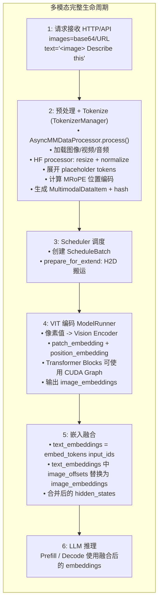

## 2. 核心类层次

### 2.1 BaseMultimodalProcessor

```python
# base_processor.py L174-244
class BaseMultimodalProcessor(ABC):
    """Base class for all multimodal processors."""

    models = []  # 支持的模型类列表

    def __init__(self, hf_config, server_args, _processor, transport_mode, *args, **kwargs):
        self.hf_config = hf_config
        self._processor = _processor  # HuggingFace AutoProcessor
        self.server_args = server_args
        self.transport_mode = transport_mode

        # 每帧估算 token 数 (粗略值，实际因模型和图像而异)
        self.NUM_TOKEN_PER_FRAME = 330

        # 双 executor 并行处理 (L188-194)
        self.io_executor = concurrent.futures.ThreadPoolExecutor(
            max_workers=int(os.environ.get("SGLANG_IO_WORKERS", 4))
        )  # ThreadPool: I/O 密集任务 (图片加载/URL 下载)
        self.cpu_executor = concurrent.futures.ProcessPoolExecutor(
            mp_context=mp.get_context("fork"),
            max_workers=int(os.environ.get("SGLANG_CPU_WORKERS", os.cpu_count())),
        )  # ProcessPool: CPU 密集任务 (图片预处理/resize)

        # 属性名 → 模态类型映射 (L197-227)
        self.ATTR_NAME_TO_MODALITY = {
            "pixel_values": Modality.IMAGE,
            "image_grid_thw": Modality.IMAGE,
            "audio_features": Modality.AUDIO,
            "pixel_values_videos": Modality.VIDEO,
            ...  # 共 20+ 个属性映射
        }

        # 特征字段名列表 (L231-236)
        self.FEATURE_NAMES = [
            "pixel_values",           # 图像像素值
            "pixel_values_videos",    # 视频像素值
            "audio_features",         # 音频特征
            "input_features",         # 通用输入特征
        ]

        # 条件初始化 CUDA IPC 内存池 (L240-244)
        if SGL_USE_CUDA_IPC and not skip_mm_pool:
            self.cudaipc_mmfeature_pool = MmItemMemoryPool(...)
```

> **关键设计说明**:
> - `ATTR_NAME_TO_MODALITY`: 将 HuggingFace processor 输出的属性名（如 `pixel_values`、`audio_features`）映射到 `Modality` 枚举。这是模态路由的核心——`process_and_combine_mm_data()` 通过此映射将 processor 输出拆分到对应的 `MultimodalDataItem` 中
> - `FEATURE_NAMES`: 标识哪些属性是"主特征"（需要 GPU 计算的大张量），与 `model_specific_data` 中的元数据属性区分
> - `get_mm_data()` 不在基类中定义，而是由各子类实现（如 `QwenVLImageProcessor.get_mm_data()`）

### 2.2 MultimodalSpecialTokens

```python
# base_processor.py L78-172
@dataclasses.dataclass
class MultimodalSpecialTokens:
    """Manages special tokens for multimodal inputs."""

    # 基础 token 字段
    image_token: Optional[Union[str, List[str]]] = None   # "<image>"
    video_token: Optional[Union[str, List[str]]] = None   # "<video>"
    audio_token: Optional[Union[str, List[str]]] = None   # "<audio>"
    image_token_id: Optional[int] = None
    video_token_id: Optional[int] = None
    audio_token_id: Optional[int] = None

    # 正则匹配字段 (用于处理非标准 token 格式)
    image_token_regex: Optional[re.Pattern] = None
    video_token_regex: Optional[re.Pattern] = None
    audio_token_regex: Optional[re.Pattern] = None
    combined_regex: Optional[re.Pattern] = None            # 合并正则，用于分割输入文本

    def build(self, processor) -> "MultimodalSpecialTokens":
        """初始化入口：convert_to_strs → parse_regex → get_combined_regex"""
        self.convert_to_strs(processor)    # token id → 字符串 (通过 tokenizer)
        self.parse_regex()                  # 构建单模态匹配 pattern
        self.get_combined_regex()           # 合并为分割用 combined pattern
        return self

    def get_modality_of_token(self, token: str) -> Optional[Modality]:
        """返回 token 对应的模态类型（先精确匹配，再 regex 匹配）"""
        ...

    def get_combined_regex(self) -> re.Pattern:
        """构建合并正则，用于将输入字符串按多模态 token 分割"""
        ...
```

### 2.3 QwenVLImageProcessor (Qwen3.5 专用)

```python
# processors/qwen_vl.py L233-434
class QwenVLImageProcessor(BaseMultimodalProcessor):
    """Compatible with Qwen-VL & Qwen-Omni Series."""

    models = [
        Qwen2VLForConditionalGeneration,
        Qwen2_5_VLForConditionalGeneration,
        Qwen3VLForConditionalGeneration,
        Qwen3VLMoeForConditionalGeneration,
        Qwen3_5ForConditionalGeneration,
        Qwen3_5MoeForConditionalGeneration,
        Qwen3OmniMoeForConditionalGeneration,
    ]

    def __init__(self, hf_config, server_args, _processor, *args, **kwargs):
        super().__init__(...)

        # Qwen 特有配置
        self.image_factor = IMAGE_FACTOR  # 28
        self.min_pixels = MIN_PIXELS      # 4 * 28 * 28
        self.max_pixels = MAX_PIXELS      # 16384 * 28 * 28

        # 特殊 token (qwen_vl.py L264-273)
        self.mm_tokens = MultimodalSpecialTokens(
            image_token="<|vision_start|><|image_pad|><|vision_end|>",
            image_token_id=hf_config.image_token_id,
            # 匹配展开后的 token 序列: <|vision_start|>(<|image_pad|>)+<|vision_end|>
            image_token_regex=re.compile(
                r"<\|vision_start\|>(?:<\|image_pad\|>)+<\|vision_end\|>"
            ),
            video_token_id=hf_config.video_token_id,
            audio_token_id=self.audio_token_id,
        ).build(_processor)

        # image_token_regex 用于匹配展开后的完整 token 序列
        # （包含 vision_start/end 包裹的多个 image_pad），而非单个 token。
        # build() 方法会自动为未设置 regex 的模态生成默认 regex。

    async def process_mm_data_async(self, image_data, input_text, request_obj, *args, **kwargs):
        # Step 1: 加载原始数据 (base class 方法)
        base_output = self.load_mm_data(
            prompt=input_text, image_data=image_data,
            video_data=request_obj.video_data,
            audio_data=request_obj.audio_data,
            multimodal_tokens=self.mm_tokens,
        )

        # Step 2: 视频预处理 (Qwen 特有的帧采样 + resize)
        if base_output.videos:
            videos_processed = [
                await preprocess_video(video, video_config=self.video_config)
                for video in base_output.videos
            ]
            base_output.videos, video_metadata = map(list, zip(*videos_processed))

        # Step 3: 调用 HF processor 并组合为 MultimodalDataItem 列表
        mm_items, input_ids, ret = self.process_and_combine_mm_data(
            base_output, self.mm_tokens, video_metadata=video_metadata, ...
        )

        # Step 4: 计算 MRoPE 位置编码 (3D: temporal × height × width)
        mrope_positions, mrope_position_delta = MRotaryEmbedding.get_rope_index(...)

        return {
            "input_ids": input_ids.tolist(),
            "mm_items": mm_items,
            "mrope_positions": mrope_positions,
            ...
        }
```

### 2.4 AsyncMMDataProcessor

```python
# managers/async_mm_data_processor.py
class AsyncMMDataProcessor:
    """TokenizerManager 调用多模态处理的直接入口，异步包装器。"""

    def __init__(self, mm_processor, *, max_concurrent_calls=None, timeout_s=None):
        self.mm_processor = mm_processor
        self.semaphore = asyncio.Semaphore(max_concurrent_calls) if max_concurrent_calls else None
        self.timeout_s = timeout_s

        # 自动检测 async/sync 处理器
        self._proc_async = getattr(mm_processor, "process_mm_data_async", None)
        self.is_async = asyncio.iscoroutinefunction(self._proc_async)
        # sync 回退: 使用 ThreadPoolExecutor 避免阻塞事件循环
        self.fallback_exec = ThreadPoolExecutor(...) if not self.is_async else None

    async def process(self, *, image_data, audio_data, input_text_or_ids, request_obj, **kwargs):
        async def _invoke():
            if self.is_async:
                return await self._proc_async(...)  # 原生 async 路径
            return await loop.run_in_executor(self.fallback_exec, sync_fn)  # sync 回退

        # 可选: Semaphore 并发限制 + timeout
        if self.semaphore:
            async with self.semaphore:
                return await asyncio.wait_for(_invoke(), timeout=self.timeout_s)
        return await _invoke()
```

> **调用链**: `TokenizerManager._process_mm_data()` → `AsyncMMDataProcessor.process()` → `QwenVLImageProcessor.process_mm_data_async()`
>
> 设计要点:
> - Semaphore 控制并发数，防止大量多模态请求同时占用 CPU/GPU
> - timeout 机制防止单个请求的图像加载/预处理卡死整个 pipeline
> - 自动检测底层 processor 是否为 async，sync processor 自动包装到线程池

### 2.5 MultimodalDataItem

```python
# schedule_batch.py L221-334
@dataclasses.dataclass
class MultimodalDataItem:
    """单个模态的所有输入数据。例如 3 张图 + 1 段音频 → 2 个 MultimodalDataItem。"""

    modality: Modality
    hash: int = None          # 特征内容的 hash，用于缓存匹配
    pad_value: int = None     # 替换 input_ids 中 placeholder 的唯一值
    offsets: Optional[list] = None  # 每个 item 在 input_ids 中的 (start, end) 位置

    format: MultimodalInputFormat = MultimodalInputFormat.NORMAL

    feature: Union[torch.Tensor, np.ndarray] = None           # 原始特征 (pixel_values 等)
    precomputed_embeddings: Optional[torch.Tensor] = None      # 预计算嵌入 (二选一)

    model_specific_data: dict[str, Any] = field(default_factory=dict)  # 模型特有元数据

    def __getattr__(self, name):
        # 透明访问 model_specific_data，如 item.image_grid_thw
        if name in self.model_specific_data:
            return self.model_specific_data[name]
        raise AttributeError(...)

    def set_pad_value(self):
        """计算 hash → 生成唯一 pad_value，确保不与 vocab token 冲突。"""
        self.hash = hash_feature(self.feature or self.precomputed_embeddings)
        self.pad_value = MM_PAD_SHIFT_VALUE + (self.hash % (1 << 30))
        # MM_PAD_SHIFT_VALUE = 1_000_000，远大于任何模型的 vocab_size
```

> **pad_value 机制**: 每个多模态 item 通过 `set_pad_value()` 生成一个唯一的整数值（>= 1,000,000），用于替换 `input_ids` 中对应的 placeholder tokens。在嵌入融合阶段，系统通过匹配这些 pad_value 来定位需要替换为视觉/音频嵌入的位置。这种设计避免了与正常 vocab token ID 的冲突（vocab_size 通常 < 200,000）。
>
> **`__getattr__` 透明访问**: 模型特有的属性（如 Qwen 的 `image_grid_thw`、InternVL 的 `images_spatial_crop`）存储在 `model_specific_data` 字典中，但可以直接通过 `item.image_grid_thw` 访问，无需 `item.model_specific_data["image_grid_thw"]`。

## 3. 图像预处理

### 3.1 smart_resize (Qwen-VL)

```python
# processors/qwen_vl.py L56-86
def smart_resize(
    height: int,
    width: int,
    factor: int = IMAGE_FACTOR,      # 28
    min_pixels: int = MIN_PIXELS,    # 4 * 28 * 28
    max_pixels: int = MAX_PIXELS,    # 16384 * 28 * 28
) -> Tuple[int, int]:
    """
    Rescales the image ensuring:
    1. Both dimensions are divisible by 'factor'
    2. Total pixels within [min_pixels, max_pixels]
    3. Aspect ratio maintained
    """

    # 调整到 factor 的倍数
    h_bar = max(factor, round_by_factor(height, factor))
    w_bar = max(factor, round_by_factor(width, factor))

    # 检查像素限制
    if h_bar * w_bar > max_pixels:
        # 缩小
        beta = math.sqrt((height * width) / max_pixels)
        h_bar = floor_by_factor(height / beta, factor)
        w_bar = floor_by_factor(width / beta, factor)
    elif h_bar * w_bar < min_pixels:
        # 放大
        beta = math.sqrt(min_pixels / (height * width))
        h_bar = ceil_by_factor(height * beta, factor)
        w_bar = ceil_by_factor(width * beta, factor)

    return h_bar, w_bar
```

### 3.2 grid_thw 计算

Qwen-VL 使用 3D grid (temporal, height, width) 表示视觉 patches：

```python
def _compute_grid_thw(images):
    """计算每张图像的 grid 尺寸"""
    grid_thw = []
    for img in images:
        h, w = img.size
        # patches = (h // 28) * (w // 28)
        t = 1  # 图像: temporal=1, 视频: temporal=num_frames
        grid_h = h // IMAGE_FACTOR
        grid_w = w // IMAGE_FACTOR
        grid_thw.append((t, grid_h, grid_w))
    return grid_thw
```

### 3.3 视频处理

```python
# processors/qwen_vl.py L153-229
def preprocess_video(vr, image_factor=28, video_config={}):
    """Process video for Qwen-VL."""

    total_frames = len(vr)
    video_fps = vr.get_avg_fps()

    # 1. 计算采样帧数
    nframes = smart_nframes(video_config, total_frames, video_fps)

    # 2. 均匀采样
    frame_indices = np.linspace(0, total_frames - 1, nframes, dtype=int)
    frames = vr.get_batch(frame_indices).asnumpy()

    # 3. 调整尺寸 (考虑总像素限制)
    h, w = frames.shape[1:3]
    new_h, new_w = smart_resize(
        h, w,
        factor=image_factor,
        min_pixels=VIDEO_MIN_PIXELS,
        max_pixels=VIDEO_MAX_PIXELS // nframes,  # 分摊到每帧
    )

    return frames, (nframes, new_h // image_factor, new_w // image_factor)
```

### 3.4 process_and_combine_mm_data() — 多模态数据处理核心入口

`BaseMultimodalProcessor.process_and_combine_mm_data()` 是预处理阶段的核心函数（`base_processor.py` L974-1114），负责将原始多模态输入转换为统一的 `MultimodalDataItem` 列表。

```python
def process_and_combine_mm_data(
    self,
    base_output: BaseMultiModalProcessorOutput,
    mm_tokens: MultimodalSpecialTokens,
    **kwargs,
) -> Tuple[List[MultimodalDataItem], torch.Tensor, dict]:
```

处理流程分为 4 个阶段：

1. **按模态分类**（L998-1012）：将输入分为 `raw_images`、`raw_videos`、`raw_audios` 和 `dict_items`（预计算 embedding 或 processor_output 格式）

2. **原始数据处理**（L1014-1025）：调用 `_process_and_collect_mm_items()` 执行 HuggingFace AutoProcessor，生成 `pixel_values`、`input_ids` 等

3. **字典格式处理**（L1027-1045）：处理两种特殊输入格式
   - `processor_output`：已经过 HF processor 的数据，直接收集
   - `precomputed_embedding`：预计算的 embedding，跳过 VIT 编码

4. **CUDA IPC 包装**（L1071-1114）：当 `SGL_USE_CUDA_IPC=1` 时，将 GPU tensor 包装为 `CudaIpcTensorTransportProxy`，实现跨进程零拷贝传输

```python
# base_processor.py L1071-1112 — CUDA IPC 分支
if SGL_USE_CUDA_IPC:
    for item in all_collected_items:
        if isinstance(item.feature, torch.Tensor) and item.feature.is_cuda:
            sync_flag, available_slice = (
                self.cudaipc_mmfeature_pool.return_a_slice_tensor_with_flag(
                    item.feature
                )
            )
            if isinstance(available_slice, torch.Tensor):
                available_slice.copy_(item.feature.view(torch.int8).view(-1),
                                     non_blocking=True)
                item.feature = CudaIpcTensorTransportProxy(
                    data=available_slice,
                    info_data=item.feature,
                    sync_buffer_meta=sync_flag,
                )
```

> **设计要点**：CUDA IPC 使用预分配的内存池（`cudaipc_mmfeature_pool`）而非直接共享 tensor handle，避免了跨进程 GPU 内存泄漏问题。

## 4. 多模态缓存 (MultimodalCache)

### 4.1 缓存机制

```python
# mem_cache/multimodal_cache.py
class MultimodalCache(ABC):
    """Abstract base for multimodal embedding cache."""

    @staticmethod
    def combine_hashes(mm_hashes: List[int]) -> Optional[int]:
        """Combine multiple item hashes into one."""
        if not mm_hashes:
            return None
        return hash(tuple(mm_hashes))

    @abstractmethod
    def get(self, mm_hashes: List[int], combined_hash=None) -> Optional[torch.Tensor]:
        """Get cached embedding by hash."""
        raise NotImplementedError

    @abstractmethod
    def set(self, mm_hash: int, embedding: torch.Tensor, allocator) -> bool:
        """Store embedding with hash."""
        raise NotImplementedError

class MultiModalStaticCache(MultimodalCache):
    """LRU cache for multimodal embeddings."""

    def __init__(self, max_size: int):
        self.max_size = max_size
        self.mm_cache: OrderedDict[int, torch.Tensor] = OrderedDict()
        self.current_size = 0

    def set(self, mm_hash, embedding, loc=None):
        data_size = embedding.element_size() * embedding.numel()

        # LRU 逐出
        while self.current_size + data_size > self.max_size:
            if not self.mm_cache:
                return False
            lru_hash, lru_embedding = self.mm_cache.popitem(last=False)
            self.current_size -= _get_tensor_size(lru_embedding)

        self.mm_cache[mm_hash] = embedding
        self.current_size += data_size
        return True
```

### 4.2 缓存工作流

缓存的 get/set 发生在 **模型 forward 阶段**（而非 Scheduler 调度阶段）。入口是 `get_embedding_and_mask()`，它依次尝试两种路径：

```python
# managers/mm_utils.py L858-867 — get_embedding_and_mask()
# 1. 优先尝试预计算 embedding（来自 precomputed_embedding 格式的输入）
embedding = _get_precomputed_embedding(
    embedding_items, prefix_length, extend_length, items_offset_list
)
# 2. 未命中则走 chunked prefill 路径（内部使用 embedding_cache）
if embedding is None:
    embedding = _get_chunked_prefill_embedding(
        data_embedding_func, embedding_items, items_size,
        prefix_length, extend_length, items_offset_list,
    )
```

当前实际调用的缓存路径是 `_get_chunked_prefill_embedding()`：

```python
# managers/mm_utils.py L563-574 — _get_chunked_prefill_embedding()
item_hashes = [item.hash for item in embedding_items_per_req]
embedding_items_hash = MultiModalStaticCache.combine_hashes(item_hashes)

embedding_per_req = embedding_cache.get(item_hashes)        # cache GET
if embedding_per_req is None:
    embedding_per_req = data_embedding_func(embedding_items_per_req)  # VIT 编码
    if not embedding_cache.set(embedding_items_hash, embedding_per_req):  # cache SET
        print_warning_once("Multimodal embedding cache is full...")
```

> **注意**：此函数标记为 `# TODO: To be obsoleted`，未来将被 `_get_chunked_prefill_embedding_for_chunked_items()` 替代（见 §4.2.1）。

#### 4.2.1 函数过渡状态

| 函数 | 行号 | 状态 | Cache 设备 |
|------|------|------|-----------|
| `_get_chunked_prefill_embedding()` | mm_utils.py L551 | 当前默认，标记 `TODO: To be obsoleted` | GPU |
| `_get_chunked_prefill_embedding_for_chunked_items()` | mm_utils.py L730 | 未来替代，当前未被调用 | CPU（`.detach().cpu()`） |

切换后的主要变化：
- Cache 从 GPU 移到 CPU，释放 GPU 显存
- 读取时需 `.to(target_device)` 搬回 GPU，增加少量延迟
- 支持按 chunk 粒度缓存（而非按整个请求），提升 chunked prefill 场景的缓存命中率

### 4.3 ViT DP 模式下的 Cache 架构

> **概念区分**：SGLang 中有两种 "DP"，不要混淆：
>
> | 概念 | 启用方式 | 含义 |
> |------|---------|------|
> | **DP Scheduling** | `--dp-size N` | 启动 **N 个独立 Scheduler 进程**，由 DataParallelController 分发请求 |
> | **ViT DP** | `--mm-enable-dp-encoder` | **单个 Scheduler** 内，TP 组的多个 Rank 分担 ViT 编码，复用 TP 通信组做 all-gather |
>
> 本节分析的是 **ViT DP**（`--mm-enable-dp-encoder`），不涉及 DataParallelController。

本节详细分析启用 ViT DP (`--mm-enable-dp-encoder`) 时 VIT embedding 缓存的存储位置、数据分布和传输机制。

#### 4.3.1 Cache 存放位置

> **⚠ 当前版本存在两套实现，行为不同**：

| 函数 | 位置 | Cache 存储设备 | 状态 |
|------|------|---------------|------|
| `_get_chunked_prefill_embedding()` | mm_utils.py L551 | **GPU**（直接存 VIT 输出 tensor） | 当前默认路径，标记 `TODO: To be obsoleted` |
| `_get_chunked_prefill_embedding_for_chunked_items()` | mm_utils.py L730 | **CPU**（`.detach().cpu()` 后存入） | 未来路径，当前未被调用 |

**当前默认路径**（GPU cache）：

```python
# managers/mm_utils.py L575-580 — _get_chunked_prefill_embedding()
embedding_per_req = embedding_cache.get(item_hashes)
if embedding_per_req is None:
    embedding_per_req = data_embedding_func(embedding_items_per_req)
    embedding_cache.set(embedding_items_hash, embedding_per_req)  # 直接存 GPU tensor
```

**未来路径**（CPU cache，尚未启用）：

```python
# managers/mm_utils.py L784-799 — _get_chunked_prefill_embedding_for_chunked_items()
embedding_per_chunk = embedding_cache.get(embedding_items_hash)
if embedding_per_chunk is None:
    embedding_per_chunk = data_embedding_func(embedding_items_per_chunk)
    embedding_for_cache = embedding_per_chunk.detach().cpu()  # 移到 CPU 再存
    embedding_cache.set(embedding_items_hash, embedding_for_cache)
else:
    # 从 CPU cache 取出后搬回 GPU
    target_device = embedding_items_per_req[0].feature.device
    if embedding_per_chunk.device != target_device:
        embedding_per_chunk = embedding_per_chunk.to(target_device)
```

> **总结**：当前版本 cache 实际存储在 GPU，未来版本切换到 CPU cache 后可释放 GPU 显存。

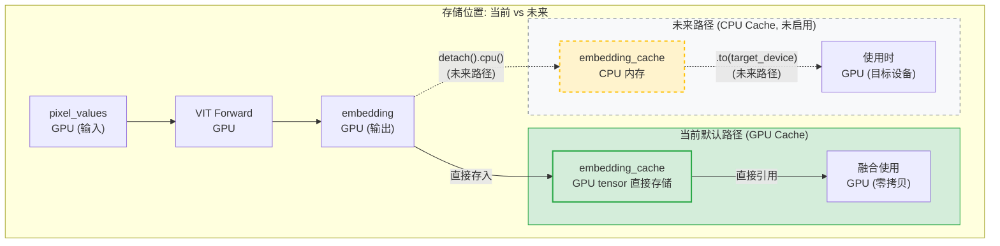

#### 4.3.2 每个 Rank 的数据分布

**结论**：每个 TP Rank 处理 **部分图像** (不是全量)，通过 NCCL All-Gather 聚合。

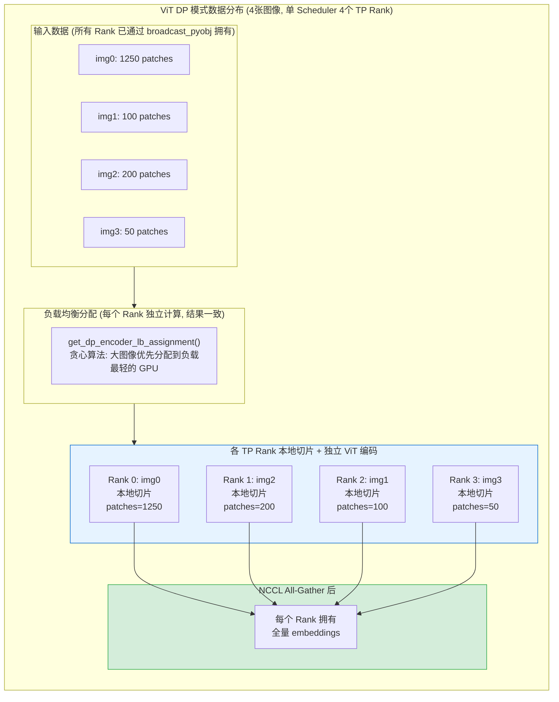

#### 4.3.3 数据流转: pixel_value → VIT embedding → embedding

完整的数据流转分为 3 个阶段：

> **注意**：阶段 1 不存在 NCCL scatter 或跨 Rank 传输。所有 TP Rank 已通过 `broadcast_pyobj`（见 §4.7.2）拥有完整 `pixel_values`，每个 Rank 根据 `tp_rank` 做本地 `torch.cat` 切片提取自己负责的子集。

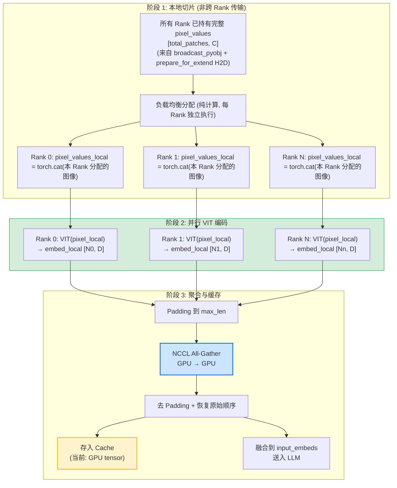

**代码实现**：

```python
# multimodal/mm_utils.py L466-662
def run_dp_sharded_mrope_vision_model(vision_model, pixel_values, grid_thw_list, rope_type):
    tp_size = get_attention_tp_size()
    tp_rank = get_attention_tp_rank()

    # 1. 计算每张图像的 patch 数
    patches_per_image = [t * h * w for t, h, w in grid_thw_list]

    # 2. 负载均衡分配
    (shuffle_indices, gpu_sample_counts, grouped_pixel_values_len) = \
        get_dp_encoder_lb_assignment(patches_per_image, tp_size)

    # 3. 提取本 Rank 负责的 pixel_values (本地切片，非跨 Rank 传输)
    pixel_values_local = torch.cat([
        pixel_values[cum_patches[i]:cum_patches[i + 1]]
        for i in image_idxs_local
    ])

    # 4. 本地 VIT 编码
    image_embeds_local = vision_model(pixel_values_local, local_grid_thw)

    # 5. Padding + All-Gather (NCCL)
    padded = pad_to_length(image_embeds_local, max_len)
    gathered_embeds = get_attention_tp_group().all_gather(padded, dim=0)

    # 6. 去 Padding，按原始顺序重组
    return reorder_embeddings(gathered_embeds, original_indices)
```

#### 4.3.4 传输方式

> 详细的端到端传输路径分析见 **§4.7**。本表仅总结 ViT DP 场景涉及的通信方式。

| 传输类型 | 方式 | 说明 | 适用场景 |
|---------|------|------|---------|
| **GPU ↔ GPU** | NCCL All-Gather | ViT embeddings 聚合，高带宽 GPU 直连 | ViT DP 输出聚合 |
| **Rank 0 → 其他 TP Rank** | `broadcast_pyobj` (CPU Gloo) | pickle + dist.broadcast | 请求和 mm_inputs 广播 |
| **TokenizerManager → Scheduler** | ZMQ `send_pyobj` | pickle 序列化 CPU tensor | 所有多模态请求 |
| **CPU ↔ GPU** | PyTorch `.to(device)` | H2D / D2H copy | Cache 读写、prepare_for_extend |

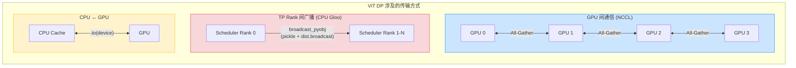

#### 4.3.5 Cache 分布: 全局 vs 每个 Rank

**结论**：**每个 TP Rank 进程有独立的 Cache 副本**（非共享内存）。

原因是每个 TP Rank 运行在独立的 Python 进程中（通过 `multiprocessing` 启动），Python 全局变量 `embedding_cache` 在每个进程中独立实例化。

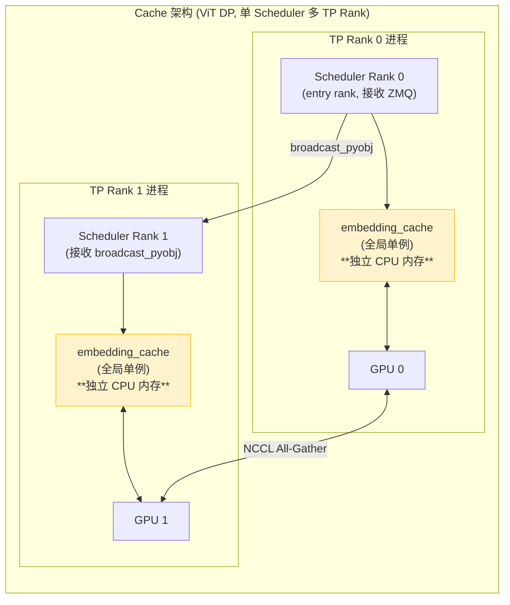

**关键代码**：

```python
# managers/mm_utils.py L375-380
# 全局变量: 每个进程独立
embedding_cache: Optional[MultiModalStaticCache] = None

def init_mm_embedding_cache(max_size: int = 0):
    global embedding_cache
    embedding_cache = MultiModalStaticCache(max_size)  # 进程内单例

# managers/scheduler.py 初始化
from sglang.srt.managers.mm_utils import init_mm_embedding_cache
init_mm_embedding_cache(embedding_cache_size * 1024 * 1024)
```

#### 4.3.6 ViT DP 模式 Cache 总结

| 问题 | 答案 |
|------|------|
| Cache 存放位置 | 当前: **GPU**（直接存 tensor）；未来: **CPU**（`.detach().cpu()`） |
| 每个 Rank ViT 编码数据 | **部分图像** (负载均衡本地切片，非 NCCL scatter) |
| 数据流转 | broadcast_pyobj → H2D → 本地切片 → 本地 ViT → All-Gather → 全量 embedding |
| 跨进程传输方式 | **pickle + CPU Gloo broadcast** (请求分发) + **NCCL** (ViT 输出聚合) + **.to()** (H2D) |
| Cache 分布 | **每个 TP Rank 独立 Cache** (Python 全局变量，进程隔离) |

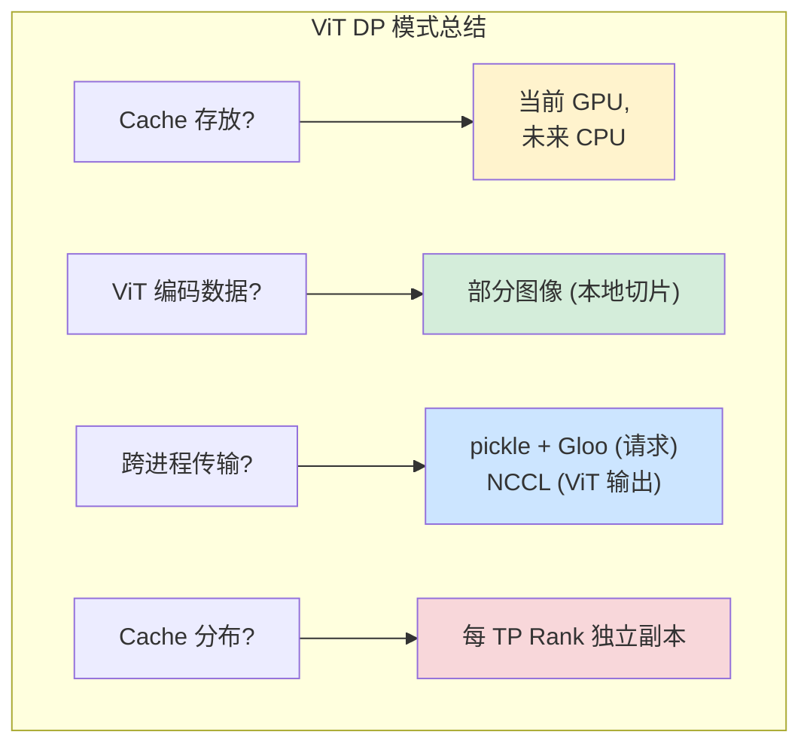

### 4.4 GPU Feature Buffer (预分配 GPU 缓冲区)

```python
# managers/mm_utils.py L44-100
_GPU_FEATURE_BUFFER: Optional[torch.Tensor] = None
_BUFFER_OFFSET = 0

def init_feature_buffer(device):
    """预分配 GPU buffer，用于快速 hash 计算和特征暂存。"""
    size_mb = envs.SGLANG_MM_BUFFER_SIZE_MB.get()
    num_elements = int(size_mb * 1024 * 1024 / 4)
    _GPU_FEATURE_BUFFER = torch.empty(num_elements, dtype=torch.float32, device=device)

def try_add_to_buffer(tensor: torch.Tensor) -> torch.Tensor:
    """尝试将 tensor 复制到预分配 buffer 中，返回 buffer view。"""
    if _BUFFER_OFFSET + tensor.numel() <= _GPU_FEATURE_BUFFER.numel():
        buffer_view = _GPU_FEATURE_BUFFER[offset : offset + tensor.numel()]
        buffer_view.copy_(tensor.flatten(), non_blocking=True)
        return buffer_view.view(tensor.shape)
    return tensor  # buffer 不足时返回原 tensor
```

> 预分配 GPU buffer 的目的:
> - 避免频繁的小张量 GPU 内存分配/释放
> - 通过 `SGLANG_MM_BUFFER_SIZE_MB` 环境变量控制大小（默认值由 envs 模块定义）
> - 每个 batch 开始时调用 `reset_buffer_offset()` 重置偏移量

## 4.7 跨进程多模态数据传输

本节解答核心问题：**多模态场景下，pixel_values 在多卡 TP + ViT DP 配置中，是通过 CPU pickle 序列化跨进程传输，还是 GPU 间直接拷贝？**

**结论**：默认路径是 **CPU pickle 序列化**。ViT DP 的输出聚合是唯一使用 NCCL GPU-to-GPU 的环节。

### 4.7.1 传输路径四阶段总结

| 阶段 | 路径 | 机制 | 数据格式 | 源码 |
|------|------|------|---------|------|
| 1. TokenizerManager → Scheduler Rank 0 | ZMQ `send_pyobj` | pickle 序列化 CPU tensor | bytes over TCP/IPC | `tokenizer_manager.py` |
| 2. Scheduler Rank 0 → 其他 TP Rank | `broadcast_pyobj()` | pickle.dumps → ByteTensor → dist.broadcast (CPU group) | bytes via CPU process group | `common.py:1268+` |
| 3. CPU → GPU (每个 Rank) | `prepare_for_extend()` | `.to(device, non_blocking=True)` 或 CudaIpc | async H2D copy | `schedule_batch.py:1640` |
| 4. ViT DP 输出聚合 | `get_attention_tp_group().all_gather` | NCCL all_gather | GPU tensor (GPU-to-GPU) | `multimodal/mm_utils.py:623` |

只有**阶段 4** 是 GPU 直连通信，前三个阶段全部经过 CPU。

### 4.7.2 broadcast_pyobj 实现

Rank 0 收到请求后需要广播给其他 TP Rank。这里使用的是 **pickle + CPU dist.broadcast**，而非 NCCL：

```python
# utils/common.py L1268-1297
def broadcast_pyobj(data, rank, dist_group, src=0, force_cpu_device=True):
    device = torch.device("cpu")  # force_cpu_device=True (默认)

    if rank == src:
        # Rank 0: pickle 序列化 → numpy → ByteTensor → broadcast
        serialized_data = pickle.dumps(data)
        size = len(serialized_data)
        tensor_data = torch.ByteTensor(
            np.frombuffer(serialized_data, dtype=np.uint8)
        ).to(device)
        tensor_size = torch.tensor([size], dtype=torch.long, device=device)

        dist.broadcast(tensor_size, src=src, group=dist_group)  # 先广播大小
        dist.broadcast(tensor_data, src=src, group=dist_group)  # 再广播数据
    else:
        # 其他 Rank: 接收 → numpy → pickle.loads
        tensor_size = torch.tensor([0], dtype=torch.long, device=device)
        dist.broadcast(tensor_size, src=src, group=dist_group)
        size = tensor_size.item()

        tensor_data = torch.empty(size, dtype=torch.uint8, device=device)
        dist.broadcast(tensor_data, src=src, group=dist_group)

        serialized_data = bytes(tensor_data.cpu().numpy())
        data = pickle.loads(serialized_data)
```

> **关键点**：`force_cpu_device=True` 意味着使用 CPU process group（Gloo 后端），不走 NCCL。pixel_values 作为 CPU tensor 被 pickle 序列化传输。

### 4.7.3 prepare_for_extend 中的双路径

每个 Rank 收到请求后，在 `prepare_for_extend()` 中将 pixel_values 从 CPU 搬到 GPU：

```python
# managers/schedule_batch.py L1634-1645
for mm_input in multimodal_inputs:
    if mm_input is None:
        continue
    for mm_item in mm_input.mm_items:
        pixel_values = getattr(mm_item, "feature", None)
        if isinstance(pixel_values, torch.Tensor):
            # 默认路径: CPU → GPU async copy
            mm_item.feature = pixel_values.to(self.device, non_blocking=True)
        elif isinstance(pixel_values, CudaIpcTensorTransportProxy):
            # CUDA IPC 路径: GPU → GPU 零拷贝重建
            mm_item.feature = pixel_values.reconstruct_on_target_device(
                torch.cuda.current_device()
            )
```

### 4.7.4 完整数据流时序图

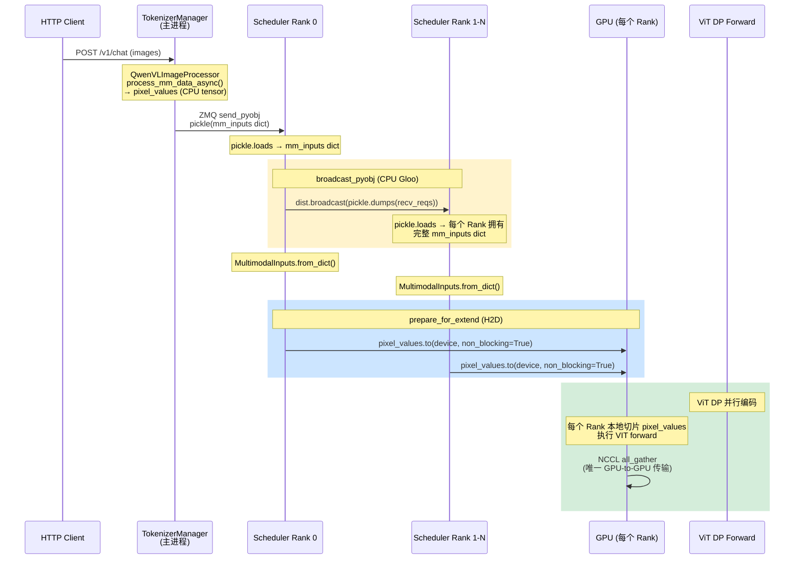

### 4.7.5 三种传输优化

默认路径（CPU pickle）在大图像或多 TP Rank 场景下可能成为瓶颈。SGLang 提供三种优化手段：

#### (1) CUDA IPC Transport (`SGLANG_USE_CUDA_IPC_TRANSPORT=1`)

```python
# multimodal/processors/base_processor.py L1071-1112
if SGL_USE_CUDA_IPC:
    for item in all_collected_items:
        if isinstance(item.feature, torch.Tensor) and item.feature.is_cuda:
            sync_flag, available_slice = (
                self.cudaipc_mmfeature_pool.return_a_slice_tensor_with_flag(
                    item.feature
                )
            )
            if isinstance(available_slice, torch.Tensor):
                available_slice.copy_(item.feature.view(torch.int8).view(-1))
                item.feature = CudaIpcTensorTransportProxy(
                    data=available_slice,
                    info_data=item.feature,
                    sync_buffer_meta=sync_flag,
                )
```

- **原理**：在 TokenizerManager 中通过 CUDA IPC handle 共享 GPU 内存，Scheduler 端通过 `reconstruct_on_target_device()` 零拷贝重建 tensor
- **限制**：仅限同 GPU 的进程间通信（intra-node），TP 模式下可能不适用

#### (2) Keep Feature on Device (`--keep-mm-feature-on-device`)

```python
# multimodal/processors/base_processor.py L353-362
if not self.server_args.keep_mm_feature_on_device:
    # 默认: 预处理后移到 CPU
    for feature_name in self.FEATURE_NAMES:
        if feature_name in result and isinstance(result[feature_name], torch.Tensor):
            result[feature_name] = result[feature_name].to("cpu")
# 启用后: 预处理结果保留在 GPU，跳过 CPU roundtrip
```

- **原理**：预处理结果直接保留在 GPU，避免 GPU→CPU→pickle→CPU→GPU 的往返
- **适用场景**：TokenizerManager 和 Scheduler 在同一 GPU 上

#### (3) Broadcast MM Inputs Process (`--enable-broadcast-mm-inputs-process`)

启用 `enable_broadcast_mm_inputs_process` 后，`_get_multimodal_inputs()` 会检查该标志，决定走广播路径还是各 Rank 独立构建路径：

```python
# managers/scheduler.py L1395-1461 — _get_multimodal_inputs()
def _get_multimodal_inputs(self, recv_reqs):
    if self.enable_broadcast_mm_inputs_process:
        # 广播路径: entry rank 构建一次，broadcast 给其他 TP rank
        return self._process_and_broadcast_mm_inputs(recv_reqs)
    else:
        # 默认路径: 每个 TP rank 独立执行 from_dict()
        for req in recv_reqs:
            if req.multimodal_inputs_dict:
                req.multimodal_inputs = MultimodalInputs.from_dict(
                    req.multimodal_inputs_dict
                )
```

广播路径的核心实现：

```python
# managers/scheduler.py — _process_and_broadcast_mm_inputs()
def _process_and_broadcast_mm_inputs(self, recv_reqs):
    if self.is_entry_rank:
        # TP Rank 0: 执行 CPU 密集的 MultimodalInputs.from_dict()
        image_inputs = MultimodalInputs.from_dict(raw_mm_inputs)
        if group_world_size > 1:
            # 通过 dp_tp_cpu_group 广播已构建的对象
            torch.distributed.broadcast_object_list(
                [image_inputs], src=self.entry_rank,
                group=self.dp_tp_cpu_group
            )
    else:
        # 其他 TP rank: 直接接收已构建好的 MultimodalInputs 对象
        obj_list = [None]
        torch.distributed.broadcast_object_list(
            obj_list, src=self.entry_rank,
            group=self.dp_tp_cpu_group
        )
        image_inputs = obj_list[0]
```

> **关键设计**：
> - `MultimodalInputs.from_dict()` 是 CPU 密集操作（涉及 tensor 重建、shape 校验、数据类型转换）。默认情况下所有 TP Rank 各自独立执行一遍，造成冗余 CPU 开销
> - 启用后，TP Rank 0 执行一次 `from_dict()` 物化完整的 `MultimodalInputs` 对象，然后通过 `broadcast_object_list` 在 `dp_tp_cpu_group`（CPU Gloo 通信组）上广播给其他 TP Rank
> - **收益**：减少 CPU 占用，避免单线程 Scheduler 被大量 `from_dict` 阻塞，在高并发多模态请求场景下尤为明显

## 5. VIT CUDA Graph

> **使用范围**：当前 `qwen3_vl.py`、`qwen2_5_vl.py`、`internvl.py` 和 `layers/attention/vision.py` 使用 ViT CUDA Graph。Graph key 是 `x_3d.shape[0]`（即序列长度 / patch 总数），而非 batch size。

### 5.1 ViTCudaGraphRunner

```python
# multimodal/vit_cuda_graph_runner.py L29-383
class ViTCudaGraphRunner:
    """
    Generic ViT CUDA Graph Runner.

    Captures "blocks + merger + deepstack merger" into CUDA graph.
    Lazily captures graphs for each unique sequence length.
    """

    def __init__(self, vit: nn.Module):
        self.vit = vit

        # graph_key -> buffers / graphs (L51-54)
        self.block_input: Dict[Hashable, torch.Tensor] = {}
        self.block_ws: Dict[Hashable, torch.Tensor] = {}       # workspace buffer
        self.block_graphs: Dict[Hashable, torch.cuda.CUDAGraph] = {}
        self.block_output: Dict[Hashable, torch.Tensor] = {}

        # captured seqlens buffers (地址必须稳定以支持 graph replay) (L57-60)
        self.cu_full_len: Dict[Hashable, torch.Tensor] = {}
        self.cu_window_len: Dict[Hashable, torch.Tensor] = {}

        # 注意: ViTCudaGraphRunner 自身没有 enabled 标志
        # 启用判断在各模型文件中通过 envs.SGLANG_VIT_ENABLE_CUDA_GRAPH.get() 检查

    def _get_graph_key(self, x_3d: torch.Tensor) -> int:
        """Graph key = sequence length (patch 总数)."""
        return x_3d.shape[0]

    def run(self, x_3d, cu_seqlens, rotary_pos_emb, ...):
        """Run VIT with CUDA Graph if available."""

        graph_key = self._get_graph_key(x_3d)

        if graph_key not in self.block_graphs:
            # 首次遇到此 shape: 捕获 graph
            return self._capture_and_run(graph_key, x_3d, cu_seqlens, ...)
        else:
            # 命中: 重放
            return self._replay(graph_key, x_3d, rotary_pos_emb, ...)
```

### 5.2 Graph 捕获

```python
def _capture_and_run(self, graph_key, x_3d, cu_seqlens, ...):
    """Capture VIT forward as CUDA Graph."""

    # 1. 分配输入/输出 buffer
    self.block_input[graph_key] = torch.empty_like(x_3d)
    self.block_ws[graph_key] = torch.empty(...)  # workspace

    # 2. warmup (确保 CUDA 内核已编译)
    with torch.no_grad():
        _ = self._run_blocks(self.block_input[graph_key], ...)

    # 3. 捕获
    graph = torch.cuda.CUDAGraph()
    with torch.cuda.graph(graph):
        output = self._run_blocks(self.block_input[graph_key], ...)

    self.block_graphs[graph_key] = graph
    self.block_output[graph_key] = output
```

### 5.3 启用方式

```bash
# 启用 VIT CUDA Graph
export SGLANG_VIT_ENABLE_CUDA_GRAPH=1

# 仅支持部分 attention backend
# 支持: triton_attn, fa3
# 不支持: flashinfer (目前)
```

> **启用判断位置**：环境变量定义在 `environ.py` L426（`EnvBool(False)`），各模型文件在 ViT forward 入口处检查：
>
> ```python
> # models/qwen3_vl.py L531
> if envs.SGLANG_VIT_ENABLE_CUDA_GRAPH.get():
>     return self.forward_with_cuda_graph(x, grid_thw)
>
> # models/qwen2_5_vl.py L334
> self.enable_cg = _is_cuda and envs.SGLANG_VIT_ENABLE_CUDA_GRAPH.get()
>
> # layers/attention/vision.py L304, L373
> if envs.SGLANG_VIT_ENABLE_CUDA_GRAPH.get():
>     ...  # 使用 graph-compatible 的 attention 实现
> ```
>
> ViTCudaGraphRunner 本身不做启用判断，由调用方决定是否走 CUDA Graph 路径。

## 6. 嵌入融合

### 6.1 融合流程 (Qwen3.5)

> **重要区分**：SGLang 的嵌入融合**不在**模型的 `forward()` 中直接完成（与 HuggingFace 原始实现不同）。融合逻辑位于 `managers/mm_utils.py` 的 `embed_mm_inputs()` 中，由 `general_mm_embed_routine()` 统一调用。

**实际调用链**：

```
Qwen3VLForConditionalGeneration.forward()           # models/qwen3_vl.py L990
  └─ general_mm_embed_routine()                      # managers/mm_utils.py L1048
       ├─ embed_mm_inputs()                          # managers/mm_utils.py L912
       │    ├─ get_embedding_and_mask()              # managers/mm_utils.py L858
       │    │    └─ data_embedding_func()            # = self.get_image_feature()
       │    │         └─ run_dp_sharded_mrope_vision_model()  # (ViT DP 时)
       │    │              或 self.visual()           # (非 DP 时)
       │    ├─ input_ids.clamp_(0, vocab_size-1)     # 清除 hash pad_value
       │    ├─ input_embeds = embed_tokens(input_ids) # 文本嵌入
       │    ├─ input_embeds[indices] = embedding      # 融合: scatter 替换
       │    └─ separate_deepstack_embeds()            # (Deepstack 时)
       └─ language_model(input_embeds=input_embeds)   # 送入 LLM
```

```python
# models/qwen3_vl.py L990 — 模型 forward 入口
def forward(self, input_ids, positions, forward_batch, ...):
    if self.is_mrope_enabled:
        positions = forward_batch.mrope_positions

    # 调用通用融合例程，不直接处理 pixel_values
    hidden_states = general_mm_embed_routine(
        input_ids=input_ids,
        forward_batch=forward_batch,
        language_model=self.model,
        multimodal_model=self,        # 提供 get_image_feature()
        positions=positions,
        use_deepstack=self.use_deepstack,
    )

# managers/mm_utils.py L1039-1045 — 融合的核心：scatter 替换
# 4. scatter embeddings into input embedding
for i, modality, embedding, mask in zip(...):
    if embedding is None or mask is None:
        continue
    indices = torch.where(mask.squeeze(dim=-1))[0]
    input_embeds[indices] = embedding.to(input_embeds.device, input_embeds.dtype)

# managers/mm_utils.py L1012-1014 — clamp 防止 hash 值越界
vocab_size = input_embedding.num_embeddings
# pad_value 来自内容 hash，可能是很大的整数，会导致 embedding lookup 崩溃
input_ids.clamp_(min=0, max=vocab_size - 1)
input_embeds = input_embedding(input_ids)
```

### 6.2 mrope (Multi-Resolution RoPE)

Qwen-VL 使用 3D RoPE 处理不同分辨率：

```python
def get_rope_index(
    input_ids: torch.Tensor,
    image_grid_thw: torch.Tensor,
    attention_mask: torch.Tensor,
):
    """Calculate 3D position indices for mrope."""

    # 文本 token: [0, 1, 2, 3, ...]
    # 图像 token: [t, h, w] 坐标

    position_ids = torch.zeros((batch_size, seq_len, 3), ...)

    for i, (t, h, w) in enumerate(image_grid_thw):
        # 图像 patches 的 3D 位置
        temporal = torch.arange(t).repeat_interleave(h * w)
        height = torch.arange(h).repeat(t * w)
        width = torch.arange(w).repeat(t * h)

        position_ids[i, image_start:image_end, 0] = temporal
        position_ids[i, image_start:image_end, 1] = height
        position_ids[i, image_start:image_end, 2] = width

    return position_ids
```

### 6.3 Deepstack 机制 (Qwen3.5)

Qwen3.5 引入 **Deepstack** 机制：在 ViT 的中间层捕获特征，注入到 LLM decoder 的浅层，使浅层 decoder 也获得多分辨率视觉特征。

#### 6.3.1 ViT 端：中间层特征捕获

```python
# models/qwen3_vl.py L557-578
# ViT forward 中，在指定层捕获 deepstack 特征
for layer_num, blk in enumerate(self.blocks):
    x = blk(x, cu_seqlens=cu_seqlens, ...)

    if layer_num in self.deepstack_visual_indexes:
        # 通过独立的 merger 降维
        deepstack_feature = self.deepstack_merger_list[num_deepstack_captured](x)
        deepstack_feature_lists.append(deepstack_feature)
        num_deepstack_captured += 1

# 最终层通过主 merger
x = self.merger(x)

# 拼接: [seq_len, hidden_size * (1 + num_deepstack)]
hidden_states = torch.cat([x] + deepstack_feature_lists, dim=1)
```

- `deepstack_visual_indexes`：config 指定的 ViT 层索引（如 `{8: 0, 16: 1, 24: 2}`）
- ViT 输出维度 = `hidden_size * (1 + num_deepstack)`，包含主特征和多个 deepstack 特征

#### 6.3.2 融合端：特征分离与注入

```python
# models/qwen3_vl.py L838-846
def separate_deepstack_embeds(self, embedding):
    separate_index = self.config.hidden_size
    input_embeds = embedding[:, :separate_index]          # 主视觉特征
    input_deepstack_embeds = embedding[:, separate_index:] # deepstack 特征
    return input_embeds, input_deepstack_embeds
```

在 `embed_mm_inputs()` 中：
- 主视觉特征 scatter 到 `input_embeds` 中替换 pad token
- deepstack 特征存入 `input_deepstack_embeds`（零初始化同长张量），在 pad token 位置写入
- `input_deepstack_embeds` 通过 `kwargs["input_deepstack_embeds"]` 传入 decoder
- decoder 在 `deepstack_embed_to_decoder_layer` 映射的指定层将 deepstack 特征融合到 hidden_states

### 6.4 Chunked Prefill 的 CPU Offload 机制

```python
# managers/mm_utils.py L1108-1122 (_get_chunked_prefill_embedding 内部)
# 融合完成后，将 GPU features offload 到 CPU
if mm_inputs_list:
    for mm_input_obj in mm_inputs_list:
        if mm_input_obj and hasattr(mm_input_obj, "mm_items"):
            for mm_item in mm_input_obj.mm_items:
                feature = getattr(mm_item, "feature", None)
                if isinstance(feature, torch.Tensor) and feature.is_cuda:
                    mm_item.feature = feature.to("cpu", non_blocking=True)
```

> **设计动机**: 在 chunked prefill 场景下，一个请求的多模态数据可能跨多个 batch 处理。嵌入融合完成后，原始 GPU features 不再需要用于当前 batch 的计算，但后续 chunk 可能因 cache miss 需要重新访问。将 features offload 到 CPU 实现了两个目标:
> 1. 释放宝贵的 GPU 显存
> 2. 保留数据可访问性作为 cache miss 的可靠回退
>
> 这是 chunked prefill + multimodal 可靠性的关键设计——MultimodalCache 是 best-effort 的，CPU offload 确保即使 cache 被驱逐，数据仍然可用。

### 6.5 请求完成后的 MM 内存清理

```python
# scheduler.py L1469-1479
def _maybe_clear_mm_inputs(self, batch: ScheduleBatch) -> None:
    for req in batch.reqs:
        if not req.finished() or not (mm_inputs := req.multimodal_inputs):
            continue
        # session 请求保留 mm_inputs，供后续轮次使用
        if req.session_id:
            continue
        # 非 session 请求: 清理 features 并释放引用
        for item in mm_inputs.mm_items:
            item.feature = None
        req.multimodal_inputs = None
```

> 每个 batch 处理完成后，Scheduler 调用此方法清理已完成请求的多模态数据。关键区分:
> - 普通请求: 立即清理 `feature` 和 `multimodal_inputs`，释放 GPU/CPU 内存
> - Session 请求: 保留 `mm_inputs`，因为同一 session 的后续请求可能需要引用之前的多模态上下文
>
> 不及时清理会导致 GPU OOM，尤其在高并发多模态场景下。

## 7. 支持的模态和模型

### 7.1 模态类型

```python
# schedule_batch.py L195-213
class Modality(Enum):
    IMAGE = auto()
    MULTI_IMAGES = auto()  # 多图场景，与 IMAGE 共享 image_token_id
    VIDEO = auto()
    AUDIO = auto()

    @staticmethod
    def from_str(modality_str: str):
        return Modality[modality_str.upper()]

    @staticmethod
    def all():
        return [Modality.IMAGE, Modality.VIDEO, Modality.AUDIO]
        # 注意: MULTI_IMAGES 不在 all() 中，因为它是 IMAGE 的变体
```

> `MULTI_IMAGES` 用于区分单图和多图场景。`is_image()` 方法同时匹配 `IMAGE` 和 `MULTI_IMAGES`，而 `Modality.all()` 只返回三种基础模态（IMAGE/VIDEO/AUDIO），不包含 MULTI_IMAGES。这意味着在 `embed_mm_inputs()` 遍历 `Modality.all()` 时，MULTI_IMAGES 的 item 会被 `is_modality(Modality.IMAGE)` 匹配到 IMAGE 分支统一处理。

### 7.2 支持的模型

| 模型 | 支持模态 | Processor 类 / 模型文件 |
|------|----------|------------------------|
| **Qwen3.5** | 图像, 视频 | `QwenVLImageProcessor` |
| **Qwen2.5-VL** / **Qwen2-VL** | 图像, 视频 | `QwenVLImageProcessor` |
| **Qwen3-Omni** | 图像, 视频, 音频 | `QwenVLImageProcessor` |
| **Qwen2-Audio** | 音频 | `qwen2_audio.py` |
| **Gemma3** / **Gemma3n** | 图像 | `gemma3_mm.py` / `gemma3n.py` |
| **LLaVA** / **LLaVA-OneVision** | 图像, 视频 | `LLaVAImageProcessor` |
| **InternVL** / **InternVL2.5** | 图像 | `InternVLImageProcessor` |
| **GLM-4V** | 图像 | `GLM4VImageProcessor` |
| **MiniCPM-V** | 图像, 视频 | `MiniCPMImageProcessor` |
| **Pixtral** | 图像 | `pixtral.py` |
| **Phi-3.5-Vision** / **Phi-4-MM** | 图像 | `Phi4MMImageProcessor` |
| **MLlama** | 图像 | `mllama.py` |
| **MLlama4** | 图像 | `mllama4.py` |
| **KimiVL** | 图像 | `kimi_vl.py` |
| **DeepSeek-VL2** | 图像 | `deepseek_vl_v2.py` |
| **Janus-Pro** | 图像 | `janus_pro.py` |
| **NVILA** / **JetVLM** | 图像 | `nvila.py` |
| **NanoNextorVL** | 图像 | `nanonextor_vl.py` |
| **Sarashina2Vision** | 图像 | `sarashina2_vision.py` |
| **CLIP** | 图像 (Embedding) | `clip.py` |
| **DotSVLM** | 图像 | `dots_vlm.py` |
| **PaddleOCR-VL** | 图像 | `paddleocr_vlm.py` |

## 8. 优化策略

### 8.1 图像缓存

```python
# 启用多模态缓存
python -m sglang.launch_server \
    --model-path Qwen/Qwen3.5-7B \
    --mm-cache-size 2048  # MB
```

### 8.2 VIT CUDA Graph

```bash
# 对于 Triton/FA3 backend
export SGLANG_VIT_ENABLE_CUDA_GRAPH=1
```

### 8.3 VIT DP Encoder (Data Parallel 编码)

启用 `--mm-enable-dp-encoder` 后，VIT 编码会在多个 GPU 上并行执行：

```bash
python -m sglang.launch_server \
    --model-path Qwen/Qwen3.5-7B \
    --tp 4 \
    --mm-enable-dp-encoder  # 启用 VIT DP
```

#### 8.3.1 为什么需要 VIT DP？

默认情况下，VIT 编码在每个 TP rank 上执行完全相同的计算（冗余），浪费计算资源：

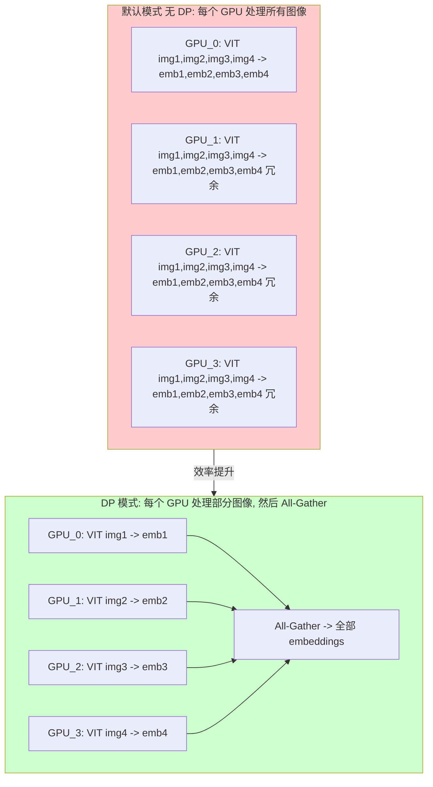

#### 8.3.1.1 ViT DP 权重复制机制

启用 `--mm-enable-dp-encoder` 后，ViT 的所有层使用 `tp_size=1, tp_rank=0` 初始化，**每个 TP Rank 持有完整的 ViT 权重副本**（而非 TP 分片）：

```python
# models/qwen3_vl.py L80-92
class VisionMLP(nn.Module):
    def __init__(self, ..., use_data_parallel: bool = False):
        self.tp_size = 1 if use_data_parallel else get_attention_tp_size()
        self.tp_rank = 0 if use_data_parallel else get_attention_tp_rank()
        # ColumnParallelLinear / RowParallelLinear 使用 tp_size=1
        # → 加载完整权重，不做分片
        # → RowParallelLinear 不执行 all-reduce
```

**影响**：

| 方面 | 默认 TP 模式 | ViT DP 模式 |
|------|-------------|-------------|
| 每 Rank ViT 权重量 | `ViT_size / tp_size` | `ViT_size`（完整） |
| 额外显存开销 | 0 | `(1 - 1/tp_size) * ViT_size` |
| ViT 通信开销 | 每层 all-reduce | 仅最终 all-gather |
| ViT 计算量 | 全量图像 | 分片图像（`/tp_size`） |

以 Qwen3.5-397B-A17B 的 ViT（约 1.1B 参数，FP16 约 2.2GB）为例：
- `tp=8` 默认模式：每 Rank 约 275MB ViT 权重，但每 Rank 编码所有图像
- `tp=8` ViT DP 模式：每 Rank 约 2.2GB ViT 权重（多占 ~1.9GB），但每 Rank 仅编码 1/8 图像

权衡取舍是：**用权重复制的额外显存换取 ViT 计算的线性加速和消除逐层 all-reduce**。

> **未开启 ViT DP 时的默认行为**：ViT 使用标准 TP 切分（`tp_size > 1` 时），每个 `ColumnParallelLinear` / `RowParallelLinear` 层按 TP 分片加载权重，`RowParallelLinear` 在每层输出后执行 `all-reduce` 聚合部分和。此时每个 Rank 编码全量图像，但每层都有通信开销。

#### 8.3.2 负载均衡算法

不同图像的 patch 数量可能差异很大，简单轮询分配会导致负载不均衡：

```python
# multimodal/mm_utils.py L362-428
def get_dp_encoder_lb_assignment(
    sizes: list[int],      # 每张图像的 patch 数量
    num_gpus: int = 2,     # GPU 数量 (= tp_size)
) -> tuple[list[int], list[int], list[int]]:
    """
    贪心算法：按图像大小负载均衡分配到 GPU。

    Returns:
        shuffle_indices:  按 GPU 分组排列的图像索引序列
                          (不是 "图像→GPU" 的映射，而是按 GPU 分组拼接的图像原始索引)
        gpu_sample_counts: 每 GPU 分配的图像数
        gpu_loads:         每 GPU 的总 patch 数

    Example:
        sizes = [1000, 100, 200, 50], num_gpus = 2
        # 贪心分配: GPU_0=[img0(1000)], GPU_1=[img2(200),img1(100),img3(50)]
        # 拼接: shuffle_indices = [0, 2, 1, 3]
        #        ^GPU_0^  ^---GPU_1---^
        # gpu_sample_counts = [1, 3]
        # gpu_loads = [1000, 350]

    使用方式 (调用者 run_dp_sharded_mrope_vision_model):
        # 提取 Rank N 负责的图像列表:
        cum = [0, *accumulate(gpu_sample_counts)]  # [0, 1, 4]
        image_idxs_local = shuffle_indices[cum[rank]:cum[rank+1]]
        # Rank 0 → shuffle_indices[0:1] = [0]      → 编码 img0
        # Rank 1 → shuffle_indices[1:4] = [2, 1, 3] → 编码 img2, img1, img3
    """

    # 1. 按大小降序排列
    large_to_small_indices = sorted(
        range(len(sizes)), key=lambda i: sizes[i], reverse=True
    )

    # 2. 贪心分配：每次分配给当前负载最小的 GPU
    gpu_loads = [0] * num_gpus
    gpu_assignments = [[] for _ in range(num_gpus)]

    for idx in large_to_small_indices:
        min_gpu = min(range(num_gpus), key=lambda i: gpu_loads[i])
        gpu_assignments[min_gpu].append(idx)
        gpu_loads[min_gpu] += sizes[idx]

    # 3. 按 GPU 顺序拼接
    shuffle_indices = []
    gpu_sample_counts = []
    for gpu_id in range(num_gpus):
        shuffle_indices.extend(gpu_assignments[gpu_id])
        gpu_sample_counts.append(len(gpu_assignments[gpu_id]))

    return shuffle_indices, gpu_sample_counts, gpu_loads
```

#### 8.3.3 完整执行流程

```python
# multimodal/mm_utils.py L466-662
def run_dp_sharded_mrope_vision_model(
    vision_model: torch.nn.Module,
    pixel_values: torch.Tensor,       # [total_patches, channel]
    grid_thw_list: list,              # [(t1,h1,w1), (t2,h2,w2), ...]
    rope_type: str,                   # "rope_3d" or "rope_2d"
):
    """
    在 TP 组上并行执行 VIT 编码。

    执行流程:
    1. 计算每张图像的 patch 数
    2. 负载均衡分配
    3. 每个 rank 提取自己负责的 pixel_values
    4. 执行 VIT 编码
    5. All-Gather 收集所有 rank 的结果
    6. 按原始顺序重组 embeddings
    """

    tp_size = get_attention_tp_size()
    tp_rank = get_attention_tp_rank()

    # 1. 计算每张图像的 patch 数
    patches_per_image = [t * h * w for t, h, w in grid_thw_list]
    cum_patches = [0, *itertools.accumulate(patches_per_image)]

    # 2. 负载均衡分配
    (shuffle_indices, gpu_sample_counts, grouped_pixel_values_len) = \
        get_dp_encoder_lb_assignment(patches_per_image, tp_size)

    # 3. 提取本 rank 负责的图像索引 (从 shuffle_indices 按 GPU 分组切片)
    cum_gpu_sample_counts = [0, *itertools.accumulate(gpu_sample_counts)]
    image_idxs_local = shuffle_indices[
        cum_gpu_sample_counts[tp_rank]:cum_gpu_sample_counts[tp_rank + 1]
    ]

    # 4. 提取本 rank 负责的 pixel_values
    pixel_values_local = torch.cat([
        pixel_values[cum_patches[i]:cum_patches[i + 1]]
        for i in image_idxs_local
    ])
    local_grid_thw = [grid_thw_list[i] for i in image_idxs_local]

    # 5. 执行 VIT 编码
    image_embeds_local = vision_model(pixel_values_local, torch.tensor(local_grid_thw))

    # 6. Padding + All-Gather
    max_len = max(grouped_pixel_values_len) // embed_dim_reduction_factor
    padded = pad_to_length(image_embeds_local, max_len)
    gathered_embeds = get_attention_tp_group().all_gather(padded, dim=0)

    # 7. 按原始顺序重组
    original_order_embeddings = [None] * len(grid_thw_list)
    for rank in range(tp_size):
        rank_images = get_images_for_rank(rank)
        for img_idx, embed in zip(rank_images, split_embeddings(rank)):
            original_order_embeddings[img_idx] = embed

    return torch.cat(original_order_embeddings, dim=0)
```

### 8.4 EVS (Efficient Video Sampling)

EVS（[arXiv:2510.14624](https://arxiv.org/abs/2510.14624)）是一种视频 token 裁剪优化，在 ViT 编码完成后，通过计算相邻帧之间的相似度，裁剪冗余视频帧的 token。与传统的帧采样（在 ViT 之前丢弃帧）不同，EVS 在 ViT 编码之后操作，保留了视觉信息的同时减少了 LLM 需要处理的 token 数量。

```python
# multimodal/evs/evs_module.py
@dataclass(kw_only=True)
class EVSEmbeddingResult(EmbeddingResult):
    """ViT 编码后的裁剪结果，包含每帧保留的 token 数。"""
    num_tokens_per_frame: list[int]
    # 例如 [256, 180, 195, 256]: frame 0 保留全部 256 tokens，
    # frame 1-2 因与前帧相似被裁剪

    def redistribute_pruned_frames_placeholders(self, input_ids, offsets, *, item, ...):
        """重新分配 placeholder，使 input_ids 中的 span 匹配裁剪后的实际嵌入大小。"""
        ...

@dataclass(kw_only=True)
class VideoEVSDataItem(EVSDataItem):
    """视频 EVS 专用数据项，携带裁剪前的 input_ids。"""
    pre_chunked_input_ids: torch.Tensor
```

关键组件：
- `compute_retention_mask`（`evs_core.py`）：计算每帧的保留掩码
- `replace_offsets_with_tokens_per_frame`（`evs_core.py`）：根据裁剪结果重新分配 placeholder
- `EVSEmbeddingResult`：携带裁剪元数据的嵌入结果，下游通过 `num_tokens_per_frame` 调整 input_ids
- `EVS` 基类（`evs_module.py`）：模型继承此类并实现 `create_evs_config()`，当 `video_pruning_rate > 0` 时自动替换 `get_video_feature()` 为 EVS 裁剪版本

在 `_get_chunked_prefill_embedding()` 中，当检测到 `EVSEmbeddingResult` 时会调用 `redistribute_pruned_frames_placeholders()` 重新调整 input_ids 的 placeholder 分布（`managers/mm_utils.py` L594-604）。

## 9. VIT DP 完整请求生命周期

> 本节从原附录提升为独立章节，提供 ViT DP 模式下完整的端到端请求处理流程参考。注意：cache 的 get/set 操作发生在 `managers/mm_utils.py` 的 `_get_chunked_prefill_embedding()` 中（model forward 阶段），Scheduler 仅通过 `init_mm_embedding_cache()` 完成初始化。

### 整体流程概览

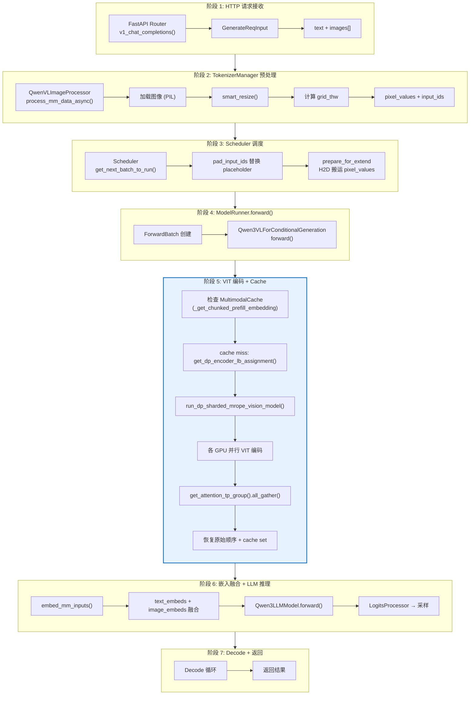

### 阶段 5 详解: VIT DP 并行编码

这是 VIT DP 的核心阶段，详细展示负载均衡和并行处理过程：

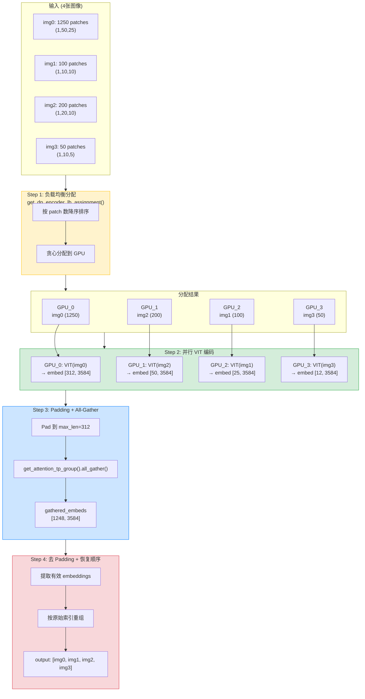

### 负载均衡算法详解

```mermaid
flowchart LR
    subgraph Input["输入: patches = [1250, 100, 200, 50]"]
        direction TB
        P0["img0: 1250"]
        P1["img1: 100"]
        P2["img2: 200"]
        P3["img3: 50"]
    end

    subgraph Sort["Step 1: 降序排序"]
        S["[1250, 200, 100, 50]<br/>索引: [0, 2, 1, 3]"]
    end

    subgraph Greedy["Step 2: 贪心分配"]
        direction TB
        G1["Round 1: img0(1250) → GPU_0"]
        G2["Round 2: img2(200) → GPU_1"]
        G3["Round 3: img1(100) → GPU_2"]
        G4["Round 4: img3(50) → GPU_3"]
    end

    subgraph Result["分配结果"]
        direction TB
        R0["GPU_0: [img0]<br/>负载=1250"]
        R1["GPU_1: [img2]<br/>负载=200"]
        R2["GPU_2: [img1]<br/>负载=100"]
        R3["GPU_3: [img3]<br/>负载=50"]
    end

    Input --> Sort --> Greedy --> Result

    style G1 fill:#d4edda
    style G2 fill:#d4edda
    style G3 fill:#d4edda
    style G4 fill:#d4edda
```

### 与非 DP 模式对比

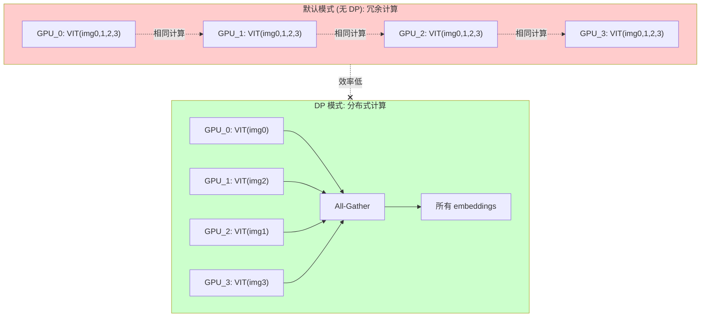

### 涉及的核心类和函数

| 阶段 | 类/文件 | 核心函数 |
|------|---------|----------|
| 1. 请求接收 | `v1_chat_completions.py` | `v1_chat_completions()` |
| 2. 预处理 | `QwenVLImageProcessor` | `process_mm_data_async()` |
| 2. 预处理 | `processors/qwen_vl.py` | `smart_resize()` |
| 3. 调度 | `Scheduler` | `get_next_batch_to_run()`, `pad_input_ids()` |
| 3. 调度 | `schedule_batch.py` | `prepare_for_extend()` (H2D 搬运) |
| 4. 模型前向 | `Qwen3VLForConditionalGeneration` | `forward()` |
| 4.7 跨进程传输 | `utils/common.py` | `broadcast_pyobj()` |
| 5. VIT 编码 + Cache | `managers/mm_utils.py` | `_get_chunked_prefill_embedding()` (cache get/set) |
| 5. VIT DP | `multimodal/mm_utils.py` | `get_dp_encoder_lb_assignment()` |
| 5. VIT DP | `multimodal/mm_utils.py` | `run_dp_sharded_mrope_vision_model()` |
| 5. VIT DP | `Qwen3VLMoeVisionModel` | `forward()` |
| 5. VIT DP | `multimodal/mm_utils.py` | `get_attention_tp_group().all_gather()` |
| 6. 融合 | `managers/mm_utils.py` | `embed_mm_inputs()`, `general_mm_embed_routine()` |
| 6. LLM | `Qwen3LLMModel` | `forward()` |
| 7. 采样 | `LogitsProcessor` | `forward()` |

## 10. 调试技巧

### 10.1 查看图像处理

```python
# 打印 grid_thw
processor = QwenVLImageProcessor(...)
result = processor.process_mm_data(text, images=[img])
print(f"grid_thw: {result['image_grid_thw']}")
print(f"pixel_values shape: {result['pixel_values'].shape}")
```

### 10.2 检查缓存命中

```python
# 设置日志级别
export SGLANG_LOG_LEVEL=debug

# 查看日志中的缓存命中信息
# [DEBUG] MultimodalCache hit for hash=12345678
```

### 10.3 禁用缓存 (调试)

```bash
python -m sglang.launch_server \
    --model-path Qwen/Qwen3.5-7B \
    --mm-cache-size 0  # 禁用缓存
```

---

## 11. 多模态更新

Qwen3.5 继承 Qwen3VL 的 Vision 架构，但 text backbone 是混合架构（Full Attention + Linear Attention + MoE）。多模态处理流程与 Qwen3-VL 基本一致，主要变化在 text backbone 的推理路径。
