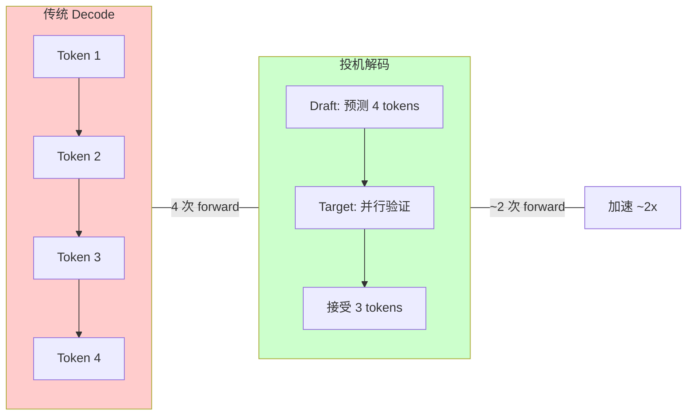
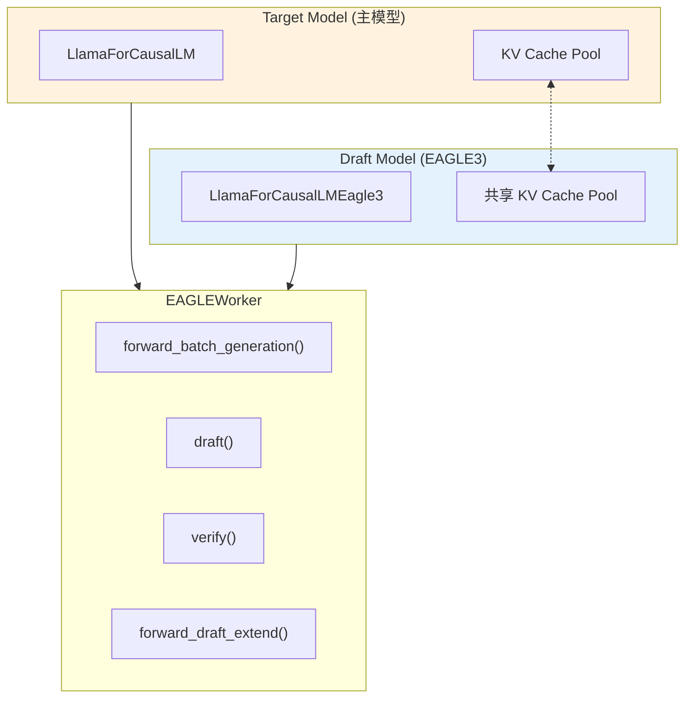
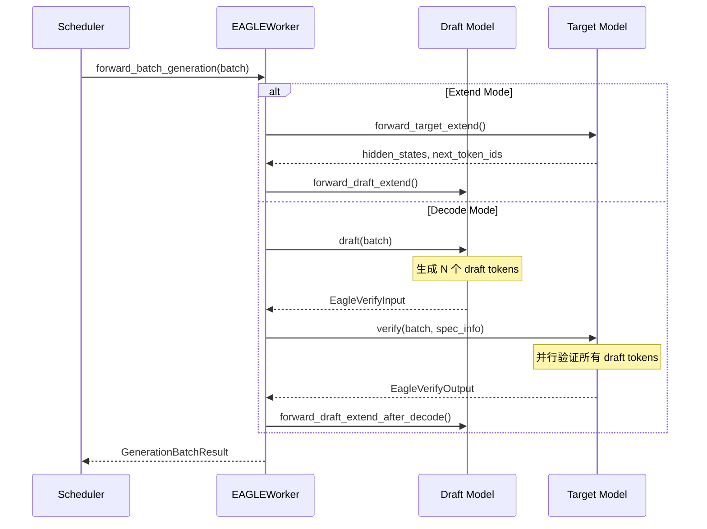
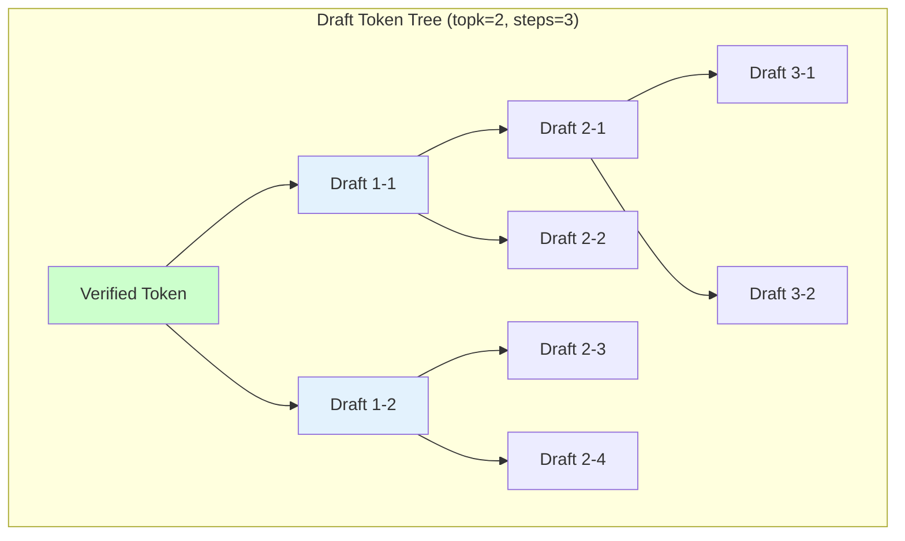
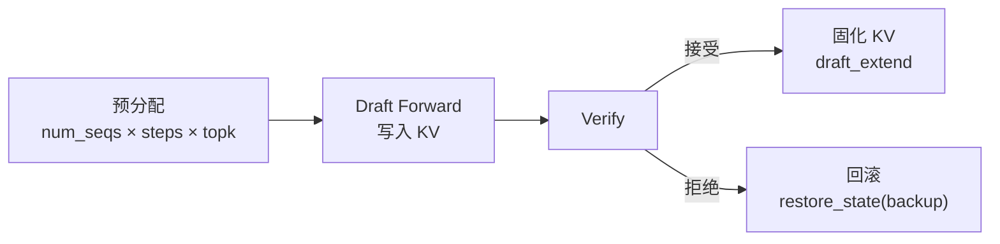

# SGLang 投机解码 (Speculative Decoding)

## 1. 概述

投机解码 (Speculative Decoding) 是一种加速 LLM 推理的技术，通过使用小型 Draft 模型预测多个 token，然后由目标模型并行验证，从而减少解码延迟。

### 1.1 核心思想



### 1.2 支持的算法

完整的算法注册表（`spec_info.py`）：

| 算法 | 别名 | Flags | 说明 | Draft 模型 |
|------|------|-------|------|-----------|
| `EAGLE` | `NEXTN` | `EAGLE` | 基于 EAGLE 架构的投机解码 | 是 (单层 Draft) |
| `EAGLE3` | — | `EAGLE`, `EAGLE3` | EAGLE3 架构，支持 hot token map | 是 (单层 Draft) |
| `STANDALONE` | — | `STANDALONE` | 独立 Draft 模型 | 是 (完整模型) |
| `NGRAM` | — | `NGRAM` | 基于 N-Gram 匹配的无模型投机 | 否 |

**扩展机制**：第三方可通过 `register_speculative_algorithm()` 注册自定义算法：

```python
from sglang.srt.speculative.spec_info import register_speculative_algorithm

# 支持 "override_worker=True" 替换已注册 worker
register_speculative_algorithm(
    "MY_ALGO",
    worker_cls=MyDraftWorker,        # 创建 draft worker 的工厂函数
    flags=("EAGLE",),                # 复用已有 flag 或定义新 flag
    aliases=("MY_ALIAS",),           # 可选别名
)
```

---

## 2. 核心参数

```python
# server_args.py 相关参数
speculative_algorithm: str           # 算法: EAGLE, EAGLE3, NGRAM, STANDALONE
speculative_draft_model_path: str    # Draft 模型路径
speculative_num_steps: int = 5       # Draft 推理步数
speculative_eagle_topk: int = 4      # EAGLE Top-K 采样
speculative_num_draft_tokens: int    # 验证时的 draft token 数
speculative_token_map: str           # Hot token map 文件路径
```

### 2.1 启动示例

```bash
# EAGLE3 投机解码
python -m sglang.launch_server \
    --model-path meta-llama/Llama-3.1-8B-Instruct \
    --speculative-algorithm EAGLE3 \
    --speculative-draft-model-path EAGLE3-Llama-3.1-8B-Instruct \
    --speculative-num-steps 5 \
    --speculative-eagle-topk 4

# N-Gram 投机解码 (无需 Draft 模型)
python -m sglang.launch_server \
    --model-path meta-llama/Llama-3.1-8B-Instruct \
    --speculative-algorithm NGRAM
```

---

## 3. 算法注册机制

SGLang 使用 `SpeculativeAlgorithm` 类进行算法注册和管理：

```python
# spec_info.py
class SpeculativeAlgorithm(metaclass=_SpeculativeAlgorithmMeta):
    """Registry-backed representation of speculative decoding algorithms."""
    
    _registry_by_name: Dict[str, "SpeculativeAlgorithm"] = {}
    _registry_by_value: Dict[int, "SpeculativeAlgorithm"] = {}
    _flags: DefaultDict[str, Set[int]] = defaultdict(set)
    
    def is_eagle(self) -> bool:
        return self._has_flag("EAGLE")
    
    def is_eagle3(self) -> bool:
        return self._has_flag("EAGLE3")
    
    def is_ngram(self) -> bool:
        return self._has_flag("NGRAM")
    
    def create_draft_worker(self, **factory_kwargs) -> Any:
        return self._draft_worker_factory(self, **factory_kwargs)
```

### 3.1 内置算法注册

```python
# 注册 EAGLE
register_speculative_algorithm(
    "EAGLE",
    aliases=("NEXTN",),
    worker_cls=_create_eagle_worker,
    flags=("EAGLE",),
)

# 注册 EAGLE3
register_speculative_algorithm(
    "EAGLE3",
    worker_cls=_create_eagle_worker,
    flags=("EAGLE", "EAGLE3"),  # EAGLE3 同时有两个 flag
)

# 注册 NGRAM
register_speculative_algorithm(
    "NGRAM",
    worker_cls=_create_ngram_worker,
    flags=("NGRAM",),
)
```

---

## 4. EAGLE/EAGLE3 架构

### 4.1 整体架构



### 4.2 EAGLEWorker 初始化

```python
# eagle_worker.py L79-199
class EAGLEWorker(TpModelWorker):
    def __init__(self, server_args, gpu_id, tp_rank, dp_rank, 
                 moe_ep_rank, nccl_port, target_worker):
        self.topk = server_args.speculative_eagle_topk
        self.speculative_num_steps = server_args.speculative_num_steps
        self.speculative_num_draft_tokens = server_args.speculative_num_draft_tokens
        
        # 共享 KV Cache Pool
        self.req_to_token_pool, self.token_to_kv_pool_allocator = (
            target_worker.get_memory_pool()
        )
        
        # EAGLE3 特殊处理: hot token map
        if self.speculative_algorithm.is_eagle3():
            self.hot_token_id = None  # 从模型加载
        elif server_args.speculative_token_map is not None:
            self.hot_token_id = load_token_map(server_args.speculative_token_map)
        
        # 初始化 Draft Worker
        super().__init__(
            server_args=server_args,
            is_draft_worker=True,
            req_to_token_pool=self.req_to_token_pool,
            token_to_kv_pool_allocator=self.token_to_kv_pool_allocator,
        )
        
        # 共享 embedding 和 lm_head
        embed, head = self.target_worker.model_runner.model.get_embed_and_head()
        if self.speculative_algorithm.is_eagle3():
            self.draft_model_runner.model.set_embed(embed)
        else:
            self.draft_model_runner.model.set_embed_and_head(embed, head)
```

### 4.3 EAGLE3 Draft 模型结构

EAGLE3 的 Draft 模型是一个轻量级的单层 Transformer：

```python
# llama_eagle3.py
class LlamaForCausalLMEagle3(LlamaForCausalLM):
    def __init__(self, config, quant_config=None, prefix=""):
        if self.config.num_hidden_layers != 1:
            raise ValueError("EAGLE3 currently only supports 1 layer")
        
        self.model = LlamaModel(config, quant_config, prefix)
        
        # EAGLE3 特有: tie_word_embeddings 或独立 lm_head
        self.load_lm_head_from_target = False
        if self.config.tie_word_embeddings:
            self.lm_head = self.model.embed_tokens
        else:
            if config.draft_vocab_size is None:
                self.load_lm_head_from_target = True
            self.lm_head = ParallelLMHead(config.draft_vocab_size, ...)
        
        self.hot_token_id = None  # 从权重加载

class LlamaDecoderLayer(LlamaDecoderLayer):
    """EAGLE3 的 Decoder Layer, 输入是 [embeds, hidden_states] 拼接"""
    def __init__(self, config, layer_id=0, ...):
        super().__init__(config, layer_id, ...)
        
        # 修改 QKV 投影: 输入维度是 2 * hidden_size
        self.self_attn.qkv_proj = QKVParallelLinear(
            2 * self.hidden_size,  # 拼接 embed 和 hidden
            ...
        )
        self.hidden_norm = RMSNorm(config.hidden_size, eps=config.rms_norm_eps)

    def forward(self, positions, embeds, hidden_states, forward_batch, residual):
        embeds = self.input_layernorm(embeds)
        hidden_states = self.hidden_norm(hidden_states)
        hidden_states = torch.cat([embeds, hidden_states], dim=-1)  # 拼接
        hidden_states = self.self_attn(positions, hidden_states, forward_batch)
        ...
```

### 4.4 Hot Token Map

EAGLE3 使用 hot token map 来压缩词表：

```python
# 加载 hot token map
def load_weights(self, weights):
    for name, loaded_weight in weights:
        if "d2t" in name:
            # d2t: draft_id -> target_id 的映射
            self.hot_token_id = loaded_weight + torch.arange(loaded_weight.shape[0])
            continue
```

---

## 4.5 v2 架构: BaseSpecWorker/BaseDraftWorker 分离模式

> **选择规则**：`_create_eagle_worker()`（`spec_info.py` L264-273）根据 `enable_overlap` 标志自动选择：
> - `--enable-overlap`（overlap schedule）→ `EAGLEWorkerV2`（v2）
> - 默认（不开 overlap）→ `EAGLEWorker`（v1）

SGLang 投机解码现在有两套实现架构：v1（`eagle_worker.py`）和 v2（`eagle_worker_v2.py`）。v2 引入了 **BaseSpecWorker/BaseDraftWorker 分离模式**，将 target 和 draft worker 完全解耦。

### 4.5.1 v2 类层次

```python
# base_spec_worker.py (34 行)
class BaseDraftWorker(ABC):
    @abstractmethod
    def draft(): ...
    @abstractmethod
    def draft_extend(): ...

class BaseSpecWorker(ABC):
    @property
    @abstractmethod
    def target_worker(self) -> TpModelWorker: ...   # property 而非直接持有
    @property
    @abstractmethod
    def draft_worker(self) -> BaseDraftWorker: ...   # property 而非直接持有
    @abstractmethod
    def clear_cache_pool(self): ...
```

### 4.5.2 v2 实现文件

| 文件 | 类 | 说明 |
|------|-----|------|
| `eagle_worker_v2.py` (826 行) | `EagleDraftWorker(BaseDraftWorker)` | Draft model 初始化、draft forward、CUDA graph |
| `eagle_worker_v2.py` | `EAGLEWorkerV2(BaseSpecWorker)` | 组合 target + draft，verify 逻辑，attention backend 管理 |
| `eagle_info_v2.py` (489 行) | `assign_extend_cache_locs`, `fill_accepted_out_cache_loc`, `fill_new_verified_id` | v2 专用的 cache loc 分配和验证结果处理函数 |

### 4.5.3 v1 vs v2 对比

| 方面 | v1 (`EAGLEWorker`) | v2 (`EAGLEWorkerV2`) |
|------|---------------------|----------------------|
| 继承关系 | `EAGLEWorker(TpModelWorker)` | `EAGLEWorkerV2(BaseSpecWorker)` |
| Draft 模型 | 直接内嵌 | 独立 `EagleDraftWorker(BaseDraftWorker)` |
| Target 访问 | `self.target_worker` 属性 | `@property target_worker` |
| ForwardMode | `DRAFT_EXTEND` | `DRAFT_EXTEND_V2`（draft 固定形状 logits） |
| CUDA Graph | 可选 | 写入 draft extend 和 draft CUDA graph 分别管理 |
| 设计意义 | target/draft 耦合 | target/draft 完全解耦，支持更灵活的组合 |

### 4.5.4 新增 ForwardMode

`DRAFT_EXTEND_V2` 与 `DRAFT_EXTEND` 的区别：v2 模式下 draft worker 完全独立，可以有自己的 attention backend 和 CUDA graph runner。

---

## 4.6 MultiLayerEagle (MTP) 架构

### 4.6.1 EAGLE3 vs MTP 核心区别

EAGLE3 和 MTP 都基于 EAGLE 框架，但 draft 策略完全不同：

| 方面 | EAGLE / EAGLE3 | MultiLayerEagle (MTP) |
|------|---------------|----------------------|
| Draft 模型层数 | 单层 | 多层（`speculative_num_steps` 层） |
| 每步推理 | 单层 draft model 执行多步，每步 topk 展开 | 每层 draft model 执行一步 |
| 模型文件 | `eagle_worker.py` / `eagle_worker_v2.py` | `multi_layer_eagle_worker.py` / `_v2.py` |
| 启用参数 | `--speculative-algorithm EAGLE` | `--enable-multi-layer-eagle` |
| 适用模型 | 通用 EAGLE draft model | DeepSeek V3 MTP、Qwen3Next MTP |
| 注册 flags | `("EAGLE",)` 或 `("EAGLE", "EAGLE3")` | 同 EAGLE，通过 `enable_multi_layer_eagle` 切换 |

### 4.6.2 实现文件与类层次

| 文件 | 类 | 基类 | 说明 |
|------|-----|------|------|
| `multi_layer_eagle_worker.py` (753 行) | `MultiLayerEagleWorker` | `TpModelWorker` | v1，继承式，target/draft 耦合 |
| `multi_layer_eagle_worker_v2.py` (706 行) | `MultiLayerEagleDraftWorker` | `BaseDraftWorker` | v2 draft worker，组合式 |
| `multi_layer_eagle_worker_v2.py` | `MultiLayerEagleWorkerV2` | `BaseSpecWorker` | v2 spec worker，组合 target + draft |

### 4.6.3 多层 Draft 核心机制

与单层 EAGLE 的关键区别在于 `draft_runner_list`——每个 draft 层有独立的 ModelRunner：

```python
# multi_layer_eagle_worker_v2.py L128
self.draft_runner_list = self.draft_worker.model_runner_list  # 每层一个 runner

def mtp_model_runner(self, step: int):  # L161
    return self.draft_runner_list[step]
```

**Draft Forward 流程**（v2, `draft_forward()` L271-331）：

```python
for step_i in range(self.speculative_num_steps):
    # 每层 draft model 执行一步 forward
    logits = self.mtp_model_runner(step_i).forward(forward_batch)
    # 从 logits 中选 topk
    top_scores, top_indices = torch.topk(logits, self.topk)
    # 累积 tokens、scores、parent 关系
    draft_tokens.append(top_indices)
    parent_list.append(parent_indices)
```

**Extend 阶段**（`_draft_extend_for_decode()` L408-523）：

验证完成后，需要将已接受的 token 路径固化到每层 draft model 的 KV cache 中：

```python
for step_i in range(self.speculative_num_steps):
    # 每层独立执行 extend forward，支持 CUDA graph
    runner = self.mtp_model_runner(step_i)
    if runner.cuda_graph_runner and can_use_cuda_graph:
        logits = runner.cuda_graph_runner.replay(forward_batch)
    else:
        logits = runner.forward(forward_batch)
```

### 4.6.4 适用模型

- **DeepSeek V3 MTP**：使用 `--enable-multi-layer-eagle` 启用，模型自带多层 draft head
- **Qwen3Next MTP**：`Qwen3NextForCausalLMMTP` 模型类，同样通过 `--enable-multi-layer-eagle` 启用

## 4.7 STANDALONE 算法

STANDALONE 使用独立的完整 draft 模型（而非 EAGLE 的轻量 draft head），适用于没有专用 draft head 的场景。

### 4.7.1 实现结构

```python
# standalone_worker.py L24
class StandaloneWorker(EAGLEWorker):
    """继承 EAGLEWorker，复用其 draft/verify 流程，
    但使用独立加载的完整模型作为 draft model。"""
```

| 方面 | EAGLE | STANDALONE |
|------|-------|-----------|
| Draft 模型 | 轻量 draft head（共享 embedding/lm_head） | 独立完整模型 |
| 注册方式 | `register_speculative_algorithm("EAGLE", ...)` | `register_speculative_algorithm("STANDALONE", ...)` |
| 启用参数 | `--speculative-algorithm EAGLE` | `--speculative-algorithm STANDALONE` |
| 初始化 | 加载 draft head 权重 | `TpModelWorker.__init__(is_draft_worker=True)` 加载完整模型 |

### 4.7.2 关键初始化差异

```python
# standalone_worker.py L74-86
TpModelWorker.__init__(
    self, ...,
    is_draft_worker=True,  # 标记为 draft worker
)
# 独立加载完整模型权重，不与 target 共享
```

- 支持 hot token map（`--speculative-eagle-hot-token-map`）
- 支持 MOE backend context（`speculative_moe_backend_ctx`）
- Draft/verify 流程完全复用 `EAGLEWorker` 的实现

---

## 5. Draft-Verify 流程

### 5.1 整体流程



### 5.2 Draft 阶段

```python
# eagle_worker.py L515-596
def draft(self, batch: ScheduleBatch):
    """生成 draft tokens"""
    if batch.forward_mode.is_idle():
        self._draft_preprocess_idle(batch)
    else:
        self._draft_preprocess_decode(batch)
    
    spec_info = batch.spec_info
    spec_info.capture_hidden_mode = CaptureHiddenMode.LAST
    spec_info.num_tokens_per_batch = self.topk
    
    # 获取 forward batch
    model_worker_batch = batch.get_model_worker_batch()
    forward_batch = ForwardBatch.init_new(model_worker_batch, self.draft_model_runner)
    
    # CUDA Graph 优化
    can_cuda_graph = self.cuda_graph_runner and self.cuda_graph_runner.can_run(forward_batch)
    if can_cuda_graph:
        parent_list, top_scores_index, draft_tokens = self.cuda_graph_runner.replay(forward_batch)
    else:
        parent_list, top_scores_index, draft_tokens = self.draft_forward(forward_batch)
    
    # 构建 verification tree
    tree_mask, position, retrive_index, ... = build_tree_kernel_efficient(
        spec_info.verified_id,
        parent_list, top_scores_index, draft_tokens,
        batch.seq_lens, ...,
        self.topk, self.speculative_num_steps, self.speculative_num_draft_tokens,
    )
    
    return EagleVerifyInput(
        draft_token=draft_tokens,
        custom_mask=tree_mask,
        positions=position,
        retrive_index=retrive_index,
        ...
    )
```

### 5.3 Draft Forward 多步推理

```python
# eagle_worker.py L598-668
def draft_forward(self, forward_batch: ForwardBatch):
    """多步 draft forward"""
    spec_info = forward_batch.spec_info
    topk_p, topk_index, hidden_states = (
        spec_info.topk_p, spec_info.topk_index, spec_info.hidden_states
    )
    
    # Hot token map 转换
    if self.hot_token_id is not None:
        topk_index = self.hot_token_id[topk_index]
    
    score_list, token_list, parents_list = [], [], []
    scores = None
    
    # 多步 forward
    for i in range(self.speculative_num_steps):
        input_ids, hidden_states, scores, tree_info = select_top_k_tokens(
            i, topk_p, topk_index, hidden_states, scores, self.topk
        )
        score_list.append(tree_info[0])
        token_list.append(tree_info[1])
        parents_list.append(tree_info[2])
        
        # 最后一步不需要 forward
        if i == self.speculative_num_steps - 1:
            break
        
        # 设置 forward 输入
        forward_batch.input_ids = input_ids
        forward_batch.out_cache_loc = out_cache_loc[i]
        forward_batch.positions.add_(1)
        forward_batch.attn_backend = self.draft_attn_backend.attn_backends[i]
        spec_info.hidden_states = hidden_states
        
        # Draft forward
        logits_output = self.draft_model_runner.forward(forward_batch, skip_attn_backend_init=True)
        probs = torch.softmax(logits_output.next_token_logits, dim=-1)
        topk_p, topk_index = fast_topk(probs, self.topk, dim=-1)
        hidden_states = logits_output.hidden_states
    
    return organize_draft_results(score_list, token_list, parents_list, ...)
```

### 5.4 Verify 阶段

```python
# eagle_worker.py L674-763
def verify(self, batch: ScheduleBatch, spec_info: EagleVerifyInput):
    """验证 draft tokens"""
    seq_lens_pre_verify = batch.seq_lens.clone()
    spec_info.prepare_for_verify(batch, self.page_size)
    
    batch.forward_mode = ForwardMode.TARGET_VERIFY
    batch.spec_info = spec_info
    
    # Target model forward
    model_worker_batch = batch.get_model_worker_batch()
    batch_result = self.target_worker.forward_batch_generation(model_worker_batch, is_verify=True)
    logits_output = batch_result.logits_output
    
    # Grammar mask 处理
    vocab_mask = None
    if batch.has_grammar:
        vocab_mask = generate_token_bitmask(batch.reqs, spec_info, ...)
    
    # 验证并找出接受的 tokens
    res: EagleVerifyOutput = spec_info.verify(
        batch, logits_output, 
        self.token_to_kv_pool_allocator, self.page_size, vocab_mask
    )
    
    # 后处理: 只保留接受的 tokens
    logits_output.next_token_logits = logits_output.next_token_logits[res.accepted_indices]
    logits_output.hidden_states = logits_output.hidden_states[res.accepted_indices]
    
    # 准备下一轮 draft
    batch.forward_mode = ForwardMode.DECODE
    batch.spec_info = res.draft_input
    
    return logits_output, res, model_worker_batch, can_run_cuda_graph
```

---

## 6. Tree Attention Mask

投机解码使用 tree attention mask 来处理 draft tokens 之间的依赖关系：

```python
# eagle_utils.py L47-158
def build_tree_kernel_efficient(
    verified_id: torch.Tensor,
    parent_list: List[torch.Tensor],
    top_scores_index: torch.Tensor,
    draft_tokens: torch.Tensor,
    seq_lens: torch.Tensor,
    topk: int,
    spec_steps: int,
    num_verify_tokens: int,
    tree_mask_mode: TreeMaskMode = TreeMaskMode.FULL_MASK,
):
    """
    构建验证 tree 的 attention mask。
    
    Tree Mask Mode:
    - FULL_MASK: 完整的 seq_len x num_draft_tokens mask
    - QLEN_ONLY: 只有 qlen 部分的 mask
    - QLEN_ONLY_BITPACKING: 使用 bit packing 压缩的 mask
    """
    draft_tokens = torch.cat((verified_id.unsqueeze(1), draft_tokens), dim=1).flatten()
    
    # 调用 sgl_kernel 构建 tree
    sgl_build_tree_kernel_efficient(
        parent_list, top_scores_index, seq_lens,
        tree_mask, positions, retrive_index,
        retrive_next_token, retrive_next_sibling,
        topk, spec_steps, num_verify_tokens, tree_mask_mode,
    )
    
    return tree_mask, positions, retrive_index, ...
```

### 6.1 Tree 结构示意



**Tree 结构语义**：

- **parent/child 关系**：每个 draft token 的 parent 是它在 tree attention mask 中可以 attend 到的前驱 token。child 只能看到从 root 到自身的路径上的所有祖先节点
- **Tree Attention Mask**：mask 矩阵中 `mask[i][j]=1` 表示 token i 可以看到 token j，即 j 是 i 的祖先（含自身）。非祖先路径上的 token 互相不可见
- **关键索引含义**：
  - `retrieve_index`：从 verify 结果中提取每条候选路径的 token 序列，用于判断哪条路径被接受最多
  - `retrieve_next_token`：每个 draft token 在 verify 输出中对应的 "下一个 token" 位置，用于逐 token 比对是否被 target model 接受
  - `retrieve_next_sibling`：当某个 token 被拒绝时，跳转到同层的兄弟节点继续检查，实现 tree 的广度优先验证

---

## 7. Data Structures

### 7.1 EagleDraftInput

```python
# eagle_info.py L616-811
@dataclass
class EagleDraftInput:
    """Draft 阶段的输入数据"""
    ALLOC_LEN_PER_DECODE: ClassVar[int] = None
    
    topk_p: torch.Tensor = None        # Top-K 概率
    topk_index: torch.Tensor = None    # Top-K token 索引
    hidden_states: torch.Tensor = None # Target 模型的 hidden states
    capture_hidden_mode: CaptureHiddenMode = CaptureHiddenMode.FULL
    
    # Verification 结果
    verified_id: torch.Tensor = None   # 验证通过的 token
    positions: torch.Tensor = None     # Token 位置
```

### 7.2 EagleVerifyInput

```python
# eagle_info.py L54-613
@dataclass
class EagleVerifyInput:
    """Verify 阶段的输入数据"""
    draft_token: torch.Tensor          # Draft tokens
    custom_mask: torch.Tensor          # Tree attention mask
    positions: torch.Tensor            # Token 位置
    retrive_index: torch.Tensor        # 检索索引
    retrive_next_token: torch.Tensor   # 下一个 token
    retrive_next_sibling: torch.Tensor # 兄弟节点
    retrive_cum_len: torch.Tensor      # 累积长度
    
    spec_steps: int                    # Spec 步数
    topk: int                          # Top-K
    draft_token_num: int               # Draft token 数量
    
    def verify(self, batch, logits_output, token_to_kv_pool_allocator, page_size, vocab_mask=None):
        """执行验证并返回接受的 tokens"""
        ...
```

### 7.3 EagleVerifyOutput

```python
# eagle_info.py L814-825
@dataclass
class EagleVerifyOutput:
    """Verify 阶段的输出数据"""
    draft_input: EagleDraftInput           # 下一轮 draft 的输入
    logits_output: LogitsProcessorOutput   # Logits 输出
    verified_id: torch.Tensor              # 验证通过的 token IDs
    accept_length_per_req_cpu: List[int]   # 每个请求接受的长度
    accepted_indices: torch.Tensor         # 接受的索引
```

---

## 8. N-Gram 投机解码

N-Gram 是一种无需 Draft 模型的投机解码方法，基于历史 token 序列匹配预测：

```python
# ngram_worker.py L24-254
class NGRAMWorker:
    def __init__(self, server_args, gpu_id, tp_rank, ...):
        self.target_worker = target_worker
        self.speculative_num_steps = server_args.speculative_num_steps
        self.speculative_num_draft_tokens = server_args.speculative_num_draft_tokens
        
        # N-Gram 参数
        self.ngram_num = 3  # N 值
    
    def forward_batch_generation(self, batch: ScheduleBatch):
        # 1. 准备 draft tokens (基于 N-Gram 匹配)
        self._prepare_draft_tokens(batch)
        
        # 2. 准备 verification
        self._prepare_for_speculative_decoding(batch)
        
        # 3. Target model verify
        batch_result = self.target_worker.forward_batch_generation(
            model_worker_batch, is_verify=True
        )
        
        # 4. 更新 N-Gram cache
        self._update_ngram_cache(batch)
        
        return GenerationBatchResult(...)
```

---

## 9. KV Cache 管理

### 9.1 共享 KV Cache

Draft 模型和 Target 模型共享 KV Cache 分配器：

```python
# Draft 和 Target 共享 KV Cache
self.req_to_token_pool, self.token_to_kv_pool_allocator = (
    target_worker.get_memory_pool()
)

# 但有各自的 KV Pool
# Target: self.target_worker.model_runner.token_to_kv_pool
# Draft: self.draft_model_runner.token_to_kv_pool
```

### 9.2 Draft Cache 分配

```python
# eagle_worker.py L388-504
def _draft_preprocess_decode(self, batch: ScheduleBatch):
    num_seqs = batch.batch_size()
    
    # 分配 draft cache
    # Layout: [topk 0: iter=0,1,2] [topk 1: iter=0,1,2]
    if self.page_size == 1:
        out_cache_loc, backup = alloc_token_slots(
            batch.tree_cache,
            num_seqs * self.speculative_num_steps * self.topk,
            backup_state=True,
        )
    else:
        # Paged allocation
        out_cache_loc, backup = alloc_paged_token_slots_extend(...)
    
    # 分配完成后恢复状态 (因为 verify 可能会拒绝)
    self.token_to_kv_pool_allocator.restore_state(backup)
```

### 9.3 KV Cache 生命周期

Draft 和 Target 模型的 KV Cache 管理遵循 "预分配 → 验证 → 回滚/固化" 的模式：

**1. 预分配**（`_draft_preprocess_decode()`）：
- 一次性分配 `num_seqs × spec_steps × topk` 个 slot
- 调用 `alloc_token_slots(backup_state=True)` 保存分配器状态快照

**2. Draft Forward**：
- 每步 draft forward 将 KV 写入预分配的 slot
- 多步推理产生 tree 结构的 KV cache

**3. Verify 后回滚**：
- `token_to_kv_pool_allocator.restore_state(backup)` 回滚未被接受的分配
- 只有被 target model 验证通过的 token 路径保留

**4. 固化已验证路径**（`_draft_extend_for_decode()` / `forward_draft_extend_after_decode()`）：
- 将已验证 token path 的 KV cache 固化到 draft model
- Target model 侧类似：根据 `accept_length_per_req` 修正 KV cache 长度



---

## 10. CUDA Graph 优化

### 10.1 Draft CUDA Graph

```python
# eagle_worker.py L220-260
def init_cuda_graphs(self):
    if self.server_args.disable_cuda_graph:
        return
    
    # Capture draft cuda graph
    if self.speculative_num_steps > 1:
        self.cuda_graph_runner = EAGLEDraftCudaGraphRunner(self)
    
    # Capture draft extend cuda graph
    if self.draft_extend_attn_backend:
        self.cuda_graph_runner_for_draft_extend = EAGLEDraftExtendCudaGraphRunner(self)
```

### 10.2 使用 CUDA Graph

```python
# draft 时使用 CUDA Graph
can_cuda_graph = self.cuda_graph_runner and self.cuda_graph_runner.can_run(forward_batch)
if can_cuda_graph:
    parent_list, top_scores_index, draft_tokens = self.cuda_graph_runner.replay(forward_batch)
else:
    parent_list, top_scores_index, draft_tokens = self.draft_forward(forward_batch)
```

---

## 11. 性能优化建议

### 11.1 参数调优

| 场景 | `speculative_num_steps` | `speculative_eagle_topk` | 说明 |
|------|-------------------------|--------------------------|------|
| 低延迟 | 3-4 | 2-4 | 更少的 draft 步数 |
| 高吞吐 | 5-6 | 4-8 | 更多的 draft tokens |
| 简单任务 | 6-8 | 8 | 任务可预测性高 |

### 11.2 推荐配置

```bash
# 高吞吐配置
python -m sglang.launch_server \
    --model-path meta-llama/Llama-3.1-70B-Instruct \
    --speculative-algorithm EAGLE3 \
    --speculative-draft-model-path EAGLE3-Llama-3.1-70B-Instruct \
    --speculative-num-steps 6 \
    --speculative-eagle-topk 8 \
    --speculative-num-draft-tokens 64 \
    --tp-size 4

# 低延迟配置
python -m sglang.launch_server \
    --model-path meta-llama/Llama-3.1-8B-Instruct \
    --speculative-algorithm EAGLE3 \
    --speculative-draft-model-path EAGLE3-Llama-3.1-8B-Instruct \
    --speculative-num-steps 4 \
    --speculative-eagle-topk 4
```

---

## 12. 调试技巧

### 12.1 接受率监控

```python
# GenerationBatchResult 包含接受率信息
result.num_accepted_tokens        # 总接受 tokens
result.accept_length_per_req_cpu  # 每请求接受长度
```

### 12.2 日志级别

```bash
export SGLANG_LOG_LEVEL=debug
# 查看 draft/verify 详细信息
```

### 12.3 禁用投机解码

```bash
# 不指定 speculative 参数即禁用
python -m sglang.launch_server --model-path meta-llama/Llama-3.1-8B-Instruct
```

---

## 13. 核心文件

| 组件 | 文件 | 说明 |
|------|------|------|
| **算法注册** | `speculative/spec_info.py` | `SpeculativeAlgorithm` 注册系统 |
| **v1 架构** | | |
| EAGLE Worker v1 | `speculative/eagle_worker.py` | EAGLE/EAGLE3 主实现 (v1, 继承 TpModelWorker) |
| EAGLE 数据结构 | `speculative/eagle_info.py` | `EagleDraftInput`, `EagleVerifyInput` |
| **v2 架构** | | |
| Base ABC | `speculative/base_spec_worker.py` | `BaseSpecWorker` / `BaseDraftWorker` 抽象基类 |
| EAGLE Worker v2 | `speculative/eagle_worker_v2.py` (826 行) | `EagleDraftWorker` + `EAGLEWorkerV2` 分离实现 |
| EAGLE Info v2 | `speculative/eagle_info_v2.py` (489 行) | v2 验证结果处理函数 |
| Draft Utils | `speculative/draft_utils.py` | `DraftBackendFactory` 等 draft 工具 |
| **Multi-Layer** | | |
| Multi-Layer Worker v1 | `speculative/multi_layer_eagle_worker.py` (752 行) | 多层 EAGLE (v1, 基于 BaseSpecWorker/BaseDraftWorker) |
| Multi-Layer Worker v2 | `speculative/multi_layer_eagle_worker_v2.py` (706 行) | 多层 EAGLE (v2) |
| Multi-Layer Utils | `speculative/multi_layer_eagle_utils.py` (350 行) | Multi-Layer draft CUDA graph 等工具 |
| Multi-Layer CG | `speculative/multi_layer_eagle_draft_extend_cuda_graph_runner.py` | Multi-Layer draft extend CUDA graph |
| **Standalone** | | |
| Standalone Worker | `speculative/standalone_worker.py` | 独立 Draft 模型 worker |
| **通用工具** | | |
| Tree 构建 | `speculative/eagle_utils.py` | `build_tree_kernel_efficient` |
| N-Gram Worker | `speculative/ngram_worker.py` | N-Gram 投机解码 |
| Spec Utils | `speculative/spec_utils.py` | `select_top_k_tokens`, `generate_token_bitmask` 等 |
| **CUDA Graph** | | |
| Draft CG | `speculative/eagle_draft_cuda_graph_runner.py` | Draft CUDA Graph Runner |
| Draft Extend CG | `speculative/eagle_draft_extend_cuda_graph_runner.py` | Draft Extend CUDA Graph Runner |
| **模型** | | |
| EAGLE3 模型 | `models/llama_eagle3.py` | EAGLE3 Draft 模型结构 |

---

## 14. Standalone Worker V2 (v0.5.9 新增)

**文件**: `srt/speculative/standalone_worker_v2.py`

继承 EagleDraftWorker，不共享 embeddings/lm_head，适用于 draft 模型与 target 模型架构差异较大的场景。

## 15. Multi-Layer EAGLE 扩展 (v0.5.9)

| 文件 | 说明 |
|------|------|
| `multi_layer_eagle_draft_extend_cuda_graph_runner.py` | 多层 EAGLE Draft Extend CUDA Graph Runner |
| `multi_layer_eagle_utils.py` | 多层 EAGLE 工具函数 |
| `multi_layer_eagle_worker_v2.py` | 多层 EAGLE Worker V2 |
| `eagle_info_v2.py` | EAGLE V2 信息结构 |
| `draft_utils.py` | Draft 工具函数 |
