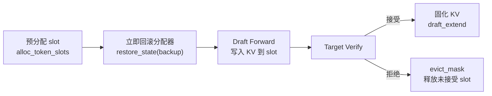

# SGLang 投机解码 (Speculative Decoding)

## 1. 概述

投机解码 (Speculative Decoding) 是一种加速 LLM 推理的技术，通过使用小型 Draft 模型预测多个 token，然后由目标模型并行验证，从而减少解码延迟。

### 1.1 核心思想


### 1.2 支持的算法

`SpeculativeAlgorithm` 是一个简单的 Python `Enum`（`spec_info.py`，143 行）：

| 算法 | 说明 | Draft 模型 |
|------|------|-----------|
| `EAGLE` | 基于 EAGLE 架构的投机解码 | 是 (单层 Draft) |
| `EAGLE3` | EAGLE3 架构，支持 hot token map | 是 (单层 Draft) |
| `STANDALONE` | 独立 Draft 模型 | 是 (完整模型) |
| `NGRAM` | 基于 N-Gram 匹配的无模型投机 | 否 |
| `NONE` | 不启用投机解码 | — |

> CLI 兼容性：`server_args.py` L2352-2353 将 `NEXTN` 自动转换为 `EAGLE`，保持向后兼容。

---

## 2. 核心参数

```python
# server_args.py 相关参数 (L467-490)

# 基础参数
speculative_algorithm: str           # 算法: EAGLE, EAGLE3, NEXTN, NGRAM, STANDALONE
speculative_draft_model_path: str    # Draft 模型路径
speculative_num_steps: int = 5       # Draft 推理步数
speculative_eagle_topk: int = 4      # EAGLE Top-K 采样
speculative_num_draft_tokens: int    # 验证时的 draft token 数
speculative_token_map: str           # Hot token map 文件路径

# 验证阈值参数
speculative_accept_threshold_single: float = 1.0  # 单 token 接受阈值
speculative_accept_threshold_acc: float = 1.0      # 累积接受阈值

# 注意力/MoE 后端
speculative_attention_mode: str = "prefill"        # Draft attention 模式
speculative_draft_attention_backend: str = None     # Draft attention 后端
speculative_moe_runner_backend: str = None          # Draft MoE runner 后端
speculative_moe_a2a_backend: str = None             # Draft MoE all-to-all 后端

# N-Gram 专用参数
speculative_ngram_min_match_window_size: int = 1
speculative_ngram_max_match_window_size: int = 12
speculative_ngram_min_bfs_breadth: int = 1
speculative_ngram_max_bfs_breadth: int = 10
speculative_ngram_match_type: str = "BFS"           # BFS 或 PROB
speculative_ngram_branch_length: int = 18
speculative_ngram_capacity: int = 10_000_000
```

### 2.1 自动参数选择

`auto_choose_speculative_params()`（`server_args.py` L5741-5775）根据模型架构自动选择 `(num_steps, topk, num_draft_tokens)`：

| 模型架构 | num_steps | topk | num_draft_tokens |
|----------|-----------|------|------------------|
| LlamaForCausalLM, Grok1 | 5 | 4 | 8 |
| DeepSeek V2/V3, GptOss, Glm4Moe 等 | 3 | 1 | 4 |
| STANDALONE 算法 | 3 | 1 | 4 |
| 其他模型（默认） | 3 | 1 | 4 |

### 2.2 启动示例

```bash
# EAGLE3 投机解码
python -m sglang.launch_server \
    --model-path meta-llama/Llama-3.1-8B-Instruct \
    --speculative-algorithm EAGLE3 \
    --speculative-draft-model-path EAGLE3-Llama-3.1-8B-Instruct \
    --speculative-num-steps 5 \
    --speculative-eagle-topk 4

# N-Gram 投机解码 (无需 Draft 模型)
python -m sglang.launch_server \
    --model-path meta-llama/Llama-3.1-8B-Instruct \
    --speculative-algorithm NGRAM
```

---

## 3. 算法选择机制

SGLang 使用简单的 `Enum` + `create_worker()` 方法来管理投机解码算法。算法数量有限且各 worker 创建逻辑差异大，因此不需要复杂的注册表系统。

```python
# spec_info.py L15-22
class SpeculativeAlgorithm(Enum):
    """Enumeration of speculative decoding algorithms."""
    EAGLE = auto()
    EAGLE3 = auto()
    STANDALONE = auto()
    NGRAM = auto()
    NONE = auto()
```

### 3.1 类型判断方法

```python
# spec_info.py L36-50
def is_eagle(self) -> bool:
    # NOTE: EAGLE3 is a variant of EAGLE
    return self == SpeculativeAlgorithm.EAGLE or self == SpeculativeAlgorithm.EAGLE3

def is_eagle3(self) -> bool:
    return self == SpeculativeAlgorithm.EAGLE3

def is_standalone(self) -> bool:
    return self == SpeculativeAlgorithm.STANDALONE

def is_ngram(self) -> bool:
    return self == SpeculativeAlgorithm.NGRAM

def supports_spec_v2(self) -> bool:
    return self.is_eagle() or self.is_standalone()
```

> `is_eagle()` 同时匹配 EAGLE 和 EAGLE3，因为 EAGLE3 是 EAGLE 的变体，共享大部分 draft/verify 流程。

### 3.2 Worker 创建: `create_worker()`

`create_worker(server_args)` 方法（L52-105）根据算法类型和 overlap schedule 设置返回对应的 worker 类：

```python
# spec_info.py L52-105
def create_worker(self, server_args: ServerArgs):
    enable_overlap = not server_args.disable_overlap_schedule

    if self.is_eagle() and server_args.enable_multi_layer_eagle:
        # MTP 模式
        return MultiLayerEagleWorkerV2 if enable_overlap else MultiLayerEagleWorker
    elif self.is_eagle():
        # 标准 EAGLE/EAGLE3
        return EAGLEWorkerV2 if enable_overlap else EAGLEWorker
    elif self.is_standalone():
        return StandaloneWorkerV2 if enable_overlap else StandaloneWorker
    elif self.is_ngram():
        if enable_overlap:
            raise ValueError(f"... does not support overlap worker creation.")
        return NGRAMWorker
```

> **设计选择**：使用简单 Enum 而非注册表，因为算法数量有限（5 个）且各 worker 创建逻辑差异大（overlap/non-overlap 分支、MTP 特殊路径）。每个分支使用延迟 import 避免循环依赖。

---

## 4. EAGLE/EAGLE3 架构

### 4.1 整体架构


### 4.2 EAGLEWorker 初始化

```python
# eagle_worker.py L78-206
class EAGLEWorker(TpModelWorker):
    def __init__(self, server_args, gpu_id, tp_rank, dp_rank,
                 moe_ep_rank, attn_cp_rank, moe_dp_rank, nccl_port, target_worker):
        self.topk = server_args.speculative_eagle_topk
        self.speculative_num_steps = server_args.speculative_num_steps
        self.speculative_num_draft_tokens = server_args.speculative_num_draft_tokens

        # 共享 KV Cache 分配器（但 Draft/Target 各有独立 KV Pool）
        self.req_to_token_pool, self.token_to_kv_pool_allocator = (
            target_worker.get_memory_pool()
        )

        # Hot token map 加载 (L120-132)
        if self.speculative_algorithm.is_eagle3():
            self.hot_token_id = None  # EAGLE3 从模型权重加载
        elif server_args.speculative_token_map is not None:
            self.hot_token_id = load_token_map(server_args.speculative_token_map)
            server_args.json_model_override_args = f'{{"hot_vocab_size": {len(self.hot_token_id)}}}'
        else:
            self.hot_token_id = None

        # 初始化 Draft Worker (L134-155)
        super().__init__(
            server_args=server_args,
            is_draft_worker=True,
            req_to_token_pool=self.req_to_token_pool,
            token_to_kv_pool_allocator=self.token_to_kv_pool_allocator,
        )

        # 共享 embedding 和 lm_head (L157-183)
        embed, head = self.target_worker.model_runner.model.get_embed_and_head()
        if self.speculative_algorithm.is_eagle3():
            # 大部分 EAGLE3 模型不共享 lm_head，只共享 embed
            # 但部分模型（如 nvidia/gpt-oss-120b-Eagle3）通过 load_lm_head_from_target 标志共享
            if (hasattr(self.draft_model_runner.model, "load_lm_head_from_target")
                and self.draft_model_runner.model.load_lm_head_from_target):
                self.draft_model_runner.model.set_embed_and_head(embed, head)
            else:
                self.draft_model_runner.model.set_embed(embed)
            # 从模型权重获取 hot_token_id
            if self.draft_model_runner.model.hot_token_id is not None:
                self.hot_token_id = self.draft_model_runner.model.hot_token_id.to(embed.device)
        else:
            if self.hot_token_id is not None:
                head = head.clone()
                head.data = head.data[self.hot_token_id]
            self.draft_model_runner.model.set_embed_and_head(embed, head)

        # eagle_use_aux_hidden_state 特性 (L192-200)
        # EAGLE3 默认使用 aux hidden state，可通过 eagle_config 配置
        self.eagle_use_aux_hidden_state = False
        if self.speculative_algorithm.is_eagle3():
            self.eagle_use_aux_hidden_state = True
            eagle_config = getattr(
                self.draft_model_runner.model_config.hf_config, "eagle_config", {}
            )
            self.eagle_use_aux_hidden_state = eagle_config.get("use_aux_hidden_state", True)
```

### 4.3 EAGLE3 Draft 模型结构

EAGLE3 的 Draft 模型是一个轻量级的单层 Transformer：

```python
# llama_eagle3.py
class LlamaForCausalLMEagle3(LlamaForCausalLM):
    def __init__(self, config, quant_config=None, prefix=""):
        if self.config.num_hidden_layers != 1:
            raise ValueError("EAGLE3 currently only supports 1 layer")
        
        self.model = LlamaModel(config, quant_config, prefix)
        
        # EAGLE3 特有: tie_word_embeddings 或独立 lm_head
        self.load_lm_head_from_target = False
        if self.config.tie_word_embeddings:
            self.lm_head = self.model.embed_tokens
        else:
            if config.draft_vocab_size is None:
                self.load_lm_head_from_target = True
            self.lm_head = ParallelLMHead(config.draft_vocab_size, ...)
        
        self.hot_token_id = None  # 从权重加载

class LlamaDecoderLayer(LlamaDecoderLayer):
    """EAGLE3 的 Decoder Layer, 输入是 [embeds, hidden_states] 拼接"""
    def __init__(self, config, layer_id=0, ...):
        super().__init__(config, layer_id, ...)
        
        # 修改 QKV 投影: 输入维度是 2 * hidden_size
        self.self_attn.qkv_proj = QKVParallelLinear(
            2 * self.hidden_size,  # 拼接 embed 和 hidden
            ...
        )
        self.hidden_norm = RMSNorm(config.hidden_size, eps=config.rms_norm_eps)

    def forward(self, positions, embeds, hidden_states, forward_batch, residual):
        embeds = self.input_layernorm(embeds)
        hidden_states = self.hidden_norm(hidden_states)
        hidden_states = torch.cat([embeds, hidden_states], dim=-1)  # 拼接
        hidden_states = self.self_attn(positions, hidden_states, forward_batch)
        ...
```

### 4.4 Hot Token Map

EAGLE3 使用 hot token map 来压缩词表：

```python
# 加载 hot token map
def load_weights(self, weights):
    for name, loaded_weight in weights:
        if "d2t" in name:
            # d2t: draft_id -> target_id 的映射
            self.hot_token_id = loaded_weight + torch.arange(loaded_weight.shape[0])
            continue
```

---

## 4.5 v2 架构: BaseSpecWorker/BaseDraftWorker 分离模式

> **选择规则**：`SpeculativeAlgorithm.create_worker()`（`spec_info.py` L52-105）根据 `disable_overlap_schedule` 自动选择：
> - **默认**（overlap schedule 开启）→ `EAGLEWorkerV2`（v2）— **v2 是默认行为**
> - `--disable-overlap-schedule` → `EAGLEWorker`（v1）

SGLang 投机解码现在有两套实现架构：v1（`eagle_worker.py`）和 v2（`eagle_worker_v2.py`）。v2 引入了 **BaseSpecWorker/BaseDraftWorker 分离模式**，将 target 和 draft worker 完全解耦。

### 4.5.1 v2 类层次

```python
# base_spec_worker.py (34 行)
class BaseDraftWorker(ABC):
    @abstractmethod
    def draft(): ...
    @abstractmethod
    def draft_extend(): ...

class BaseSpecWorker(ABC):
    @property
    @abstractmethod
    def target_worker(self) -> TpModelWorker: ...   # property 而非直接持有
    @property
    @abstractmethod
    def draft_worker(self) -> BaseDraftWorker: ...   # property 而非直接持有
    @abstractmethod
    def clear_cache_pool(self): ...
```

### 4.5.2 v2 实现文件

| 文件 | 类 | 说明 |
|------|-----|------|
| `eagle_worker_v2.py` (878 行) | `EagleDraftWorker(BaseDraftWorker)` | Draft model 初始化、draft forward、CUDA graph |
| `eagle_worker_v2.py` | `EAGLEWorkerV2(BaseSpecWorker)` | 组合 target + draft，verify 逻辑，attention backend 管理 |
| `eagle_info_v2.py` (489 行) | `assign_extend_cache_locs`, `fill_accepted_out_cache_loc`, `fill_new_verified_id` | v2 专用的 cache loc 分配和验证结果处理函数 |

### 4.5.3 v1 vs v2 对比

| 方面 | v1 (`EAGLEWorker`) | v2 (`EAGLEWorkerV2`) |
|------|---------------------|----------------------|
| 继承关系 | `EAGLEWorker(TpModelWorker)` | `EAGLEWorkerV2(BaseSpecWorker)` |
| Draft 模型 | 直接内嵌 | 独立 `EagleDraftWorker(BaseDraftWorker)` |
| Target 访问 | `self.target_worker` 属性 | `@property target_worker` |
| ForwardMode | `DRAFT_EXTEND` | `DRAFT_EXTEND_V2`（draft 固定形状 logits） |
| CUDA Graph | 可选 | 写入 draft extend 和 draft CUDA graph 分别管理 |
| 设计意义 | target/draft 耦合 | target/draft 完全解耦，支持更灵活的组合 |

### 4.5.4 新增 ForwardMode

`DRAFT_EXTEND_V2` 与 `DRAFT_EXTEND` 的区别：v2 模式下 draft worker 完全独立，可以有自己的 attention backend 和 CUDA graph runner。

---

## 4.6 MultiLayerEagle (MTP) 架构

### 4.6.1 EAGLE3 vs MTP 核心区别

EAGLE3 和 MTP 都基于 EAGLE 框架，但 draft 策略完全不同：

| 方面 | EAGLE / EAGLE3 | MultiLayerEagle (MTP) |
|------|---------------|----------------------|
| Draft 模型层数 | 单层 | 多层（`speculative_num_steps` 层） |
| 每步推理 | 单层 draft model 执行多步，每步 topk 展开 | 每层 draft model 执行一步 |
| 模型文件 | `eagle_worker.py` / `eagle_worker_v2.py` | `multi_layer_eagle_worker.py` / `_v2.py` |
| 启用参数 | `--speculative-algorithm EAGLE` | `--enable-multi-layer-eagle` |
| 适用模型 | 通用 EAGLE draft model | DeepSeek V3 MTP、Qwen3Next MTP |
| 注册 flags | `("EAGLE",)` 或 `("EAGLE", "EAGLE3")` | 同 EAGLE，通过 `enable_multi_layer_eagle` 切换 |

### 4.6.2 实现文件与类层次

| 文件 | 类 | 基类 | 说明 |
|------|-----|------|------|
| `multi_layer_eagle_worker.py` (748 行) | `MultiLayerEagleWorker` | `TpModelWorker` | v1，继承式，target/draft 耦合 |
| `multi_layer_eagle_worker_v2.py` (721 行) | `MultiLayerEagleDraftWorker` | `BaseDraftWorker` | v2 draft worker，组合式 |
| `multi_layer_eagle_worker_v2.py` | `MultiLayerEagleWorkerV2` | `BaseSpecWorker` | v2 spec worker，组合 target + draft |

### 4.6.3 多层 Draft 核心机制

与单层 EAGLE 的关键区别在于 `draft_runner_list`——每个 draft 层有独立的 ModelRunner：

```python
# multi_layer_eagle_worker_v2.py L128
self.draft_runner_list = self.draft_worker.model_runner_list  # 每层一个 runner

def mtp_model_runner(self, step: int):  # L161
    return self.draft_runner_list[step]
```

**Draft Forward 流程**（v2, `draft_forward()` L271-331）：

```python
for step_i in range(self.speculative_num_steps):
    # 每层 draft model 执行一步 forward
    logits = self.mtp_model_runner(step_i).forward(forward_batch)
    # 从 logits 中选 topk
    top_scores, top_indices = torch.topk(logits, self.topk)
    # 累积 tokens、scores、parent 关系
    draft_tokens.append(top_indices)
    parent_list.append(parent_indices)
```

**Extend 阶段**（`_draft_extend_for_decode()` L408-523）：

验证完成后，需要将已接受的 token 路径固化到每层 draft model 的 KV cache 中：

```python
for step_i in range(self.speculative_num_steps):
    # 每层独立执行 extend forward，支持 CUDA graph
    runner = self.mtp_model_runner(step_i)
    if runner.cuda_graph_runner and can_use_cuda_graph:
        logits = runner.cuda_graph_runner.replay(forward_batch)
    else:
        logits = runner.forward(forward_batch)
```

### 4.6.4 适用模型

- **DeepSeek V3 MTP**：使用 `--enable-multi-layer-eagle` 启用，模型自带多层 draft head
- **Qwen3Next MTP**：`Qwen3NextForCausalLMMTP` 模型类，同样通过 `--enable-multi-layer-eagle` 启用

## 4.7 STANDALONE 算法

STANDALONE 使用独立的完整 draft 模型（而非 EAGLE 的轻量 draft head），适用于没有专用 draft head 的场景。

### 4.7.1 实现结构

```python
# standalone_worker.py L24 (文件共 109 行)
class StandaloneWorker(EAGLEWorker):
    """继承 EAGLEWorker，复用其 draft/verify 流程，
    但使用独立加载的完整模型作为 draft model。"""
```

| 方面 | EAGLE | STANDALONE |
|------|-------|-----------|
| Draft 模型 | 轻量 draft head（共享 embedding/lm_head） | 独立完整模型 |
| 启用参数 | `--speculative-algorithm EAGLE` | `--speculative-algorithm STANDALONE` |
| 初始化 | `super().__init__()` → 加载 draft head + `set_embed_and_head()` | 直接 `TpModelWorker.__init__()` 加载完整模型 |
| Embedding/Head 共享 | 共享 target 的 embed 和 lm_head | **不共享**，独立加载权重 |

### 4.7.2 关键初始化差异

StandaloneWorker 重写了 `__init__`，**跳过** `EAGLEWorker.__init__` 中的 `set_embed_and_head()` 调用，直接调用 `TpModelWorker.__init__()`：

```python
# standalone_worker.py L74-90
# 不调用 super().__init__()，而是直接调用 TpModelWorker.__init__()
with empty_context(), speculative_moe_backend_context(), speculative_moe_a2a_backend_context():
    TpModelWorker.__init__(
        self, ...,
        is_draft_worker=True,  # 标记为 draft worker
        req_to_token_pool=self.req_to_token_pool,
        token_to_kv_pool_allocator=self.token_to_kv_pool_allocator,
    )
# 注意：没有调用 set_embed_and_head()，draft 模型独立加载所有权重
```

- 支持 hot token map（`--speculative-token-map`）
- 支持 MoE backend context（`speculative_moe_backend_context`、`speculative_moe_a2a_backend_context`）
- Draft/verify 流程完全复用 `EAGLEWorker` 的实现

---

## 5. Draft-Verify 流程

### 5.1 整体流程


### 5.2 Draft 阶段

```python
# eagle_worker.py L532-613
def draft(self, batch: ScheduleBatch):
    """生成 draft tokens"""
    if batch.forward_mode.is_idle():
        self._draft_preprocess_idle(batch)
    else:
        self._draft_preprocess_decode(batch)
    
    spec_info = batch.spec_info
    spec_info.capture_hidden_mode = CaptureHiddenMode.LAST
    spec_info.num_tokens_per_batch = self.topk
    
    # 获取 forward batch
    model_worker_batch = batch.get_model_worker_batch()
    forward_batch = ForwardBatch.init_new(model_worker_batch, self.draft_model_runner)
    
    # CUDA Graph 优化
    can_cuda_graph = self.cuda_graph_runner and self.cuda_graph_runner.can_run(forward_batch)
    if can_cuda_graph:
        parent_list, top_scores_index, draft_tokens = self.cuda_graph_runner.replay(forward_batch)
    else:
        parent_list, top_scores_index, draft_tokens = self.draft_forward(forward_batch)
    
    # 构建 verification tree
    tree_mask, position, retrive_index, ... = build_tree_kernel_efficient(
        spec_info.verified_id,
        parent_list, top_scores_index, draft_tokens,
        batch.seq_lens, ...,
        self.topk, self.speculative_num_steps, self.speculative_num_draft_tokens,
    )
    
    return EagleVerifyInput(
        draft_token=draft_tokens,
        custom_mask=tree_mask,
        positions=position,
        retrive_index=retrive_index,
        ...
    )
```

### 5.3 Draft Forward 多步推理

```python
# eagle_worker.py L615-685
def draft_forward(self, forward_batch: ForwardBatch):
    """多步 draft forward"""
    spec_info = forward_batch.spec_info
    topk_p, topk_index, hidden_states = (
        spec_info.topk_p, spec_info.topk_index, spec_info.hidden_states
    )
    
    # Hot token map 转换
    if self.hot_token_id is not None:
        topk_index = self.hot_token_id[topk_index]
    
    score_list, token_list, parents_list = [], [], []
    scores = None
    
    # 多步 forward
    for i in range(self.speculative_num_steps):
        input_ids, hidden_states, scores, tree_info = select_top_k_tokens(
            i, topk_p, topk_index, hidden_states, scores, self.topk
        )
        score_list.append(tree_info[0])
        token_list.append(tree_info[1])
        parents_list.append(tree_info[2])
        
        # 最后一步不需要 forward
        if i == self.speculative_num_steps - 1:
            break
        
        # 设置 forward 输入
        forward_batch.input_ids = input_ids
        forward_batch.out_cache_loc = out_cache_loc[i]
        forward_batch.positions.add_(1)
        forward_batch.attn_backend = self.draft_attn_backend.attn_backends[i]
        spec_info.hidden_states = hidden_states
        
        # Draft forward
        logits_output = self.draft_model_runner.forward(forward_batch, skip_attn_backend_init=True)
        probs = torch.softmax(logits_output.next_token_logits, dim=-1)
        topk_p, topk_index = fast_topk(probs, self.topk, dim=-1)
        hidden_states = logits_output.hidden_states
    
    return organize_draft_results(score_list, token_list, parents_list, ...)
```

### 5.4 Verify 阶段

```python
# eagle_worker.py L691-781
def verify(self, batch: ScheduleBatch, spec_info: EagleVerifyInput):
    """验证 draft tokens"""
    seq_lens_pre_verify = batch.seq_lens.clone()
    spec_info.prepare_for_verify(batch, self.page_size)
    
    batch.forward_mode = ForwardMode.TARGET_VERIFY
    batch.spec_info = spec_info
    
    # Target model forward
    model_worker_batch = batch.get_model_worker_batch()
    batch_result = self.target_worker.forward_batch_generation(model_worker_batch, is_verify=True)
    logits_output = batch_result.logits_output
    
    # Grammar mask 处理
    vocab_mask = None
    if batch.has_grammar:
        vocab_mask = generate_token_bitmask(batch.reqs, spec_info, ...)
    
    # 验证并找出接受的 tokens
    res: EagleVerifyOutput = spec_info.verify(
        batch, logits_output, 
        self.token_to_kv_pool_allocator, self.page_size, vocab_mask
    )
    
    # 后处理: 只保留接受的 tokens
    logits_output.next_token_logits = logits_output.next_token_logits[res.accepted_indices]
    logits_output.hidden_states = logits_output.hidden_states[res.accepted_indices]
    
    # 准备下一轮 draft
    batch.forward_mode = ForwardMode.DECODE
    batch.spec_info = res.draft_input
    
    return logits_output, res, model_worker_batch, can_run_cuda_graph
```

### 5.5 概率验证路径

验证阶段（`eagle_info.py` L300-376）支持两种验证模式：

**Greedy 路径**（`is_all_greedy` 或 AMD/HIP 平台）：
```python
# eagle_info.py L310-323
target_predict = torch.argmax(logits_output.next_token_logits, dim=-1)
predict, accept_index, accept_length = verify_tree_greedy_func(
    predicts=predict, accept_index=accept_index, accept_token_num=accept_length,
    candidates=candidates,
    retrive_index=self.retrive_index,
    retrive_next_token=self.retrive_next_token,
    retrive_next_sibling=self.retrive_next_sibling,
    target_predict=target_predict, topk=self.topk,
)
```

**概率路径**（非 greedy 采样，仅 CUDA）：
```python
# eagle_info.py L325-376
# 1. Temperature scaling
target_probs = F.softmax(logits_output.next_token_logits / expanded_temperature, dim=-1)
# 2. Top-K renormalization
target_probs = top_k_renorm_prob(target_probs, expanded_top_ks)
# 3. Top-P renormalization (如果 top_p != 1.0)
target_probs = top_p_renorm_prob(target_probs, expanded_top_ps)
# 4. Rejection sampling
tree_speculative_sampling_target_only(
    predicts=predict, accept_index=accept_index, accept_token_num=accept_length,
    candidates=candidates, ...,
    target_probs=target_probs, draft_probs=draft_probs,  # draft_probs 全零
    threshold_single=server_args.speculative_accept_threshold_single,
    threshold_acc=server_args.speculative_accept_threshold_acc,
    deterministic=True,
)
```

> AMD/HIP 平台因缺少 `tree_speculative_sampling_target_only` kernel 而回退到 greedy 验证，并输出警告日志。

### 5.6 `organize_draft_results` 说明

`eagle_utils.py` L19-38 的 `organize_draft_results()` 将多步 draft 结果整理为验证输入：

```python
def organize_draft_results(score_list, token_list, parents_list, num_draft_token):
    # 1. 拼接所有步的 score
    score_list = torch.cat(score_list, dim=1).flatten(1)
    ss_token_list = torch.cat(token_list, dim=1)
    # 2. 取 top-(num_draft_token - 1) 个最高分 token
    top_scores = torch.topk(score_list, num_draft_token - 1, dim=-1)
    top_scores_index = torch.sort(top_scores.indices).values  # 按 index 排序
    # 3. 根据 index 提取对应的 draft tokens
    draft_tokens = torch.gather(ss_token_list, index=top_scores_index, dim=1)
    # 4. 拼接 parent_list（排除最后一步，因为最后一步无 child）
    parent_list = torch.cat(parents_list[:-1], dim=1)
    return parent_list, top_scores_index, draft_tokens
```

### 5.7 Mamba 状态追踪

对于混合注意力模型（如 Qwen3.5 的 hybrid_gdn_config/mamba2_config），verify 后需要更新 Mamba 状态。

`_mamba_verify_update()`（`eagle_worker.py` L783-860）的核心逻辑：

```python
# 1. 计算每个请求接受了多少步
accepted_length = torch.tensor(res.accept_length_per_req_cpu, ...) + 1
cumulative_accepted_lengths = torch.cumsum(accepted_length, dim=0)

# 2. 确定保留哪个 mamba state（topk > 1 时需要处理 tree 结构）
if spec_info.topk > 1:
    # tree 结构下，通过 accepted_indices 和 cumulative 长度定位正确的 step
    accepted_steps = (
        res.accepted_indices[cumulative_accepted_lengths - 1]
        - accepted_indices_offset
    )
else:
    accepted_steps = accepted_length - 1

# 3. 处理 mamba_track_indices 周期性检查点
if batch.mamba_track_indices is not None:
    # 检查 verify 后 seq_lens 是否跨越了 mamba_track_interval 边界
    to_track_mask = (
        seq_lens_pre_verify // mamba_track_interval
        != batch.seq_lens // mamba_track_interval
    )
    # 计算需要追踪的 step 位置
    mamba_steps_to_track = torch.where(to_track_mask, ..., -1)

# 4. 调用 attention backend 更新 mamba state
self.target_worker.model_runner.attn_backend.update_mamba_state_after_mtp_verify(
    accepted_steps=accepted_steps,
    mamba_track_indices=batch.mamba_track_indices,
    mamba_steps_to_track=mamba_steps_to_track,
    model=self.target_worker.model_runner.model,
)
```

---

## 6. Tree Attention Mask

投机解码使用 tree attention mask 来处理 draft tokens 之间的依赖关系：

```python
# eagle_utils.py L47-158
def build_tree_kernel_efficient(
    verified_id: torch.Tensor,
    parent_list: List[torch.Tensor],
    top_scores_index: torch.Tensor,
    draft_tokens: torch.Tensor,
    seq_lens: torch.Tensor,
    topk: int,
    spec_steps: int,
    num_verify_tokens: int,
    tree_mask_mode: TreeMaskMode = TreeMaskMode.FULL_MASK,
):
    """
    构建验证 tree 的 attention mask。
    
    Tree Mask Mode:
    - FULL_MASK: 完整的 seq_len x num_draft_tokens mask
    - QLEN_ONLY: 只有 qlen 部分的 mask
    - QLEN_ONLY_BITPACKING: 使用 bit packing 压缩的 mask
    """
    draft_tokens = torch.cat((verified_id.unsqueeze(1), draft_tokens), dim=1).flatten()
    
    # 调用 sgl_kernel 构建 tree
    sgl_build_tree_kernel_efficient(
        parent_list, top_scores_index, seq_lens,
        tree_mask, positions, retrive_index,
        retrive_next_token, retrive_next_sibling,
        topk, spec_steps, num_verify_tokens, tree_mask_mode,
    )
    
    return tree_mask, positions, retrive_index, ...
```

### 6.1 Tree 结构示意


**Tree 结构语义**：

- **parent/child 关系**：每个 draft token 的 parent 是它在 tree attention mask 中可以 attend 到的前驱 token。child 只能看到从 root 到自身的路径上的所有祖先节点
- **Tree Attention Mask**：mask 矩阵中 `mask[i][j]=1` 表示 token i 可以看到 token j，即 j 是 i 的祖先（含自身）。非祖先路径上的 token 互相不可见
- **关键索引含义**：
  - `retrieve_index`：从 verify 结果中提取每条候选路径的 token 序列，用于判断哪条路径被接受最多
  - `retrieve_next_token`：每个 draft token 在 verify 输出中对应的 "下一个 token" 位置，用于逐 token 比对是否被 target model 接受
  - `retrieve_next_sibling`：当某个 token 被拒绝时，跳转到同层的兄弟节点继续检查，实现 tree 的广度优先验证

---

## 7. Data Structures

### 7.1 EagleDraftInput

```python
# eagle_info.py L615-808
@dataclass
class EagleDraftInput:
    """Draft 阶段的输入数据"""
    ALLOC_LEN_PER_DECODE: ClassVar[int] = None
    
    topk_p: torch.Tensor = None        # Top-K 概率
    topk_index: torch.Tensor = None    # Top-K token 索引
    hidden_states: torch.Tensor = None # Target 模型的 hidden states
    capture_hidden_mode: CaptureHiddenMode = CaptureHiddenMode.FULL
    
    # Verification 结果
    verified_id: torch.Tensor = None   # 验证通过的 token
    positions: torch.Tensor = None     # Token 位置
```

### 7.2 EagleVerifyInput

```python
# eagle_info.py L54-613
@dataclass
class EagleVerifyInput:
    """Verify 阶段的输入数据"""
    draft_token: torch.Tensor          # Draft tokens
    custom_mask: torch.Tensor          # Tree attention mask
    positions: torch.Tensor            # Token 位置
    retrive_index: torch.Tensor        # 检索索引
    retrive_next_token: torch.Tensor   # 下一个 token
    retrive_next_sibling: torch.Tensor # 兄弟节点
    retrive_cum_len: torch.Tensor      # 累积长度
    
    spec_steps: int                    # Spec 步数
    topk: int                          # Top-K
    draft_token_num: int               # Draft token 数量
    
    def verify(self, batch, logits_output, token_to_kv_pool_allocator, page_size, vocab_mask=None):
        """执行验证并返回接受的 tokens"""
        ...
```

### 7.3 EagleVerifyOutput

```python
# eagle_info.py L810-821
@dataclass
class EagleVerifyOutput:
    """Verify 阶段的输出数据"""
    draft_input: EagleDraftInput           # 下一轮 draft 的输入
    logits_output: LogitsProcessorOutput   # Logits 输出
    verified_id: torch.Tensor              # 验证通过的 token IDs
    accept_length_per_req_cpu: List[int]   # 每个请求接受的长度
    accepted_indices: torch.Tensor         # 接受的索引
```

---

## 8. N-Gram 投机解码

N-Gram 是一种无需 Draft 模型的投机解码方法，基于 C++ 实现的 `NgramCache` 进行历史 token 序列匹配预测。

### 8.1 类定义与初始化

`NGRAMWorker` 是独立类，**不继承** `TpModelWorker` 或 `EAGLEWorker`，直接持有 `target_worker` 引用：

```python
# ngram_worker.py L25-61 (文件共 286 行)
class NGRAMWorker:
    def __init__(self, server_args, gpu_id, tp_rank, dp_rank,
                 moe_ep_rank, attn_cp_rank, moe_dp_rank, nccl_port, target_worker):
        self.target_worker = target_worker
        self.model_runner = target_worker.model_runner  # 直接复用 target 的 model_runner
        self.draft_token_num = server_args.speculative_num_draft_tokens
        self.branch_length = server_args.speculative_ngram_branch_length
        self.max_match_window_size = server_args.speculative_ngram_max_match_window_size

        self._init_preallocated_tensors()  # 预分配 draft_tokens, tree_mask 等张量

        # C++ NgramCache 实例
        self.ngram_cache = NgramCache(
            min_match_window_size=server_args.speculative_ngram_min_match_window_size,
            max_match_window_size=server_args.speculative_ngram_max_match_window_size,
            min_bfs_breadth=server_args.speculative_ngram_min_bfs_breadth,
            max_bfs_breadth=server_args.speculative_ngram_max_bfs_breadth,
            capacity=server_args.speculative_ngram_capacity,
            branch_length=server_args.speculative_ngram_branch_length,
            draft_token_num=server_args.speculative_num_draft_tokens,
        )
```

> 注意：不存在 `ngram_num = 3` 参数。N-Gram 匹配窗口由 `min/max_match_window_size` 控制，树搜索宽度由 `min/max_bfs_breadth` 控制。

### 8.2 Forward 流程

```python
# ngram_worker.py L216-286
def forward_batch_generation(self, batch: ScheduleBatch) -> GenerationBatchResult:
    # 1. 准备 draft tokens + tree mask + verify 输入
    self._prepare_for_speculative_decoding(batch)
    model_worker_batch = batch.get_model_worker_batch()

    if model_worker_batch.forward_mode.is_target_verify():
        # 2. Target model 验证
        batch_result = self.target_worker.forward_batch_generation(
            model_worker_batch, is_verify=True
        )
        # 3. 使用 NgramVerifyInput.verify() 执行 greedy 验证
        logits_output, next_token_ids, num_accepted_tokens = verify_input.verify(
            batch, logits_output, self.page_size, vocab_mask
        )
        # 4. 更新 N-Gram cache
        self._update_ngram_cache(batch)
    else:
        # Extend 模式: 直接 target forward，不做投机
        batch_result = self.target_worker.forward_batch_generation(model_worker_batch)

    return GenerationBatchResult(...)
```

### 8.3 与 EAGLE 的关键区别

| 方面 | EAGLE | NGRAM |
|------|-------|-------|
| Draft 来源 | 神经网络 draft model | C++ `NgramCache` 历史匹配 |
| 验证数据结构 | `EagleVerifyInput` | `NgramVerifyInput`（`ngram_info.py`，452 行） |
| Tree 构建 | `build_tree_kernel_efficient` (sgl_kernel) | `NgramCache.batch_get()` + `reconstruct_indices_from_tree_mask` |
| KV Cache | Draft/Target 各有独立 KV Pool | 仅 Target KV Pool（无 draft model） |
| Overlap 支持 | 支持 v2 overlap | 不支持（`create_worker()` 中会 raise） |
| CUDA Graph | Draft/Extend 各有 CUDA Graph | 无（无 draft model forward） |

---

## 9. KV Cache 管理

### 9.1 共享 KV Cache

Draft 模型和 Target 模型共享 KV Cache 分配器：

```python
# Draft 和 Target 共享 KV Cache
self.req_to_token_pool, self.token_to_kv_pool_allocator = (
    target_worker.get_memory_pool()
)

# 但有各自的 KV Pool
# Target: self.target_worker.model_runner.token_to_kv_pool
# Draft: self.draft_model_runner.token_to_kv_pool
```

### 9.2 Draft Cache 分配

```python
# eagle_worker.py L384-521
def _draft_preprocess_decode(self, batch: ScheduleBatch):
    num_seqs = batch.batch_size()
    
    # 分配 draft cache
    # Layout: [topk 0: iter=0,1,2] [topk 1: iter=0,1,2]
    if self.page_size == 1:
        out_cache_loc, backup = alloc_token_slots(
            batch.tree_cache,
            num_seqs * self.speculative_num_steps * self.topk,
            backup_state=True,
        )
    else:
        # Paged allocation
        out_cache_loc, backup = alloc_paged_token_slots_extend(...)
    
    # 分配完成后恢复状态 (因为 verify 可能会拒绝)
    self.token_to_kv_pool_allocator.restore_state(backup)
```

### 9.3 KV Cache 生命周期

Draft 和 Target 模型的 KV Cache 管理遵循 "预分配 → 立即回滚 → 验证 → 释放未接受" 的模式：

**1. 预分配**（`_draft_preprocess_decode()`）：
- 一次性分配 `num_seqs × spec_steps × topk` 个 slot
- 调用 `alloc_token_slots(backup_state=True)` 保存分配器状态快照

**2. 立即回滚分配器状态**（`_draft_preprocess_decode()` 末尾 L521）：
- `token_to_kv_pool_allocator.restore_state(backup)` 在预分配后**立即**调用
- 这只回滚分配器的内部状态（free list），**不释放已分配的 slot 内存**
- 目的：让分配器"忘记"这些 slot 已被占用，后续 verify 阶段的 target model 可以复用相同的分配器

**3. Draft Forward**：
- 每步 draft forward 将 KV 写入预分配的 slot
- 多步推理产生 tree 结构的 KV cache

**4. Verify 后释放未接受的 slot**：
- 通过 `evict_mask` 标记未被 target model 接受的 token
- 只有被验证通过的 token 路径保留

**5. 固化已验证路径**（`_draft_extend_for_decode()` / `forward_draft_extend_after_decode()`）：
- 将已验证 token path 的 KV cache 固化到 draft model
- Target model 侧类似：根据 `accept_length_per_req` 修正 KV cache 长度



---

## 10. CUDA Graph 优化

### 10.1 Draft CUDA Graph

```python
# eagle_worker.py L232-272
def init_cuda_graphs(self):
    if self.server_args.disable_cuda_graph:
        return
    
    # Capture draft cuda graph
    if self.speculative_num_steps > 1:
        self.cuda_graph_runner = EAGLEDraftCudaGraphRunner(self)
    
    # Capture draft extend cuda graph
    if self.draft_extend_attn_backend:
        self.cuda_graph_runner_for_draft_extend = EAGLEDraftExtendCudaGraphRunner(self)
```

### 10.2 使用 CUDA Graph

```python
# draft 时使用 CUDA Graph
can_cuda_graph = self.cuda_graph_runner and self.cuda_graph_runner.can_run(forward_batch)
if can_cuda_graph:
    parent_list, top_scores_index, draft_tokens = self.cuda_graph_runner.replay(forward_batch)
else:
    parent_list, top_scores_index, draft_tokens = self.draft_forward(forward_batch)
```

---

## 11. 性能优化建议

### 11.1 参数调优

| 场景 | `speculative_num_steps` | `speculative_eagle_topk` | 说明 |
|------|-------------------------|--------------------------|------|
| 低延迟 | 3-4 | 2-4 | 更少的 draft 步数 |
| 高吞吐 | 5-6 | 4-8 | 更多的 draft tokens |
| 简单任务 | 6-8 | 8 | 任务可预测性高 |

### 11.2 推荐配置

```bash
# 高吞吐配置
python -m sglang.launch_server \
    --model-path meta-llama/Llama-3.1-70B-Instruct \
    --speculative-algorithm EAGLE3 \
    --speculative-draft-model-path EAGLE3-Llama-3.1-70B-Instruct \
    --speculative-num-steps 6 \
    --speculative-eagle-topk 8 \
    --speculative-num-draft-tokens 64 \
    --tp-size 4

# 低延迟配置
python -m sglang.launch_server \
    --model-path meta-llama/Llama-3.1-8B-Instruct \
    --speculative-algorithm EAGLE3 \
    --speculative-draft-model-path EAGLE3-Llama-3.1-8B-Instruct \
    --speculative-num-steps 4 \
    --speculative-eagle-topk 4
```

---

## 12. 调试技巧

### 12.1 接受率监控

```python
# GenerationBatchResult 包含接受率信息
result.num_accepted_tokens        # 总接受 tokens
result.accept_length_per_req_cpu  # 每请求接受长度
```

### 12.2 日志级别

```bash
export SGLANG_LOG_LEVEL=debug
# 查看 draft/verify 详细信息
```

### 12.3 禁用投机解码

```bash
# 不指定 speculative 参数即禁用
python -m sglang.launch_server --model-path meta-llama/Llama-3.1-8B-Instruct
```

---

## 13. 核心文件

| 组件 | 文件 | 行数 | 说明 |
|------|------|------|------|
| **算法枚举** | `speculative/spec_info.py` | 143 | `SpeculativeAlgorithm` Enum + `create_worker()` |
| **v1 架构** | | | |
| EAGLE Worker v1 | `speculative/eagle_worker.py` | 1032 | EAGLE/EAGLE3 主实现 (v1, 继承 TpModelWorker) |
| EAGLE 数据结构 | `speculative/eagle_info.py` | 821 | `EagleDraftInput`, `EagleVerifyInput`, `EagleVerifyOutput` |
| **v2 架构** | | | |
| Base ABC | `speculative/base_spec_worker.py` | 34 | `BaseSpecWorker` / `BaseDraftWorker` 抽象基类 |
| EAGLE Worker v2 | `speculative/eagle_worker_v2.py` | 878 | `EagleDraftWorker` + `EAGLEWorkerV2` 分离实现 |
| EAGLE Info v2 | `speculative/eagle_info_v2.py` | 489 | v2 验证结果处理函数 |
| Draft Utils | `speculative/draft_utils.py` | 249 | `DraftBackendFactory` 等 draft 工具 |
| **Multi-Layer** | | | |
| Multi-Layer Worker v1 | `speculative/multi_layer_eagle_worker.py` | 748 | 多层 EAGLE (v1, 继承 TpModelWorker) |
| Multi-Layer Worker v2 | `speculative/multi_layer_eagle_worker_v2.py` | 721 | 多层 EAGLE (v2, 基于 BaseSpecWorker/BaseDraftWorker) |
| Multi-Layer Utils | `speculative/multi_layer_eagle_utils.py` | 350 | Multi-Layer draft CUDA graph 等工具 |
| Multi-Layer CG | `speculative/multi_layer_eagle_draft_extend_cuda_graph_runner.py` | 661 | Multi-Layer draft extend CUDA graph |
| **Standalone** | | | |
| Standalone Worker v1 | `speculative/standalone_worker.py` | 109 | 独立 Draft 模型 worker (继承 EAGLEWorker) |
| Standalone Worker v2 | `speculative/standalone_worker_v2.py` | 185 | 独立 Draft 模型 worker (v2, 继承 EagleDraftWorker) |
| **N-Gram** | | | |
| N-Gram Worker | `speculative/ngram_worker.py` | 286 | N-Gram 投机解码 (C++ NgramCache) |
| N-Gram 数据结构 | `speculative/ngram_info.py` | 452 | `NgramVerifyInput` 验证数据结构 |
| **通用工具** | | | |
| Tree 构建 | `speculative/eagle_utils.py` | 199 | `build_tree_kernel_efficient`, `organize_draft_results` |
| Spec Utils | `speculative/spec_utils.py` | 749 | `select_top_k_tokens`, `generate_token_bitmask` 等 |
| **CUDA Graph** | | | |
| Draft CG | `speculative/eagle_draft_cuda_graph_runner.py` | 396 | Draft CUDA Graph Runner |
| Draft Extend CG | `speculative/eagle_draft_extend_cuda_graph_runner.py` | 493 | Draft Extend CUDA Graph Runner |
| **模型** | | | |
| EAGLE3 模型 | `models/llama_eagle3.py` | — | EAGLE3 Draft 模型结构 |

---

## 14. Standalone Worker V2

**文件**: `srt/speculative/standalone_worker_v2.py`（185 行）

继承 `EagleDraftWorker`（而非 `EAGLEWorker`），不共享 embeddings/lm_head，适用于 draft 模型与 target 模型架构差异较大的场景。

## 15. Multi-Layer EAGLE 扩展

| 文件 | 行数 | 说明 |
|------|------|------|
| `multi_layer_eagle_draft_extend_cuda_graph_runner.py` | 661 | 多层 EAGLE Draft Extend CUDA Graph Runner |
| `multi_layer_eagle_utils.py` | 350 | 多层 EAGLE 工具函数 |
| `multi_layer_eagle_worker_v2.py` | 721 | 多层 EAGLE Worker V2 |
| `eagle_info_v2.py` | 489 | EAGLE V2 信息结构 |
| `draft_utils.py` | 249 | Draft 工具函数 |
