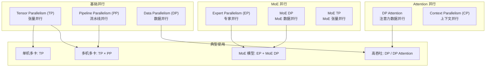
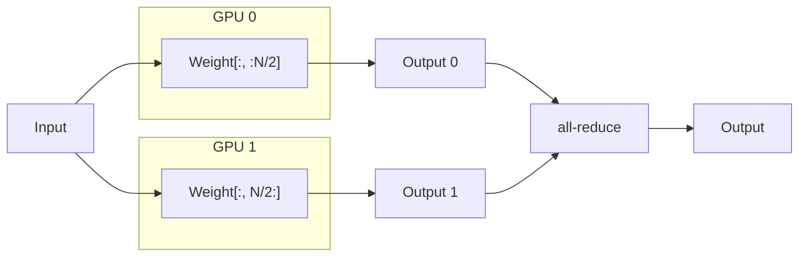
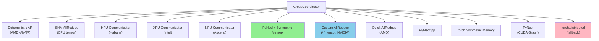
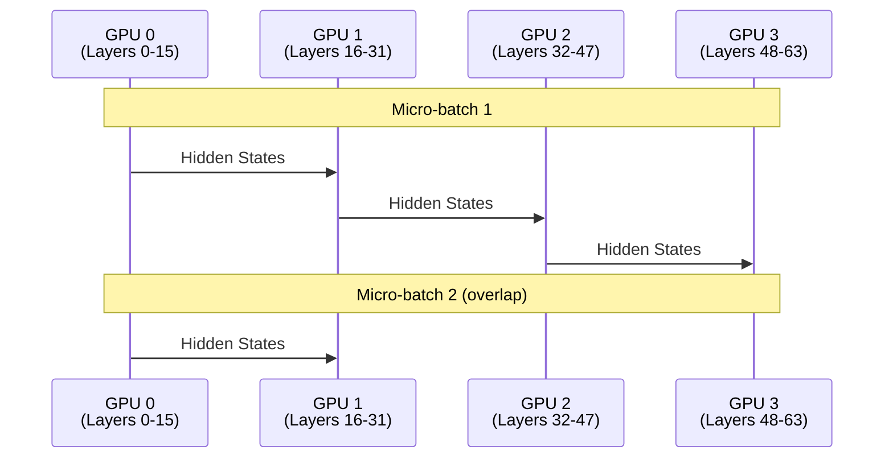
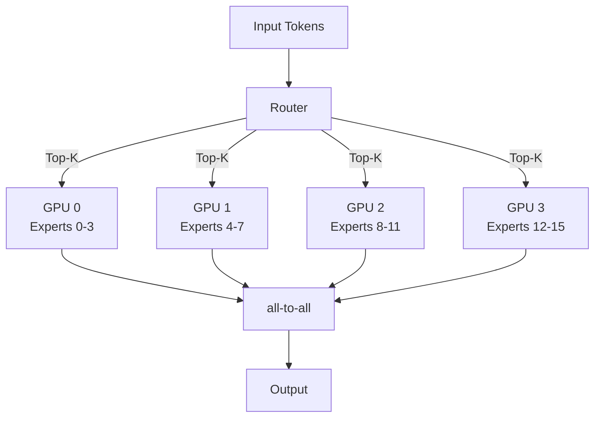
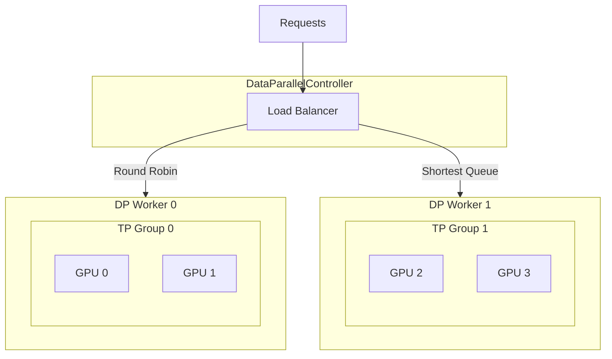
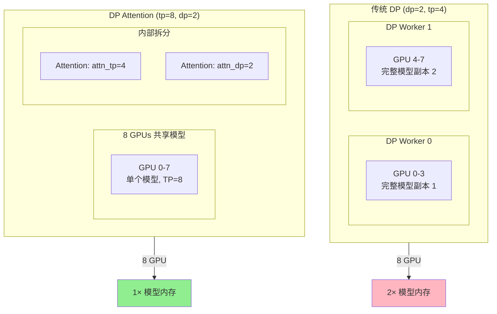
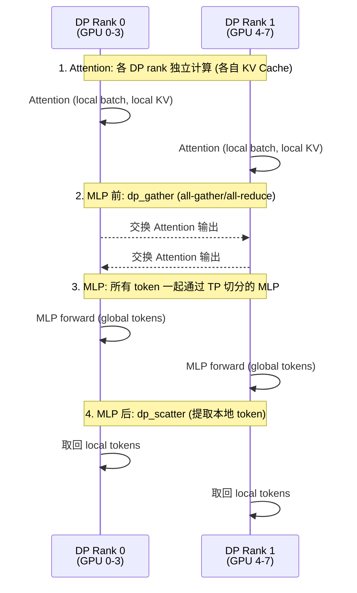
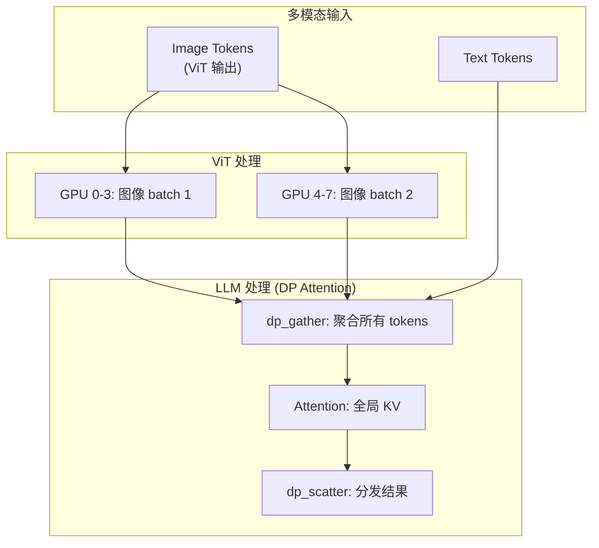

# SGLang 并行策略详解

> **默认场景**: Qwen3.5 混合架构模型（Full Attention + Linear Attention/GatedDeltaNet + MoE + MTP）
>
> **启用特性**: PD 分离 + Chunked Prefill + ViT DP + Overlap Schedule + 多模态缓存 + EPLB + MTP + 线性注意力

## 1. 概览

SGLang 支持多种并行策略来扩展大型模型的推理能力：



| 策略 | 缩写 | 切分维度 | 适用场景 | 通信操作 |
|------|------|----------|----------|----------|
| **Tensor Parallelism** | TP | 模型权重 | 单机多卡 | all-reduce |
| **Pipeline Parallelism** | PP | 模型层 | 跨节点 | P2P send/recv |
| **Expert Parallelism** | EP | MoE 专家 | MoE 模型 | all-to-all |
| **Data Parallelism** | DP | Batch | 高吞吐 | 无 (标准 DP 各 worker 独立) |
| **DP Attention** | DPAttn | Attention heads | 高吞吐 + 省内存 | all-gather / all-reduce |
| **MoE DP** | MoE DP | MoE 层的 Batch | MoE 高吞吐 | 无 (MoE 层内 DP) |
| **MoE TP** | MoE TP | MoE 层权重 | MoE 层内 TP | all-reduce |
| **Context Parallelism** | CP | 序列长度 | 长序列 | ring attention |

**核心文件**:
- `srt/distributed/parallel_state.py` - 进程组管理、GroupCoordinator
- `srt/layers/linear.py` - TP 层实现 (`ColumnParallelLinear` / `RowParallelLinear`)
- `srt/layers/dp_attention.py` - DP Attention 核心实现
- `srt/managers/data_parallel_controller.py` - DP 控制器
- `srt/layers/model_parallel.py` - TransformersForCausalLM bridge 的 TP 适配

## 2. Tensor Parallelism (TP)

> **Why**：单个 GPU 放不下完整的模型权重。TP 将每层内的权重矩阵沿特定维度切分到多个 GPU，使每个 GPU 只持有部分权重。
>
> **目标层**：Attention 的 QKV/O 投影 + FFN 的 Gate/Up/Down 线性层（即 `ColumnParallelLinear` / `RowParallelLinear`）。

### 2.1 工作原理

TP 将模型权重沿特定维度切分到多个 GPU，每个 GPU 持有权重的一部分。



### 2.2 Column Parallel vs Row Parallel

| 方式 | 权重切分 | 输出 | 通信位置 |
|------|----------|------|----------|
| **Column Parallel** | 按列切分 `W[:, :N/TP]` | 拼接 | 层后 (可选) |
| **Row Parallel** | 按行切分 `W[:N/TP, :]` | all-reduce | 层后 (必须) |

```python
# layers/linear.py — 主要 TP 实现
class ColumnParallelLinear(LinearBase):       # L277
    """列并行: Y = X @ A, A 按第二维切分为 [A_1, ..., A_p]
    每个 GPU 持有 output_size // tp_size 列，输出可选 all-gather 拼接"""
    def __init__(self, input_size, output_size, ...):
        self.output_size_per_partition = divide(output_size, tp_size)
        # 权重 shape: [output_size_per_partition, input_size]

class RowParallelLinear(LinearBase):          # L1280
    """行并行: Y = X @ A, A 按第一维切分, X 按第二维切分
    每个 GPU 计算部分结果，输出必须 all-reduce 聚合"""
    def __init__(self, input_size, output_size, ...):
        self.input_size_per_partition = divide(input_size, tp_size)
        # 权重 shape: [output_size, input_size_per_partition]
```

> **注**: `layers/model_parallel.py` 中的 `ColwiseParallelSharded` / `RowwiseParallelMaybeWait` 仅用于 `TransformersForCausalLM` bridge（HuggingFace 模型自动适配），不是 SGLang 原生模型的 TP 实现。

### 2.3 典型切分策略 (Qwen3 为例)

| 层 | 切分方式 | 原因 |
|----|----------|------|
| **QKV Projection** | Column | 输出可独立 |
| **Attention Output** | Row | 需要 all-reduce |
| **Gate/Up Projection** | Column | FFN 第一层 |
| **Down Projection** | Row | FFN 第二层 |
| **Embedding** | Row (vocab) | 词表并行 |
| **LM Head** | Column | 词表并行 |

### 2.4 进程组初始化

```python
# parallel_state.py:1595
def initialize_model_parallel(
    tensor_model_parallel_size: int = 1,
    expert_model_parallel_size: int = 1,
    pipeline_model_parallel_size: int = 1,
    attention_data_parallel_size: int = 1,
    attention_context_model_parallel_size: int = 1,
    moe_data_model_parallel_size: int = 1,
    backend: Optional[str] = None,
    duplicate_tp_group: bool = False,       # PD-Multiplexing 用
):
    """
    例: 8 GPU, TP=2, PP=4

    TP Groups: [g0,g1], [g2,g3], [g4,g5], [g6,g7]
    PP Groups: [g0,g2,g4,g6], [g1,g3,g5,g7]
    """
    # 创建 TP 组 (L1661-1685)
    num_tp_groups = world_size // tensor_model_parallel_size
    for i in range(num_tp_groups):
        ranks = list(range(i * tp_size, (i + 1) * tp_size))
        group_ranks.append(ranks)

    _TP = init_model_parallel_group(group_ranks, ...)
```

## 3. GroupCoordinator (通信抽象)

**文件**: `parallel_state.py:175`

`GroupCoordinator` 是 SGLang 的核心通信抽象，封装了多种后端。

### 3.1 支持的通信后端



### 3.2 all-reduce 路由

```python
# parallel_state.py:529 (简化路由逻辑，实际代码更复杂)
def all_reduce(self, input_: torch.Tensor) -> torch.Tensor:
    if self.world_size == 1:
        return input_                                    # 单卡直接返回

    # 1. AMD 确定性模式 (SGLANG_USE_1STAGE_ALLREDUCE)
    if use_deterministic_ar and self.ca_comm:
        return self.ca_comm.deterministic_all_reduce(input_)

    # 2. CPU tensor → SHM all-reduce 或 torch.distributed
    if input_.is_cpu:
        torch.ops.sgl_kernel.shm_allreduce(input_) ...

    # 3. 硬件专用 communicator (HPU / XPU / NPU)
    if self.hpu_communicator: return self.hpu_communicator.all_reduce(input_)
    if self.xpu_communicator: return self.xpu_communicator.all_reduce(input_)
    if self.npu_communicator: return self.npu_communicator.all_reduce(input_)

    # 4. PyNccl + Symmetric Memory (高优先级)
    if self.pynccl_comm and self.is_symmetric_memory_enabled():
        self.pynccl_comm.all_reduce(input_) ...

    # 5. Outplace all-reduce: CA > QR > PyMscclpp > torch_symm_mem
    if self.ca_comm and self.ca_comm.should_custom_ar(input_):       # 小 tensor
        outplace_all_reduce_method = "ca"
    elif self.qr_comm and self.qr_comm.should_quick_allreduce(input_):  # AMD
        outplace_all_reduce_method = "qr"
    elif self.pymscclpp_comm and ...:
        outplace_all_reduce_method = "pymscclpp"
    elif self.torch_symm_mem_comm and ...:
        outplace_all_reduce_method = "torch_symm_mem"

    # 6. Piecewise CUDA Graph → PyNccl outplace
    # 7. Fallback → torch.distributed.all_reduce
```

### 3.3 CUDA Graph 兼容

| 后端 | Eager 模式 | Graph 模式 |
|------|:----------:|:----------:|
| Quick AllReduce | ✓ | ✓ |
| Custom AllReduce | ✓ | ✓ |
| PyNccl | ✗ | ✓ |
| PyMscclpp | ✗ | ✓ |
| torch.distributed | ✓ | ✗ |

### 3.4 通信原语与使用场景

| 原语 | 使用场景 | 语义 |
|------|---------|------|
| **all-reduce** | TP 中 `RowParallelLinear` 输出聚合 | 每个 rank 持有部分和，all-reduce 后每个 rank 得到完整结果 |
| **all-gather** | DP Attention 中收集各 rank 的 partial results | 各 rank 持有不同数据片段，拼接为完整序列 |
| **all-to-all** | EP 中 token 按专家分发 + 结果收回 | 双向 shuffle：发送端按目标专家路由，接收端收集本地专家的输入 |
| **P2P send/recv** | PP 中 stage 间传递 hidden_states | 单向流水线：上游 stage send，下游 stage recv |
| **broadcast** | TP 中 Rank 0 分发请求/数据 | Rank 0 通过 Gloo CPU broadcast 将请求广播给所有 TP rank |

## 4. Pipeline Parallelism (PP)

> **Why**：跨节点带宽有限（如 InfiniBand），层间只需传递 hidden_states（一个 `[batch, hidden_size]` tensor），通信量远小于 TP 的 all-reduce。PP 按 Transformer 层划分到不同节点，最小化跨节点通信。
>
> **目标层**：按 Transformer Block 整层划分（如 Layer 0-15 → Node 0，Layer 16-31 → Node 1）。

### 4.1 工作原理

PP 将模型按层划分到不同设备，数据在设备间流水线传递。



### 4.2 关键参数

```bash
# 启动 PP
python -m sglang.launch_server --model-path ... \
    --tp 2 --pp 2  # 4 GPU: 2x2 配置
```

### 4.3 P2P 通信

```python
# GroupCoordinator 中的 P2P 方法
def send_tensor_dict(self, tensor_dict, dst=None, async_send=True):
    """发送 tensor 字典到下一阶段"""
    metadata_list, tensor_list = _split_tensor_dict(tensor_dict)
    self.send_object(metadata_list, dst=dst, async_send=async_send)
    for tensor in tensor_list:
        torch.distributed.isend(tensor, self.ranks[dst], group=self.device_group)

def recv_tensor_dict(self, src=None):
    """从上一阶段接收 tensor 字典"""
    recv_metadata_list = self.recv_object(src=src)
    for key, value in recv_metadata_list:
        if isinstance(value, TensorMetadata):
            tensor = torch.empty(value.size, dtype=value.dtype)
            torch.distributed.irecv(tensor, src=self.ranks[src])
            tensor_dict[key] = tensor
```

## 5. Expert Parallelism (EP)

> **Why**：MoE 模型的专家数量多（如 Qwen3.5-397B-A17B 有 128 个专家），单卡放不下所有专家权重。EP 将 FFN 中的 MoE 专家层分配到不同 GPU，每个 GPU 只持有部分专家。
>
> **目标层**：仅 MoE FFN 层中的专家权重（`FusedMoE` / `EPMoE`），非 MoE 层（如 Attention）不受影响。

### 5.1 MoE 模型并行

EP 将 MoE 层的不同专家分配到不同 GPU。



### 5.2 MoE 三维并行: EP × MoE DP × MoE TP

MoE 层有独立于 Attention 层的并行维度体系。在一个 TP 组内部，MoE 层的 rank 被划分为三个维度：

```
tp_size = moe_dp_size × ep_size × moe_tp_size
```

| 维度 | 含义 | 通信 |
|------|------|------|
| **MoE DP** | MoE 层的数据并行，不同 MoE DP rank 处理不同 batch | 无 |
| **EP** | 专家并行，不同 EP rank 持有不同专家 | all-to-all |
| **MoE TP** | MoE 层内的张量并行，切分单个专家的权重 | all-reduce |

Rank layout (从外到内): `Global(TP) → MOE_DP → EP → MOE_TP`

```python
# parallel_state.py — MoE 并行维度计算
moe_ep_size = expert_model_parallel_size          # ep_size
moe_dp_size = moe_data_model_parallel_size        # moe_dp_size
moe_tp_size = tp_size // moe_ep_size // moe_dp_size
```

**约束条件** (`server_args.py:2100`):
```python
assert ep_size * moe_dp_size <= tp_size
# 当 ep_size > 1 时，必须严格相等:
if ep_size > 1:
    assert ep_size * moe_dp_size == tp_size  # 即 moe_tp_size == 1
```

### 5.3 EP 组初始化

```python
# parallel_state.py:1799-1822 — MOE_EP 组
if moe_ep_size == tensor_model_parallel_size:
    _MOE_EP = _TP  # EP 组与 TP 组相同
else:
    # 三层循环: tp_group → moe_dp → moe_tp
    for tp_group_idx in range(num_tp_groups):
        for moe_dp_idx in range(moe_dp_size):
            for moe_tp_idx in range(moe_tp_size):
                st = (tp_group_idx * tp_size
                      + moe_dp_idx * moe_ep_size * moe_tp_size
                      + moe_tp_idx)
                en = st + moe_ep_size * moe_tp_size
                ranks = list(range(st, en, moe_tp_size))
                group_ranks.append(ranks)
    _MOE_EP = init_model_parallel_group(group_ranks, group_name="moe_ep")

# parallel_state.py:1777-1797 — MOE_DP 组
# parallel_state.py:1824-1848 — MOE_TP 组
```

**示例**: `tp=8, ep=4, moe_dp=2` → `moe_tp_size = 8 // 4 // 2 = 1`

| Rank | MOE_DP | EP | MOE_TP |
|------|--------|----|--------|
| 0 | 0 | 0 | 0 |
| 1 | 0 | 1 | 0 |
| 2 | 0 | 2 | 0 |
| 3 | 0 | 3 | 0 |
| 4 | 1 | 0 | 0 |
| 5 | 1 | 1 | 0 |
| 6 | 1 | 2 | 0 |
| 7 | 1 | 3 | 0 |

### 5.4 Qwen3.5-397B-A17B EP 配置

Qwen3.5-397B-A17B 是 MoE 模型：
- 总专家数: 128
- 激活专家: 22 (Top-K=8)
- 推荐配置: EP=8 (每 GPU 16 专家)

## 6. Data Parallelism (DP)

> **Why**：提升吞吐量。每个 DP worker 持有完整的模型副本（可能内部再做 TP 切分），独立处理不同的请求 batch。不切分模型权重，纯粹通过副本并行增加处理能力。
>
> **目标层**：不切分任何层——每个 DP worker 是完整模型（或完整 TP 组）。

### 6.1 工作原理

DP 将请求分发到多个独立的模型副本。



### 6.2 负载均衡策略

**文件**: `data_parallel_controller.py:70`

```python
class LoadBalanceMethod(Enum):
    ROUND_ROBIN = auto()            # 轮询
    FOLLOW_BOOTSTRAP_ROOM = auto()  # 跟随 bootstrap room (PD 分离场景)
    TOTAL_REQUESTS = auto()         # 路由到总请求数最少的 DP rank
    TOTAL_TOKENS = auto()           # 路由到总 token 数最少的 DP rank
```

`DPBudget` 类 (L87) 维护每个 DP rank 的实时负载（请求数 + token 数），`TOTAL_REQUESTS` 和 `TOTAL_TOKENS` 基于此做调度决策。

### 6.3 启动 DP

```bash
# 4 GPU, DP=2 (每个 DP worker 使用 TP=2)
python -m sglang.launch_server --model-path ... \
    --dp 2 --tp 2

# 负载均衡方式
--load-balance-method round_robin
--load-balance-method shortest_queue
```

## 7. DP Attention (Data Parallel Attention)

**文件**: `srt/layers/dp_attention.py` (577 行)

DP Attention 是 SGLang 的高级优化技术，将 TP 组拆分为 Attention TP + Attention DP，在保持模型并行的同时提升吞吐。

### 7.1 传统 DP vs DP Attention



| 特性 | 传统 DP | DP Attention |
|------|---------|--------------|
| 模型副本 | 多份 | 单份 |
| KV Cache | 独立 | 各 DP rank 独立 (Attention 独立计算) |
| 模型权重内存 | 高 (多副本) | 低 (单副本 TP 切分) |
| 通信开销 | 无 | MLP 前后 all-gather/all-reduce |

### 7.2 核心原理

```python
# dp_attention.py:230
def compute_dp_attention_world_info(
    enable_dp_attention, tp_rank, tp_size, dp_size, attn_cp_size: int = 1
):
    """
    将 TP 组拆分为 Attention DP × Attention CP × Attention TP
    Rank layout (从外到内): (dp, cp, tp)，tp 是最快变化维度

    例: tp_size=8, dp_size=2, attn_cp_size=1
    - attn_dp_size = 2
    - attn_tp_size = 8 // 2 // 1 = 4
    - tp_rank=5 → attn_dp_rank = 5 // (4*1) = 1, attn_tp_rank = 5 % 4 = 1
    """
    attn_dp_size = dp_size if enable_dp_attention else 1
    attn_tp_size = tp_size // attn_dp_size // attn_cp_size
    attn_tp_rank = tp_rank % attn_tp_size

    if not enable_dp_attention:
        attn_dp_rank = 0
    else:
        # tp_rank = ((cp_rank * dp_size) + dp_rank) * attn_tp_size + attn_tp_rank
        attn_dp_rank = tp_rank // (attn_tp_size * attn_cp_size)

    return attn_tp_rank, attn_tp_size, attn_dp_rank
```

Attention 并行维度与 MoE 并行维度对比：

| 层类型 | Rank layout (从外到内) |
|--------|----------------------|
| **Attention** | `Global(TP) → ATTN_DP → ATTN_CP → ATTN_TP` |
| **MoE** | `Global(TP) → MOE_DP → EP → MOE_TP` |

### 7.3 数据流

> **关键理解**: DP Attention 中，每个 DP rank 用自己的 KV Cache 独立做 Attention。gather/scatter 发生在 MLP 层前后，因为 MLP 权重是 TP 切分的，需要所有 token 参与计算。



### 7.4 Padding 模式

```python
# dp_attention.py:50
class DpPaddingMode(IntEnum):
    MAX_LEN = auto()  # Padding 到最大长度, 用 all_gather_into_tensor
    SUM_LEN = auto()  # Padding 到总长度, 用 all_reduce

    @classmethod
    def get_dp_padding_mode(cls, is_extend_in_batch, global_num_tokens):
        if is_extend_in_batch:
            return DpPaddingMode.SUM_LEN  # extend 阶段强制 SUM_LEN

        # 选择通信开销最小的模式
        max_len = max(global_num_tokens)
        sum_len = sum(global_num_tokens)
        if sum_len * 2 > max_len * get_attention_dp_size():
            return cls.MAX_LEN  # all-gather 更优
        else:
            return cls.SUM_LEN  # all-reduce 更优
```

### 7.5 ViT DP (多模态场景)

对于 Qwen3.5 等多模态模型，ViT 处理可以使用 DP Attention 优化：



**启用 ViT DP**:
```bash
python -m sglang.launch_server \
    --model-path Qwen/Qwen3.5-397B-A17B-FP8 \
    --tp 8 \
    --dp 2 \
    --enable-dp-attention
```

### 7.6 关键函数

| 函数 | 行号 | 作用 |
|------|------|------|
| `dp_gather_partial` | L507 | 收集各 DP rank 的 partial results（非 attn_tp_rank 0 的数据填零） |
| `dp_gather_replicate` | L515 | 收集并复制完整结果到所有 rank（attn_tp_rank 非 0 的也参与） |
| `dp_scatter` | L523 | MLP 后提取本地 DP rank 的 token 子集 |
| `get_attention_tp_group` | - | 获取 Attention 专用 TP 组 (ATTN_TP) |
| `get_attention_dp_rank/size` | - | 获取 Attention DP rank/size |
| `compute_dp_attention_world_info` | L230 | 计算 attn_tp_rank, attn_tp_size, attn_dp_rank |

### 7.7 适用场景

| 场景 | 是否推荐 | 原因 |
|------|:--------:|------|
| MoE 模型 + 高吞吐 | ✓ | 共享 KV, 减少内存 |
| 多模态 (VL) | ✓ | ViT 可 DP 并行 |
| 小模型 + 低延迟 | ✗ | 通信开销不划算 |
| 单请求场景 | ✗ | 无法利用 DP |

### 7.8 Context Parallelism (CP)

> **Why**: 超长序列（如 128K+ tokens）的 Attention 计算量随序列长度平方增长，单个 GPU 的 KV Cache 也可能放不下。CP 将序列沿长度维度切分到多个 GPU，每个 GPU 只处理部分序列的 Attention。

**参数**: `--attn-cp-size`（默认 1，即不启用）

CP 是 Attention 并行维度的一部分，与 DP Attention 共存于同一 TP 组内：

```
attn_tp_size = tp_size // attn_dp_size // attn_cp_size
```

**进程组初始化** (`parallel_state.py:1710-1738`):

```python
# ATTN_CP 组: 同一 DP rank、同一 attn_tp_rank 的 rank 组成 CP 组
for tp_group_idx in range(num_tp_groups):
    for dp_idx in range(attn_dp_size):
        for attn_tp_idx in range(attn_tp_size):
            st = (tp_group_idx * tp_size
                  + dp_idx * attn_tp_size * attn_cp_size
                  + attn_tp_idx)
            en = (tp_group_idx * tp_size
                  + (dp_idx + 1) * attn_tp_size * attn_cp_size
                  + attn_tp_idx)
            ranks = list(range(st, en, attn_tp_size))
```

**示例**: `tp=8, dp=2, cp=2` → `attn_tp_size = 8 // 2 // 2 = 2`

| Rank | ATTN_DP | ATTN_CP | ATTN_TP |
|------|---------|---------|---------|
| 0 | 0 | 0 | 0 |
| 1 | 0 | 0 | 1 |
| 2 | 0 | 1 | 0 |
| 3 | 0 | 1 | 1 |
| 4 | 1 | 0 | 0 |
| 5 | 1 | 0 | 1 |
| 6 | 1 | 1 | 0 |
| 7 | 1 | 1 | 1 |


## 8. PD-Multiplexing (Prefill-Decode 复用)

### 8.1 概念

PD-Multiplexing 是一种在**同一组 GPU** 上同时处理 Prefill 和 Decode 请求的并行策略。与 PD 分离 (Disaggregation) 不同，PD-Multiplexing 不需要将 Prefill 和 Decode 部署到不同的 GPU 集群，而是通过**动态切换 TP Group** 和 **CUDA Stream 隔离** 在同一组 GPU 上交替执行两种工作负载。

**核心思路**: 利用 Decode 阶段 GPU 利用率低的特点，在 Decode 间隙分出 SM 执行 Prefill。

### 8.2 动态 TP Group 切换

**文件**: `parallel_state.py` — `_PDMUX_PREFILL_TP_GROUP` 在 `initialize_model_parallel()` 中通过 `duplicate_tp_group=True` 创建 (L1687-1704)

```python
# duplicate GroupCoordinator for prefill in PD-Multiplexing
_PDMUX_PREFILL_TP_GROUP: Optional[GroupCoordinator] = None
_ENABLE_PDMUX_P_TP: bool = False

def set_pdmux_status(enable_prefill_multiplexing: bool):
    global _ENABLE_PDMUX_P_TP
    _ENABLE_PDMUX_P_TP = enable_prefill_multiplexing

def get_tp_group() -> GroupCoordinator:
    if _ENABLE_PDMUX_P_TP:
        assert _PDMUX_PREFILL_TP_GROUP is not None, \
            "tensor model parallel group for PD-Multiplexing Prefill is not initialized"
        return _PDMUX_PREFILL_TP_GROUP
    assert _TP is not None, "tensor model parallel group is not initialized"
    return _TP
```

**关键机制**: `get_tp_group()` 根据 `_ENABLE_PDMUX_P_TP` 全局标记动态返回不同的 TP Group。当执行 Prefill 时切换到 `_PDMUX_PREFILL_TP_GROUP`，执行 Decode 时使用默认的 `_TP`。

### 8.3 调度循环

**文件**: `srt/multiplex/multiplexing_mixin.py` (通过 `SchedulerMultiplexMixin` 混入 Scheduler)

PD-Multiplexing 使用独立的 CUDA Stream 分别执行 Prefill 和 Decode：

```python
# multiplexing_mixin.py (简化)
while True:
    with torch.cuda.stream(decode_stream):
        set_pdmux_status(False)          # Decode 使用默认 TP Group
        recv_reqs = self.recv_requests()
        self.process_input_requests(recv_reqs)

    with torch.cuda.stream(prefill_stream):
        set_pdmux_status(True)           # Prefill 使用专用 TP Group
        # 执行 split prefill...

    with torch.cuda.stream(decode_stream):
        set_pdmux_status(False)
        self.running_batch = self.update_running_batch(self.running_batch)
        # 执行 decode forward...

    with torch.cuda.stream(prefill_stream):
        set_pdmux_status(True)
        # 继续 prefill forward...
```

配合 `ForwardMode.SPLIT_PREFILL` 使用，该模式在 `forward_batch_info.py` 中定义，被视为 extend 的一种变体。

### 8.4 约束条件

```python
# server_args.py:5184-5197 中的限制
assert self.pp_size == 1,              "PD-Multiplexing 不支持 Pipeline Parallelism"
assert self.chunked_prefill_size == -1, "PD-Multiplexing 与 Chunked Prefill 不兼容"
assert self.disaggregation_mode == "null", "PD-Multiplexing 与 PD 分离不兼容"
assert self.disable_overlap_schedule,  "PD-Multiplexing 与 Overlap Schedule 不兼容"
# 注意: torch >= 2.7 时会有性能退化警告 (CUDA Green Context 兼容性问题)
```

### 8.5 启用方式

```bash
python -m sglang.launch_server \
    --model-path Qwen/Qwen3.5-397B-A17B-FP8 \
    --tp 8 \
    --enable-pdmux \
    --pdmux-config-path pdmux_config.json
```

## 9. 并行策略兼容性与组合关系

### 9.1 核心组合规则

**TP + EP + MoE DP 共存**：三者共享同一组 GPU，消耗 TP 的 rank：

```
moe_tp_size = tp_size // ep_size // moe_dp_size
```

例如 `tp=8, ep=4, moe_dp=2` 时，MoE 层的 `moe_tp_size=1`，非 MoE 层仍用 `tp_size=8`。

**PP + TP 正交**：PP 按层切分 scope，TP 在每层内切分权重，互不冲突。可自由组合。

**DP 独立于 TP/PP**：每个 DP worker 是一个完整的 TP（× PP）组，DP worker 之间无模型权重通信。

**DP Attention 约束**：`tp_size % dp_size == 0`，启用后 `chunked_prefill_size` 自动除以 `dp_size`。

### 9.2 兼容性矩阵

| 组合 | 兼容性 | 说明 |
|------|:------:|------|
| TP + EP | ✓ | EP 消耗 TP rank，`moe_tp_size = tp_size // ep_size // moe_dp_size` |
| TP + PP | ✓ | 正交：PP 切层，TP 切层内权重 |
| TP + DP | ✓ | 每个 DP worker 是完整 TP 组 |
| EP + MoE DP | ✓ | `ep_size * moe_dp_size <= tp_size`；当 `ep_size > 1` 时必须 `== tp_size` |
| EP + PP | ✓ | PP 切层，EP 切 MoE 专家 |
| DP + PP | ✓ | 每个 DP worker 是完整 PP pipeline |
| DP Attention + TP | ✓ | DP Attention 在 TP 组内运行，无任务 worker 使用 `ForwardMode.IDLE` |
| PD-Mux + PP | ✗ | PD-Multiplexing 不支持 Pipeline Parallelism |
| PD-Mux + Chunked Prefill | ✗ | 互斥 |
| PD-Mux + Overlap Schedule | ✗ | 互斥 |
| PD-Mux + PD 分离 | ✗ | 互斥 |

### 9.3 逐层并行 vs Scope 并行

| 类型 | 策略 | 作用范围 |
|------|------|---------|
| 逐层并行 | TP、EP、MoE TP、MoE DP | 在每个 Transformer Block 内部生效，切分该层的权重/专家/batch |
| Scope 并行 | PP | 按 Transformer Block 划分 scope，不同 stage 处理不同层 |
| 副本并行 | DP | 不切分，完整模型副本独立处理不同 batch |
| 混合并行 | DP Attention | Attention 层 DP，MLP 层 TP，在同一 TP 组内 |

## 10. 配置建议

### 10.1 单机多卡

| GPU 数量 | 推荐配置 | 说明 |
|---------|----------|------|
| 2 | TP=2 | 标准 TP |
| 4 | TP=4 或 DP=2,TP=2 | 大模型用 TP，高吞吐用 DP |
| 8 | TP=8 或 DP=2,TP=4 | 根据模型大小选择 |

### 10.2 多机多卡

| 配置 | 场景 |
|------|------|
| TP=8, PP=2 | 16 GPU 跨 2 节点 |
| DP=2, TP=8 | 16 GPU，2 个独立副本 |

### 10.3 MoE 模型

```bash
# Qwen3.5-397B-A17B (MoE) 推荐配置
python -m sglang.launch_server --model-path Qwen/Qwen3.5-397B-A17B-FP8 \
    --tp 8 \
    --ep 8  # 或自动推断
```

## 11. 调试技巧

### 11.1 查看进程组

```python
from sglang.srt.distributed.parallel_state import (
    get_tensor_model_parallel_world_size,
    get_tensor_model_parallel_rank,
    get_pipeline_model_parallel_world_size,
    get_pipeline_model_parallel_rank,
)

print(f"TP size: {get_tensor_model_parallel_world_size()}")
print(f"TP rank: {get_tensor_model_parallel_rank()}")
print(f"PP size: {get_pipeline_model_parallel_world_size()}")
print(f"PP rank: {get_pipeline_model_parallel_rank()}")
```

### 11.2 通信调试

```bash
# 启用 NCCL 调试
export NCCL_DEBUG=INFO
export NCCL_DEBUG_SUBSYS=ALL

# 使用 torch.distributed 后端 (更易调试)
export SGLANG_USE_PYNCCL=0
```

## 12. EPLB (Expert Parallel Load Balancing)

**目录**: `srt/eplb/`

Qwen3.5 等 MoE 模型在 EP 场景下需要动态负载均衡。EPLB 通过监控专家负载分布，动态调整专家到 GPU 的映射。

| 文件 | 说明 |
|------|------|
| `eplb_manager.py` | EPLB 管理器 |
| `expert_distribution.py` | 专家分布统计 |
| `expert_location.py` | 专家位置数据结构 |
| `expert_location_dispatch.py` | 专家位置调度 |
| `expert_location_updater.py` | 专家位置更新 |
| `eplb_algorithms/deepseek.py` | DeepSeek EPLB 算法 |
| `eplb_algorithms/deepseek_vec.py` | DeepSeek 向量化 EPLB |
| `eplb_algorithms/elasticity_aware.py` | 弹性感知 EPLB |
| `eplb_simulator/reader.py` | EPLB 模拟器 |

## 13. Elastic EP

**文件**: `srt/elastic_ep/elastic_ep.py`

弹性专家并行，支持动态调整 EP 的并行度。

## 14. DLLM (Distributed LLM)

**目录**: `srt/dllm/`

分布式 LLM 支持，包含：

| 文件 | 说明 |
|------|------|
| `config.py` | DLLM 配置 |
| `algorithm/base.py` | 算法基类 |
| `algorithm/joint_threshold.py` | 联合阈值算法 |
| `algorithm/low_confidence.py` | 低置信度算法 |
| `mixin/req.py` | 请求 Mixin |
| `mixin/scheduler.py` | 调度器 Mixin |

## 15. Token Dispatcher 多后端

`srt/layers/moe/token_dispatcher/` 提供多个 all-to-all 通信后端：

| 后端 | 文件 | 说明 |
|------|------|------|
| DeepEP | `deepep.py` | DeepEP 通信后端 |
| FuseEP | `fuseep.py` | 融合 EP 后端 (Ascend NPU) |
| Mooncake | `mooncake.py` | Mooncake 通信后端 |
| MoriEP | `moriep.py` | Mori EP 后端 |
| FlashInfer | `flashinfer.py` | FlashInfer 后端 |
| Standard | `standard.py` | 标准后端 |
| FlashInfer Utils | `flashinfer_utils.py` | FlashInfer 工具函数 |

## 16. 下一步

- **14**: PD 分离 (Prefill-Decode Disaggregation)
- **15**: sgl-kernel 架构
