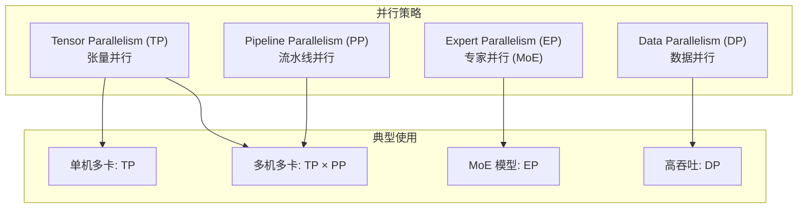
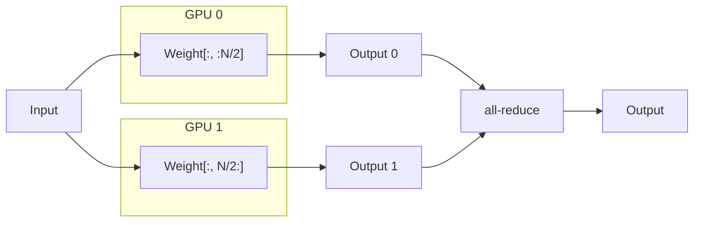
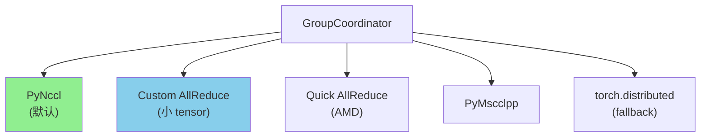
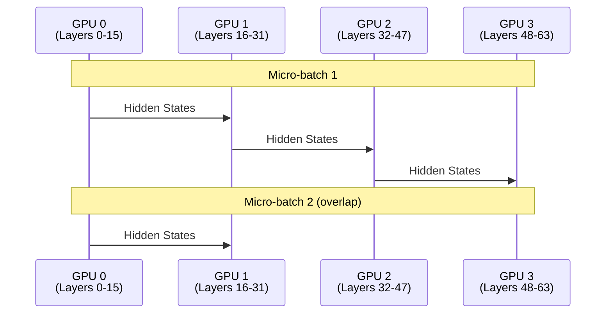
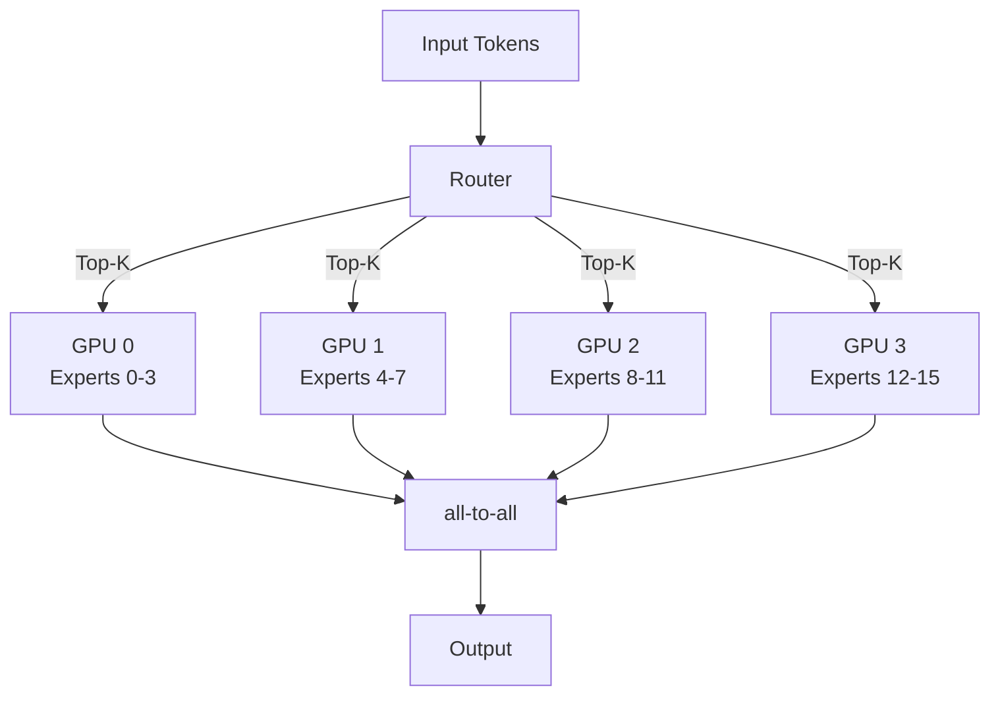
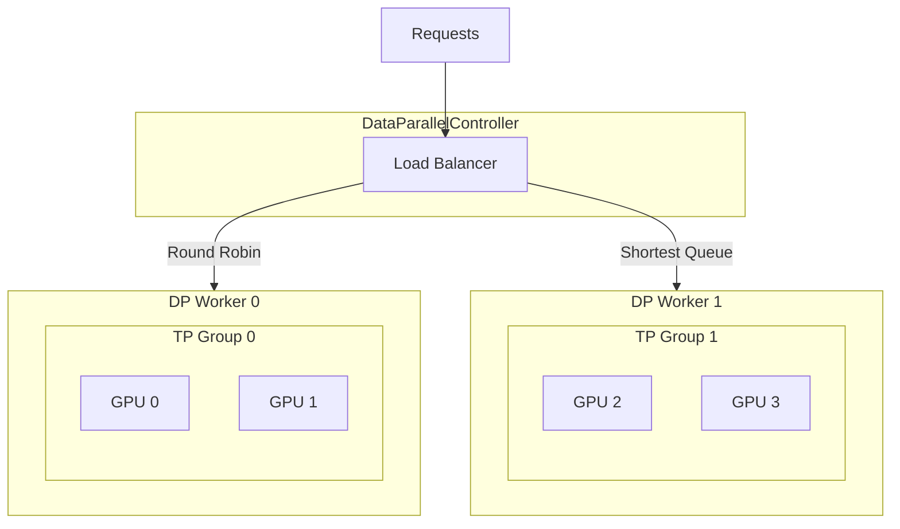
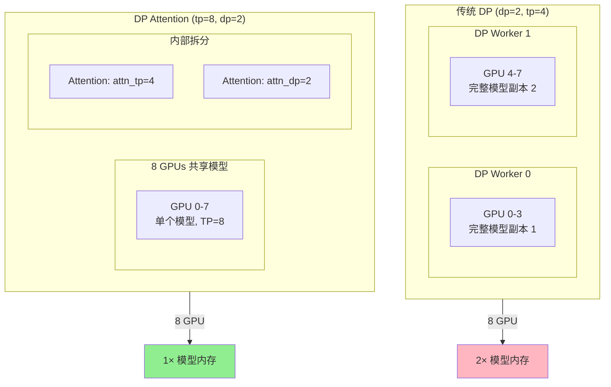
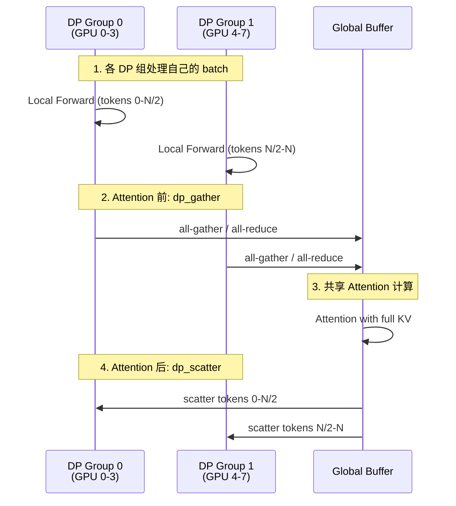
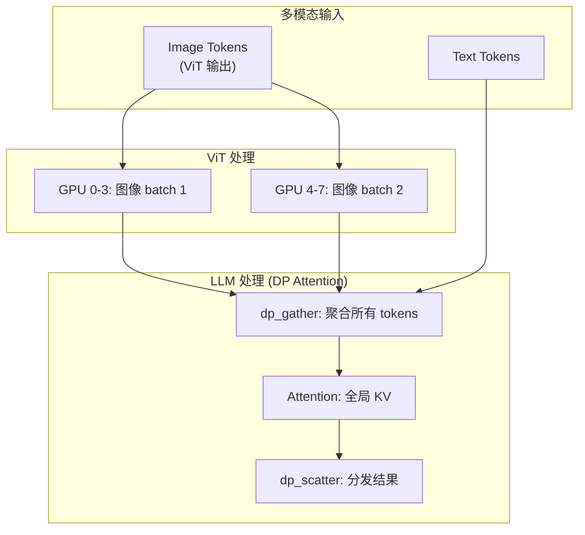

# SGLang 并行策略详解

> **默认场景**: Qwen/Qwen3-VL-235B-A22B-Thinking 多模态模型
>
> **启用特性**: PD 分离 + Chunked Prefill + ViT DP + Overlap Schedule + 多模态缓存

## 1. 概览

SGLang 支持多种并行策略来扩展大型模型的推理能力：



| 策略 | 缩写 | 切分维度 | 适用场景 | 通信操作 |
|------|------|----------|----------|----------|
| **Tensor Parallelism** | TP | 模型权重 | 单机多卡 | all-reduce |
| **Pipeline Parallelism** | PP | 模型层 | 跨节点 | P2P send/recv |
| **Expert Parallelism** | EP | MoE 专家 | MoE 模型 | all-to-all |
| **Data Parallelism** | DP | Batch | 高吞吐 | 无 (独立) |

**核心文件**:
- `srt/distributed/parallel_state.py` - 进程组管理 (约 1900 行)
- `srt/layers/model_parallel.py` - TP 层实现
- `srt/managers/data_parallel_controller.py` - DP 控制器

## 2. Tensor Parallelism (TP)

### 2.1 工作原理

TP 将模型权重沿特定维度切分到多个 GPU，每个 GPU 持有权重的一部分。



### 2.2 Column Parallel vs Row Parallel

| 方式 | 权重切分 | 输出 | 通信位置 |
|------|----------|------|----------|
| **Column Parallel** | 按列切分 `W[:, :N/TP]` | 拼接 | 层后 (可选) |
| **Row Parallel** | 按行切分 `W[:N/TP, :]` | all-reduce | 层后 (必须) |

```python
# layers/model_parallel.py
class ColwiseParallelSharded(ColwiseParallel):
    """列并行: 权重按第0维切分"""
    def _partition_linear_fn(self, name, module, device_mesh):
        for name, param in module.named_parameters():
            dtensor = dt.DTensor.from_local(param, device_mesh, [dt.Shard(0)])
            dist_param = torch.nn.Parameter(dtensor, requires_grad=False)
            module.register_parameter(name, dist_param)

class RowwiseParallelMaybeWait(RowwiseParallel):
    """行并行: 权重按第1维切分"""
    def _partition_linear_fn(self, name, module, device_mesh):
        module.register_parameter(
            "weight",
            nn.Parameter(_shard_tensor(module.weight, device_mesh, [dt.Shard(1)])),
        )
```

### 2.3 典型切分策略 (Qwen3 为例)

| 层 | 切分方式 | 原因 |
|----|----------|------|
| **QKV Projection** | Column | 输出可独立 |
| **Attention Output** | Row | 需要 all-reduce |
| **Gate/Up Projection** | Column | FFN 第一层 |
| **Down Projection** | Row | FFN 第二层 |
| **Embedding** | Row (vocab) | 词表并行 |
| **LM Head** | Column | 词表并行 |

### 2.4 进程组初始化

```python
# parallel_state.py:1573
def initialize_model_parallel(
    tensor_model_parallel_size: int = 1,
    expert_model_parallel_size: int = 1,
    pipeline_model_parallel_size: int = 1,
    ...
):
    """
    例: 8 GPU, TP=2, PP=4
    
    TP Groups: [g0,g1], [g2,g3], [g4,g5], [g6,g7]
    PP Groups: [g0,g2,g4,g6], [g1,g3,g5,g7]
    """
    # 创建 TP 组
    num_tp_groups = world_size // tensor_model_parallel_size
    for i in range(num_tp_groups):
        ranks = list(range(i * tp_size, (i + 1) * tp_size))
        group_ranks.append(ranks)
    
    _TP = init_model_parallel_group(group_ranks, ...)
```

## 3. GroupCoordinator (通信抽象)

**文件**: `parallel_state.py:213`

`GroupCoordinator` 是 SGLang 的核心通信抽象，封装了多种后端。

### 3.1 支持的通信后端



### 3.2 all-reduce 路由

```python
def all_reduce(self, input_: torch.Tensor) -> torch.Tensor:
    if self.world_size == 1:
        return input_  # 单卡直接返回
    
    # 选择最优实现
    if self.ca_comm and self.ca_comm.should_custom_ar(input_):
        return self.ca_comm.custom_all_reduce(input_)  # 小 tensor 优化
    elif self.qr_comm and self.qr_comm.should_quick_allreduce(input_):
        return self.qr_comm.quick_all_reduce(input_)   # AMD 优化
    elif self.torch_symm_mem_comm:
        return self.torch_symm_mem_comm.all_reduce(input_)
    else:
        torch.distributed.all_reduce(input_, group=self.device_group)
        return input_
```

### 3.3 CUDA Graph 兼容

| 后端 | Eager 模式 | Graph 模式 |
|------|:----------:|:----------:|
| Quick AllReduce | ✓ | ✓ |
| Custom AllReduce | ✓ | ✓ |
| PyNccl | ✗ | ✓ |
| PyMscclpp | ✗ | ✓ |
| torch.distributed | ✓ | ✗ |

## 4. Pipeline Parallelism (PP)

### 4.1 工作原理

PP 将模型按层划分到不同设备，数据在设备间流水线传递。



### 4.2 关键参数

```bash
# 启动 PP
python -m sglang.launch_server --model-path ... \
    --tp 2 --pp 2  # 4 GPU: 2x2 配置
```

### 4.3 P2P 通信

```python
# GroupCoordinator 中的 P2P 方法
def send_tensor_dict(self, tensor_dict, dst=None, async_send=True):
    """发送 tensor 字典到下一阶段"""
    metadata_list, tensor_list = _split_tensor_dict(tensor_dict)
    self.send_object(metadata_list, dst=dst, async_send=async_send)
    for tensor in tensor_list:
        torch.distributed.isend(tensor, self.ranks[dst], group=self.device_group)

def recv_tensor_dict(self, src=None):
    """从上一阶段接收 tensor 字典"""
    recv_metadata_list = self.recv_object(src=src)
    for key, value in recv_metadata_list:
        if isinstance(value, TensorMetadata):
            tensor = torch.empty(value.size, dtype=value.dtype)
            torch.distributed.irecv(tensor, src=self.ranks[src])
            tensor_dict[key] = tensor
```

## 5. Expert Parallelism (EP)

### 5.1 MoE 模型并行

EP 将 MoE 层的不同专家分配到不同 GPU。



### 5.2 EP 组初始化

```python
# parallel_state.py:1659
moe_ep_size = expert_model_parallel_size
moe_tp_size = tensor_model_parallel_size // moe_ep_size

if moe_ep_size == tensor_model_parallel_size:
    _MOE_EP = _TP  # EP 组与 TP 组相同
else:
    # 创建独立的 EP 组
    for i in range(num_tp_groups):
        for j in range(moe_tp_size):
            st = i * tp_size + j
            en = (i + 1) * tp_size + j
            ranks = list(range(st, en, moe_tp_size))
            group_ranks.append(ranks)
    _MOE_EP = init_model_parallel_group(group_ranks, ...)
```

### 5.3 Qwen3-VL-235B-A22B EP 配置

Qwen3-VL-235B-A22B 是 MoE 模型：
- 总专家数: 128
- 激活专家: 22 (Top-K=8)
- 推荐配置: EP=8 (每 GPU 16 专家)

## 6. Data Parallelism (DP)

### 6.1 工作原理

DP 将请求分发到多个独立的模型副本。



### 6.2 负载均衡策略

**文件**: `data_parallel_controller.py:69`

```python
class LoadBalanceMethod(Enum):
    ROUND_ROBIN = auto()        # 轮询 (默认)
    DECODE_ROUND_ROBIN = auto() # Decode 阶段轮询
    SHORTEST_QUEUE = auto()     # 最短队列
    MINIMUM_TOKENS = auto()     # 最少 token 数
```

### 6.3 启动 DP

```bash
# 4 GPU, DP=2 (每个 DP worker 使用 TP=2)
python -m sglang.launch_server --model-path ... \
    --dp 2 --tp 2

# 负载均衡方式
--load-balance-method round_robin
--load-balance-method shortest_queue
```

## 7. DP Attention (Data Parallel Attention)

**文件**: `srt/layers/dp_attention.py` (573 行)

DP Attention 是 SGLang 的高级优化技术，将 TP 组拆分为 Attention TP + Attention DP，在保持模型并行的同时提升吞吐。

### 7.1 传统 DP vs DP Attention



| 特性 | 传统 DP | DP Attention |
|------|---------|--------------|
| 模型副本 | 多份 | 单份 |
| KV Cache | 独立 | 共享 |
| 内存效率 | 低 | 高 |
| 通信开销 | 无 | all-gather/all-reduce |

### 7.2 核心原理

```python
# dp_attention.py:227
def compute_dp_attention_world_info(enable_dp_attention, tp_rank, tp_size, dp_size):
    """
    将 TP 组拆分为 Attention TP 和 Attention DP
    
    例: tp_size=8, dp_size=2
    - attn_tp_size = 8 // 2 = 4  (每个 DP 组的 TP 大小)
    - attn_dp_rank = tp_rank // 4 (DP 组编号)
    - attn_tp_rank = tp_rank % 4  (组内 TP rank)
    """
    attn_tp_size = tp_size // dp_size
    attn_dp_rank = tp_rank // attn_tp_size
    attn_tp_rank = tp_rank % attn_tp_size
    return attn_tp_rank, attn_tp_size, attn_dp_rank
```

### 7.3 数据流



### 7.4 Padding 模式

```python
# dp_attention.py:47
class DpPaddingMode(IntEnum):
    MAX_LEN = auto()  # Padding 到最大长度, 用 all_gather
    SUM_LEN = auto()  # Padding 到总长度, 用 all_reduce

    @classmethod
    def get_dp_padding_mode(cls, is_extend_in_batch, global_num_tokens):
        if is_extend_in_batch:
            return DpPaddingMode.SUM_LEN
        
        # 选择通信开销最小的模式
        max_len = max(global_num_tokens)
        sum_len = sum(global_num_tokens)
        if sum_len * 2 > max_len * dp_size:
            return cls.MAX_LEN  # all-gather 更优
        else:
            return cls.SUM_LEN  # all-reduce 更优
```

### 7.5 ViT DP (多模态场景)

对于 Qwen3-VL 等多模态模型，ViT 处理可以使用 DP Attention 优化：



**启用 ViT DP**:
```bash
python -m sglang.launch_server \
    --model-path Qwen/Qwen3-VL-235B-A22B-Thinking \
    --tp 8 \
    --dp 2 \
    --enable-dp-attention
```

### 7.6 关键函数

| 函数 | 作用 |
|------|------|
| `dp_gather_partial` | 收集部分结果 (Attention 输入) |
| `dp_gather_replicate` | 收集并复制到所有 rank |
| `dp_scatter` | 分发结果到各 DP rank |
| `get_attention_tp_group` | 获取 Attention 专用 TP 组 |
| `get_attention_dp_rank/size` | 获取 DP rank/size |

### 7.7 适用场景

| 场景 | 是否推荐 | 原因 |
|------|:--------:|------|
| MoE 模型 + 高吞吐 | ✓ | 共享 KV, 减少内存 |
| 多模态 (VL) | ✓ | ViT 可 DP 并行 |
| 小模型 + 低延迟 | ✗ | 通信开销不划算 |
| 单请求场景 | ✗ | 无法利用 DP |


## 8. PD-Multiplexing (Prefill-Decode 复用)

### 8.1 概念

PD-Multiplexing 是一种在**同一组 GPU** 上同时处理 Prefill 和 Decode 请求的并行策略。与 PD 分离 (Disaggregation) 不同，PD-Multiplexing 不需要将 Prefill 和 Decode 部署到不同的 GPU 集群，而是通过**动态切换 TP Group** 和 **CUDA Stream 隔离** 在同一组 GPU 上交替执行两种工作负载。

**核心思路**: 利用 Decode 阶段 GPU 利用率低的特点，在 Decode 间隙分出 SM 执行 Prefill。

### 8.2 动态 TP Group 切换

**文件**: `parallel_state.py` L1414-1432

```python
# duplicate GroupCoordinator for prefill in PD-Multiplexing
_PDMUX_PREFILL_TP_GROUP: Optional[GroupCoordinator] = None
_ENABLE_PDMUX_P_TP: bool = False

def set_pdmux_status(enable_prefill_multiplexing: bool):
    global _ENABLE_PDMUX_P_TP
    _ENABLE_PDMUX_P_TP = enable_prefill_multiplexing

def get_tp_group() -> GroupCoordinator:
    if _ENABLE_PDMUX_P_TP:
        assert _PDMUX_PREFILL_TP_GROUP is not None, \
            "tensor model parallel group for PD-Multiplexing Prefill is not initialized"
        return _PDMUX_PREFILL_TP_GROUP
    assert _TP is not None, "tensor model parallel group is not initialized"
    return _TP
```

**关键机制**: `get_tp_group()` 根据 `_ENABLE_PDMUX_P_TP` 全局标记动态返回不同的 TP Group。当执行 Prefill 时切换到 `_PDMUX_PREFILL_TP_GROUP`，执行 Decode 时使用默认的 `_TP`。

### 8.3 调度循环

**文件**: `multiplex/multiplexing_mixin.py`

PD-Multiplexing 使用独立的 CUDA Stream 分别执行 Prefill 和 Decode：

```python
# multiplexing_mixin.py (简化)
while True:
    with torch.cuda.stream(decode_stream):
        set_pdmux_status(False)          # Decode 使用默认 TP Group
        recv_reqs = self.recv_requests()
        self.process_input_requests(recv_reqs)

    with torch.cuda.stream(prefill_stream):
        set_pdmux_status(True)           # Prefill 使用专用 TP Group
        # 执行 split prefill...

    with torch.cuda.stream(decode_stream):
        set_pdmux_status(False)
        self.running_batch = self.update_running_batch(self.running_batch)
        # 执行 decode forward...

    with torch.cuda.stream(prefill_stream):
        set_pdmux_status(True)
        # 继续 prefill forward...
```

配合 `ForwardMode.SPLIT_PREFILL` 使用，该模式在 `forward_batch_info.py` 中定义，被视为 extend 的一种变体。

### 8.4 约束条件

```python
# server_args.py 中的限制
assert pp_size == 1,      "PD-Multiplexing 不支持 Pipeline Parallelism"
assert not chunked_prefill, "PD-Multiplexing 与 Chunked Prefill 不兼容"
assert not disaggregation,  "PD-Multiplexing 与 PD 分离不兼容"
assert not overlap_schedule, "PD-Multiplexing 与 Overlap Schedule 不兼容"
```

### 8.5 启用方式

```bash
python -m sglang.launch_server \
    --model-path Qwen/Qwen3-VL-235B-A22B-Thinking \
    --tp 8 \
    --enable-pdmux \
    --pdmux-config-path pdmux_config.json
```

## 9. 配置建议

### 9.1 单机多卡

| GPU 数量 | 推荐配置 | 说明 |
|---------|----------|------|
| 2 | TP=2 | 标准 TP |
| 4 | TP=4 或 DP=2,TP=2 | 大模型用 TP，高吞吐用 DP |
| 8 | TP=8 或 DP=2,TP=4 | 根据模型大小选择 |

### 9.2 多机多卡

| 配置 | 场景 |
|------|------|
| TP=8, PP=2 | 16 GPU 跨 2 节点 |
| DP=2, TP=8 | 16 GPU，2 个独立副本 |

### 9.3 MoE 模型

```bash
# Qwen3-VL-235B-A22B (MoE) 推荐配置
python -m sglang.launch_server --model-path Qwen/Qwen3-VL-235B-A22B-Thinking \
    --tp 8 \
    --ep 8  # 或自动推断
```

## 10. 调试技巧

### 10.1 查看进程组

```python
from sglang.srt.distributed.parallel_state import (
    get_tensor_model_parallel_world_size,
    get_tensor_model_parallel_rank,
    get_pipeline_model_parallel_world_size,
    get_pipeline_model_parallel_rank,
)

print(f"TP size: {get_tensor_model_parallel_world_size()}")
print(f"TP rank: {get_tensor_model_parallel_rank()}")
print(f"PP size: {get_pipeline_model_parallel_world_size()}")
print(f"PP rank: {get_pipeline_model_parallel_rank()}")
```

### 10.2 通信调试

```bash
# 启用 NCCL 调试
export NCCL_DEBUG=INFO
export NCCL_DEBUG_SUBSYS=ALL

# 使用 torch.distributed 后端 (更易调试)
export SGLANG_USE_PYNCCL=0
```

## 11. 下一步

- **14**: PD 分离 (Prefill-Decode Disaggregation)
- **15**: sgl-kernel 架构
