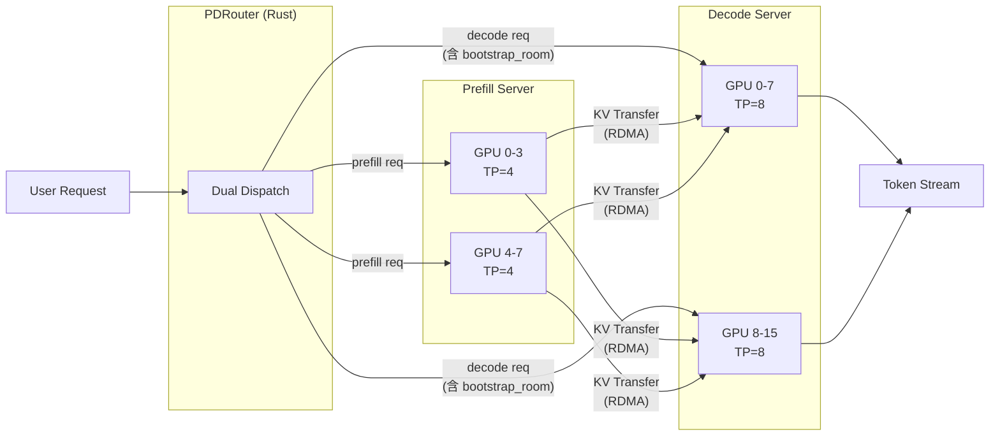
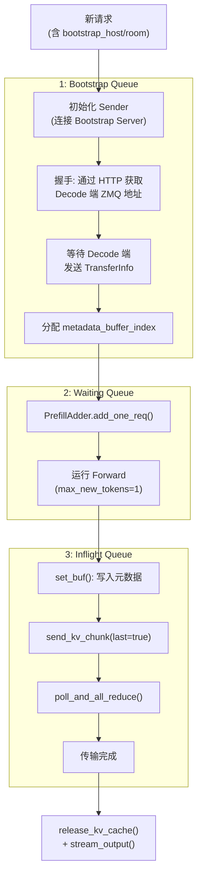
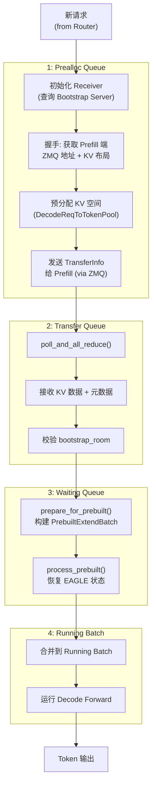
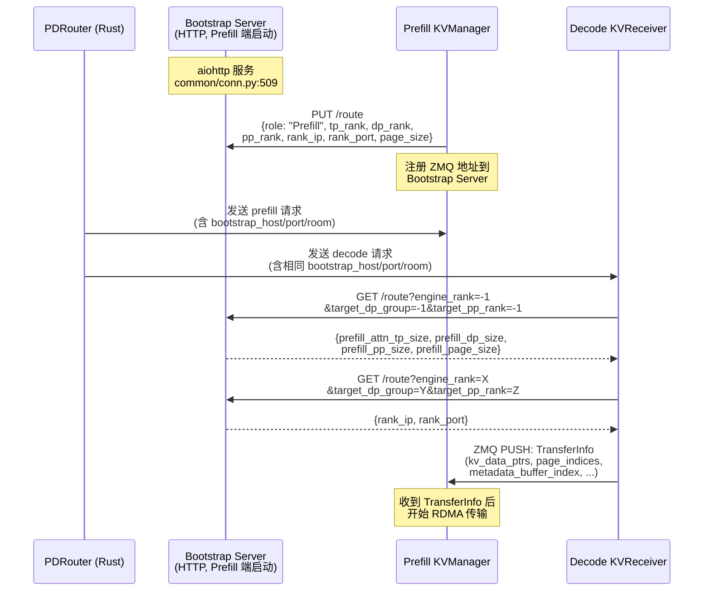
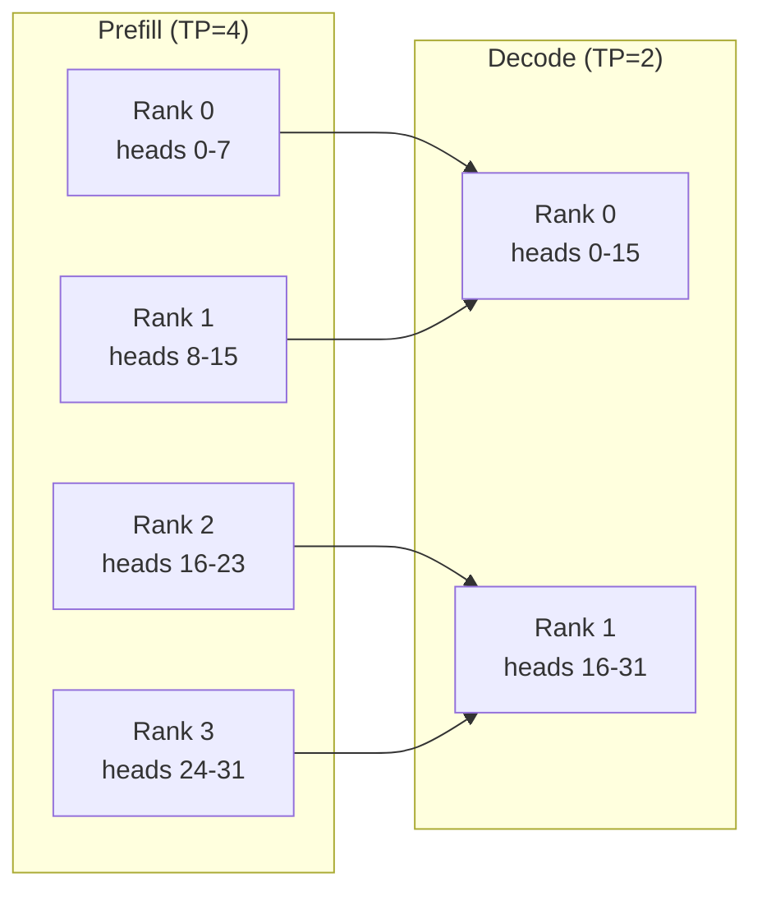
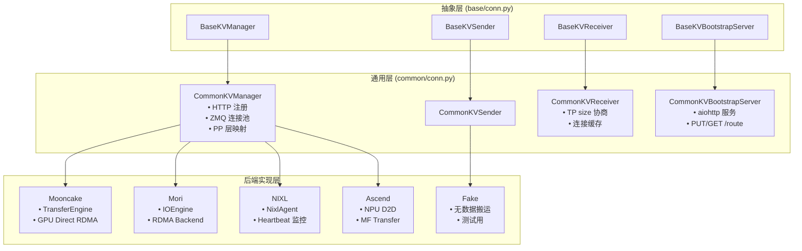
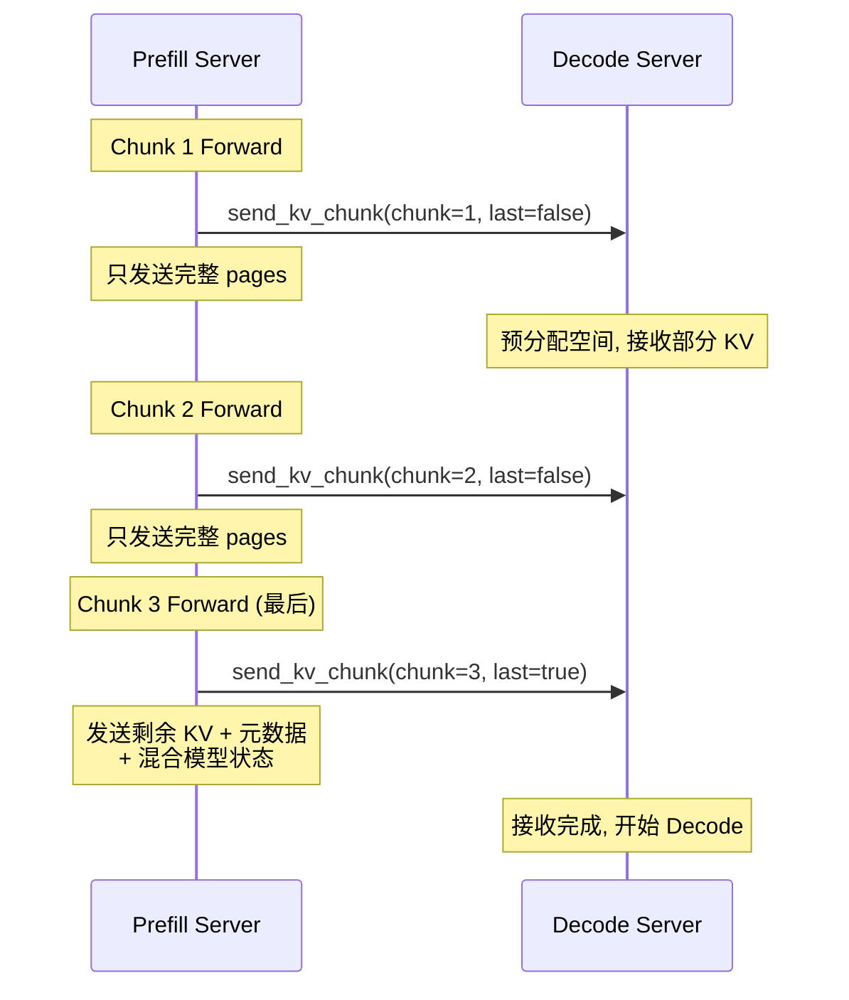

# SGLang PD 分离 (Prefill-Decode Disaggregation)

> **默认场景**: Qwen3.5 混合架构模型（Full Attention + Linear Attention/GatedDeltaNet + MoE + MTP）
>
> **启用特性**: PD 分离 + Chunked Prefill + ViT DP + Overlap Schedule + 多模态缓存 + EPLB + MTP + 线性注意力

## 1. 概览

PD 分离将 Prefill 和 Decode 阶段部署到不同的 GPU 集群，实现资源独立扩展。外部 Router 将同一请求同时发给 Prefill 和 Decode，Prefill 完成后通过 RDMA 将 KV Cache 传输给 Decode。



### 1.1 为什么需要 PD 分离?

| 特性 | Prefill | Decode | 分离优势 |
|------|---------|--------|----------|
| 计算模式 | Compute-bound | Memory-bound | 独立优化硬件配置 |
| Batch 大小 | 小 (长序列) | 大 (多并发) | 资源独立扩展 |
| 内存需求 | 临时 KV (用完即传) | 持久 KV (整个生成周期) | 内存隔离 |
| 延迟敏感度 | TTFT (首 token 延迟) | TPOT (每 token 延迟) | 服务质量独立保证 |

### 1.2 核心文件

| 文件/目录 | 说明 | 行数 |
|-----------|------|------|
| `disaggregation/prefill.py` | Prefill 服务器逻辑 (Bootstrap/Inflight Queue, 事件循环) | 750 |
| `disaggregation/decode.py` | Decode 服务器逻辑 (Prealloc/Transfer Queue, DecodeReqToTokenPool) | 1092 |
| `disaggregation/utils.py` | TransferBackend 枚举、MetadataBuffers、poll_and_all_reduce | 398 |
| `disaggregation/base/conn.py` | KVArgs, KVPoll, 抽象基类 (BaseKVManager/Sender/Receiver) | 162 |
| `disaggregation/common/conn.py` | CommonKVBootstrapServer (HTTP), CommonKVManager/Sender/Receiver (ZMQ) | 666 |
| `disaggregation/decode_schedule_batch_mixin.py` | prepare_for_prebuilt, process_prebuilt (EAGLE 集成) | 185 |
| `disaggregation/kv_events.py` | KV 事件发布/订阅系统 | 426 |
| `disaggregation/mooncake/` | Mooncake 后端 (RDMA/GPU Direct) | - |
| `disaggregation/mori/` | Mori 后端 (RDMA, IOEngine) | - |
| `disaggregation/nixl/` | NIXL 后端 (NVIDIA RDMA) | - |
| `disaggregation/ascend/` | 华为昇腾 NPU KV 传输后端 | - |
| `disaggregation/fake/` | 测试用假传输后端 (无实际数据搬运) | - |

## 2. 请求生命周期

### 2.1 Prefill 服务器



**关键细节**:
- `max_new_tokens` 被强制设为 1 (`prefill.py:_process_req`)，因为 Prefill 只需生成第一个 token
- Forward 完成后，EAGLE 投机解码的 `topk_p`/`topk_index`/`hidden_states` 也会被保存到 `req` 上
- `set_buf()` 将第一个 output token、logprobs、EAGLE 数据、`bootstrap_room` 写入 MetadataBuffers
- 传输完成后 `release_kv_cache()` 解锁 Radix Tree 节点

### 2.2 Decode 服务器



**关键细节**:
- Decode 端收到请求后，先通过 HTTP Bootstrap Server 获取 Prefill 端的并行信息 (TP/DP/PP size)
- 然后通过 ZMQ PUSH 将自己的 KV 指针 (TransferInfo) 发送给 Prefill 端
- `prepare_for_prebuilt()` 跳过 Prefill Forward，直接用传输过来的 KV 构建 batch
- `process_prebuilt()` 恢复 EAGLE 投机解码状态 (如果启用)

## 3. Bootstrap 握手机制

Bootstrap 是 Prefill 和 Decode 发现彼此并建立连接的过程。这是文档中最关键的缺失部分。

### 3.1 架构总览



### 3.2 bootstrap_room 的作用

`bootstrap_room` 是每个请求的唯一会合 ID，由外部 Router 生成并注入到请求中。

```
Router 注入流程 (sgl-model-gateway/src/routers/http/pd_router.rs):
  inject_bootstrap_into_value() → 在请求 JSON 中注入:
    • bootstrap_host: Prefill 端 Bootstrap Server 地址
    • bootstrap_port: Bootstrap Server 端口 (默认 8998)
    • bootstrap_room: 唯一 ID (用于 Prefill/Decode 配对)
```

**为什么需要 bootstrap_room**:
1. 同一 Prefill 服务器可能同时处理多个请求，需要区分哪个 KV 传输对应哪个请求
2. 在 MetadataBuffers 中存储 `bootstrap_room` 用于数据完整性校验 — Decode 端收到元数据后验证 `bootstrap_room` 是否匹配
3. 用于 DP rank 选择: `prefill_dp_rank = bootstrap_room % prefill_dp_size`

### 3.3 Bootstrap Server 实现

`CommonKVBootstrapServer` (`common/conn.py:509`) 是一个 aiohttp 服务，在 Prefill 端启动:

```python
# 路由表
PUT /route   → Prefill rank 注册自己的 ZMQ 地址
GET /route   → Decode 查询 Prefill rank 的 ZMQ 地址
GET /health  → 健康检查

# 内部数据结构
prefill_port_table: Dict[dp_group, Dict[tp_rank, Dict[pp_rank, {rank_ip, rank_port}]]]
```

**连接建立流程**:
1. Prefill 端每个 rank 启动时，通过 `_register_to_bootstrap()` 向 Bootstrap Server 注册
2. Decode 端首次连接时，先查询 Prefill 的并行配置 (TP/DP/PP size)，验证 page_size 一致性
3. 然后按 `(target_dp_group, target_tp_rank, target_pp_rank)` 查询具体 rank 的 ZMQ 地址
4. 建立 ZMQ PUSH/PULL 连接，后续通过 ZMQ 发送 TransferInfo

### 3.4 Router 选择策略

PDRouter (`sgl-model-gateway/src/routers/http/pd_router.rs`) 支持多种路由策略:

| 策略 | 说明 |
|------|------|
| Random | 随机选择 Prefill/Decode 实例 |
| PowerOfTwo | 随机选两个，取负载较低的 |
| CacheAware | 考虑前缀缓存命中率 |
| Bucket | 按请求特征分桶 |

## 4. KV 传输机制

### 4.1 传输后端

```python
# disaggregation/utils.py:247
class TransferBackend(Enum):
    MOONCAKE = "mooncake"   # 字节跳动, RDMA/GPU Direct
    MORI = "mori"           # Mori RDMA (IOEngine)
    NIXL = "nixl"           # NVIDIA RDMA/GPU Direct
    ASCEND = "ascend"       # 华为昇腾 NPU
    FAKE = "fake"           # 测试用, 无实际数据搬运
```

### 4.2 KV 数据结构

`KVArgs` (`base/conn.py:15-42`) 包含传输所需的全部元信息:

```python
class KVArgs:
    # === KV 数据指针 ===
    engine_rank: int              # 当前 rank
    kv_data_ptrs: List[int]       # KV buffer GPU 指针 (每层 K/V)
    kv_data_lens: List[int]       # 每层数据总长度
    kv_item_lens: List[int]       # 每个 token 的 KV 大小

    # === 元数据 (MetadataBuffers) ===
    aux_data_ptrs: List[int]      # 元数据 buffer 指针
    aux_data_lens: List[int]      # 元数据总长度
    aux_item_lens: List[int]      # 每个请求的元数据大小

    # === 混合模型状态 (Mamba/SWA/NSA) ===
    state_data_ptrs: List[int]    # 状态 buffer 指针
    state_data_lens: List[int]    # 状态总长度
    state_item_lens: List[int]    # 每个状态项大小
    state_type: str               # "none" / "mamba" / "swa" / "nsa"
    state_dim_per_tensor: List[int]  # 跨 TP 切片维度

    # === 网络配置 ===
    ib_device: str                # IB 设备名
    ib_traffic_class: str         # IB 流量类别
    gpu_id: int                   # GPU ID

    # === TP/PP 配置 ===
    decode_tp_size: int           # Decode 端 TP size
    kv_head_num: int              # KV head 数量
    page_size: int                # KV page 大小
    prefill_pp_size: int          # Prefill 端 PP size
    pp_rank: int                  # 当前 PP rank
    prefill_start_layer: int      # PP 起始层号

    # === DP 配置 ===
    system_dp_rank: int           # System DP rank
```

### 4.3 MetadataBuffers 详细结构

`MetadataBuffers` (`utils.py:84`) 存储 Prefill 端第一个 output token 的元数据，通过 RDMA 传输给 Decode 端:

| Buffer | Shape | Dtype | 用途 |
|--------|-------|-------|------|
| `output_ids` | (size, 16) | int32 | 第一个 output token ID |
| `cached_tokens` | (size, 16) | int32 | 缓存 token 数 |
| `output_token_logprobs_val` | (size, 16) | float32 | token logprob 值 |
| `output_token_logprobs_idx` | (size, 16) | int32 | token logprob 索引 |
| `output_top_logprobs_val` | (size, 128) | float32 | top logprobs 值 |
| `output_top_logprobs_idx` | (size, 128) | int32 | top logprobs 索引 |
| `output_topk_p` | (size, 16) | float32 | EAGLE topk 概率 |
| `output_topk_index` | (size, 16) | int64 | EAGLE topk 索引 |
| `output_hidden_states` | (size, hidden_size) | model dtype | EAGLE hidden states |
| `bootstrap_room` | (size, 8) | uint64 | 请求校验 ID |

> **RDMA 对齐**: 最小 64 字节。所有 buffer 的 shape 都设计为 ≥ 64 字节 (如 `output_ids` 为 16×4=64 字节)。

### 4.4 Chunked KV 传输

支持 Chunked Prefill 场景下的分块 KV 传输 (`prefill.py:send_kv_chunk`):

```python
def send_kv_chunk(self, req, last_chunk=False, end_idx=None):
    page_size = self.token_to_kv_pool_allocator.page_size
    start_idx = req.start_send_idx
    end_idx = end_idx or min(len(req.fill_ids), len(req.origin_input_ids))

    if not last_chunk:
        # 非最后块: 截断到 page 边界, 只发送完整 pages
        end_idx = end_idx - end_idx % page_size

    kv_indices = self.req_to_token_pool.req_to_token[
        req.req_pool_idx, start_idx:end_idx
    ].cpu().numpy()

    if last_chunk:
        self.disagg_metadata_buffers.set_buf(req)  # 写入元数据
        # 准备混合模型状态索引 (Mamba/SWA/NSA)
        state_indices = self._prepare_state_indices(req)

    page_indices = kv_to_page_indices(kv_indices, page_size)
    req.disagg_kv_sender.send(page_indices, state_indices)
```

**为什么非最后块只发送完整 pages**: RDMA 传输以 page 为单位，部分 page 的数据在下一个 chunk 可能还会被修改 (attention 计算尚未完成)。等到最后一个 chunk 时，所有数据都已确定，才发送剩余的部分 page + 元数据。

### 4.5 M:N TP Size KV Slice 传输

当 Prefill 和 Decode 使用不同的 TP size 时，KV cache 的 head 维度需要重新映射。

**场景示例**: `prefill_tp_size=4, decode_tp_size=2`



| 配置 | 行为 | 通信模式 |
|------|------|----------|
| `prefill_tp > decode_tp` | 多个 prefill rank 聚合到一个 decode rank | N:1 聚合 |
| `prefill_tp < decode_tp` | 一个 prefill rank 拆分到多个 decode rank | 1:N 拆分 |
| `prefill_tp == decode_tp` | 1:1 直接传输 | 1:1 对应 |

**为什么需要支持 M:N TP size**: Prefill 是 compute-bound，较小的 TP 即可满足吞吐需求；Decode 是 memory-bound，需要更大的 TP 来分摊 KV Cache 内存。允许不同 TP size 使两端可以独立优化硬件配置。

> **MLA 优化**: 对于 MLA 模型 (如 DeepSeek)，KV Cache 是压缩的 latent 表示，不需要按 head 切分，因此 M:N TP 传输只需从一个 prefill rank 获取即可，其他 rank 发送 dummy 请求。

## 5. 内存管理

### 5.1 DecodeReqToTokenPool (Decode 端)

Decode 端使用专用的 `DecodeReqToTokenPool` (`decode.py:76`) 而非普通 `ReqToTokenPool`。

```python
class DecodeReqToTokenPool:
    """
    普通 ReqToTokenPool:
      #prealloc + #transfer + #running <= max_running_requests

    DecodeReqToTokenPool:
      #running <= max_running_requests
      #prealloc + #transfer <= pre_alloc_size (额外空间)
    """
    def __init__(self, size, max_context_len, device, enable_memory_saver, pre_alloc_size):
        self.req_to_token = torch.zeros(
            (size + pre_alloc_size, max_context_len), dtype=torch.int32, device=device
        )
        self.free_slots = list(range(size + pre_alloc_size))
```

**为什么需要 DecodeReqToTokenPool**: 在普通 `ReqToTokenPool` 中，预分配中的请求会占用 `max_running_requests` 的配额，导致 Prefill 端被阻塞 (因为 Decode 端没有空间接收新的 KV)。`DecodeReqToTokenPool` 将预分配空间独立出来，利用空闲 GPU 内存为更多请求预分配 KV 空间，从而解阻塞 Prefill 端。

### 5.2 内存估算

```python
# decode.py:_allocatable_tokens
def _allocatable_tokens(self):
    """
    计算可分配的 token 数

    需预留:
    1. 每个 running/transfer/waiting 请求的 decode 空间 (reserved_decode_tokens)
    2. 确保任一请求 retract 后能完成 (max_single_request_need)
    """
    available_size = self.token_to_kv_pool_allocator.available_size()

    allocatable = available_size - max(
        reserved_decode_tokens * (running + transfer + waiting),
        max_single_request_need - retractable_tokens,
    )
    return allocatable
```

### 5.3 Decode 端 Radix Cache 强制禁用

```python
# server_args.py:2546 (_handle_pd_disaggregation)
if self.disaggregation_mode == "decode":
    self.disable_radix_cache = True
```

**为什么禁用**: Decode 端的 KV Cache 全部从 Prefill 端传输而来，不存在本地计算产生的前缀可复用。Radix Cache 的前缀匹配逻辑在此场景下无意义，反而增加开销。

### 5.4 Prefill 端 CUDA Graph 限制

```python
# server_args.py:2567
if not self.enable_piecewise_cuda_graph:
    self.disable_cuda_graph = True
```

**为什么限制**: Prefill 的输入长度变化大 (从几十到几万 token)，普通 CUDA Graph 要求固定 shape，无法适应。只有 piecewise CUDA Graph (将计算拆分为多个固定 shape 的子图) 才能在 Prefill 场景下使用。

## 6. 传输后端详解

### 6.1 架构层次



### 6.2 Mooncake

字节跳动开源的高性能 P2P 传输库。

- 基于 RDMA (RoCE/IB) + GPU Direct RDMA
- 支持 `send_kvcache_slice()` 实现 M:N TP 传输
- 支持自定义内存池 (`custom_mem_pool`) 和 NVLink 传输
- 适合跨节点传输

### 6.3 Mori

基于 `mori.io.IOEngine` 的 RDMA 传输后端。

- 使用 `EngineDesc` + `MemoryDesc` 描述传输端点
- 支持 `group_concurrent_contiguous()` 合并连续内存区域减少 RDMA 操作数
- 通过 `msgspec` 序列化 TransferInfo
- 消息完整性校验: `MORI_GUARD = b"MoriMsgGuard"`

### 6.4 NIXL (NVIDIA)

NVIDIA 的独立 KV Cache 传输协议，**不基于 NCCL**。

- 独立的 KV Cache 点对点 RDMA 传输协议
- 使用 `NixlAgent` 管理传输
- 内置 Heartbeat 监控机制，检测对端存活
- 专为 disaggregated serving 场景设计

> **NIXL vs NCCL**: NCCL 面向集合通信 (all-reduce/all-gather)，NIXL 专注于 KV Cache 的点对点 RDMA 传输。

### 6.5 选择建议

| 场景 | 推荐后端 |
|------|----------|
| 跨节点 + IB 网络 | Mooncake / Mori |
| NVIDIA 硬件 + 需要心跳监控 | NIXL |
| 华为昇腾 NPU | Ascend |
| 调试/测试 | Fake |

## 7. 故障处理与数据校验

### 7.1 传输状态机 (KVPoll)

```python
# base/conn.py:44
class KVPoll:
    Failed = 0          # 失败
    Bootstrapping = 1   # 握手中
    WaitingForInput = 2 # 等待输入
    Transferring = 3    # 传输中
    Success = 4         # 成功
```

> **注意枚举值顺序**: `Failed=0` 是刻意设计，因为 `poll_and_all_reduce` 使用 `MIN` 操作 — 任一 rank 失败 (值为 0) 则 all_reduce 结果为 0，保证所有 rank 一致进入失败处理。

### 7.2 poll_and_all_reduce 同步机制

```python
# utils.py:40
def poll_and_all_reduce(pollers, gloo_group):
    polls = [int(poller.poll()) for poller in pollers]
    tensor_to_reduce = torch.tensor(polls, dtype=torch.uint8, device="cpu")
    dist.all_reduce(tensor_to_reduce, op=dist.ReduceOp.MIN, group=gloo_group)
    return tensor_to_reduce.tolist()
```

**为什么需要 all_reduce**: 在 TP 并行下，每个 rank 独立 poll 自己的传输状态。但所有 rank 必须对 poll 结果达成共识，否则部分 rank 认为传输完成开始 decode，另一部分还在等待，导致集合通信死锁。使用 Gloo group 的 `MIN` 操作保证:
- 任一 rank 失败 → 全部 rank 一致处理失败
- 所有 rank 都成功 → 才进入下一阶段

> **故障注入测试**: 环境变量 `DISAGGREGATION_TEST_FAILURE_PROB` 可设置随机失败概率，用于测试故障处理路径。

### 7.3 bootstrap_room 数据校验

MetadataBuffers 中的 `bootstrap_room` 字段用于端到端数据完整性校验:

```python
# utils.py:237 (set_buf)
self.bootstrap_room[req.metadata_buffer_index, 0] = (
    req.bootstrap_room if req.bootstrap_room is not None else 0
)
```

Decode 端接收到元数据后，验证 `bootstrap_room` 是否与请求匹配，防止元数据错位 (例如 RDMA 传输到了错误的 buffer index)。

### 7.4 Retraction 机制

当 Decode 端 OOM 时，可以 retract 请求并将 KV Cache 卸载到 CPU:

```python
# decode.py:resume_retracted_reqs
def resume_retracted_reqs(self):
    """恢复被 retract 的请求 (OOM 后)"""
    for req in self.retracted_queue:
        if required_tokens <= allocatable_tokens:
            self._pre_alloc(req)
            req.load_kv_cache(...)  # 从 CPU 恢复
```

## 8. 与 Chunked Prefill 集成



**Overlap 模式下的差异**: 当 `enable_overlap=True` 时，非最后 chunk 的 KV 传输被延迟到 `process_batch_result_disagg_prefill` 中执行 (`prefill.py:542-543`)，确保 batch result 已经 resolve 后再发送。

## 9. 与投机解码集成 (EAGLE + PD)

PD 分离支持 EAGLE 投机解码。Prefill 端生成 EAGLE 所需的 draft 输入，通过 MetadataBuffers 传输给 Decode 端。

### 9.1 Prefill 端: 保存 EAGLE 数据

```python
# prefill.py:481-488 (process_batch_result_disagg_prefill)
if self.spec_algorithm.is_eagle() and batch.spec_info is not None:
    req.output_topk_p = batch.spec_info.topk_p[i]
    req.output_topk_index = batch.spec_info.topk_index[i]
    req.hidden_states_tensor = batch.spec_info.hidden_states[i].cpu().clone()
else:
    req.hidden_states_tensor = None
```

这些数据随后通过 `MetadataBuffers.set_buf()` 写入 `output_topk_p`、`output_topk_index`、`output_hidden_states` buffer，与 KV Cache 一起传输。

### 9.2 Decode 端: 重建 EagleDraftInput

```python
# decode_schedule_batch_mixin.py:134 (process_prebuilt)
if self.spec_algorithm.is_eagle():
    topk_p = torch.stack([req.output_topk_p[:num_states] for req in self.reqs])
    topk_index = torch.stack([req.output_topk_index[:num_states] for req in self.reqs])
    hidden_states = torch.stack([req.hidden_states_tensor for req in self.reqs])

    spec_info = EagleDraftInput(
        topk_p=topk_p,
        topk_index=topk_index,
        hidden_states=hidden_states,
        verified_id=self.output_ids,
        new_seq_lens=self.seq_lens,
    )
    spec_info.prepare_for_extend(self)
    self.spec_info = spec_info
```

Decode 端从 MetadataBuffers 中恢复 EAGLE 数据，重建 `EagleDraftInput`，使得后续 decode 步骤可以直接使用投机解码加速。

## 10. 与 Pipeline Parallelism 集成

PD 分离支持 PP (Pipeline Parallelism)，通过 `scheduler_pp_mixin.py` 中的专用事件循环实现。

### 10.1 专用事件循环

| 事件循环 | 文件位置 | 说明 |
|----------|----------|------|
| `event_loop_pp_disagg_prefill` | `scheduler_pp_mixin.py:147` | PP + PD Prefill |
| `event_loop_pp_disagg_decode` | `scheduler_pp_mixin.py:322` | PP + PD Decode |

### 10.2 PP Prefill 调度

PP Prefill 在标准 PP 调度基础上增加了两个额外步骤:

1. **Bootstrap 共识**: PP rank 间通过 `_pp_recv_pyobj_from_prev_stage()` 同步 bootstrap 状态，确保所有 PP stage 对哪些请求已完成 bootstrap 达成一致
2. **Transfer 共识**: 类似地，传输完成的请求 ID 也需要跨 PP rank 同步

```
PP Prefill 每个 microbatch 的调度顺序:
  recv requests → recv bootstrap_rids → recv transferred_rids
  → process_prefill_chunk → get_new_batch_prefill → run_batch
  → consensus on bootstrapped_rids (cross PP ranks)
  → consensus on release_rids (cross PP ranks)
  → process batch result → send to next stage
```

### 10.3 PP 约束

```python
# common/conn.py:379
assert self.kv_mgr.pp_size == self.prefill_pp_size or self.kv_mgr.pp_size == 1
```

Decode 端的 PP size 必须等于 Prefill 端的 PP size 或为 1。当 `decode_pp_size == 1` 时，Decode 端需要从 Prefill 的所有 PP stage 接收 KV Cache。

## 11. PD-Multiplexing (同机 Prefill-Decode 复用)

与 PD 分离 (将 Prefill/Decode 部署到不同 GPU 集群) 不同，PD-Multiplexing 在同一组 GPU 上同时处理两种工作负载。

### 11.1 核心思路

Decode 阶段是 memory-bound，GPU 计算单元 (SM) 利用率低。PD-Multiplexing 利用这一空闲，在 Decode 间隙分出 SM 执行 Prefill 请求。

### 11.2 Green Context 与 SM 分区

核心技术是 CUDA Green Context — 将 GPU 的 SM 划分为独立的分区，每个分区运行在独立的 CUDA Stream 上。

```python
# pdmux_context.py:104
def initialize_stream_groups(gpu_id, config):
    total_sm_count = spatial.get_sm_available(gpu_id)
    divisions = divide_sm(total_sm_count, compute_capability, config.sm_group_num - 2)

    # SM_COUNTS 布局:
    # [0]: (total_sm, 0)          — 纯 Prefill stream
    # [1..N-2]: (prefill_sm, decode_sm) — 混合 stream (Green Context)
    # [N-1]: (0, total_sm)        — 纯 Decode stream
    SM_COUNTS = [(total_sm_count, 0)] + divisions + [(0, total_sm_count)]

    # 对应的 Stream Groups:
    # [0]: 普通 CUDA Stream pair (Prefill only)
    # [1..N-2]: Green Context Stream pair (SM 分区)
    # [N-1]: 普通 CUDA Stream pair (Decode only)
    for prefill_sm, decode_sm in divisions:
        STREAM_GROUPS.append(
            spatial.create_greenctx_stream_by_value(prefill_sm, decode_sm, gpu_id)
        )
```

**架构约束** (`pdmux_context.py:55`):

| GPU 架构 | Compute Capability | min_per_part | multiple |
|----------|-------------------|--------------|----------|
| Pascal (6.x) | 6.x | 1 | 1 |
| Volta (7.x) | 7.x | 2 | 2 |
| Ampere (8.x) | 8.x | 4 | 2 |
| Hopper (9.x) | 9.x | 8 | 8 |

### 11.3 PDMuxConfig

```python
# pdmux_context.py:15
@dataclass
class PDMuxConfig:
    sm_group_num: int = 8                    # SM 分组数 (≥3)
    manual_divisions: List[List[int]] = []   # [prefill_sm, decode_sm, decode_bs_threshold]
    split_forward_token_budget: int = 65536  # 每次 split forward 的 token 预算
    decode_bs_divisor: int = 36              # 自动 SM 分配的 decode batch size 除数
```

通过 YAML 配置文件加载 (`--pdmux-config-path`)。`sm_group_num` 必须 ≥ 3 (至少需要纯 Prefill、一个混合、纯 Decode 三个 group)。

### 11.4 event_loop_pdmux 调度流程

```python
# multiplexing_mixin.py:96
def event_loop_pdmux(self):
    while True:
        # 1. Decode stream: 接收请求, 更新 running batch
        with torch.cuda.stream(decode_stream):
            set_pdmux_status(False)  # 切换到 Decode TP group
            recv_reqs → process_input_requests → update_running_batch

        # 2. Prefill stream: 尝试获取新的 prefill batch
        with torch.cuda.stream(prefill_stream):
            set_pdmux_status(True)   # 切换到 Prefill TP group
            update_split_prefill_batch(sm_count)

        # 3. 动态调整 SM 分区 (根据 decode batch size)
        if adjust_stream_group:
            stream_idx, stream_group = self.adjust_stream_groups()

        # 4. 并行执行: Decode batch + Split Prefill batch
        with torch.cuda.stream(decode_stream):
            decode_result = self.run_batch(self.running_batch)
        with torch.cuda.stream(prefill_stream):
            # 分层执行: 每次只 forward split_forward_count 层
            self.split_prefill_batch.split_forward_count = forward_count
            prefill_result = self.run_batch(self.split_prefill_batch)

        # 5. 处理结果, 合并 batch
        with torch.cuda.stream(decode_stream):
            self.process_batch_result(self.running_batch, decode_result)
        with torch.cuda.stream(prefill_stream):
            if split_prefill_finished:
                self.running_batch.merge_batch(self.split_prefill_batch)
```

**关键机制**:
- `ForwardMode.SPLIT_PREFILL`: 专用 forward 模式，被视为 extend 的变体
- `split_forward_count`: 每次只 forward 若干层 (由 `split_forward_token_budget` 控制)，避免 Prefill 长时间占用 SM
- `set_pdmux_status()`: 动态切换 TP group (`parallel_state.py` 中的 `_PDMUX_PREFILL_TP_GROUP`)
- SM 分区根据 decode batch size 动态调整 — batch 越大，分配给 decode 的 SM 越多

### 11.5 与 PD 分离的对比

| 特性 | PD 分离 (Disaggregation) | PD-Multiplexing |
|------|--------------------------|-----------------|
| GPU 集群 | 分离部署 | 同一组 GPU |
| KV 传输 | 跨节点 RDMA | 无需传输 (本地) |
| 适用场景 | 大规模部署 | 中等规模, 提升 GPU 利用率 |
| 兼容性 | 支持 Chunked Prefill/Overlap | 不兼容 Chunked Prefill/Overlap |
| SM 利用率 | 各自 100% | 动态分区共享 |

### 11.6 启用方式

```bash
python -m sglang.launch_server \
    --model-path Qwen/Qwen3.5-397B-A17B-FP8 \
    --tp 8 \
    --enable-pdmux \
    --pdmux-config-path pdmux_config.json
```

> **互斥约束**: PD-Multiplexing 与 disaggregation mode 互斥 (`server_args.py:5193`)。

## 12. Encode Server 分离

独立的 Encode Server 用于将多模态编码 (如 ViT) 从主推理流程中分离出来。

| 文件 | 说明 |
|------|------|
| `disaggregation/encode_server.py` | Encode 端服务器，独立运行 ViT 编码 |
| `disaggregation/encode_receiver.py` | Encode 端接收器，接收编码结果 |
| `disaggregation/decode_schedule_batch_mixin.py` | Decode 端调度批次 Mixin (prepare_for_prebuilt, process_prebuilt) |

通过 `--encoder-only` 和 `--language-only` 参数启用。Encode Server 处理多模态输入的编码，将结果通过传输后端发送给 Language Server，避免 ViT 编码阻塞 LLM 推理。

## 13. KV 事件管理

**文件**: `disaggregation/kv_events.py` (426 行)

事件发布/订阅系统，用于 PD 分离场景下的 KV Cache 状态同步。

| 类 | 说明 |
|----|------|
| `EventBatch` | 事件批次容器 |
| `KVCacheEvent` | KV Cache 事件基类 |
| `BlockStored` | 块存储完成事件 |
| `BlockRemoved` | 块移除事件 |
| `AllBlocksCleared` | 全部清除事件 |
| `ZmqEventPublisher` | ZMQ 事件发布器 (含 replay buffer，支持新订阅者回放历史事件) |
| `EventPublisherFactory` | 发布器工厂 |

事件系统使 Decode 端能够感知 Prefill 端的 KV Cache 变化，用于 HiCache 等高级缓存策略。

## 14. 启动配置

### 14.1 Prefill 服务器

```bash
python -m sglang.launch_server \
    --model-path Qwen/Qwen3.5-397B-A17B-FP8 \
    --tp 4 \
    --disaggregation-mode prefill \
    --disaggregation-transfer-backend mooncake \
    --disaggregation-bootstrap-port 8998 \
    --disaggregation-decode-tp 8 \
    --port 30000
```

### 14.2 Decode 服务器

```bash
python -m sglang.launch_server \
    --model-path Qwen/Qwen3.5-397B-A17B-FP8 \
    --tp 8 \
    --disaggregation-mode decode \
    --disaggregation-transfer-backend mooncake \
    --port 30001
```

### 14.3 关键参数

| 参数 | 说明 | 默认值 |
|------|------|--------|
| `--disaggregation-mode` | prefill / decode / null | null |
| `--disaggregation-transfer-backend` | mooncake / mori / nixl / ascend / fake | mooncake |
| `--disaggregation-bootstrap-port` | Bootstrap Server HTTP 端口 | 8998 |
| `--disaggregation-decode-tp` | Decode 端 TP size (仅 prefill 端设置) | 与 prefill tp 相同 |
| `--disaggregation-decode-dp` | Decode 端 DP size (仅 prefill 端设置) | 与 prefill dp 相同 |
| `--disaggregation-prefill-pp` | Prefill 端 PP size | 1 |
| `--disaggregation-ib-device` | IB 设备名 (支持逗号分隔多设备) | auto |
| `--disaggregation-decode-enable-offload-kvcache` | Decode 端 KV Cache 卸载到 CPU | false |
| `--disaggregation-decode-polling-interval` | Decode 端轮询间隔 | 1 |
| `--num-reserved-decode-tokens` | Decode 端预留 token 数 (用于 KV offload) | 512 |

> **注意**: `--disaggregation-decode-tp` 和 `--disaggregation-decode-dp` 只能在 prefill 端设置，decode 端设置会报错。这是因为 prefill 端需要知道 decode 端的 TP/DP 配置来正确切分 KV head。

## 15. 监控与调试

### 15.1 关键指标

```python
# 可监控的指标
bootstrap_queue_size      # 握手队列长度 (Prefill 端)
transfer_queue_size       # 传输队列长度 (Decode 端)
prealloc_tokens           # 预分配 token 数 (Decode 端)
bootstrap_failed_reqs     # 握手失败请求数
transfer_failed_reqs      # 传输失败请求数
```

### 15.2 调试技巧

```bash
# 启用详细日志
export SGLANG_LOG_LEVEL=debug

# 使用 fake 后端测试流程 (无需 RDMA 硬件)
--disaggregation-transfer-backend fake

# 故障注入测试
export DISAGGREGATION_TEST_FAILURE_PROB=0.1  # 10% 随机失败

# 检查 Bootstrap Server 健康
curl http://<prefill_host>:8998/health
```

### 15.3 混合模型状态传输调试

对于 Qwen3.5 等混合架构模型，`state_type` 字段标识需要传输的额外状态:

| state_type | 模型类型 | 传输内容 |
|------------|----------|----------|
| `"none"` | 纯 Attention | 仅 KV Cache |
| `"mamba"` | Mamba 混合 | KV + Mamba state (单个索引) |
| `"swa"` | SWA 混合 | KV + 滑动窗口 KV (窗口内索引) |
| `"nsa"` | NSA 混合 | KV + 全序列索引 |

`state_dim_per_tensor` 用于跨 TP 切片时确定每个状态 tensor 的切分维度。

## 16. 下一步

- **15**: sgl-kernel 架构
- **16**: Attention kernel 实现
