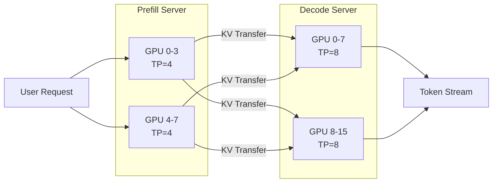
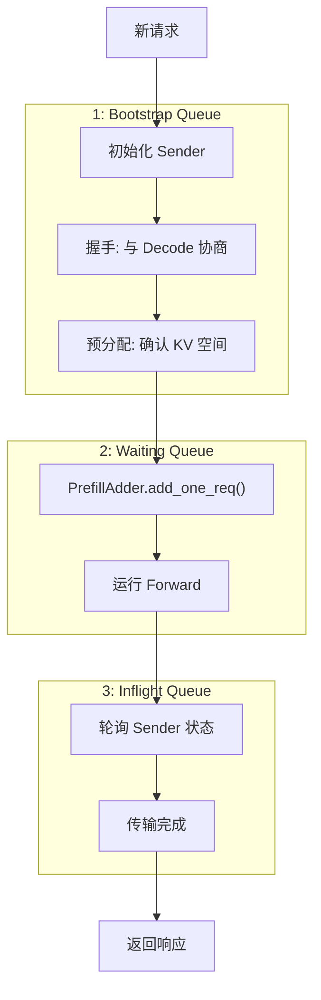
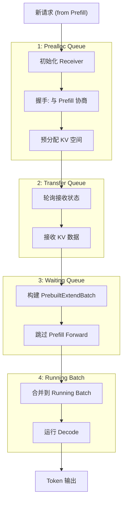
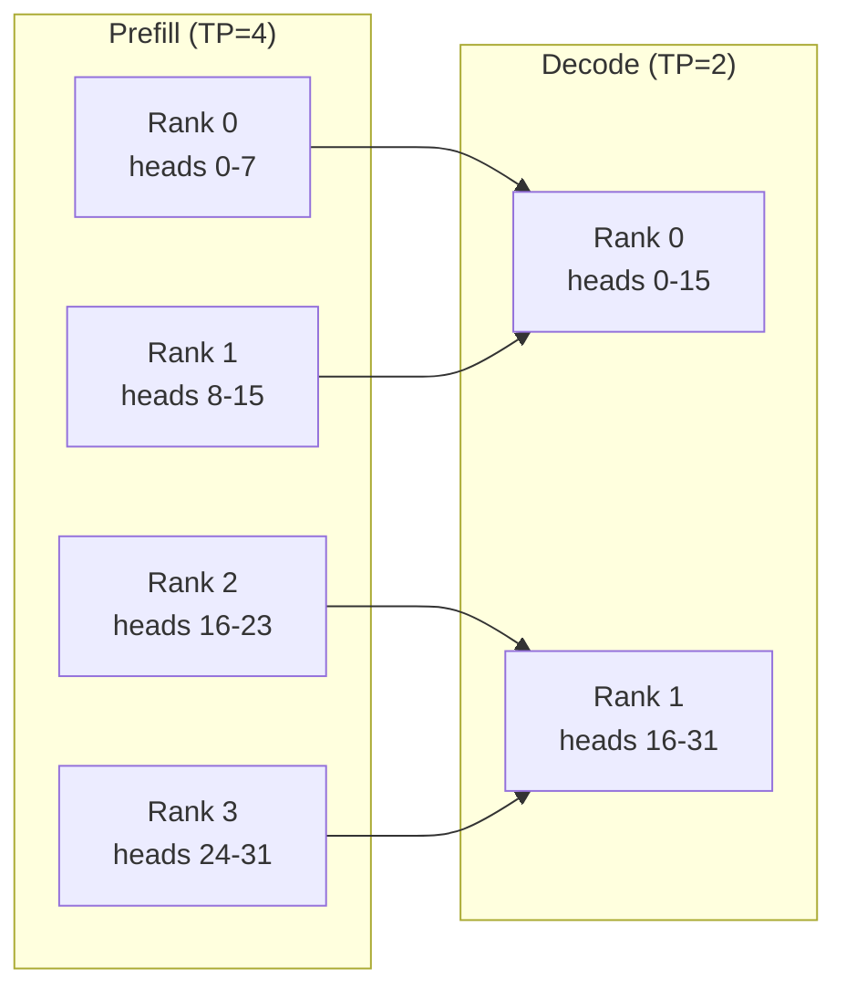
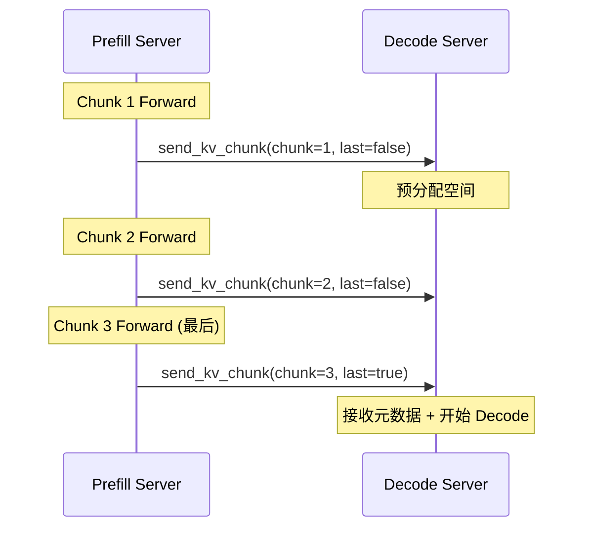

# SGLang PD 分离 (Prefill-Decode Disaggregation)

> **默认场景**: Qwen/Qwen3-VL-235B-A22B-Thinking 多模态模型
>
> **启用特性**: PD 分离 + Chunked Prefill + ViT DP + Overlap Schedule + 多模态缓存

## 1. 概览

PD 分离将 Prefill 和 Decode 阶段部署到不同的 GPU 集群, 实现资源独立扩展。



### 1.1 为什么需要 PD 分离?

| 特性 | Prefill | Decode | 分离优势 |
|------|---------|--------|----------|
| 计算模式 | Compute-bound | Memory-bound | 独立优化 |
| Batch 大小 | 小 | 大 | 资源独立扩展 |
| 内存需求 | 临时 KV | 持久 KV | 内存隔离 |
| 延迟敏感度 | TTFT | TPOT | 服务质量保证 |

### 1.2 核心文件

| 文件/目录 | 说明 | 行数 |
|-----------|------|------|
| `disaggregation/prefill.py` | Prefill 服务器逻辑 | 735 |
| `disaggregation/decode.py` | Decode 服务器逻辑 | 1025 |
| `disaggregation/utils.py` | TransferBackend 枚举、工具函数 | - |
| `disaggregation/kv_events.py` | KV 事件管理 | - |
| `disaggregation/encode_receiver.py` | 编码接收端 | - |
| `disaggregation/encode_server.py` | 编码发送端 | - |
| `disaggregation/base/` | 基础传输抽象 (`KVArgs`, `KVPoll` 等) | - |
| `disaggregation/common/` | 通用连接工具 (`CommonKVManager/Sender/Receiver`) | - |
| `disaggregation/mooncake/` | Mooncake 后端 (RDMA/GPU Direct) | - |
| `disaggregation/nixl/` | NIXL 后端 (RDMA/GPU Direct) | - |
| `disaggregation/ascend/` | 华为昇腾 NPU KV 传输后端 | - |
| `disaggregation/fake/` | 测试用假传输后端 (无实际数据搬运) | - |

## 2. 请求生命周期

### 2.1 Prefill 服务器



### 2.2 Decode 服务器



## 3. KV 传输机制

### 3.1 传输后端

```python
# disaggregation/utils.py
class TransferBackend(Enum):
    MOONCAKE = "mooncake"   # Mooncake P2P (字节跳动, RDMA/GPU Direct)
    NIXL = "nixl"           # NVIDIA NIXL (RDMA/GPU Direct, 独立 KV 传输协议)
    ASCEND = "ascend"       # 华为昇腾 NPU KV 传输后端
    FAKE = "fake"           # 测试用假传输后端, 无实际数据搬运
```

> **ASCEND 后端**: `disaggregation/ascend/` 目录 (`__init__.py`, `conn.py`, `transfer_engine.py`)，专为华为昇腾 NPU 的 KV cache 传输设计，通过 `ASCEND_MF_STORE_URL` 和 `ASCEND_MF_TRANSFER_PROTOCOL` 环境变量配置。

### 3.2 KV 数据结构

```python
# Prefill 端发送
kv_args = KVArgs(
    kv_data_ptrs=[...],    # KV buffer 指针
    kv_data_lens=[...],    # 每层数据长度
    kv_item_lens=[...],    # 每个 token 的 KV 大小
    aux_data_ptrs=[...],   # 元数据 buffer
    state_data_ptrs=[...], # 特殊状态 (Mamba/SWA/NSA)
)

# Decode 端接收
kv_receiver.init(
    page_indices,           # 目标 KV 页索引
    metadata_buffer_index,  # 元数据 buffer 索引
    state_indices,          # 状态索引 (可选)
)
```

### 3.3 Chunked KV 传输

```python
# prefill.py:send_kv_chunk
def send_kv_chunk(self, req, last_chunk=False, end_idx=None):
    """
    分块发送 KV, 支持 Chunked Prefill
    
    非最后块: 只发送完整 pages (优化传输)
    最后块: 发送剩余数据 + 元数据
    """
    if last_chunk:
        # 发送元数据 (第一个 token, logprobs 等)
        # 发送 Mamba/SWA/NSA 特殊状态
        pass
    else:
        # 只发送完整 pages 的 KV
        kv_indices = kv_to_page_indices(...)
```

### 3.4 M:N TP Size KV Slice 传输

当 Prefill 和 Decode 使用不同的 TP size 时，KV cache 的 head 维度需要重新映射。`send_kvcache_slice()` 方法 (在 `mooncake/conn.py:390` 和 `nixl/conn.py:396` 中实现) 支持这种 M:N TP 配置。

**场景示例**: `prefill_tp_size=4, decode_tp_size=2`



**核心逻辑** (简化自 mooncake/conn.py):

```python
def send_kvcache_slice(self, ...):
    """支持 M:N TP size 的 KV head 切片传输"""
    src_heads_per_rank = num_kv_heads
    dst_heads_per_rank = num_kv_heads * src_tp_size // dst_tp_size

    if src_tp_size > dst_tp_size:
        # 多个 prefill rank → 一个 decode rank (聚合)
        # 每个 prefill rank 发送自己全部 heads
        src_head_start_offset = 0
        num_heads_to_send = src_heads_per_rank
        # 在 dst 侧偏移: 按 local_tp_rank 排列
        dst_head_start_offset = local_tp_rank_in_group * src_heads_per_rank
    else:
        # 一个 prefill rank → 多个 decode rank (拆分)
        # 只发送 dst rank 需要的 heads 子集
        src_head_start_offset = (
            dst_tp_rank_in_group * dst_heads_per_rank
        ) % src_heads_per_rank
        num_heads_to_send = dst_heads_per_rank
        dst_head_start_offset = 0
```

| 配置 | 行为 | 通信模式 |
|------|------|----------|
| `prefill_tp > decode_tp` | 多个 prefill rank KV head 聚合到一个 decode rank | N:1 聚合 |
| `prefill_tp < decode_tp` | 一个 prefill rank 拆分到多个 decode rank | 1:N 拆分 |
| `prefill_tp == decode_tp` | 1:1 直接传输 | 1:1 对应 |

## 4. 内存管理

### 4.1 预分配策略 (Decode 端)

```python
# decode.py:DecodeReqToTokenPool
class DecodeReqToTokenPool:
    """
    与普通 ReqToTokenPool 的区别:
    - 普通: #prealloc + #transfer + #running <= max_running_requests
    - Decode: #running <= max_running_requests
              #prealloc + #transfer <= pre_alloc_size (额外空间)
    
    优势: 使用空闲内存预分配, 解阻塞 Prefill
    """
    def __init__(self, size, max_context_len, pre_alloc_size):
        self.req_to_token = torch.zeros(
            (size + pre_alloc_size, max_context_len), ...
        )
        self.free_slots = list(range(size + pre_alloc_size))
```

### 4.2 内存估算

```python
def _allocatable_tokens(self):
    """
    计算可分配的 token 数
    
    需预留:
    1. 每个 running/transfer/waiting 请求的 decode 空间
    2. 确保任一请求 retract 后能完成
    """
    available_size = self.token_to_kv_pool_allocator.available_size()
    
    allocatable = available_size - max(
        # 预留 decode 空间
        reserved_decode_tokens * (running + transfer + waiting),
        # 确保单个请求可完成
        max_single_request_need - retractable_tokens,
    )
    return allocatable
```

## 5. 故障处理

### 5.1 传输状态轮询

```python
# KVPoll 状态
class KVPoll(Enum):
    Bootstrapping = 0   # 握手中
    WaitingForInput = 1 # 等待输入
    Transferring = 2    # 传输中
    Success = 3         # 成功
    Failed = 4          # 失败
```

### 5.2 Retraction 机制

```python
# decode.py:resume_retracted_reqs
def resume_retracted_reqs(self):
    """
    恢复被 retract 的请求 (OOM 后)
    
    1. 检查可分配空间
    2. 重新分配 KV 空间
    3. 从 CPU 加载 KV 数据
    """
    for req in self.retracted_queue:
        if required_tokens <= allocatable_tokens:
            self._pre_alloc(req)
            req.load_kv_cache(...)  # 从 CPU 恢复
```

## 6. 启动配置

### 6.1 Prefill 服务器

```bash
python -m sglang.launch_server \
    --model-path Qwen/Qwen3-VL-235B-A22B-Thinking \
    --tp 4 \
    --disaggregation-mode prefill \
    --disaggregation-transfer-backend mooncake \
    --port 30000
```

### 6.2 Decode 服务器

```bash
python -m sglang.launch_server \
    --model-path Qwen/Qwen3-VL-235B-A22B-Thinking \
    --tp 8 \
    --disaggregation-mode decode \
    --disaggregation-transfer-backend mooncake \
    --port 30001
```

### 6.3 关键参数

| 参数 | 说明 | 默认值 |
|------|------|--------|
| `--disaggregation-mode` | prefill / decode / null | null |
| `--disaggregation-transfer-backend` | mooncake / nixl / fake | mooncake |
| `--disaggregation-ib-device` | IB 设备名 | auto |
| `--disaggregation-decode-enable-fake-auto` | 自动启用 fake 模式 | false |

## 7. 传输后端详解

### 7.1 Mooncake

Mooncake 是字节跳动开源的高性能 P2P 传输库。

```
特点:
- 基于 RDMA (RoCE/IB)
- 支持 GPU Direct RDMA
- 适合跨节点传输
```

### 7.2 NIXL (NVIDIA)

NVIDIA 的独立 KV cache 传输协议，**不基于 NCCL**。

```
特点:
- 独立的 KV cache 传输协议 (非 NCCL)
- 使用 RDMA / GPU Direct RDMA 实现高效 KV cache 搬运
- 专为 disaggregated serving 场景设计
- 更好的 NVIDIA 硬件优化
```

> **注意**: NIXL 与 NCCL 是完全不同的通信库。NCCL 面向集合通信 (all-reduce/all-gather)，而 NIXL 专注于 KV cache 的点对点 RDMA 传输，适合 PD 分离场景下 Prefill → Decode 的 KV 数据搬运。

### 7.3 选择建议

| 场景 | 推荐后端 |
|------|----------|
| 跨节点 + IB 网络 | Mooncake |
| 同节点 + NVLink | NIXL |
| 调试/测试 | Fake |

## 8. 与 Chunked Prefill 集成



## 9. PD-Multiplexing (同机 Prefill-Decode 复用)

与 PD 分离 (将 Prefill/Decode 部署到不同 GPU 集群) 不同，**PD-Multiplexing** 在同一组 GPU 上同时处理两种工作负载。

### 9.1 核心思路

Decode 阶段是 memory-bound，GPU 计算单元 (SM) 利用率低。PD-Multiplexing 利用这一空闲，在 Decode 间隙分出 SM 执行 Prefill 请求。

### 9.2 实现机制

- **动态 TP Group 切换**: `parallel_state.py` 中 `_PDMUX_PREFILL_TP_GROUP` 为 Prefill 创建独立的 `GroupCoordinator`，通过 `set_pdmux_status()` 在 Prefill/Decode 之间动态切换 (详见 `13_parallel_strategies.md` 第 8 节)
- **CUDA Stream 隔离**: `multiplex/multiplexing_mixin.py` 中使用独立的 `prefill_stream` 和 `decode_stream`，交替切换执行
- **ForwardMode.SPLIT_PREFILL**: 专用的 forward 模式，被视为 extend 的变体

### 9.3 与 PD 分离的对比

| 特性 | PD 分离 (Disaggregation) | PD-Multiplexing |
|------|--------------------------|-----------------|
| GPU 集群 | 分离部署 | 同一组 GPU |
| KV 传输 | 跨节点 RDMA | 无需传输 (本地) |
| 适用场景 | 大规模部署 | 中等规模, 提升 GPU 利用率 |
| 兼容性 | 支持 Chunked Prefill | 不兼容 Chunked Prefill/Overlap |

### 9.4 启用方式

```bash
python -m sglang.launch_server \
    --model-path Qwen/Qwen3-VL-235B-A22B-Thinking \
    --tp 8 \
    --enable-pdmux \
    --pdmux-config-path pdmux_config.json
```

## 10. 监控与调试

### 10.1 关键指标

```python
# 可监控的指标
- bootstrap_queue_size      # 握手队列长度
- transfer_queue_size       # 传输队列长度
- prealloc_tokens           # 预分配 token 数
- bootstrap_failed_reqs     # 握手失败请求数
```

### 10.2 调试技巧

```bash
# 启用详细日志
export SGLANG_LOG_LEVEL=debug

# 使用 fake 后端测试流程
--disaggregation-transfer-backend fake
```

## 11. 下一步

- **15**: sgl-kernel 架构
- **16**: Attention kernel 实现
