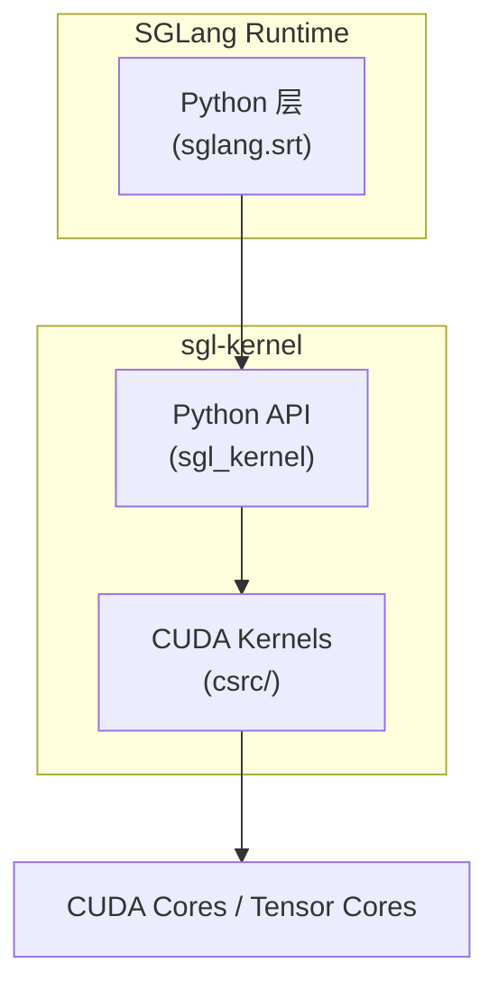
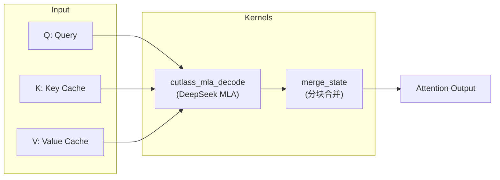
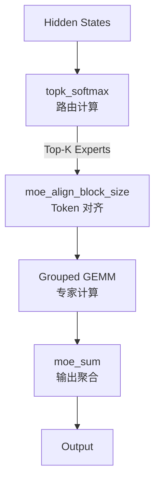
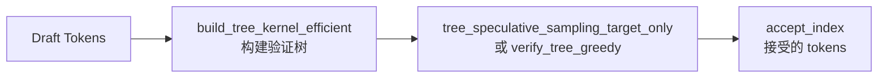

# SGLang sgl-kernel 架构详解

> **默认场景**: Qwen/Qwen3-VL-235B-A22B-Thinking 多模态模型
>
> **启用特性**: PD 分离 + Chunked Prefill + ViT DP + Overlap Schedule + 多模态缓存

## 1. 概览

`sgl-kernel` 是 SGLang 的高性能 CUDA kernel 库，提供 LLM 推理所需的核心计算原语。



### 1.1 目录结构

```
sgl-kernel/
├── csrc/                              # CUDA/C++ 源码
│   ├── allreduce/                     # 集合通信 (Custom AR, MSCCLPP, Quick AR)
│   ├── attention/                     # Attention 相关
│   │   ├── cascade.cu                 #   Cascade attention kernel
│   │   ├── cutlass_mla_kernel.cu      #   CUTLASS MLA decode (SM100)
│   │   ├── cutlass_sm100_mla/         #   SM100 MLA 专用 (device/, kernel/ 子目录)
│   │   ├── merge_attn_states.cu       #   分块状态合并
│   │   └── vertical_slash_index.cu    #   稀疏注意力索引转换
│   ├── cutlass_extensions/            # CUTLASS 扩展 (自定义 epilogue, GEMM)
│   ├── elementwise/                   # 逐元素操作
│   │   ├── activation.cu              #   SiLU, GeLU 等激活函数
│   │   ├── cast.cu                    #   类型转换
│   │   ├── concat_mla.cu             #   MLA K/Q 拼接
│   │   ├── copy.cu                    #   copy_to_gpu_no_ce
│   │   ├── fused_add_rms_norm_kernel.cu  # 融合 Add+RMSNorm
│   │   ├── pos_enc.cu / rope.cu       #   位置编码 / RoPE
│   │   └── topk.cu                    #   Fast TopK kernel
│   ├── expert_specialization/         # 专家特化 GEMM
│   │   ├── es_fp8_blockwise.cu        #   FP8 blockwise grouped MM
│   │   ├── es_sm100_mxfp8_blockscaled.cu  # SM100 MXFP8 grouped MM
│   │   └── es_sm100_mxfp8_blockscaled_group_quant.cu  # SM100 分组量化
│   ├── gemm/                          # 矩阵乘法 (FP8/INT8/NVFP4/AWQ/GPTQ/DSv3)
│   ├── grammar/                       # Grammar 约束
│   │   └── apply_token_bitmask_inplace_cuda.cu  # Bitmask 应用
│   ├── kvcacheio/                     # KV Cache I/O
│   │   └── transfer.cu               #   PD 分离 KV 传输 kernel
│   ├── mamba/                         # Mamba 状态空间模型
│   │   ├── causal_conv1d.cu           #   因果卷积 (fwd/update)
│   │   └── causal_conv1d.h
│   ├── memory/                        # 内存操作
│   │   ├── store.cu                   #   store_kv_cache (set_kv_buffer)
│   │   └── weak_ref_tensor.cpp        #   弱引用张量
│   ├── moe/                           # Mixture-of-Experts
│   ├── sgl_diffusion/                 # Diffusion 模型支持
│   │   └── elementwise/               #   扩散模型 elementwise ops
│   ├── spatial/                       # 空间分区 (Green Context)
│   │   └── greenctx_stream.cu         #   SM 分区 stream 创建
│   ├── speculative/                   # 投机解码
│   ├── cpu/                           # CPU 后端 (x86_64/aarch64)
│   │   ├── interface.cpp              #   CPU 扩展入口
│   │   ├── gemm*.cpp, moe*.cpp        #   CPU GEMM/MoE 实现
│   │   └── model/                     #   CPU 模型实现
│   ├── common_extension.cc            # PyTorch CUDA 扩展注册
│   ├── flash_extension.cc             # FlashAttention 扩展注册
│   └── flashmla_extension.cc          # FlashMLA 扩展注册
├── python/sgl_kernel/                 # Python 接口
│   ├── __init__.py                    # 导出所有 API
│   ├── attention.py                   # Attention API (MLA decode, merge_state)
│   ├── elementwise.py                 # Elementwise API (RMSNorm, RoPE, 激活, MLA concat)
│   ├── gemm.py                        # GEMM API (FP8/INT8/GPTQ/AWQ/NVFP4)
│   ├── moe.py                         # MoE API (topk, align, grouped GEMM, sum)
│   ├── cutlass_moe.py                 # CUTLASS W4A8 MoE
│   ├── fused_moe.py                   # Fused MoE (Marlin WNA16)
│   ├── sampling.py                    # 采样 API (Top-K/P, Min-P)
│   ├── flash_attn.py                  # FlashAttention 3/4 接口
│   ├── flash_mla.py                   # FlashMLA 后端 (SM90, 独立于 CUTLASS MLA)
│   ├── _fa4_interface.py              # FA4 Cute-DSL 接口 (实验性)
│   ├── sparse_flash_attn.py           # 稀疏 FlashAttention 接口
│   ├── grammar.py                     # Grammar 约束 (bitmask 应用)
│   ├── hadamard.py                    # Hadamard 变换 (2^n, 12N, 20N, 28N, 40N)
│   ├── expert_specialization.py       # 专家特化 GEMM API
│   ├── top_k.py                       # Fast TopK API (DeepSeek v3.2 优化)
│   ├── kvcacheio.py                   # KV Cache I/O 传输 API
│   ├── mamba.py                       # Mamba causal_conv1d API
│   ├── marlin.py                      # Marlin repack API (GPTQ/AWQ)
│   ├── memory.py                      # 内存操作 (set_kv_buffer, weak_ref)
│   ├── speculative.py                 # 投机解码 API
│   ├── allreduce.py                   # AllReduce API
│   ├── quantization/                  # 量化 (GGUF)
│   ├── spatial.py                     # 空间分区 API (Green Context)
│   └── load_utils.py                  # 架构检测、动态加载
├── benchmark/                         # 性能测试
├── tests/                             # 单元测试
└── CMakeLists.txt                     # 构建配置 (FetchContent 管理 3rdparty 依赖)
```

### 1.2 Kernel 分类

| 类别 | 功能 | 关键 API |
|------|------|----------|
| **Attention** | MLA/MHA 解码, 状态合并 | `cutlass_mla_decode`, `merge_state`, `flash_attn_with_kvcache` |
| **FlashMLA** | SM90 MLA decode (独立后端) | `flash_mla_with_kvcache`, `get_mla_metadata` |
| **GEMM** | 矩阵乘法 (FP8/INT8/NVFP4/AWQ/GPTQ) | `fp8_scaled_mm`, `gptq_marlin_gemm`, `cutlass_scaled_fp4_mm` |
| **MoE** | 专家路由/计算 | `topk_softmax`, `moe_align_block_size`, `fp8_blockwise_scaled_grouped_mm` |
| **Expert Specialization** | 专家特化 GEMM (SM90/SM100) | `es_fp8_blockwise_scaled_grouped_mm`, `es_sm100_mxfp8_blockscaled_grouped_mm` |
| **Elementwise** | RMSNorm, RoPE, 激活, MLA concat | `rmsnorm`, `silu_and_mul`, `apply_rope_with_cos_sin_cache_inplace`, `concat_mla_k` |
| **Sampling** | Top-K/P 采样, Min-P | `top_k_top_p_sampling_from_probs`, `min_p_sampling_from_probs` |
| **Fast TopK** | DeepSeek v3.2 TopK 优化 | `fast_topk`, `fast_topk_v2`, `fast_topk_transform_fused` |
| **Quantization** | FP8/INT8 量化 | `sgl_per_token_quant_fp8`, `sgl_per_token_group_quant_8bit` |
| **Grammar** | 约束解码 bitmask | `apply_token_bitmask_inplace_cuda` |
| **Hadamard** | 快速 Hadamard 变换 | `hadamard_transform`, `hadamard_transform_12n/20n/28n/40n` |
| **KV Cache I/O** | PD 分离 KV 传输 (12+ 变体) | `transfer_kv_per_layer`, `transfer_kv_all_layer`, `transfer_kv_per_layer_mla` |
| **Mamba** | Mamba 因果卷积 | `causal_conv1d_fwd`, `causal_conv1d_update` |
| **Memory** | KV 缓存存储, 弱引用 | `set_kv_buffer_kernel`, `weak_ref_tensor` |
| **Speculative** | 投机解码 (树构建/验证) | `build_tree_kernel_efficient`, `verify_tree_greedy` |
| **AllReduce** | 分布式通信 | `init_custom_ar`, `all_reduce`, `mscclpp_allreduce` |
| **Spatial** | SM 空间分区 (Green Context) | `create_greenctx_stream_by_value`, `get_sm_available` |

## 2. 核心 Kernel 详解

### 2.1 Attention Kernels



**关键函数**:
```python
# MLA Decode (DeepSeek 系列)
cutlass_mla_decode(
    out, q_nope, q_pe, kv_c_and_k_pe_cache,
    seq_lens, page_table, workspace, sm_scale, num_kv_splits
)

# 状态合并 (多 chunk 场景)
merge_state(v_a, s_a, v_b, s_b, v_merged, s_merged)
```

### 2.2 GEMM Kernels (矩阵乘法)

支持多种量化格式:

| 格式 | API | 适用场景 |
|------|-----|----------|
| FP8 | `fp8_scaled_mm` | 高性能推理 |
| FP8 Block | `fp8_blockwise_scaled_mm` | 块级量化 |
| INT8 | `int8_scaled_mm` | 通用量化 |
| FP4 | `cutlass_scaled_fp4_mm` | SM100+ (Blackwell) |
| GPTQ | `gptq_marlin_gemm` | GPTQ 模型 |
| AWQ | `awq_dequantize` | AWQ 模型 |

```python
# FP8 矩阵乘法
result = fp8_scaled_mm(
    mat_a, mat_b,           # FP8 输入
    scales_a, scales_b,     # 缩放因子
    out_dtype,              # 输出类型 (BF16/FP16)
    bias                    # 可选偏置
)

# GPTQ Marlin 优化
output = gptq_marlin_gemm(
    a, c_or_none,
    b_q_weight, b_scales, global_scale_or_none,
    b_zeros_or_none, g_idx_or_none, perm_or_none,
    workspace, b_q_type_id, size_m, size_n, size_k,
    is_k_full, use_atomic_add, use_fp32_reduce, is_zp_float
)
```

### 2.3 MoE Kernels



**核心函数**:
```python
# 路由 Top-K
topk_softmax(
    topk_weights,      # 输出: Top-K 权重
    topk_indices,      # 输出: Top-K 专家 ID
    gating_output,     # 输入: Router 输出
    renormalize,       # 是否重新归一化
    moe_softcapping,   # Softcap 值
    correction_bias    # 校正偏置 (可选)
)

# Token 对齐 (按块大小)
moe_align_block_size(
    topk_ids, num_experts, block_size,
    sorted_token_ids,     # 输出: 排序后的 token ID
    experts_ids,          # 输出: 专家 ID
    num_tokens_post_pad,  # 输出: padding 后的 token 数
    cumsum_buffer,
    pad_sorted_token_ids
)

# FP8 Grouped GEMM
fp8_blockwise_scaled_grouped_mm(
    output, a_ptrs, b_ptrs, out_ptrs,
    a_scales_ptrs, b_scales_ptrs,
    a, b, scales_a, scales_b,
    stride_a, stride_b, stride_c,
    layout_sfa, layout_sfb,
    problem_sizes, expert_offsets, workspace
)
```

### 2.4 Elementwise Kernels

```python
import sgl_kernel

# RMSNorm — 返回 output tensor; out/enable_pdl 可选
output = sgl_kernel.rmsnorm(input, weight, eps=1e-6, out=None, enable_pdl=None)

# Gemma-style RMSNorm — weight 偏移 +1: out = (x / RMS(x)) * (weight + 1)
output = sgl_kernel.gemma_rmsnorm(input, weight, eps=1e-6, out=None, enable_pdl=None)

# 融合 Add + RMSNorm — in-place: residual += input; input = RMSNorm(residual)
sgl_kernel.fused_add_rmsnorm(input, residual, weight, eps=1e-6, enable_pdl=None)

# RoPE 位置编码 (融合 set_kv_buffer 可选)
sgl_kernel.apply_rope_with_cos_sin_cache_inplace(
    positions, query, key, head_size, cos_sin_cache,
    is_neox=True, fused_set_kv_buffer_arg=None, enable_pdl=None
)

# 激活函数 — 输入 shape (..., 2*d) → 输出 shape (..., d)
output = sgl_kernel.silu_and_mul(input, out=None)        # SiLU(x) * Gate
output = sgl_kernel.gelu_tanh_and_mul(input, out=None)   # GeLU_TANH(x) * Gate
output = sgl_kernel.gelu_and_mul(input, out=None)        # GeLU(x) * Gate

# MLA 相关拼接
sgl_kernel.concat_mla_k(k, k_nope, k_rope)              # k_nope || k_rope → k
output = sgl_kernel.concat_mla_absorb_q(a, b)            # a || b → output

# FP8 降精度 (融合 scale + store)
sgl_kernel.downcast_fp8(k, v, k_out, v_out, k_scale, v_scale, loc, mult=1, offset=0)

# Timestep embedding (diffusion 模型)
output = sgl_kernel.timestep_embedding(t, dim, flip_sin_to_cos=False, ...)
```

> **注意**: 文档中的 `sgl_kernel.*` 是用户面 Python API 签名。内部实现通过 `torch.ops.sgl_kernel.*` 调用底层 C++ 注册的算子，但用户代码应使用 `sgl_kernel.*` wrapper，因为 wrapper 提供了默认参数、自动 PDL 检测、形状校验等便利功能。

### 2.5 Sampling Kernels

```python
# Top-K + Top-P 采样
top_k_top_p_sampling_from_probs(
    probs, output, maybe_indices,
    maybe_top_k_arr, top_k_val,
    maybe_top_p_arr, top_p_val,
    deterministic, gen
)

# Min-P 采样
min_p_sampling_from_probs(
    probs, output, maybe_indices,
    maybe_min_p_arr, min_p_val,
    deterministic, gen
)

# Renormalization
top_k_renorm_probs(probs, renorm_probs, maybe_top_k_arr, top_k_val)
top_p_renorm_probs(probs, renorm_probs, maybe_top_p_arr, top_p_val)
```

### 2.6 AllReduce Kernels

```python
# 初始化自定义 AllReduce
fa_id = init_custom_ar(ipc_tensors, rank_data, rank, full_nvlink)

# 执行 AllReduce
all_reduce(fa_id, inp, out, reg_buffer, reg_buffer_sz_bytes)

# MSCCLPP 后端
ctx = mscclpp_init_context(unique_id, rank, world_size, scratch, put_buffer, ...)
mscclpp_allreduce(ctx, inp, out, nthreads, nblocks)
```

## 3. 量化支持

### 3.1 支持的量化格式

| 格式 | 精度 | API | 硬件要求 |
|------|------|-----|----------|
| FP8 E4M3 | 8-bit | `sgl_per_token_quant_fp8` | SM89+ |
| FP8 Block | 8-bit | `sgl_per_token_group_quant_8bit` | SM89+ |
| INT8 | 8-bit | `int8_scaled_mm` | All |
| FP4 (NVFP4) | 4-bit | `scaled_fp4_quant` | SM100+ |
| GPTQ | 4-bit | `gptq_marlin_gemm` | All |
| AWQ | 4-bit | `awq_dequantize` | All |
| GGUF | 混合 | `ggml_dequantize` | All |

### 3.2 量化 API

```python
# FP8 Per-Tensor 量化
sgl_per_tensor_quant_fp8(input, output_q, output_s, is_static)

# FP8 Per-Token 量化
sgl_per_token_quant_fp8(input, output_q, output_s)

# FP8 Per-Group 量化
sgl_per_token_group_quant_8bit(
    input, output_q, output_s,
    group_size, eps, fp8_min, fp8_max, scale_ue8m0
)

# NVFP4 量化 (Blackwell)
scaled_fp4_quant(output, input, output_scale, input_scale)
```

## 4. 投机解码 Kernels



```python
# 树结构投机采样
tree_speculative_sampling_target_only(
    predicts, accept_index, accept_token_num,
    candidates, retrive_index, retrive_next_token, retrive_next_sibling,
    uniform_samples, uniform_samples_for_final_sampling,
    target_probs, draft_probs,
    threshold_single, threshold_acc, deterministic
)

# 贪婪验证
verify_tree_greedy(
    predicts, accept_index, accept_token_num,
    candidates, retrive_index, retrive_next_token, retrive_next_sibling,
    target_predict
)

# 高效树构建
build_tree_kernel_efficient(
    parent_list, selected_index, verified_seq_len,
    tree_mask, positions, retrive_index,
    retrive_next_token, retrive_next_sibling,
    topk, depth, draft_token_num, tree_mask_mode
)
```

## 5. KV Cache I/O

PD 分离场景下的 KV 传输优化。不同 API 对应不同的 KV Cache 内存布局组合：

- **布局缩写**: `pf` = Prefill-Flat (token-first, 连续), `lf` = Layer-First (layer 维在前), `ph` = Paged-Head (paged + head 分离)
- **传输粒度**: `per_layer` = 单层传输, `all_layer` = 所有层批量传输
- **direct**: 使用指针列表而非张量，适配不同层可能在不同设备上的场景
- **mla**: MLA 架构 (K/V 压缩为单一 latent tensor)，不需要分开的 K/V

### 5.1 标准 MHA/GQA 传输 API

```python
import sgl_kernel

# ─── 同布局传输 (src 与 dst 布局相同) ───
# 单层传输
sgl_kernel.transfer_kv_per_layer(
    src_k, dst_k, src_v, dst_v,
    src_indices, dst_indices,
    item_size, block_quota=2, num_warps_per_block=32
)

# 所有层批量传输
sgl_kernel.transfer_kv_all_layer(
    src_k_layers, dst_k_layers, src_v_layers, dst_v_layers,
    src_indices, dst_indices,
    item_size, num_layers, block_quota=2, num_warps_per_block=32
)

# ─── Prefill-Flat → Layer-First 传输 ───
# 单层: pf → lf (需要 layer_id 定位目标层)
sgl_kernel.transfer_kv_per_layer_pf_lf(
    src_k, dst_k, src_v, dst_v,
    src_indices, dst_indices,
    layer_id, item_size, src_layout_dim,
    block_quota=2, num_warps_per_block=32
)

# ─── Paged-Head → Layer-First 传输 ───
# 单层: ph → lf (额外需要 page_size, head_num)
sgl_kernel.transfer_kv_per_layer_ph_lf(
    src_k, dst_k, src_v, dst_v,
    src_indices, dst_indices,
    layer_id, item_size, src_layout_dim,
    page_size, head_num,
    block_quota=2, num_warps_per_block=32
)

# ─── Layer-First → Prefill-Flat 传输 (反向) ───
# 所有层: lf → pf
sgl_kernel.transfer_kv_all_layer_lf_pf(
    src_k_layers, dst_k, src_v_layers, dst_v,
    src_indices, dst_indices,
    item_size, dst_layout_dim, num_layers,
    block_quota=2, num_warps_per_block=32
)

# ─── Layer-First → Paged-Head 传输 ───
# 所有层: lf → ph
sgl_kernel.transfer_kv_all_layer_lf_ph(
    src_k_layers, dst_k, src_v_layers, dst_v,
    src_indices, dst_indices,
    item_size, dst_layout_dim, num_layers,
    page_size, head_num,
    block_quota=2, num_warps_per_block=32
)

# ─── Direct 传输 (指针列表, 跨设备友好) ───
# 同布局 direct
sgl_kernel.transfer_kv_direct(
    src_layers, dst_layers,          # List[torch.Tensor]
    src_indices, dst_indices, page_size
)

# 单层 direct: pf → lf
sgl_kernel.transfer_kv_per_layer_direct_pf_lf(
    src_ptrs, dst_ptrs,              # List[torch.Tensor]
    src_indices, dst_indices, layer_id, page_size
)

# 所有层 direct: lf → pf
sgl_kernel.transfer_kv_all_layer_direct_lf_pf(
    src_ptrs, dst_ptrs,              # List[torch.Tensor]
    src_indices, dst_indices, page_size
)
```

### 5.2 MLA 传输 API

MLA 架构下 K/V 压缩为单一 latent tensor，不需要分开的 K/V 参数：

```python
# ─── MLA 同布局传输 ───
# 单层
sgl_kernel.transfer_kv_per_layer_mla(
    src, dst, src_indices, dst_indices,
    item_size, block_quota=2, num_warps_per_block=32
)

# 所有层批量
sgl_kernel.transfer_kv_all_layer_mla(
    src_layers, dst_layers, src_indices, dst_indices,
    item_size, num_layers, block_quota=2, num_warps_per_block=32
)

# ─── MLA Prefill-Flat → Layer-First ───
sgl_kernel.transfer_kv_per_layer_mla_pf_lf(
    src, dst, src_indices, dst_indices,
    layer_id, item_size, src_layout_dim,
    block_quota=2, num_warps_per_block=32
)

# ─── MLA Layer-First → Prefill-Flat ───
sgl_kernel.transfer_kv_all_layer_mla_lf_pf(
    src_layers, dst, src_indices, dst_indices,
    item_size, dst_layout_dim, num_layers,
    block_quota=2, num_warps_per_block=32
)
```

### 5.3 API 总览

| API | 粒度 | 源布局 → 目标布局 | MLA |
|-----|------|-------------------|-----|
| `transfer_kv_per_layer` | 单层 | 同布局 | No |
| `transfer_kv_all_layer` | 全层 | 同布局 | No |
| `transfer_kv_per_layer_pf_lf` | 单层 | Prefill-Flat → Layer-First | No |
| `transfer_kv_per_layer_ph_lf` | 单层 | Paged-Head → Layer-First | No |
| `transfer_kv_all_layer_lf_pf` | 全层 | Layer-First → Prefill-Flat | No |
| `transfer_kv_all_layer_lf_ph` | 全层 | Layer-First → Paged-Head | No |
| `transfer_kv_direct` | 全层 | 同布局 (指针列表) | No |
| `transfer_kv_per_layer_direct_pf_lf` | 单层 | pf → lf (指针列表) | No |
| `transfer_kv_all_layer_direct_lf_pf` | 全层 | lf → pf (指针列表) | No |
| `transfer_kv_per_layer_mla` | 单层 | 同布局 | Yes |
| `transfer_kv_all_layer_mla` | 全层 | 同布局 | Yes |
| `transfer_kv_per_layer_mla_pf_lf` | 单层 | Prefill-Flat → Layer-First | Yes |
| `transfer_kv_all_layer_mla_lf_pf` | 全层 | Layer-First → Prefill-Flat | Yes |

## 6. 使用示例

### 6.1 Python 调用

```python
import torch
import sgl_kernel

# RMSNorm — Python API 会自动分配 output 并检测 PDL 支持
output = sgl_kernel.rmsnorm(input, weight, eps=1e-6)

# FP8 GEMM
result = sgl_kernel.fp8_scaled_mm(
    a_fp8, b_fp8,
    a_scale, b_scale,
    out_dtype=torch.bfloat16,
    bias=None
)

# Top-K + Top-P 采样
output = torch.empty(batch_size, dtype=torch.int32, device="cuda")
sgl_kernel.top_k_top_p_sampling_from_probs(
    probs, output, None,
    None, 50,    # top_k
    None, 0.9,   # top_p
    deterministic=True, gen=None
)
```

### 6.2 torch.ops 调用

```python
# 通过 torch.ops 调用 (底层 C++ 注册的算子, 支持 torch.compile)
# 注意参数顺序/含义可能与 Python wrapper 不同 (如 rmsnorm 第一个参数是 out)
torch.ops.sgl_kernel.rmsnorm(out, input, weight, eps, enable_pdl)
torch.ops.sgl_kernel.silu_and_mul(out, input)
torch.ops.sgl_kernel.all_reduce(fa_id, inp, out, reg_buffer, sz)
```

> **Python API vs torch.ops**: 推荐使用 `sgl_kernel.*` Python API，它提供了更友好的接口（自动分配输出、默认参数、类型检查）。`torch.ops.sgl_kernel.*` 是底层接口，参数顺序不同（通常 out 在前），主要在 `torch.compile` 图捕获场景下使用。

## 7. 构建与安装

```bash
# 安装 release 版本
pip install sgl-kernel --upgrade

# 从源码构建
cd sgl-kernel
make build

# 构建要求 (来源: CMakeLists.txt L1 + pyproject.toml)
# - CMake >= 3.26      (cmake_minimum_required(VERSION 3.26))
# - Python >= 3.10
# - PyTorch >= 2.8.0   (pyproject.toml: "torch>=2.8.0")
# - CUDA Toolkit (匹配 PyTorch 编译版本)
# - 可选: nvidia-cutlass-dsl (FA4 实验性支持)
```

## 8. 性能优化技巧

### 8.1 PDL (Programmatic Dependent Launch)

```python
# 启用 PDL 减少 kernel launch 开销
# enable_pdl=None 时自动检测 (Hopper+ 架构自动启用)
output = sgl_kernel.rmsnorm(input, weight, eps=1e-6, enable_pdl=True)
sgl_kernel.fused_add_rmsnorm(input, residual, weight, eps=1e-6, enable_pdl=True)
```

### 8.2 CUDA Graph 兼容

大多数 kernel 支持 CUDA Graph 捕获:
```python
# 在 graph capture 期间正常调用
with torch.cuda.graph(graph):
    sgl_kernel.silu_and_mul(out, input)
    # ...
```

## 9. 下一步

- **16**: Attention kernel 详解 (FlashAttention, MLA, Sparse)
- **17**: MoE kernel 详解 (路由, Grouped GEMM)
