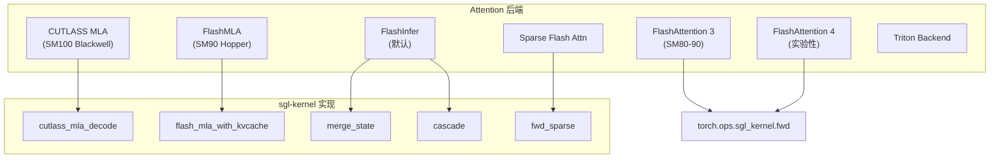
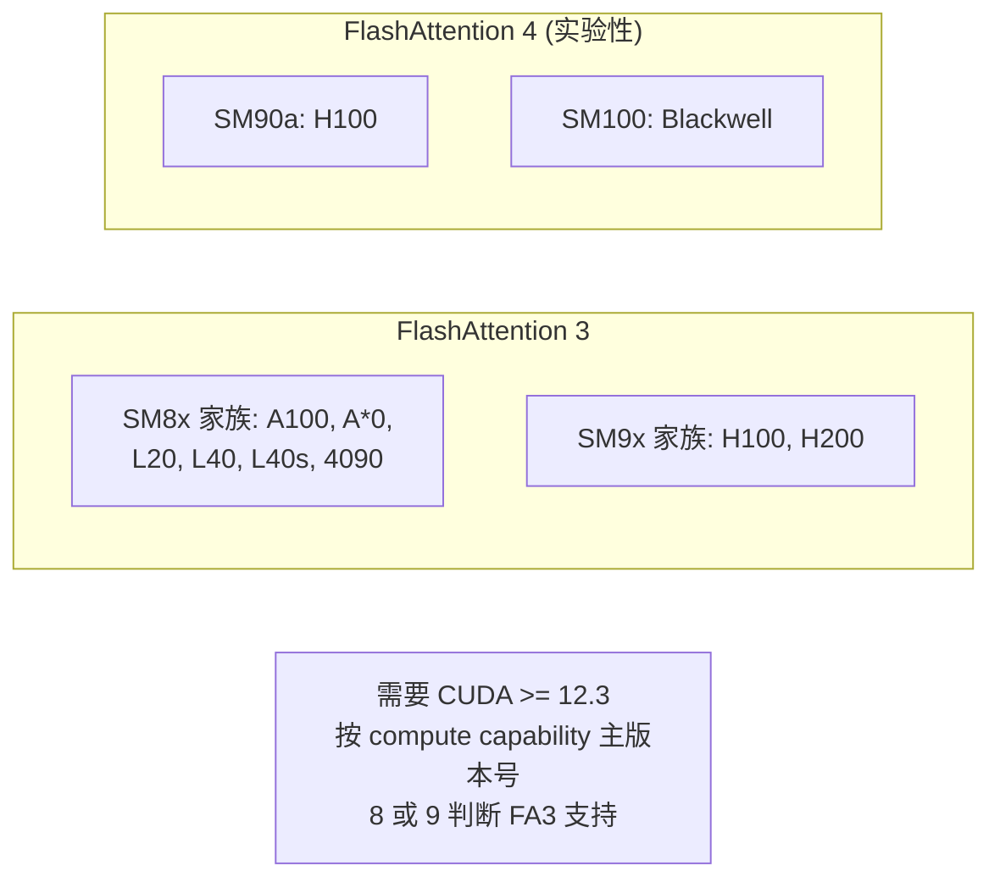
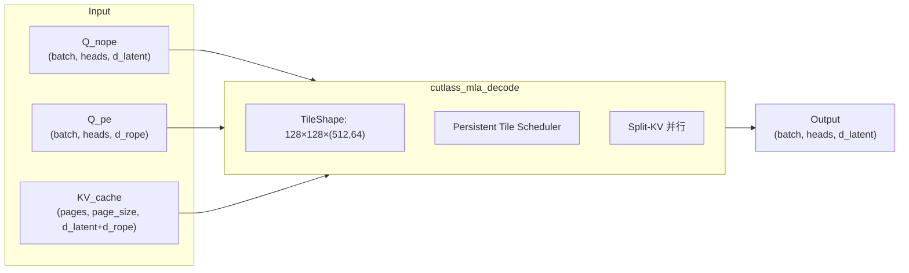
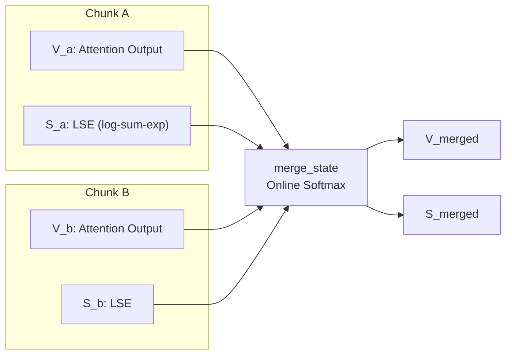
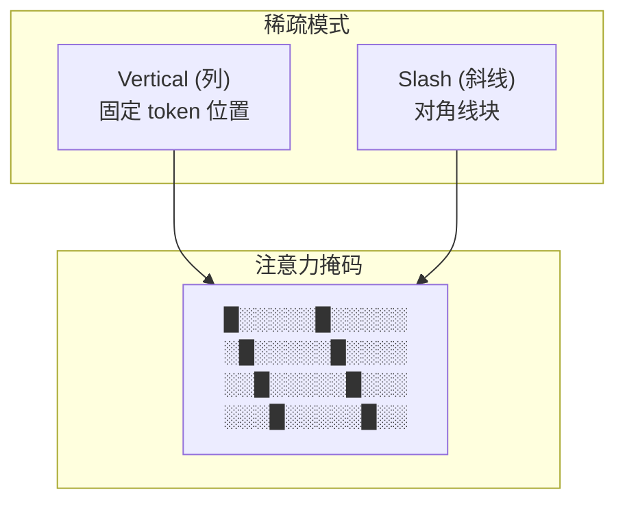
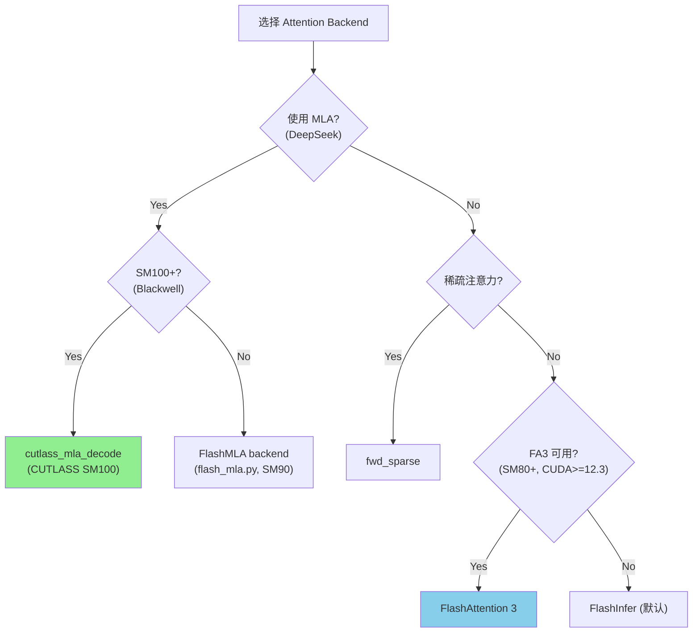

# SGLang Attention Kernel 实现详解

> **默认场景**: Qwen3.5 混合架构模型（Full Attention + Linear Attention/GatedDeltaNet + MoE + MTP）
>
> **核心组件**: FlashAttention 3/4, CUTLASS MLA (SM100), FlashMLA (SM90), Cascade, Sparse Attention, Wave Attention, NSA

## 本章定位
- 主题范围: Attention kernel 实现与优化。

## 设计 Why（为什么这么设计）
- Attention kernel 决定主路径效率与显存行为。
- 核心取舍: 吞吐 vs 时延、显存 vs 计算、通用性 vs 特化。

## 阅读建议（进阶）
1. 先抓目标函数和边界条件，再读具体实现。
2. 先看调用链和状态变化，再看局部优化细节。
3. 源码锚点以“路径 + 类/函数”为主，避免依赖易漂移行号。

## 1. 概览



### 1.1 Kernel 分类

| Kernel | 源文件 | 硬件 | 用途 |
|--------|--------|------|------|
| `fwd` / `fwd_kvcache` | `sgl-kernel/python/sgl_kernel/flash_attn.py` → `sgl-kernel/csrc/flash_extension.cc` | SM80+ | FA3/FA4 前向 |
| `cutlass_mla_decode` | `sgl-kernel/csrc/attention/cutlass_mla_kernel.cu` | SM100 | CUTLASS MLA decode (Blackwell) |
| `cutlass_sm100_mla/*` | `csrc/attention/cutlass_sm100_mla/` | SM100 | SM100 MLA 设备/kernel 实现 |
| | `├── device/sm100_mla.hpp` | | MLA device-level wrapper |
| | `├── kernel/sm100_fmha_mla_tma_warpspecialized.hpp` | | TMA Warp-specialized MLA kernel |
| | `├── kernel/sm100_fmha_mla_reduction.hpp` | | MLA Split-KV reduction kernel |
| | `└── kernel/sm100_mla_tile_scheduler.hpp` | | Persistent Tile Scheduler |
| `cascade` | `sgl-kernel/csrc/attention/cascade.cu` | SM80+ | Cascade attention (合并 2 个 attention 输出) |
| `merge_state` | `sgl-kernel/csrc/attention/merge_attn_states.cu` | All | 分块状态合并 (online softmax) |
| `fwd_sparse` | `sgl-kernel/csrc/attention/vertical_slash_index.cu` | SM80+ | 稀疏注意力索引转换 |
| `flash_mla_with_kvcache` | `sgl-kernel/python/sgl_kernel/flash_mla.py` → `sgl-kernel/csrc/flashmla_extension.cc` | SM90 | FlashMLA 后端 (独立项目, 非 CUTLASS MLA) |
| `flash_mla_sparse_fwd` | `sgl-kernel/python/sgl_kernel/flash_mla.py` | SM90 | FlashMLA 稀疏 prefill |
| `wave_backend` | `python/sglang/srt/layers/attention/wave_backend.py` (Triton) | All | Wave Attention (decode/extend/prefill) |
| `nsa_backend` | `python/sglang/srt/layers/attention/nsa_backend.py` + `nsa/` | SM80+ | NSA 稀疏注意力 + MTP 支持 |
| `cpu_flash_attn` | `sgl-kernel/csrc/cpu/flash_attn.cpp` | CPU | CPU FlashAttention (x86_64/aarch64) |

## 2. FlashAttention 3/4 集成

### 2.1 支持矩阵



### 2.2 核心 API

```python
- 源码锚点: `sgl-kernel/python/sgl_kernel/flash_attn.py`
def flash_attn_with_kvcache(
    # 基础输入
    q,                    # (batch, seqlen_q, nheads, headdim)
    k_cache,              # (batch, seqlen_cache, nheads_k, headdim) or paged
    v_cache,              # (batch, seqlen_cache, nheads_k, headdim_v)
    k=None, v=None,       # 增量 KV 更新 (FA4 不支持)
    qv=None,              # (batch, seqlen, nheads, headdim_v) 可选
    # RoPE 参数 (FA4 不支持)
    rotary_cos=None,      # (seqlen_ro, rotary_dim/2)
    rotary_sin=None,
    rotary_interleaved=True,
    rotary_seqlens=None,
    # 序列与分页
    cache_seqlens=None,   # (batch,) 当前序列长度
    cache_batch_idx=None, # (batch,) KV cache 索引
    cache_leftpad=None,   # (batch,) 左 padding 偏移
    page_table=None,      # (batch, max_blocks) Paged KV Cache
    cu_seqlens_q=None,    # varlen 模式
    cu_seqlens_k_new=None,
    max_seqlen_q=None,
    # FP8 反量化因子 (FA4 不支持)
    q_descale=None, k_descale=None, v_descale=None,
    # Attention 配置
    softmax_scale=None,
    causal=False,
    window_size=(-1, -1), # 滑动窗口
    attention_chunk=None,
    softcap=0.0,
    # 调度与性能
    scheduler_metadata=None,  # FA3 调度元数据
    num_splits=0,         # Split-KV 分割数 (0=自动)
    pack_gqa=None,        # GQA 打包优化
    sm_margin=0,          # SM 预留 (用于通信重叠)
    return_softmax_lse=False,
    sinks=None,           # Learnable sink tokens
    score_mod=None,       # 自定义 score 修改函数
    aux_tensors=None,     # score_mod 辅助张量
    ver=3,                # FA 版本: 3 或 4
):
    """
    Incremental decoding with KV cache update
    - 支持 paged KV cache (page_table)
    - 支持 GQA/MQA (nheads_k < nheads)
    - 支持 滑动窗口注意力
    - 支持 RoPE 融合 (仅 FA3)
    - 支持 FP8 descale (仅 FA3)
    """
```

```python
- 源码锚点: `sgl-kernel/python/sgl_kernel/flash_attn.py`
def flash_attn_varlen_func(
    q,              # (total_q, nheads, headdim)
    k,              # (total_k, nheads_k, headdim)
    v,              # (total_k, nheads_k, headdim_v)
    cu_seqlens_q,   # (batch + 1,) cumulative 序列长度
    cu_seqlens_k,   # (batch + 1,)
    max_seqlen_q,
    max_seqlen_k,
    causal=False,
    softcap=0.0,
    ver=3,
):
    """
    可变长度批次 attention
    - Prefill 阶段使用
    - 支持 packed batching
    """
```

### 2.3 FA3 vs FA4 差异

| 特性 | FA3 | FA4 |
|------|-----|-----|
| 硬件要求 | SM80+ | SM90a+ |
| KV Cache 更新 | 支持 in-place | 不支持 |
| RoPE 融合 | 支持 | 不支持 |
| 稳定性 | 生产就绪 | 实验性 |

```python
# FA4 调用路径
if ver == 4:
    return flash_attn_varlen_func_v4(
        q=q, k=k_cache, v=v_cache,
        cu_seqlens_q=cu_seqlens_q,
        seqused_k=cache_seqlens,
        causal=causal,
        window_size=window_size,
        softcap=softcap,
        pack_gqa=pack_gqa,  # GQA 优化
        return_softmax_lse=return_softmax_lse,
    )
```

## 3. CUTLASS MLA (Multi-head Latent Attention)

### 3.1 DeepSeek MLA 架构



### 3.2 Kernel 实现

**文件**: `sgl-kernel/csrc/attention/cutlass_mla_kernel.cu`
**要求**: CUDA >= 12.4 (编译时检查，低版本会直接报错)

```cpp
// MLA SM100 配置
template <typename T, bool IsPaged128>
struct MlaSm100 {
    using Element = T;
    using ElementAcc = float;
    
    // Tile 形状: (heads=128, kv_len=128, dims=(512,64))
    using TileShape = Shape<_128, _128, Shape<_512, _64>>;
    
    // 问题形状: (H, K, (D_latent, D_rope), B)
    using ProblemShape = tuple<TileShapeH, int, TileShapeD, int>;
    
    // 持久化 Tile 调度器 (更高吞吐)
    using TileScheduler = Sm100MlaPersistentTileScheduler;
    
    using FmhaKernel = Sm100FmhaMlaKernelTmaWarpspecialized<...>;
};
```

```cpp
void cutlass_mla_decode(
    torch::Tensor const& out,          // (batch, heads, d_latent)
    torch::Tensor const& q_nope,       // (batch, heads, d_latent)
    torch::Tensor const& q_pe,         // (batch, heads, d_rope)
    torch::Tensor const& kv_c_and_k_pe_cache,  // Paged KV
    torch::Tensor const& seq_lens,     // (batch,)
    torch::Tensor const& page_table,   // (batch, max_pages)
    torch::Tensor const& workspace,
    double sm_scale,
    int64_t num_kv_splits
) {
    // SM100 (Blackwell) 专用
    TORCH_CHECK(sm_version == 100);
    
    // 支持 FP16, BF16, FP8_E4M3
    if (in_dtype == at::ScalarType::Half) {
        runMla<cutlass::half_t, IsPaged128, ...>(...);
    } else if (in_dtype == at::ScalarType::BFloat16) {
        runMla<cutlass::bfloat16_t, IsPaged128, ...>(...);
    } else if (in_dtype == at::ScalarType::Float8_e4m3fn) {
        runMla<cutlass::float_e4m3_t, IsPaged128, ...>(...);
    }
}
```

### 3.3 Split-KV 优化

```python
# Workspace 大小计算
workspace_size = cutlass_mla_get_workspace_size(
    max_seq_len,     # 最大序列长度
    num_batches,     # batch 大小
    sm_count,        # SM 数量 (自动检测如果 <= 0)
    num_kv_splits    # KV 分割数
)
```

> **注意**: `num_kv_splits > 1` 时 Persistent Scheduler 有已知 bug，大 batch 可能 hang

## 3.5 FlashMLA 后端 (SM90, 独立于 CUTLASS MLA)

FlashMLA 是一个**独立维护的项目** (非 FlashInfer 的一部分)，专门针对 MLA 架构的 decode 优化。与 Section 3 的 CUTLASS MLA (SM100 Blackwell 专用) 不同，FlashMLA 运行在 SM90 (H100) 上。

> **要求**: CUDA Driver >= 12.4 (加载 flashmla_ops 扩展时检查)

**文件**: `sgl-kernel/python/sgl_kernel/flash_mla.py` + `sgl-kernel/csrc/flashmla_extension.cc`

```python
import sgl_kernel

# Step 1: 计算调度元数据
tile_scheduler_metadata, num_splits = sgl_kernel.get_mla_metadata(
    cache_seqlens,              # (batch_size,), torch.int32
    num_q_tokens_per_head_k,    # num_q_tokens_per_q_seq * num_heads_q // num_heads_k
    num_heads_k,
    num_heads_q=None,           # 稀疏注意力时需要
    is_fp8_kvcache=False,       # 是否使用 FP8 KV Cache
    topk=None,                  # 稀疏注意力 topk (启用时需传 num_heads_q)
)

# Step 2: 执行 MLA decode
out, softmax_lse = sgl_kernel.flash_mla_with_kvcache(
    q,                          # (batch, seq_len_q, num_heads_q, head_dim)
    k_cache,                    # (num_blocks, page_block_size, num_heads_k, head_dim)
    block_table,                # (batch, max_num_blocks_per_seq), torch.int32
    cache_seqlens,              # (batch,), torch.int32
    head_dim_v,                 # V 的 head dimension
    tile_scheduler_metadata,    # 来自 get_mla_metadata
    num_splits,                 # 来自 get_mla_metadata
    softmax_scale=None,         # 默认 head_dim^(-0.5)
    causal=False,
    descale_q=None,             # FP8 反量化因子 (可选)
    descale_k=None,
    is_fp8_kvcache=False,
    indices=None,               # 稀疏注意力索引 (可选)
)

# Step 3 (可选): 稀疏 prefill
out, max_logits, lse = sgl_kernel.flash_mla_sparse_fwd(
    q, kv, indices, sm_scale, d_v=512
)
```

**与 CUTLASS MLA 的区别**:

| 特性 | CUTLASS MLA (Section 3) | FlashMLA 后端 |
|------|------------------------|---------------|
| 硬件 | SM100 (Blackwell) | SM90 (Hopper) |
| 来源 | sgl-kernel 内嵌 CUTLASS 实现 | 独立 FlashMLA 项目 |
| KV Cache 格式 | `kv_c_and_k_pe_cache` (K+V 共享压缩缓存, d_latent+d_rope) | `k_cache` (MLA 中 K 和 V 共享同一压缩缓存，无独立 `v_cache`) |
| 接口 | `cutlass_mla_decode(out, q_nope, q_pe, kv_cache, ...)` | `flash_mla_with_kvcache(q, k_cache, block_table, ...)` |
| FP8 支持 | FP8_E4M3 输入 | FP8 KV Cache |
| 稀疏支持 | 无 | 支持 (`indices` 参数 + `flash_mla_sparse_fwd`) |

## 4. 状态合并 (merge_state)

### 4.1 原理

基于论文 [Section 2.2](https://www.arxiv.org/pdf/2501.01005):



### 4.2 数学公式

```
max_lse = max(lse_a, lse_b)
p_se = exp(lse_a - max_lse)
s_se = exp(lse_b - max_lse)
out_se = p_se + s_se

scale_a = p_se / out_se
scale_b = s_se / out_se

output = v_a * scale_a + v_b * scale_b
output_lse = log(out_se) + max_lse
```

### 4.3 Kernel 实现

**文件**: `sgl-kernel/csrc/attention/merge_attn_states.cu`

```cpp
template <typename scalar_t, const uint NUM_THREADS>
__global__ void merge_attn_states_kernel(
    scalar_t* output,           // [n, h, d]
    float* output_lse,          // [n, h]
    const scalar_t* prefix_output,
    const float* prefix_lse,
    const scalar_t* suffix_output,
    const float* suffix_lse,
    const uint num_tokens,
    const uint num_heads,
    const uint head_size
) {
    // 128-bit 向量化加载 (Pack 8 个 float16)
    using pack_128b_t = uint4;
    const uint pack_size = 16 / sizeof(scalar_t);
    
    // 计算 scaling factors
    float p_lse = prefix_lse[...];
    float s_lse = suffix_lse[...];
    // 处理 infinity: 当某个 chunk 无有效 token 时 LSE 可能为 inf
    p_lse = std::isinf(p_lse) ? -std::numeric_limits<float>::infinity() : p_lse;
    s_lse = std::isinf(s_lse) ? -std::numeric_limits<float>::infinity() : s_lse;
    const float max_lse = fmaxf(p_lse, s_lse);
    const float p_se = expf(p_lse - max_lse);
    const float s_se = expf(s_lse - max_lse);
    const float p_scale = p_se / (p_se + s_se);
    const float s_scale = s_se / (p_se + s_se);
    
    // FMA 合并
    output[i] = prefix_output[i] * p_scale + suffix_output[i] * s_scale;
}
```

### 4.4 API

```python
- 源码锚点: `sgl-kernel/python/sgl_kernel/attention.py`
merge_state(v_a, s_a, v_b, s_b, v_merged=None, s_merged=None)

- 源码锚点: `sgl-kernel/python/sgl_kernel/attention.py`
merge_state_v2(v_a, s_a, v_b, s_b, v_merged=None, s_merged=None)
```

**v1 vs v2 区别**:
- v1 基于 Triton，兼容性更广 (支持 FP8、非 CUDA 设备)
- v2 基于自定义 CUDA kernel，性能更高，但不支持 FP8 数据类型和非 CUDA 设备

```python
# 输入:
#   v_a, v_b: (seq_len, num_heads, head_dim)
#   s_a, s_b: (seq_len, num_heads)
# 输出:
#   v_merged: (seq_len, num_heads, head_dim)
#   s_merged: (seq_len, num_heads)
```

## 5. 稀疏注意力 (Sparse Flash Attention)

### 5.1 Vertical-Slash 稀疏模式

基于论文 [MInference](https://arxiv.org/abs/2407.02490) Appendix C.4.2:



### 5.2 索引转换

```python
def convert_vertical_slash_indexes(
    q_seqlens,         # [batch]
    kv_seqlens,        # [batch]
    vertical_indexes,  # [batch, heads, nnz_v] 垂直列索引
    slash_indexes,     # [batch, heads, nnz_s] 斜线块索引
    context_size,
    block_size_M,      # Query 块大小
    block_size_N,      # Key 块大小
    causal=True
) -> (block_count, block_offset, column_count, column_index):
    """
    将 vertical/slash 索引转换为 kernel 可用的块格式

    Returns:
        block_count:  (batch, heads, num_rows) 每行的块数
        block_offset: (batch, heads, num_rows, nnz_s) 块偏移
        column_count: (batch, heads, num_rows) 每行的列数
        column_index: (batch, heads, num_rows, nnz_v) 列索引
    """

# 变体: 支持不同 head 使用不同数量的索引 (head merge 优化)
def convert_vertical_slash_indexes_mergehead(
    q_seqlens, kv_seqlens,
    vertical_indexes, slash_indexes,
    vertical_indices_count,  # [N_HEADS] 每个 head 的 vertical 索引数
    slash_indices_count,     # [N_HEADS] 每个 head 的 slash 索引数
    context_size, block_size_M, block_size_N,
    causal=True
) -> (block_count, block_offset, column_count, column_index):
    """mergehead 变体: 允许每个 head 有不同的稀疏索引数量"""
```

### 5.3 稀疏 Attention API

```python
def sparse_attn_func(
    q, k, v,
    block_count, block_offset,   # Slash 模式
    column_count, column_index,  # Vertical 模式
    dropout_p=0.0,               # Dropout 概率
    softmax_scale=None,
    causal=False,
    softcap=0.0,
    alibi_slopes=None,
    deterministic=False,         # 确定性反向传播 (更慢但可复现)
    return_attn_probs=False,     # 返回注意力概率 (仅测试用)
    *,
    return_softmax_lse=False,
    out=None,                    # 预分配输出张量
):
    """
    执行稀疏注意力计算
    
    Arguments:
        q: (batch, seqlen, nheads, headdim)
        k: (batch, seqlen, nheads_k, headdim)
        v: (batch, seqlen, nheads_k, headdim)
        block_count/offset: Slash 稀疏模式
        column_count/index: Vertical 稀疏模式
    """
    return torch.ops.sgl_kernel.fwd_sparse.default(...)

def sparse_attn_varlen_func(
    q, k, v,
    block_count, block_offset,
    column_count, column_index,
    cu_seqlens_q, cu_seqlens_k,
    max_seqlen_q, max_seqlen_k,
    ...
):
    """可变长度版本的稀疏注意力"""
```

## 6. 后端选择逻辑



## 7. 性能优化

### 7.1 最佳实践

| 场景 | 推荐 Backend | 理由 |
|------|-------------|------|
| DeepSeek V3 on Blackwell | `cutlass_mla_decode` | MLA 原生支持 |
| 长序列 prefill | `flash_attn_varlen_func` | FA3 高效分块 |
| 混合稀疏长序列 | `sparse_attn_varlen_func` | 减少计算量 |
| 高吞吐 decode | FlashInfer | 高度优化的 decode |

### 7.2 内存优化

```python
# 分块 prefill 使用 merge_state
for chunk in chunks:
    v_chunk, lse_chunk = flash_attn_varlen_func(...)
    merge_state(v_acc, lse_acc, v_chunk, lse_chunk, v_acc, lse_acc)
```

### 7.3 CUDA Graph 支持

```python
# FlashAttention 支持 CUDA Graph capture
with torch.cuda.graph(graph):
    out = flash_attn_with_kvcache(q, k_cache, v_cache, ...)
```

## 8. 调试

### 8.1 版本检查

```python
from sgl_kernel.flash_attn import is_fa3_supported

if is_fa3_supported():
    print("FA3 available")
else:
    print("FA3 not available, using FlashInfer")
```

### 8.2 常见问题

| 问题 | 原因 | 解决 |
|------|------|------|
| `cutlass_mla_decode` 失败 | 非 SM100 | 使用 FlashMLA 后端 (`sgl-kernel/python/sgl_kernel/flash_mla.py`, SM90) |
| FA4 不支持 KV 更新 | 设计限制 | 使用 FA3 |
| 大 batch MLA hang | Split-KV bug | 设置 `num_kv_splits=1` |

## 9. Wave Attention Kernel

Wave Attention 是一种基于 Triton 实现的 attention 后端，针对 decode/extend/prefill 三个阶段分别提供优化的 kernel。

**文件**: `python/sglang/srt/layers/attention/wave_backend.py`

### 9.1 核心设计

- 基于 Triton JIT 编译，动态适配不同硬件
- 自动计算最优 KV split 数量 (`get_num_kv_splits_triton`)，根据序列长度和 SM 数量动态调整并行度
- 支持 GQA/MQA (通过 `num_group = num_heads // num_kv_heads`)
- 支持 Paged KV Cache

### 9.2 与其他后端的关系

| 特性 | Wave Attention | FlashInfer | FlashAttention 3 |
|------|---------------|------------|-------------------|
| 实现语言 | Triton | CUDA C++ | CUDA C++ |
| 编译方式 | JIT | AOT | AOT |
| 硬件适配 | 自动 (Triton) | 手动优化 | 手动优化 |
| Split-KV | 动态计算 | 固定/启发式 | 固定 |

## 10. NSA Kernel 扩展

NSA (Native Sparse Attention) 扩展了 MTP (Multi-Token Prediction) 支持。

**文件目录**: `python/sglang/srt/layers/attention/nsa/`

### 10.1 文件列表

| 文件 | 功能 |
|------|------|
| `python/sglang/srt/layers/attention/nsa_backend.py` | NSA 注意力后端主入口 (位于 `layers/attention/` 目录) |
| `python/sglang/srt/layers/attention/nsa/nsa_mtp_verification.py` | NSA 与 MTP 联合验证逻辑，确保投机解码中稀疏注意力的正确性 |
| `python/sglang/srt/layers/attention/nsa/nsa_backend_mtp_precompute.py` | MTP 预计算后端，在 prefill 阶段预先计算 NSA 所需的索引和元数据 |
| `python/sglang/srt/layers/attention/nsa/nsa_indexer.py` | NSA 索引器，负责稀疏 token 选择和索引构建 |
| `python/sglang/srt/layers/attention/nsa/dequant_k_cache.py` | KV Cache 反量化，将量化的 K cache 还原为高精度 |
| `python/sglang/srt/layers/attention/nsa/quant_k_cache.py` | KV Cache 量化，将 K cache 压缩为低精度格式 |
| `python/sglang/srt/layers/attention/nsa/tilelang_kernel.py` | TileLang kernel 实现 |
| `python/sglang/srt/layers/attention/nsa/transform_index.py` | 索引变换工具 |
| `python/sglang/srt/layers/attention/nsa/triton_kernel.py` | Triton kernel 实现 |
| `python/sglang/srt/layers/attention/nsa/index_buf_accessor.py` | 索引缓冲区访问器 |
| `python/sglang/srt/disaggregation/utils.py` | NSA 通用工具函数 |

### 10.2 MTP + NSA 协作

在 MTP 场景下，draft model 生成多个候选 token，NSA 需要在验证阶段正确处理稀疏注意力模式。`python/sglang/srt/layers/attention/nsa/nsa_mtp_verification.py` 负责协调两者的交互，`python/sglang/srt/layers/attention/nsa/nsa_backend_mtp_precompute.py` 则在 prefill 阶段预计算稀疏索引以减少验证延迟。

## 11. CPU FlashAttention

**文件**: `sgl-kernel/csrc/cpu/flash_attn.cpp`

sgl-kernel 的 CPU 后端新增了 FlashAttention 实现，支持在纯 CPU 环境下运行推理。

- 利用 AVX/NEON 向量指令加速 attention 计算
- 支持 x86_64 和 aarch64 架构
- 与 GPU 版本共享相同的 Python API 接口，通过 `sgl-kernel/csrc/cpu/interface.cpp` 统一注册
- 适用于边缘部署、CPU-only 推理等场景

## 12. 下一步

- **17**: MoE kernel 详解 (路由, Grouped GEMM)

## 与其他章节关系
- 细化 `09` 的核心算子。


## 最小可验证实验
- 固定模型和负载，仅切换本章机制开关。
- 记录 TTFT、TPOT、吞吐、显存峰值与回退率。
- 总结收益场景、退化场景、推荐默认值。


## 常见误解
- 只看 FLOPs 就能判断 attention 性能。
