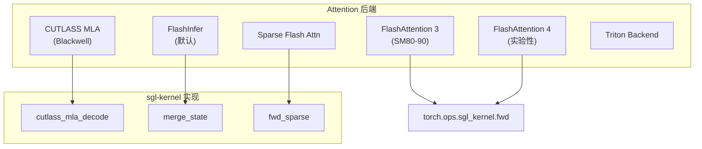
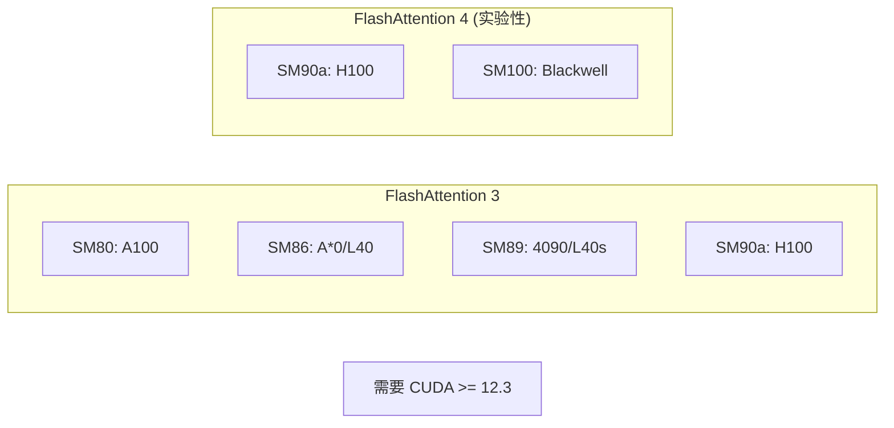
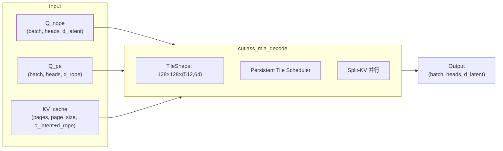
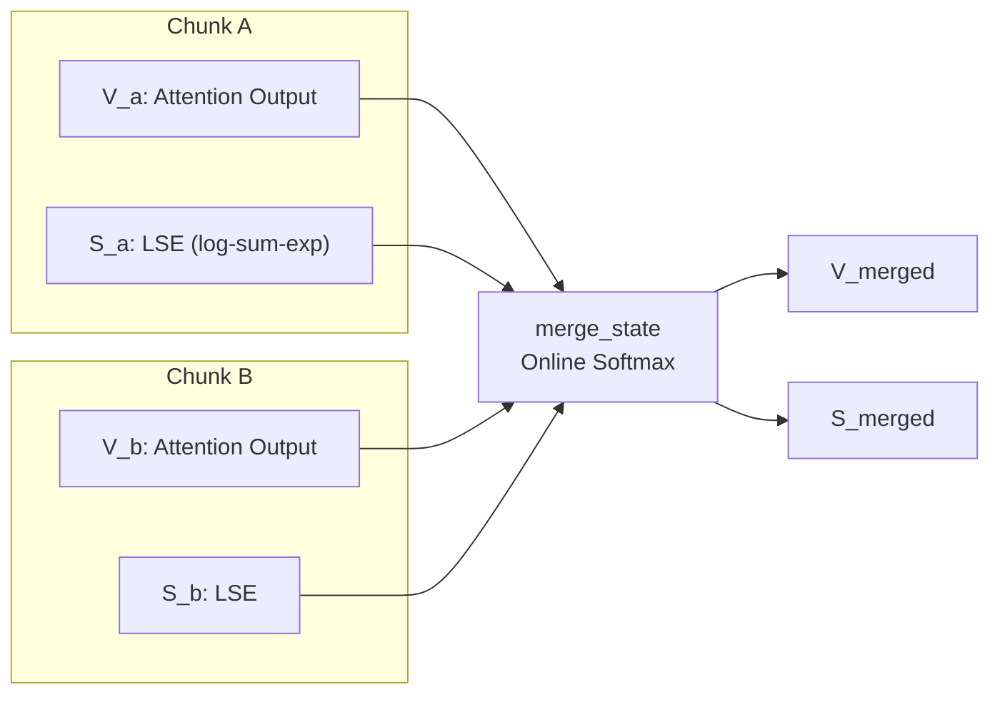
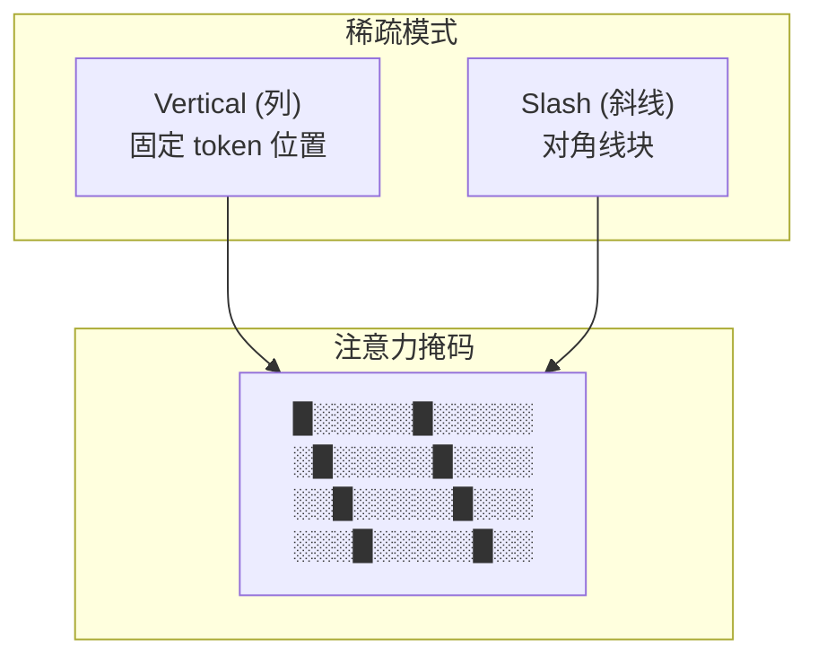
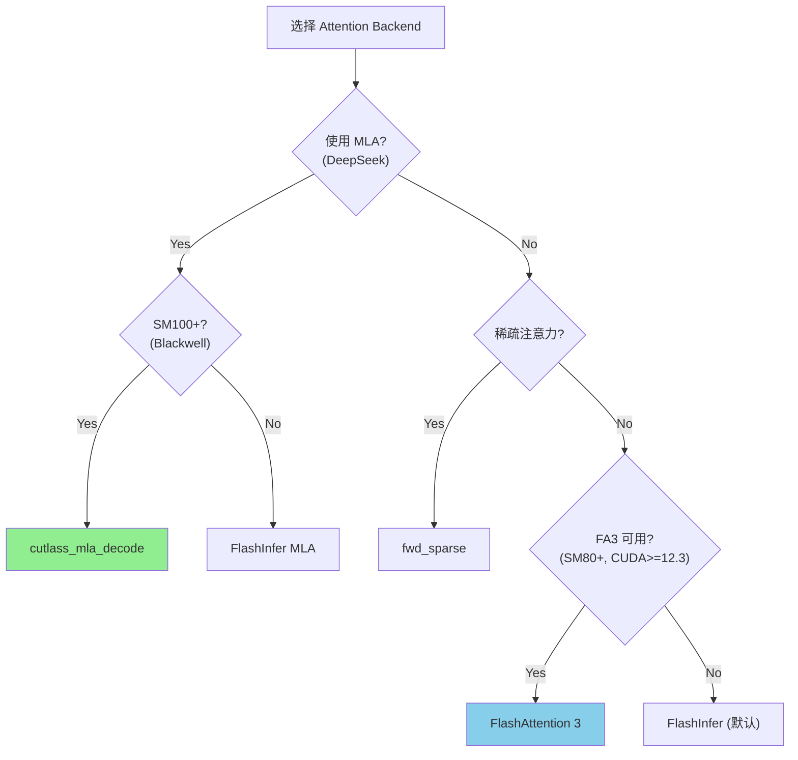

# SGLang Attention Kernel 实现详解

> **默认场景**: Qwen/Qwen3-VL-235B-A22B-Thinking 多模态模型
>
> **核心组件**: FlashAttention 3/4, CUTLASS MLA, Sparse Attention

## 1. 概览



### 1.1 Kernel 分类

| Kernel | 文件 | 硬件 | 用途 |
|--------|------|------|------|
| `fwd` | `flash_attn.py` | SM80+ | FA3/FA4 前向 |
| `cutlass_mla_decode` | `cutlass_mla_kernel.cu` | SM100 | DeepSeek MLA |
| `merge_state` | `merge_attn_states.cu` | All | 分块状态合并 |
| `fwd_sparse` | `vertical_slash_index.cu` | SM80+ | 稀疏注意力 |

## 2. FlashAttention 3/4 集成

### 2.1 支持矩阵



### 2.2 核心 API

```python
# flash_attn.py: flash_attn_with_kvcache
def flash_attn_with_kvcache(
    q,                    # (batch, seqlen_q, nheads, headdim)
    k_cache,              # (batch, seqlen_cache, nheads_k, headdim) or paged
    v_cache,              # (batch, seqlen_cache, nheads_k, headdim_v)
    k=None,               # 增量 KV 更新
    v=None,
    page_table=None,      # Paged KV Cache
    cache_seqlens=None,   # 当前序列长度
    softmax_scale=None,
    causal=False,
    window_size=(-1, -1), # 滑动窗口
    softcap=0.0,          # Softcap 激活阈值
    return_softmax_lse=False,
    ver=3,                # FA 版本: 3 或 4
):
    """
    Incremental decoding with KV cache update
    - 支持 paged KV cache (page_table)
    - 支持 GQA/MQA (nheads_k < nheads)
    - 支持 滑动窗口注意力
    """
```

```python
# flash_attn.py: flash_attn_varlen_func
def flash_attn_varlen_func(
    q,              # (total_q, nheads, headdim)
    k,              # (total_k, nheads_k, headdim)
    v,              # (total_k, nheads_k, headdim_v)
    cu_seqlens_q,   # (batch + 1,) cumulative 序列长度
    cu_seqlens_k,   # (batch + 1,)
    max_seqlen_q,
    max_seqlen_k,
    causal=False,
    softcap=0.0,
    ver=3,
):
    """
    可变长度批次 attention
    - Prefill 阶段使用
    - 支持 packed batching
    """
```

### 2.3 FA3 vs FA4 差异

| 特性 | FA3 | FA4 |
|------|-----|-----|
| 硬件要求 | SM80+ | SM90a+ |
| KV Cache 更新 | 支持 in-place | 不支持 |
| RoPE 融合 | 支持 | 不支持 |
| 稳定性 | 生产就绪 | 实验性 |

```python
# FA4 调用路径
if ver == 4:
    return flash_attn_varlen_func_v4(
        q=q, k=k_cache, v=v_cache,
        cu_seqlens_q=cu_seqlens_q,
        seqused_k=cache_seqlens,
        causal=causal,
        window_size=window_size,
        softcap=softcap,
        pack_gqa=pack_gqa,  # GQA 优化
        return_softmax_lse=return_softmax_lse,
    )
```

## 3. CUTLASS MLA (Multi-head Latent Attention)

### 3.1 DeepSeek MLA 架构



### 3.2 Kernel 实现

**文件**: `csrc/attention/cutlass_mla_kernel.cu`

```cpp
// MLA SM100 配置
template <typename T, bool IsPaged128>
struct MlaSm100 {
    using Element = T;
    using ElementAcc = float;
    
    // Tile 形状: (heads=128, kv_len=128, dims=(512,64))
    using TileShape = Shape<_128, _128, Shape<_512, _64>>;
    
    // 问题形状: (H, K, (D_latent, D_rope), B)
    using ProblemShape = tuple<TileShapeH, int, TileShapeD, int>;
    
    // 持久化 Tile 调度器 (更高吞吐)
    using TileScheduler = Sm100MlaPersistentTileScheduler;
    
    using FmhaKernel = Sm100FmhaMlaKernelTmaWarpspecialized<...>;
};
```

```cpp
void cutlass_mla_decode(
    torch::Tensor const& out,          // (batch, heads, d_latent)
    torch::Tensor const& q_nope,       // (batch, heads, d_latent)
    torch::Tensor const& q_pe,         // (batch, heads, d_rope)
    torch::Tensor const& kv_c_and_k_pe_cache,  // Paged KV
    torch::Tensor const& seq_lens,     // (batch,)
    torch::Tensor const& page_table,   // (batch, max_pages)
    torch::Tensor const& workspace,
    double sm_scale,
    int64_t num_kv_splits
) {
    // SM100 (Blackwell) 专用
    TORCH_CHECK(sm_version == 100);
    
    // 支持 FP16, BF16, FP8_E4M3
    if (in_dtype == at::ScalarType::Half) {
        runMla<cutlass::half_t, IsPaged128, ...>(...);
    } else if (in_dtype == at::ScalarType::BFloat16) {
        runMla<cutlass::bfloat16_t, IsPaged128, ...>(...);
    } else if (in_dtype == at::ScalarType::Float8_e4m3fn) {
        runMla<cutlass::float_e4m3_t, IsPaged128, ...>(...);
    }
}
```

### 3.3 Split-KV 优化

```python
# Workspace 大小计算
workspace_size = cutlass_mla_get_workspace_size(
    max_seq_len,     # 最大序列长度
    num_batches,     # batch 大小
    sm_count,        # SM 数量 (自动检测如果 <= 0)
    num_kv_splits    # KV 分割数
)
```

> **注意**: `num_kv_splits > 1` 时 Persistent Scheduler 有已知 bug，大 batch 可能 hang

## 4. 状态合并 (merge_state)

### 4.1 原理

基于论文 [Section 2.2](https://www.arxiv.org/pdf/2501.01005):



### 4.2 数学公式

```
max_lse = max(lse_a, lse_b)
p_se = exp(lse_a - max_lse)
s_se = exp(lse_b - max_lse)
out_se = p_se + s_se

scale_a = p_se / out_se
scale_b = s_se / out_se

output = v_a * scale_a + v_b * scale_b
output_lse = log(out_se) + max_lse
```

### 4.3 Kernel 实现

**文件**: `csrc/attention/merge_attn_states.cu`

```cpp
template <typename scalar_t, const uint NUM_THREADS>
__global__ void merge_attn_states_kernel(
    scalar_t* output,           // [n, h, d]
    float* output_lse,          // [n, h]
    const scalar_t* prefix_output,
    const float* prefix_lse,
    const scalar_t* suffix_output,
    const float* suffix_lse,
    const uint num_tokens,
    const uint num_heads,
    const uint head_size
) {
    // 128-bit 向量化加载 (Pack 8 个 float16)
    using pack_128b_t = uint4;
    const uint pack_size = 16 / sizeof(scalar_t);
    
    // 计算 scaling factors
    float p_lse = prefix_lse[...];
    float s_lse = suffix_lse[...];
    const float max_lse = fmaxf(p_lse, s_lse);
    const float p_se = expf(p_lse - max_lse);
    const float s_se = expf(s_lse - max_lse);
    const float p_scale = p_se / (p_se + s_se);
    const float s_scale = s_se / (p_se + s_se);
    
    // FMA 合并
    output[i] = prefix_output[i] * p_scale + suffix_output[i] * s_scale;
}
```

### 4.4 API

```python
# merge_state: flashinfer 风格 API
merge_state(v_a, s_a, v_b, s_b, v_merged, s_merged)

# merge_state_v2: 优化版本
merge_state_v2(v_a, s_a, v_b, s_b, v_merged, s_merged)

# 输入:
#   v_a, v_b: (seq_len, num_heads, head_dim)
#   s_a, s_b: (seq_len, num_heads)
# 输出:
#   v_merged: (seq_len, num_heads, head_dim)
#   s_merged: (seq_len, num_heads)
```

## 5. 稀疏注意力 (Sparse Flash Attention)

### 5.1 Vertical-Slash 稀疏模式

基于论文 [MInference](https://arxiv.org/abs/2407.02490) Appendix C.4.2:



### 5.2 索引转换

```python
def convert_vertical_slash_indexes(
    q_seqlens,         # [batch]
    kv_seqlens,        # [batch]
    vertical_indexes,  # [batch, heads, nnz_v] 垂直列索引
    slash_indexes,     # [batch, heads, nnz_s] 斜线块索引
    context_size,
    block_size_M,      # Query 块大小
    block_size_N,      # Key 块大小
    causal=True
) -> (block_count, block_offset, column_count, column_index):
    """
    将 vertical/slash 索引转换为 kernel 可用的块格式
    
    Returns:
        block_count:  (batch, heads, num_rows) 每行的块数
        block_offset: (batch, heads, num_rows, nnz_s) 块偏移
        column_count: (batch, heads, num_rows) 每行的列数
        column_index: (batch, heads, num_rows, nnz_v) 列索引
    """
```

### 5.3 稀疏 Attention API

```python
def sparse_attn_func(
    q, k, v,
    block_count, block_offset,   # Slash 模式
    column_count, column_index,  # Vertical 模式
    softmax_scale=None,
    causal=False,
    softcap=0.0,
    alibi_slopes=None,
    return_softmax_lse=False,
):
    """
    执行稀疏注意力计算
    
    Arguments:
        q: (batch, seqlen, nheads, headdim)
        k: (batch, seqlen, nheads_k, headdim)
        v: (batch, seqlen, nheads_k, headdim)
        block_count/offset: Slash 稀疏模式
        column_count/index: Vertical 稀疏模式
    """
    return torch.ops.sgl_kernel.fwd_sparse.default(...)

def sparse_attn_varlen_func(
    q, k, v,
    block_count, block_offset,
    column_count, column_index,
    cu_seqlens_q, cu_seqlens_k,
    max_seqlen_q, max_seqlen_k,
    ...
):
    """可变长度版本的稀疏注意力"""
```

## 6. 后端选择逻辑



## 7. 性能优化

### 7.1 最佳实践

| 场景 | 推荐 Backend | 理由 |
|------|-------------|------|
| DeepSeek V3 on Blackwell | `cutlass_mla_decode` | MLA 原生支持 |
| 长序列 prefill | `flash_attn_varlen_func` | FA3 高效分块 |
| 混合稀疏长序列 | `sparse_attn_varlen_func` | 减少计算量 |
| 高吞吐 decode | FlashInfer | 高度优化的 decode |

### 7.2 内存优化

```python
# 分块 prefill 使用 merge_state
for chunk in chunks:
    v_chunk, lse_chunk = flash_attn_varlen_func(...)
    merge_state(v_acc, lse_acc, v_chunk, lse_chunk, v_acc, lse_acc)
```

### 7.3 CUDA Graph 支持

```python
# FlashAttention 支持 CUDA Graph capture
with torch.cuda.graph(graph):
    out = flash_attn_with_kvcache(q, k_cache, v_cache, ...)
```

## 8. 调试

### 8.1 版本检查

```python
from sgl_kernel.flash_attn import is_fa3_supported

if is_fa3_supported():
    print("FA3 available")
else:
    print("FA3 not available, using FlashInfer")
```

### 8.2 常见问题

| 问题 | 原因 | 解决 |
|------|------|------|
| `cutlass_mla_decode` 失败 | 非 SM100 | 使用 FlashInfer MLA |
| FA4 不支持 KV 更新 | 设计限制 | 使用 FA3 |
| 大 batch MLA hang | Split-KV bug | 设置 `num_kv_splits=1` |

## 9. 下一步

- **17**: MoE kernel 详解 (路由, Grouped GEMM)
