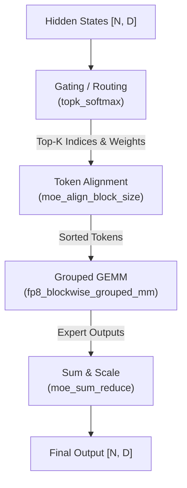

# SGLang MoE Kernel 实现详解

> **默认场景**: Qwen3.5 混合架构模型（Full Attention + Linear Attention/GatedDeltaNet + MoE + MTP）
>
> **核心组件**: Fused Gating, Token Alignment, Grouped GEMM, Token Dispatcher, MoE Runner

## 1. MoE 执行流程

MoE (Mixture-of-Experts) 的执行通常分为三个阶段：路由、对齐、专家计算。



## 2. 路由 (Routing / Gating)

### 2.1 标准 Top-K Softmax
`topk_softmax` 是最基础的路由方式，通过 softmax 获取概率并采样前 K 个专家。

```python
# moe.py: topk_softmax
topk_softmax(
    topk_weights,      # [num_tokens, topk]
    topk_ids,          # [num_tokens, topk]
    gating_output,     # [num_tokens, num_experts]
    renormalize=True,  # 重新归一化权重
    moe_softcapping=0.0 # Tanh softcapping
)
```

### 2.2 层级路由 (Fused Grouped Gating)
针对大规模专家系统 (如 256 专家)，常用的层级分组路由。

```python
# moe.py: moe_fused_gate
moe_fused_gate(
    input_tensor,                  # [num_tokens, num_experts] 门控 logits
    bias,                          # 门控偏置 (可选，用于调整专家选择倾向)
    num_expert_group,              # 分组数量 (如 256 专家分为 8 组)
    topk_group,                    # 组内 TopK (先选中若干组)
    topk,                          # 总共选中的专家数 (跨组合计)
    routed_scaling_factor,         # 路由缩放因子 (routed+shared expert 融合后的归一化系数)
    num_fused_shared_experts,      # 融合共享专家数量 (控制是否将 routed 和 shared expert 融合)
    ...
)
```
- **原理**: 先选组，再在组内选专家。
- **限制**: 专家总数通常需要是 2 的幂，每组专家数 <= 32。
- **`num_fused_shared_experts`**: 控制是否将 routed expert 和 shared expert 融合为一次 GEMM。当此值 > 0 时，shared expert 被视为额外的 routed expert 参与统一的 Grouped GEMM 计算，避免单独的 shared expert forward pass。
- **`routed_scaling_factor`**: 当 routed expert 和 shared expert 融合后，需要对 routed expert 的输出进行归一化缩放，以保持融合前后的数值一致性。该因子在 DeepSeek-V3 等模型中使用。

### 2.3 Sigmoid TopK 路由
`topk_sigmoid` 是基于 sigmoid 的 TopK 路由方式，替代传统的 softmax TopK。适用于某些模型架构中 sigmoid 门控优于 softmax 的场景。

| 函数 | 功能 | 简要说明 |
|------|------|----------|
| `topk_sigmoid` | 基于 sigmoid 的 TopK 路由 | 对 gating_output 做 sigmoid 后选取前 K 个专家，替代 softmax 方案 |

### 2.4 Kimi K2 专用路由
`kimi_k2_moe_fused_gate` 是为 Moonshot K2 模型优化的简化版路由，移除了复杂的分组逻辑。

### 2.5 MoE 输入预处理与输出聚合

以下算子在 MoE 执行流程的输入端和输出端发挥作用：

| 函数 | 功能 | 简要说明 |
|------|------|----------|
| `prepare_moe_input` | MoE 输入预处理 | 在路由完成后、专家计算前，准备 token 分发所需的中间数据结构（排序索引、专家偏移等） |
| `apply_shuffle_mul_sum` | Shuffle + 乘加融合 | 将 token 位置重排（shuffle）、权重乘法和求和三步融合为一个 kernel，减少显存读写 |
| `moe_sum` | MoE 输出求和 | 将各 TopK 专家的输出按路由权重加权求和，得到最终 token 表示 |

## 3. Token 对齐 (Token Alignment)

由于不同 token 会被路由到不同专家，为了利用 Tensor Core 的批处理能力，必须将相同专家的 token 聚合在一起。

### 3.1 对齐算法
`moe_align_block_size` 负责计算每个专家收到的 token 数量，并生成排序索引。

```python
# moe.py: moe_align_block_size
moe_align_block_size(
    topk_ids, num_experts, block_size,
    sorted_token_ids,   # [num_tokens * topk] 输出聚合后的索引
    experts_ids,        # [num_tokens * topk]
    num_tokens_post_pad,# [num_experts] 每个专家实际处理的 token 数 (含对齐 padding)
    cumsum_buffer       # 前缀和缓冲区
)
```

**关键优化**:
- **Block Size**: 专家计算通常按 Block (如 64 或 128) 对齐，不足部分会进行 Padding 以确性能稳定。

## 4. 专家计算 (Grouped GEMM)

对齐后，所有专家的计算被视作为一个 Grouped GEMM 任务。

### 4.1 FP8 Blockwise Grouped GEMM
在 DeepSeek-V3 等模型中，广泛使用 FP8 块级量化。

```python
# moe.py: fp8_blockwise_scaled_grouped_mm
fp8_blockwise_scaled_grouped_mm(
    output,
    a_ptrs, b_ptrs,      # token 和专家的指针列表
    a_scales_ptrs, ...   # 缩放因子指针
    problem_sizes,       # 每个专家计算的 M, N, K 列表
    expert_offsets,      # 专家起始位置
    ...
)
```

### 4.2 Marlin MoE (W4A16)
对于 4-bit 量化权重、16-bit 激活的模型，使用 Marlin 优化的 MoE Kernel：
`moe_wna16_marlin_gemm`。

## 5. SM100 (Blackwell) 专家特化

在最新的 SM100 架构上，`sgl-kernel` 引入了 `expert_specialization` 优化。

### 5.1 MXFP8 / NVFP4 支持
- `es_sm100_mxfp8_blockscaled_grouped_mm`: 利用 SM100 的 MXFP8 加速层级量化。
- `cutlass_fp4_group_mm`: 高性能 FP4 专家计算。

```python
# nvfp4_blockwise_moe.cu 实现了针对 Blackwell 的块级量化
```

## 6. 特殊算子

### 6.1 Fused QK-Norm + RoPE
在多模态或某些长文本模型中，Q/K 需要先 Norm 后应用 RoPE。
`fused_qk_norm_rope` 将这两个操作融合，减少显存读写。

### 6.2 Shuffle Rows
在专家计算前后，经常需要对 token 进行位置重排。`shuffle_rows` (或 `shuffle_rows_tensor`) 实现了基于映射表的行重排序，是 MoE token 分发/收集的核心原语。

**来源**: `csrc/moe/` (如 `csrc.py` L363-388)

```python
# 前向接口
shuffle_fwd(
    input_tensor,         # [M, K] 输入张量
    dst2src_map,          # [M_out] 目标行 → 源行的映射索引
    out_tensor,           # [M_out, K] 预分配输出张量
    output_tensor_shape,  # 输出形状 (M_out, K)
) -> torch.Tensor
```

- **分发 (Scatter)**: 路由完成后，根据 `dst2src_map` 将各 token 从原始位置搬运到对应专家的连续区间。
- **收集 (Gather)**: 专家计算完成后，通过逆映射将结果还原到原始 token 顺序。
- 与 `moe_align_block_size` 配合使用：后者生成排序索引，`shuffle_fwd` 执行实际的数据搬运。

## 7. Expert Specialization (专家专精化)

Expert Specialization 是一种优化策略，将特定专家绑定到特定的 GPU/SM 上执行，从而减少通信开销并提升计算效率。`sgl-kernel` 为此场景提供了专用的 Grouped GEMM 实现，覆盖不同精度和后端。

### 7.1 核心 API

| 函数 | 功能 | 说明 |
|------|------|------|
| `es_fp8_blockwise_scaled_grouped_mm_quest` | 量化 FP8 block-scaled grouped GEMM (Quest 变体) | 结合 Quest 量化策略的 FP8 块级缩放分组矩阵乘法，针对 Expert Specialization 场景优化 |
| `es_asm_fp8_blockwise_scaled_grouped_mm` | ASM 汇编版 FP8 grouped GEMM | 手写 PTX/SASS 汇编实现，在特定 SM 架构上获得极致性能 |
| `es_fp8_blockwise_scaled_grouped_mm` | 标准 FP8 grouped GEMM | Expert Specialization 场景下的标准 FP8 块级缩放分组矩阵乘法 |
| `es_fp16_blockscale_grouped_mm_op` | FP16 block-scale grouped GEMM | 约 SM90 级别的 FP16 块级缩放分组矩阵乘法，适用于不需要 FP8 量化的场景 |

### 7.2 与通用 MoE Grouped GEMM 的区别

- **通用 Grouped GEMM** (如 `fp8_blockwise_scaled_grouped_mm`): 所有专家在同一 GPU 上执行，通过 `expert_offsets` 区分不同专家的计算边界。
- **ES Grouped GEMM**: 每个 GPU 只负责部分专家的计算，输入已按专家预分配，`dst2src_map` 用于 token 重映射。通信量更小，适合大规模部署。

### 7.3 精度选择

- **FP8 (quest/asm/标准)**: 适用于 SM89/SM90 架构，三种实现提供不同的性能-灵活性权衡。ASM 版本性能最高但可移植性最低。
- **FP16**: 适用于对精度敏感或不支持 FP8 的场景。

## 8. 调试与性能建议

- **对齐开销**: 如果 `block_size` 过大且 batch 较小，Padding 比例会很高，此时应减小 `block_size`。
- **路由均衡**: 使用 `SGLANG_LOG_LEVEL=debug` 查看路由分布，检查是否有专家负载过重。
- **量化切换**: 在 SM89/SM90 上，优先尝试 `fp8_blockwise`；在旧显卡上使用 Marlin。

## 9. 下一步

- **18**: 量化实现详解 (FP8, INT8, FP4, Marlin)
