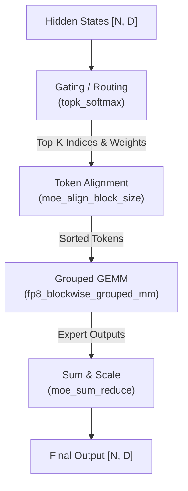

# SGLang MoE Kernel 实现详解

> **默认场景**: DeepSeek-V3 / Qwen2-57B-A14B
>
> **核心组件**: Fused Gating, Token Alignment, Grouped GEMM

## 1. MoE 执行流程

MoE (Mixture-of-Experts) 的执行通常分为三个阶段：路由、对齐、专家计算。



## 2. 路由 (Routing / Gating)

### 2.1 标准 Top-K Softmax
`topk_softmax` 是最基础的路由方式，通过 softmax 获取概率并采样前 K 个专家。

```python
# moe.py: topk_softmax
topk_softmax(
    topk_weights,      # [num_tokens, topk]
    topk_ids,          # [num_tokens, topk]
    gating_output,     # [num_tokens, num_experts]
    renormalize=True,  # 重新归一化权重
    moe_softcapping=0.0 # Tanh softcapping
)
```

### 2.2 层级路由 (Fused Grouped Gating)
针对大规模专家系统 (如 256 专家)，常用的层级分组路由。

```python
# moe.py: moe_fused_gate
moe_fused_gate(
    input_tensor,
    num_expert_group, # 分组数
    topk_group,       # 选中的组数
    topk,             # 总共选中的专家数
    ...
)
```
- **原理**: 先选组，再在组内选专家。
- **限制**: 专家总数通常需要是 2 的幂，每组专家数 <= 32。

### 2.3 Kimi K2 专用路由
`kimi_k2_moe_fused_gate` 是为 Moonshot K2 模型优化的简化版路由，移除了复杂的分组逻辑。

## 3. Token 对齐 (Token Alignment)

由于不同 token 会被路由到不同专家，为了利用 Tensor Core 的批处理能力，必须将相同专家的 token 聚合在一起。

### 3.1 对齐算法
`moe_align_block_size` 负责计算每个专家收到的 token 数量，并生成排序索引。

```python
# moe.py: moe_align_block_size
moe_align_block_size(
    topk_ids, num_experts, block_size,
    sorted_token_ids,   # [num_tokens * topk] 输出聚合后的索引
    experts_ids,        # [num_tokens * topk]
    num_tokens_post_pad,# [num_experts] 每个专家实际处理的 token 数 (含对齐 padding)
    cumsum_buffer       # 前缀和缓冲区
)
```

**关键优化**:
- **Block Size**: 专家计算通常按 Block (如 64 或 128) 对齐，不足部分会进行 Padding 以确性能稳定。

## 4. 专家计算 (Grouped GEMM)

对齐后，所有专家的计算被视作为一个 Grouped GEMM 任务。

### 4.1 FP8 Blockwise Grouped GEMM
在 DeepSeek-V3 等模型中，广泛使用 FP8 块级量化。

```python
# moe.py: fp8_blockwise_scaled_grouped_mm
fp8_blockwise_scaled_grouped_mm(
    output,
    a_ptrs, b_ptrs,      # token 和专家的指针列表
    a_scales_ptrs, ...   # 缩放因子指针
    problem_sizes,       # 每个专家计算的 M, N, K 列表
    expert_offsets,      # 专家起始位置
    ...
)
```

### 4.2 Marlin MoE (W4A16)
对于 4-bit 量化权重、16-bit 激活的模型，使用 Marlin 优化的 MoE Kernel：
`moe_wna16_marlin_gemm`。

## 5. SM100 (Blackwell) 专家特化

在最新的 SM100 架构上，`sgl-kernel` 引入了 `expert_specialization` 优化。

### 5.1 MXFP8 / NVFP4 支持
- `es_sm100_mxfp8_blockscaled_grouped_mm`: 利用 SM100 的 MXFP8 加速层级量化。
- `cutlass_fp4_group_mm`: 高性能 FP4 专家计算。

```python
# nvfp4_blockwise_moe.cu 实现了针对 Blackwell 的块级量化
```

## 6. 特殊算子

### 6.1 Fused QK-Norm + RoPE
在多模态或某些长文本模型中，Q/K 需要先 Norm 后应用 RoPE。
`fused_qk_norm_rope` 将这两个操作融合，减少显存读写。

### 6.2 Shuffle Rows
在专家计算前后，经常需要对 token 进行位置重拍：
`shuffle_rows(input_tensor, dst2src_map, output_tensor)`。

## 7. 调试与性能建议

- **对齐开销**: 如果 `block_size` 过大且 batch 较小，Padding 比例会很高，此时应减小 `block_size`。
- **路由均衡**: 使用 `SGLANG_LOG_LEVEL=debug` 查看路由分布，检查是否有专家负载过重。
- **量化切换**: 在 SM89/SM90 上，优先尝试 `fp8_blockwise`；在旧显卡上使用 Marlin。

## 8. 下一步

- **18**: 量化实现详解 (FP8, INT8, FP4, Marlin)
