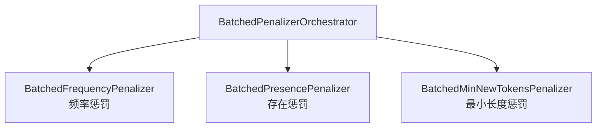
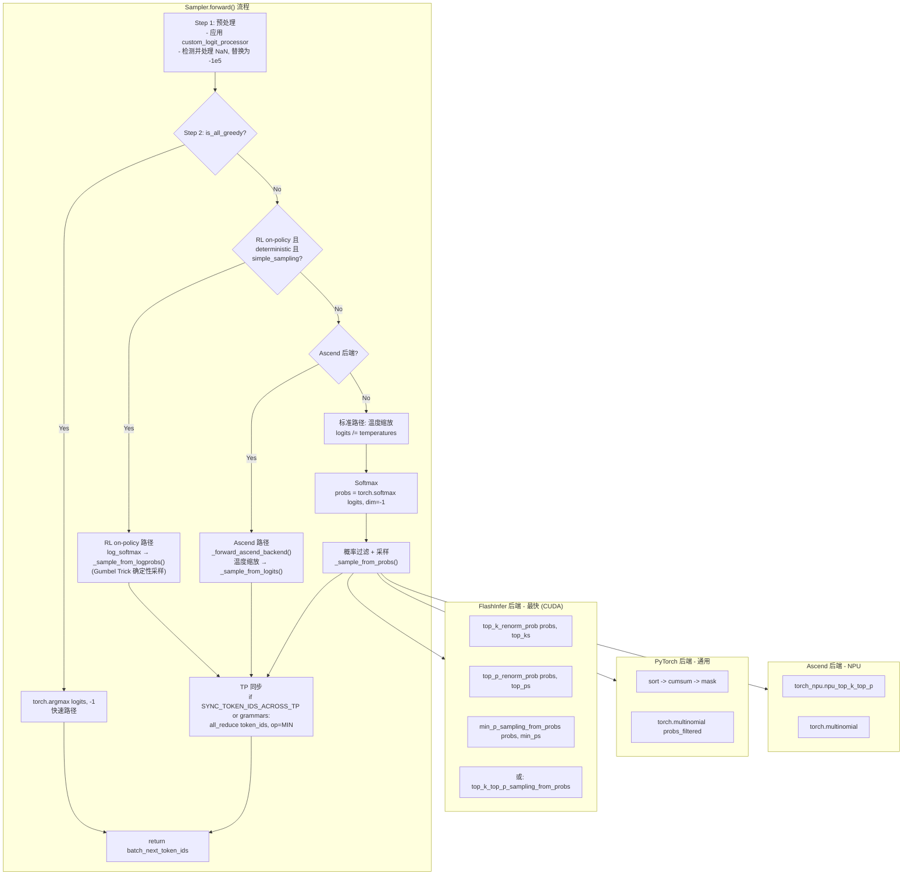
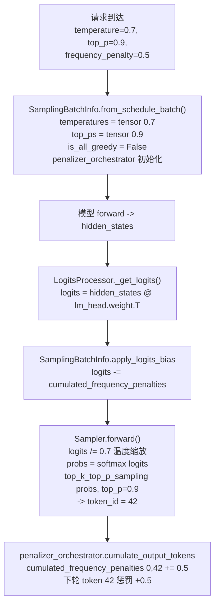

# SGLang 采样与生成控制详解

> **默认场景**: Qwen3.5 混合架构模型（Full Attention + Linear Attention/GatedDeltaNet + MoE + MTP）
>
> **启用特性**: PD 分离 + Chunked Prefill + ViT DP + Overlap Schedule + 多模态缓存 + EPLB + MTP + 线性注意力
>
> **核心组件**: SamplingParams, SamplingBatchInfo, LogitsProcessor, Sampler, PenaltyLib

## 1. 概览

采样（Sampling）是 LLM 推理中从 logits 到 token 的最后一环。SGLang 实现了完整的采样管道：


**核心文件**:
- `srt/sampling/sampling_params.py` — 采样参数定义
- `srt/sampling/sampling_batch_info.py` — 批次级采样状态
- `srt/sampling/penaltylib/` — 惩罚机制 (频率/存在/最小长度)
- `srt/sampling/custom_logit_processor.py` — 自定义 logit 处理器
- `srt/layers/logits_processor.py` — LogitsProcessor 层
- `srt/layers/sampler.py` — Sampler 实现

## 2. SamplingParams

**文件**: `srt/sampling/sampling_params.py`

每个请求携带一个 `SamplingParams` 实例，定义该请求的采样行为。

### 2.1 核心参数

```python
class SamplingParams:
    # ========== 温度与概率过滤 ==========
    temperature: float = 1.0       # 控制随机性 (0=贪婪, 1=标准)
    top_p: float = 1.0             # Nucleus 采样阈值 (0, 1]
    top_k: int = -1                # 保留 top-k 个 token (-1=不限)
    min_p: float = 0.0             # 最小概率阈值 [0, 1]

    # ========== 惩罚机制 ==========
    frequency_penalty: float = 0.0  # 频率惩罚 [-2, 2]，按出现次数累加
    presence_penalty: float = 0.0   # 存在惩罚 [-2, 2]，按是否出现
    repetition_penalty: float = 1.0 # 乘法惩罚 [0, 2] (参数已定义但 penaltylib 中无对应实现，保留用于兼容 HF generation config)

    # ========== 生成约束 ==========
    min_new_tokens: int = 0        # 最小输出长度
    max_new_tokens: int = 128      # 最大输出长度

    # ========== 停止条件 ==========
    stop: Optional[Union[str, List[str]]] = None
    stop_token_ids: Optional[List[int]] = None
    ignore_eos: bool = False

    # ========== 结构化生成 ==========
    json_schema: Optional[str] = None
    regex: Optional[str] = None
    ebnf: Optional[str] = None
    structural_tag: Optional[str] = None       # 结构化标签约束（XML/HTML 标签等）

    # ========== 停止正则 ==========
    stop_regex: Optional[Union[str, List[str]]] = None  # 停止正则表达式

    # ========== 并行采样 ==========
    n: int = 1                                 # 每个请求的采样数量

    # ========== 输出控制 ==========
    no_stop_trim: bool = False                 # 控制停止 token 是否从输出中修剪
    spaces_between_special_tokens: bool = True # 特殊 token 之间加空格

    # ========== Logit 偏置 ==========
    logit_bias: Optional[Dict[str, float]] = None  # token_id → bias

    # ========== 自定义参数 ==========
    custom_params: Optional[Dict[str, Any]] = None  # 传给 CustomLogitProcessor 的自定义参数

    # ========== 确定性采样 ==========
    sampling_seed: Optional[int] = None
```

### 2.2 贪婪检测

```python
# temperature < 1e-6 时自动切换为贪婪模式
if temperature < _SAMPLING_EPS:
    top_k = 1  # 等价于 argmax
```

### 2.3 常量

```python
TOP_K_ALL = 1 << 30  # 1,073,741,824，表示"不限制 top-k"
```

## 3. SamplingBatchInfo

**文件**: `srt/sampling/sampling_batch_info.py`

将多个请求的 `SamplingParams` 批量化为张量，供 GPU 并行处理。

### 3.1 核心字段

```python
@dataclasses.dataclass
class SamplingBatchInfo:
    # ========== 批量采样参数 (GPU Tensor) ==========
    temperatures: torch.Tensor       # [batch_size, 1]
    top_ps: torch.Tensor             # [batch_size]
    top_ks: torch.Tensor             # [batch_size], int32
    min_ps: torch.Tensor             # [batch_size]

    # ========== 优化标记 ==========
    is_all_greedy: bool              # 全部请求为贪婪 → 走 argmax 快速路径
    need_top_p_sampling: bool        # 是否有请求使用 top_p
    need_top_k_sampling: bool        # 是否有请求使用 top_k
    need_min_p_sampling: bool        # 是否有请求使用 min_p

    # ========== Grammar 约束 ==========
    vocab_size: int                  # 词表大小
    grammars: Optional[List]
    vocab_mask: Optional[torch.Tensor]  # [batch_size, vocab_size]
    apply_mask_func: Optional[Callable]  # Grammar 掩码应用函数

    # ========== 惩罚管理 ==========
    penalizer_orchestrator: BatchedPenalizerOrchestrator
    acc_linear_penalties: torch.Tensor  # [batch_size, vocab_size], overlap 模式预计算

    # ========== 自定义处理器 ==========
    has_custom_logit_processor: bool  # 是否有自定义 logit processor
    custom_params: Optional[List[Optional[Dict[str, Any]]]]  # 每个请求的自定义参数列表
    custom_logit_processor: Optional[Dict]

    # ========== 确定性采样 ==========
    sampling_seed: Optional[torch.Tensor] = None  # [batch_size], int64, 配合 enable_deterministic_inference 使用

    # ========== 设备 ==========
    device: str = "cuda"              # 设备类型 ("cuda", "npu" 等)

    # ========== Logit 偏置 ==========
    logit_bias: Optional[torch.Tensor] = None  # [batch_size, vocab_size]
```

### 3.2 创建流程

```python
@classmethod
def from_schedule_batch(cls, batch: ScheduleBatch, vocab_size: int):
    """从 ScheduleBatch 构建 SamplingBatchInfo"""
    # 1. 提取每个请求的采样参数
    temperatures = [req.sampling_params.temperature for req in batch.reqs]
    top_ps = [req.sampling_params.top_p for req in batch.reqs]
    # ...

    # 2. 转为 GPU Tensor
    temperatures = torch.tensor(temperatures, device="cuda").unsqueeze(1)

    # 3. 初始化惩罚管理器
    penalizer_orchestrator = BatchedPenalizerOrchestrator(
        vocab_size, batch,
        {BatchedFrequencyPenalizer, BatchedPresencePenalizer, BatchedMinNewTokensPenalizer}
    )

    # 4. 设置优化标记
    is_all_greedy = all(r.sampling_params.top_k <= 1 for r in reqs)
    # top_k=0 和 top_k=1 都等价于贪婪采样
```

### 3.3 apply_logits_bias

在采样前统一应用所有 logit 修改：

```python
def apply_logits_bias(self, logits: torch.Tensor):
    # 1. 累积惩罚 (overlap 模式预计算)
    if self.acc_linear_penalties is not None:
        logits.add_(self.acc_linear_penalties)

    # 2. 直接应用惩罚 (non-overlap 模式)
    if self.penalizer_orchestrator and self.penalizer_orchestrator.is_required:
        self.penalizer_orchestrator.apply(logits)
    # 注意: Step 1 和 Step 2 互斥 —— overlap 模式在 update_penalties() 中预计算
    # acc_linear_penalties 并在此处一次性加上; non-overlap 模式则在此处直接调用
    # orchestrator.apply() 实时计算并应用惩罚

    # 3. Grammar 词表掩码 (将非法 token 设为 -inf)
    if self.vocab_mask is not None:
        self.apply_mask_func(logits, self.vocab_mask)

    # 4. 用户指定的 logit_bias
    if self.logit_bias is not None:
        logits.add_(self.logit_bias)
```

## 4. 惩罚机制 (PenaltyLib)

**文件**: `srt/sampling/penaltylib/`

SGLang 使用 Orchestrator 模式管理三种惩罚器。

### 4.1 架构



### 4.2 频率惩罚 (Frequency Penalty)

按 token 被采样的**次数**累加惩罚。

```
token 42 被采样 3 次, frequency_penalty = 0.5
→ penalty = 3 × 0.5 = 1.5
→ logits[42] -= 1.5 (越采样越不可能)
```

```python
# 每次采样后累加
cumulated_frequency_penalties.scatter_add_(
    dim=1, index=output_ids.unsqueeze(1), src=frequency_penalties
)
# 应用时
logits -= cumulated_frequency_penalties
```

### 4.3 存在惩罚 (Presence Penalty)

只关心 token **是否出现过**，不关心频率。

```
token 100 被采样 5 次, presence_penalty = 0.2
→ penalty = 0.2 (固定，不随次数增加)
→ logits[100] -= 0.2
```

```python
# 使用 scatter_ (非 scatter_add_)，只设置一次
cumulated_presence_penalties.scatter_(
    dim=1, index=output_ids.unsqueeze(1), src=presence_penalties
)
```

### 4.4 最小长度惩罚 (Min New Tokens)

在达到最小输出长度前，将停止 token 的 logit 设为 `-inf`。

```python
# 初始化时将 stop token 位置标记为 -inf
stop_token_penalties[stop_token_positions] = float("-inf")

# 采样时: 长度不够 → 加 -inf，使 stop token 不可能被采样
mask = (len_output_tokens < min_new_tokens)
logits[mask] += stop_token_penalties[mask]
```

### 4.5 Orchestrator 生命周期

```python
# 1. 创建时: 检查是否需要激活各惩罚器
orchestrator = BatchedPenalizerOrchestrator(vocab_size, batch, penalizer_set)

# 2. 每轮采样后: 更新状态
orchestrator.cumulate_output_tokens(sampled_token_ids)

# 3. 下轮采样前: 应用惩罚
orchestrator.apply(logits)  # in-place 修改 logits

# 4. 请求完成时: 清理
orchestrator.filter(keep_indices)  # 或
orchestrator.release()
```

## 5. LogitsProcessor

**文件**: `srt/layers/logits_processor.py`

负责将模型的 hidden states 转换为 logits。

### 5.1 计算流程

```python
class LogitsProcessor(nn.Module):
    def _get_logits(self, hidden_states, lm_head, logits_metadata):
        # 1. 线性投影: hidden_states @ lm_head.weight.T
        logits = lm_head(hidden_states)

        # 2. Tensor Parallel: all-gather (多 GPU 场景)
        if tp_size > 1:
            logits = tensor_model_parallel_all_gather(logits)

        # 3. Logit 缩放
        logits *= self.logit_scale

        # 4. Final logit softcapping (tanh)
        if self.final_logit_softcapping:
            logits = logits / cap
            logits = torch.tanh(logits)
            logits = logits * cap

        return logits
```

### 5.2 LogitsProcessorOutput

```python
@dataclass
class LogitsProcessorOutput:
    ## Part 1: LogitsProcessor 生成 (logits_processor.py)
    next_token_logits: Optional[torch.Tensor]   # [#seq, vocab_size]，prefill-only scoring 时可为 None
    hidden_states: Optional[torch.Tensor]        # 用于投机解码 (EAGLE) 的最后隐层

    ## Part 2: Sampler 填充 (sampler.py)
    next_token_logprobs: Optional[torch.Tensor]  # 输出 token 的 log prob
    next_token_top_logprobs_val: Optional[List]  # 输出位置 top-k logprob 值 [#seq, k]
    next_token_top_logprobs_idx: Optional[List]  # 输出位置 top-k logprob 索引 [#seq, k]
    next_token_token_ids_logprobs_val: Optional[List[Union[List[float], Tensor]]]
        # 指定 token id 的 logprob 值（可为 list 或 GPU tensor，延迟拷贝优化）
    next_token_token_ids_logprobs_idx: Optional[List]
        # 指定 token 的索引

    ## Part 3: Prefill-only (LogitsProcessor 生成)
    input_token_logprobs: Optional[torch.Tensor] # 输入 token 的 logprob [#token]
    input_top_logprobs_val: Optional[List]        # 输入位置 top-k logprob 值 [#seq, #token, k]
    input_top_logprobs_idx: Optional[List]        # 输入位置 top-k logprob 索引
    input_token_ids_logprobs_val: Optional[List[Union[List[float], Tensor]]]
        # 输入位置指定 token 的 logprob 值
    input_token_ids_logprobs_idx: Optional[List]  # 输入位置指定 token 的索引

    ## Part 4: Diffusion LLM 专用
    full_logits: Optional[torch.Tensor]           # 完整 logits（用于 no-sample / diffusion 场景）
```

> **说明**: Part 2 中的 `next_token_token_ids_logprobs_val/idx` 用于用户指定 `token_ids_logprobs` 参数时，返回特定 token 的 logprob 值。Part 3 在 prefill-only scoring 场景下填充（如 multi-item scoring），计算输入 token 的 logprob。

## 6. Sampler

**文件**: `srt/layers/sampler.py`

核心采样逻辑：从 logits 到 token ID。

### 6.1 完整流程

> **调用关系**: `apply_logits_bias()` 在 `Sampler.forward()` 之前由 ModelRunner 调用（见 Section 3.3），完成惩罚/Grammar/Bias 的 logit 修改后，logits 才传入 Sampler。



### 6.2 采样后端注册

SGLang 支持三种内置采样后端和自定义后端注册机制：

```python
# sampler.py
_BUILT_IN_SAMPLING_BACKENDS = {"flashinfer", "pytorch", "ascend"}
_CUSTOM_SAMPLER_FACTORIES: Dict[str, Callable[[], "Sampler"]] = {}

def register_sampler_backend(backend: str, factory: Callable[[], "Sampler"]) -> None:
    """注册自定义采样后端工厂函数"""
    SAMPLING_BACKEND_CHOICES.add(backend)
    _CUSTOM_SAMPLER_FACTORIES[backend] = factory

def create_sampler(backend: Optional[str] = None) -> Sampler:
    """创建采样器，优先查找自定义注册，再 fallback 到内置后端"""
    if backend in _CUSTOM_SAMPLER_FACTORIES:
        return _CUSTOM_SAMPLER_FACTORIES[backend]()
    if backend is None or backend in _BUILT_IN_SAMPLING_BACKENDS:
        return Sampler()
    raise ValueError(f"Unknown sampling backend '{backend}'")
```

| 后端 | 底层接口 | 特点 |
|------|----------|------|
| `flashinfer` | sgl-kernel (`top_k_top_p_sampling_from_probs`) | GPU rejection sampling，最高性能 |
| `pytorch` | `torch.multinomial` | 纯 PyTorch 实现，通用 fallback |
| `ascend` | `torch_npu.npu_top_k_top_p` | 华为 NPU 专用，独立采样路径 |

> **Ascend 后端特殊点**: Ascend 后端走独立的 `_forward_ascend_backend()` 路径，而非标准的 softmax → `_sample_from_probs()` 流程。该路径先做温度缩放 (`logits /= temperatures`)，然后调用 `_sample_from_logits()` 直接从 logits 采样（NPU 融合 kernel 内部处理 softmax）。仅在需要 `return_logprob` 且未设置 `SGLANG_RETURN_ORIGINAL_LOGPROB` 时才额外计算 `log_softmax`。

### 6.3 Top-K / Top-P / Min-P 过滤算法

| 算法 | 原理 | 示例 |
|------|------|------|
| **Top-K** | 保留概率最高的 K 个 token，其余设为 0 | top_k=50 → 只从前 50 个 token 中采样 |
| **Top-P** | 按概率降序累加到 P 为止，保留这些 token | top_p=0.9 → 保留累积概率达 90% 的 token |
| **Min-P** | 保留概率 ≥ max_prob × min_p 的 token | min_p=0.1, max=0.5 → 保留 prob≥0.05 的 |

**应用顺序**:
- `"top_k_first"`: 先 top-k → 再 top-p（分两步 kernel）
- `"joint"`: 单 kernel 同时应用（更高效）

### 6.4 确定性采样

通过 Gumbel Trick + MurmurHash3 实现可复现的采样：

```python
# srt/layers/utils/hash.py — Triton 实现的 MurmurHash3 32-bit
# 输入: (seed, position, col_index) 三元组，每个 vocab token 有独立哈希值
hash_val = murmur_hash32(seed, positions, col_indices)

# 哈希值转均匀分布 [0, 1)
uniform = hash_val.float() / (2**32)

# Gumbel Trick: argmax(log_probs + gumbel_noise) 等价于 multinomial 采样
gumbel_noise = -log(-log(uniform))
token = argmax(log(probs) + gumbel_noise)
```

> **注意**: Section 11.1 详述了从旧版简单哈希到 MurmurHash3 的演进。

### 6.5 TP 同步条件

在 TP（Tensor Parallel）多卡场景下，各 rank 独立执行 sampling，可能因浮点非确定性选择不同的 token。SGLang 通过 `all_reduce` 同步 token ID：

```python
# sampler.py L208-220
if SYNC_TOKEN_IDS_ACROSS_TP or sampling_info.grammars:
    torch.distributed.all_reduce(
        batch_next_token_ids,
        op=torch.distributed.ReduceOp.MIN,
        group=self.tp_sync_group,
    )
```

**触发条件** (二选一即触发):
1. **环境变量** `SYNC_TOKEN_IDS_ACROSS_TP=1` — 用户显式启用，应对 lm_head matmul / sampling kernel 非确定性
2. **Grammar 约束** `sampling_info.grammars` 非空 — grammar 约束下各 rank 的 vocab_mask 可能因 token 不一致而分歧，必须同步

> **为什么用 MIN?** `all_reduce(op=MIN)` 是一种简单的共识策略：所有 rank 取最小 token ID，保证一致性。开销是一次 all-reduce（通常 ~10us），默认不启用以优化性能。

## 7. 自定义 Logit Processor

**文件**: `srt/sampling/custom_logit_processor.py`

用户可以通过继承 `CustomLogitProcessor` 实现自定义的 logit 修改逻辑。

### 7.1 接口

```python
class CustomLogitProcessor(ABC):
    @abstractmethod
    def __call__(
        self,
        logits: torch.Tensor,
        custom_param_list: Optional[List[Dict[str, Any]]] = None,
    ) -> torch.Tensor:
        """修改并返回 logits"""
        pass
```

### 7.2 内置实现

| 处理器 | 功能 |
|--------|------|
| `DisallowedTokensLogitsProcessor` | 将指定 token 的 logit 设为 -inf |
| `ThinkingBudgetLogitProcessor` | 控制 thinking token 的最大长度（基类） |
| `Glm4MoeThinkingBudgetLogitProcessor` | GLM-4.5/4.6/4.5V/4.6V 的思考预算控制 |
| `Qwen3ThinkingBudgetLogitProcessor` | Qwen3 思维链预算控制 |
| `DeepSeekR1ThinkingBudgetLogitProcessor` | DeepSeek-R1 思维链预算控制 |
| `DeepseekOCRNoRepeatNGramLogitProcessor` | 防止 n-gram 重复（滑动窗口内） |

`ThinkingBudgetLogitProcessor` 的工作原理：通过 `custom_params` 中的 `thinking_budget` 参数，控制 `<think>...</think>` 之间的 token 数量上限。当超过预算时，强制生成换行符 + `</think>` token。各模型子类仅定义不同的特殊 token ID：

```python
class Glm4MoeThinkingBudgetLogitProcessor(ThinkingBudgetLogitProcessor):
    """GLM-4.5/4.6/4.5V/4.6V 的思考预算控制"""
    THINKING_START_TOKEN_ID: int = 151350
    THINKING_END_TOKEN_ID: int = 151351
    NEW_LINE_TOKEN_ID: int = 198
```

用户可通过继承 `CustomLogitProcessor` 基类实现自己的处理器，并通过 `custom_params` 传递请求级参数。

### 7.3 序列化

通过 dill + hex + JSON 编码实现跨进程传输：

```python
# 序列化: dill.dumps(cls).hex() → json.dumps({"callable": hex_str})
json_str = MyProcessor.to_str()
# 内部: json.dumps({"callable": dill.dumps(cls).hex()})

# 反序列化 (带 @lru_cache): orjson.loads → bytes.fromhex → dill.loads
processor = CustomLogitProcessor.from_str(json_str)
# 内部: _cache_from_str(json_str)()
#   → orjson.loads(json_str) 得到 {"callable": hex_str}
#   → dill.loads(bytes.fromhex(hex_str)) 得到 class
#   → class() 实例化
```

## 8. sgl-kernel 采样算子

**文件**: `sgl-kernel/python/sgl_kernel/sampling.py`

高性能 CUDA 采样 kernel，基于 GPU rejection sampling 实现（无需显式排序），比 PyTorch 原生实现快。

### 8.1 重归一化 API

```python
# Top-K 重归一化: 保留 top-k 概率，其余置零后重新归一化
top_k_renorm_probs(probs, top_k) -> Tensor
# probs: [batch_size, num_classes], top_k: Tensor[batch_size] 或 int

# Top-P 重归一化: 按累积概率阈值过滤后重新归一化
top_p_renorm_probs(probs, top_p) -> Tensor
# probs: [batch_size, num_classes], top_p: Tensor[batch_size] 或 float

# 别名 (兼容)
top_k_renorm_prob = top_k_renorm_probs
top_p_renorm_prob = top_p_renorm_probs
```

### 8.2 从概率采样 API

```python
# Top-P 采样 (nucleus sampling)
top_p_sampling_from_probs(
    probs,                    # [batch_size, num_classes]
    top_p,                    # Tensor[batch_size] 或 float
    indices=None,             # Optional[Tensor], 映射到 probs 行（支持概率复用）
    deterministic=True,       # 使用确定性 kernel
    generator=None,           # torch.Generator
    check_nan=False,          # 检查 NaN
) -> Tensor                   # [batch_size], int32

# Top-K + Top-P 联合采样
top_k_top_p_sampling_from_probs(
    probs,                    # [batch_size, num_classes]
    top_k,                    # Tensor[batch_size] 或 int
    top_p,                    # Tensor[batch_size] 或 float
    indices=None,
    filter_apply_order="top_k_first",  # "top_k_first" 或 "joint"
    deterministic=True,
    generator=None,
    check_nan=False,
) -> Tensor                   # [batch_size], int32

# Min-P 采样
min_p_sampling_from_probs(
    probs,                    # [batch_size, num_classes]
    min_p,                    # Tensor[batch_size] 或 float
    indices=None,
    deterministic=True,
    generator=None,
    check_nan=False,
) -> Tensor                   # [batch_size], int32
```

### 8.3 从 Logits 直接采样 API

```python
# Top-K Mask: 保留 top-k logits，其余设为 -inf
top_k_mask_logits(logits, top_k) -> Tensor

# Top-K + Top-P 从 Logits 采样 (融合 softmax)
top_k_top_p_sampling_from_logits(
    logits,                   # [batch_size, num_classes] (pre-softmax)
    top_k,                    # Tensor[batch_size] 或 int
    top_p,                    # Tensor[batch_size] 或 float
    indices=None,
    filter_apply_order="top_k_first",  # "top_k_first": mask → softmax → top-p
                                        # "joint": softmax → 联合 rejection
    deterministic=True,
    generator=None,
    check_nan=False,
) -> Tensor                   # [batch_size], int32
```

### 8.4 filter_apply_order 说明

| 模式 | 流程 | 适用场景 |
|------|------|----------|
| `"top_k_first"` | `top_k_mask → softmax → top_p_sampling` (两步) | 需严格先 top-k 过滤 |
| `"joint"` | `softmax → rejection_sampling(top_k, top_p)` (单 kernel) | SGLang 默认，效率更高 |

> **SGLang 中的使用**: `Sampler.forward()` 中 flashinfer 后端调用 `top_k_top_p_sampling_from_probs(..., filter_apply_order="joint")`，而 `min_p` 走分离路径 `top_k_renorm_prob → top_p_renorm_prob → min_p_sampling_from_probs`。

## 9. compute_logprobs_only 方法

**文件**: `srt/layers/sampler.py` L224-271

`Sampler` 类除了 `forward()` 之外，还提供 `compute_logprobs_only()` 方法，用于 **prefill-only scoring** 场景（只计算 logprob，不做采样）。

```python
def compute_logprobs_only(
    self,
    logits_output: LogitsProcessorOutput,
    sampling_info: SamplingBatchInfo,
    return_logprob: bool,
    top_logprobs_nums: List[int],
    token_ids_logprobs: List[List[int]],
) -> None:
    """只计算 logprob，不执行采样。用于 prefill-only scoring 请求。"""
    logits = self._preprocess_logits(logits_output.next_token_logits, sampling_info)
    logprobs = torch.nn.functional.log_softmax(logits, dim=-1)

    # 填充 top logprobs
    if any(x > 0 for x in top_logprobs_nums):
        logits_output.next_token_top_logprobs_val, ... = get_top_logprobs(logprobs, ...)

    # 填充指定 token 的 logprobs
    if any(x is not None for x in token_ids_logprobs):
        logits_output.next_token_token_ids_logprobs_val, ... = get_token_ids_logprobs_batch_optimized(...)
```

**`forward()` vs `compute_logprobs_only()` 对比**:

| 对比项 | `forward()` | `compute_logprobs_only()` |
|--------|-------------|--------------------------|
| 用途 | 完整采样流程 (logits → token) | 仅计算 logprob (scoring) |
| 返回值 | `batch_next_token_ids` | `None` (in-place 填充 logits_output) |
| 温度缩放 | 是 (`logits /= temperatures`) | 否 (直接 log_softmax) |
| Top-K/P 过滤 | 是 | 否 |
| TP 同步 | 是 (grammar/env flag) | 否 |
| 典型场景 | 正常生成 | multi-item scoring, logprob-only 请求 |

## 10. 端到端数据流示例



## 11. 采样更新

### 11.1 确定性采样哈希函数改进

确定性采样的哈希函数从简单的线性组合升级为 **MurmurHash3** 算法，显著改善了哈希质量和采样的均匀性。

**文件**: `srt/layers/utils/hash.py`

旧版本使用简单的乘法-异或组合：
```python
# v0.5.7
step_seed = (seed * 19349663) ^ (position * 73856093)
```

新版本使用 Triton 实现的 MurmurHash3 32-bit：
```python
# v0.5.9 - srt/layers/utils/hash.py
def murmur_hash32(seed, positions, col_indices):
    """MurmurHash3 32-bit, Triton kernel 实现
    将 64-bit seed + 32-bit position + 32-bit col_index 作为 4 个 4-byte block 混合"""
    # 每个 block 经过 murmur3_mix (乘法 + 旋转 + 异或)
    # 最终 fmix32 做 avalanche 处理
```

改进点：
- 使用标准 MurmurHash3 算法，雪崩效应更好（输入微小变化导致输出完全不同）
- Triton kernel 实现，GPU 上高效并行
- 输入扩展为 `(seed, position, col_index)` 三元组，每个 vocab token 有独立哈希值
- `sampling_batch_info.py` 中 `sampling_seed` 字段配合 `enable_deterministic_inference` 全局开关使用

### 11.2 自定义 Logit Processor 更新

**文件**: `srt/sampling/custom_logit_processor.py`

新增了多个内置 `ThinkingBudgetLogitProcessor` 子类，覆盖更多推理模型：

| 处理器 | 模型 | THINKING_START_TOKEN_ID | THINKING_END_TOKEN_ID |
|--------|------|------------------------|----------------------|
| `Glm4MoeThinkingBudgetLogitProcessor` | GLM-4.5/4.6/4.5V/4.6V | 151350 | 151351 |
| `Qwen3ThinkingBudgetLogitProcessor` | Qwen3 系列 | 151667 | 151668 |
| `DeepSeekR1ThinkingBudgetLogitProcessor` | DeepSeek-R1 | 128798 | 128799 |

另外新增 `DeepseekOCRNoRepeatNGramLogitProcessor`，用于 DeepSeek-OCR 场景的 n-gram 去重：
- 在滑动窗口 (`window_size`) 内检测 n-gram (`ngram_size`) 重复
- 将重复 token 的 logit 设为 `-inf`
- 支持 `whitelist_token_ids` 白名单豁免

## 12. 下一步

- **20**: 约束生成 (Grammar Backends, JSON Schema, Regex)
