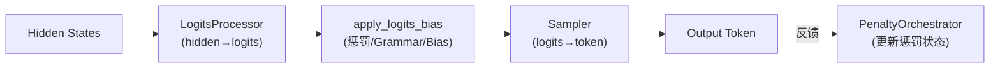
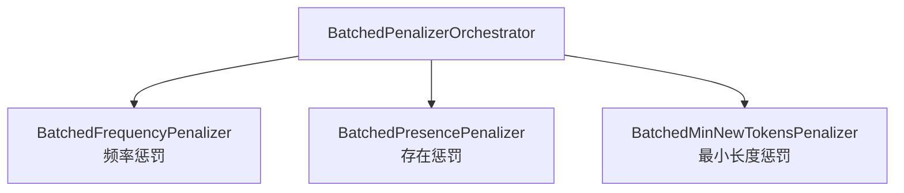
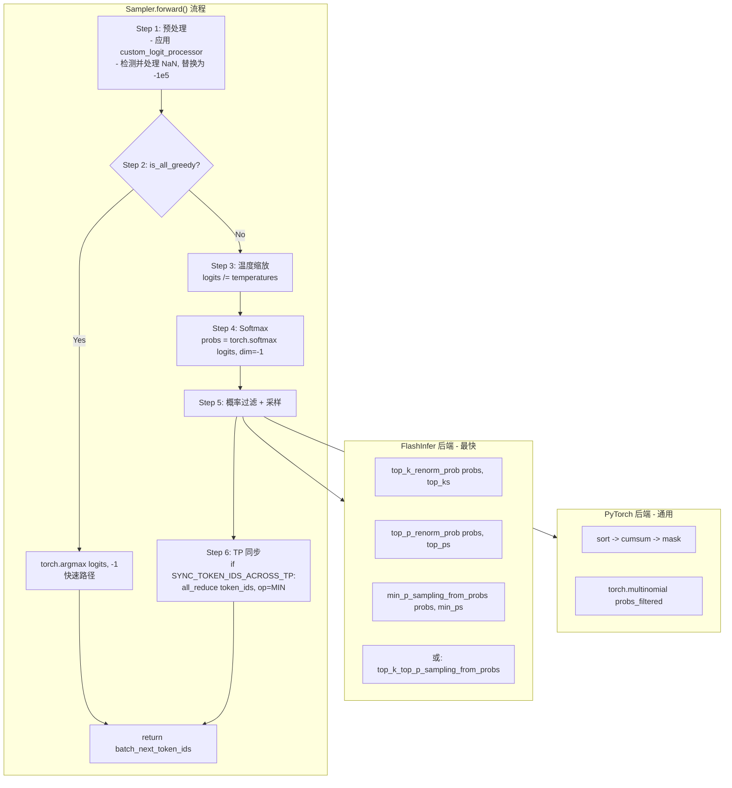
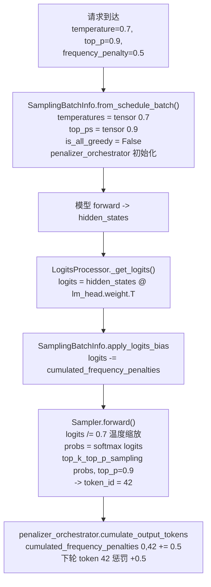

# SGLang 采样与生成控制详解

> **默认场景**: Qwen/Qwen3-VL-235B-A22B-Thinking 多模态模型
>
> **核心组件**: SamplingParams, SamplingBatchInfo, LogitsProcessor, Sampler, PenaltyLib

## 1. 概览

采样（Sampling）是 LLM 推理中从 logits 到 token 的最后一环。SGLang 实现了完整的采样管道：



**核心文件**:
- `srt/sampling/sampling_params.py` — 采样参数定义
- `srt/sampling/sampling_batch_info.py` — 批次级采样状态
- `srt/sampling/penaltylib/` — 惩罚机制 (频率/存在/最小长度)
- `srt/sampling/custom_logit_processor.py` — 自定义 logit 处理器
- `srt/layers/logits_processor.py` — LogitsProcessor 层
- `srt/layers/sampler.py` — Sampler 实现

## 2. SamplingParams

**文件**: `srt/sampling/sampling_params.py`

每个请求携带一个 `SamplingParams` 实例，定义该请求的采样行为。

### 2.1 核心参数

```python
class SamplingParams:
    # ========== 温度与概率过滤 ==========
    temperature: float = 1.0       # 控制随机性 (0=贪婪, 1=标准)
    top_p: float = 1.0             # Nucleus 采样阈值 (0, 1]
    top_k: int = -1                # 保留 top-k 个 token (-1=不限)
    min_p: float = 0.0             # 最小概率阈值 [0, 1]

    # ========== 惩罚机制 ==========
    frequency_penalty: float = 0.0  # 频率惩罚 [-2, 2]，按出现次数累加
    presence_penalty: float = 0.0   # 存在惩罚 [-2, 2]，按是否出现
    repetition_penalty: float = 1.0 # 乘法惩罚 [0, 2] (在模型内部应用)

    # ========== 生成约束 ==========
    min_new_tokens: int = 0        # 最小输出长度
    max_new_tokens: int = 128      # 最大输出长度

    # ========== 停止条件 ==========
    stop: Optional[Union[str, List[str]]] = None
    stop_token_ids: Optional[List[int]] = None
    ignore_eos: bool = False

    # ========== 结构化生成 ==========
    json_schema: Optional[str] = None
    regex: Optional[str] = None
    ebnf: Optional[str] = None

    # ========== Logit 偏置 ==========
    logit_bias: Optional[Dict[str, float]] = None  # token_id → bias

    # ========== 确定性采样 ==========
    sampling_seed: Optional[int] = None
```

### 2.2 贪婪检测

```python
# temperature < 1e-6 时自动切换为贪婪模式
if temperature < _SAMPLING_EPS:
    top_k = 1  # 等价于 argmax
```

### 2.3 常量

```python
TOP_K_ALL = 1 << 30  # 1,073,741,824，表示"不限制 top-k"
```

## 3. SamplingBatchInfo

**文件**: `srt/sampling/sampling_batch_info.py`

将多个请求的 `SamplingParams` 批量化为张量，供 GPU 并行处理。

### 3.1 核心字段

```python
@dataclasses.dataclass
class SamplingBatchInfo:
    # ========== 批量采样参数 (GPU Tensor) ==========
    temperatures: torch.Tensor       # [batch_size, 1]
    top_ps: torch.Tensor             # [batch_size]
    top_ks: torch.Tensor             # [batch_size], int32
    min_ps: torch.Tensor             # [batch_size]

    # ========== 优化标记 ==========
    is_all_greedy: bool              # 全部请求为贪婪 → 走 argmax 快速路径
    need_top_p_sampling: bool        # 是否有请求使用 top_p
    need_top_k_sampling: bool        # 是否有请求使用 top_k
    need_min_p_sampling: bool        # 是否有请求使用 min_p

    # ========== 惩罚管理 ==========
    penalizer_orchestrator: BatchedPenalizerOrchestrator
    acc_linear_penalties: torch.Tensor  # [batch_size, vocab_size], overlap 模式预计算

    # ========== Grammar 约束 ==========
    grammars: Optional[List]
    vocab_mask: Optional[torch.Tensor]  # [batch_size, vocab_size]

    # ========== 自定义处理器 ==========
    custom_logit_processor: Optional[Dict]
    logit_bias: Optional[torch.Tensor]  # [batch_size, vocab_size]
```

### 3.2 创建流程

```python
@classmethod
def from_schedule_batch(cls, batch: ScheduleBatch, vocab_size: int):
    """从 ScheduleBatch 构建 SamplingBatchInfo"""
    # 1. 提取每个请求的采样参数
    temperatures = [req.sampling_params.temperature for req in batch.reqs]
    top_ps = [req.sampling_params.top_p for req in batch.reqs]
    # ...

    # 2. 转为 GPU Tensor
    temperatures = torch.tensor(temperatures, device="cuda").unsqueeze(1)

    # 3. 初始化惩罚管理器
    penalizer_orchestrator = BatchedPenalizerOrchestrator(
        vocab_size, batch,
        {BatchedFrequencyPenalizer, BatchedPresencePenalizer, BatchedMinNewTokensPenalizer}
    )

    # 4. 设置优化标记
    is_all_greedy = all(top_k == 1 for top_k in top_ks)
```

### 3.3 apply_logits_bias

在采样前统一应用所有 logit 修改：

```python
def apply_logits_bias(self, logits: torch.Tensor):
    # 1. 累积惩罚 (overlap 模式)
    if self.acc_linear_penalties is not None:
        logits.add_(self.acc_linear_penalties)

    # 2. Grammar 词表掩码 (将非法 token 设为 -inf)
    if self.vocab_mask is not None:
        self.apply_mask_func(logits, self.vocab_mask)

    # 3. 用户指定的 logit_bias
    if self.logit_bias is not None:
        logits.add_(self.logit_bias)
```

## 4. 惩罚机制 (PenaltyLib)

**文件**: `srt/sampling/penaltylib/`

SGLang 使用 Orchestrator 模式管理三种惩罚器。

### 4.1 架构



### 4.2 频率惩罚 (Frequency Penalty)

按 token 被采样的**次数**累加惩罚。

```
token 42 被采样 3 次, frequency_penalty = 0.5
→ penalty = 3 × 0.5 = 1.5
→ logits[42] -= 1.5 (越采样越不可能)
```

```python
# 每次采样后累加
cumulated_frequency_penalties.scatter_add_(
    dim=1, index=output_ids.unsqueeze(1), src=frequency_penalties
)
# 应用时
logits -= cumulated_frequency_penalties
```

### 4.3 存在惩罚 (Presence Penalty)

只关心 token **是否出现过**，不关心频率。

```
token 100 被采样 5 次, presence_penalty = 0.2
→ penalty = 0.2 (固定，不随次数增加)
→ logits[100] -= 0.2
```

```python
# 使用 scatter_ (非 scatter_add_)，只设置一次
cumulated_presence_penalties.scatter_(
    dim=1, index=output_ids.unsqueeze(1), src=presence_penalties
)
```

### 4.4 最小长度惩罚 (Min New Tokens)

在达到最小输出长度前，将停止 token 的 logit 设为 `-inf`。

```python
# 初始化时将 stop token 位置标记为 -inf
stop_token_penalties[stop_token_positions] = float("-inf")

# 采样时: 长度不够 → 加 -inf，使 stop token 不可能被采样
mask = (len_output_tokens < min_new_tokens)
logits[mask] += stop_token_penalties[mask]
```

### 4.5 Orchestrator 生命周期

```python
# 1. 创建时: 检查是否需要激活各惩罚器
orchestrator = BatchedPenalizerOrchestrator(vocab_size, batch, penalizer_set)

# 2. 每轮采样后: 更新状态
orchestrator.cumulate_output_tokens(sampled_token_ids)

# 3. 下轮采样前: 应用惩罚
orchestrator.apply(logits)  # in-place 修改 logits

# 4. 请求完成时: 清理
orchestrator.filter(keep_indices)  # 或
orchestrator.release()
```

## 5. LogitsProcessor

**文件**: `srt/layers/logits_processor.py`

负责将模型的 hidden states 转换为 logits。

### 5.1 计算流程

```python
class LogitsProcessor(nn.Module):
    def _get_logits(self, hidden_states, lm_head, logits_metadata):
        # 1. 线性投影: hidden_states @ lm_head.weight.T
        logits = lm_head(hidden_states)

        # 2. Tensor Parallel: all-gather (多 GPU 场景)
        if tp_size > 1:
            logits = tensor_model_parallel_all_gather(logits)

        # 3. Logit 缩放
        logits *= self.logit_scale

        # 4. Final logit softcapping (tanh)
        if self.final_logit_softcapping:
            logits = logits / cap
            logits = torch.tanh(logits)
            logits = logits * cap

        return logits
```

### 5.2 LogitsProcessorOutput

```python
@dataclass
class LogitsProcessorOutput:
    # LogitsProcessor 生成
    next_token_logits: torch.Tensor      # [seq_len, vocab_size]
    hidden_states: Optional[torch.Tensor] # 用于投机解码 (EAGLE)

    # Sampler 填充
    next_token_logprobs: Optional[torch.Tensor]
    next_token_top_logprobs_val: Optional[List]
    next_token_top_logprobs_idx: Optional[List]
```

## 6. Sampler

**文件**: `srt/layers/sampler.py`

核心采样逻辑：从 logits 到 token ID。

### 6.1 完整流程



### 6.2 Top-K / Top-P / Min-P 过滤算法

| 算法 | 原理 | 示例 |
|------|------|------|
| **Top-K** | 保留概率最高的 K 个 token，其余设为 0 | top_k=50 → 只从前 50 个 token 中采样 |
| **Top-P** | 按概率降序累加到 P 为止，保留这些 token | top_p=0.9 → 保留累积概率达 90% 的 token |
| **Min-P** | 保留概率 ≥ max_prob × min_p 的 token | min_p=0.1, max=0.5 → 保留 prob≥0.05 的 |

**应用顺序**:
- `"top_k_first"`: 先 top-k → 再 top-p（分两步 kernel）
- `"joint"`: 单 kernel 同时应用（更高效）

### 6.3 确定性采样

通过 Gumbel Trick 实现可复现的采样：

```python
# 用 seed + position 生成确定性噪声
step_seed = (seed * 19349663) ^ (position * 73856093)
uniform = hash_to_uniform(step_seed)
gumbel_noise = -log(-log(uniform))

# argmax(log_probs + gumbel_noise) 等价于 multinomial 采样
token = argmax(log(probs) + gumbel_noise)
```

## 7. 自定义 Logit Processor

**文件**: `srt/sampling/custom_logit_processor.py`

用户可以通过继承 `CustomLogitProcessor` 实现自定义的 logit 修改逻辑。

### 7.1 接口

```python
class CustomLogitProcessor(ABC):
    @abstractmethod
    def __call__(
        self,
        logits: torch.Tensor,
        custom_param_list: Optional[List[Dict[str, Any]]] = None,
    ) -> torch.Tensor:
        """修改并返回 logits"""
        pass
```

### 7.2 内置实现

| 处理器 | 功能 |
|--------|------|
| `DisallowedTokensLogitsProcessor` | 将指定 token 的 logit 设为 -inf |
| `ThinkingBudgetLogitProcessor` | 控制 thinking token 的最大长度 |
| `Qwen3ThinkingBudgetLogitProcessor` | Qwen3 思维链预算控制 |
| `DeepSeekR1ThinkingBudgetLogitProcessor` | DeepSeek-R1 思维链预算控制 |
| `DeepseekOCRNoRepeatNGramLogitProcessor` | 防止 n-gram 重复 |

### 7.3 序列化

通过 dill + hex 编码实现跨进程传输：

```python
# 序列化
json_str = MyProcessor.to_str()  # dill dump → hex encode → JSON

# 反序列化 (带缓存)
processor = CustomLogitProcessor.from_str(json_str)
```

## 8. sgl-kernel 采样算子

**文件**: `sgl-kernel/python/sgl_kernel/sampling.py`

高性能 CUDA 采样 kernel，比 PyTorch 原生实现快。

```python
# 重归一化
top_k_renorm_prob(probs, top_k)       # in-place top-k + renorm
top_p_renorm_prob(probs, top_p)       # in-place top-p + renorm

# 采样
top_k_top_p_sampling_from_probs(      # top-k + top-p 联合采样
    probs, output, indices,
    top_k_arr, top_k_val,
    top_p_arr, top_p_val,
    deterministic, generator
)

min_p_sampling_from_probs(            # min-p 采样
    probs, output, indices,
    min_p_arr, min_p_val,
    deterministic, generator
)
```

## 9. 端到端数据流示例



## 10. 下一步

- **20**: 约束生成 (Grammar Backends, JSON Schema, Regex)
