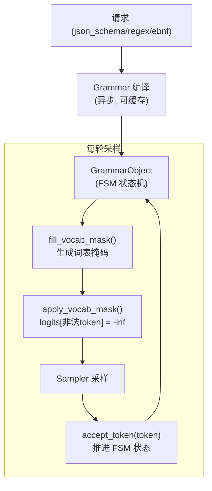
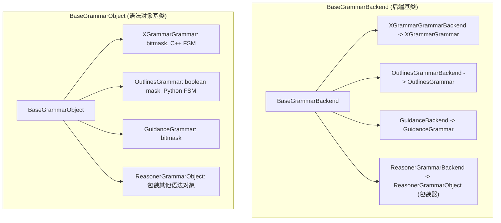
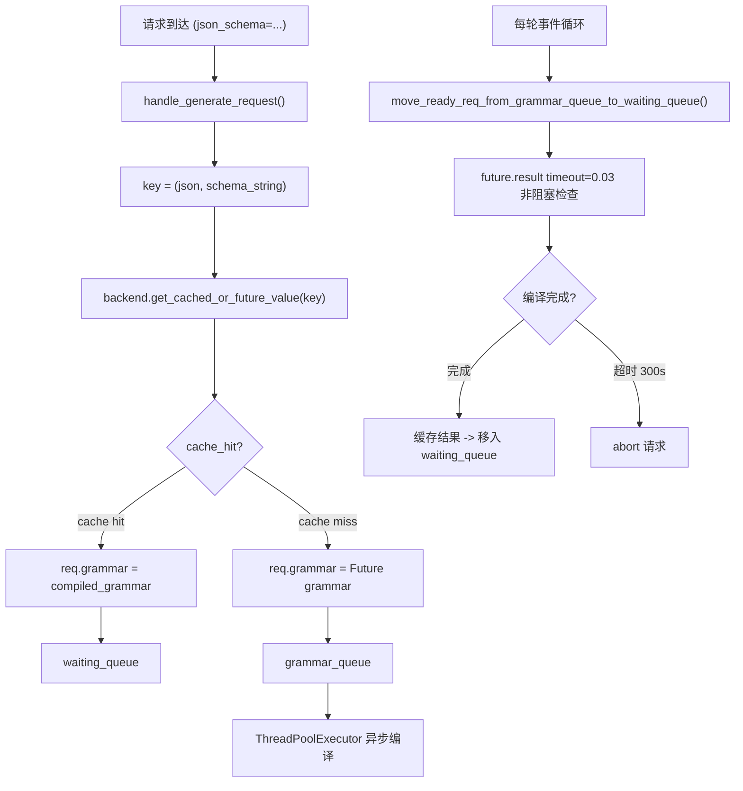

# SGLang 约束生成详解

> **默认场景**: Qwen/Qwen3-VL-235B-A22B-Thinking 多模态模型
>
> **核心组件**: Grammar Backend, Vocab Mask, Jump Forward

## 1. 概览

约束生成（Constrained/Structured Generation）通过词表掩码（Vocab Mask）限制每一步可采样的 token，强制模型输出符合指定格式（JSON Schema、正则、EBNF）的文本。



**核心文件**:
- `srt/constrained/base_grammar_backend.py` — 抽象基类、后端注册
- `srt/constrained/xgrammar_backend.py` — XGrammar 后端 (生产推荐)
- `srt/constrained/outlines_backend.py` — Outlines 后端
- `srt/constrained/llguidance_backend.py` — LLGuidance 后端
- `srt/constrained/reasoner_grammar_backend.py` — Reasoning 模型包装器
- `srt/constrained/triton_ops/bitmask_ops.py` — GPU 掩码 kernel

## 2. 后端选择

SGLang 通过 `--grammar-backend` 参数选择后端：

| 后端 | 特点 | 支持格式 | 推荐场景 |
|------|------|----------|----------|
| **xgrammar** | C++ 实现, CUDA 优化, bitmask | JSON, Regex, EBNF, StructuralTag | 生产环境 (默认) |
| **outlines** | Python 实现, FSM 方式 | JSON, Regex | 轻量级/兼容 |
| **llguidance** | Python 实现, bitmask | JSON, Regex, EBNF, StructuralTag | 研究 |
| **none** | 禁用 | — | 不需要约束生成 |

```python
# srt/constrained/base_grammar_backend.py
def create_grammar_backend(server_args, tokenizer, vocab_size, eos_token_ids):
    if server_args.grammar_backend == "xgrammar":
        return XGrammarGrammarBackend(tokenizer, vocab_size, ...)
    elif server_args.grammar_backend == "outlines":
        return OutlinesGrammarBackend(tokenizer, vocab_size, ...)
    elif server_args.grammar_backend == "llguidance":
        return GuidanceBackend(tokenizer, ...)
    # 如果启用了 reasoning_parser，会包装为 ReasonerGrammarBackend
```

## 3. 类体系



### 3.1 BaseGrammarObject 核心接口

```python
class BaseGrammarObject:
    # ========== 状态推进 ==========
    def accept_token(self, token: int)         # 接受 token, 推进 FSM
    def rollback(self, k: int)                 # 回滚 k 步 (投机解码)
    def is_terminated(self) -> bool            # 是否无法继续

    # ========== 词表掩码 ==========
    def allocate_vocab_mask(vocab_size, batch_size, device)  # 分配掩码张量
    def fill_vocab_mask(mask, idx)             # 填充第 idx 行的合法 token
    def move_vocab_mask(mask, device)          # 移动到 GPU
    def apply_vocab_mask(logits, mask)         # logits[非法] = -inf

    # ========== 跳跃优化 ==========
    def try_jump_forward(tokenizer)            # 跳过可预测序列
```

## 4. 词表掩码格式

两种格式，取决于后端：

### 4.1 Boolean Mask (Outlines)

```python
# shape: [batch_size, vocab_size], dtype=torch.bool
# True = 被屏蔽 (非法), False = 允许
mask = torch.zeros(batch_size, vocab_size, dtype=torch.bool)
mask[idx, disallowed_tokens] = True

# 应用
logits[mask] = float("-inf")
```

### 4.2 Bitmask (XGrammar / LLGuidance)

```python
# shape: [batch_size, ceil(vocab_size / 32)], dtype=torch.int32
# 每个 int32 编码 32 个 token: bit=1 表示允许, bit=0 表示屏蔽
# 更紧凑，GPU Triton kernel 加速

# 应用 (Triton kernel)
# srt/constrained/triton_ops/bitmask_ops.py
apply_token_bitmask_inplace_triton(logits, bitmask, vocab_size)
```

## 5. Scheduler 集成

### 5.1 异步编译流程

Grammar 编译可能耗时较长，SGLang 使用 `grammar_queue` 异步处理：



### 5.2 关键配置

```bash
SGLANG_GRAMMAR_TIMEOUT=300        # 编译超时 (秒)
--grammar-backend xgrammar        # 后端选择
--constrained-json-whitespace-pattern   # JSON 空白正则
```

### 5.3 编译缓存

```python
# BaseGrammarBackend 内置缓存
cache: Dict[Tuple[str, str], CacheEntry]
# key = ("json", schema_string) 或 ("regex", pattern) 等
# value = 编译好的 GrammarObject (会 copy() 后存入)
```

## 6. 采样集成

### 6.1 掩码生成

在每轮采样前，`SamplingBatchInfo.update_regex_vocab_mask()` 生成掩码：

```python
def update_regex_vocab_mask(self):
    # 1. 分配掩码
    self.vocab_mask = grammar.allocate_vocab_mask(vocab_size, batch_size, device)

    # 2. 每个请求填充合法 token
    for i, grammar in enumerate(self.grammars):
        if grammar and not grammar.finished:
            grammar.fill_vocab_mask(self.vocab_mask, i)

    # 3. 移到 GPU
    self.vocab_mask = grammar.move_vocab_mask(self.vocab_mask, self.device)
```

### 6.2 掩码应用

在 `apply_logits_bias()` 中统一应用：

```python
def apply_logits_bias(self, logits):
    # ... 惩罚 ...
    if self.vocab_mask is not None:
        self.apply_mask_func(logits, self.vocab_mask)  # logits[非法] = -inf
    # ... logit_bias ...
```

### 6.3 Token 接受

采样后，在 `process_batch_result` 中推进状态：

```python
# scheduler_output_processor_mixin.py
if req.grammar is not None:
    req.grammar.accept_token(next_token_id)
```

## 7. Reasoner Grammar (思维链模型)

**文件**: `srt/constrained/reasoner_grammar_backend.py`

为 Thinking 模型（如 Qwen3-VL-Thinking）提供特殊支持：在 thinking 阶段不应用约束，thinking 结束后才激活 grammar。

### 7.1 maybe_init_reasoning() 初始化

`maybe_init_reasoning()` 方法在 grammar 对象创建后调用，根据请求是否启用 reasoning 来设置初始状态：

```python
# BaseGrammarObject 中 (base_grammar_backend.py L49-50)
def maybe_init_reasoning(self, reasoning: bool):
    pass  # 基类默认不做任何事

# ReasonerGrammarObject 中 (reasoner_grammar_backend.py L37-38)
def maybe_init_reasoning(self, reasoning: bool):
    self.tokens_after_think_end = -1 if reasoning else 0
    # reasoning=True:  tokens_after_think_end=-1 → thinking 阶段，不约束
    # reasoning=False: tokens_after_think_end=0  → 直接进入约束模式（无 thinking）
```

调用时机: `get_cached_or_future_value()` 从缓存中取出 grammar 对象后，调用 `copied_value.maybe_init_reasoning(require_reasoning)` 初始化。

### 7.2 ReasonerGrammarObject 实现

```python
class ReasonerGrammarObject(BaseGrammarObject):
    def __init__(self, grammar: BaseGrammarObject, think_end_id: int):
        self.grammar = grammar
        self.think_end_id = think_end_id
        self.tokens_after_think_end = -1  # -1: thinking 未结束, 0: 刚结束, +N: 结束后第 N 个 token

    def transfer_state(self, token: int):
        """状态转移（独立方法）: 更新 tokens_after_think_end 计数器"""
        if self.tokens_after_think_end == -1 and token == self.think_end_id:
            self.tokens_after_think_end = 0   # 检测到 think_end → 进入约束模式
        elif self.tokens_after_think_end >= 0:
            self.tokens_after_think_end += 1  # 约束模式中，递增计数

    def accept_token(self, token: int):
        # 注意执行顺序: 先 accept (如果已在约束模式), 再 transfer_state
        if self.tokens_after_think_end >= 0:
            self.grammar.accept_token(token)  # 委托给内层 grammar
        self.transfer_state(token)            # 然后更新状态
```

**执行顺序解析** (`reasoner_grammar_backend.py` L52-55):
1. **先判断当前状态**: 如果 `tokens_after_think_end >= 0`（已结束 thinking），则将 token 传给内层 grammar 的 `accept_token()`
2. **再更新状态**: 调用 `transfer_state(token)` 更新计数器

这意味着 `think_end_id` 本身**不会**被传给内层 grammar（因为检测到 `think_end_id` 时 `tokens_after_think_end` 还是 -1），但之后的 token 都会被 accept。`transfer_state()` 的分离设计使得状态转移逻辑可以被 `rollback_state()` 独立回滚。

## 8. 跳跃解码 (Jump Forward)

当 grammar 能确定下一段文本（如 JSON 的 `"name": "`），可以跳过逐 token 生成：

```python
# 检测可跳跃的序列
jump_str = grammar.try_jump_forward(tokenizer)
if jump_str:
    # 直接追加 jump_str 对应的 token IDs
    # 跳过中间的 forward pass
    grammar.jump_and_retokenize(old_ids, new_ids, next_state)
```

## 9. 支持的约束类型

| 类型 | SamplingParams 字段 | 编译 key | 示例 |
|------|---------------------|----------|------|
| JSON Schema | `json_schema` | `("json", schema)` | `'{"type":"object","properties":{"name":{"type":"string"}}}'` |
| 正则表达式 | `regex` | `("regex", pattern)` | `'[0-9]{3}-[0-9]{4}'` |
| EBNF | `ebnf` | `("ebnf", grammar)` | `'root ::= "hello" \| "world"'` |
| 结构标签 | `structural_tag` | `("structural_tag", json)` | XML/HTML 标签约束 |
| 结构化模式 | — | `("structural_pattern", pattern)` | 结构化模式约束 |
| 结构化模式 v2 | — | `("structural_pattern_v2", pattern)` | 结构化模式约束 v2 |

> **dispatch 路由** (`base_grammar_backend.py` `_init_value_dispatch`): 根据 key_type 路由到对应的 `dispatch_*` 方法。`structural_pattern` 和 `structural_pattern_v2` 是扩展类型，通过 `dispatch_structural_pattern()` / `dispatch_structural_pattern_v2()` 分发。

## 10. GrammarStats 性能追踪

**文件**: `srt/constrained/base_grammar_backend.py` L30-39

每个 `BaseGrammarObject` 实例可通过 `grammar_stats` 属性追踪语法操作的性能指标：

```python
@dataclass
class GrammarStats:
    compilation_time: Optional[float] = None      # 编译耗时（秒）
    schema_count: Optional[int] = None             # schema 数量
    ebnf_size: Optional[int] = None                # EBNF 规则大小
    is_cache_hit: bool = False                     # 是否命中编译缓存
    is_grammar_aborted: bool = False               # 语法是否被中止
    tree_traversal_time: List[float] = field(default_factory=list)  # 树遍历耗时列表
    dispatch_type: Optional[str] = None            # dispatch 类型 (json/regex/ebnf/...)
    num_timeout: int = 0                           # 超时次数
```

`compilation_time` 在 `_init_value_dispatch()` 中自动记录，其他字段由各后端在编译和运行时填充。

## 11. 自定义后端注册机制

**文件**: `srt/constrained/base_grammar_backend.py` L199-203

SGLang 提供全局注册表 `GRAMMAR_BACKEND_REGISTRY`，允许第三方注册自定义 grammar 后端：

```python
GRAMMAR_BACKEND_REGISTRY = {}

def register_grammar_backend(name, init_func):
    """注册自定义 grammar 后端

    Args:
        name: 后端名称字符串
        init_func: 工厂函数, 签名: (server_args, tokenizer, vocab_size, eos_token_ids) -> BaseGrammarBackend
    """
    GRAMMAR_BACKEND_REGISTRY[name] = init_func
```

`create_grammar_backend()` 的查找优先级：
1. **自定义注册** — 先查 `GRAMMAR_BACKEND_REGISTRY`，找到则直接调用工厂函数
2. **内置后端** — `xgrammar` / `outlines` / `llguidance`
3. **Reasoning 包装** — 如果启用了 `reasoning_parser` 且 tokenizer 有 `think_end_id`，则用 `ReasonerGrammarBackend` 包装

```python
def create_grammar_backend(server_args, tokenizer, vocab_size, eos_token_ids):
    name = server_args.grammar_backend
    # 1. 优先查自定义注册
    if name in GRAMMAR_BACKEND_REGISTRY:
        return GRAMMAR_BACKEND_REGISTRY[name](server_args, tokenizer, vocab_size, eos_token_ids)
    # 2. 内置后端
    if name == "xgrammar": ...
    elif name == "outlines": ...
    elif name == "llguidance": ...
    # 3. Reasoning 包装
    if server_args.reasoning_parser and hasattr(tokenizer, "think_end_id"):
        grammar_backend = ReasonerGrammarBackend(grammar_backend, tokenizer.think_end_id)
    return grammar_backend
```

## 12. 与投机解码的交互

XGrammar 支持 `rollback(k)` 用于投机解码：

```python
# 投机解码: draft 模型生成 k 个候选 token
# 如果验证失败，需要回滚 grammar 状态
grammar.rollback(num_rejected_tokens)
# MAX_ROLLBACK_TOKENS = 200
```

## 13. 下一步

- **21**: 推理解析与函数调用 (ReasoningParser, FunctionCallParser)
