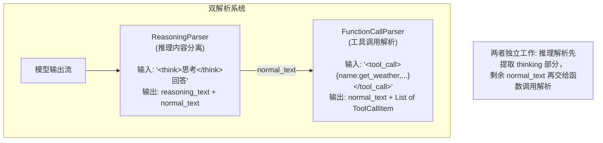
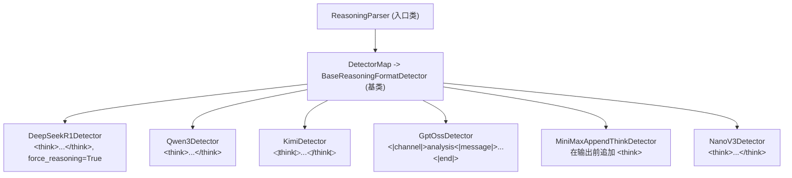
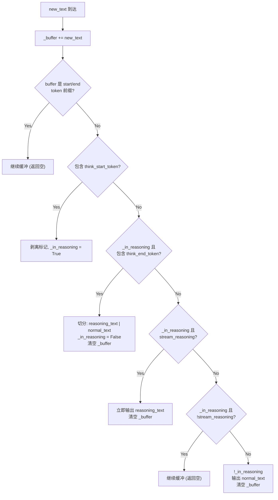
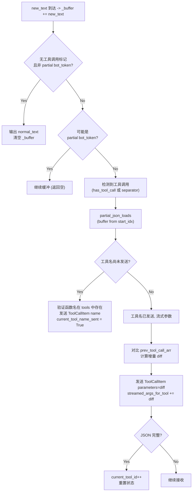
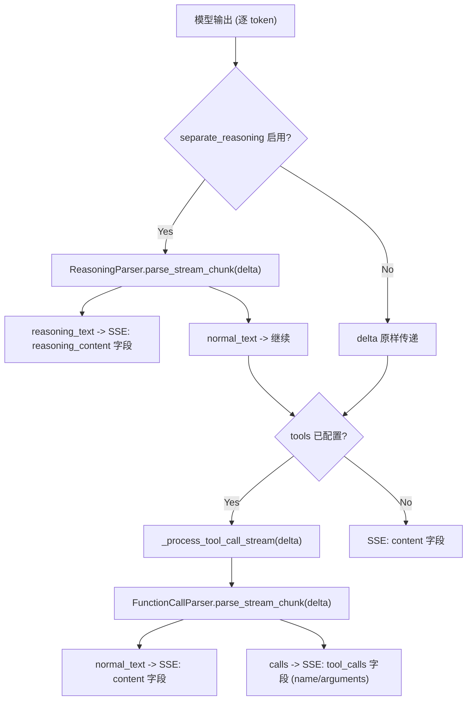
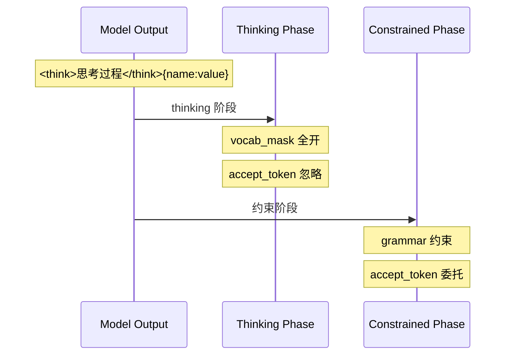

# SGLang 推理解析与函数调用详解

> **默认场景**: Qwen/Qwen3-VL-235B-A22B-Thinking 多模态模型
>
> **核心组件**: ReasoningParser, FunctionCallParser, BaseFormatDetector, StructuralTag

## 1. 概览

SGLang 提供两个独立但可协作的解析系统，处理思维链 (Chain-of-Thought) 推理和函数/工具调用：



**核心文件**:
- `srt/parser/reasoning_parser.py` — 推理内容解析器
- `srt/function_call/function_call_parser.py` — 函数调用解析器
- `srt/function_call/base_format_detector.py` — 函数调用检测器基类
- `srt/function_call/core_types.py` — 核心数据类型
- `srt/entrypoints/openai/serving_chat.py` — serving 层集成
- `srt/constrained/reasoner_grammar_backend.py` — Reasoner Grammar 包装器

## 2. ReasoningParser 架构

**文件**: `srt/parser/reasoning_parser.py`

### 2.1 类体系



### 2.2 模型注册表

```python
ReasoningParser.DetectorMap = {
    "deepseek-r1":          DeepSeekR1Detector,    # force_reasoning=True (始终假定在思考)
    "deepseek-v3":          Qwen3Detector,
    "glm45":                Qwen3Detector,
    "gpt-oss":              GptOssDetector,        # 使用 HarmonyParser
    "kimi":                 KimiDetector,          # Unicode 标记符
    "kimi_k2":              DeepSeekR1Detector,
    "qwen3":                Qwen3Detector,
    "qwen3-thinking":       Qwen3Detector,         # force_reasoning=True (强制覆盖)
    "minimax":              Qwen3Detector,          # force_reasoning=True (强制覆盖)
    "minimax-append-think": MiniMaxAppendThinkDetector,
    "step3":                DeepSeekR1Detector,
    "nano_v3":              NanoV3Detector,
    "interns1":             Qwen3Detector,
}
```

### 2.3 BaseReasoningFormatDetector 基类

```python
class BaseReasoningFormatDetector:
    def __init__(self, think_start_token, think_end_token, force_reasoning, stream_reasoning):
        self.think_start_token = think_start_token    # 如 "<think>"
        self.think_end_token = think_end_token        # 如 "</think>"
        self._in_reasoning = force_reasoning          # 初始状态
        self.stream_reasoning = stream_reasoning      # 是否流式输出推理内容
        self._buffer = ""                             # 流式缓冲区

    def detect_and_parse(self, text) -> StreamingParseResult:
        """一次性解析: 完整文本 → reasoning_text + normal_text"""

    def parse_streaming_increment(self, new_text) -> StreamingParseResult:
        """流式增量解析: 逐块输入 → 逐块输出"""
```

### 2.4 流式增量解析状态机

`parse_streaming_increment()` 实现了一个简洁的状态机：



### 2.5 StreamingParseResult

```python
class StreamingParseResult:
    normal_text: str = ""       # 非推理内容 (会传给用户/函数调用解析)
    reasoning_text: str = ""    # 推理内容 (thinking 部分)
```

### 2.6 特殊检测器

**DeepSeekR1Detector**: `force_reasoning=True`，模型一开始就被视为在思考，直到遇到 `</think>` 才切换。

**GptOssDetector**: 使用独立的 `HarmonyParser` 解析器处理 T4 格式 (`<|channel|>analysis<|message|>...<|end|>`)，支持多事件类型 (reasoning, normal, tool_call)。

**KimiDetector**: 使用 Unicode 字符作为标记 (`◁think▷` / `◁/think▷`)。

**MiniMaxAppendThinkDetector**: 特殊检测器，在输出前主动追加 `<think>` 标记。与其他检测器的被动检测不同，它在首次流式输出时修改文本：

```python
# reasoning_parser.py L252-274
class MiniMaxAppendThinkDetector(BaseReasoningFormatDetector):
    def __init__(self, stream_reasoning=True, force_reasoning=False):
        super().__init__("<think>", "</think>", force_reasoning=force_reasoning, ...)
        self.is_first_chunk = False       # 追踪是否为首次调用

    def parse_streaming_increment(self, new_text: str) -> StreamingParseResult:
        if not self.is_first_chunk:
            self.is_first_chunk = True
            new_text = self.think_start_token + new_text  # 在首块前追加 <think>
        # 注意: 直接返回 normal_text（不做 thinking 分离）
        # 追加的 <think> 会被下游（如 serving_chat.py）或客户端处理
        return StreamingParseResult(normal_text=new_text)

    def detect_and_parse(self, text: str) -> StreamingParseResult:
        return StreamingParseResult(normal_text=self.think_start_token + text)
```

核心设计要点：
- `is_first_chunk` 标志确保 `<think>` 只在流的第一块前追加一次
- **不做 thinking 内容分离**: `parse_streaming_increment` 直接将拼接后的文本作为 `normal_text` 返回，与 `BaseReasoningFormatDetector` 的状态机逻辑完全不同
- 非流式的 `detect_and_parse` 同样只是简单拼接，不解析 `</think>`
- 适用场景：MiniMax 模型需要在输出流开头注入 thinking 标记，但实际的 thinking 分离由模型或客户端完成

## 3. FunctionCallParser 架构

**文件**: `srt/function_call/function_call_parser.py`

### 3.1 类体系

```mermaid
flowchart TD
    A["FunctionCallParser (入口类)"] --> B["ToolCallParserEnum -> BaseFormatDetector (基类)"]
    B --> C["DeepSeekV3Detector - deepseekv3"]
    B --> D["DeepSeekV31Detector - deepseekv31"]
    B --> E["DeepSeekV32Detector - deepseekv32"]
    B --> F["Glm4MoeDetector - glm, glm45"]
    B --> G["Glm47MoeDetector - glm47"]
    B --> H["GptOssDetector - gpt-oss"]
    B --> I["KimiK2Detector - kimi_k2"]
    B --> J["Llama32Detector - llama3"]
    B --> K["MiMoDetector - mimo"]
    B --> L["MistralDetector - mistral"]
    B --> M["PythonicDetector - pythonic"]
    B --> N["Qwen25Detector - qwen, qwen25"]
    B --> O["Qwen3CoderDetector - qwen3_coder"]
    B --> P["Step3Detector - step3"]
    B --> Q["MinimaxM2Detector - minimax-m2"]
    B --> R["InternlmDetector - interns1"]
```



### 3.2 核心数据类型

**文件**: `srt/function_call/core_types.py`

```python
class ToolCallItem(BaseModel):
    tool_index: int                 # 在 tools 列表中的索引
    name: Optional[str] = None     # 函数名
    parameters: str                # JSON 字符串形式的参数

class StreamingParseResult(BaseModel):
    normal_text: str = ""          # 非工具调用文本
    calls: List[ToolCallItem] = [] # 解析出的工具调用

@dataclass
class StructureInfo:
    begin: str       # 工具调用开始标记 (如 '<tool_call>\n{"name": "get_weather"')
    end: str         # 工具调用结束标记 (如 '</tool_call>')
    trigger: str     # 触发约束生成的 token
```

### 3.3 BaseFormatDetector 流式状态管理

**文件**: `srt/function_call/base_format_detector.py`

```python
class BaseFormatDetector(ABC):
    def __init__(self):
        self._buffer = ""                      # 流式缓冲区
        self.prev_tool_call_arr = []           # 上一轮解析的工具调用 (用于增量比较)
        self.current_tool_id = -1              # 当前正在解析的工具 ID
        self.current_tool_name_sent = False    # 当前工具名是否已发送
        self.streamed_args_for_tool = []       # 每个工具已流式发送的参数 JSON

        # 子类覆盖
        self.bot_token = ""                    # 工具调用开始标记
        self.eot_token = ""                    # 工具调用结束标记
        self.tool_call_separator = ", "        # 多工具调用分隔符

    @abstractmethod
    def has_tool_call(self, text: str) -> bool: ...
    @abstractmethod
    def detect_and_parse(self, text, tools) -> StreamingParseResult: ...
    @abstractmethod
    def structure_info(self) -> _GetInfoFunc: ...
```

### 3.4 流式解析状态机

基类 `parse_streaming_increment()` 实现了通用的流式工具调用解析：



关键设计：
- 使用 `partial_json_loads` 解析不完整的 JSON，容忍流式传输中的截断
- 通过 `_find_common_prefix` 计算参数增量，避免重复发送
- `tool_index` 从 0 递增，每个工具完成后 `current_tool_id++`

### 3.5 代表性格式示例

**DeepSeek V3 格式**:
```
<｜tool▁call▁begin｜>function_name
{"param": "value"}<｜tool▁call▁end｜>
```

**Qwen 2.5 格式**:
```
<tool_call>
{"name": "get_weather", "arguments": {"city": "Beijing"}}
</tool_call>
```

**Llama 3.2 格式**:
```
<|python_tag|>function_name.call(param="value")
```

**Mistral 格式**:
```
[TOOL_CALLS] [{"name": "get_weather", "arguments": {"city": "Beijing"}}]
```

## 4. StructuralTag 约束生成

FunctionCallParser 能为函数调用生成结构化标签约束，与 Grammar Backend（见 20 章）协作：

```python
# FunctionCallParser.get_structure_tag()
def get_structure_tag(self):
    for tool in self.tools:
        info = self.detector.structure_info()(tool.function.name)
        # info.begin = '<tool_call>\n{"name": "get_weather", "arguments": '
        # info.end   = '}\n</tool_call>'
        # info.trigger = '<tool_call>'
        structures.append(StructuresResponseFormat(
            begin=info.begin,
            schema=function.parameters,  # JSON Schema 约束参数格式
            end=info.end,
        ))
    return LegacyStructuralTagResponseFormat(
        type="structural_tag",
        structures=structures,
        triggers=triggers,
    )
```

约束选择逻辑：
```python
# get_structure_constraint()
if tool_choice == "auto" and (strict tools or TOOL_STRICT_LEVEL >= FUNCTION):
    → structural_tag 约束 (模型自由决定是否调用，但调用时参数受约束)

elif tool_choice == "required" or isinstance(tool_choice, ToolChoice):
    → json_schema 约束 (强制生成符合 schema 的 JSON)
```

### 4.1 supports_structural_tag() 方法

**文件**: `srt/function_call/base_format_detector.py:323`

并非所有 detector 都支持 structural_tag 格式。`BaseFormatDetector` 提供了 `supports_structural_tag()` 方法来控制此行为：

```python
# base_format_detector.py L323-325
class BaseFormatDetector(ABC):
    def supports_structural_tag(self) -> bool:
        """Return True if this detector supports structural tag format."""
        return True  # 基类默认返回 True
```

多个 detector 覆盖此方法返回 `False`：

| Detector | supports_structural_tag | 原因 |
|----------|------------------------|------|
| 大多数 detector (Qwen25, DeepSeek, Llama3, Mistral 等) | `True` (继承基类) | JSON 格式兼容 structural_tag |
| `PythonicDetector` | `False` | Pythonic 语法非 JSON，structural_tag 无法解析 |
| `MiMoDetector` | `False` | 自定义 XML 格式 |
| `MinimaxM2Detector` | `False` | 自定义格式 |
| `Qwen3CoderDetector` | `False` | 自定义多块格式 |
| `Step3Detector` | `False` | 自定义格式 |
| `Glm4MoeDetector` / `Glm47MoeDetector` | `False` | 自定义格式 |

在 `get_structure_constraint()` 中的使用：

```python
# function_call_parser.py L193-205
def get_structure_constraint(self, tool_choice):
    if (
        self.detector.supports_structural_tag()      # 先检查 detector 是否支持
        and tool_choice == "auto"
        and (any(tool.function.strict ...) or self.tool_strict_level >= ToolStrictLevel.FUNCTION)
    ):
        tag = self.get_structure_tag()
        return ("structural_tag", tag)
    elif tool_choice == "required" or isinstance(tool_choice, ToolChoice):
        json_schema = get_json_schema_constraint(self.tools, tool_choice)
        return ("json_schema", json_schema)
    # 如果 detector 不支持 structural_tag，且 tool_choice == "auto"，则不施加约束
```

这是一种 Pythonic 模式: 用 `bool` 方法控制行为分支。当 detector 不支持 structural_tag 时，`tool_choice="auto"` 的请求不会施加任何 grammar 约束，模型自由生成（可能需要后处理解析工具调用）。

## 5. Serving 层集成

**文件**: `srt/entrypoints/openai/serving_chat.py`

### 5.1 流式处理管线



### 5.2 _process_tool_call_stream

```python
async def _process_tool_call_stream(self, index, delta, parser_dict, content, request, has_tool_calls):
    # 1. 延迟初始化 parser (每个 choice index 一个)
    if index not in parser_dict:
        if request.tool_choice == "required":
            parser_dict[index] = JsonArrayParser()         # 直接 JSON 解析
        else:
            parser_dict[index] = FunctionCallParser(tools, tool_call_parser)

    # 2. 解析增量
    normal_text, calls = parser.parse_stream_chunk(delta)

    # 3. 输出 normal_text → SSE content chunk
    if normal_text:
        yield SSE(delta=DeltaMessage(content=normal_text))

    # 4. 输出 tool calls → SSE tool_calls chunk
    for call_item in calls:
        yield SSE(delta=DeltaMessage(tool_calls=[...]))
```

### 5.3 非流式处理

```python
# 非流式场景
if reasoning_parser and request.separate_reasoning:
    reasoning_text, normal_text = ReasoningParser.parse_non_stream(full_text)

if function_call_parser:
    normal_text, tool_calls = FunctionCallParser.parse_non_stream(normal_text)
```

## 6. Scheduler 集成

### 6.1 think_end_id 注入

**文件**: `srt/managers/scheduler.py:447`

Scheduler 初始化时，如果启用了 `reasoning_parser`，会将 think_end_token 编码为 token ID 注入 tokenizer：

```python
# scheduler.py:447
if self.server_args.reasoning_parser and self.tokenizer:
    reasoning_parser = ReasoningParser(
        model_type=self.server_args.reasoning_parser, stream_reasoning=False
    )
    self.tokenizer.think_end_id = self.tokenizer.encode(
        reasoning_parser.detector.think_end_token, add_special_tokens=False
    )[0]
```

此 `think_end_id` 被用于：
- ReasonerGrammarBackend 判断 thinking 阶段结束
- 控制约束生成在 thinking 阶段暂停

### 6.2 ReasonerGrammarBackend

**文件**: `srt/constrained/reasoner_grammar_backend.py`

包装普通 Grammar Backend，在 thinking 阶段跳过约束：

```python
class ReasonerGrammarObject:
    def __init__(self, grammar: BaseGrammarObject, think_end_id: int):
        self.grammar = grammar              # 内层 grammar 对象 (非 wrapped_grammar)
        self.think_end_id = think_end_id
        self.tokens_after_think_end = -1    # -1 表示仍在 thinking; 0 表示刚结束; >0 表示结束后 token 数

    def transfer_state(self, token: int):
        """状态转移: 检测 think_end_id 并跟踪 thinking 结束后的 token 计数"""
        if self.tokens_after_think_end == -1 and token == self.think_end_id:
            self.tokens_after_think_end = 0   # thinking 结束
        elif self.tokens_after_think_end >= 0:
            self.tokens_after_think_end += 1  # 递增计数

    def accept_token(self, token: int):
        # 注意顺序: 先条件性 accept，再 transfer_state
        # 只有已经结束 thinking (tokens_after_think_end >= 0) 时才委托给内层 grammar
        if self.tokens_after_think_end >= 0:
            self.grammar.accept_token(token)  # 委托给内层 grammar
        self.transfer_state(token)            # 然后更新自身状态

    def fill_vocab_mask(self, vocab_mask, idx):
        if self.tokens_after_think_end >= 0:
            self.grammar.fill_vocab_mask(vocab_mask, idx)  # 约束阶段
        # thinking 阶段 (tokens_after_think_end < 0): 不限制词表 (全部允许)
```

> **关键修正**: 源码中属性名为 `self.grammar` 而非 `self.wrapped_grammar`。`accept_token()` 的执行顺序是**先条件性 accept_token（仅在 thinking 结束后），再 transfer_state 更新状态**，这保证了 `think_end_token` 本身不会被传给内层 grammar。

时序：




## 7. 启用方式

### 7.1 命令行参数

```bash
# 启用推理解析
sglang serve --model ... --reasoning-parser qwen3

# 启用函数调用
sglang serve --model ... --tool-call-parser qwen25

# 两者同时启用
sglang serve --model ... \
    --reasoning-parser qwen3 \
    --tool-call-parser qwen25 \
    --grammar-backend xgrammar
```

### 7.2 请求参数

```python
# 推理解析: 通过 separate_reasoning=True 启用推理内容分离
response = client.chat.completions.create(
    model="qwen3",
    messages=[...],
    extra_body={"separate_reasoning": True},  # 分离 reasoning_content
)
# response.choices[0].message.reasoning_content = "思考过程..."
# response.choices[0].message.content = "最终回答"

# 函数调用: 通过 tools 参数
response = client.chat.completions.create(
    model="qwen25",
    messages=[...],
    tools=[{"type": "function", "function": {"name": "get_weather", ...}}],
    tool_choice="auto",  # auto / required / {"type":"function","function":{"name":"..."}}
)
```

## 8. 下一步

- **22**: Embedding 与 Rerank 模型 (Pooler, CrossEncodingPooler, SparsePooler)
- **23**: LoRA 适配器支持 (S-LoRA, Punica, 多后端 SGEMM)
