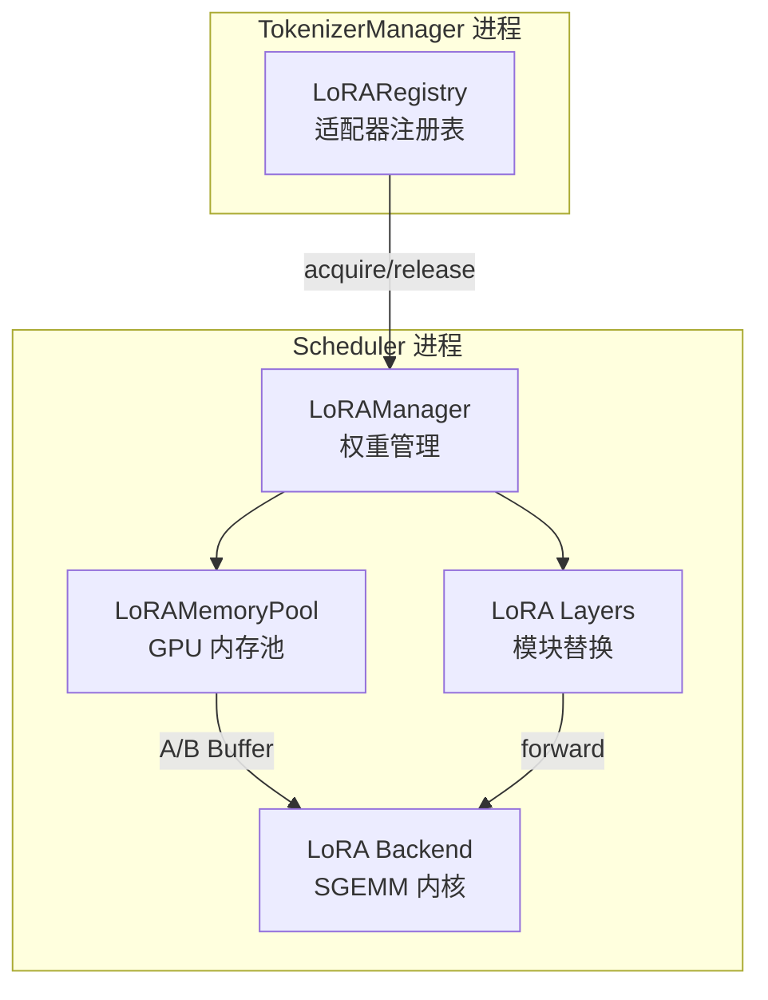
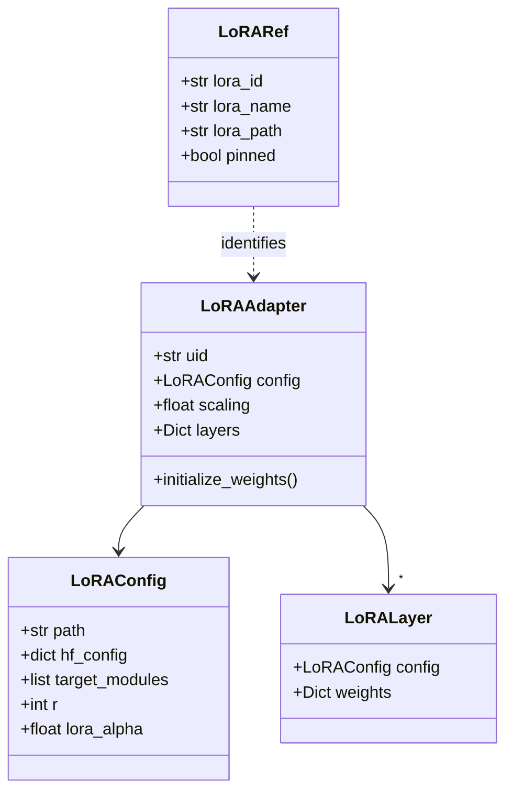
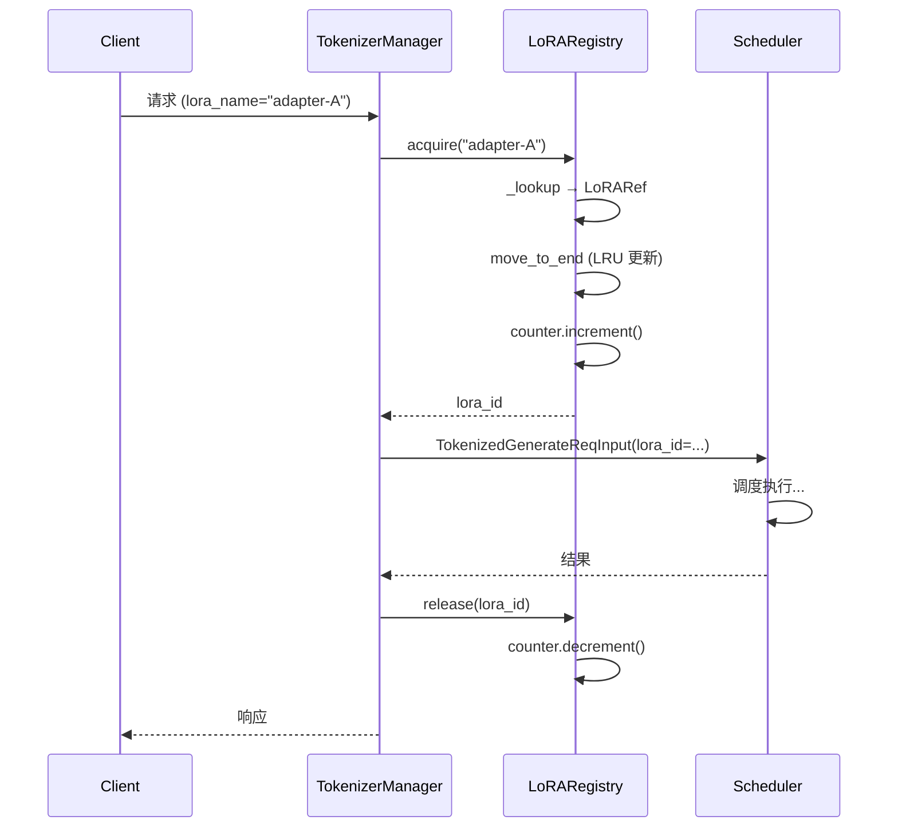
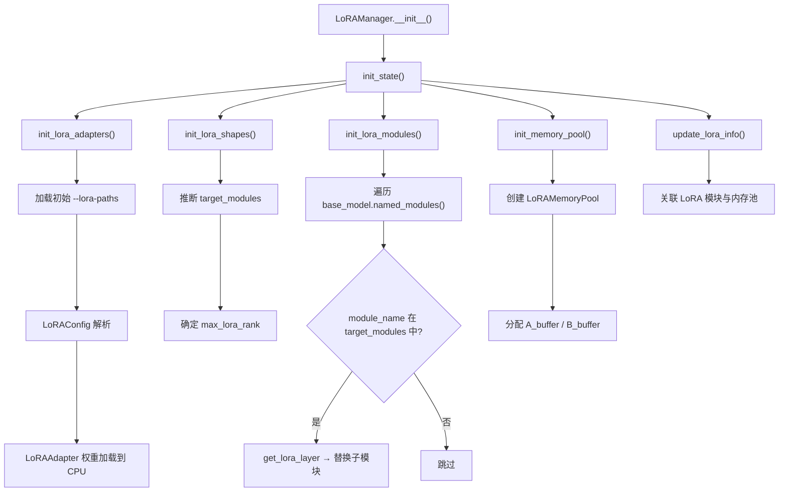
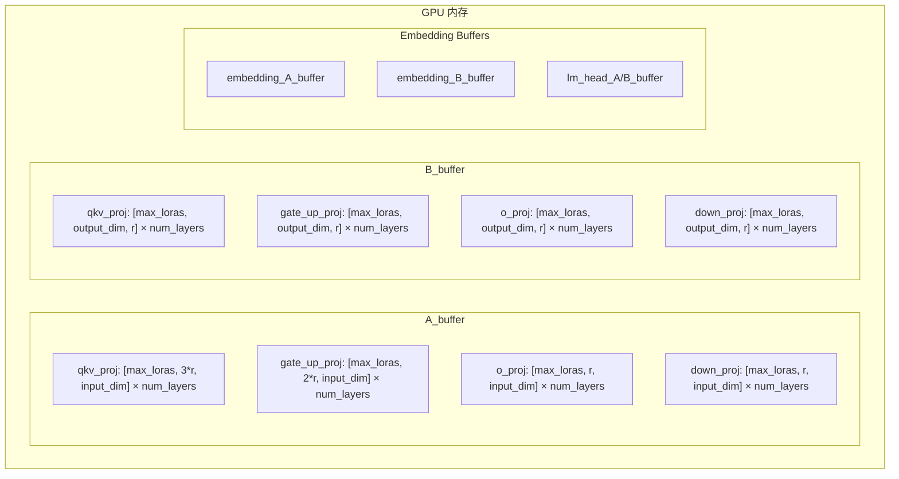
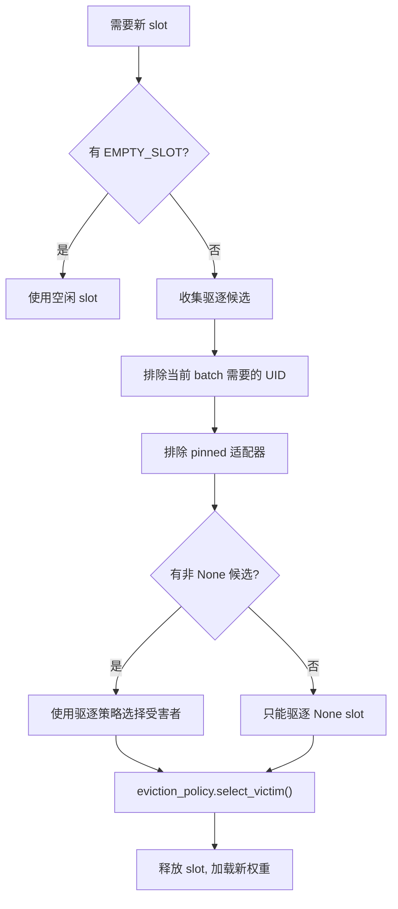
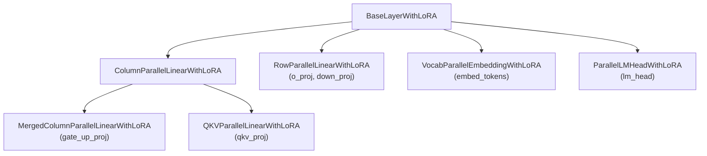
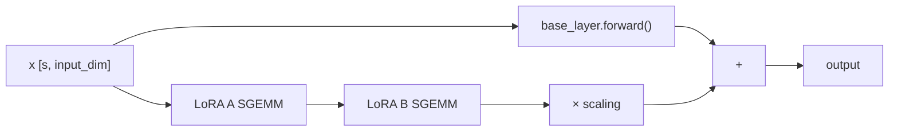
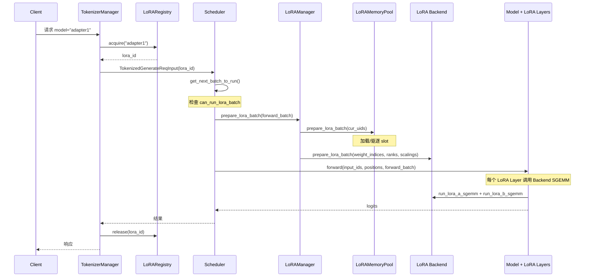
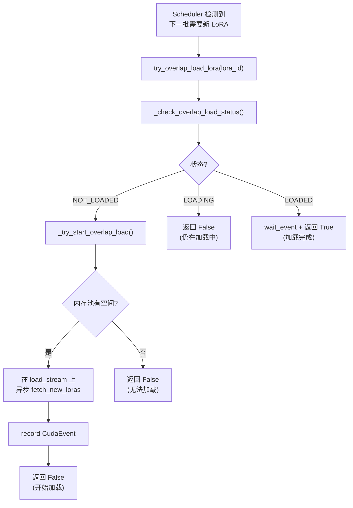

# SGLang LoRA 适配器详解

> **默认场景**: Qwen3.5 混合架构模型（Full Attention + Linear Attention/GatedDeltaNet + MoE + MTP）
>
> **启用特性**: PD 分离 + Chunked Prefill + ViT DP + Overlap Schedule + 多模态缓存 + EPLB + MTP + 线性注意力

## 本章定位
- 主题范围: LoRA 注册、加载与调度约束。

## 设计 Why（为什么这么设计）
- LoRA 在多租户场景需平衡动态加载、隔离性和显存效率。
- 核心取舍: 吞吐 vs 时延、显存 vs 计算、通用性 vs 特化。

## 阅读建议（进阶）
1. 先抓目标函数和边界条件，再读具体实现。
2. 先看调用链和状态变化，再看局部优化细节。
3. 源码锚点以“路径 + 类/函数”为主，避免依赖易漂移行号。

## 1. 概览

### 1.1 LoRA 原理

LoRA (Low-Rank Adaptation) 通过在预训练权重旁注入低秩矩阵实现高效微调：

```
W' = W + B × A × scaling
```

其中：
- `W`: 原始预训练权重 `[output_dim, input_dim]`
- `A`: 低秩矩阵 `[r, input_dim]` (r << input_dim)
- `B`: 低秩矩阵 `[output_dim, r]`
- `scaling = lora_alpha / r`

### 1.2 SGLang LoRA 架构

SGLang 实现了 **S-LoRA** (多租户 LoRA serving) 和 **Punica** (SGEMM 内核) 的核心思想，支持同时服务数千个 LoRA 适配器。



### 1.3 核心文件索引

| 文件 | 说明 |
|------|------|
| `python/sglang/srt/lora/lora_registry.py` | LoRARef + LoRARegistry (请求路由) |
| `python/sglang/srt/lora/lora_config.py` | LoRAConfig (adapter_config.json 解析) |
| `python/sglang/srt/lora/lora.py` | LoRALayer + LoRAAdapter (权重容器) |
| `python/sglang/srt/lora/lora_manager.py` | LoRAManager (核心管理器) |
| `python/sglang/srt/lora/mem_pool.py` | LoRAMemoryPool (GPU 内存管理) |
| `python/sglang/srt/lora/layers.py` | BaseLayerWithLoRA 及各变体 (模块替换) |
| `srt/lora/backend/` | 各后端实现 (Triton, Chunked, Torch, Ascend) |
| `python/sglang/srt/lora/eviction_policy.py` | LRU/FIFO 驱逐策略 |

---

## 2. 数据结构

### 2.1 LoRARef

**文件**: `python/sglang/srt/lora/lora_registry.py`

唯一标识一个 LoRA 适配器的引用记录：

```python
@dataclass(frozen=True)
class LoRARef:
    lora_id: str = field(default_factory=lambda: uuid4().hex)  # 唯一 UUID
    lora_name: Optional[str] = None    # 用户可见名称
    lora_path: Optional[str] = None    # 适配器路径
    pinned: Optional[bool] = None      # 是否常驻 GPU
```

`lora_id` 使用 UUID 自动生成，消除了名称或路径重用带来的冲突，也可用于生成确定性的缓存 key（如 RadixCache）。

### 2.2 LoRAConfig

**文件**: `python/sglang/srt/lora/lora_config.py`

解析 `adapter_config.json`：

```python
class LoRAConfig:
    def __init__(self, path: str):
        self.hf_config = self.get_lora_config()  # 读取 adapter_config.json
        self.target_modules = self.hf_config["target_modules"]
        self.r = self.hf_config["r"]              # LoRA rank
        self.lora_alpha = self.hf_config["lora_alpha"]
        self.added_tokens_config = self.get_added_tokens_config()
        self.lora_added_tokens_size = len(self.added_tokens_config) if ... else 0
```

### 2.3 LoRAAdapter / LoRALayer

**文件**: `python/sglang/srt/lora/lora.py`

```python
class LoRALayer(nn.Module):
    """单层 LoRA 权重容器"""
    def __init__(self, config, base_hf_config):
        self.config = config
        self.base_hf_config = base_hf_config
        self.weights: Dict[str, torch.Tensor] = {}  # CPU 上的权重

class LoRAAdapter(nn.Module):
    """完整 LoRA 适配器 (包含所有层)"""
    def __init__(self, uid, config, base_hf_config, load_config, lora_backend):
        self.uid = uid
        self.config = config
        self.scaling = config.lora_alpha / config.r
        self.layers: Dict[int, LoRALayer] = {}
```



---

## 3. LoRARegistry — 请求路由

**文件**: `python/sglang/srt/lora/lora_registry.py`

`LoRARegistry` 运行在 **TokenizerManager 进程**中，是所有可用 LoRA 适配器的单一数据源。

### 3.1 核心数据结构

```python
class LoRARegistry:
    _registry_lock: RWLock                          # 读写锁
    _registry: OrderedDict[str, LoRARef]            # LRU 有序字典 (name → ref)
    _counters: Dict[str, ConcurrentCounter]         # 使用计数器 (id → counter)
```

### 3.2 请求生命周期



### 3.3 并发控制

- **RWLock**: `register`/`unregister` 使用 writer_lock（互斥），`release` 使用 reader_lock（共享）
- **ConcurrentCounter**: acquire/release 通过原子计数器追踪使用量，卸载时需等待计数归零
- **LRU 顺序**: `_registry` 使用 `OrderedDict`，每次 acquire 调用 `move_to_end()` 更新访问顺序

### 3.4 动态加载/卸载

```python
# 注册新适配器
await registry.register(LoRARef(lora_name="new-adapter", lora_path="/path/to/adapter"))

# 卸载适配器 (需等待使用计数归零)
lora_id = await registry.unregister("adapter-name")
await registry.wait_for_unload(lora_id)  # 等待所有请求完成
```

---

## 4. LoRAManager — 权重管理

**文件**: `python/sglang/srt/lora/lora_manager.py`

`LoRAManager` 运行在 **Scheduler 进程**中，负责管理 LoRA 权重的加载、缓存和批次准备。

### 4.1 初始化流程



### 4.2 模块替换

`init_lora_modules` 是 LoRA 集成的关键步骤，通过 `replace_submodule` 将原始模块替换为带 LoRA 的版本：

```python
def set_lora_module(self, module_name, module):
    lora_module = get_lora_layer(module, self.lora_backend)
    replace_submodule(self.base_model, module_name, lora_module)
    return lora_module
```

替换规则：
- `embed_tokens` → `VocabParallelEmbeddingWithLoRA`
- `lm_head` → `ParallelLMHeadWithLoRA`
- `qkv_proj` → `QKVParallelLinearWithLoRA`
- `gate_up_proj` → `MergedColumnParallelLinearWithLoRA`
- `o_proj`, `down_proj` → `RowParallelLinearWithLoRA`
- 其他 Linear → `ColumnParallelLinearWithLoRA`

### 4.3 prepare_lora_batch

每次 forward 前调用，准备批次的 LoRA 信息：

```python
def prepare_lora_batch(self, forward_batch: ForwardBatch):
    cur_uids = set(forward_batch.lora_ids)

    # 1. 将活跃 LoRA 加载到 GPU 内存池
    self.memory_pool.prepare_lora_batch(cur_uids, self.loras, ...)

    # 2. 构建 weight_indices, lora_ranks, scalings
    for i, uid in enumerate(forward_batch.lora_ids):
        weight_indices[i] = self.memory_pool.get_buffer_id(uid)
        if uid is not None:
            lora_ranks[weight_indices[i]] = self.loras[uid].config.r
            scalings[weight_indices[i]] = self.loras[uid].scaling

    # 3. 传递给后端准备 batch info
    self.lora_backend.prepare_lora_batch(forward_batch, weight_indices, ...)
```

---

## 5. LoRAMemoryPool — GPU 内存管理

**文件**: `python/sglang/srt/lora/mem_pool.py`

### 5.1 Buffer 结构



A_buffer 和 B_buffer 分别存储所有目标模块的 LoRA A/B 权重。每个模块对应一个 buffer 列表，长度为 `num_hidden_layers`，每个 buffer 的第一个维度为 `max_loras_per_batch`，即最多同时驻留的 LoRA 数。

### 5.2 Slot 管理

```python
# Lora uid → buffer slot 索引
uid_to_buffer_id: Dict[Optional[str], int] = {}

# buffer slot 索引 → Lora uid (EMPTY_SLOT 表示空闲)
buffer_id_to_uid: List[Union[str, None, EmptySlot]] = [EMPTY_SLOT] * max_loras_per_batch
```

注意：`None` 是合法的 uid，表示基础模型（无 LoRA）的零权重 slot。

### 5.3 驱逐策略



支持的驱逐策略：
- **LRU** (Least Recently Used): 驱逐最久未使用的适配器
- **FIFO** (First In First Out): 驱逐最早加载的适配器

### 5.4 权重加载 + TP 切片

权重从 CPU (`LoRAAdapter`) 复制到 GPU buffer 的指定 slot。LoRA Manager 在 `init_lora_shapes` 阶段已经考虑了 Tensor Parallelism 的切片：

```python
# A_buffer shape 考虑 TP (RowParallel 模块的 input_dim 需要切分)
if tp_size > 1 and module_name in ROW_PARALLELISM_LINEAR_LORA_NAMES:
    input_dim = divide(input_dim, tp_size)

# B_buffer shape 考虑 TP (非 RowParallel 模块的 output_dim 需要切分)
if tp_size > 1 and module_name not in ROW_PARALLELISM_LINEAR_LORA_NAMES:
    output_dim = divide(output_dim, tp_size)
```

---

## 6. LoRA Layer 实现

**文件**: `python/sglang/srt/lora/layers.py`

### 6.1 BaseLayerWithLoRA

所有 LoRA 层的基类，封装原始层并添加 LoRA 前向逻辑：

```python
class BaseLayerWithLoRA(nn.Module):
    def __init__(self, base_layer, lora_backend):
        self.base_layer = base_layer
        self.lora_backend = lora_backend
        self.lora_a_weights = None  # GPU buffer 引用
        self.lora_b_weights = None

    def set_lora_info(self, lora_a_weights, lora_b_weights):
        """关联 GPU 内存池中的权重"""
        self.lora_a_weights = lora_a_weights
        self.lora_b_weights = lora_b_weights
```

### 6.2 层变体



### 6.3 Forward 路径

以 `ColumnParallelLinearWithLoRA` 为例：

```python
def forward(self, x):
    # 1. 基础模型 forward
    result = self.base_layer(x)

    # 2. LoRA A: x → [s, input_dim] × [max_loras, r, input_dim]^T → [s, r]
    lora_a_output = self.lora_backend.run_lora_a_sgemm(x, self.lora_a_weights, ...)

    # 3. LoRA B: [s, r] × [max_loras, output_dim, r]^T → [s, output_dim]
    lora_b_output = self.lora_backend.run_lora_b_sgemm(lora_a_output, self.lora_b_weights, ...)

    # 4. 加上 scaling 后合并
    result += lora_b_output
    return result
```



特殊变体：
- **QKVParallelLinearWithLoRA**: 使用 `run_qkv_lora` 一次处理 Q/K/V 三个投影，A 权重形状 `[max_loras, 3*r, input_dim]`
- **MergedColumnParallelLinearWithLoRA**: 使用 `run_gate_up_lora` 处理 gate+up 两个投影，A 权重形状 `[max_loras, 2*r, input_dim]`
- **VocabParallelEmbeddingWithLoRA**: 处理 embedding 查找 + 额外 token 嵌入

**已知限制**:

- **TP > 1 不支持 Embedding LoRA**: `VocabParallelEmbeddingWithLoRA.slice_lora_a_weights()` 在 `tp_rank > 1` 时直接抛出 `NotImplementedError`，因此 Embedding 层的 LoRA 仅支持单卡部署
- **不支持额外 token**: `extra_token_embedding()` 方法未实现（抛出 `NotImplementedError`），`validate_new_adapter()` 会拒绝 `lora_added_tokens_size > 0` 的 adapter。这意味着当前不支持在 LoRA 微调中添加新词表 token 的场景

---

## 7. Backend 实现

**文件**: `srt/lora/backend/`

所有后端继承 `BaseLoRABackend`，实现以下核心 API：

| 方法 | 说明 |
|------|------|
| `run_lora_a_sgemm(x, weights)` | Segment GEMM: LoRA A 矩阵乘法 |
| `run_lora_b_sgemm(x, weights)` | Segment GEMM: LoRA B 矩阵乘法 |
| `run_qkv_lora(x, a, b)` | QKV 合并 LoRA |
| `run_gate_up_lora(x, a, b)` | Gate+Up 合并 LoRA |
| `run_lora_a_embedding(ids, weights)` | LoRA embedding 查找 |
| `prepare_lora_batch(...)` | 批次准备 |
| `init_cuda_graph_batch_info(...)` | CUDA Graph 初始化 |

### 7.1 可用后端

| 后端 | 文件 | 说明 |
|------|------|------|
| **Triton** (`triton`) | `python/sglang/srt/layers/attention/triton_backend.py` | 默认后端，Triton SGEMM 内核 |
| **Chunked SGMV** (`csgmv`) | `python/sglang/srt/lora/backend/chunked_backend.py` | 分块 SGMV，优化大批量 |
| **Torch Native** (`torch_native`) | `python/sglang/srt/lora/backend/torch_backend.py` | 纯 PyTorch 实现，作为 fallback |
| **Ascend** (`ascend`) | `python/sglang/srt/lora/backend/ascend_backend.py` | 华为 NPU 后端 |
| **FlashInfer** (`flashinfer`) | — | **已废弃** |

完整的后端注册表（`python/sglang/srt/lora/backend/lora_registry.py`）：

后端注册改为 **装饰器模式**，通过 `@register_lora_backend(name)` 注册工厂函数：

```python
- 源码锚点: `python/sglang/srt/lora/backend/lora_registry.py`
LORA_SUPPORTED_BACKENDS = {}

def register_lora_backend(name):
    def decorator(fn):
        LORA_SUPPORTED_BACKENDS[name] = fn
        return fn
    return decorator

@register_lora_backend("triton")
def create_triton_backend():
    from sglang.srt.lora.backend.triton_backend import TritonLoRABackend
    return TritonLoRABackend

@register_lora_backend("csgmv")
def create_triton_csgmv_backend():
    from sglang.srt.lora.backend.chunked_backend import ChunkedSgmvLoRABackend
    return ChunkedSgmvLoRABackend

@register_lora_backend("ascend")
def create_ascend_backend():
    from sglang.srt.lora.backend.ascend_backend import AscendLoRABackend
    return AscendLoRABackend

@register_lora_backend("torch_native")
def create_torch_native_backend():
    from sglang.srt.lora.backend.torch_backend import TorchNativeLoRABackend
    return TorchNativeLoRABackend

@register_lora_backend("flashinfer")
def create_flashinfer_backend():
    raise ValueError("FlashInfer LoRA backend has been deprecated, ...")
```

这种设计的优势：
- **延迟导入**: 工厂函数内部才 import 具体后端类，避免未安装依赖时的导入错误
- **可扩展**: 第三方可通过 `@register_lora_backend("custom")` 注册自定义后端
- **统一入口**: `get_backend_from_name(name)` 查找注册表并调用工厂函数

> **flashinfer 后端已废弃**: 指定 `--lora-backend flashinfer` 会直接抛出 `ValueError`，引导用户迁移到 `triton` 后端。

### 7.2 Segment GEMM

LoRA 的核心计算是 **Segment GEMM** (分段矩阵乘法)：批内不同请求使用不同的 LoRA 权重矩阵，需要根据 `weight_indices` 选择每个请求对应的权重切片。

```
对于 batch 中的每个请求 i:
    output[i] = x[i] @ weights[weight_indices[i]].T
```

这与标准 GEMM 的区别在于每个序列可能使用不同的权重矩阵。Triton 和 Chunked 后端通过自定义内核高效实现了这一操作。

### 7.3 LoRABatchInfo

**文件**: `python/sglang/srt/lora/utils.py`

`LoRABatchInfo` 是后端执行 Segment GEMM 时的批次描述结构，由 `prepare_lora_batch` 构建：

```python
@dataclass
class LoRABatchInfo:
    use_cuda_graph: bool              # 是否使用 CUDA Graph
    bs: int                           # 批大小
    num_segments: int                 # 段数（Triton 后端等于 bs）
    seg_indptr: torch.Tensor          # 每段的起止指针 (num_segments + 1,)
    weight_indices: torch.Tensor      # 每段使用的 LoRA 权重索引 (num_segments,)
    lora_ranks: torch.Tensor          # 各 LoRA adapter 的 rank (lora_num,)
    scalings: torch.Tensor            # 各 LoRA adapter 的 scaling (lora_num,)
    max_len: Optional[int]            # 当前批次最大段长度
    seg_lens: Optional[torch.Tensor]  # 各段长度 (num_segments,)
    permutation: Optional[torch.Tensor]  # token 重排序索引 (num_tokens,)
```

`seg_indptr` 和 `seg_lens` 描述了 packed 序列中每个请求的 token 范围，`weight_indices` 将每个请求映射到 GPU 内存池中对应的 LoRA 权重 slot。`permutation` 用于 Chunked 后端按 LoRA adapter 分组重排 token，提升 GEMM 效率。

---

## 8. Scheduler 集成

**文件**: `python/sglang/srt/managers/scheduler.py`

### 8.1 调度约束

Scheduler 在构建 prefill 批次时检查 LoRA 约束：

```python
if self.enable_lora:
    lora_set = set([req.lora_id for req in self.running_batch.reqs])

for req in self.waiting_queue:
    if self.enable_lora:
        new_lora_set = (
            lora_set
            | set([req.lora_id for req in adder.can_run_list])
            | set([req.lora_id])
        )
        if not self.tp_worker.can_run_lora_batch(new_lora_set):
            if req.lora_id is not None:
                continue  # 跳过会超出 slot 限制的 LoRA 请求
```

`can_run_lora_batch` 检查新 LoRA ID 集合是否超过 `max_loras_per_batch` 限制，同时考虑 pinned 适配器的占用。

### 8.2 RadixCache LoRA 隔离

不同 LoRA 适配器的 KV Cache 不能共享。通过在 RadixCache 的 key 中包含 `lora_id`，确保不同适配器的缓存自动隔离：

```python
req = Req(
    ...,
    lora_id=recv_req.lora_id,  # LoRA ID 作为请求属性
)
```

### 8.3 动态加载/卸载 API

```python
# Scheduler 请求分发表中的 LoRA 操作
(LoadLoRAAdapterReqInput, self.load_lora_adapter),
(UnloadLoRAAdapterReqInput, self.unload_lora_adapter),
```

### 8.4 validate_new_adapter 验证逻辑

**文件**: `python/sglang/srt/lora/lora_manager.py`

运行时动态加载 adapter 时，`validate_new_adapter` 执行 3 步验证，作为安全守卫防止无效或冲突的 adapter 被加载：

```python
def validate_new_adapter(self, lora_config: LoRAConfig, lora_ref: LoRARef):
    # 步骤 0: 额外 token 检查 (当前不支持添加词表 token 的 adapter)
    if lora_config.lora_added_tokens_size > 0:
        raise ValueError("LoRA serving currently doesn't support adapters "
                        "that add tokens to the vocabulary")

    # 步骤 1: 名称去重
    for existing_lora_ref in self.lora_refs.values():
        if lora_ref.lora_name == existing_lora_ref.lora_name:
            raise ValueError(f"...{lora_ref.lora_name} is already loaded")
        # 同路径不同名: 打印 Warning（允许加载但提醒用户）
        if lora_ref.lora_path == existing_lora_ref.lora_path:
            logger.warning(f"{lora_ref.lora_path} is already loaded with name: "
                          f"{existing_lora_ref.lora_name}, but another copy is being loaded...")

    # 步骤 2: 内存池兼容性检查
    # 检查 adapter 的 rank 和 target_modules 是否与当前内存池配置兼容
    memory_pool = getattr(self, "memory_pool", None)
    incompatible = memory_pool and not memory_pool.can_support(lora_config)
    if incompatible:
        raise ValueError(f"...rank {lora_config.r} is incompatible with the current "
                        "LoRA memory pool configuration...")

    # 步骤 3: pinned 上限检查
    # pinned adapter 数量不能占满所有 slot，至少留 1 个给 unpinned 和 base model
    if lora_ref.pinned and self.num_pinned_loras >= self.max_loras_per_batch - 1:
        raise ValueError(f"...not allowed to pin all slots in the LoRA memory pool "
                        "to avoid starvation for unpinned adapters and base models...")
```

验证步骤总结：

| 步骤 | 检查内容 | 失败行为 |
|------|---------|---------|
| 0. 额外 token | `lora_added_tokens_size > 0`（添加词表 token） | `raise ValueError`（当前不支持） |
| 1a. 名称去重 | adapter 名称是否已存在于 registry | `raise ValueError`（拒绝加载） |
| 1b. 路径重复提醒 | 同路径不同名 | `logger.warning`（允许加载但警告） |
| 2. 内存兼容性 | rank 和 target_modules 是否匹配 `memory_pool.can_support()` | `raise ValueError`（拒绝加载） |
| 3. pinned 上限 | pinned 数量是否达到 `max_loras_per_batch - 1` | `raise ValueError`（防止饥饿） |

步骤 3 的 `-1` 设计确保至少保留 1 个 slot 给 unpinned adapter 或 base model（`None` uid），避免所有 slot 都被 pinned adapter 占满导致其他请求无法调度。

---

## 9. CUDA Graph 兼容性

### 9.1 预分配 LoRABatchInfo

CUDA Graph 要求所有张量地址在录制后不变。LoRA 后端通过预分配 batch info 张量并进行 **in-place 更新** 来支持 CUDA Graph：

```python
def init_cuda_graph_batch_info(self, max_bs_in_cuda_graph, num_tokens_per_bs):
    """在 CUDA Graph 录制前预分配所有 batch info 张量"""
    self.max_bs_in_cuda_graph = max_bs_in_cuda_graph
    self.lora_backend.init_cuda_graph_batch_info(
        max_bs_in_cuda_graph=max_bs_in_cuda_graph,
        num_tokens_per_bs=num_tokens_per_bs,
    )
```

### 9.2 In-place 更新策略

```python
def prepare_lora_batch(self, forward_batch, weight_indices, lora_ranks, scalings, use_cuda_graph):
    if use_cuda_graph:
        # 使用 in-place 操作更新预分配的张量
        # 张量地址不变，内容更新
        ...
    else:
        # 正常创建新的 batch info
        ...
```

---

## 10. 配置参数表

| 参数 | 说明 | 默认值 |
|------|------|--------|
| `--enable-lora` | 启用 LoRA 支持 | False |
| `--lora-paths` | 初始加载的 LoRA 适配器路径列表 | None |
| `--max-loras-per-batch` | 单批次最大 LoRA 数 | 8 |
| `--max-lora-rank` | 最大 LoRA rank | 自动推断 |
| `--lora-target-modules` | 目标模块列表 | 自动推断 |
| `--lora-backend` | SGEMM 后端 (triton/csgmv/torch_native/ascend) | triton |
| `--lora-eviction-policy` | 驱逐策略 (lru/fifo) | lru |

### 10.1 启动示例

```bash
# 基本 LoRA 启动
python -m sglang.launch_server \
    --model-path meta-llama/Llama-3-8B \
    --enable-lora \
    --lora-paths adapter1=/path/to/adapter1 adapter2=/path/to/adapter2 \
    --port 30000

# 指定最大 rank 和目标模块
python -m sglang.launch_server \
    --model-path meta-llama/Llama-3-8B \
    --enable-lora \
    --max-lora-rank 16 \
    --lora-target-modules qkv_proj o_proj gate_up_proj down_proj \
    --max-loras-per-batch 16 \
    --port 30000
```

### 10.2 API 使用

```bash
# 指定 LoRA 适配器名称
curl http://localhost:30000/v1/completions \
  -H "Content-Type: application/json" \
  -d '{
    "model": "adapter1",
    "prompt": "Hello, world!",
    "max_tokens": 50
  }'

# 动态加载新适配器
curl http://localhost:30000/lora/load \
  -H "Content-Type: application/json" \
  -d '{
    "lora_name": "new-adapter",
    "lora_path": "/path/to/new-adapter"
  }'
```

---

## 11. 关键流程总结



---

## 12. LoRA Overlap Loader

**文件**: `python/sglang/srt/lora/lora_overlap_loader.py`

LoRA Overlap Loader 实现了 LoRA 权重的**异步重叠加载**机制：在模型推理的同时，利用独立的 CUDA Stream 异步加载下一个 LoRA 权重到 GPU 内存池，减少权重切换的延迟。

### 12.1 核心设计



### 12.2 关键实现

```python
class LoRAOverlapLoader:
    def __init__(self, lora_manager):
        self.lora_manager = lora_manager
        self.load_stream = device_module.Stream()          # 独立 CUDA Stream
        self.lora_to_overlap_load_event: Dict[str, CudaEvent] = {}  # 追踪异步加载事件

    def try_overlap_load_lora(self, lora_id, running_loras) -> bool:
        """检查并尝试异步加载 LoRA，返回是否已加载完成"""
        status = self._check_overlap_load_status(lora_id)
        if status == LoRAOverlapLoadStatus.LOADING:
            return False                    # 仍在加载
        elif status == LoRAOverlapLoadStatus.NOT_LOADED:
            self._try_start_overlap_load(lora_id, running_loras)
            return False                    # 刚开始加载
        else:  # LOADED
            return True                     # 加载完成
```

### 12.3 三阶段状态机

```python
class LoRAOverlapLoadStatus(Enum):
    LOADED = auto()      # 加载完成，可以使用
    LOADING = auto()     # 正在异步加载中
    NOT_LOADED = auto()  # 尚未开始加载
```

状态转换通过 `CudaEvent.query()` 非阻塞检查：
- `NOT_LOADED` → 调用 `_try_start_overlap_load()` → `LOADING`
- `LOADING` → `event.query()` 返回 True → `LOADED`（同时 `current_stream.wait_event(event)` 确保同步）

### 12.4 与 LoRAManager 的集成

`LoRAManager` 通过 `enable_lora_overlap_loading` 参数控制是否启用重叠加载：

```python
- 源码锚点: `python/sglang/srt/lora/lora_manager.py`
self.enable_lora_overlap_loading = server_args.enable_lora_overlap_loading

# 启用时，LoRA 权重在 CPU 上 pin memory 以加速 H2D 传输
if self.enable_lora_overlap_loading:
    lora_adapter.pin_weights_in_cpu()
```

---

## 13. Backend 目录扩展

**文件**: `srt/lora/backend/`

backend 目录经过重构，将后端注册逻辑独立为 `python/sglang/srt/lora/lora_registry.py`：

| 文件 | 说明 |
|------|------|
| `python/sglang/srt/lora/backend/base_backend.py` | `BaseLoRABackend` 抽象基类 |
| `python/sglang/srt/layers/attention/triton_backend.py` | Triton SGEMM 后端 (默认) |
| `python/sglang/srt/lora/backend/chunked_backend.py` | Chunked SGMV 后端 |
| `python/sglang/srt/lora/backend/torch_backend.py` | 纯 PyTorch fallback |
| `python/sglang/srt/lora/backend/ascend_backend.py` | 华为 NPU 后端 |
| `python/sglang/srt/lora/lora_registry.py` | 后端注册表 + 工厂函数 |

`python/sglang/srt/lora/lora_registry.py` 的装饰器注册模式使得添加新后端只需一个 `@register_lora_backend("name")` 装饰器，无需修改任何已有代码。

---

## 14. 管理组件更新

### 14.1 eviction_policy.py 重构

**文件**: `python/sglang/srt/lora/eviction_policy.py`

驱逐策略从 `python/sglang/srt/lora/mem_pool.py` 中独立为单独模块，采用策略模式：

```python
class EvictionPolicy(ABC):
    @abstractmethod
    def mark_used(self, uid: Optional[str]) -> None: ...
    @abstractmethod
    def select_victim(self, candidates: Set[Optional[str]]) -> Optional[str]: ...
    @abstractmethod
    def remove(self, uid: Optional[str]) -> None: ...

class LRUEvictionPolicy(EvictionPolicy):
    """基于 OrderedDict 的 LRU，追踪 access_order + 统计 eviction_count"""

class FIFOEvictionPolicy(EvictionPolicy):
    """基于 OrderedDict 的 FIFO，仅追踪 insertion_order"""

def get_eviction_policy(policy_name: str) -> EvictionPolicy:
    """工厂函数: 'lru' → LRUEvictionPolicy, 'fifo' → FIFOEvictionPolicy"""
```

两种策略都处理了 `None` uid（基础模型）作为驱逐候选的边界情况。

### 14.2 lora_manager.py 更新

- 新增 `enable_lora_overlap_loading` 属性，控制重叠加载
- 新增 `validate_lora_batch()` 方法，验证 LoRA ID 集合是否可调度（考虑 pinned adapter 占用）
- 新增 `fetch_new_loras()` 方法，供 `LoRAOverlapLoader` 调用
- `load_lora_weights()` 中新增 `pin_weights_in_cpu()` 调用（重叠加载模式下）
- 新增 `load_lora_adapter_from_tensors()` 方法，支持从内存中的张量字典直接加载 LoRA adapter，无需从磁盘读取。接口签名：`load_lora_adapter_from_tensors(lora_ref, tensors: Dict[str, Tensor], config_dict: Dict, added_tokens_config=None)`。内部调用 `LoRAConfig.from_dict()` 解析配置，然后走与磁盘加载相同的 `validate_new_adapter` 验证流程

### 14.3 lora_registry.py 更新

`LoRARef` 新增 `__post_init__` 验证和 `__str__` 格式化方法，增强了数据完整性检查。

## 与其他章节关系
- 与 `03/06/07/08` 强耦合。


## 最小可验证实验
- 固定模型和负载，仅切换本章机制开关。
- 记录 TTFT、TPOT、吞吐、显存峰值与回退率。
- 总结收益场景、退化场景、推荐默认值。


## 常见误解
- LoRA 只是线性层增量，不涉及系统调度。
