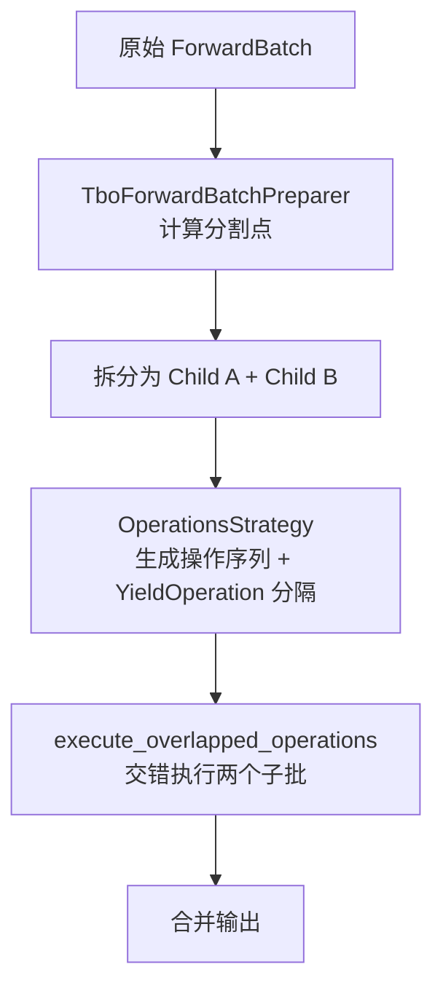

# SGLang Batch Overlap 计算-通信重叠

> **默认场景**: Qwen3.5 混合架构模型（Full Attention + Linear Attention/GatedDeltaNet + MoE + MTP）
>
> **启用特性**: PD 分离 + Chunked Prefill + ViT DP + Overlap Schedule + 多模态缓存 + EPLB + MTP + 线性注意力

## 1. 概述

### 1.1 为什么需要 Batch Overlap

MoE 模型在 Expert Parallel (EP) 部署时，每层 MoE 都需要执行 **all-to-all 通信**：先将 token dispatch 到对应 expert 所在的 GPU，expert 计算完成后再 combine 回来。随着 EP 规模增大（尤其跨节点），通信延迟占 forward 时间的比例显著上升，GPU 在等待通信完成期间处于空闲状态。

Batch Overlap 的核心思想：利用多 CUDA stream 或批次交错，让**计算与通信在时间上重叠**，从而隐藏通信延迟。

与 Scheduler 级别的 `event_loop_overlap`（CPU 调度与 GPU 前向重叠）不同，Batch Overlap 关注的是 **GPU 内部**的计算与通信重叠，两者互不冲突，可同时启用：

```
Scheduler.event_loop_overlap()     ← CPU/GPU 重叠（调度 vs 前向）
    └─ run_batch()
        └─ ModelRunner.forward()
            └─ batch_overlap        ← GPU 内部重叠（计算 vs 通信）
```

### 1.2 两种模式

SGLang 提供两种互斥的重叠模式：

| 模式 | 全称 | 粒度 | 核心思想 |
|------|------|------|---------|
| **SBO** | Single Batch Overlap | 单批内部 | MoE combine 通信与 down GEMM 计算在不同 CUDA stream 上并行 |
| **TBO** | Two Batch Overlap | 双批交错 | 将 batch 拆成两个子批，交替执行计算和通信 |

### 1.3 启用条件与配置

**参数表**:

| 参数 | 默认值 | 说明 |
|------|--------|------|
| `--enable-two-batch-overlap` | `false` | 启用 TBO |
| `--enable-single-batch-overlap` | `false` | 启用 SBO |
| `--moe-a2a-backend` | `"none"` | MoE all-to-all 通信后端 |
| `--tbo-token-distribution-threshold` | `0.48` | TBO extend 模式下 two-chunk split 的触发阈值 |

**前置条件**:

- SBO 与 TBO **互斥**，不可同时启用
- TBO 要求 `moe_a2a_backend != "none"`，否则启动报错
- TBO 不支持 draft worker（投机解码的 draft 模型）
- SBO 要求 MOE runner backend 支持（FlashInfer CuteDSL 或 DeepGEMM）
- 仅在 EP > 1（多卡 Expert Parallel）场景下有意义

**启用示例**:

```bash
# TBO 模式
python -m sglang.launch_server --model-path Qwen/Qwen3.5-397B-A17B-FP8 \
    --tp 8 --ep 8 \
    --enable-two-batch-overlap \
    --moe-a2a-backend deepep_low_latency

# SBO 模式
python -m sglang.launch_server --model-path Qwen/Qwen3.5-397B-A17B-FP8 \
    --tp 8 --ep 8 \
    --enable-single-batch-overlap \
    --moe-a2a-backend deepep_low_latency
```

### 1.4 核心文件索引

| 文件 | 行数 | 说明 |
|------|------|------|
| `srt/batch_overlap/single_batch_overlap.py` | ~145 | SBO 实现 |
| `srt/batch_overlap/two_batch_overlap.py` | ~1074 | TBO 实现 |
| `srt/batch_overlap/operations.py` | ~214 | Stage 执行框架 |
| `srt/batch_overlap/operations_strategy.py` | ~296 | 模型特定操作策略 |
| `srt/layers/attention/tbo_backend.py` | ~264 | TBO Attention 后端包装器 |

---

## 2. SBO (Single Batch Overlap)

**文件**: `srt/batch_overlap/single_batch_overlap.py`

SBO 在单个 batch 的 MoE 层内部，将 **combine 通信**与 **down GEMM 计算**放在不同 CUDA stream 上并行执行。注意：SBO 重叠的不是"MoE 通信与 attention 计算"，而是 MoE 层内部的两个子操作。

### 2.1 重叠原理

MoE 层的标准执行流程：

```
dispatch → experts(up_gemm + act + down_gemm) → combine → shared_experts → output
```

SBO 的优化：combine 通信完成后需要等待结果才能做最终 output，但 down GEMM 的计算可以与 combine 通信并行：

```
时间轴 ──────────────────────────────────────────→

Stream 0 (计算):  ┌─ experts(up+act) ─┐  ┌─ down GEMM ─┐
                  └────────────────────┘  └─────────────┘
                                               ↕ 重叠
Stream 1 (通信):                          ┌─ combine ─┐
                                          └───────────┘
```

### 2.2 SboFlags 特性开关

`SboFlags` 类控制 SBO 的各种重叠策略：

```python
class SboFlags:
    @classmethod
    def enable_combine_down_gemm_two_stream_overlap(cls):
        """combine 通信与 down GEMM 计算的双 stream 重叠"""
        return is_sbo_enabled() and (
            get_moe_runner_backend().is_flashinfer_cutedsl()
            or (get_moe_runner_backend().is_deep_gemm() and not is_blackwell())
        )

    @classmethod
    def enable_combine_shared_two_stream_overlap(cls):
        """combine 通信与 shared expert 计算的双 stream 重叠"""
        return is_sbo_enabled()
            and not cls.enable_dispatch_shared_one_stream_overlap()
            and not envs.SGLANG_BLACKWELL_OVERLAP_SHARED_EXPERTS_OUTSIDE_SBO

    @classmethod
    def enable_dispatch_shared_one_stream_overlap(cls):
        """dispatch 与 shared expert 在同一 stream 上重叠（非 Blackwell）"""
        return is_sbo_enabled() and not is_blackwell()

    @classmethod
    def fuse_shared_experts_inside_sbo(cls):
        """是否将 shared experts 融合到 SBO 流程中"""
        return (cls.enable_combine_shared_two_stream_overlap()
                or cls.enable_dispatch_shared_one_stream_overlap())
```

### 2.3 数据结构

```python
@dataclass
class CombineOverlapArgs:
    overlap: bool                    # 是否与 down GEMM 重叠
    stream: torch.cuda.Stream        # 备用 stream（通信用）
    wait_event: torch.cuda.Event     # 同步事件
    num_sms: Optional[int] = None    # 通信占用的 SM 数
    signal: Optional[torch.Tensor]   # 跨 stream 信号张量
    block_m: Optional[int] = 64      # 块大小
    threshold: Optional[int] = 0     # 重叠触发阈值

@dataclass
class DownGemmOverlapArgs:
    num_sms: int                     # 计算占用的 SM 数
    signal: torch.Tensor             # 完成信号
    start_event: torch.cuda.Event    # 启动同步事件
```

### 2.4 SM 分配策略

SBO 的关键在于将 GPU 的 SM（Streaming Multiprocessor）划分为通信和计算两组：

```python
def compute_overlap_args(dispatch_output, alt_stream):
    total_num_sms = torch.cuda.get_device_properties("cuda").multi_processor_count

    # SM 分配：Blackwell 32 个给通信，其他架构 3 个
    communicate_num_sms = 32 if is_blackwell() else 3
    compute_num_sms = total_num_sms - communicate_num_sms
    # 可通过环境变量 SGLANG_DEEPEP_LL_COMBINE_SEND_NUM_SMS 覆盖
```

信号张量的类型也因架构而异：
- **Blackwell**: `uint32` 信号，每个 expert 一个
- **其他架构**: `int32` 信号，按 block 粒度（`block_m=64`）

---

## 3. TBO (Two Batch Overlap)

**文件**: `srt/batch_overlap/two_batch_overlap.py`

TBO 是更激进的重叠策略：将一个 batch 拆成两个子批（A 和 B），通过**交错执行**让 A 的计算与 B 的通信重叠。

### 3.1 整体流程



### 3.2 批次分割策略

分割策略根据 forward mode 不同而不同：

**Decode / Target Verify 模式**（每个序列 token 数固定）：

```python
# 简单对半分：按序列数除以 2
split_seq_index = (num_tokens // token_num_per_seq) // 2
```

**Extend (Prefill) 模式**（每个序列 token 数不同）：

需要更智能的分割来平衡两个子批的 token 总数：

```python
def _split_extend_seqs(extend_lens):
    # 1. 先尝试 balanced split：最小化左右 token 总数差
    vanilla_split = _split_array_by_balanced_sum(extend_lens)

    # 2. 检查是否严重不平衡
    left_sum = sum(extend_lens[:vanilla_split])
    overall_sum = sum(extend_lens)
    threshold = get_tbo_token_distribution_threshold()  # 默认 0.48

    # 3. 如果不平衡超过阈值，改用 two-chunk split
    if left_sum < overall_sum * threshold or left_sum > overall_sum * (1 - threshold):
        return _split_array_by_cum_less_than_half(extend_lens)

    return vanilla_split
```

**Balanced split**: 遍历序列，找到使左右 token 总数差最小的分割点。

**Two-chunk split**: 当 balanced split 仍然严重不平衡时（例如一个超长序列占据大部分 token），改为按 token 总数的一半来切分，允许将单个序列拆到两个子批中。

### 3.3 Stage 执行框架

**文件**: `srt/batch_overlap/operations.py`

TBO 的执行基于 **Stage 模型**：操作序列被 `YieldOperation` 分隔成多个 stage，两个子批的 stage 交错执行。

```python
# 操作类型
class YieldOperation:
    """Stage 分隔符，标记一个 stage 的结束"""
    pass

@dataclass
class ExecutionOperation:
    debug_name: str
    fn: Callable      # 签名: fn(state=..., **prev_output) -> dict
```

**交错执行逻辑**:

```python
def execute_overlapped_operations(inputs_arr, operations_arr, delta_stages):
    # delta_stages = [0, tbo_delta_stages]
    # Batch A 先跑 delta_stage 个 stage（领先启动）
    executor_a = _StageExecutor("a", stages_a, inputs=inputs_a)
    executor_b = _StageExecutor("b", stages_b, inputs=inputs_b)

    # Phase 1: A 先行
    for _ in range(delta_stage):
        executor_a.next()

    # Phase 2: A 和 B 交替执行
    for _ in range(executor_a.num_stages - delta_stage):
        executor_a.next()
        executor_b.next()

    # Phase 3: B 收尾
    for _ in range(delta_stage):
        executor_b.next()

    return [executor_a.output, executor_b.output]
```

`_StageExecutor` 在每个 stage 执行前会调用 `set_dp_buffer_len()` 设置当前子批的 DP buffer 长度，因为两个子批的 padded 长度可能不同。

### 3.4 操作策略 (OperationsStrategy)

**文件**: `srt/batch_overlap/operations_strategy.py`

`OperationsStrategy` 定义了每层 MoE 的操作序列和 stage 划分。当前支持三种模型架构：

| 模型 | 策略函数 |
|------|---------|
| DeepSeek V2/V3 | `_compute_moe_deepseek_layer_operations_strategy_tbo` |
| Qwen3 MoE | `_compute_moe_qwen3_layer_operations_strategy_tbo` |
| MiMoV2 | `_compute_moe_mimov2_layer_operations_strategy_tbo` |

每种模型都区分 **Prefill** 和 **Decode** 两种策略。

#### Prefill 策略（以 DeepSeek 为例）

```
tbo_delta_stages = 0  （A 和 B 同步启动）
deep_gemm_num_sms = total_sms - deepep_num_sms

操作序列:
  Stage 0: comm_prepare_attn → attn.prepare → attn.core →
           comm_prepare_mlp → gate → select_experts → dispatch_a
  ─── YieldOperation ───
  Stage 1: dispatch_b → experts → combine_a
  ─── YieldOperation ───
  Stage 2: shared_experts → combine_b → output → comm_postprocess
```

Prefill 时 `delta_stages=0`，两个子批同步执行，重叠发生在 stage 边界：A 的 Stage 1（experts 计算）与 B 的 Stage 0（attention + dispatch）并行。

#### Decode 策略（以 DeepSeek 为例）

```
tbo_delta_stages = 2  （A 领先 B 两个 stage）

操作序列:
  Stage 0: comm_prepare_attn → attn.prepare
  ─── YieldOperation ───
  Stage 1: attn.core → comm_prepare_mlp → gate → select_experts
  ─── YieldOperation ───
  Stage 2: dispatch_a → shared_experts
  ─── YieldOperation ───
  Stage 3: dispatch_b → experts → combine_a
  ─── YieldOperation ───
  Stage 4: combine_b
  ─── YieldOperation ───
  Stage 5: output → comm_postprocess
```

Decode 时 `delta_stages=2`，A 领先 B 两个 stage，实现更细粒度的交错：

```
时间轴 ──────────────────────────────────────────────────────→

Batch A:  [S0: attn_prep] [S1: attn+gate] [S2: dispatch+shared] [S3: experts+combine] [S4: combine] [S5: output]
Batch B:                                   [S0: attn_prep]       [S1: attn+gate]       [S2: disp+sh] [S3: exp+comb] [S4] [S5]
                                                ↕ A 的 dispatch/experts 与 B 的 attention 重叠
```

#### Qwen3 MoE 策略

Qwen3 的策略与 DeepSeek 基本相同（代码注释标注为 "unstable, keep redundant code for convenience"），唯一区别是 Qwen3 decode 策略中 dispatch_a 单独占一个 stage（没有与 shared_experts 合并），因为 Qwen3 MoE 的 shared expert 结构可能不同。

---

## 4. TBO Attention Backend

**文件**: `srt/layers/attention/tbo_backend.py`

TBO 需要专用的 attention 后端包装器，因为两个子批需要独立的 attention metadata。

### 4.1 架构

```python
class TboAttnBackend(AttentionBackend):
    def __init__(self, primary: AttentionBackend, children: List[AttentionBackend]):
        self.primary = primary          # 用于完整 batch 的 forward
        self.children = children        # [child_a, child_b] 用于子批

    @classmethod
    def init_new(cls, creator: Callable[[], AttentionBackend]):
        return cls(
            primary=creator(),
            children=[creator() for _ in range(2)],
        )
```

**三个 backend 实例的职责**:

| 实例 | 用途 |
|------|------|
| `primary` | 处理完整 batch 的 forward_extend / forward_decode |
| `children[0]` | 子批 A 的 attention metadata |
| `children[1]` | 子批 B 的 attention metadata |

### 4.2 Metadata 初始化

```python
def init_forward_metadata(self, forward_batch):
    # primary 始终初始化（用于非 TBO 路径的 fallback）
    self.primary.init_forward_metadata(forward_batch)

    # children 仅在 TBO 激活时初始化
    if forward_batch.tbo_children is not None:
        for child, fb_child in zip(self.children, forward_batch.tbo_children):
            if fb_child.batch_size > 0:
                child.init_forward_metadata(fb_child)
```

### 4.3 CUDA Graph 支持

TBO attention backend 为 children 独立管理 CUDA Graph 状态：

- `init_cuda_graph_state`: primary 和两个 children 都初始化（children 使用相同的 max_bs）
- `init_forward_metadata_capture_cuda_graph`: 根据 `compute_split_indices_for_cuda_graph_replay` 计算分割点，分别为两个 children 设置 capture 参数
- `init_forward_metadata_replay_cuda_graph`: replay 时同样分割 seq_lens、req_pool_indices 等张量

---

## 5. ForwardBatch TBO 字段

**文件**: `srt/model_executor/forward_batch_info.py`

ForwardBatch 中与 TBO 相关的字段：

| 字段 | 类型 | 说明 |
|------|------|------|
| `tbo_split_seq_index` | `int` | 序列维度的分割点 |
| `tbo_children` | `List[ForwardBatch]` | 两个子批的 ForwardBatch |
| `tbo_parent_token_range` | `Tuple[int, int]` | 子批在父批中的 token 范围 (start, end) |
| `tbo_padded_len` | `int` | 子批 padding 后的长度（对齐到 attention TP size） |
| `global_forward_mode` | `ForwardMode` | 所有 worker 一致的 forward mode |
| `global_dp_buffer_len` | `int` | DP attention 的全局 buffer 长度 |

---

## 6. 适用场景

| 场景 | 推荐模式 | 说明 |
|------|---------|------|
| MoE + EP（多卡） | TBO 或 SBO | all-to-all 通信可被计算隐藏，EP 规模越大收益越明显 |
| MoE + EP + 跨节点 | TBO | 跨节点通信延迟更高，TBO 的双批交错收益更大 |
| MoE 单卡 | 不适用 | 无 EP 通信开销 |
| Dense 模型 | 不适用 | 无 MoE 层，不涉及 all-to-all 通信 |
| TP-only（无 EP） | 不适用 | TP 使用 all-reduce，通信开销较小 |
