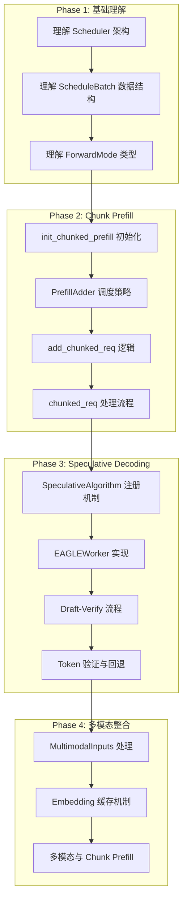
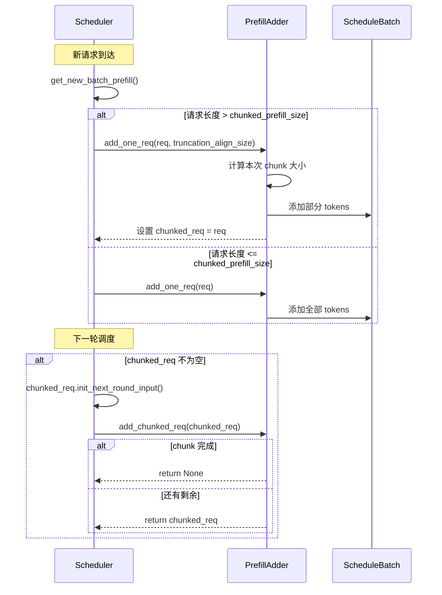
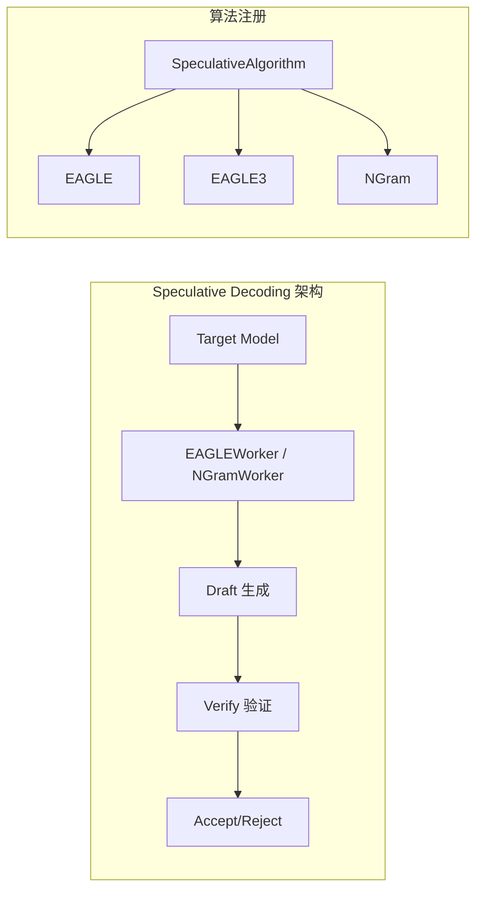
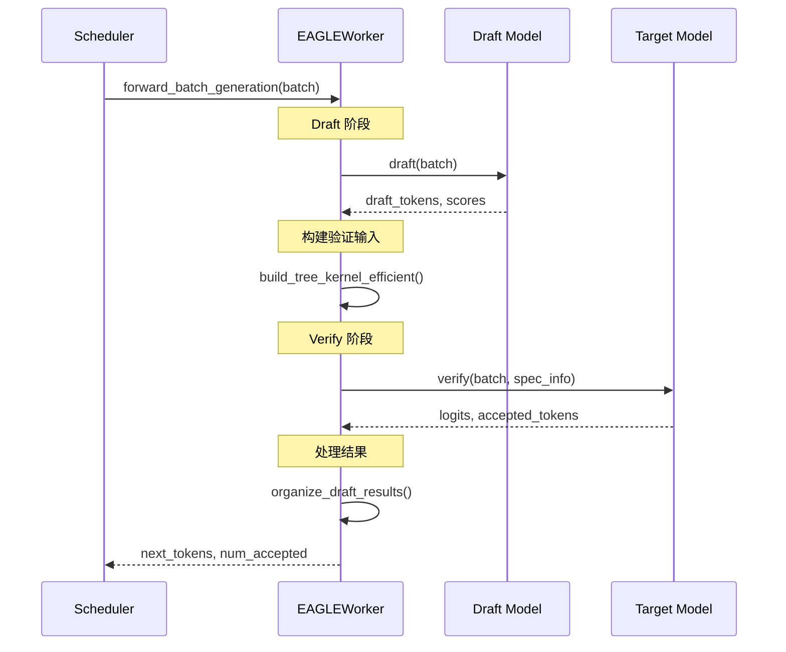
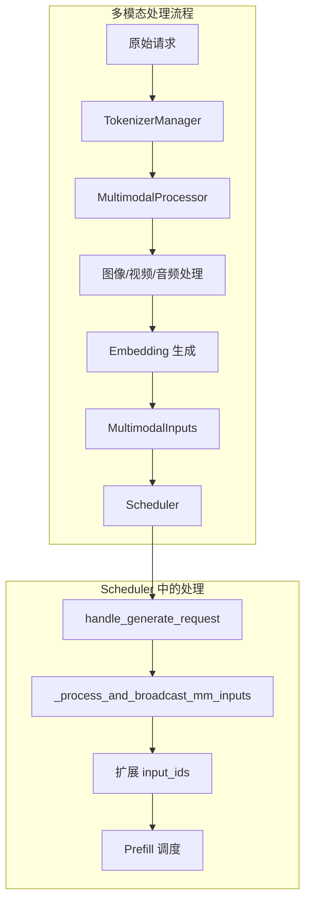

# SGLang Chunk Prefill 和 Speculative Decoding 学习路径

本文档为您规划了学习 SGLang 调度系统中 **Chunk Prefill** 和 **Speculative Decoding（投机采样）** 逻辑的详细路径，特别关注多模态场景的处理。

## 目录

1. [概述与核心概念](#1-概述与核心概念)
2. [学习路径规划](#2-学习路径规划)
3. [Chunk Prefill 详解](#3-chunk-prefill-详解)
4. [Speculative Decoding 详解](#4-speculative-decoding-详解)
5. [多模态场景特殊处理](#5-多模态场景特殊处理)
6. [关键代码文件索引](#6-关键代码文件索引)
7. [推荐阅读顺序](#7-推荐阅读顺序)

---

## 1. 概述与核心概念

### 1.1 Chunk Prefill（分块预填充）

**什么是 Chunk Prefill？**
- Chunk Prefill 是一种将长序列的 prefill 阶段分成多个较小的块（chunks）来处理的技术
- 目的是避免长序列一次性占用过多 GPU 内存和计算资源
- 允许 prefill 和 decode 请求混合调度（Mixed Batch），提高整体吞吐量

**核心优势：**
- 减少 TPOT（Time Per Output Token）的抖动：避免长 prefill 请求阻塞正在进行的 decode 请求
- 提高 GPU 利用率：允许 prefill 和 decode 混合调度
- 支持更长的上下文处理：将长序列分块处理，避免单次内存占用过大

### 1.2 Speculative Decoding（投机采样）

**什么是 Speculative Decoding？**
- 使用一个小型草稿模型（Draft Model）快速生成多个候选 token
- 目标模型（Target Model）并行验证这些候选 token
- 正确预测的 token 可以一次性接受，加速生成过程

**SGLang 支持的算法：**
- **EAGLE (Extrapolation Algorithm for Greater Language Model Efficiency)**
- **NGram-based Speculation**

---

## 2. 学习路径规划



---

## 3. Chunk Prefill 详解

### 3.1 初始化流程

**入口文件**: [scheduler.py](file:///Users/wesley/code/sglang/python/sglang/srt/managers/scheduler.py)

```python
# 关键初始化方法
def init_chunked_prefill(self):
    # 从 server_args 获取 chunked_prefill_size
    self.chunked_prefill_size = self.server_args.chunked_prefill_size
    
    # 支持 Diffusion LLM 的块大小配置
    if self.dllm_config is not None:
        self.chunked_prefill_size = self.dllm_config.block_size
    
    # -1 表示禁用
    if self.chunked_prefill_size <= 0:
        self.chunked_prefill_size = None
    
    # chunked_req 跟踪当前正在处理的分块请求
    self.chunked_req = None
    
    # is_mixed_chunk 控制是否允许 prefill 和 decode 混合
    self.is_mixed_chunk = (
        self.chunked_prefill_size is not None
        and self.server_args.enable_mixed_chunk
    )
```

**学习重点**:
1. `chunked_prefill_size`: 每个 chunk 的最大 token 数
2. `chunked_req`: 当前正在进行分块处理的请求
3. `is_mixed_chunk`: 是否启用混合批次调度

### 3.2 PrefillAdder 调度策略

**入口文件**: [schedule_policy.py](file:///Users/wesley/code/sglang/python/sglang/srt/managers/schedule_policy.py)

`PrefillAdder` 类负责决定哪些请求可以被添加到 prefill 批次中：

```python
class PrefillAdder:
    def __init__(
        self,
        page_size: int,
        tree_cache: BasePrefixCache,
        token_to_kv_pool_allocator: BaseTokenToKVPoolAllocator,
        running_batch: ScheduleBatch,
        new_token_ratio: float,
        rem_input_tokens: int,
        rem_chunk_tokens: Optional[int],  # 剩余的 chunk token 额度
        mixed_with_decode_tokens: int = 0,  # 混合 decode 的 token 数
        ...
    ):
```

**关键方法**:
- `add_one_req()`: 尝试添加一个完整请求
- `add_chunked_req()`: 添加分块请求的下一个 chunk

### 3.3 分块请求处理流程

**核心流程图**:



### 3.4 关键代码位置

| 功能 | 文件 | 函数/类 | 行号范围 |
|------|------|---------|----------|
| Chunk 初始化 | [scheduler.py](file:///Users/wesley/code/sglang/python/sglang/srt/managers/scheduler.py) | `init_chunked_prefill()` | L742-769 |
| 获取新 Prefill 批次 | [scheduler.py](file:///Users/wesley/code/sglang/python/sglang/srt/managers/scheduler.py) | `get_new_batch_prefill()` | L1861-2071 |
| Prefill 添加器 | [schedule_policy.py](file:///Users/wesley/code/sglang/python/sglang/srt/managers/schedule_policy.py) | `PrefillAdder` | L316-729 |
| 添加分块请求 | [schedule_policy.py](file:///Users/wesley/code/sglang/python/sglang/srt/managers/schedule_policy.py) | `add_chunked_req()` | L450-470 |
| 请求状态 | [schedule_batch.py](file:///Users/wesley/code/sglang/python/sglang/srt/managers/schedule_batch.py) | `Req.is_chunked` | L632-635 |

---

## 4. Speculative Decoding 详解

### 4.1 架构概览



### 4.2 SpeculativeAlgorithm 注册机制

**入口文件**: [spec_info.py](file:///Users/wesley/code/sglang/python/sglang/srt/speculative/spec_info.py)

```python
class SpeculativeAlgorithm:
    """Registry-backed representation of speculative decoding algorithms."""
    
    # 算法注册表
    _registry_by_name: Dict[str, "SpeculativeAlgorithm"] = {}
    _registry_by_value: Dict[int, "SpeculativeAlgorithm"] = {}
    
    def is_eagle(self) -> bool:
        """检查是否为 EAGLE 系列算法"""
        return self._has_flag("EAGLE")
    
    def is_ngram(self) -> bool:
        """检查是否为 NGram 算法"""
        return self._has_flag("NGRAM")
    
    def create_draft_worker(self, **factory_kwargs: Any):
        """创建对应的 Draft Worker 实例"""
```

### 4.3 EAGLE Worker 详解

**入口文件**: [eagle_worker.py](file:///Users/wesley/code/sglang/python/sglang/srt/speculative/eagle_worker.py)

**核心流程**:



**关键方法解析**:

```python
class EAGLEWorker:
    def forward_batch_generation(self, batch: ScheduleBatch):
        """主入口：运行投机解码前向传播"""
        # 1. Draft 预处理
        # 2. Draft 生成
        # 3. Target 验证
        # 4. 结果组织
        
    def draft(self, batch: ScheduleBatch):
        """生成草稿 token"""
        # 使用 Draft Model 生成多个候选 token
        
    def verify(self, batch: ScheduleBatch, spec_info: EagleVerifyInput):
        """验证草稿 token"""
        # Target Model 并行验证所有候选 token
        
    def forward_draft_extend(self, batch, hidden_states, next_token_ids):
        """处理 extend 阶段的草稿生成"""
```

### 4.4 多层 EAGLE (Multi-Layer EAGLE)

**文件**: [multi_layer_eagle_worker.py](file:///Users/wesley/code/sglang/python/sglang/srt/speculative/multi_layer_eagle_worker.py)

多层 EAGLE 通过在 Target Model 的多个中间层引入 Draft 预测来提高预测准确率。

### 4.5 NGram 投机

**文件**: [ngram_worker.py](file:///Users/wesley/code/sglang/python/sglang/srt/speculative/ngram_worker.py)

基于 NGram 的投机不需要额外的 Draft 模型，而是通过分析已生成 token 的模式来预测。

### 4.6 关键代码位置

| 功能 | 文件 | 函数/类 |
|------|------|---------|
| 算法注册 | [spec_info.py](file:///Users/wesley/code/sglang/python/sglang/srt/speculative/spec_info.py) | `SpeculativeAlgorithm` |
| EAGLE Worker | [eagle_worker.py](file:///Users/wesley/code/sglang/python/sglang/srt/speculative/eagle_worker.py) | `EAGLEWorker` |
| EAGLE Worker V2 (Overlap) | [eagle_worker_v2.py](file:///Users/wesley/code/sglang/python/sglang/srt/speculative/eagle_worker_v2.py) | `EAGLEWorkerV2` |
| Multi-Layer EAGLE | [multi_layer_eagle_worker.py](file:///Users/wesley/code/sglang/python/sglang/srt/speculative/multi_layer_eagle_worker.py) | `MultiLayerEagleWorker` |
| NGram Worker | [ngram_worker.py](file:///Users/wesley/code/sglang/python/sglang/srt/speculative/ngram_worker.py) | `NGramWorker` |
| Draft 工具函数 | [draft_utils.py](file:///Users/wesley/code/sglang/python/sglang/srt/speculative/draft_utils.py) | 各种辅助函数 |

---

## 5. 多模态场景特殊处理

### 5.1 多模态输入处理流程



### 5.2 多模态与 Chunk Prefill 的交互

**关键考量**:
1. **Embedding 对齐**: 多模态 embedding 需要正确对齐到 token 位置
2. **Chunk 边界**: 分块时需要考虑多模态 token 的完整性
3. **缓存机制**: 使用 `MM_EMBEDDING_CACHE` 缓存已处理的 embedding

**入口文件**: [scheduler.py](file:///Users/wesley/code/sglang/python/sglang/srt/managers/scheduler.py)

```python
def handle_generate_request(self, recv_req: TokenizedGenerateReqInput):
    # ...
    # Handle multimodal inputs
    if recv_req.mm_inputs is not None:
        image_inputs = self._get_multimodal_inputs(recv_req.mm_inputs)
        req.multimodal_inputs = image_inputs
        # ...
```

### 5.3 多模态处理器架构

**入口文件**: [base_processor.py](file:///Users/wesley/code/sglang/python/sglang/srt/multimodal/processors/base_processor.py)

```python
class BaseMultimodalProcessor(ABC):
    """多模态处理器基类"""
    
    def process_mm_data(self, input_text, images=None, videos=None, audios=None):
        """处理多模态数据"""
        
    def build_input_ids(self, prompt, img_grid_thw):
        """构建包含多模态占位符的 input_ids"""
```

### 5.4 多模态数据结构

**入口文件**: [schedule_batch.py](file:///Users/wesley/code/sglang/python/sglang/srt/managers/schedule_batch.py)

```python
class MultimodalDataItem:
    """单个多模态数据项"""
    modality: Modality  # IMAGE, VIDEO, AUDIO
    pixel_values: Optional[torch.Tensor]
    image_grid_thw: Optional[torch.Tensor]
    # ...

class MultimodalInputs:
    """多模态输入集合"""
    items: List[MultimodalDataItem]
    
    @classmethod
    def from_dict(cls, obj: dict):
        """从字典构造"""
```

### 5.5 多模态与 Speculative Decoding 的注意事项

> [!IMPORTANT]
> 多模态场景下的 Speculative Decoding 需要特别注意：
> 1. Draft Model 需要能够处理多模态 embedding
> 2. 验证阶段需要确保 KV Cache 包含正确的多模态上下文
> 3. 目前某些多模态模型可能不支持所有 Speculative Decoding 算法

### 5.6 关键代码位置

| 功能 | 文件 | 函数/类 |
|------|------|---------|
| 多模态处理器基类 | [base_processor.py](file:///Users/wesley/code/sglang/python/sglang/srt/multimodal/processors/base_processor.py) | `BaseMultimodalProcessor` |
| 多模态数据结构 | [schedule_batch.py](file:///Users/wesley/code/sglang/python/sglang/srt/managers/schedule_batch.py) | `MultimodalInputs`, `MultimodalDataItem` |
| 处理多模态请求 | [scheduler.py](file:///Users/wesley/code/sglang/python/sglang/srt/managers/scheduler.py) | `handle_generate_request()` |
| Embedding 缓存 | [mm_utils.py](file:///Users/wesley/code/sglang/python/sglang/srt/managers/mm_utils.py) | `init_mm_embedding_cache()` |

---

## 6. 关键代码文件索引

### 6.1 调度核心文件

| 文件 | 描述 | 重要程度 |
|------|------|----------|
| [scheduler.py](file:///Users/wesley/code/sglang/python/sglang/srt/managers/scheduler.py) | 主调度器，包含事件循环和批次调度逻辑 | ⭐⭐⭐⭐⭐ |
| [schedule_batch.py](file:///Users/wesley/code/sglang/python/sglang/srt/managers/schedule_batch.py) | 定义 `Req`, `ScheduleBatch`, `ModelWorkerBatch` 等数据结构 | ⭐⭐⭐⭐⭐ |
| [schedule_policy.py](file:///Users/wesley/code/sglang/python/sglang/srt/managers/schedule_policy.py) | 调度策略，包含 `PrefillAdder` | ⭐⭐⭐⭐ |

### 6.2 Speculative Decoding 文件

| 文件 | 描述 | 重要程度 |
|------|------|----------|
| [spec_info.py](file:///Users/wesley/code/sglang/python/sglang/srt/speculative/spec_info.py) | 算法注册和元信息 | ⭐⭐⭐⭐ |
| [eagle_worker.py](file:///Users/wesley/code/sglang/python/sglang/srt/speculative/eagle_worker.py) | EAGLE 主实现 | ⭐⭐⭐⭐⭐ |
| [eagle_info.py](file:///Users/wesley/code/sglang/python/sglang/srt/speculative/eagle_info.py) | EAGLE Draft/Verify 输入输出定义 | ⭐⭐⭐⭐ |
| [ngram_worker.py](file:///Users/wesley/code/sglang/python/sglang/srt/speculative/ngram_worker.py) | NGram 投机实现 | ⭐⭐⭐ |

### 6.3 多模态文件

| 文件 | 描述 | 重要程度 |
|------|------|----------|
| [base_processor.py](file:///Users/wesley/code/sglang/python/sglang/srt/multimodal/processors/base_processor.py) | 多模态处理器基类 | ⭐⭐⭐⭐ |
| [mm_utils.py](file:///Users/wesley/code/sglang/python/sglang/srt/managers/mm_utils.py) | 多模态工具函数 | ⭐⭐⭐ |
| [qwen_vl.py](file:///Users/wesley/code/sglang/python/sglang/srt/multimodal/processors/qwen_vl.py) | Qwen-VL 处理器示例 | ⭐⭐⭐ |

---

## 7. 推荐阅读顺序

### 7.1 第一阶段：基础理解（1-2天）

1. **阅读数据结构定义**
   - [schedule_batch.py](file:///Users/wesley/code/sglang/python/sglang/srt/managers/schedule_batch.py) 中的 `Req`, `ScheduleBatch`, `ForwardMode`
   
2. **理解主事件循环**
   - [scheduler.py](file:///Users/wesley/code/sglang/python/sglang/srt/managers/scheduler.py) 中的 `event_loop_normal()` 和 `event_loop_overlap()`

### 7.2 第二阶段：Chunk Prefill（2-3天）

1. **初始化逻辑**
   - `Scheduler.init_chunked_prefill()`
   
2. **批次获取逻辑**
   - `Scheduler.get_new_batch_prefill()`
   
3. **PrefillAdder 详细实现**
   - [schedule_policy.py](file:///Users/wesley/code/sglang/python/sglang/srt/managers/schedule_policy.py) 中的 `PrefillAdder` 类

### 7.3 第三阶段：Speculative Decoding（3-4天）

1. **算法注册机制**
   - [spec_info.py](file:///Users/wesley/code/sglang/python/sglang/srt/speculative/spec_info.py)
   
2. **EAGLE Worker 主流程**
   - [eagle_worker.py](file:///Users/wesley/code/sglang/python/sglang/srt/speculative/eagle_worker.py) 中的 `forward_batch_generation()`
   
3. **Draft 和 Verify 细节**
   - `EAGLEWorker.draft()` 和 `EAGLEWorker.verify()`

### 7.4 第四阶段：多模态整合（2-3天）

1. **多模态处理器**
   - [base_processor.py](file:///Users/wesley/code/sglang/python/sglang/srt/multimodal/processors/base_processor.py)
   
2. **Scheduler 中的多模态处理**
   - `Scheduler.handle_generate_request()` 中的多模态相关代码
   
3. **结合 Chunk Prefill 理解多模态请求的分块**

---

## 调试建议

> [!TIP]
> 1. 使用 `SGLANG_LOG_LEVEL=debug` 环境变量启用详细日志
> 2. 在关键函数添加断点，跟踪 `batch.forward_mode` 变化
> 3. 关注 `req.is_chunked` 状态变化来理解分块逻辑
> 4. 使用 `server_args.speculative_algorithm` 切换不同投机算法进行对比

---

*文档生成时间: 2026-01-13*
