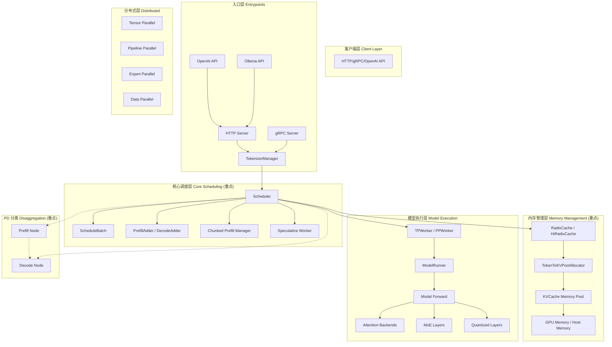
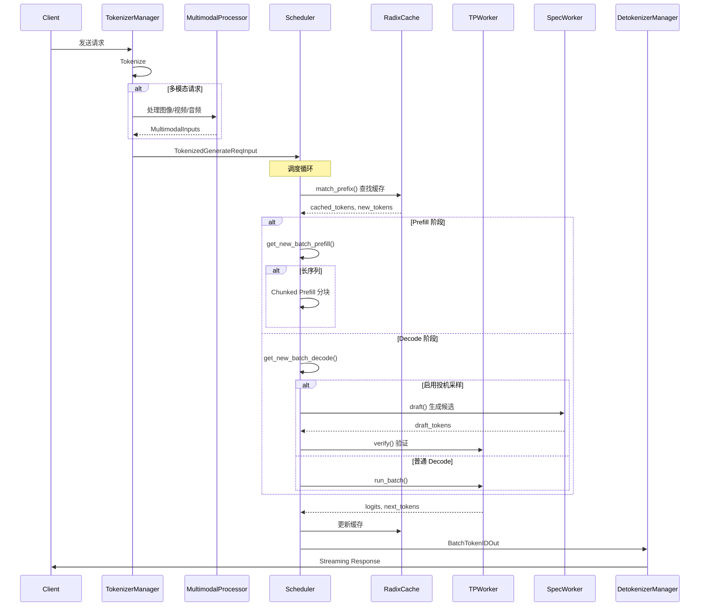
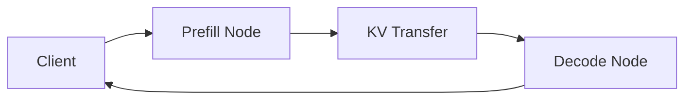
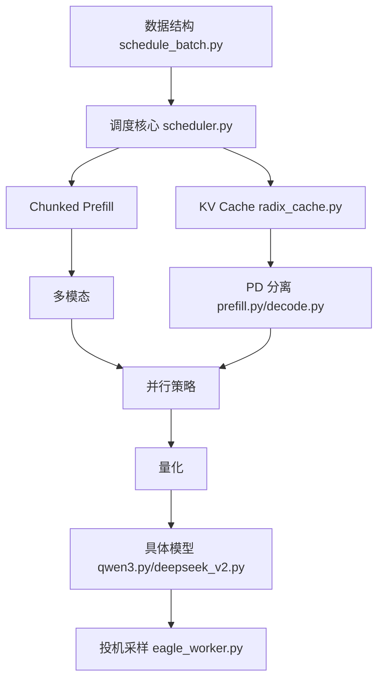

# SGLang 项目完整学习指南 (修订版)

本指南帮助你系统化、循序渐进地吸收整个 SGLang 项目。重点关注：**调度系统、Chunked Prefill、PD 分离、KV Cache、投机采样、多模态、并行策略、量化**，面向 **NVIDIA GPU**，模型侧重 **Qwen 系列 + DeepSeek 系列**。

---

## 📚 目录

1. [项目整体架构](#1-项目整体架构)
2. [核心特性完整列表](#2-核心特性完整列表)
3. [完整目录结构](#3-完整目录结构)
4. [8 大核心模块详解](#4-8-大核心模块详解)
5. [循序渐进学习路线](#5-循序渐进学习路线)
6. [重点模型索引](#6-重点模型索引)
7. [代码阅读策略](#7-代码阅读策略)
8. [已有学习资源](#8-已有学习资源)

---

## 1. 项目整体架构

### 1.1 系统宏观架构



### 1.2 请求生命周期



---

## 2. 核心特性完整列表

| 类别 | 特性 | 描述 |
|------|------|------|
| **调度优化** | RadixAttention | 基于 Radix Tree 的前缀缓存，支持 KV Cache 共享 |
| | Zero-overhead Scheduler | 零开销 CPU 调度器 |
| | Continuous Batching | 连续批处理，动态合并请求 |
| | Mixed Chunked Prefill | Prefill 与 Decode 混合调度 |
| **内存管理** | Paged Attention | 分页内存管理 |
| | HiCache | 分层缓存（GPU + Host + SSD） |
| | KV Cache Offloading | KV Cache 卸载到 Host/SSD |
| | Quantized KV Cache | FP8/INT8 KV Cache 量化 |
| **加速技术** | Speculative Decoding | EAGLE / EAGLE3 / NGram 投机采样 |
| | CUDA Graph | 计算图捕获加速 |
| | Torch Compile | 编译优化 |
| **并行策略** | Tensor Parallelism (TP) | 张量并行 |
| | Pipeline Parallelism (PP) | 流水线并行 |
| | Expert Parallelism (EP) | 专家并行 (MoE) |
| | Data Parallelism (DP) | 数据并行 |
| | EP Load Balancing (EPLB) | 专家负载均衡 |
| **分离架构** | PD Disaggregation | Prefill-Decode 分离部署 |
| | EPD Disaggregation | 扩展 PD 分离 |
| | PD Multiplexing | PD 复用 |
| **多模态** | Vision Models | 图像理解 (Qwen-VL, LLaVA, etc.) |
| | Audio Models | 音频理解 (Qwen-Audio) |
| | Video Models | 视频理解 |
| **量化** | FP8 (W8A8) | 权重和激活 FP8 |
| | FP4 (MXFP4) | 更激进的 FP4 量化 |
| | INT8 (W8A8) | INT8 量化 |
| | AWQ / GPTQ | 权重量化 |
| | KV Cache FP8/INT4 | KV Cache 量化 |
| **输出控制** | Structured Outputs | JSON Schema 约束 |
| | Tool Calling | 函数调用 |
| | Separate Reasoning | 推理分离输出 |
| **适配器** | Multi-LoRA | 多 LoRA 批量推理 |
| | Weight Sync | 动态权重同步 |
| **Attention 后端** | FlashInfer | 主要 NVIDIA 后端 |
| | FlashAttention | 备选后端 |
| | FlashMLA | DeepSeek MLA 优化 |
| | Triton | Triton 实现 |

---

## 3. 完整目录结构

### 3.1 python/sglang/srt/ 完整结构（34 子目录）

```
python/sglang/srt/                   # Runtime 核心 ⭐⭐⭐⭐⭐
│
├── 📁 managers/                     # 调度和管理器 ⭐⭐⭐⭐⭐
│   ├── scheduler.py                 # 核心调度器 (122KB)
│   ├── schedule_batch.py            # 批次数据结构 (88KB)
│   ├── schedule_policy.py           # 调度策略 PrefillAdder/DecodeAdder
│   ├── tokenizer_manager.py         # 分词管理器 (95KB)
│   ├── detokenizer_manager.py       # 解码管理器
│   ├── tp_worker.py                 # 张量并行 Worker
│   ├── io_struct.py                 # IO 数据结构
│   ├── mm_utils.py                  # 多模态工具 (57KB)
│   ├── scheduler_output_processor_mixin.py  # 输出处理
│   ├── scheduler_pp_mixin.py        # Pipeline Parallel 混入
│   └── ...                          # (33 files total)
│
├── 📁 layers/                       # 网络层实现 ⭐⭐⭐⭐
│   ├── 📁 attention/                # Attention 后端 (26 backends) ⭐⭐⭐⭐⭐
│   │   ├── flashinfer_backend.py    # FlashInfer (NVIDIA 主力)
│   │   ├── flashattention_backend.py # FlashAttention
│   │   ├── flashinfer_mla_backend.py # MLA (DeepSeek)
│   │   ├── flashmla_backend.py      # FlashMLA
│   │   ├── cutlass_mla_backend.py   # CUTLASS MLA
│   │   ├── triton_backend.py        # Triton 实现
│   │   ├── dual_chunk_flashattention_backend.py # Dual Chunk (68KB)
│   │   ├── nsa_backend.py           # NSA 后端
│   │   ├── vision.py                # 视觉模型 Attention
│   │   └── ...
│   │
│   ├── 📁 quantization/             # 量化实现 (31+ files) ⭐⭐⭐⭐
│   │   ├── fp8.py                   # FP8 量化 (63KB)
│   │   ├── fp8_kernel.py            # FP8 内核
│   │   ├── awq.py                   # AWQ
│   │   ├── gptq.py                  # GPTQ
│   │   ├── w8a8_fp8.py              # W8A8 FP8
│   │   ├── w8a8_int8.py             # W8A8 INT8
│   │   ├── mxfp4.py                 # MXFP4
│   │   ├── kv_cache.py              # KV Cache 量化
│   │   └── ...
│   │
│   ├── 📁 moe/                      # MoE 层 (280 files) ⭐⭐⭐⭐
│   │   ├── router.py                # MoE 路由
│   │   ├── topk.py                  # Top-K 选择 (38KB)
│   │   ├── 📁 fused_moe_triton/     # Triton Fused MoE
│   │   ├── 📁 ep_moe/               # Expert Parallel MoE
│   │   ├── 📁 token_dispatcher/     # Token 分发
│   │   └── ...
│   │
│   ├── linear.py                    # 线性层 (58KB)
│   ├── radix_attention.py           # RadixAttention 层
│   ├── rotary_embedding.py          # RoPE (107KB)
│   ├── layernorm.py                 # LayerNorm
│   ├── sampler.py                   # 采样器
│   ├── communicator.py              # 通信器 (35KB)
│   └── ...
│
├── 📁 mem_cache/                    # 内存/KV Cache 管理 ⭐⭐⭐⭐⭐
│   ├── radix_cache.py               # RadixAttention 缓存 (31KB)
│   ├── hiradix_cache.py             # 分层 Radix 缓存 (36KB)
│   ├── memory_pool.py               # GPU 内存池 (78KB)
│   ├── memory_pool_host.py          # Host 内存池 (38KB)
│   ├── allocator.py                 # 内存分配器 (18KB)
│   ├── hicache_storage.py           # HiCache 存储
│   ├── 📁 storage/                  # 存储后端 (28 files)
│   │   ├── mooncake/                # Mooncake 集成
│   │   └── ...
│   └── ...
│
├── 📁 speculative/                  # 投机采样 ⭐⭐⭐⭐⭐
│   ├── eagle_worker.py              # EAGLE 主实现 (41KB)
│   ├── eagle_worker_v2.py           # EAGLE V2 Overlap
│   ├── multi_layer_eagle_worker.py  # Multi-Layer EAGLE (31KB)
│   ├── eagle_info.py                # EAGLE 数据结构 (33KB)
│   ├── ngram_worker.py              # NGram 投机
│   ├── spec_info.py                 # 算法注册
│   ├── draft_utils.py               # Draft 工具
│   └── ...
│
├── 📁 disaggregation/               # PD 分离 ⭐⭐⭐⭐⭐
│   ├── prefill.py                   # Prefill 节点 (29KB)
│   ├── decode.py                    # Decode 节点 (40KB)
│   ├── encode_receiver.py           # 编码接收器
│   ├── encode_server.py             # 编码服务器
│   ├── kv_events.py                 # KV 事件
│   ├── decode_kvcache_offload_manager.py # KV 卸载
│   ├── 📁 mooncake/                 # Mooncake 后端
│   └── ...
│
├── 📁 distributed/                  # 分布式通信 ⭐⭐⭐⭐
│   ├── parallel_state.py            # 并行状态管理 (77KB)
│   ├── 📁 device_communicators/     # 设备通信器 (15 files)
│   ├── communication_op.py          # 通信操作
│   └── ...
│
├── 📁 multimodal/                   # 多模态处理 ⭐⭐⭐⭐
│   ├── 📁 processors/               # 处理器 (27 files)
│   │   ├── base_processor.py        # 基类
│   │   ├── qwen_vl.py               # Qwen-VL
│   │   ├── qwen_audio.py            # Qwen-Audio
│   │   └── ...
│   ├── mm_utils.py                  # 多模态工具 (24KB)
│   ├── vit_cuda_graph_runner.py     # ViT CUDA Graph
│   └── ...
│
├── 📁 models/                       # 模型实现 (138 files) ⭐⭐⭐⭐
│   ├── llama.py                     # Llama 系列 (28KB)
│   ├── qwen*.py                     # Qwen 系列 (17 files)
│   ├── deepseek*.py                 # DeepSeek 系列 (6 files)
│   ├── registry.py                  # 模型注册表
│   └── ...
│
├── 📁 model_executor/               # 模型执行器 ⭐⭐⭐
│   ├── model_runner.py              # 模型前向运行器
│   ├── cuda_graph_runner.py         # CUDA Graph 运行器
│   └── ...
│
├── 📁 entrypoints/                  # 服务入口 (29 files) ⭐⭐⭐
│   ├── http_server.py               # HTTP 服务
│   ├── 📁 ollama/                   # Ollama 兼容
│   └── ...
│
├── 📁 lora/                         # LoRA 支持 (24 files) ⭐⭐⭐
│   ├── lora_manager.py              # LoRA 管理器
│   └── ...
│
├── 📁 eplb/                         # Expert Parallel Load Balancing ⭐⭐⭐
│   ├── expert_distribution.py       # 专家分布 (36KB)
│   ├── expert_location.py           # 专家位置 (21KB)
│   ├── 📁 eplb_algorithms/          # 负载均衡算法
│   └── ...
│
├── 📁 compilation/                  # 编译优化 (13 files) ⭐⭐
│   └── ...
│
├── 📁 constrained/                  # 约束输出 (8 files) ⭐⭐
│   └── ...
│
├── 📁 function_call/                # 函数调用 (21 files) ⭐⭐
│   └── ...
│
├── 📁 sampling/                     # 采样策略 (8 files) ⭐⭐
│   └── ...
│
├── 📁 configs/                      # 模型配置 (33 files)
├── 📁 utils/                        # 工具函数 (23 files)
├── 📁 grpc/                         # gRPC 支持 (9 files)
├── 📁 debug_utils/                  # 调试工具 (8 files)
├── 📁 metrics/                      # 指标收集 (5 files)
├── 📁 tracing/                      # 追踪 (1 file)
├── 📁 batch_overlap/                # 批次重叠 (4 files)
├── 📁 batch_invariant_ops/          # 批次不变操作 (2 files)
├── 📁 checkpoint_engine/            # 检查点引擎 (3 files)
├── 📁 connector/                    # 连接器 (9 files)
├── 📁 dllm/                         # Diffusion LLM (4 files)
├── 📁 elastic_ep/                   # 弹性 EP (1 file)
├── 📁 hardware_backend/npu/         # NPU 后端 (14 files)
├── 📁 model_loader/                 # 模型加载 (6 files)
├── 📁 multiplex/                    # 复用 (2 files)
├── 📁 parser/                       # 解析器 (5 files)
├── 📁 tokenizer/                    # 分词器 (1 file)
├── 📁 weight_sync/                  # 权重同步 (2 files)
│
├── server_args.py                   # 服务参数 (224KB) ⭐⭐⭐
├── environ.py                       # 环境变量 (19KB)
├── constants.py                     # 常量
└── custom_op.py                     # 自定义算子
```

---

## 4. 8 大核心模块详解

### 4.1 调度系统 (Scheduling)

> [!IMPORTANT]
> 这是整个系统的核心，理解调度器是理解 SGLang 的关键

| 文件 | 大小 | 核心内容 |
|------|------|----------|
| [scheduler.py](file:///Users/wesley/code/sglang/python/sglang/srt/managers/scheduler.py) | 122KB | `Scheduler` 类，`event_loop_normal()`, `event_loop_overlap()` |
| [schedule_batch.py](file:///Users/wesley/code/sglang/python/sglang/srt/managers/schedule_batch.py) | 88KB | `Req`, `ScheduleBatch`, `ForwardMode`, `ModelWorkerBatch` |
| [schedule_policy.py](file:///Users/wesley/code/sglang/python/sglang/srt/managers/schedule_policy.py) | 30KB | `PrefillAdder`, `DecodeAdder`, 调度策略 |
| [scheduler_output_processor_mixin.py](file:///Users/wesley/code/sglang/python/sglang/srt/managers/scheduler_output_processor_mixin.py) | 50KB | 输出处理逻辑 |

**核心数据流：**
```
等待队列 (waiting_queue) 
    ↓ get_new_batch_prefill()
Prefill 批次 → run_batch() → 输出
    ↓ 完成 prefill
运行队列 (running_batch)
    ↓ get_new_batch_decode()
Decode 批次 → run_batch() → 输出
    ↓ EOS 或 max_tokens
请求完成
```

---

### 4.2 Chunked Prefill

| 文件 | 核心函数/类 |
|------|-------------|
| [scheduler.py](file:///Users/wesley/code/sglang/python/sglang/srt/managers/scheduler.py) | `init_chunked_prefill()`, `chunked_req` 属性 |
| [schedule_policy.py](file:///Users/wesley/code/sglang/python/sglang/srt/managers/schedule_policy.py) | `PrefillAdder.add_chunked_req()`, `can_add_seq_to_chunk()` |
| [schedule_batch.py](file:///Users/wesley/code/sglang/python/sglang/srt/managers/schedule_batch.py) | `Req.is_chunked`, `Req.init_next_round_input()` |

**已有深度笔记：** [chunk_prefill_deep_dive.md](file:///Users/wesley/code/sglang/docs/learning_notes/chunk_prefill_deep_dive.md)

---

### 4.3 PD 分离 (Prefill-Decode Disaggregation)

| 文件 | 大小 | 描述 |
|------|------|------|
| [prefill.py](file:///Users/wesley/code/sglang/python/sglang/srt/disaggregation/prefill.py) | 29KB | Prefill 节点实现 |
| [decode.py](file:///Users/wesley/code/sglang/python/sglang/srt/disaggregation/decode.py) | 40KB | Decode 节点实现 |
| [encode_receiver.py](file:///Users/wesley/code/sglang/python/sglang/srt/disaggregation/encode_receiver.py) | 20KB | KV Cache 接收器 |
| [encode_server.py](file:///Users/wesley/code/sglang/python/sglang/srt/disaggregation/encode_server.py) | 19KB | KV Cache 服务器 |
| [kv_events.py](file:///Users/wesley/code/sglang/python/sglang/srt/disaggregation/kv_events.py) | 14KB | KV 事件管理 |
| [decode_kvcache_offload_manager.py](file:///Users/wesley/code/sglang/python/sglang/srt/disaggregation/decode_kvcache_offload_manager.py) | 9KB | KV Cache 卸载 |

**架构：**


---

### 4.4 KV Cache 管理

| 文件 | 大小 | 描述 |
|------|------|------|
| [radix_cache.py](file:///Users/wesley/code/sglang/python/sglang/srt/mem_cache/radix_cache.py) | 31KB | Radix Tree 前缀缓存 |
| [hiradix_cache.py](file:///Users/wesley/code/sglang/python/sglang/srt/mem_cache/hiradix_cache.py) | 36KB | 分层缓存 (GPU+Host+SSD) |
| [memory_pool.py](file:///Users/wesley/code/sglang/python/sglang/srt/mem_cache/memory_pool.py) | 78KB | GPU 内存池管理 |
| [memory_pool_host.py](file:///Users/wesley/code/sglang/python/sglang/srt/mem_cache/memory_pool_host.py) | 38KB | Host 内存池 |
| [allocator.py](file:///Users/wesley/code/sglang/python/sglang/srt/mem_cache/allocator.py) | 18KB | 内存分配器 |
| [hicache_storage.py](file:///Users/wesley/code/sglang/python/sglang/srt/mem_cache/hicache_storage.py) | 9KB | HiCache 存储后端 |

**缓存层次：**
```
L1: GPU KV Cache (fastest)
    ↓
L2: Host Memory Pool
    ↓
L3: SSD/Remote Storage (HiCache)
```

---

### 4.5 投机采样 (Speculative Decoding)

| 文件 | 大小 | 描述 |
|------|------|------|
| [eagle_worker.py](file:///Users/wesley/code/sglang/python/sglang/srt/speculative/eagle_worker.py) | 41KB | EAGLE 主实现 |
| [eagle_worker_v2.py](file:///Users/wesley/code/sglang/python/sglang/srt/speculative/eagle_worker_v2.py) | 32KB | EAGLE V2 (Overlap) |
| [multi_layer_eagle_worker.py](file:///Users/wesley/code/sglang/python/sglang/srt/speculative/multi_layer_eagle_worker.py) | 31KB | Multi-Layer EAGLE |
| [eagle_info.py](file:///Users/wesley/code/sglang/python/sglang/srt/speculative/eagle_info.py) | 33KB | Draft/Verify 数据结构 |
| [ngram_worker.py](file:///Users/wesley/code/sglang/python/sglang/srt/speculative/ngram_worker.py) | 10KB | NGram 投机 |
| [spec_info.py](file:///Users/wesley/code/sglang/python/sglang/srt/speculative/spec_info.py) | 11KB | 算法注册机制 |

**已有深度笔记：** [eagle3_speculative_decoding_deep_dive.md](file:///Users/wesley/code/sglang/docs/learning_notes/eagle3_speculative_decoding_deep_dive.md)

---

### 4.6 多模态支持

| 文件 | 描述 |
|------|------|
| [base_processor.py](file:///Users/wesley/code/sglang/python/sglang/srt/multimodal/processors/base_processor.py) | 处理器基类 |
| [qwen_vl.py](file:///Users/wesley/code/sglang/python/sglang/srt/multimodal/processors/qwen_vl.py) | Qwen-VL 处理器 |
| [qwen_audio.py](file:///Users/wesley/code/sglang/python/sglang/srt/multimodal/processors/qwen_audio.py) | Qwen-Audio 处理器 |
| [mm_utils.py (managers)](file:///Users/wesley/code/sglang/python/sglang/srt/managers/mm_utils.py) | 多模态工具 (57KB) |
| [mm_utils.py (multimodal)](file:///Users/wesley/code/sglang/python/sglang/srt/multimodal/mm_utils.py) | 多模态工具 (24KB) |
| [vision.py](file:///Users/wesley/code/sglang/python/sglang/srt/layers/attention/vision.py) | Vision Attention (27KB) |

**已有深度笔记：** [qwen3_vl_multimodal_deep_dive.md](file:///Users/wesley/code/sglang/docs/learning_notes/qwen3_vl_multimodal_deep_dive.md)

---

### 4.7 并行策略

| 并行类型 | 核心文件 |
|----------|----------|
| **Tensor Parallel** | [parallel_state.py](file:///Users/wesley/code/sglang/python/sglang/srt/distributed/parallel_state.py) (77KB) |
| | [tp_worker.py](file:///Users/wesley/code/sglang/python/sglang/srt/managers/tp_worker.py) |
| | [communicator.py](file:///Users/wesley/code/sglang/python/sglang/srt/layers/communicator.py) (35KB) |
| **Pipeline Parallel** | [scheduler_pp_mixin.py](file:///Users/wesley/code/sglang/python/sglang/srt/managers/scheduler_pp_mixin.py) (58KB) |
| **Expert Parallel** | [ep_moe/](file:///Users/wesley/code/sglang/python/sglang/srt/layers/moe/ep_moe/) |
| | [eplb/](file:///Users/wesley/code/sglang/python/sglang/srt/eplb/) |
| **Data Parallel** | [data_parallel_controller.py](file:///Users/wesley/code/sglang/python/sglang/srt/managers/data_parallel_controller.py) (24KB) |
| | [dp_attention.py](file:///Users/wesley/code/sglang/python/sglang/srt/layers/dp_attention.py) (18KB) |

---

### 4.8 量化

| 量化方法 | 文件 |
|----------|------|
| **FP8** | [fp8.py](file:///Users/wesley/code/sglang/python/sglang/srt/layers/quantization/fp8.py) (63KB) |
| | [fp8_kernel.py](file:///Users/wesley/code/sglang/python/sglang/srt/layers/quantization/fp8_kernel.py) (57KB) |
| | [w8a8_fp8.py](file:///Users/wesley/code/sglang/python/sglang/srt/layers/quantization/w8a8_fp8.py) |
| **INT8** | [w8a8_int8.py](file:///Users/wesley/code/sglang/python/sglang/srt/layers/quantization/w8a8_int8.py) |
| | [int8_kernel.py](file:///Users/wesley/code/sglang/python/sglang/srt/layers/quantization/int8_kernel.py) |
| **FP4/MXFP4** | [mxfp4.py](file:///Users/wesley/code/sglang/python/sglang/srt/layers/quantization/mxfp4.py) (33KB) |
| **AWQ** | [awq.py](file:///Users/wesley/code/sglang/python/sglang/srt/layers/quantization/awq.py) (34KB) |
| **GPTQ** | [gptq.py](file:///Users/wesley/code/sglang/python/sglang/srt/layers/quantization/gptq.py) (40KB) |
| **KV Cache 量化** | [kv_cache.py](file:///Users/wesley/code/sglang/python/sglang/srt/layers/quantization/kv_cache.py) |

---

## 5. 循序渐进学习路线

### 阶段 1：基础数据结构（2-3 天）

**目标：** 理解核心数据结构和请求生命周期

| 顺序 | 文件 | 重点 |
|------|------|------|
| 1 | [schedule_batch.py](file:///Users/wesley/code/sglang/python/sglang/srt/managers/schedule_batch.py) | `Req`, `ScheduleBatch`, `ForwardMode` |
| 2 | [io_struct.py](file:///Users/wesley/code/sglang/python/sglang/srt/managers/io_struct.py) | 输入输出数据结构 |
| 3 | [server_args.py](file:///Users/wesley/code/sglang/python/sglang/srt/server_args.py) | 所有配置参数 |

---

### 阶段 2：调度器核心（3-4 天）

**目标：** 掌握调度器事件循环和批次管理

| 顺序 | 文件 | 重点函数 |
|------|------|----------|
| 1 | [scheduler.py](file:///Users/wesley/code/sglang/python/sglang/srt/managers/scheduler.py) | `__init__()`, `event_loop_normal()` |
| 2 | 同上 | `get_new_batch_prefill()`, `get_new_batch_decode()` |
| 3 | [schedule_policy.py](file:///Users/wesley/code/sglang/python/sglang/srt/managers/schedule_policy.py) | `PrefillAdder`, `DecodeAdder` |
| 4 | [scheduler_output_processor_mixin.py](file:///Users/wesley/code/sglang/python/sglang/srt/managers/scheduler_output_processor_mixin.py) | `process_batch_result()` |

**参考笔记：** [scheduler_architecture_deep_dive.md](file:///Users/wesley/code/sglang/docs/learning_notes/scheduler_architecture_deep_dive.md)

---

### 阶段 3：Chunked Prefill（2 天）

**目标：** 理解分块预填充机制

| 顺序 | 关注点 |
|------|--------|
| 1 | `Scheduler.init_chunked_prefill()` |
| 2 | `PrefillAdder.add_chunked_req()` |
| 3 | `Req.is_chunked` 和 `Req.init_next_round_input()` |
| 4 | Mixed Chunk 与 Decode 混合调度 |

**参考笔记：** [chunk_prefill_deep_dive.md](file:///Users/wesley/code/sglang/docs/learning_notes/chunk_prefill_deep_dive.md)

---

### 阶段 4：KV Cache 管理（3 天）

**目标：** 理解内存管理和缓存机制

| 顺序 | 文件 | 重点 |
|------|------|------|
| 1 | [radix_cache.py](file:///Users/wesley/code/sglang/python/sglang/srt/mem_cache/radix_cache.py) | Radix Tree 结构，`match_prefix()` |
| 2 | [memory_pool.py](file:///Users/wesley/code/sglang/python/sglang/srt/mem_cache/memory_pool.py) | KV Cache 池管理 |
| 3 | [allocator.py](file:///Users/wesley/code/sglang/python/sglang/srt/mem_cache/allocator.py) | 内存分配策略 |
| 4 | [hiradix_cache.py](file:///Users/wesley/code/sglang/python/sglang/srt/mem_cache/hiradix_cache.py) | 分层缓存 |

---

### 阶段 5：多模态（2-3 天）

**目标：** 理解图像/视频/音频处理流程

| 顺序 | 文件 | 重点 |
|------|------|------|
| 1 | [base_processor.py](file:///Users/wesley/code/sglang/python/sglang/srt/multimodal/processors/base_processor.py) | 处理器基类 |
| 2 | [qwen_vl.py](file:///Users/wesley/code/sglang/python/sglang/srt/multimodal/processors/qwen_vl.py) | Qwen-VL 实现 |
| 3 | [mm_utils.py](file:///Users/wesley/code/sglang/python/sglang/srt/managers/mm_utils.py) | 多模态工具 |
| 4 | [scheduler.py](file:///Users/wesley/code/sglang/python/sglang/srt/managers/scheduler.py) | `handle_generate_request()` 多模态部分 |

**参考笔记：** [qwen3_vl_multimodal_deep_dive.md](file:///Users/wesley/code/sglang/docs/learning_notes/qwen3_vl_multimodal_deep_dive.md)

---

### 阶段 6：PD 分离（2-3 天）

**目标：** 理解 Prefill-Decode 分离架构

| 顺序 | 文件 | 重点 |
|------|------|------|
| 1 | [prefill.py](file:///Users/wesley/code/sglang/python/sglang/srt/disaggregation/prefill.py) | Prefill 节点 |
| 2 | [decode.py](file:///Users/wesley/code/sglang/python/sglang/srt/disaggregation/decode.py) | Decode 节点 |
| 3 | [kv_events.py](file:///Users/wesley/code/sglang/python/sglang/srt/disaggregation/kv_events.py) | KV 传输事件 |
| 4 | [encode_receiver.py](file:///Users/wesley/code/sglang/python/sglang/srt/disaggregation/encode_receiver.py) | KV 接收 |

---

### 阶段 7：并行策略（3-4 天）

**目标：** 理解 TP/PP/EP/DP 实现

| 顺序 | 并行类型 | 重点文件 |
|------|----------|----------|
| 1 | Tensor Parallel | [parallel_state.py](file:///Users/wesley/code/sglang/python/sglang/srt/distributed/parallel_state.py), [communicator.py](file:///Users/wesley/code/sglang/python/sglang/srt/layers/communicator.py) |
| 2 | Pipeline Parallel | [scheduler_pp_mixin.py](file:///Users/wesley/code/sglang/python/sglang/srt/managers/scheduler_pp_mixin.py) |
| 3 | Expert Parallel | [ep_moe/](file:///Users/wesley/code/sglang/python/sglang/srt/layers/moe/ep_moe/), [eplb/](file:///Users/wesley/code/sglang/python/sglang/srt/eplb/) |
| 4 | Data Parallel | [data_parallel_controller.py](file:///Users/wesley/code/sglang/python/sglang/srt/managers/data_parallel_controller.py) |

---

### 阶段 9：量化（2-3 天）

**目标：** 理解各种量化方案

| 顺序 | 量化类型 | 重点文件 |
|------|----------|----------|
| 1 | FP8 基础 | [fp8.py](file:///Users/wesley/code/sglang/python/sglang/srt/layers/quantization/fp8.py) |
| 2 | FP8 Kernel | [fp8_kernel.py](file:///Users/wesley/code/sglang/python/sglang/srt/layers/quantization/fp8_kernel.py) |
| 3 | AWQ/GPTQ | [awq.py](file:///Users/wesley/code/sglang/python/sglang/srt/layers/quantization/awq.py), [gptq.py](file:///Users/wesley/code/sglang/python/sglang/srt/layers/quantization/gptq.py) |
| 4 | KV Cache 量化 | [kv_cache.py](file:///Users/wesley/code/sglang/python/sglang/srt/layers/quantization/kv_cache.py) |

---

### 阶段 9：模型实现（按需）

**目标：** 理解具体模型如何接入框架

选择性阅读你关心的模型实现。

---

### 阶段 10：投机采样（3-4 天）

> [!NOTE]
> 投机采样是高级优化技术，建议在掌握基础后再学习

**目标：** 掌握 EAGLE/NGram 投机解码

| 顺序 | 文件 | 重点 |
|------|------|------|
| 1 | [spec_info.py](file:///Users/wesley/code/sglang/python/sglang/srt/speculative/spec_info.py) | 算法注册机制 |
| 2 | [eagle_worker.py](file:///Users/wesley/code/sglang/python/sglang/srt/speculative/eagle_worker.py) | `draft()`, `verify()`, `forward_batch_generation()` |
| 3 | [eagle_info.py](file:///Users/wesley/code/sglang/python/sglang/srt/speculative/eagle_info.py) | Draft/Verify IO |
| 4 | [ngram_worker.py](file:///Users/wesley/code/sglang/python/sglang/srt/speculative/ngram_worker.py) | NGram 实现 |

**参考笔记：** [eagle3_speculative_decoding_deep_dive.md](file:///Users/wesley/code/sglang/docs/learning_notes/eagle3_speculative_decoding_deep_dive.md)

---

## 6. 重点模型索引

### 6.1 Qwen 系列 (17 files)

| 模型 | 文件 | 类型 |
|------|------|------|
| Qwen (v1) | [qwen.py](file:///Users/wesley/code/sglang/python/sglang/srt/models/qwen.py) | LLM |
| Qwen2 | [qwen2.py](file:///Users/wesley/code/sglang/python/sglang/srt/models/qwen2.py) | LLM |
| Qwen3 | [qwen3.py](file:///Users/wesley/code/sglang/python/sglang/srt/models/qwen3.py) | LLM |
| Qwen3-Next | [qwen3_next.py](file:///Users/wesley/code/sglang/python/sglang/srt/models/qwen3_next.py) | LLM + MTP |
| Qwen2-MoE | [qwen2_moe.py](file:///Users/wesley/code/sglang/python/sglang/srt/models/qwen2_moe.py) | MoE |
| Qwen3-MoE | [qwen3_moe.py](file:///Users/wesley/code/sglang/python/sglang/srt/models/qwen3_moe.py) | MoE (42KB) |
| Qwen2-VL | [qwen2_vl.py](file:///Users/wesley/code/sglang/python/sglang/srt/models/qwen2_vl.py) | 多模态 (VL) |
| Qwen2.5-VL | [qwen2_5_vl.py](file:///Users/wesley/code/sglang/python/sglang/srt/models/qwen2_5_vl.py) | 多模态 (VL) |
| Qwen3-VL | [qwen3_vl.py](file:///Users/wesley/code/sglang/python/sglang/srt/models/qwen3_vl.py) | 多模态 (VL) (37KB) |
| Qwen3-VL-MoE | [qwen3_vl_moe.py](file:///Users/wesley/code/sglang/python/sglang/srt/models/qwen3_vl_moe.py) | 多模态 MoE |
| Qwen2-Audio | [qwen2_audio.py](file:///Users/wesley/code/sglang/python/sglang/srt/models/qwen2_audio.py) | 多模态 (Audio) |
| Qwen3-Omni-MoE | [qwen3_omni_moe.py](file:///Users/wesley/code/sglang/python/sglang/srt/models/qwen3_omni_moe.py) | Omni 模态 |
| Qwen2-EAGLE | [qwen2_eagle.py](file:///Users/wesley/code/sglang/python/sglang/srt/models/qwen2_eagle.py) | 投机 Draft |
| Qwen2-RM | [qwen2_rm.py](file:///Users/wesley/code/sglang/python/sglang/srt/models/qwen2_rm.py) | Reward |
| Qwen2-Cls | [qwen2_classification.py](file:///Users/wesley/code/sglang/python/sglang/srt/models/qwen2_classification.py) | 分类 |
| Qwen3-Cls | [qwen3_classification.py](file:///Users/wesley/code/sglang/python/sglang/srt/models/qwen3_classification.py) | 分类 |
| Qwen3-Next-MTP | [qwen3_next_mtp.py](file:///Users/wesley/code/sglang/python/sglang/srt/models/qwen3_next_mtp.py) | MTP |

### 6.2 DeepSeek 系列 (6 files)

| 模型 | 文件 | 特点 |
|------|------|------|
| DeepSeek (v1) | [deepseek.py](file:///Users/wesley/code/sglang/python/sglang/srt/models/deepseek.py) | 基础 LLM |
| DeepSeek-V2/V3 | [deepseek_v2.py](file:///Users/wesley/code/sglang/python/sglang/srt/models/deepseek_v2.py) | MoE + MLA (160KB) ⭐ |
| DeepSeek-NextN | [deepseek_nextn.py](file:///Users/wesley/code/sglang/python/sglang/srt/models/deepseek_nextn.py) | NextN 预测 |
| DeepSeek-VL2 | [deepseek_vl2.py](file:///Users/wesley/code/sglang/python/sglang/srt/models/deepseek_vl2.py) | 多模态 |
| DeepSeek-Janus-Pro | [deepseek_janus_pro.py](file:///Users/wesley/code/sglang/python/sglang/srt/models/deepseek_janus_pro.py) | 多模态 (70KB) |
| DeepSeek-OCR | [deepseek_ocr.py](file:///Users/wesley/code/sglang/python/sglang/srt/models/deepseek_ocr.py) | OCR (52KB) |

> [!IMPORTANT]
> DeepSeek-V2/V3 使用 MLA (Multi-head Latent Attention)，相关 Attention 后端：
> - [flashinfer_mla_backend.py](file:///Users/wesley/code/sglang/python/sglang/srt/layers/attention/flashinfer_mla_backend.py)
> - [flashmla_backend.py](file:///Users/wesley/code/sglang/python/sglang/srt/layers/attention/flashmla_backend.py)
> - [cutlass_mla_backend.py](file:///Users/wesley/code/sglang/python/sglang/srt/layers/attention/cutlass_mla_backend.py)

---

## 7. 代码阅读策略

### 7.1 推荐阅读路径



### 7.2 阅读技巧

1. **先看 `__init__`**：理解核心属性初始化
2. **跟踪 `ForwardMode`**：理解 PREFILL → DECODE → EXTEND 状态转换
3. **关注 `dataclass`**：这些定义了核心数据结构
4. **使用 `grep` 追踪**：找到函数调用关系
5. **结合测试用例**：`test/srt/` 下有大量用法示例

### 7.3 调试建议

```bash
# 启用详细日志
export SGLANG_LOG_LEVEL=debug

# 启动服务
python -m sglang.launch_server \
    --model-path Qwen/Qwen2.5-7B-Instruct \
    --port 30000

# 观察关键日志
# - "get_new_batch_prefill"
# - "get_new_batch_decode"
# - "process_batch_result"
```

---

## 8. 已有学习资源

### 8.1 项目内深度笔记（你已整理）

| 笔记 | 路径 | 内容 |
|------|------|------|
| 学习路径 | [learning_path.md](file:///Users/wesley/code/sglang/docs/learning_notes/learning_path.md) | 综合学习指南 |
| 调度器架构 | [scheduler_architecture_deep_dive.md](file:///Users/wesley/code/sglang/docs/learning_notes/scheduler_architecture_deep_dive.md) | 调度系统详解 |
| Chunk Prefill | [chunk_prefill_deep_dive.md](file:///Users/wesley/code/sglang/docs/learning_notes/chunk_prefill_deep_dive.md) | 分块预填充 |
| EAGLE3 | [eagle3_speculative_decoding_deep_dive.md](file:///Users/wesley/code/sglang/docs/learning_notes/eagle3_speculative_decoding_deep_dive.md) | EAGLE3 投机解码 |
| 多模态 | [qwen3_vl_multimodal_deep_dive.md](file:///Users/wesley/code/sglang/docs/learning_notes/qwen3_vl_multimodal_deep_dive.md) | Qwen3-VL 多模态 |
| 混合 Chunk | [mixed_chunk_and_multimodal.md](file:///Users/wesley/code/sglang/docs/learning_notes/mixed_chunk_and_multimodal.md) | Chunk + 多模态 |

### 8.2 官方资源

- **官方文档**: https://docs.sglang.io/
- **博客**: https://lmsys.org/blog/
- **学习材料**: https://github.com/sgl-project/sgl-learning-materials
- **Roadmap**: https://roadmap.sglang.io/

### 8.3 推荐博客阅读顺序

| 顺序 | 博客 | 重点 |
|------|------|------|
| 1 | [RadixAttention](https://lmsys.org/blog/2024-01-17-sglang/) | 核心创新 |
| 2 | [v0.2 Llama3](https://lmsys.org/blog/2024-07-25-sglang-llama3/) | 性能优化 |
| 3 | [v0.3 DeepSeek MLA](https://lmsys.org/blog/2024-09-04-sglang-v0-3/) | MLA 7x 加速 |
| 4 | [v0.4 Zero-overhead](https://lmsys.org/blog/2024-12-04-sglang-v0-4/) | 调度器优化 |
| 5 | [Large-scale EP](https://lmsys.org/blog/2025-05-05-large-scale-ep/) | 大规模 EP |
| 6 | [GB200 Part 1](https://lmsys.org/blog/2025-06-16-gb200-part-1/) | GB200 部署 |
| 7 | [GB200 Part 2](https://lmsys.org/blog/2025-09-25-gb200-part-2/) | PD + EP |

---

## 总结：学习时间规划

| 阶段 | 主题 | 时间 | 优先级 |
|------|------|------|--------|
| 1 | 基础数据结构 | 2-3 天 | ⭐⭐⭐⭐⭐ |
| 2 | 调度器核心 | 3-4 天 | ⭐⭐⭐⭐⭐ |
| 3 | Chunked Prefill | 2 天 | ⭐⭐⭐⭐⭐ |
| 4 | KV Cache 管理 | 3 天 | ⭐⭐⭐⭐⭐ |
| 5 | 多模态 | 2-3 天 | ⭐⭐⭐⭐ |
| 6 | PD 分离 | 2-3 天 | ⭐⭐⭐⭐ |
| 7 | 并行策略 | 3-4 天 | ⭐⭐⭐⭐ |
| 8 | 量化 | 2-3 天 | ⭐⭐⭐ |
| 9 | 模型实现 | 按需 | ⭐⭐⭐ |
| 10 | 投机采样 | 3-4 天 | ⭐⭐ |

**总计：约 4-6 周** 完成核心模块的系统学习

---

*文档生成时间: 2026-01-24*
