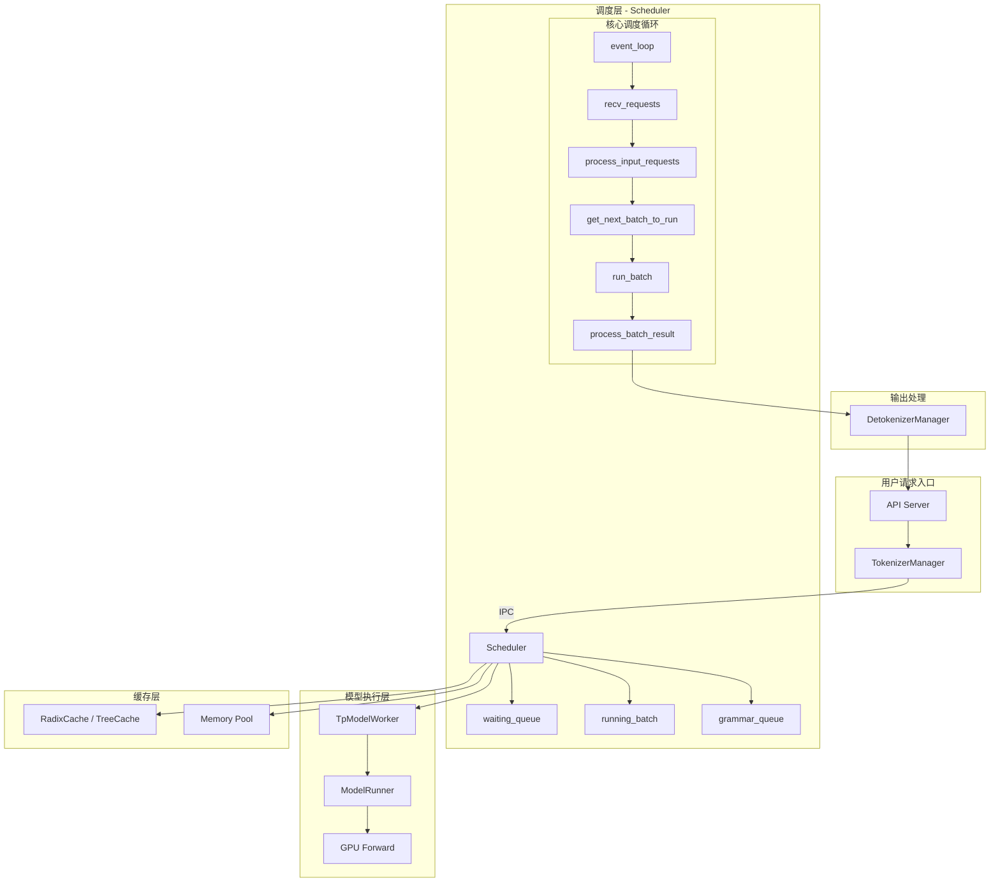
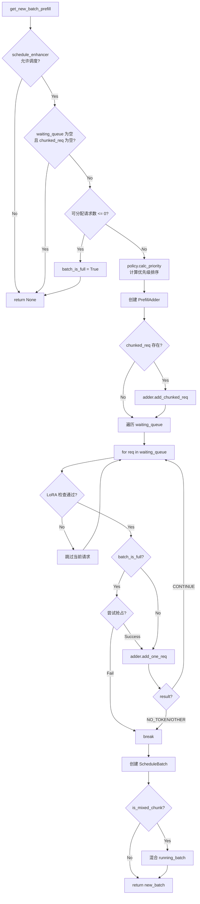

# SGLang Scheduler 架构深度解析

本文档详细解析 SGLang 调度器的整体架构，重点介绍 PD 分离（Prefill-Decode Disaggregation）和投机采样（Speculative Decoding）。

---

## 1. 整体架构概览

### 1.1 系统架构图



### 1.2 Scheduler 类结构

Scheduler 采用 **Mixin 模式** 组织代码，将不同功能模块化：

```python
# file: scheduler.py (L234-245)

class Scheduler(
    SchedulerOutputProcessorMixin,       # 输出处理
    SchedulerUpdateWeightsMixin,         # 权重更新
    SchedulerProfilerMixin,              # 性能分析
    SchedulerMetricsMixin,               # 指标收集
    SchedulerDisaggregationDecodeMixin,  # PD分离-Decode端
    SchedulerDisaggregationPrefillMixin, # PD分离-Prefill端
    SchedulerMultiplexMixin,             # PD复用
    SchedulerRuntimeCheckerMixin,        # 运行时检查
    SchedulerPPMixin,                    # 流水线并行
    SchedulerDPAttnMixin,                # 数据并行Attention
):
    """A scheduler that manages a tensor parallel GPU worker."""
```

### 1.3 核心组件对照表

| 组件 | 文件 | 职责 |
|------|------|------|
| `Scheduler` | [scheduler.py](file:///Users/wesley/code/sglang/python/sglang/srt/managers/scheduler.py) | 核心调度器（2965行） |
| `Req` | [schedule_batch.py](file:///Users/wesley/code/sglang/python/sglang/srt/managers/schedule_batch.py) | 请求数据结构 |
| `ScheduleBatch` | [schedule_batch.py](file:///Users/wesley/code/sglang/python/sglang/srt/managers/schedule_batch.py) | 批次数据结构 |
| `SchedulePolicy` | [schedule_policy.py](file:///Users/wesley/code/sglang/python/sglang/srt/managers/schedule_policy.py) | 调度策略 |
| `TpModelWorker` | [tp_worker.py](file:///Users/wesley/code/sglang/python/sglang/srt/managers/tp_worker.py) | GPU 执行器 |
| `RadixCache` | [radix_cache.py](file:///Users/wesley/code/sglang/python/sglang/srt/mem_cache/radix_cache.py) | KV Cache 管理 |

---

## 2. Scheduler 初始化流程

### 2.1 初始化序列

```python
# file: scheduler.py (L248-366)

def __init__(self, server_args, port_args, gpu_id, tp_rank, ...):
    # 1. 解析参数
    self.server_args = server_args
    self.tp_rank = tp_rank
    ...
    
    # 2. 初始化模型配置
    self.init_model_config()
    
    # 3. 初始化 IPC 通道
    self.init_ipc_channels(port_args)
    
    # 4. 初始化 Tokenizer
    self.init_tokenizer()
    
    # 5. 启动模型 Worker（包括投机解码的 Draft Worker）
    self.init_model_worker()
    
    # 6. 初始化 KV Cache 和内存池
    self.init_cache_with_memory_pool()
    
    # 7. 初始化 Chunked Prefill
    self.init_chunked_prefill()
    
    # 8. 初始化调度策略
    self.init_schedule_policy()
    
    # 9. 初始化 PD 分离 ⭐
    self.init_disaggregation()
    
    # 10. 初始化 Overlap 调度
    self.init_overlap()
```

### 2.2 核心数据结构

```python
# 请求状态
self.waiting_queue: List[Req] = []      # 等待调度的请求
self.running_batch: ScheduleBatch       # 正在运行的 decode 请求
self.grammar_queue: Dict[str, Req] = {} # 等待 grammar 编译的请求

# Chunk Prefill 状态
self.chunked_req: Optional[Req] = None  # 当前分块处理的请求

# 投机解码
self.draft_worker: Optional[SpecWorker] = None  # Draft 模型 Worker

# PD 分离
self.disaggregation_mode: DisaggregationMode  # NONE / PREFILL / DECODE
```

---

## 3. 事件循环与调度流程

### 3.1 Normal Event Loop

```python
# file: scheduler.py (L1071-1096)

def event_loop_normal(self):
    """正常调度循环"""
    while True:
        # 1. 接收请求
        recv_reqs = self.recv_requests()
        self.process_input_requests(recv_reqs)
        
        # 2. 获取下一个要运行的批次
        batch = self.get_next_batch_to_run()
        self.cur_batch = batch
        
        # 3. 运行批次
        if batch:
            result = self.run_batch(batch)
            self.process_batch_result(batch, result)
        else:
            # 空闲时进行自检
            self.self_check_during_idle()
        
        self.last_batch = batch
```

### 3.2 Overlap Event Loop

重叠调度：CPU 处理与 GPU 计算并行，在处理上一批结果的同时启动下一批计算。

```python
# file: scheduler.py (L1098-1150)

def event_loop_overlap(self):
    """重叠调度循环"""
    while True:
        # 1. 处理上一批的结果（重叠执行）
        if self.last_batch:
            self.process_batch_result(tmp_batch, tmp_result)
        
        # 2. 接收新请求
        recv_reqs = self.recv_requests()
        self.process_input_requests(recv_reqs)
        
        # 3. 获取并启动新批次（GPU 开始工作）
        batch = self.get_next_batch_to_run()
        if batch:
            batch_result = self.run_batch(batch)
            self.result_queue.append((batch.copy(), batch_result))
```

### 3.3 批次调度策略

```python
# file: scheduler.py (L1778-1853)

def get_next_batch_to_run(self) -> Optional[ScheduleBatch]:
    # 1. 处理 chunked_req（分块请求）
    if self.chunked_req:
        self.tree_cache.cache_unfinished_req(self.chunked_req, chunked=True)
        self.req_to_token_pool.free(self.chunked_req.req_pool_idx)
    
    # 2. 合并上一批完成的 prefill 到 running_batch
    if self.last_batch and self.last_batch.forward_mode.is_extend():
        if not self.last_batch.is_empty():
            self.running_batch.merge_batch(self.last_batch)
    
    # 3. 获取新的 prefill 批次
    new_batch = self.get_new_batch_prefill()
    
    # 4. 决定运行 prefill 还是 decode
    if new_batch is not None:
        return new_batch  # 优先运行 prefill
    else:
        # 运行 decode
        if not self.running_batch.is_empty():
            return self.update_running_batch(self.running_batch)
        return None
```

**调度优先级**：Prefill > Decode

---

## 4. PD 分离（Prefill-Decode Disaggregation）

### 4.1 架构概览

PD 分离将 Prefill 和 Decode 阶段分配到不同的 GPU 集群：

```
┌─────────────────────────────────────────────────────────────────┐
│                       用户请求                                   │
│                          ↓                                      │
│  ┌─────────────────┐         ┌─────────────────┐               │
│  │   Prefill 节点   │ ──KV──→ │   Decode 节点    │               │
│  │  (计算密集型)    │  传输   │  (内存密集型)     │               │
│  │                 │         │                 │               │
│  │ • 处理长 prompt  │         │ • 逐 token 生成  │               │
│  │ • 高 GPU 利用率  │         │ • 高吞吐量       │               │
│  └─────────────────┘         └─────────────────┘               │
│                                      ↓                          │
│                              生成结果返回                        │
└─────────────────────────────────────────────────────────────────┘
```

### 4.2 初始化流程

```python
# file: scheduler.py (L845-976)

def init_disaggregation(self):
    self.disaggregation_mode = DisaggregationMode(
        self.server_args.disaggregation_mode  # "none" / "prefill" / "decode"
    )
    
    if self.disaggregation_mode == DisaggregationMode.DECODE:
        # Decode 节点初始化
        self.disagg_decode_prealloc_queue = DecodePreallocQueue(...)
        self.disagg_decode_transfer_queue = DecodeTransferQueue(...)
        
    elif self.disaggregation_mode == DisaggregationMode.PREFILL:
        # Prefill 节点初始化
        self.disagg_prefill_bootstrap_queue = PrefillBootstrapQueue(...)
        self.disagg_prefill_inflight_queue: List[Req] = []
```

### 4.3 Prefill 节点请求生命周期

```
1. Bootstrap Queue (引导队列)
   • 为每个请求初始化 KV Sender
   • 与 Decode 节点握手
   • 等待 Decode 节点预分配 KV 空间
   • 握手完成后 → Waiting Queue
           ↓
2. Waiting Queue (等待队列)
   • PrefillAdder 选择请求构建批次
   • 运行 forward 计算 KV
   • 完成后 → Inflight Queue
           ↓
3. Inflight Queue (传输中队列)
   • 异步传输 KV 到 Decode 节点
   • Poll 检查传输状态
   • 传输完成 → 返回响应给用户
```

### 4.4 Prefill 节点关键代码

```python
# file: disaggregation/prefill.py (L338-364)

def event_loop_normal_disagg_prefill(self: Scheduler) -> None:
    """Prefill 节点的调度循环"""
    while True:
        # 1. 接收请求
        recv_reqs = self.recv_requests()
        self.process_input_requests(recv_reqs)
        
        # 2. 从 bootstrap 队列获取握手完成的请求
        self.waiting_queue.extend(
            self.disagg_prefill_bootstrap_queue.pop_bootstrapped()
        )
        
        # 3. 获取批次并运行
        batch = self.get_next_disagg_prefill_batch_to_run()
        if batch:
            result = self.run_batch(batch)
            self.process_batch_result_disagg_prefill(batch, result)
        
        # 4. 处理传输中的请求
        self.process_disagg_prefill_inflight_queue()
```

### 4.5 Decode 节点请求生命周期

```
1. PreallocQueue (预分配队列)
   • 为每个请求初始化 KV Receiver
   • 与 Prefill 节点握手
   • 预分配 KV Cache 空间
   • 握手完成后 → TransferQueue
           ↓
2. TransferQueue (传输队列)
   • 接收来自 Prefill 节点的 KV Cache
   • Poll 检查传输状态
   • 传输完成后 → Waiting Queue
           ↓
3. Waiting Queue → Running Batch
   • 正常的 Decode 调度流程
   • 逐 token 生成
```

### 4.6 KV 传输机制

```python
# file: disaggregation/prefill.py (L656-734)

def send_kv_chunk(self: Scheduler, req: Req, last_chunk: bool = False, ...):
    """发送 KV 块到 Decode 节点"""
    page_size = self.token_to_kv_pool_allocator.page_size
    
    # 获取 KV indices
    kv_indices = self.req_to_token_pool.req_to_token[
        req.req_pool_idx, start_idx:end_idx
    ].cpu().numpy()
    
    # 转换为 page indices
    page_indices = kv_to_page_indices(kv_indices, page_size)
    
    # 异步发送
    req.disagg_kv_sender.send(page_indices, state_indices)
```

### 4.7 传输后端

| 后端 | 说明 | 使用场景 |
|------|------|---------|
| `FAKE` | 模拟传输（测试用） | 开发调试 |
| `mooncake` | 高性能 RDMA 传输 | 生产环境 |
| `nixl` | 另一种 RDMA 实现 | 生产环境 |

---

## 5. 投机采样（Speculative Decoding）

### 5.1 EAGLE 架构概览

```
┌─────────────────────────────────────────────────────────────────┐
│                      EAGLE 投机采样流程                          │
├─────────────────────────────────────────────────────────────────┤
│                                                                 │
│  1. Draft Phase (草稿阶段)                                       │
│     Draft Model (小模型) 快速生成 K 个候选 token                  │
│     • 使用上一轮的 hidden states                                 │
│     • 构建 token tree                                            │
│                          ↓                                      │
│  2. Verify Phase (验证阶段)                                      │
│     Target Model (大模型) 并行验证所有候选 token                  │
│     • 一次 forward 验证整个 tree                                 │
│     • 接受匹配的 tokens，拒绝不匹配的                             │
│                          ↓                                      │
│  3. 输出接受的 tokens，更新状态                                   │
│                                                                 │
└─────────────────────────────────────────────────────────────────┘
```

### 5.2 EAGLEWorker 核心流程

```python
# file: speculative/eagle_worker.py (L266-321)

def forward_batch_generation(self, batch: ScheduleBatch):
    """投机解码的主流程"""
    
    if batch.forward_mode.is_decode():
        # Decode 模式：Draft → Verify
        
        # 1. Draft 阶段
        self._draft_preprocess_decode(batch)
        spec_info = self.draft(batch)
        
        # 2. Verify 阶段
        verify_output = self.verify(batch, spec_info)
        
        return (logits_output, next_token_ids, batch_id, num_accepted_tokens)
    
    if batch.forward_mode.is_extend():
        # Extend 模式：Target 模型处理
        return self.forward_target_extend(batch)
```

### 5.3 Draft 阶段详解

```python
# file: speculative/eagle_worker.py (L515-596)

def draft(self, batch: ScheduleBatch) -> EagleVerifyInput:
    """使用 Draft 模型生成候选 tokens"""
    
    # 多步生成
    for step in range(self.speculative_num_steps):
        # Draft forward
        logits_output = self.draft_forward(forward_batch)
        
        # 采样 top-k
        topk_p, topk_index = torch.topk(probs, self.topk)
        
        # 保存结果
        draft_input.append_draft_token(...)
    
    # 构建 token tree
    scores, selected_index = build_tree_kernel_efficient(...)
    
    return EagleVerifyInput(draft_token_ids=selected_draft_tokens, ...)
```

### 5.4 Verify 阶段详解

```python
# file: speculative/eagle_worker.py (L674-763)

def verify(self, batch: ScheduleBatch, spec_info: EagleVerifyInput):
    """使用 Target 模型验证候选 tokens"""
    
    # Target 模型 forward（一次验证所有候选）
    logits_output, _ = self.target_worker.forward_batch_generation(batch)
    
    # 计算接受的 tokens
    res = EagleVerifyOutput.compute(
        draft_tokens=spec_info.draft_token_ids,
        verify_logits=verify_logits, ...
    )
    
    return res
```

### 5.5 投机采样算法选择

| 算法 | 说明 |
|------|------|
| `NONE` | 不使用投机采样 |
| `EAGLE` | EAGLE 算法（需要 Draft 模型） |
| `NGRAM` | N-gram 预测（无需额外模型） |
| `MTP` | Multi-Token Prediction |

---

## 6. 关键代码位置索引

| 功能 | 文件 | 函数/类 | 行号 |
|------|------|---------|------|
| Scheduler 初始化 | scheduler.py | `Scheduler.__init__` | L248-366 |
| 正常事件循环 | scheduler.py | `event_loop_normal` | L1071-1096 |
| 获取下一批次 | scheduler.py | `get_next_batch_to_run` | L1778-1853 |
| PD 分离初始化 | scheduler.py | `init_disaggregation` | L845-976 |
| Prefill 事件循环 | prefill.py | `event_loop_normal_disagg_prefill` | L338-364 |
| KV 发送 | prefill.py | `send_kv_chunk` | L656-734 |
| EAGLE Worker | eagle_worker.py | `EAGLEWorker` | L79-993 |
| Draft 阶段 | eagle_worker.py | `draft` | L515-596 |
| Verify 阶段 | eagle_worker.py | `verify` | L674-763 |

---

## 8. 核心调度函数 get_new_batch_prefill 深度解析

### 8.1 函数流程图



### 8.2 核心代码分析

```python
# file: scheduler.py (L1861-2071)

def get_new_batch_prefill(self) -> Optional[ScheduleBatch]:
    # 1. 检查是否允许调度
    if self.schedule_enhancer and not self.schedule_enhancer.get_schedule_decision(...):
        return None  # DP 负载高时减少 prefill
    
    # 2. 处理 Grammar 队列
    if self.grammar_queue:
        self.move_ready_grammar_requests()
    
    # 3. 检查是否有请求可调度
    if self.running_batch.batch_is_full or len(self.waiting_queue) == 0:
        if self.chunked_req is None:
            return None
    
    # 4. 计算优先级并排序 waiting_queue
    self.policy.calc_priority(self.waiting_queue)
    
    # 5. 创建 PrefillAdder
    adder = PrefillAdder(
        page_size=self.page_size,
        tree_cache=self.tree_cache,
        token_to_kv_pool_allocator=self.token_to_kv_pool_allocator,
        running_batch=self.running_batch,
        new_token_ratio=self.new_token_ratio,
        rem_input_tokens=self.max_prefill_tokens,
        rem_chunk_tokens=chunked_prefill_size,
        mixed_with_decode_tokens=running_bs if self.is_mixed_chunk else 0,
        ...
    )
    
    # 6. 处理 chunked_req
    if self.chunked_req is not None:
        self.chunked_req.init_next_round_input()
        self.chunked_req = adder.add_chunked_req(self.chunked_req)
    
    # 7. 遍历 waiting_queue，添加请求
    for req in self.waiting_queue:
        req.init_next_round_input(self.tree_cache)
        res = adder.add_one_req(req, ...)
        if res != AddReqResult.CONTINUE:
            break
    
    # 8. 创建新批次
    new_batch = ScheduleBatch.init_new(adder.can_run_list, ...)
    new_batch.prepare_for_extend()
    
    # 9. Mixed Chunk 处理
    if self.is_mixed_chunk and not self.running_batch.is_empty():
        new_batch.mix_with_running(self.running_batch)
    
    return new_batch
```

---

## 9. PrefillAdder 调度策略深度解析

### 9.1 PrefillAdder 核心职责

PrefillAdder 负责决定哪些请求可以被添加到 prefill 批次，核心是 **内存预算管理**。

```
┌─────────────────────────────────────────────────────────────────┐
│                    PrefillAdder 内存预算                        │
├─────────────────────────────────────────────────────────────────┤
│                                                                 │
│  rem_total_tokens   = 可用 + 可驱逐 - 已预留                    │
│  rem_input_tokens   = max_prefill_tokens - mixed_decode_tokens  │
│  rem_chunk_tokens   = chunked_prefill_size - mixed_decode_tokens│
│                                                                 │
│  每添加一个请求，预算减少:                                       │
│  - rem_total_token_offset += extend_input_len + max_new_tokens  │
│  - rem_input_tokens -= extend_input_len                         │
│  - rem_chunk_tokens -= extend_input_len                         │
│                                                                 │
└─────────────────────────────────────────────────────────────────┘
```

### 9.2 PrefillAdder 初始化

```python
# file: schedule_policy.py (L316-367)

class PrefillAdder:
    def __init__(
        self,
        page_size: int,                          # 页大小
        tree_cache: BasePrefixCache,             # KV Cache
        token_to_kv_pool_allocator,              # Token 分配器
        running_batch: ScheduleBatch,            # 当前运行批次
        new_token_ratio: float,                  # 新 token 比率（用于估算生成长度）
        rem_input_tokens: int,                   # 剩余输入 token 额度
        rem_chunk_tokens: Optional[int],         # 剩余 chunk token 额度
        mixed_with_decode_tokens: int = 0,       # 混合 decode 的 token 数
        priority_scheduling_preemption_threshold: int = 0,
        prefill_max_requests: Optional[int] = None,
    ):
        # 内存预算初始化
        self.rem_input_tokens = rem_input_tokens - mixed_with_decode_tokens
        self.rem_chunk_tokens = rem_chunk_tokens
        if self.rem_chunk_tokens is not None:
            self.rem_chunk_tokens -= mixed_with_decode_tokens
        
        # 计算 running_batch 已占用的预算
        self.rem_total_token_offset = mixed_with_decode_tokens
        if running_batch is not None:
            for r in running_batch.reqs:
                self.rem_total_token_offset += (
                    min(r.sampling_params.max_new_tokens - len(r.output_ids), 
                        CLIP_MAX_NEW_TOKENS) * self.new_token_ratio
                )
        
        # 输出列表
        self.can_run_list = []      # 可以运行的请求
        self.preempt_list = []      # 被抢占的请求
        self.new_chunked_req = None # 新的分块请求
```

### 9.3 rem_total_tokens 计算

```python
# file: schedule_policy.py (L378-397)

@property
def rem_total_tokens(self):
    """计算剩余可用 token 总数"""
    available_and_evictable = (
        self.token_to_kv_pool_allocator.available_size()  # 空闲内存
        + self.tree_cache.evictable_size()                # 可驱逐缓存
    )
    return available_and_evictable - self.rem_total_token_offset
```

### 9.4 add_one_req 核心逻辑

```python
# file: schedule_policy.py (L570-666)

def add_one_req(self, req: Req, has_chunked_req: bool, truncation_align_size):
    """尝试添加一个请求到 prefill 批次"""
    
    # 1. 特殊情况：ignore_eos
    if req.sampling_params.ignore_eos and self.tree_cache.disable:
        return self.add_one_req_ignore_eos(req)
    
    # 2. 计算总 token 需求
    total_tokens = req.extend_input_len + min(
        max(req.sampling_params.max_new_tokens - len(req.output_ids), 0),
        CLIP_MAX_NEW_TOKENS  # 裁剪最大新 token，避免过度保守
    )
    
    # 3. 检查总预算
    if total_tokens >= self.rem_total_tokens:
        return AddReqResult.NO_TOKEN  # 内存不足
    
    # 4. 检查输入预算
    input_tokens = self.ceil_paged_tokens(req.extend_input_len)
    if input_tokens >= self.rem_input_tokens and len(self.can_run_list) != 0:
        return AddReqResult.OTHER  # 本轮已有请求，停止添加
    
    # 5. 锁定前缀节点
    with self._lock_node(req.last_node):
        # 6. 决定是否分块
        if self.rem_chunk_tokens is None or input_tokens <= self.rem_chunk_tokens:
            # 完整 prefill
            self.can_run_list.append(req)
            self.tree_cache.inc_lock_ref(req.last_node)
            self._update_prefill_budget(prefix_len, input_tokens, max_new_tokens)
        else:
            # 分块 prefill
            trunc_len = self.rem_chunk_tokens // self.page_size * self.page_size
            if trunc_len <= 0:
                return AddReqResult.OTHER
            
            # 对齐处理
            if truncation_align_size is not None:
                trunc_len = truncation_align_size * (trunc_len // truncation_align_size)
            
            req.set_extend_input_len(trunc_len)
            req.fill_ids = req.fill_ids[: len(req.prefix_indices) + trunc_len]
            self.can_run_list.append(req)
            self.new_chunked_req = req  # 标记为新分块请求
            self._update_prefill_budget(prefix_len, trunc_len, 0)
    
    return self.budget_state()
```

### 9.5 add_chunked_req 分块请求处理

```python
# file: schedule_policy.py (L450-471)

def add_chunked_req(self, req: Req):
    """添加已有的分块请求的下一个 chunk"""
    
    # 计算本次可处理的 token 数
    _rem_tokens = min(self.rem_chunk_tokens, int(self.rem_total_tokens))
    
    # 分块请求必须添加，否则会内存泄漏
    if _rem_tokens <= 0:
        _rem_tokens = self.rem_chunk_tokens
    
    # 检查是否还需要继续分块
    truncated = req.extend_input_len > _rem_tokens
    req.set_extend_input_len(min(req.extend_input_len, _rem_tokens))
    req.fill_ids = req.fill_ids[: len(req.prefix_indices) + req.extend_input_len]
    
    self.can_run_list.append(req)
    self._update_prefill_budget(
        0,
        req.extend_input_len,
        min(req.sampling_params.max_new_tokens, CLIP_MAX_NEW_TOKENS) if not truncated else 0
    )
    
    # 返回 None 表示分块完成，否则返回 req 继续下一轮
    return req if truncated else None
```

### 9.6 preempt_to_schedule 抢占调度

```python
# file: schedule_policy.py (L668-729)

def preempt_to_schedule(self, req: Req, server_args: ServerArgs) -> bool:
    """
    抢占运行中的低优先级请求，为高优先级新请求腾出空间。
    返回 True 表示抢占成功，新请求可以调度。
    """
    
    # 1. 按优先级排序运行中的请求（优先级低的在前）
    sorted_valid_running_reqs = sorted(
        self.running_batch.reqs,
        key=lambda x: (x.priority * (-priority_sign), -x.time_stats.wait_queue_entry_time)
    )
    
    # 2. 计算需要释放的最小 token 数
    min_tokens_to_remove = (
        req.extend_input_len + min(req.sampling_params.max_new_tokens, CLIP_MAX_NEW_TOKENS)
        - self.rem_total_tokens
    )
    
    # 3. 选择可抢占的请求
    preemptible_reqs = []
    for running_req in sorted_valid_running_reqs:
        priority_diff = (req.priority - running_req.priority) * (-priority_sign)
        
        if priority_diff > self.priority_scheduling_preemption_threshold:
            preemptible_reqs.append(running_req)
            min_tokens_to_remove -= self._get_running_request_total_token_offset(running_req)
            if min_tokens_to_remove <= 0:
                break
        else:
            break
    
    # 4. 执行抢占
    if len(preemptible_reqs) == 0 or min_tokens_to_remove > 0:
        return False  # 无法满足条件
    
    for running_req in preemptible_reqs:
        self.running_batch.release_req(...)  # 释放资源
        self.rem_total_token_offset -= ...   # 恢复预算
    
    self.preempt_list.extend(preemptible_reqs)
    return True
```

### 9.7 调度决策流程图

```
┌─────────────────────────────────────────────────────────────────┐
│                    add_one_req 决策流程                          │
├─────────────────────────────────────────────────────────────────┤
│                                                                 │
│  输入: req (请求), has_chunked_req, truncation_align_size       │
│                                                                 │
│  Step 1: 计算 total_tokens = extend_input_len + max_new_tokens  │
│          ↓                                                      │
│  Step 2: 检查 total_tokens >= rem_total_tokens?                 │
│          → YES: return NO_TOKEN (内存不足)                      │
│          → NO: 继续                                             │
│          ↓                                                      │
│  Step 3: 检查 input_tokens >= rem_input_tokens?                 │
│          → YES 且 can_run_list 非空: return OTHER               │
│          → NO: 继续                                             │
│          ↓                                                      │
│  Step 4: 锁定 req.last_node (保护前缀不被驱逐)                   │
│          ↓                                                      │
│  Step 5: 检查是否需要分块                                        │
│          → rem_chunk_tokens is None 或 input <= rem_chunk_tokens │
│            → 完整 prefill: 添加到 can_run_list                   │
│          → input > rem_chunk_tokens                              │
│            → 分块 prefill: 截断, 设置 new_chunked_req            │
│          ↓                                                      │
│  Step 6: 更新预算 _update_prefill_budget()                       │
│          ↓                                                      │
│  输出: AddReqResult (CONTINUE / NO_TOKEN / OTHER)               │
│                                                                 │
└─────────────────────────────────────────────────────────────────┘
```

---

## 10. 调度策略 SchedulePolicy

### 10.1 支持的调度策略

| 策略类型 | 策略名 | 说明 |
|---------|--------|------|
| **Cache-Aware** | `lpm` | Longest Prefix Match - 优先调度前缀命中最长的请求 |
| **Cache-Aware** | `dfs-weight` | DFS 加权 - 按树结构深度优先遍历 |
| **Cache-Agnostic** | `fcfs` | First Come First Serve - 先来先服务 |
| **Cache-Agnostic** | `lof` | Longest Output First - 优先调度预期输出最长的 |
| **Cache-Agnostic** | `random` | 随机调度 |

### 10.2 优先级计算

```python
# file: schedule_policy.py (L101-138)

def calc_priority(self, waiting_queue: List[Req]) -> bool:
    """计算 waiting_queue 中请求的优先级并排序"""
    
    if self.policy == CacheAgnosticPolicy.FCFS:
        if self.enable_priority_scheduling:
            # 按用户优先级 + FCFS 排序
            SchedulePolicy._sort_by_priority_and_fcfs(waiting_queue, self.priority_sign)
        return False
    
    # Cache-Aware 策略
    if isinstance(self.policy, CacheAwarePolicy):
        # 计算前缀匹配长度
        self._compute_prefix_matches(waiting_queue, policy)
        
        if policy == CacheAwarePolicy.LPM:
            # 按最长前缀排序
            SchedulePolicy._sort_by_longest_prefix(waiting_queue, ...)
        elif policy == CacheAwarePolicy.DFS_WEIGHT:
            # 按 DFS 权重排序
            SchedulePolicy._sort_by_dfs_weight(waiting_queue, self.tree_cache)
```

---

## 11. 环境变量与配置

### 11.1 调度相关

```bash
# 内存估算裁剪
SGLANG_CLIP_MAX_NEW_TOKENS_ESTIMATION=4096  # max_new_tokens 估算上限

# In-batch prefix caching
IN_BATCH_PREFIX_CACHING_CHECK_THRESHOLD=32
IN_BATCH_PREFIX_CACHING_DEPRIORITIZE_THRESHOLD=32
```

### 11.2 PD 分离

```bash
--disaggregation-mode prefill/decode
--disaggregation-transfer-backend mooncake
--disaggregation-bootstrap-port 8999
```

### 11.3 投机采样

```bash
--speculative-algorithm EAGLE
--speculative-draft-model-path /path
--speculative-num-steps 5
--speculative-eagle-topk 8
```

---

## 12. 关键代码位置索引

| 功能 | 文件 | 函数/类 | 行号 |
|------|------|---------|------|
| get_new_batch_prefill | scheduler.py | `Scheduler.get_new_batch_prefill` | L1861-2071 |
| PrefillAdder 初始化 | schedule_policy.py | `PrefillAdder.__init__` | L316-367 |
| rem_total_tokens | schedule_policy.py | `PrefillAdder.rem_total_tokens` | L378-397 |
| add_one_req | schedule_policy.py | `PrefillAdder.add_one_req` | L570-666 |
| add_chunked_req | schedule_policy.py | `PrefillAdder.add_chunked_req` | L450-471 |
| preempt_to_schedule | schedule_policy.py | `PrefillAdder.preempt_to_schedule` | L668-729 |
| SchedulePolicy | schedule_policy.py | `SchedulePolicy` | L80-307 |

---

*学习笔记 - SGLang Scheduler 架构深度解析*
*更新时间: 2026-01-14*
