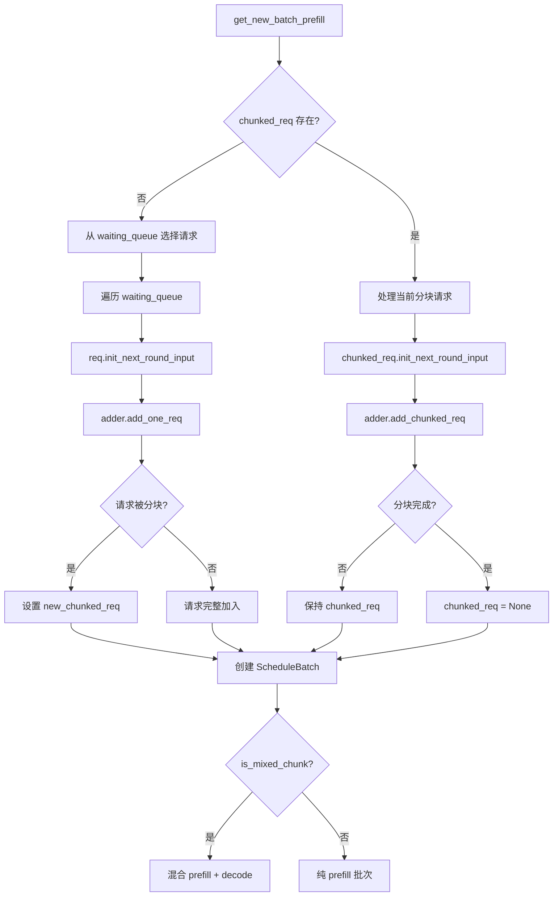
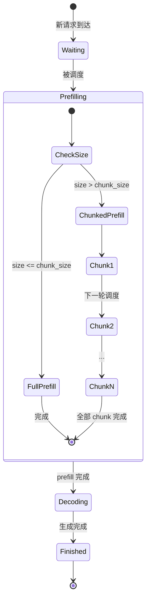
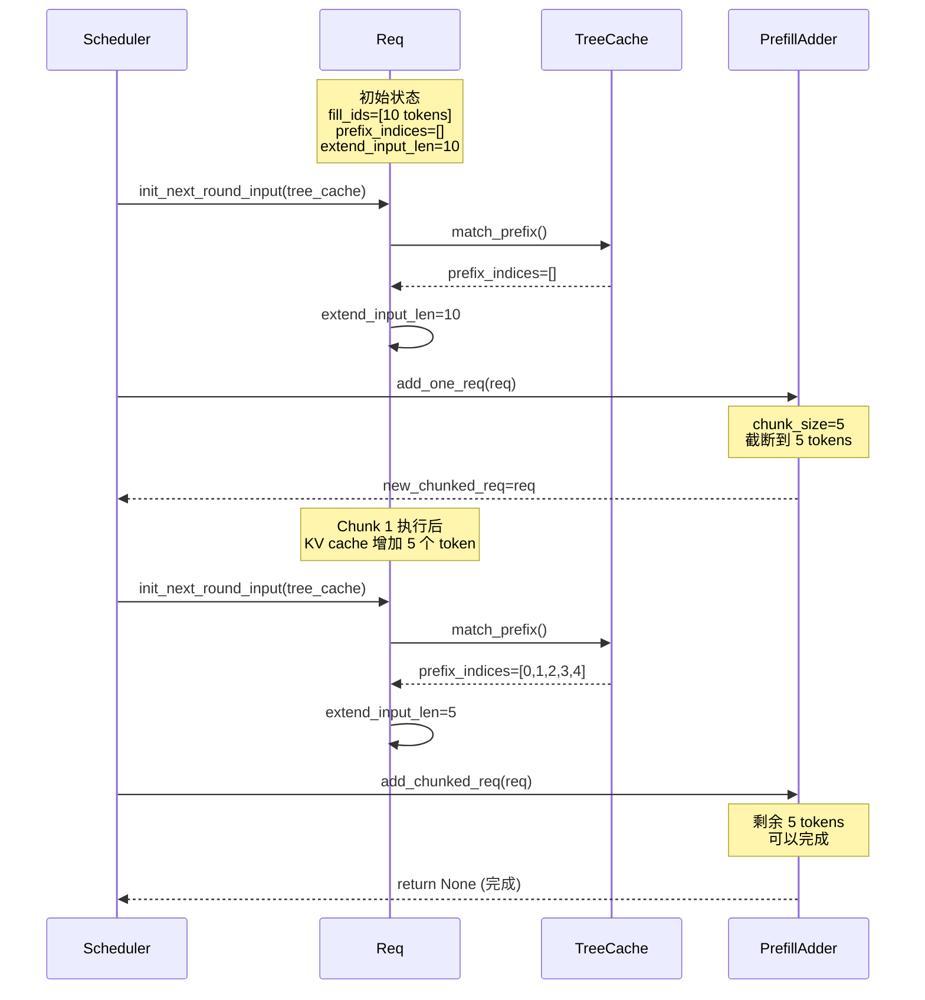

# Chunk Prefill 深度学习笔记

本文档详细解析 SGLang 中 Chunk Prefill 的完整实现逻辑。

---

## 1. 为什么需要 Chunk Prefill？

### 1.1 问题背景

在 LLM 推理中，存在两种主要的计算阶段：
- **Prefill（预填充）**：处理用户输入的 prompt，计算量与 prompt 长度成正比
- **Decode（解码）**：逐个生成新 token，每次生成一个 token

**问题**：当一个长 prompt（如 10,000 tokens）正在进行 prefill 时，其他请求的 decode 必须等待，导致 **TPOT 抖动**。

```
时间线（无 Chunk Prefill）:
|-------- 长 Prefill (10K tokens) --------|
                                          |-- Decode --|
   ↑
   其他 decode 请求被阻塞，TPOT 飙升
```

### 1.2 Chunk Prefill 的解决方案

将长 prefill 分成多个小块（chunks），每处理完一个 chunk 就让 decode 请求有机会执行：

```
时间线（有 Chunk Prefill）:
|-- Chunk1 --|-- Decode --|-- Chunk2 --|-- Decode --|-- Chunk3 --|...
                  ↑              ↑
              其他 decode 请求穿插执行，TPOT 平稳
```

---

## 2. 核心数据结构

### 2.1 Scheduler 中的关键变量

```python
# file: scheduler.py

class Scheduler:
    # Chunk Prefill 相关变量
    chunked_prefill_size: Optional[int]  # 每个 chunk 的最大 token 数
    chunked_req: Optional[Req]           # 当前正在分块处理的请求
    is_mixed_chunk: bool                 # 是否允许 prefill + decode 混合批次
```

### 2.2 Req 中的分块状态

```python
# file: schedule_batch.py

class Req:
    is_chunked: int  # 分块计数器，> 0 表示正在分块处理
    fill_ids: List[int]  # 当前 chunk 需要处理的 token IDs
    prefix_indices: torch.Tensor  # 已经处理过的 prefix 的 KV cache 索引
    extend_input_len: int  # 当前需要扩展（prefill）的 token 数
```

### 2.3 PrefillAdder 核心属性

```python
# file: schedule_policy.py

class PrefillAdder:
    rem_input_tokens: int        # 剩余可用的 prefill token 额度
    rem_chunk_tokens: Optional[int]  # 当前 chunk 剩余的 token 额度
    can_run_list: List[Req]      # 可以运行的请求列表
    new_chunked_req: Optional[Req]  # 新产生的分块请求
```

---

## 3. 初始化流程详解

### 3.1 Scheduler.init_chunked_prefill()

```python
def init_chunked_prefill(self):
    # Step 1: 从配置获取 chunk 大小
    self.chunked_prefill_size = self.server_args.chunked_prefill_size
    
    # Step 2: 特殊情况 - Diffusion LLM 使用自己的 block_size
    if self.dllm_config is not None:
        self.chunked_prefill_size = self.dllm_config.block_size
    
    # Step 3: 禁用检查 (-1 或 0 表示禁用)
    if self.chunked_prefill_size <= 0:
        self.chunked_prefill_size = None
    
    # Step 4: 初始化分块请求跟踪器
    self.chunked_req = None  # 关键！同一时刻只允许一个请求在分块中
    
    # Step 5: 混合批次配置
    self.is_mixed_chunk = (
        self.chunked_prefill_size is not None
        and self.server_args.enable_mixed_chunk
    )
```

> [!IMPORTANT]
> `chunked_req` 的设计保证了**同一时刻只有一个请求**在进行分块 prefill。
> 这简化了内存管理和状态追踪。

---

## 4. 调度流程详解

### 4.1 整体调度流程图



### 4.2 get_new_batch_prefill() 核心逻辑

让我分段解释这个关键函数：

#### 阶段 1: 前置检查

```python
def get_new_batch_prefill(self) -> Optional[ScheduleBatch]:
    # 检查是否可以进行 prefill
    if (
        self.running_batch.batch_is_full or len(self.waiting_queue) == 0
    ) and self.chunked_req is None:
        return None  # 没有请求可以处理
```

> [!TIP]
> 注意 `and self.chunked_req is None` 这个条件！
> 即使 waiting_queue 为空，如果有正在进行的分块请求，我们仍需继续处理。

#### 阶段 2: 创建 PrefillAdder

```python
    # 确定本次 chunk 大小（可能是动态的）
    chunked_prefill_size = self.chunked_prefill_size
    if self.chunked_req is not None and self.enable_dynamic_chunking:
        history_len = len(self.chunked_req.prefix_indices)
        dynamic_size = self.predict_next_chunk_size(history_len)
        if dynamic_size is not None:
            chunked_prefill_size = dynamic_size
    
    # 创建 PrefillAdder - 核心调度器
    adder = PrefillAdder(
        self.page_size,
        self.tree_cache,
        self.token_to_kv_pool_allocator,
        self.running_batch,
        self.new_token_ratio,
        self.max_prefill_tokens,           # rem_input_tokens
        chunked_prefill_size,              # rem_chunk_tokens (关键!)
        running_bs if self.is_mixed_chunk else 0,  # mixed_with_decode_tokens
        ...
    )
```

#### 阶段 3: 处理进行中的分块请求

```python
    # 如果有正在分块处理的请求，优先处理它
    if self.chunked_req is not None:
        self.chunked_req.init_next_round_input()  # 准备下一个 chunk 的输入
        self.chunked_req = adder.add_chunked_req(self.chunked_req)
        # 如果返回 None，表示分块完成；否则继续分块
```

#### 阶段 4: 从等待队列添加新请求

```python
    for req in self.waiting_queue:
        req.init_next_round_input(self.tree_cache)
        res = adder.add_one_req(
            req,
            has_chunked_req=(self.chunked_req is not None),
            truncation_align_size=self.truncation_align_size,
        )
        
        if res != AddReqResult.CONTINUE:
            break  # 资源耗尽或其他原因停止添加
```

#### 阶段 5: 更新分块状态

```python
    # 更新 chunked_req（可能有新的分块请求产生）
    if adder.new_chunked_req is not None:
        assert self.chunked_req is None  # 确保没有冲突
        self.chunked_req = adder.new_chunked_req
    
    if self.chunked_req:
        self.chunked_req.is_chunked += 1  # 增加分块计数器
```

#### 阶段 6: 混合批次处理

```python
    # 如果启用了 mixed_chunk，将 decode 请求混入 prefill 批次
    if (
        self.is_mixed_chunk
        and not self.running_batch.is_empty()
        and not (new_batch.return_logprob or self.running_batch.return_logprob)
    ):
        self.running_batch.prepare_for_decode()
        new_batch.mix_with_running(self.running_batch)
        new_batch.decoding_reqs = self.running_batch.reqs
        self.running_batch = ScheduleBatch(reqs=[], batch_is_full=...)
```

---

## 5. PrefillAdder 深度解析

### 5.1 add_one_req() - 添加单个请求

这是决定请求是否需要分块的核心函数：

```python
def add_one_req(self, req: Req, has_chunked_req: bool, truncation_align_size: Optional[int]):
    # 计算需要的总 token 数
    total_tokens = req.extend_input_len + min(
        max(req.sampling_params.max_new_tokens - len(req.output_ids), 0),
        CLIP_MAX_NEW_TOKENS,
    )
    
    # 检查资源是否足够
    if total_tokens >= self.rem_total_tokens:
        return AddReqResult.NO_TOKEN
    
    input_tokens = self.ceil_paged_tokens(req.extend_input_len)
    
    # 关键判断：是否需要分块
    if self.rem_chunk_tokens is None or input_tokens <= self.rem_chunk_tokens:
        # ========== 非分块 prefill ==========
        self.can_run_list.append(req)
        self._update_prefill_budget(prefix_len, input_tokens, max_new_tokens)
    else:
        # ========== 分块 prefill ==========
        # 计算本次 chunk 可以处理的 token 数
        trunc_len = self.rem_chunk_tokens // self.page_size * self.page_size
        if trunc_len <= 0:
            return AddReqResult.OTHER
        
        # 截断请求
        req.set_extend_input_len(trunc_len)
        req.fill_ids = req.fill_ids[: len(req.prefix_indices) + trunc_len]
        
        self.can_run_list.append(req)
        self.new_chunked_req = req  # 标记为分块请求
        self._update_prefill_budget(prefix_len, trunc_len, 0)  # max_new_tokens=0
    
    return self.budget_state()
```

> [!IMPORTANT]
> 分块时 `max_new_tokens = 0`！
> 因为分块还没完成，我们不需要为输出预留空间。

### 5.2 add_chunked_req() - 继续处理分块

```python
def add_chunked_req(self, req: Req):
    # 计算本次可以处理的 token 数
    _rem_tokens = min(self.rem_chunk_tokens, int(self.rem_total_tokens))
    
    # 安全检查：必须添加分块请求，否则会内存泄漏
    if _rem_tokens <= 0:
        _rem_tokens = self.rem_chunk_tokens
    
    # 是否还需要继续分块
    truncated = req.extend_input_len > _rem_tokens
    
    # 设置本次处理的长度
    req.set_extend_input_len(min(req.extend_input_len, _rem_tokens))
    req.fill_ids = req.fill_ids[: len(req.prefix_indices) + req.extend_input_len]
    
    self.can_run_list.append(req)
    self._update_prefill_budget(
        0,
        req.extend_input_len,
        min(req.sampling_params.max_new_tokens, CLIP_MAX_NEW_TOKENS) if not truncated else 0,
    )
    
    # 返回值决定是否继续分块
    return req if truncated else None
```

---

## 6. 状态转换图



---

## 6. Req.init_next_round_input() 详解

这个函数是分块 prefill 的**核心状态更新函数**，每个 chunk 开始前都会调用它：

```python
# file: schedule_batch.py (L845-898)

def init_next_round_input(self, tree_cache: Optional[BasePrefixCache] = None):
    # Step 1: 构建完整的 fill_ids
    # fill_ids = 原始输入 + 已生成的输出
    self.fill_ids = self.origin_input_ids + self.output_ids
    
    input_len = len(self.fill_ids)
    
    # Step 2: 计算最大 prefix 长度
    # 注意：至少保留 1 个 token 用于 logprob 计算
    max_prefix_len = input_len - 1
    if self.return_logprob and self.logprob_start_len >= 0:
        max_prefix_len = min(max_prefix_len, self.logprob_start_len)
    max_prefix_len = max(max_prefix_len, 0)
    
    token_ids = self.fill_ids[:max_prefix_len]
    
    # Step 3: 从 tree_cache 匹配前缀
    if tree_cache is not None:
        match_result = tree_cache.match_prefix(
            key=RadixKey(token_ids=token_ids, extra_key=self.extra_key),
        )
        # 更新 prefix_indices：已经在 KV cache 中的 token 索引
        self.prefix_indices = match_result.device_indices
        self.last_node = match_result.last_device_node
        self.cache_protected_len = len(self.prefix_indices)
    
    # Step 4: 计算 extend_input_len
    # extend_input_len = 需要进行 prefill 的 token 数
    self.set_extend_input_len(len(self.fill_ids) - len(self.prefix_indices))
```

### 关键变量的含义

```
原始请求: "Hello, how are you? I am fine, thank you."
假设 chunked_prefill_size = 5

第一个 chunk 开始前:
┌─────────────────────────────────────────────────────────┐
│ fill_ids = [Hello, ,, how, are, you, ?, I, am, fine, ...] (全部 tokens)
│ prefix_indices = []  (cache 中没有)
│ extend_input_len = 10 (需要处理全部)
│ 
│ 但是 chunked_prefill_size = 5，所以只处理前 5 个
│ 实际 extend_input_len 被设置为 5
└─────────────────────────────────────────────────────────┘

第一个 chunk 完成后，第二个 chunk 开始前:
┌─────────────────────────────────────────────────────────┐
│ fill_ids = [Hello, ,, how, are, you, ?, I, am, fine, ...] (同上)
│ prefix_indices = [0, 1, 2, 3, 4]  (第一个 chunk 的结果在 cache 中)
│ extend_input_len = 5 (剩余 5 个 tokens)
│ 
│ 这次可以处理完剩余的 5 个 tokens
└─────────────────────────────────────────────────────────┘
```

### 分块状态追踪示意图



---

## 7. 关键代码位置索引

| 功能 | 文件 | 函数 | 行号 |
|------|------|------|------|
| 初始化分块配置 | [scheduler.py](file:///Users/wesley/code/sglang/python/sglang/srt/managers/scheduler.py) | `init_chunked_prefill()` | L742-769 |
| 获取 prefill 批次 | [scheduler.py](file:///Users/wesley/code/sglang/python/sglang/srt/managers/scheduler.py) | `get_new_batch_prefill()` | L1861-2071 |
| PrefillAdder 类 | [schedule_policy.py](file:///Users/wesley/code/sglang/python/sglang/srt/managers/schedule_policy.py) | `PrefillAdder` | L316-729 |
| 添加单个请求 | [schedule_policy.py](file:///Users/wesley/code/sglang/python/sglang/srt/managers/schedule_policy.py) | `add_one_req()` | L570-666 |
| 添加分块请求 | [schedule_policy.py](file:///Users/wesley/code/sglang/python/sglang/srt/managers/schedule_policy.py) | `add_chunked_req()` | L450-471 |
| 请求初始化下一轮 | [schedule_batch.py](file:///Users/wesley/code/sglang/python/sglang/srt/managers/schedule_batch.py) | `Req.init_next_round_input()` | 需要查看 |

---

## 8. 调试技巧

### 8.1 观察分块状态

```python
# 在 scheduler 中添加日志
if self.chunked_req:
    logger.info(
        f"Chunked req: rid={self.chunked_req.rid}, "
        f"is_chunked={self.chunked_req.is_chunked}, "
        f"extend_input_len={self.chunked_req.extend_input_len}, "
        f"prefix_len={len(self.chunked_req.prefix_indices)}"
    )
```

### 8.2 关键环境变量

```bash
# 设置 chunk 大小
--chunked-prefill-size 2048

# 启用混合批次
--enable-mixed-chunk

# 启用动态分块（仅 PP 模式）
--enable-dynamic-chunking
```

---

## 9. 练习题与解答

### 练习 1: 阅读 `Req.init_next_round_input()` 的实现

✅ **已在第 6 节详细解析**

---

### 练习 2: 为什么 `chunked_req` 设计为只能有一个？

#### 核心原因：**KV Cache 内存管理的简化**

```python
# file: scheduler.py (L1785-1797)

if self.chunked_req:
    # 1. 将 chunked_req 的 KV cache 临时插入到 tree_cache
    self.tree_cache.cache_unfinished_req(self.chunked_req, chunked=True)
    
    # 2. 释放 chunked_req 的 req_pool_idx（内存槽位）
    self.req_to_token_pool.free(self.chunked_req.req_pool_idx)
```

#### 如果允许多个 chunked_req 会有什么问题？

**问题 1: 内存管理复杂度暴增**

```
单个 chunked_req 的内存生命周期:
┌─────────────────────────────────────────────────────────────────┐
│ Chunk 1 处理 → 释放 req_pool_idx → 缓存到 tree_cache            │
│ Chunk 2 处理 → 重新分配 req_pool_idx → 从 tree_cache 恢复       │
│ ...                                                             │
│ 最后 Chunk → 保留 req_pool_idx → 进入 running_batch             │
└─────────────────────────────────────────────────────────────────┘

如果有多个 chunked_req:
┌─────────────────────────────────────────────────────────────────┐
│ Req A Chunk 1 → 释放 A 的内存 → 缓存                            │
│ Req B Chunk 1 → 释放 B 的内存 → 缓存                            │
│ Req A Chunk 2 → 需要恢复 A 的内存 → 可能失败（被 B 占用）       │
│ ❌ 内存碎片化、状态追踪极其复杂                                 │
└─────────────────────────────────────────────────────────────────┘
```

**问题 2: 调度顺序不确定性**

```python
# file: scheduler.py (L1930-1932)

if self.chunked_req is not None:
    self.chunked_req.init_next_round_input()
    self.chunked_req = adder.add_chunked_req(self.chunked_req)  # 优先处理！
```

单个 chunked_req 保证了**处理顺序的确定性**：正在分块的请求总是优先被调度。

如果有多个，需要决定：
- 哪个 chunked_req 先处理？
- 如果 A 的下一个 chunk 比 B 小，是否让 A 先完成？
- 如果 A 被抢占了怎么办？

**问题 3: 代码断言会失败**

```python
# file: scheduler.py (L2013-2015)

if adder.new_chunked_req is not None:
    assert self.chunked_req is None  # 关键断言！
    self.chunked_req = adder.new_chunked_req
```

这个断言明确表示：**不允许同时有两个正在分块的请求**。

---

### 练习 3: `fill_ids` 与 `token_ids` 的关系

#### 核心定义

```python
# file: schedule_batch.py (L531-532)

# fill_ids = origin_input_ids + output_ids. Updated if chunked.
self.fill_ids = []
```

#### 变量含义对照表

| 变量 | 含义 | 示例 |
|------|------|------|
| `origin_input_ids` | 用户输入的原始 token IDs | `[1, 2, 3, 4, 5]`（"你好世界"） |
| `output_ids` | 模型已生成的 token IDs | `[6, 7]`（"你好"） |
| `fill_ids` | 当前需要处理的完整序列 | `[1, 2, 3, 4, 5, 6, 7]` |
| `prefix_indices` | 已在 KV cache 中的部分 | `tensor([0, 1, 2, 3])` |
| `extend_input_len` | 需要进行 prefill 的 token 数 | `3`（`fill_ids` - `prefix_indices`） |

#### 图解 fill_ids

```
完整请求生命周期:

┌─────────────────────────────────────────────────────────────────┐
│ 阶段 1: 首次 Prefill                                            │
│ origin_input_ids = [1, 2, 3, 4, 5]                              │
│ output_ids = []                                                 │
│ fill_ids = [1, 2, 3, 4, 5]  ← 等于 origin_input_ids             │
│                                                                 │
│ 如果启用了 Chunked Prefill (chunk_size=2):                      │
│ ├── Chunk 1: fill_ids = [1, 2]       ← 被截断！                 │
│ ├── Chunk 2: fill_ids = [1, 2, 3, 4] ← 恢复后再截断             │
│ └── Chunk 3: fill_ids = [1, 2, 3, 4, 5] ← 完整                  │
└─────────────────────────────────────────────────────────────────┘

┌─────────────────────────────────────────────────────────────────┐
│ 阶段 2: Decode (生成 token 6)                                   │
│ origin_input_ids = [1, 2, 3, 4, 5]                              │
│ output_ids = [6]                                                │
│ fill_ids = [1, 2, 3, 4, 5, 6]  ← 包含新生成的 token             │
└─────────────────────────────────────────────────────────────────┘

┌─────────────────────────────────────────────────────────────────┐
│ 阶段 3: Decode (生成 token 7)                                   │
│ origin_input_ids = [1, 2, 3, 4, 5]                              │
│ output_ids = [6, 7]                                             │
│ fill_ids = [1, 2, 3, 4, 5, 6, 7]                                │
└─────────────────────────────────────────────────────────────────┘
```

#### 在批次构建时的使用

```python
# file: schedule_batch.py (L1416-1420)

# 构建 input_ids: 只取 fill_ids 中 prefix 之后的部分
input_ids = [r.fill_ids[len(r.prefix_indices):] for r in reqs]

# seq_lens: 整个序列的长度
seq_lens = [len(r.fill_ids) for r in reqs]
```

```
示例:
fill_ids = [1, 2, 3, 4, 5, 6, 7]
prefix_indices = [0, 1, 2, 3, 4]  (对应 tokens 1-5 已在 KV cache)

input_ids = fill_ids[5:] = [6, 7]  ← 只处理新的部分！
seq_lens = 7                       ← 但 attention 需要知道完整长度
```

#### 为什么叫 "fill_ids"？

因为这些 token 需要"填充"到 KV cache 中。在每轮调度时：

1. `fill_ids` 代表当前请求需要最终填入 KV cache 的所有 tokens
2. `prefix_indices` 代表已经在 cache 中的部分
3. `fill_ids[len(prefix_indices):]` 就是这一轮需要新填充的部分

---

*学习笔记 - Chunk Prefill 详解*
*更新时间: 2026-01-13*

