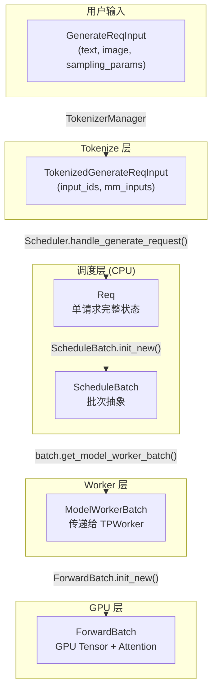
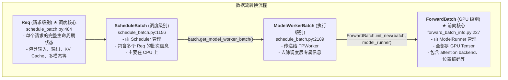

# SGLang 核心数据结构详解

> **默认场景**: Qwen/Qwen3-VL-235B-A22B-Thinking 多模态模型
>
> **启用特性**: PD 分离 + Chunked Prefill + ViT DP + Overlap Schedule + 多模态缓存

本文详细分析 SGLang 调度系统的**四个**核心数据结构，以及它们之间的转换关系。

## 1. 数据结构概览

SGLang 的批次数据在不同层级有不同的表示：



**详细层级关系**:



**文件位置**:
- `srt/managers/schedule_batch.py` - Req, ScheduleBatch, ModelWorkerBatch
- `srt/model_executor/forward_batch_info.py` - ForwardBatch, ForwardMode

## 2. Req 类详解

**定义**: `schedule_batch.py:484`

`Req` 类表示单个请求的完整生命周期状态。

### 2.1 核心字段分类

#### 输入/输出信息

```python
class Req:
    def __init__(self, ...):
        # ========== 请求标识 ==========
        self.rid = rid                              # 请求唯一 ID

        # ========== 输入信息 ==========
        self.origin_input_text = origin_input_text  # 原始输入文本
        self.origin_input_ids = origin_input_ids    # tokenize 后的 ID 列表
        self.origin_input_ids_unpadded = ...        # 图像 padding 前的 ID

        # ========== 输出信息 ==========
        self.output_ids = []                        # decode 阶段生成的 token IDs
        self.fill_ids = []                          # origin_input_ids + output_ids
                                                    # 用于下一轮输入

        # ========== 采样参数 ==========
        self.sampling_params = sampling_params      # 温度、top_p 等
```

#### KV Cache 管理

```python
        # ========== 内存池索引 ==========
        self.req_pool_idx: Optional[int] = None     # 在 req_to_token_pool 中的索引

        # ========== KV Cache 长度管理 ==========
        self.kv_committed_len = 0      # 已确认使用的 KV cache 长度
        self.kv_allocated_len = 0      # 已分配的 KV cache 长度
                                       # (可能 > committed，如 speculative decoding)
        self.kv_committed_freed = False
        self.kv_overallocated_freed = False
```

#### 前缀缓存 (RadixCache)

```python
        # ========== 前缀复用信息 ==========
        self.prefix_indices: torch.Tensor = torch.empty((0,), dtype=torch.int64)
                                            # 已缓存前缀的 KV cache 索引
        self.extend_input_len = 0           # 需要计算的新 token 数量
                                            # = len(fill_ids) - len(prefix_indices)
        self.last_node: Any = None          # RadixCache 中的节点引用
        self.cached_tokens = 0              # 命中缓存的 token 数量
```

#### 多模态信息 (Qwen3-VL)

```python
        # ========== 多模态输入 ==========
        self.multimodal_inputs: Optional[MultimodalInputs] = None
        # MultimodalInputs 包含:
        #   - mm_items: List[MultimodalDataItem]  # 图像/视频/音频数据
        #   - mrope_positions: torch.Tensor       # 多模态旋转位置编码
        #   - mrope_position_delta: torch.Tensor
        #   - image_pad_len: List[int]            # 每个图像的 padding 长度
```

#### 完成状态

```python
        # ========== 终止检查 ==========
        self.finished_reason: Optional[BaseFinishReason] = None
                                            # EOS, LENGTH, STOP_STR, ABORT 等
        self.finished_len = None            # 完成位置 (用于 speculative decoding)
        self.to_finish: Optional[BaseFinishReason] = None
                                            # 延迟设置 finished_reason
        self.eos_token_ids = eos_token_ids  # 结束 token ID 集合
```

#### Logprob 相关

```python
        # ========== Logprob 参数 ==========
        self.return_logprob = return_logprob
        self.logprob_start_len = 0          # 开始计算 logprob 的位置
        self.top_logprobs_num = top_logprobs_num

        # ========== Logprob 返回值 ==========
        self.input_token_logprobs_val: Optional[List[float]] = None
        self.output_token_logprobs_val = []
        self.output_top_logprobs_val = []
```

### 2.2 关键方法

```python
class Req:
    @property
    def seqlen(self) -> int:
        """当前序列总长度"""
        return len(self.origin_input_ids) + len(self.output_ids)

    def finished(self) -> bool:
        """是否已完成"""
        return self.finished_reason is not None

    def init_next_round_input(self, tree_cache: Optional[BasePrefixCache] = None):
        """
        为下一轮计算准备输入
        1. 更新 fill_ids = origin_input_ids + output_ids
        2. 查询 RadixCache 获取 prefix_indices
        3. 计算 extend_input_len
        """
        self.fill_ids = self.origin_input_ids + self.output_ids
        # ... 查询缓存 ...
        self.set_extend_input_len(len(self.fill_ids) - len(self.prefix_indices))
```

## 3. ScheduleBatch 类详解

**定义**: `schedule_batch.py:1156`

`ScheduleBatch` 是调度层的批次抽象，由 `Scheduler` 管理。

### 3.1 核心字段

```python
@dataclasses.dataclass
class ScheduleBatch:
    """Store all information of a batch on the scheduler."""

    # ========== 请求列表 ==========
    reqs: List[Req]                         # 批次中的所有请求

    # ========== 内存池引用 ==========
    req_to_token_pool: ReqToTokenPool = None
    token_to_kv_pool_allocator: BaseTokenToKVPoolAllocator = None
    tree_cache: BasePrefixCache = None      # RadixCache 引用

    # ========== 批次配置 ==========
    model_config: ModelConfig = None
    forward_mode: ForwardMode = None        # EXTEND/DECODE/MIXED 等
    enable_overlap: bool = False            # 是否启用 overlap 调度
    batch_is_full: bool = False             # 批次是否已满

    # ========== GPU Tensors ==========
    input_ids: torch.Tensor = None          # shape: [total_tokens], int64
    req_pool_indices: torch.Tensor = None   # shape: [batch_size], int64
    seq_lens: torch.Tensor = None           # shape: [batch_size], int64
    seq_lens_cpu: torch.Tensor = None       # CPU 副本，避免 GPU 同步
    out_cache_loc: torch.Tensor = None      # KV cache 写入位置

    # ========== 多模态输入 ==========
    multimodal_inputs: Optional[List] = None  # List[MultimodalInputs]

    # ========== Extend (Prefill) 专用 ==========
    prefix_lens: List[int] = None           # 每个请求的前缀长度
    extend_lens: List[int] = None           # 每个请求的新计算长度
    extend_num_tokens: Optional[int] = None # 总计算 token 数

    # ========== 采样信息 ==========
    sampling_info: SamplingBatchInfo = None

    # ========== Speculative Decoding ==========
    spec_algorithm: SpeculativeAlgorithm = None
    spec_info: Optional[SpecInput] = None
```

### 3.2 ForwardMode 枚举

**定义**: `srt/model_executor/forward_batch_info.py:70`

```python
class ForwardMode(IntEnum):
    EXTEND = auto()         # Prefill: 处理新输入 (有前缀复用)
    DECODE = auto()         # Decode: 生成单个 token
    MIXED = auto()          # 混合: chunked prefill + decode
    IDLE = auto()           # 空闲: DP attention 某些 worker 无任务

    TARGET_VERIFY = auto()  # Speculative: 目标模型验证
    DRAFT_EXTEND = auto()   # Speculative: 草稿模型扩展
    PREBUILT = auto()       # 分离式解码: KV cache 已就绪
    SPLIT_PREFILL = auto()  # PD 复用: 分割 prefill
    DLLM_EXTEND = auto()    # Diffusion LLM

    def is_extend(self):
        """是否是 extend 类型 (需要处理多个输入 token)"""
        return self in [EXTEND, MIXED, DRAFT_EXTEND, TARGET_VERIFY, SPLIT_PREFILL, DLLM_EXTEND]

    def is_decode(self):
        """是否是 decode 类型 (每个请求仅 1 个 token)"""
        return self == DECODE
```

### 3.3 关键方法

#### 创建批次

```python
@classmethod
def init_new(cls, reqs: List[Req], ...):
    """创建新的 ScheduleBatch"""
    return cls(
        reqs=reqs,
        req_to_token_pool=req_to_token_pool,
        token_to_kv_pool_allocator=token_to_kv_pool_allocator,
        tree_cache=tree_cache,
        # ... 从 reqs 汇总信息 ...
        return_logprob=any(req.return_logprob for req in reqs),
        has_stream=any(req.stream for req in reqs),
        has_grammar=any(req.grammar for req in reqs),
    )
```

#### 准备 Extend (Prefill)

```python
def prepare_for_extend(self):
    """
    为 extend (prefill) 准备批次数据
    调用时机: get_new_batch_prefill() 后
    """
    self.forward_mode = ForwardMode.EXTEND

    # 1. 构建 input_ids (仅包含需要计算的部分)
    input_ids = [r.fill_ids[len(r.prefix_indices):] for r in self.reqs]

    # 2. 分配 KV cache
    out_cache_loc = alloc_for_extend(
        self.token_to_kv_pool_allocator,
        self.reqs,
        self.is_hybrid_swa
    )

    # 3. 更新 req 的 KV 长度信息
    for req in self.reqs:
        req.kv_committed_len = len(req.fill_ids) - 1
        req.kv_allocated_len = len(req.fill_ids) - 1

    # 4. 处理多模态输入
    for mm_input in multimodal_inputs:
        for mm_item in mm_input.mm_items:
            # 将 pixel_values 移到 GPU
            mm_item.feature = pixel_values.to(self.device, non_blocking=True)

    # 5. 构建采样信息
    self.sampling_info = SamplingBatchInfo.from_schedule_batch(self, vocab_size)
```

#### 准备 Decode

```python
def prepare_for_decode(self):
    """
    为 decode 准备批次数据
    调用时机: update_running_batch() 中
    """
    self.forward_mode = ForwardMode.DECODE

    # 1. 每个请求只有 1 个新 token
    input_ids = [r.output_ids[-1] for r in self.reqs]

    # 2. 分配 1 个 KV cache slot per request
    out_cache_loc = alloc_for_decode(
        self.token_to_kv_pool_allocator,
        bs=len(self.reqs),
        is_hybrid_swa=self.is_hybrid_swa
    )

    # 3. 更新 KV 长度
    for req in self.reqs:
        req.kv_committed_len += 1
        req.kv_allocated_len += 1

    # 4. 更新 seq_lens
    if self.enable_overlap:
        self.seq_lens = self.seq_lens + 1  # 非 in-place (避免 race condition)
    else:
        self.seq_lens.add_(1)  # in-place (更快)
```

#### 转换为 ModelWorkerBatch

```python
def get_model_worker_batch(self) -> ModelWorkerBatch:
    """
    转换为传递给 TPWorker 的数据结构
    过滤掉调度层不需要传递的信息
    """
    return ModelWorkerBatch(
        forward_mode=self.forward_mode,
        input_ids=self.input_ids,
        req_pool_indices=self.req_pool_indices,
        seq_lens=self.seq_lens,
        seq_lens_cpu=self.seq_lens_cpu,
        out_cache_loc=self.out_cache_loc,
        seq_lens_sum=self.seq_lens_sum,
        # ... 采样、logprob、多模态等信息 ...
        multimodal_inputs=self.multimodal_inputs,
        sampling_info=self.sampling_info,
    )
```

## 4. ModelWorkerBatch 类详解

**定义**: `schedule_batch.py:2189`

`ModelWorkerBatch` 是传递给 `TPWorker.forward_batch_generation()` 的数据结构。

### 4.1 核心字段

```python
@dataclasses.dataclass
class ModelWorkerBatch:
    # ========== 前向模式 ==========
    forward_mode: ForwardMode

    # ========== 输入 Tensor ==========
    input_ids: torch.Tensor           # [total_tokens], 拼接后的输入
    req_pool_indices: torch.Tensor    # [batch_size], 请求在内存池的索引
    seq_lens: torch.Tensor            # [batch_size], 每个请求的序列长度
    out_cache_loc: torch.Tensor       # [total_new_tokens], KV 写入位置

    # ========== 辅助信息 ==========
    seq_lens_cpu: Optional[torch.Tensor]  # CPU 副本
    seq_lens_sum: int                     # 总 token 数

    # ========== Logprob ==========
    return_logprob: bool
    top_logprobs_nums: Optional[List[int]]

    # ========== Extend 专用 ==========
    extend_num_tokens: Optional[int]      # 需要计算的 token 数
    extend_seq_lens: Optional[List[int]]  # 每个请求的 extend 长度
    extend_prefix_lens: Optional[List[int]]  # 每个请求的前缀长度

    # ========== 多模态 ==========
    multimodal_inputs: Optional[List[MultimodalInputs]]

    # ========== 采样信息 ==========
    sampling_info: SamplingBatchInfo

    # ========== Speculative Decoding ==========
    spec_algorithm: SpeculativeAlgorithm = None
    spec_info: Optional[SpecInput] = None
```

### 4.2 与 ScheduleBatch 的区别

| 特性 | ScheduleBatch | ModelWorkerBatch |
|------|---------------|------------------|
| 管理者 | Scheduler | TPWorker |
| 包含 Req | 是 (`reqs: List[Req]`) | 否 |
| 内存池引用 | 是 | 否 |
| 缓存引用 | 是 (`tree_cache`) | 否 |
| 数据位置 | 混合 (CPU + GPU) | 主要 GPU |
| 用途 | 调度决策 | 模型前向 |

## 5. MultimodalInputs 类 (Qwen3-VL)

**定义**: `schedule_batch.py:~300`

```python
@dataclasses.dataclass
class MultimodalInputs:
    """存储多模态输入数据"""

    # ========== 多模态数据项 ==========
    mm_items: List[MultimodalDataItem] = None
    # MultimodalDataItem 包含:
    #   - modality: Modality (IMAGE/VIDEO/AUDIO)
    #   - offsets: List[int]  # 在 input_ids 中的位置
    #   - feature: torch.Tensor  # pixel_values 或 audio_features

    # ========== 图像 Padding ==========
    image_pad_len: List[int] = None

    # ========== Qwen 系列特有: M-ROPE 位置编码 ==========
    mrope_positions: Optional[torch.Tensor] = None    # [3, seq_len]
    mrope_position_delta: Optional[torch.Tensor] = None

    # ========== Token ID ==========
    im_start_id: Optional[int] = None
    im_end_id: Optional[int] = None
    im_token_id: Optional[int] = None
    video_token_id: Optional[int] = None
    audio_token_id: Optional[int] = None
```

### M-ROPE 位置编码 (Qwen3-VL)

Qwen3-VL 使用 **Multimodal Rotary Position Embedding**：

```python
# mrope_positions shape: [3, seq_len]
# 维度 0: temporal (时间维度)
# 维度 1: height (图像高度维度)
# 维度 2: width (图像宽度维度)

# 对于文本 token: 三个维度相同 (普通位置)
# 对于图像 token: 根据 patch 位置分配不同的 2D 坐标
```

## 6. ForwardBatch 类详解

**定义**: `forward_batch_info.py:227`

`ForwardBatch` 是模型前向传播的核心数据结构，由 `ModelRunner` 管理，包含所有 GPU Tensor。

### 6.1 核心字段

```python
class ForwardBatch:
    """Store all inputs of a forward pass."""

    # ========== 基础信息 ==========
    forward_mode: ForwardMode           # EXTEND/DECODE/MIXED
    batch_size: int                     # 批次大小
    input_ids: torch.Tensor             # [total_tokens], 输入 token IDs
    positions: torch.Tensor             # [total_tokens], 位置编码

    # ========== KV Cache 管理 ==========
    req_pool_indices: torch.Tensor      # [batch_size], 请求在内存池的索引
    seq_lens: torch.Tensor              # [batch_size], 每个请求的序列长度
    out_cache_loc: torch.Tensor         # [total_new_tokens], KV 写入位置
    seq_lens_sum: int                   # 总序列长度

    # ========== Attention 后端 ==========
    attn_backend: AttentionBackend      # FlashInfer/FlashAttention/Triton
    req_to_token_pool: ReqToTokenPool   # 请求 → token 索引映射
    token_to_kv_pool: KVCache           # token → KV cache 映射

    # ========== Extend (Prefill) 专用 ==========
    extend_num_tokens: int              # 需要计算的 token 数
    extend_seq_lens: torch.Tensor       # 每个请求的 extend 长度
    extend_prefix_lens: torch.Tensor    # 每个请求的前缀长度
    extend_start_loc: torch.Tensor      # 每个请求在 input_ids 中的起始位置

    # ========== 多模态 (Qwen3-VL) ==========
    mm_inputs: List[MultimodalInputs]   # 多模态输入列表
    mrope_positions: torch.Tensor       # [3, seq_len], M-ROPE 位置编码

    # ========== DP Attention ==========
    global_num_tokens_cpu: List[int]    # 各 DP rank 的 token 数
    global_num_tokens_gpu: torch.Tensor
    dp_padding_mode: DpPaddingMode      # 填充模式
    is_extend_in_batch: bool            # 批次中是否包含 extend
    can_run_dp_cuda_graph: bool         # 是否可运行 DP CUDA Graph

    # ========== Chunked Prefill ==========
    attn_attend_prefix_cache: bool      # 是否需要 attend prefix cache
    num_prefix_chunks: int              # prefix cache 的 chunk 数
    prefix_chunk_len: int               # 每个 chunk 的最大长度
    prefix_chunk_kv_indices: List[torch.Tensor]  # 每个 chunk 的 KV 索引

    # ========== Speculative Decoding ==========
    spec_info: SpecInput                # 投机解码信息
    spec_algorithm: SpeculativeAlgorithm

    # ========== 采样信息 ==========
    sampling_info: SamplingBatchInfo
    return_logprob: bool
    top_logprobs_nums: List[int]
```

### 6.2 从 ModelWorkerBatch 创建

```python
# forward_batch_info.py:398
@classmethod
def init_new(cls, batch: ModelWorkerBatch, model_runner: ModelRunner):
    """从 ModelWorkerBatch 创建 ForwardBatch"""
    ret = cls(
        forward_mode=batch.forward_mode,
        batch_size=len(batch.seq_lens),
        input_ids=batch.input_ids,
        req_pool_indices=batch.req_pool_indices,
        seq_lens=batch.seq_lens,
        out_cache_loc=batch.out_cache_loc,
        mm_inputs=batch.multimodal_inputs,
        # ...
    )

    # 添加 ModelRunner 的引用
    ret.req_to_token_pool = model_runner.req_to_token_pool
    ret.token_to_kv_pool = model_runner.token_to_kv_pool
    ret.attn_backend = model_runner.attn_backend

    # 计算位置编码
    ret.positions = ...

    # 准备 Attention 后端
    ret.attn_backend.init_forward_metadata(ret)

    return ret
```

### 6.3 与其他数据结构的对比

| 特性 | ScheduleBatch | ModelWorkerBatch | ForwardBatch |
|------|---------------|------------------|--------------|
| 管理者 | Scheduler | TPWorker | ModelRunner |
| 包含 Req | 是 | 否 | 否 |
| 内存池引用 | 有 | 无 | 有 |
| Attention 后端 | 无 | 无 | 有 |
| 位置编码 | 无 | 无 | 有 (`positions`) |
| M-ROPE | 在 mm_inputs 中 | 在 mm_inputs 中 | `mrope_positions` |
| CUDA Graph | 无 | 无 | 相关配置 |
| 用途 | 调度决策 | 跨进程传输 | 模型前向 |

## 7. 数据流转示例

### 6.1 Prefill 阶段 (Qwen3-VL 图像请求)

```python
# 1. 用户请求到达
input_text = "描述这张图片"
image_data = [image_bytes]

# 2. TokenizerManager 处理
#    → QwenVLImageProcessor.process_mm_data_async()
input_ids = [token1, token2, ..., <vision_start>, <image_pad>*N, <vision_end>, ...]
mm_inputs = MultimodalInputs(
    mm_items=[MultimodalDataItem(modality=IMAGE, feature=pixel_values)],
    mrope_positions=torch.tensor([...]),  # [3, seq_len]
)

# 3. 创建 Req
req = Req(
    rid="req-001",
    origin_input_ids=input_ids,
    sampling_params=sampling_params,
)
req.multimodal_inputs = mm_inputs

# 4. 加入 waiting_queue
scheduler.waiting_queue.append(req)

# 5. get_new_batch_prefill() 创建 ScheduleBatch
batch = ScheduleBatch.init_new(
    reqs=[req],
    req_to_token_pool=...,
    token_to_kv_pool_allocator=...,
    tree_cache=...,
)

# 6. prepare_for_extend() 准备数据
batch.prepare_for_extend()
# → batch.forward_mode = ForwardMode.EXTEND
# → batch.input_ids = tensor([...])  # 仅需计算部分
# → batch.multimodal_inputs = [mm_inputs]

# 7. 转换为 ModelWorkerBatch
worker_batch = batch.get_model_worker_batch()

# 8. 传递给 TPWorker
result = tp_worker.forward_batch_generation(worker_batch)
```

### 6.2 Decode 阶段

```python
# Prefill 完成后，请求合并到 running_batch

# 1. update_running_batch() 准备 decode
running_batch.prepare_for_decode()
# → forward_mode = ForwardMode.DECODE
# → input_ids = [last_output_token_per_req]
# → seq_lens += 1

# 2. 执行前向
worker_batch = running_batch.get_model_worker_batch()
result = tp_worker.forward_batch_generation(worker_batch)

# 3. 更新请求状态
for req, next_token in zip(running_batch.reqs, result.next_token_ids):
    req.output_ids.append(next_token)

# 4. 检查终止条件
for req in running_batch.reqs:
    if next_token in req.eos_token_ids:
        req.finished_reason = FINISH_EOS()
```

## 8. 关键字段速查表

### Req 字段

| 字段 | 类型 | 说明 |
|------|------|------|
| `rid` | str | 请求唯一 ID |
| `origin_input_ids` | List[int] | 原始输入 token IDs |
| `output_ids` | List[int] | 生成的 token IDs |
| `fill_ids` | List[int] | origin_input_ids + output_ids |
| `prefix_indices` | Tensor | 已缓存前缀的 KV 索引 |
| `extend_input_len` | int | 需要计算的 token 数 |
| `req_pool_idx` | int | 内存池索引 |
| `kv_committed_len` | int | 已确认的 KV cache 长度 |
| `kv_allocated_len` | int | 已分配的 KV cache 长度 |
| `multimodal_inputs` | MultimodalInputs | 多模态数据 |
| `finished_reason` | BaseFinishReason | 完成原因 |

### ScheduleBatch 字段

| 字段 | 类型 | 说明 |
|------|------|------|
| `reqs` | List[Req] | 请求列表 |
| `forward_mode` | ForwardMode | 前向模式 |
| `input_ids` | Tensor | 输入 token IDs |
| `seq_lens` | Tensor | 每个请求的序列长度 |
| `out_cache_loc` | Tensor | KV cache 写入位置 |
| `multimodal_inputs` | List | 多模态输入列表 |
| `sampling_info` | SamplingBatchInfo | 采样信息 |
| `enable_overlap` | bool | 是否启用 overlap 调度 |

### ForwardBatch 字段

| 字段 | 类型 | 说明 |
|------|------|------|
| `forward_mode` | ForwardMode | 前向模式 |
| `batch_size` | int | 批次大小 |
| `input_ids` | Tensor | 输入 token IDs |
| `positions` | Tensor | 位置编码 |
| `seq_lens` | Tensor | 每个请求的序列长度 |
| `out_cache_loc` | Tensor | KV cache 写入位置 |
| `attn_backend` | AttentionBackend | Attention 后端 |
| `req_to_token_pool` | ReqToTokenPool | 请求→token 映射 |
| `token_to_kv_pool` | KVCache | token→KV 映射 |
| `mm_inputs` | List | 多模态输入 |
| `mrope_positions` | Tensor | M-ROPE 位置 (Qwen3-VL) |
| `extend_start_loc` | Tensor | Extend 起始位置 |

## 9. 下一步

- **03**: Scheduler 事件循环、批次调度、retraction
- **04**: 调度策略与 PrefillAdder
- **05**: 内存池设计 (ReqToTokenPool, KVCache)
- **06**: RadixCache 前缀缓存
