# SGLang KV Cache 设计学习路径

本文档提供了 SGLang KV cache 设计的结构化学习路径。按顺序阅读各章节，从基础概念逐步深入到高级特性。

---

## 学习概览

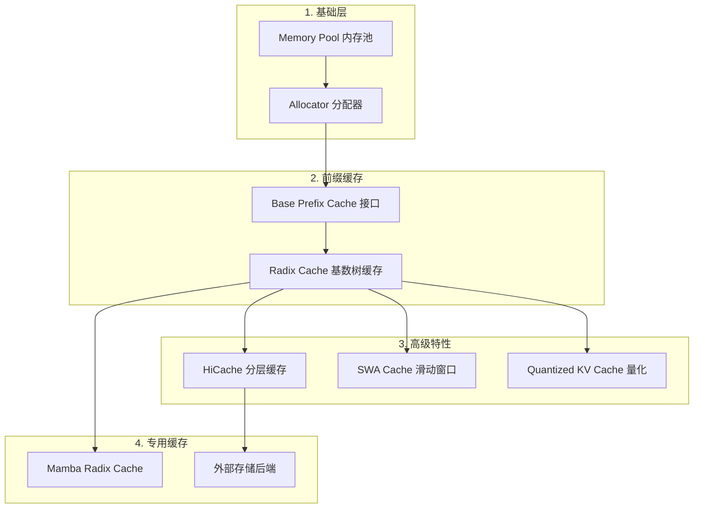

---

## 第一阶段：Memory Pool 基础

### 1.1 核心内存池 (`memory_pool.py`)

> [!TIP]
> 从这里开始，理解 KV cache 数据如何在 GPU 上物理存储。

| 类名 | 用途 |
|------|------|
| `ReqToTokenPool` | 将请求映射到内存中的 token 位置 |
| `KVCache` | Key-Value 缓存存储的抽象基类 |
| `MHAKVCache` | Multi-Head Attention KV 缓存存储 |
| `MLAKVCache` | MLA (DeepSeek 的 Multi-Layer Attention) 压缩存储 |
| `MambaPool` | 状态空间模型缓存 (Mamba 架构) |

**核心概念：**

1. **基于 Token 的索引**：单个 token 如何映射到内存位置
2. **按层存储**：KV cache 按 transformer 层组织
3. **张量形状**：标准 MHA 为 `[num_layers, num_heads, max_tokens, head_dim]`

#### 关键文件：
- [memory_pool.py](file:///Users/wesley/code/sglang/python/sglang/srt/mem_cache/memory_pool.py)

#### 学习要点：
- [ ] 理解 `ReqToTokenPool.__init__()` - 请求槽位如何分配
- [ ] 研究 `MHAKVCache._create_buffers()` - K/V 张量初始化
- [ ] 对比 `MLAKVCache` vs `MHAKVCache` - 存储方式的关键差异

---

### 1.2 内存分配器 (`allocator.py`)

> [!IMPORTANT]
> 分配器管理 KV cache 池中的空闲/已用索引。

| 类名 | 用途 |
|------|------|
| `BaseTokenToKVPoolAllocator` | 分配器抽象接口 |
| `TokenToKVPoolAllocator` | 标准分配器 (page_size=1) |
| `PagedTokenToKVPoolAllocator` | 分页分配，提升内存效率 |
| `SWATokenToKVPoolAllocator` | 滑动窗口注意力专用分配器 |

**核心原理：**

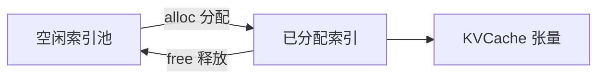

#### 关键文件：
- [allocator.py](file:///Users/wesley/code/sglang/python/sglang/srt/mem_cache/allocator.py)

#### 学习要点：
- [ ] `TokenToKVPoolAllocator.alloc()` - 索引如何分配
- [ ] `TokenToKVPoolAllocator.free()` - 索引如何归还池中
- [ ] 理解 `page_size` 参数及其影响

---

## 第二阶段：Radix Tree 前缀缓存

### 2.1 前缀缓存基类接口 (`base_prefix_cache.py`)

> [!NOTE]
> 这是所有缓存实现必须遵循的抽象接口。

| 方法 | 用途 |
|------|------|
| `match_prefix(key)` | 查找 token 序列前缀的已缓存 KV 数据 |
| `cache_finished_req(req)` | 将已完成请求的 KV cache 插入树中 |
| `cache_unfinished_req(req)` | 处理部分/分块请求的缓存 |
| `evict(num_tokens)` | 移除最不重要的缓存条目 |
| `inc_lock_ref() / dec_lock_ref()` | 缓存条目的引用计数 |

#### 关键文件：
- [base_prefix_cache.py](file:///Users/wesley/code/sglang/python/sglang/srt/mem_cache/base_prefix_cache.py)

#### 学习要点：
- [ ] 理解 `MatchResult` NamedTuple 结构
- [ ] 研究抽象方法签名

---

### 2.2 Radix Cache 核心 (`radix_cache.py`)

> [!IMPORTANT]
> 这是 SGLang 前缀缓存的核心 —— RadixTree 数据结构。

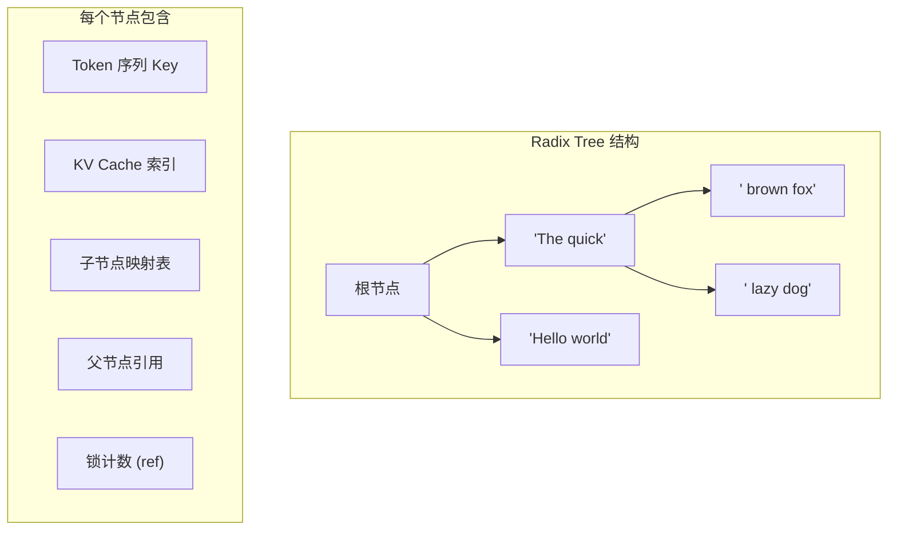

| 类名 | 用途 |
|------|------|
| `RadixKey` | 封装 token 序列，可带额外 key (LoRA, salt) |
| `TreeNode` | Radix 树节点，存储 token 子序列和缓存索引 |
| `RadixCache` | 主缓存类，实现前缀匹配和插入 |

**核心操作：**

1. **前缀匹配** (`match_prefix`)：
   - 从根节点沿匹配的 token 遍历树
   - 返回匹配的 KV 索引用于前缀复用
   - 如果匹配在节点中间结束，则分裂节点

2. **插入** (`insert`)：
   - 查找已存在的前缀匹配
   - 为未匹配的后缀创建新节点
   - 将 KV cache 索引关联到节点

3. **驱逐** (`evict`)：
   - 使用驱逐策略 (LRU, LFU, FIFO 等)
   - 将索引归还给分配器
   - 维护树的一致性

#### 关键文件：
- [radix_cache.py](file:///Users/wesley/code/sglang/python/sglang/srt/mem_cache/radix_cache.py)

#### 学习要点：
- [ ] `TreeNode.__init__()` - 节点结构
- [ ] `RadixCache.match_prefix()` - 核心匹配算法
- [ ] `RadixCache.insert()` - 插入逻辑
- [ ] `RadixCache.evict()` - 不同策略的驱逐实现
- [ ] `_key_match_paged()` - 页对齐匹配

---

### 2.3 公共工具函数 (`common.py`)

缓存操作的辅助函数。

| 函数 | 用途 |
|------|------|
| `alloc_token_slots()` | 分配新的 KV cache 槽位 |
| `alloc_for_extend()` | 为 prefill/extend 批次分配 |
| `alloc_for_decode()` | 为 decode 步骤分配 |
| `release_kv_cache()` | 释放缓存回树/池 |
| `write_cache_indices()` | 将分配的索引写入 req_to_token 池 |

#### 关键文件：
- [common.py](file:///Users/wesley/code/sglang/python/sglang/srt/mem_cache/common.py)

#### 学习要点：
- [ ] `alloc_for_extend()` - 理解 extend 分配流程
- [ ] `release_kv_cache()` - 缓存释放和插入逻辑

---

## 第三阶段：高级缓存特性

### 3.1 分层缓存 - HiCache (`hiradix_cache.py`)

> [!TIP]
> HiCache 扩展 RadixCache，支持 CPU 内存和分布式存储后端。

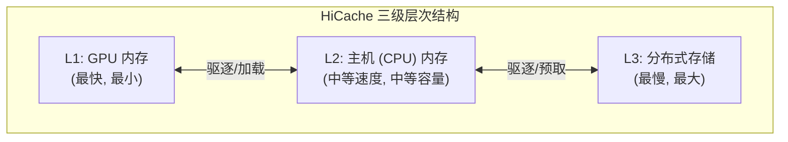

**核心特性：**
1. **三级缓存层次**：GPU → CPU → 分布式存储
2. **预取策略**：`best_effort`, `wait_complete`, `timeout`
3. **写回策略**：`write_through`, `write_through_selective`, `write_back`
4. **多 Rank 同步**：跨 TP workers 的共识机制

#### 关键文件：
- [hiradix_cache.py](file:///Users/wesley/code/sglang/python/sglang/srt/mem_cache/hiradix_cache.py)
- [hicache_storage.py](file:///Users/wesley/code/sglang/python/sglang/srt/mem_cache/hicache_storage.py)
- [memory_pool_host.py](file:///Users/wesley/code/sglang/python/sglang/srt/mem_cache/memory_pool_host.py)

#### 参考文档：
- [HiCache 设计文档](file:///Users/wesley/code/sglang/docs/advanced_features/hicache_design.md)
- [HiCache 最佳实践](file:///Users/wesley/code/sglang/docs/advanced_features/hicache_best_practices.md)

#### 学习要点：
- [ ] `HiRadixCache.__init__()` - 初始化和配置
- [ ] `HiRadixCache.prefetch_from_storage()` - L3 预取逻辑
- [ ] `HiRadixCache.write_backup()` - 写回 L2/L3
- [ ] `HiRadixCache.evict()` - 分层驱逐

---

### 3.2 滑动窗口注意力缓存 (`swa_radix_cache.py`)

用于滑动窗口注意力模型 (如 Mistral)。

**关键区别：**
- 维护两个独立缓存：全注意力层 + SWA 层
- SWA 层只缓存窗口内的最近 token

#### 关键文件：
- [swa_radix_cache.py](file:///Users/wesley/code/sglang/python/sglang/srt/mem_cache/swa_radix_cache.py)

---

### 3.3 量化 KV Cache

通过低精度存储进行内存优化。

| 格式 | 位数 | 描述 |
|------|------|------|
| FP8 E5M2 | 8-bit | 更大动态范围，较低精度 |
| FP8 E4M3 | 8-bit | 更高精度 (推荐) |
| FP4 E2M1 | 4-bit | 最大内存节省 (实验性) |

#### 参考文档：
- [量化 KV Cache 文档](file:///Users/wesley/code/sglang/docs/advanced_features/quantized_kv_cache.md)

#### 关键文件：
- [layers/quantization/kv_cache.py](file:///Users/wesley/code/sglang/python/sglang/srt/layers/quantization/kv_cache.py)

---

## 第四阶段：专用缓存

### 4.1 Mamba Radix Cache (`mamba_radix_cache.py`)

用于包含 Mamba (状态空间) 层的混合模型。

**关键区别：**
- 基于状态的缓存，而非纯 KV 缓存
- 处理 conv states 和 SSM states
- 不同的分支语义 (状态分叉)

#### 关键文件：
- [mamba_radix_cache.py](file:///Users/wesley/code/sglang/python/sglang/srt/mem_cache/mamba_radix_cache.py)

---

### 4.2 外部存储后端

目录：`python/sglang/srt/mem_cache/storage/`

| 后端 | 描述 |
|------|------|
| `mooncake_store` | 高性能 RDMA 分布式缓存 |
| `hf3fs` | DeepSeek 3FS (Kubernetes 原生) |
| `nixl` | NVIDIA 统一存储 API |
| `aibrix_kvcache` | AIBrix 生产级 KV cache 卸载 |
| `lmcache` | LMCache 替代分层缓存方案 |

---

## 第五阶段：特殊场景 - Chunked Prefill + PD 分离 + 多模态

> [!IMPORTANT]
> 当同时启用 Chunked Prefill、PD 分离和多模态时，KV Cache 的处理有显著不同。

### 5.1 Chunked Prefill 对 KV Cache 的影响

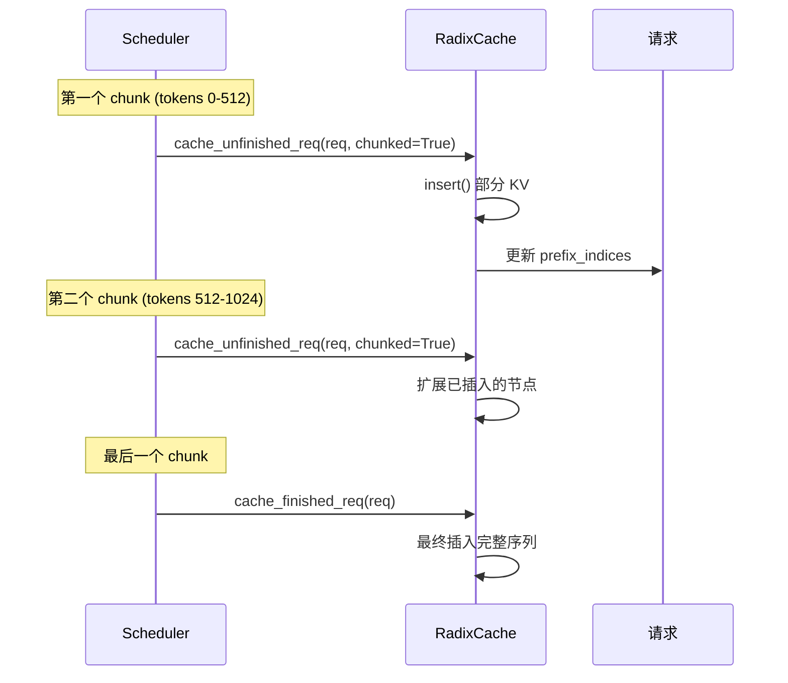

**关键区别：**

| 方面 | 普通 Prefill | Chunked Prefill |
|------|-------------|-----------------|
| 缓存时机 | 请求完成后一次性插入 | 每个 chunk 后增量插入 |
| 核心方法 | `cache_finished_req()` | `cache_unfinished_req(chunked=True)` |
| 状态追踪 | `req.last_node` | `req.prefix_indices` + `req.cache_protected_len` |
| 锁管理 | 简单的 `inc/dec_lock_ref` | 每个 chunk 更新锁引用 |

**代码路径** ([radix_cache.py:475-536](file:///Users/wesley/code/sglang/python/sglang/srt/mem_cache/radix_cache.py#L475-536))：

```python
def cache_unfinished_req(self, req: Req, chunked=False):
    # 1. 插入当前 chunk 的 KV 到树中
    new_prefix_len = self.insert(radix_key, values, chunked=chunked)
    
    # 2. 释放重复的 KV 索引
    self.token_to_kv_pool_allocator.free(
        kv_indices[req.cache_protected_len : new_prefix_len]
    )
    
    # 3. 重新匹配获取最新的 prefix_indices
    match_result = self.match_prefix(radix_key)
    
    # 4. 更新 req 状态供下一个 chunk 使用
    req.prefix_indices = new_indices  # 用于 PrefillAdder::add_chunked_req
    req.cache_protected_len = len(new_indices)
    req.last_node = new_last_node
```

---

### 5.2 多模态对 KV Cache 的影响

> [!NOTE]
> 多模态场景下有两种独立的缓存机制同时工作。

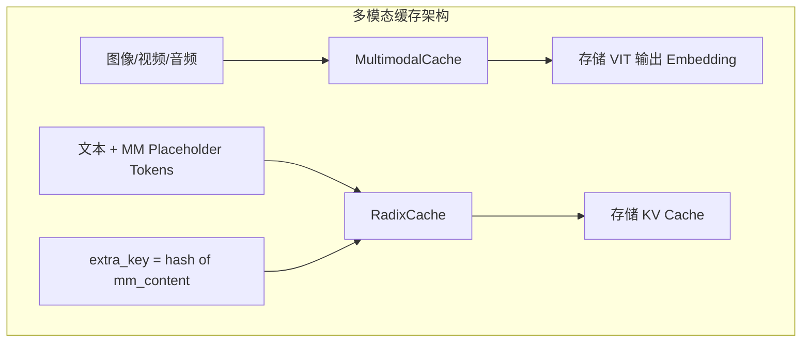

**1. `MultimodalCache` - 多模态 Embedding 缓存**

用于缓存 VIT/Audio Encoder 输出的 embedding，避免重复计算。

```python
# multimodal_cache.py
class MultiModalStaticCache:
    def get(self, mm_hashes: List[int]) -> Optional[torch.Tensor]:
        # 根据 hash 查找已缓存的 embedding
        
    def set(self, mm_hash: int, embedding: torch.Tensor):
        # 缓存 VIT 输出
```

**2. `RadixCache + extra_key` - KV Cache 隔离**

多模态请求通过 `extra_key` 实现缓存隔离：

```python
# Req.__init__() in schedule_batch.py
self.extra_key = extra_key  # 包含 mm_hash

# radix_cache.py - RadixKey 检查 extra_key
radix_key = RadixKey(keys, req.extra_key, is_bigram=self.is_eagle)
```

**为什么需要 `extra_key`？**

| 场景 | token_ids | extra_key | 能否共享 KV? |
|------|-----------|-----------|-------------|
| 相同文本 + 相同图片 | [1,2,3] | "hash_A" | ✅ 可以 |
| 相同文本 + 不同图片 | [1,2,3] | "hash_B" | ❌ 不可以 |
| 不同文本 + 相同图片 | [1,2,4] | "hash_A" | ❌ 不可以 |

---

### 5.3 PD 分离对 KV Cache 的影响

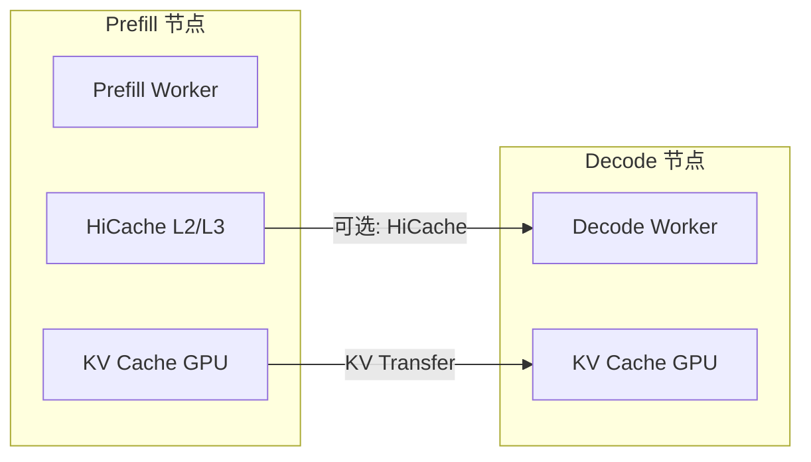

**关键组件：**

| 组件 | 文件 | 用途 |
|------|------|------|
| `DecodeKVCacheOffloadManager` | [decode_kvcache_offload_manager.py](file:///Users/wesley/code/sglang/python/sglang/srt/disaggregation/decode_kvcache_offload_manager.py) | Decode 端接收 KV |
| `BaseKVSender` | disaggregation/base.py | Prefill 端发送 KV |
| `Req.disagg_kv_sender` | schedule_batch.py | 每个请求的 KV 发送器 |

**PD 分离下的 KV 流转：**

1. **Prefill 节点**：完成 prefill 后，通过 `disagg_kv_sender` 发送 KV cache
2. **传输**：使用 RDMA (Mooncake) 或其他高速传输
3. **Decode 节点**：接收 KV 并写入本地 GPU 内存池

---

### 5.4 三者结合时的交互

> [!CAUTION]
> 当 Chunked Prefill + PD 分离 + 多模态同时启用时，需要注意以下交互。

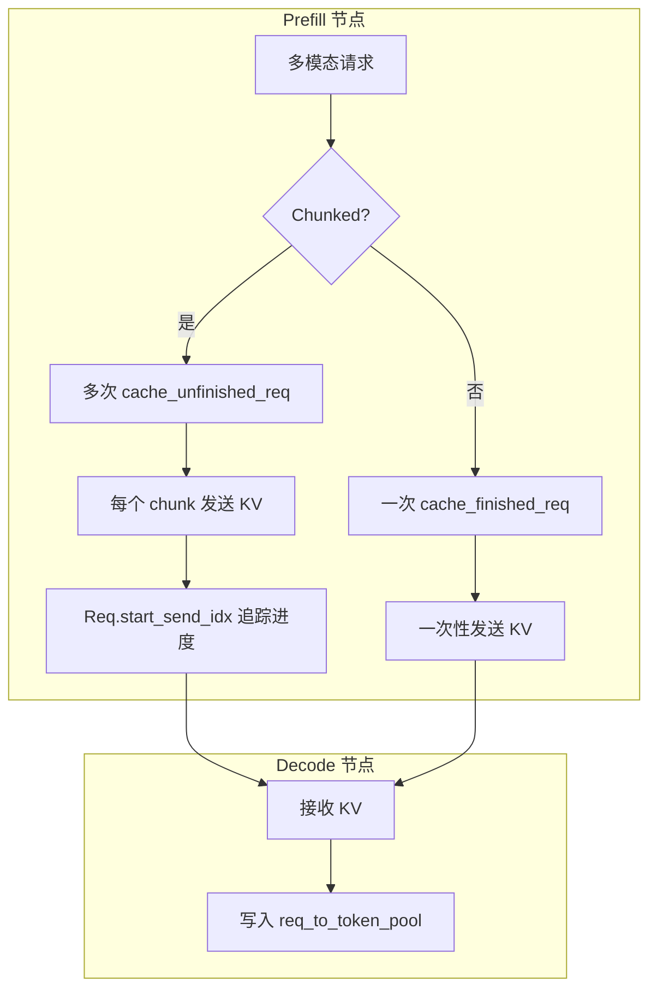

**关键细节：**

1. **Chunk 级 KV 传输**：
   ```python
   # Req 中的追踪字段
   self.start_send_idx: int = 0      # 已发送的 KV 起始位置
   self.tmp_end_idx: int = -1        # 待发送的 KV 结束位置
   ```

2. **多模态 + Chunked 的原子性**：
   - 图像 token 必须在同一个 chunk 内完整处理
   - VIT 计算不会被 chunk 边界打断

3. **Mamba 的特殊处理**：
   - 使用 `mamba_branching_seqlen` 追踪状态分叉点
   - Chunked prefill 时需要维护状态的连续性

#### 关键文件：
- [radix_cache.py#cache_unfinished_req](file:///Users/wesley/code/sglang/python/sglang/srt/mem_cache/radix_cache.py#L475) - Chunked 缓存
- [multimodal_cache.py](file:///Users/wesley/code/sglang/python/sglang/srt/mem_cache/multimodal_cache.py) - MM Embedding 缓存
- [mamba_radix_cache.py](file:///Users/wesley/code/sglang/python/sglang/srt/mem_cache/mamba_radix_cache.py) - Mamba 状态缓存
- [decode_kvcache_offload_manager.py](file:///Users/wesley/code/sglang/python/sglang/srt/disaggregation/decode_kvcache_offload_manager.py) - PD KV 传输

#### 学习要点：
- [ ] 追踪一个 chunked + multimodal 请求的完整 KV cache 生命周期
- [ ] 理解 `extra_key` 如何隔离不同多模态内容的缓存
- [ ] 研究 PD 分离中 KV 传输的时序

---

## 第六阶段：请求生命周期与 KV Cache 状态变化

> [!IMPORTANT]
> 本章节详细描述在 PD 分离 + 多模态 + Chunked Prefill + MambaRadixCache 场景下，请求的完整生命周期。

### 6.1 请求状态机 (RequestStage)

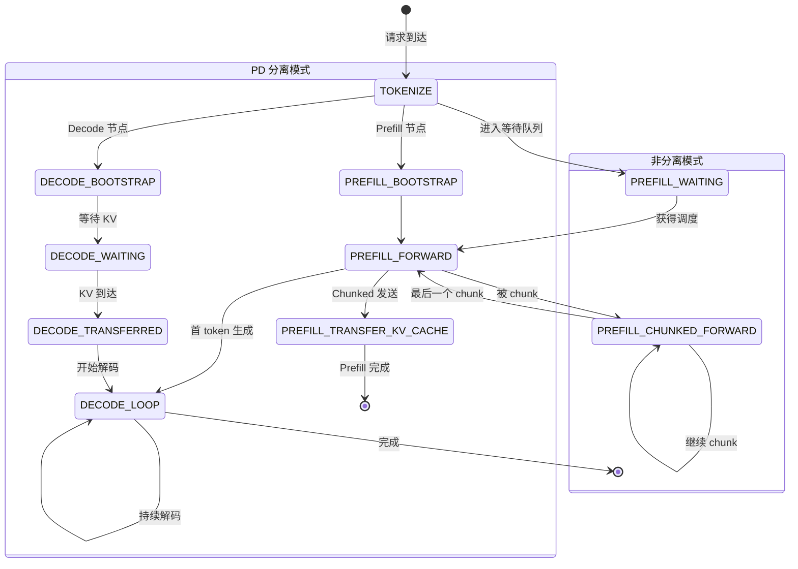

**核心状态定义** ([schedule_batch.py:455-481](file:///Users/wesley/code/sglang/python/sglang/srt/managers/schedule_batch.py#L455-481))：

| 阶段 | 状态 | 描述 |
|------|------|------|
| Tokenizer | `TOKENIZE` | Token 化处理 |
| | `TOKENIZER_DISPATCH` | 分发到调度器 |
| 普通/非分离 | `PREFILL_WAITING` | 在等待队列中 |
| | `PREFILL_FORWARD` | Prefill 前向计算 |
| | `PREFILL_CHUNKED_FORWARD` | Chunked prefill 中间 chunk |
| | `DECODE_LOOP` | 解码循环 |
| PD-Prefill | `PREFILL_BOOTSTRAP` | Prefill 节点初始化 |
| | `PREFILL_TRANSFER_KV_CACHE` | KV 传输中 |
| PD-Decode | `DECODE_BOOTSTRAP` | Decode 节点初始化 |
| | `DECODE_WAITING` | 等待 KV 到达 |
| | `DECODE_TRANSFERRED` | KV 已接收 |

---

### 6.2 单请求 Chunked Prefill 生命周期

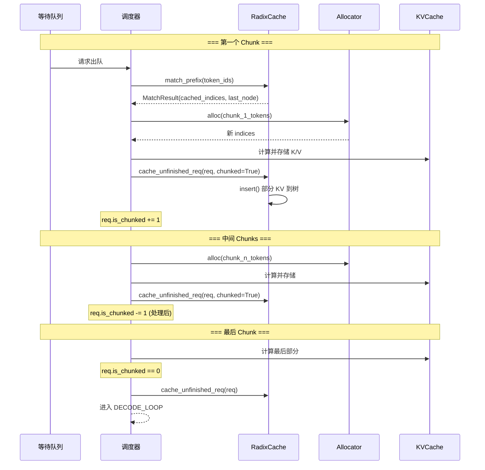

**关键变量追踪：**

| 变量 | 第一个 Chunk | 中间 Chunks | 最后 Chunk | 解码中 |
|------|-------------|-------------|------------|-------|
| `req.is_chunked` | 1 | 2,1,... | 0 | 0 |
| `req.prefix_indices` | [0..512] | [0..1024] | [0..N] | [0..N] |
| `req.cache_protected_len` | 512 | 1024 | N | N |
| `req.last_node` | node_A | node_B | node_C | node_C |
| `req.fill_ids` | 增长 | 增长 | 完整 | +1/step |

---

### 6.3 多并发请求与 KV Cache 争用

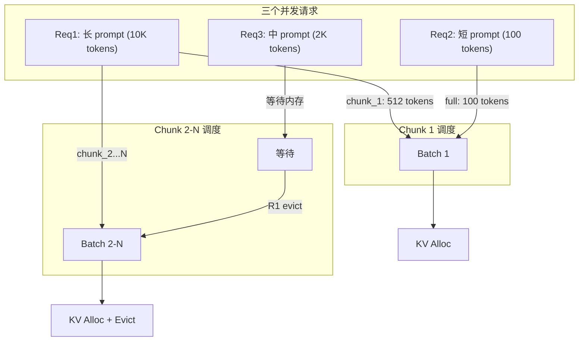

**并发场景的 KV 状态：**

| 时间点 | Req1 状态 | Req2 状态 | Req3 状态 | KV Pool 使用率 |
|--------|----------|----------|----------|---------------|
| t0 | waiting | waiting | waiting | 50% (历史缓存) |
| t1 (chunk1) | prefill_chunked | prefill | waiting | 55% |
| t2 (chunk2) | prefill_chunked | decode | waiting | 60% |
| t3 (evict) | prefill_chunked | decode | prefill | 58% (驱逐后) |
| t4 (finish) | decode | decode | decode | 70% |

---

### 6.4 MambaRadixCache 双锁机制

> [!NOTE]
> Mamba 模型有状态空间层，需要独立于 KV cache 的状态管理。

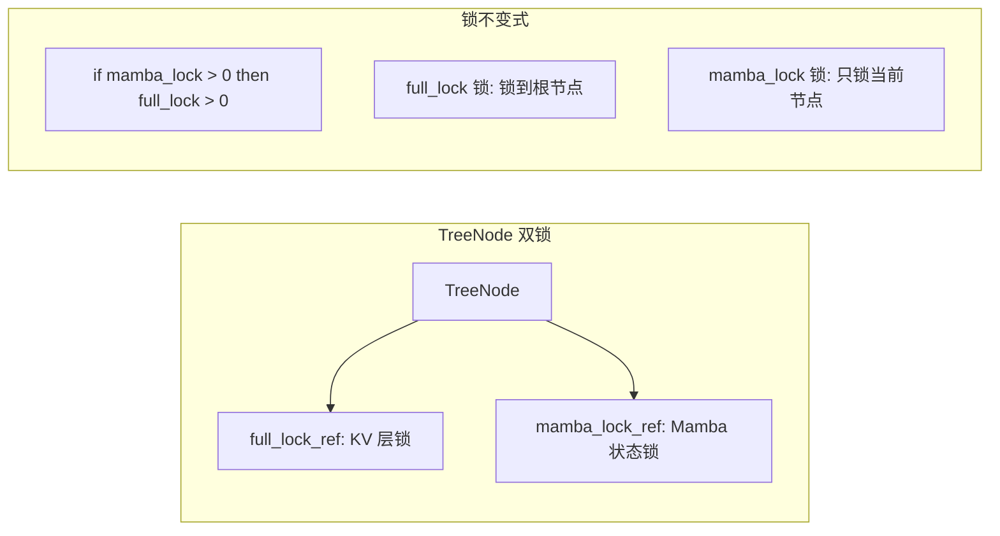

**MambaRadixCache 特殊字段：**

| Req 字段 | 用途 |
|----------|------|
| `mamba_pool_idx` | Mamba 状态在 MambaPool 中的索引 |
| `mamba_ping_pong_track_buffer` | 双缓冲追踪 (shape: 2) |
| `mamba_next_track_idx` | 当前使用的缓冲索引 (0 或 1) |
| `mamba_last_track_seqlen` | 上次保存状态时的序列长度 |
| `mamba_branching_seqlen` | 状态分叉点的序列长度 |

**Mamba 状态写回时机：**

```python
# 每 mamba_track_interval 个 token 更新一次
if seq_len % mamba_track_interval == 0:
    req.mamba_next_track_idx = 1 - req.mamba_next_track_idx  # 切换缓冲
    req.mamba_last_track_seqlen = seq_len
```

---

### 6.5 PD 分离 + 多模态 + Chunked 完整流程

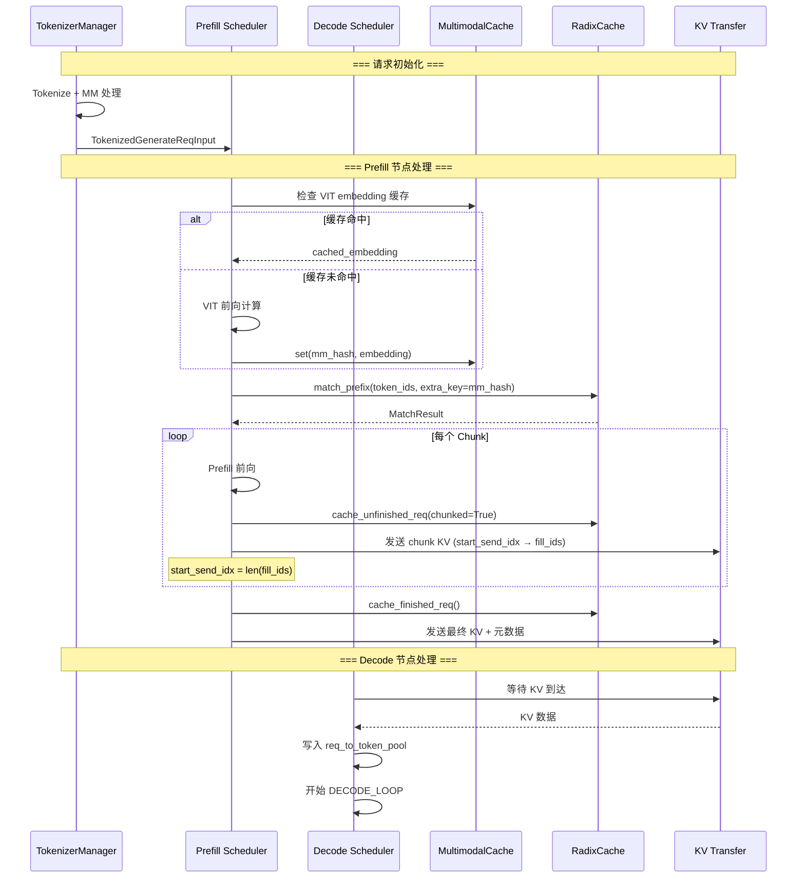

**关键追踪字段：**

```python
class Req:
    # KV 传输追踪 (PD 分离)
    start_send_idx: int = 0      # 已发送的起始位置
    tmp_end_idx: int = -1        # 待发送的结束位置
    
    # 分离相关
    bootstrap_host: str          # Decode 节点地址
    bootstrap_port: int
    disagg_kv_sender: BaseKVSender  # KV 发送器
    
    # 多模态
    extra_key: str               # mm_hash 用于缓存隔离
    multimodal_inputs: MultimodalInputs
```

---

### 6.6 请求生命周期总结表

| 阶段 | Req 状态 | KV Allocator | RadixCache | MambaPool | 多模态 |
|------|----------|--------------|------------|-----------|-------|
| **入队** | waiting | - | match_prefix() | - | VIT 计算 + 缓存 |
| **Chunk 1** | prefill_chunked | alloc(512) | cache_unfinished() | COW 分叉 | embedding 注入 |
| **Chunk 2-N** | prefill_chunked | alloc(chunk_size) | cache_unfinished() | 状态更新 | - |
| **最后 Chunk** | prefill → decode | finalize | cache_finished() | ping-pong 切换 | - |
| **Decode** | decode | alloc(1)/step | - | 每 interval 写回 | - |
| **完成** | finished | free(all) | insert 到树 | free(状态) | - |
| **驱逐** | - | free(evicted) | evict() | evict_mamba() | - |

---

## 推荐学习顺序

### 第一周：基础
1. 阅读 `memory_pool.py` - 理解 `ReqToTokenPool` 和 `MHAKVCache`
2. 阅读 `allocator.py` - 理解分配/释放
3. 编写简单测试脚本来分配和释放索引

### 第二周：Radix Tree
1. 阅读 `base_prefix_cache.py` - 理解接口
2. 阅读 `radix_cache.py` - 重点关注 `TreeNode`, `match_prefix`, `insert`
3. 研究 `common.py` - 分配辅助函数
4. 调试一个简单的前缀匹配操作

### 第三周：实际集成
1. 研究 `cache_controller.py` - 缓存如何与调度器交互
2. 追踪请求流程：分配 → prefill → 插入 → 驱逐
3. 阅读 `evict_policy.py` 中的驱逐策略

### 第四周：高级主题
1. 研究 `hiradix_cache.py` - 分层缓存
2. 阅读 HiCache 设计文档
3. 如果关注内存优化，探索量化 KV cache
4. 如果使用 SWA 模型，研究 `swa_radix_cache.py`

---

## 核心架构洞察

### 内存流转

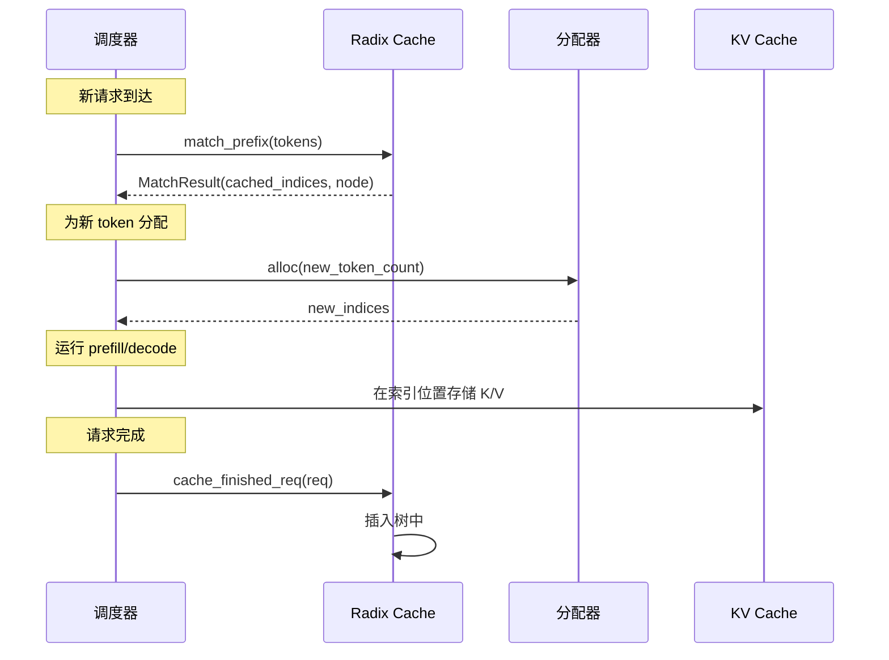

### 设计原则

1. **关注点分离**
   - `KVCache`：物理存储 (张量)
   - `Allocator`：索引管理 (空闲/已用)
   - `RadixCache`：逻辑组织 (前缀树)

2. **基于页的粒度**
   - `page_size` 控制最小分配单元
   - 较大的页：更好的 I/O，较低的命中率
   - 较小的页：更精细的共享，更多元数据

3. **引用计数**
   - 节点有 `lock_ref` 计数
   - 只驱逐 `lock_ref == 0` 的节点
   - 防止驱逐正在使用的缓存

4. **驱逐策略**
   - LRU (最近最少使用) - 默认
   - LFU (最不经常使用)
   - MRU (最近最多使用)
   - FIFO/FILO

---

## 调试技巧

### 有用的调试点

1. **缓存命中率**：
   ```python
   # 在 RadixCache.match_prefix() 中
   print(f"匹配了 {len(indices)} 个 token, 新 token: {len(key) - len(indices)}")
   ```

2. **分配追踪**：
   ```python
   # 在 allocator 中
   print(f"可用: {allocator.available_size()} / {allocator.size}")
   ```

3. **树可视化**：
   ```python
   cache.pretty_print()  # 内置树可视化
   ```

### 常见问题

| 问题 | 可能原因 | 检查点 |
|------|----------|--------|
| Prefill 时 OOM | 驱逐不足 | `evictable_size()` |
| 缓存命中率低 | page_size 不匹配 | 尝试较小的 `page_size` |
| 预取慢 | L3 后端延迟 | 检查 `prefetch_timeout_*` |

---

## 相关资源

### 文档
- [HiCache 设计文档](file:///Users/wesley/code/sglang/docs/advanced_features/hicache_design.md)
- [HiCache 最佳实践](file:///Users/wesley/code/sglang/docs/advanced_features/hicache_best_practices.md)
- [量化 KV Cache](file:///Users/wesley/code/sglang/docs/advanced_features/quantized_kv_cache.md)

### 测试
- `test/srt/test_radix_cache.py` - Radix cache 单元测试
- `test/manual/hicache/` - HiCache 集成测试

### 博客
- [SGLang HiCache 博客](https://lmsys.org/blog/2025-09-10-sglang-hicache/)
