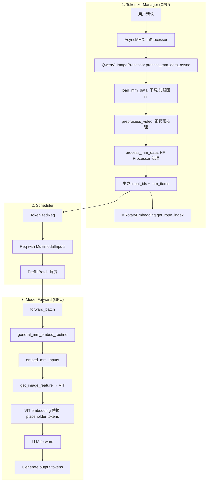

# Qwen3-VL 多模态处理深度解析

本文档详细解析 SGLang 中 Qwen3-VL 多模态模型的完整请求生命周期。

---

## 1. 整体架构概览

### 1.1 请求生命周期



### 1.2 关键组件

| 组件 | 文件 | 职责 |
|------|------|------|
| `AsyncMMDataProcessor` | [async_mm_data_processor.py](file:///Users/wesley/code/sglang/python/sglang/srt/managers/async_mm_data_processor.py) | 异步包装器，处理多模态数据 |
| `QwenVLImageProcessor` | [qwen_vl.py](file:///Users/wesley/code/sglang/python/sglang/srt/multimodal/processors/qwen_vl.py) | Qwen-VL 专用处理器 |
| `BaseMultimodalProcessor` | [base_processor.py](file:///Users/wesley/code/sglang/python/sglang/srt/multimodal/processors/base_processor.py) | 多模态处理基类 |
| `Qwen3VLMoeVisionModel` | [qwen3_vl.py](file:///Users/wesley/code/sglang/python/sglang/srt/models/qwen3_vl.py) | VIT 视觉编码器 |
| `general_mm_embed_routine` | [mm_utils.py](file:///Users/wesley/code/sglang/python/sglang/srt/managers/mm_utils.py) | 多模态嵌入主入口 |
| `MultiModalStaticCache` | [multimodal_cache.py](file:///Users/wesley/code/sglang/python/sglang/srt/mem_cache/multimodal_cache.py) | VIT embedding 缓存 |

---

## 2. 阶段 1: 图片下载与预处理

### 2.1 图片加载流程

```python
# file: base_processor.py (L381-416)

@staticmethod
def _load_single_item(data, modality: Modality, ...):
    """加载单个多模态数据"""
    # 如果是预计算的 embedding，直接返回
    if isinstance(data, dict):
        if data.get("format") in ("processor_output", "precomputed_embedding"):
            return data
    
    # 加载图片/视频/音频
    if modality == Modality.IMAGE:
        img, _ = load_image(data)  # 下载 URL / 解码 base64 / 读取文件
        if discard_alpha_channel and img.mode != "RGB":
            img = img.convert("RGB")
        return img
    elif modality == Modality.VIDEO:
        return load_video(data, frame_count_limit)
    elif modality == Modality.AUDIO:
        return load_audio(data, audio_sample_rate)
```

### 2.2 图片智能缩放

```python
# file: qwen_vl.py (L49-79)

def smart_resize(height, width, factor=28, min_pixels, max_pixels):
    """智能缩放图片，满足以下条件：
    1. 高度和宽度都能被 factor (28) 整除
    2. 总像素数在 [min_pixels, max_pixels] 范围内
    3. 尽可能保持原始宽高比
    """
    # 检查宽高比
    if max(height, width) / min(height, width) > MAX_RATIO:
        raise ValueError(...)
    
    h_bar = round_by_factor(height, factor)
    w_bar = round_by_factor(width, factor)
    
    if h_bar * w_bar > max_pixels:
        # 缩小
        beta = math.sqrt((height * width) / max_pixels)
        h_bar = floor_by_factor(height / beta, factor)
        w_bar = floor_by_factor(width / beta, factor)
    elif h_bar * w_bar < min_pixels:
        # 放大
        beta = math.sqrt(min_pixels / (height * width))
        h_bar = ceil_by_factor(height * beta, factor)
        w_bar = ceil_by_factor(width * beta, factor)
    
    return h_bar, w_bar
```

### 2.3 关键常量

```python
# file: qwen_vl.py

IMAGE_FACTOR = 28              # 图片尺寸必须是 28 的倍数
MIN_PIXELS = 4 * 28 * 28       # 最小像素数 = 3136
MAX_PIXELS = 环境变量配置       # SGLANG_IMAGE_MAX_PIXELS
FRAME_FACTOR = 2               # 视频帧数必须是 2 的倍数
FPS = 2.0                      # 视频采样帧率
```

---

## 3. 阶段 2: Tokenization 与 Token ID 计算

### 3.1 Token ID 生成流程

```python
# file: qwen_vl.py (L299-417)

async def process_mm_data_async(self, image_data, input_text, request_obj, ...):
    # Step 1: 加载多模态数据
    base_output = self.load_mm_data(
        prompt=input_text,
        image_data=image_data,
        video_data=request_obj.video_data,
        multimodal_tokens=self.mm_tokens,  # 特殊 token 定义
    )
    
    # Step 2: 视频预处理（如果有）
    if base_output.videos:
        videos_processed = [
            await preprocess_video(video, video_config=self.video_config)
            for video in base_output.videos
        ]
        base_output.videos, video_metadata = map(list, zip(*videos_processed))
    
    # Step 3: 调用 HuggingFace Processor
    mm_items, input_ids, ret = self.process_and_combine_mm_data(
        base_output, self.mm_tokens
    )
    
    # Step 4: 计算 M-RoPE 位置编码
    mrope_positions, mrope_position_delta = MRotaryEmbedding.get_rope_index(
        spatial_merge_size=self.hf_config.vision_config.spatial_merge_size,
        image_token_id=self.mm_tokens.image_token_id,
        video_token_id=self.mm_tokens.video_token_id,
        input_ids=input_ids.unsqueeze(0),
        image_grid_thw=ret.image_grid_thw,
        video_grid_thw=ret.video_grid_thw,
        ...
    )
    
    # Step 5: 返回结果
    return {
        "input_ids": input_ids.tolist(),
        "mm_items": mm_items,
        "mrope_positions": mrope_positions,
        ...
    }
```

### 3.2 特殊 Token 定义

```python
# file: base_processor.py (L65-80)

@dataclass
class MultimodalSpecialTokens:
    image_token: Optional[str] = None      # "<|image_pad|>"
    video_token: Optional[str] = None      # "<|video_pad|>"
    audio_token: Optional[str] = None      # "<|audio_pad|>"
    
    image_token_id: Optional[int] = None   # 对应的 token ID
    video_token_id: Optional[int] = None
    audio_token_id: Optional[int] = None
```

### 3.3 Token 序列示例

```
原始输入: "描述这张图片 <|image|>"
            ↓
tokenization 后: [token_ids..., <image_start>, <image_pad>*N, <image_end>, ...]
                                      ↑
                                N = 图片 patch 数量
```

---

## 4. 阶段 3: VIT 视觉编码

### 4.1 VIT 架构

```python
# file: qwen3_vl.py (L270-355)

class Qwen3VLMoeVisionModel(nn.Module):
    def __init__(self, vision_config, ...):
        # Patch Embedding: 将图片分割成 patch 并嵌入
        self.patch_embed = Qwen3VLVisionPatchEmbed(config=vision_config)
        
        # 位置编码
        self.pos_embed = nn.Embedding(self.num_position_embeddings, self.hidden_size)
        
        # Transformer Blocks
        self.blocks = nn.ModuleList([
            Qwen3_VisionBlock(...)
            for layer_idx in range(vision_config.depth)
        ])
        
        # Patch Merger: 合并相邻 patch
        self.merger = Qwen3VLMoeVisionPatchMerger(
            spatial_merge_size=self.spatial_merge_size,  # 通常为 2
            ...
        )
        
        # DeepStack: 额外的特征融合
        self.deepstack_merger_list = nn.ModuleList([...])
```

### 4.2 VIT Forward 流程

```python
# file: qwen3_vl.py (L410-459)

def forward(self, x: torch.Tensor, grid_thw: torch.Tensor):
    # Step 1: Patch Embedding
    x = self.patch_embed(x)  # [num_patches, hidden_size]
    
    # Step 2: 添加位置编码
    pos_embeds = self.fast_pos_embed_interpolate(grid_thw)
    x += pos_embeds
    
    # Step 3: 计算 Rotary Position Embedding
    rotary_pos_emb_cos, rotary_pos_emb_sin = self.rot_pos_emb(grid_thw_list)
    
    # Step 4: 计算 cu_seqlens (用于 Flash Attention)
    cu_seqlens = compute_cu_seqlens_from_grid_numpy(grid_thw)
    
    # Step 5: Transformer Blocks + DeepStack
    deepstack_feature_lists = []
    for layer_num, blk in enumerate(self.blocks):
        x = blk(x, cu_seqlens=cu_seqlens, ...)
        
        # 收集 DeepStack 特征
        if layer_num in self.deepstack_visual_indexes:
            deepstack_feature = self.deepstack_merger_list[...](x)
            deepstack_feature_lists.append(deepstack_feature)
    
    # Step 6: 最终合并
    x = self.merger(x)  # Patch 合并
    hidden_states = torch.cat([x] + deepstack_feature_lists, dim=1)
    
    return hidden_states  # [seq_len, hidden_size * (1 + num_deepstack)]
```

### 4.3 多图分块处理

当处理多张图片时，VIT 可以分块处理以节省内存：

```python
# file: qwen3_vl.py (L712-814)

def get_image_feature(self, items: List[MultimodalDataItem]) -> torch.Tensor:
    pixel_values = torch.cat([item.feature for item in items], dim=0)
    image_grid_thw = torch.concat([item.image_grid_thw for item in items], dim=0)
    
    # 读取环境变量控制分块
    max_patches_per_call = get_int_env_var("SGLANG_VLM_MAX_PATCHES_PER_VIT", 0)
    max_images_per_call = get_int_env_var("SGLANG_VLM_MAX_IMAGES_PER_VIT", 0)
    
    if max_patches_per_call == 0 and max_images_per_call == 0:
        # 不分块，一次处理所有图片
        return self.visual(pixel_values, grid_thw=image_grid_thw)
    
    # 分块处理
    all_chunk_embeds = []
    img_start = 0
    
    while img_start < num_images:
        # 计算当前 chunk 可以包含多少图片
        img_end = img_start
        while img_end < num_images:
            next_patches = patches_per_image[img_end]
            if patches_in_chunk + next_patches > max_patches_per_call:
                break
            if images_in_chunk + 1 > max_images_per_call:
                break
            img_end += 1
        
        # 处理当前 chunk
        pixel_chunk = pixel_values[patch_start:patch_end]
        chunk_embeds = self.visual(pixel_chunk, grid_thw=grid_chunk)
        all_chunk_embeds.append(chunk_embeds)
        
        img_start = img_end
    
    return torch.cat(all_chunk_embeds, dim=0)
```

---

## 5. 阶段 4: Embedding 替换与 LLM 处理

### 5.1 general_mm_embed_routine

这是多模态处理的主入口函数：

```python
# file: mm_utils.py (L1018-1098)

def general_mm_embed_routine(
    input_ids: torch.Tensor,
    forward_batch: ForwardBatch,
    language_model: nn.Module,
    multimodal_model: nn.Module,
    ...
) -> torch.Tensor:
    
    embed_tokens = language_model.get_input_embeddings()
    
    if (not forward_batch.forward_mode.is_decode() 
        and forward_batch.contains_mm_inputs()):
        
        # 获取多模态 embedding
        input_embeds, other_info = embed_mm_inputs(
            mm_inputs_list=mm_inputs_list,
            extend_prefix_lens=extend_prefix_lens,
            extend_seq_lens=extend_seq_lens,
            input_ids=input_ids,
            multimodal_model=multimodal_model,
            input_embedding=embed_tokens,
            ...
        )
    else:
        # 纯文本情况
        input_embeds = embed_tokens(input_ids)
    
    # LLM forward
    hidden_states = language_model(
        input_ids=None,
        forward_batch=forward_batch,
        input_embeds=input_embeds,
        ...
    )
    return hidden_states
```

### 5.2 embed_mm_inputs: 多模态嵌入替换

```python
# file: mm_utils.py (L880-1015)

def embed_mm_inputs(
    mm_inputs_list, extend_prefix_lens, extend_seq_lens,
    input_ids, input_embedding, multimodal_model, ...
):
    # 1. 按模态分组处理
    for modality in Modality.all():
        items = [item for item in item_flatten_list if item.is_modality(modality)]
        
        # 获取对应的 embedding 函数
        embedder = getattr(multimodal_model, f"get_{modality_id}_feature", None)
        
        if len(items) != 0:
            # 获取 embedding 和 mask
            embedding, mask = get_embedding_and_mask(
                data_embedding_func=embedder,
                embedding_items=items,
                ...
            )
            embeddings.append(embedding)
            masks.append(mask)
    
    # 2. 获取文本 embedding
    input_ids.clamp_(min=0, max=vocab_size - 1)
    input_embeds = input_embedding(input_ids)
    
    # 3. 将多模态 embedding 替换到对应位置
    for modality, embedding, mask in zip(modalities, embeddings, masks):
        if embedding is None or mask is None:
            continue
        indices = torch.where(mask.squeeze(dim=-1))[0]
        input_embeds[indices] = embedding.to(input_embeds.device, input_embeds.dtype)
    
    return input_embeds, other_info
```

---

## 6. Chunked Prefill 与多模态

### 6.1 核心问题

当启用 Chunked Prefill 时，一个长请求会被分成多个 chunk 处理。对于多模态请求：
- **问题 1**：如何避免每个 chunk 都重复计算 VIT embedding？
- **问题 2**：如何正确切分多模态 embedding？

### 6.2 解决方案：Embedding 缓存

```python
# file: mm_utils.py (L700-787)

def _get_chunked_prefill_embedding_for_chunked_items(
    data_embedding_func,
    embedding_items,
    items_size,
    prefix_length,
    extend_length,
    items_offset_list,
):
    """多模态 embedding 的分块 prefill 处理"""
    
    for i in range(num_requests):
        # 1) 选择与当前 chunk 相关的多模态 items
        embedding_items_per_chunk = get_embedding_items_per_chunk_with_extra_padding(
            embedding_items_per_req,
            extend_prefix_len=prefix_length[i],
            extend_seq_len=extend_length[i],
            items_offset=items_offset,
        )
        
        # 2) 构建缓存 key
        item_hashes = [item.hash for item in embedding_items_per_chunk]
        embedding_items_hash = MultiModalStaticCache.combine_hashes(item_hashes)
        
        # 3) 尝试从缓存获取
        embedding_per_chunk = embedding_cache.get(embedding_items_hash)
        
        if embedding_per_chunk is None:
            # 缓存未命中：调用 VIT 计算
            embedding_per_chunk = data_embedding_func(embedding_items_per_chunk)
            
            # 存入缓存
            embedding_for_cache = embedding_per_chunk.detach().cpu()
            embedding_cache.set(embedding_items_hash, embedding_for_cache)
        else:
            # 缓存命中：直接使用
            embedding_per_chunk = embedding_per_chunk.to(target_device)
        
        embedding_list.append(embedding_per_chunk)
    
    return torch.cat(embedding_list, dim=0)
```

### 6.3 MultiModalStaticCache

```python
# file: multimodal_cache.py (L70-134)

class MultiModalStaticCache(MultimodalCache):
    """服务器级别的多模态 embedding 缓存（LRU 策略）"""
    
    def __init__(self, max_size: int):
        self.max_size = max_size
        self.mm_cache: OrderedDict[int, torch.Tensor] = OrderedDict()
        self.current_size = 0
    
    def get(self, mm_hashes: List[int], ...):
        combined_hash = self.combine_hashes(mm_hashes)
        embedding = self.mm_cache.get(combined_hash)
        if embedding is not None:
            self.mm_cache.move_to_end(combined_hash)  # LRU 更新
        return embedding
    
    def set(self, mm_hash: int, embedding: torch.Tensor, ...):
        data_size = embedding.element_size() * embedding.numel()
        
        # 驱逐旧条目直到有足够空间
        while self.current_size + data_size > self.max_size:
            if not self.mm_cache:
                return False  # 缓存满且无法驱逐
            lru_hash, lru_embedding = self.mm_cache.popitem(last=False)
            self.current_size -= _get_tensor_size(lru_embedding)
        
        self.mm_cache[mm_hash] = embedding
        self.current_size += data_size
        return True
```

### 6.4 Chunk 与 Embedding 的关系图

```
原始请求: [文本 tokens] [] [图片 placeholder tokens] [</img>] [文本 tokens]
          |---- 100 ----| 1 |-------- 256 --------| 1  |---- 50 ----|

假设 chunk_size = 200:

Chunk 1: [文本 tokens 100] [] [图片 placeholder 前 98 个]
         ↓
         需要计算完整图片的 VIT embedding（256 个向量）
         但只使用前 98 个
         ↓
         缓存完整的 embedding

Chunk 2: [图片 placeholder 后 158 个] [</img>] [文本 tokens 41]
         ↓
         从缓存获取完整 embedding
         使用第 98-256 个向量
```

---

## 7. 缓存机制总结

### 7.1 缓存类型对照表

| 缓存类型 | 缓存内容 | 存储位置 | 作用域 |
|---------|---------|---------|-------|
| `MultiModalStaticCache` | VIT embedding | CPU | 服务器级别 |
| `TreeCache` (RadixCache) | KV Cache tokens | GPU | 服务器级别 |
| Feature Buffer | 临时特征传输 | GPU | 请求级别 |

### 7.2 环境变量配置

```bash
# VIT 分块处理
SGLANG_VLM_MAX_PATCHES_PER_VIT=10000   # 每次 VIT 调用最大 patch 数
SGLANG_VLM_MAX_IMAGES_PER_VIT=10       # 每次 VIT 调用最大图片数

# Embedding 缓存
SGLANG_VLM_CACHE_SIZE_MB=1024          # 多模态 embedding 缓存大小 (MB)

# 图片处理
SGLANG_IMAGE_MAX_PIXELS=3145728        # 单张图片最大像素数
SGLANG_RESIZE_RESAMPLE="BILINEAR"      # 图片缩放插值方法

# 特征缓冲区
SGLANG_MM_BUFFER_SIZE_MB=256           # GPU 特征缓冲区大小 (MB)
```

---

## 8. 关键代码位置索引

| 功能 | 文件 | 函数/类 | 行号 |
|------|------|---------|------|
| 图片加载 | [base_processor.py](file:///Users/wesley/code/sglang/python/sglang/srt/multimodal/processors/base_processor.py) | `_load_single_item()` | L381-416 |
| 图片智能缩放 | [qwen_vl.py](file:///Users/wesley/code/sglang/python/sglang/srt/multimodal/processors/qwen_vl.py) | `smart_resize()` | L49-79 |
| 多模态处理入口 | [qwen_vl.py](file:///Users/wesley/code/sglang/python/sglang/srt/multimodal/processors/qwen_vl.py) | `process_mm_data_async()` | L299-417 |
| VIT 模型 | [qwen3_vl.py](file:///Users/wesley/code/sglang/python/sglang/srt/models/qwen3_vl.py) | `Qwen3VLMoeVisionModel` | L270-527 |
| VIT 分块处理 | [qwen3_vl.py](file:///Users/wesley/code/sglang/python/sglang/srt/models/qwen3_vl.py) | `get_image_feature()` | L712-814 |
| 模型 forward | [qwen3_vl.py](file:///Users/wesley/code/sglang/python/sglang/srt/models/qwen3_vl.py) | `forward()` | L842-896 |
| 多模态嵌入主入口 | [mm_utils.py](file:///Users/wesley/code/sglang/python/sglang/srt/managers/mm_utils.py) | `general_mm_embed_routine()` | L1018-1098 |
| Embedding 替换 | [mm_utils.py](file:///Users/wesley/code/sglang/python/sglang/srt/managers/mm_utils.py) | `embed_mm_inputs()` | L880-1015 |
| Chunk Prefill embedding | [mm_utils.py](file:///Users/wesley/code/sglang/python/sglang/srt/managers/mm_utils.py) | `_get_chunked_prefill_embedding_for_chunked_items()` | L700-787 |
| Embedding 缓存 | [multimodal_cache.py](file:///Users/wesley/code/sglang/python/sglang/srt/mem_cache/multimodal_cache.py) | `MultiModalStaticCache` | L70-134 |

---

## 9. 调试技巧

### 9.1 开启 Debug 日志

```python
# 在 qwen_vl.py process_mm_data_async 末尾有性能日志
logger.debug(
    f"[QwenVLProcessor Perf] {rid=}, "
    f"load_time: {(load_time - entry_time) * 1000:.2f} ms, "
    f"preprocess_time: {(preprocess_time - load_time) * 1000:.2f} ms, "
    f"process_time: {(process_time - preprocess_time) * 1000:.2f} ms, "
    f"total_time: {(get_rope_index_time - entry_time) * 1000:.2f} ms"
)
```

设置日志级别：
```bash
export SGLANG_LOGGING_LEVEL=DEBUG
```

### 9.2 打印中间状态

```python
# 在 scheduler.py 中添加
if req.multimodal_inputs:
    logger.info(
        f"MM Request: rid={req.rid}, "
        f"mm_items={len(req.multimodal_inputs.mm_items)}, "
        f"extend_input_len={req.extend_input_len}"
    )

# 在 mm_utils.py embed_mm_inputs 中添加
logger.info(
    f"embed_mm_inputs: modality={modality.name}, "
    f"num_items={len(items)}, "
    f"embedding_shape={embedding.shape if embedding is not None else None}"
)
```

### 9.3 检查点建议

1. **图片加载后**：检查 `base_output.images` 的内容和尺寸
2. **HF Processor 后**：检查 `ret` 的 `pixel_values` 和 `image_grid_thw`
3. **VIT 输出后**：检查 `embedding` 的形状是否与 placeholder token 数量匹配
4. **Embedding 替换后**：验证 `input_embeds` 中多模态位置的值

### 9.4 常见问题排查

| 问题 | 可能原因 | 排查方法 |
|------|---------|---------|
| OOM | 图片太大或太多 | 调整 `SGLANG_VLM_MAX_PATCHES_PER_VIT` |
| Embedding 长度不匹配 | Token 计算错误 | 检查 `image_grid_thw` 和 `spatial_merge_size` |
| 缓存不生效 | Hash 不一致 | 检查 `item.hash` 计算逻辑 |
| 位置编码错误 | M-RoPE 参数错误 | 验证 `mrope_positions.shape` |

---

## 10. 练习题

1. **阅读代码**：找到 `MRotaryEmbedding.get_rope_index()` 的实现，理解 M-RoPE 是如何为图片 tokens 生成 3D 位置编码的。

2. **思考题**：为什么 Qwen3-VL 使用 `spatial_merge_size=2` 来合并 patches？这对 token 数量有什么影响？

3. **实验题**：修改 `SGLANG_VLM_MAX_IMAGES_PER_VIT` 为不同值，观察内存使用和处理时间的变化。

---

## 11. 深入问答：KV Cache 与多模态存储

### 11.1 图片 tokens 在 KV Cache 中如何存储？

**多模态 tokens 在 KV cache 中是按 token 级别存储的，与普通文本 token 完全相同。**

```
原始请求: [文本 tokens] [] [图片 placeholder tokens 512个] [</img>] [文本 tokens]
                              ↓
KV Cache存储 (RadixCache):
┌─────────────────────────────────────────────────────────────────┐
│ 每个 token (包括图片的 512 个 placeholder tokens) 对应一个 KV slot │
│                                                                 │
│ TreeNode 1: [文本 tokens 0-100]  → value: kv_indices[0:100]      │
│ TreeNode 2: [, placeholder 0-255] → value: kv_indices[101:357] │
│ TreeNode 3: [placeholder 256-511, </img>] → value: kv_indices[357:614] │
└─────────────────────────────────────────────────────────────────┘
```

关键代码：

```python
# file: radix_cache.py (L444-453)

def cache_finished_req(self, req: Req, is_insert: bool = True):
    # token_ids 包含了所有 token，包括图片 placeholder tokens
    token_ids = (req.origin_input_ids + req.output_ids)[:kv_committed_len]
    
    # kv_indices 对应每个 token 的 KV cache slot
    kv_indices = self.req_to_token_pool.req_to_token[
        req.req_pool_idx, : len(token_ids)
    ]
    
    # 用 fill_ids 作为 RadixKey 存入 tree
    keys = req.fill_ids  # 包含图片 placeholder token IDs
    radix_key = RadixKey(keys, req.extra_key, ...)
```

### 11.2 两层 Cache 的区别

| 层面 | 缓存类型 | Key | 命中条件 |
|------|---------|-----|---------|
| VIT Embedding | `MultiModalStaticCache` | 图片像素的 hash | 相同图片内容 → 完全命中 |
| KV Cache | `RadixCache` | token 序列 | 相同 token 前缀 → 前缀命中 |

**关键区别**：
- VIT embedding cache 是按**内容**索引的（相同图片 = 相同 hash）
- KV cache (RadixCache) 是按 **token 序列** 索引的（相同前缀 = 命中）

```python
# VIT Embedding Cache (按图片内容 hash)
# file: mm_utils.py (L747-760)

item_hashes = [item.hash for item in embedding_items_per_chunk]
embedding_items_hash = MultiModalStaticCache.combine_hashes(item_hashes)

# 相同图片内容 → 相同 hash → 命中缓存
embedding_per_chunk = embedding_cache.get(embedding_items_hash)
```

```python
# KV Cache (按 token 序列)
# file: radix_cache.py (L58-70)

class RadixKey:
    def __init__(self, token_ids: List[int], extra_key: Optional[str] = None, ...):
        self.token_ids = token_ids  # 这是用于匹配的 key
        self.extra_key = extra_key  # 可选的隔离 key（如 LoRA ID）
```

### 11.3 TreeNode 结构与图片分布

**TreeNode 的分裂是基于共享前缀的，与"图片完整性"无关：**

```
场景：两个请求，相同的系统 prompt，但不同的图片

请求 A: [系统prompt 100] [图片A 512] [问题 50]
请求 B: [系统prompt 100] [图片B 512] [问题 60]

RadixCache Tree 结构:
┌─────────────────────────────────────────────────────────────────┐
│ root                                                            │
│   └── Node 1: [系统prompt 100 tokens]  ← 共享节点！             │
│         ├── Node 2A: [图片A 512 tokens + 问题A 50]              │
│         └── Node 2B: [图片B 512 tokens + 问题B 60]              │
└─────────────────────────────────────────────────────────────────┘
```

**Chunk Prefill 可能导致图片分布在多个节点：**

```
Chunk 1 处理后 (cache_unfinished_req):
┌─────────────────────────────────────────────────────────────────┐
│ Node 1: [系统prompt 100 + 图片前 156 tokens]  ← 第一个 chunk     │
└─────────────────────────────────────────────────────────────────┘

Chunk 2 处理后:
┌─────────────────────────────────────────────────────────────────┐
│ Node 1: [系统prompt 100 + 图片前 156]                            │
│   └── Node 2: [图片 token 156-412]  ← 第二个 chunk               │
└─────────────────────────────────────────────────────────────────┘

Chunk 3 处理完成后:
┌─────────────────────────────────────────────────────────────────┐
│ Node 1: [系统prompt 100 + 图片前 156]                            │
│   └── Node 2: [图片 token 156-412]                               │
│         └── Node 3: [图片 token 412-512 + 后续文本]              │
└─────────────────────────────────────────────────────────────────┘

→ 一张图片的 KV cache 可能分布在多个 TreeNode 中！
```

### 11.4 驱逐保护机制：lock_ref

**正在使用的请求不会被部分驱逐，通过 `lock_ref` 保护整条路径：**

```python
# file: radix_cache.py (L571-601)

def inc_lock_ref(self, node: TreeNode):
    """增加锁引用，保护节点不被驱逐"""
    while node != self.root_node:
        if node.lock_ref == 0:
            self.evictable_size_ -= len(node.key)  # 从可驱逐池移除！
            self.protected_size_ += len(node.key)  # 移到保护池
        node.lock_ref += 1
        node = node.parent

def dec_lock_ref(self, node: TreeNode):
    """减少锁引用，允许节点被驱逐"""
    while node != self.root_node:
        if node.lock_ref == 1:  # 最后一个引用被释放
            self.evictable_size_ += len(node.key)  # 恢复到可驱逐池
            self.protected_size_ -= len(node.key)
        node.lock_ref -= 1
        node = node.parent
```

**驱逐时只收集 lock_ref=0 的叶子节点：**

```python
# file: radix_cache.py (L750-761)

def _collect_leaves(self):
    """只收集可以被驱逐的叶子节点"""
    ret_list = []
    stack = list(self.root_node.children.values())

    while stack:
        cur_node = stack.pop()
        if len(cur_node.children) == 0:
            if cur_node.lock_ref == 0:  # 关键检查！
                ret_list.append(cur_node)
        else:
            stack.extend(cur_node.children.values())

    return ret_list
```

**驱逐流程：**

```python
# file: radix_cache.py (L544-568)

def evict(self, num_tokens: int):
    # 收集叶子节点（只驱逐叶子！）
    leaves = self._collect_leaves()
    
    while num_evicted < num_tokens and len(eviction_heap):
        _priority, x = heapq.heappop(eviction_heap)
        
        # 驱逐整个 TreeNode（不是单个 token）
        self.token_to_kv_pool_allocator.free(x.value)
        num_evicted += len(x.value)
        self._delete_leaf(x)
        
        # 如果父节点变成叶子且没有锁，也可以被驱逐
        if len(x.parent.children) == 0 and x.parent.lock_ref == 0:
            heapq.heappush(eviction_heap, (new_priority, x.parent))
```

**图解锁保护机制：**

```
请求正在处理时:
┌─────────────────────────────────────────────────────────────────┐
│ Node 1: [图片 0-156]   lock_ref=1 (受保护) ← last_node 的祖先   │
│   └── Node 2: [图片 156-412] lock_ref=1 (受保护)                │
│         └── Node 3: [图片 412-512] lock_ref=1  ← last_node      │
└─────────────────────────────────────────────────────────────────┘
→ 整条路径都被保护，不会被驱逐

请求完成后 (dec_lock_ref):
┌─────────────────────────────────────────────────────────────────┐
│ Node 1: lock_ref=0 (但有子节点，不是叶子)                        │
│   └── Node 2: lock_ref=0 (但有子节点，不是叶子)                  │
│         └── Node 3: lock_ref=0  ← 只有这个可被驱逐               │
└─────────────────────────────────────────────────────────────────┘

驱逐顺序:
1. 先驱逐 Node 3 (叶子)
2. Node 2 变成叶子 → 可被驱逐
3. Node 1 变成叶子 → 可被驱逐
```

### 11.5 部分驱逐后的处理与 Causal Attention

如果 Node3 被驱逐，新请求命中 Node1+Node2：

```
1. match_prefix([图片全部 512 tokens]) 
   → 返回 prefix_indices = KV[0:412], last_node = Node2

2. init_next_round_input():
   fill_ids = [全部 512 tokens]
   prefix_indices = 前 412 个的 KV indices
   extend_input_len = 512 - 412 = 100  ← 需要重新 prefill 的部分

3. VIT embedding 切片:
   embedding[0:412] → 已在 KV cache，跳过
   embedding[412:512] → 用于 prefill

4. LLM forward:
   - 使用 Node1+Node2 的 KV cache (前 412 个)
   - 重新计算后 100 个 token 的 KV
   - Attention: query 可以 attend 到所有 512 个 KV
```

**满足 Causal Attention 特性：**

```
Causal Attention 的核心要求:
- token[i] 只能 attend 到 token[0:i]
- 只要前缀 KV 正确，后续 token 的计算就能正确

┌─────────────────────────────────────────────────────────────────┐
│ Token:    [0] [1] [2] ... [411] [412] [413] ... [511]           │
│                  ↓                      ↓                       │
│ KV Cache: [已缓存, 直接使用]  |  [重新计算]                      │
│                                                                 │
│ Attention pattern (token 500):                                  │
│   Q[500] attends to K[0:500]                                    │
│                ↓                                                │
│   = K[0:412] (from cache) + K[412:500] (newly computed)        │
│                                                                 │
│ ✅ 只要 K/V 值正确，来源无所谓 (cache or recompute)             │
└─────────────────────────────────────────────────────────────────┘
```

### 11.6 会只命中图片一部分吗？

**部分命中的情况主要有两类：**

**情况 1: 子节点被驱逐**
```
原始完整命中: [系统 prompt] + [图片 512] + [问题]
                    ↓ 子节点被驱逐
部分命中:     [系统 prompt] + [图片前 400]
```

**情况 2: 相同图片但不同上下文**
```
请求 A: [系统 prompt A] + [图片] + [问题 A]
请求 B: [系统 prompt B] + [图片] + [问题 B]
         ↑ 系统 prompt 不同，无法共享！
```

**结论**：
- 不会因为"图片内容"原因只命中一部分
- 只有驱逐导致的情况会部分命中
- 相同图片 + 相同前缀 = 完全命中

---

## 12. 深入问答：多模态调度逻辑

### 12.1 调度层面是否有特殊逻辑？

**基本没有。从 Scheduler 角度，多模态 tokens 和普通文本 tokens 没有区别。**

```python
# Scheduler 只看到这些：
req.fill_ids        # [text_tokens..., image_placeholder_tokens..., text_tokens...]
req.extend_input_len # = len(fill_ids) - len(prefix_indices)

# 不关心哪些是图片 tokens，只关心数量
```

唯一有"感知"的是判断请求是否包含多模态数据：

```python
# file: schedule_batch.py

def contains_image_inputs(self):
    """用于判断是否有多模态输入"""
    return any(mm_input is not None for mm_input in self.mm_inputs)
```

这个判断只用于：
1. 决定是否走 `embed_mm_inputs` 路径（替换 embedding）
2. 某些配置下禁用 CUDA Graph（多模态可能形状不固定）

### 12.2 各阶段的感知层面（更正）

| 阶段 | 位置 | 操作 |
|------|------|------|
| 下载/加载图片 | `TokenizerManager` → `BaseMultimodalProcessor._load_single_item()` | URL 下载、base64 解码 |
| 预处理 | `TokenizerManager` → `QwenVLImageProcessor.process_mm_data_async()` | 缩放、归一化、HF Processor |
| **VIT 计算** | `ModelRunner` → `Qwen3VLForConditionalGeneration.forward()` → `get_image_feature()` | **在模型文件中！** |
| Scheduler | Scheduler | 只看 token 数量，完全无感 |

**重要更正**：VIT 计算不在 TokenizerManager 中，而是在模型的 forward 过程中调用。

```
正确的数据流:

TokenizerManager (CPU)                    ModelRunner (GPU)
       ↓                                        ↓
   下载图片                              general_mm_embed_routine()
       ↓                                        ↓
   smart_resize()                         embed_mm_inputs()
       ↓                                        ↓
   HF Processor()                         get_image_feature()
       ↓                                        ↓
   pixel_values (Tensor)  ──────→        VIT 计算 embedding
   + input_ids                                  ↓
   + mm_items                            替换 placeholder tokens
       ↓                                        ↓
   发送到 Scheduler                       LLM forward
```

**TokenizerManager 输出的内容：**

```python
# file: qwen_vl.py (L407-417)

return {
    "input_ids": input_ids.tolist(),      # token IDs
    "mm_items": mm_items,                  # 包含 pixel_values tensor，还没过 VIT
    "mrope_positions": mrope_positions,   # 位置编码
    ...
}
```

`mm_items` 中的 `feature` 字段存的是 **pixel_values**（预处理后的图片 tensor），不是 VIT embedding。

**VIT 计算在 Model Forward 中：**

```python
# file: qwen3_vl.py (L875-883)

def forward(self, input_ids, positions, forward_batch, ...):
    # 这里调用 general_mm_embed_routine，内部会调用 get_image_feature
    hidden_states = general_mm_embed_routine(
        input_ids=input_ids,
        forward_batch=forward_batch,
        language_model=self.model,
        multimodal_model=self,  # 用于调用 self.get_image_feature()
        ...
    )

# file: qwen3_vl.py (L712-733)

def get_image_feature(self, items: List[MultimodalDataItem]) -> torch.Tensor:
    pixel_values = torch.cat([item.feature for item in items], dim=0)
    # ↑ 这里的 feature 是 pixel_values
    
    return self.visual(pixel_values, grid_thw=image_grid_thw)
    # ↑ 这里才是 VIT 计算！
```

### 12.3 统一接口抽象

所有多模态模型遵循相同的接口模式：

```python
class SomeMultimodalModel:
    # 预处理器统一接口
    @classmethod
    def get_multimodal_processor(cls, ...):
        return SomeImageProcessor(...)  # 继承 BaseMultimodalProcessor
    
    # VIT 调用统一接口
    def get_image_feature(self, items: List[MultimodalDataItem]):
        return self.vision_encoder(items)  # 具体 VIT 实现
    
    def get_video_feature(self, items: List[MultimodalDataItem]):
        return self.vision_encoder(items)  # 可能复用或不同实现
    
    # Forward 统一调用
    def forward(self, ...):
        hidden_states = general_mm_embed_routine(
            multimodal_model=self,  # 传入自己，用于调用 get_xxx_feature
            ...
        )
```

### 12.4 设计哲学总结

| 设计选择 | 好处 |
|---------|------|
| Scheduler 不感知多模态 | 简化调度逻辑，复用现有机制 |
| VIT 在模型 forward 中计算 | 统一 GPU 计算，便于管理 |
| 统一 token 抽象 | Chunk Prefill、KV Cache 管理都能直接使用 |
| lock_ref 路径保护 | 自动保证正在使用的请求不会被部分驱逐 |

**核心洞察**：
- VIT embedding cache 是按**内容**索引的
- KV cache (RadixCache) 是按 **token 序列** 索引的
- 两者配合使用，实现了不同层面的缓存复用
- 图片变 token 的"魔法"发生在两端（预处理和模型推理），中间的调度层完全透明！

---

*学习笔记 - Qwen3-VL 多模态处理深度解析*
*更新时间: 2026-01-13*
