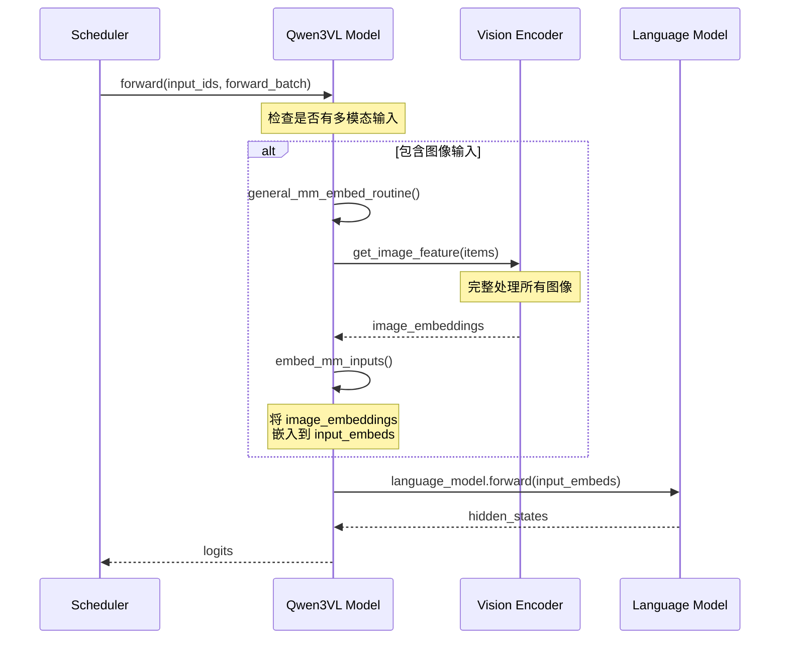
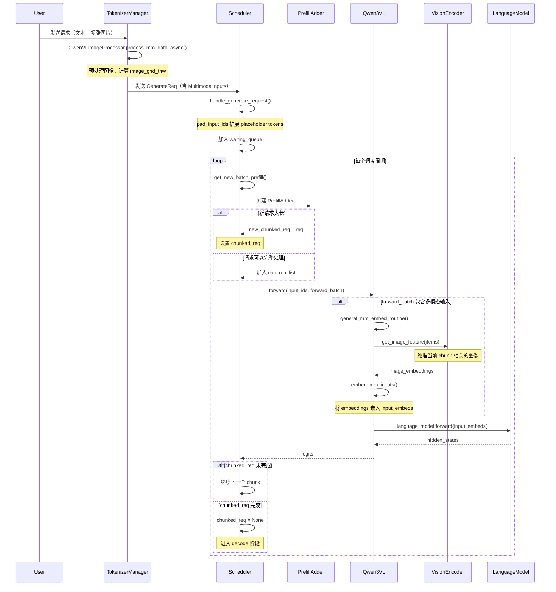

# Mixed Chunk 与多模态处理深度解析

本文档详细解析 SGLang 中 Mixed Chunk（混合批次）的实现机制，以及 Qwen3-VL 模型为例的多模态处理流程。

---

## 1. Mixed Chunk（混合批次）机制

### 1.1 什么是 Mixed Chunk？

Mixed Chunk 是 SGLang 的一个优化特性，允许在同一个 forward pass 中**同时处理 prefill 和 decode 请求**。

```
传统方式（无 Mixed Chunk）:
┌─────────────────────────────────────────────────────────────────┐
│  Batch 1: Prefill Only                                          │
│  [Req1: Prefill 512 tokens] [Req2: Prefill 256 tokens]          │
└─────────────────────────────────────────────────────────────────┘
                               ↓
┌─────────────────────────────────────────────────────────────────┐
│  Batch 2: Decode Only                                           │
│  [Req3: Decode 1 token] [Req4: Decode 1 token]                  │
└─────────────────────────────────────────────────────────────────┘

Mixed Chunk 方式:
┌─────────────────────────────────────────────────────────────────┐
│  Mixed Batch: Prefill + Decode                                  │
│  [Req1: Prefill 256 tokens] [Req3: Decode 1] [Req4: Decode 1]   │
└─────────────────────────────────────────────────────────────────┘
```

### 1.2 启用条件

Mixed Chunk 需要满足以下条件才能启用：

```python
# file: scheduler.py (L2054-2058)

if (
    self.is_mixed_chunk                       # 1. 启用了 mixed_chunk
    and not self.running_batch.is_empty()     # 2. 有正在运行的 decode 请求
    and not (new_batch.return_logprob or      # 3. 不需要返回 logprob
             self.running_batch.return_logprob)
):
    # 执行混合批次逻辑
```

### 1.3 核心实现：mix_with_running()

```python
# file: schedule_batch.py (L1671-1700)

def mix_with_running(self, running_batch: "ScheduleBatch"):
    # 1. 设置 forward mode 为 MIXED
    self.forward_mode = ForwardMode.MIXED
    running_bs = running_batch.batch_size()
    
    # 2. 为 decode 请求准备输入
    for req in running_batch.reqs:
        req.fill_ids = req.origin_input_ids + req.output_ids
        req.set_extend_input_len(1)  # decode 只处理 1 个 token
    
    # 3. 合并 input_ids 和 cache 位置
    input_ids = torch.cat([self.input_ids, running_batch.input_ids])
    out_cache_loc = torch.cat([self.out_cache_loc, running_batch.out_cache_loc])
    
    # 4. 合并批次
    self.merge_batch(running_batch)
    self.input_ids = input_ids
    self.out_cache_loc = out_cache_loc
    
    # 5. 更新 extend 信息
    self.prefix_lens.extend([
        len(r.origin_input_ids) + len(r.output_ids) + delta
        for r in running_batch.reqs
    ])
    self.extend_lens.extend([1] * running_bs)  # decode 各自只有 1 个 token
    self.extend_num_tokens += running_bs
```

### 1.4 Mixed Batch 的数据结构

```
Mixed Batch 示意:

input_ids:      [Prefill Tokens (N1)] [Decode Token (1)] [Decode Token (1)]
                 ↑_______ Req1 _______↑ ↑___ Req2 ___↑   ↑___ Req3 ___↑

prefix_lens:    [0,                    seq_len_2,         seq_len_3]
extend_lens:    [N1,                   1,                 1]

forward_mode = ForwardMode.MIXED
```

---

## 2. VIT 与 Chunk Prefill 的关系

### 2.1 处理顺序：**VIT 在 forward 时调用，与 Chunk 并行处理**

让我们看看 Qwen3-VL 的 forward 流程：



### 2.2 关键代码位置

```python
# file: qwen3_vl.py (L842-896)

def forward(
    self,
    input_ids: torch.Tensor,
    positions: torch.Tensor,
    forward_batch: ForwardBatch,
    ...
):
    # 调用通用的多模态处理例程
    hidden_states = general_mm_embed_routine(
        input_ids=input_ids,
        forward_batch=forward_batch,
        language_model=self.model,
        multimodal_model=self,  # 传入 VIT 模型
        positions=positions,
        ...
    )
    ...
```

```python
# file: mm_utils.py (L1018-1098)

def general_mm_embed_routine(...):
    if not forward_batch.forward_mode.is_decode() and forward_batch.contains_mm_inputs():
        # 只在 prefill/extend 阶段处理多模态输入
        input_embeds, other_info = embed_mm_inputs(
            mm_inputs_list=mm_inputs_list,
            extend_prefix_lens=extend_prefix_lens,  # 当前 chunk 的 prefix 长度
            extend_seq_lens=extend_seq_lens,        # 当前 chunk 的序列长度
            input_ids=input_ids,
            multimodal_model=multimodal_model,
            ...
        )
```

---

## 3. VIT 是完整处理还是分块处理？

### 3.1 答案：**VIT 对单张图像完整处理，但对批次中的多张图像支持分批调用**

#### 关键代码分析

```python
# file: qwen3_vl.py (L712-814)

def get_image_feature(self, items: List[MultimodalDataItem]) -> torch.Tensor:
    # 合并所有图像的 pixel_values
    pixel_values = torch.cat([item.feature for item in items], dim=0)
    image_grid_thw = torch.concat([item.image_grid_thw for item in items], dim=0)
    
    # 检查环境变量控制的分批参数
    max_patches_per_call = get_int_env_var("SGLANG_VLM_MAX_PATCHES_PER_VIT", 0)
    max_images_per_call = get_int_env_var("SGLANG_VLM_MAX_IMAGES_PER_VIT", 0)
    
    if max_patches_per_call == 0 and max_images_per_call == 0:
        # 默认：一次性处理所有图像
        return self.visual(pixel_values, grid_thw=image_grid_thw)
    
    # 分批处理逻辑
    all_chunk_embeds: List[torch.Tensor] = []
    img_start = 0
    
    while img_start < num_images:
        # 根据 max_patches_per_call 和 max_images_per_call 分批
        ...
        # 对每个批次调用 VIT
        chunk_embeds = self.visual(pixel_chunk, grid_thw=grid_chunk)
        all_chunk_embeds.append(chunk_embeds)
        img_start = img_end
    
    # 合并所有批次的 embeddings
    return torch.cat(all_chunk_embeds, dim=0)
```

### 3.2 VIT 分批控制

| 环境变量 | 说明 | 默认值 |
|----------|------|--------|
| `SGLANG_VLM_MAX_PATCHES_PER_VIT` | 每次 VIT 调用的最大 patch 数 | 0（无限制） |
| `SGLANG_VLM_MAX_IMAGES_PER_VIT` | 每次 VIT 调用的最大图像数 | 0（无限制） |

### 3.3 Chunk Prefill 与 VIT 的交互

当启用 Chunked Prefill 时，多模态输入的处理有特殊逻辑：

```python
# file: mm_utils.py (L700-787)

def _get_chunked_prefill_embedding_for_chunked_items(...):
    """
    Multi-modal embedding computation for chunked prefill.
    
    对于每个请求:
    1. 使用 items_size 将 embedding_items 分成每个请求的子列表
    2. 使用 get_embedding_items_per_chunk_with_extra_padding 选择与当前 chunk 相关的 items
    3. 对这个子集调用 data_embedding_func (VIT)
    4. 按顺序连接所有请求的 embedding
    
    这种方式下，每个请求的 VIT 只处理与当前 chunk 相关的帧/图像，
    避免一次性处理所有帧导致 OOM。
    """
```

---

## 4. 多图场景的处理流程

### 4.1 多图数据结构

```python
# file: schedule_batch.py

@dataclass
class MultimodalDataItem:
    modality: Modality           # IMAGE, VIDEO, AUDIO
    feature: torch.Tensor        # pixel values / audio features
    offsets: List[Tuple[int, int]]  # 在 input_ids 中的位置 [(start1, end1), (start2, end2), ...]
    pad_value: int               # 占位符 token id
    precomputed_embeddings: Optional[torch.Tensor] = None
    image_grid_thw: Optional[torch.Tensor] = None  # [T, H, W] 网格信息
```

### 4.2 多图处理流程

```mermaid
flowchart TB
    subgraph Input ["用户输入"]
        A[文本: "分析这两张图片"]
        B[图片1: cat.jpg]
        C[图片2: dog.jpg]
    end
    
    subgraph Tokenize ["TokenizerManager 处理"]
        D[QwenVLImageProcessor.process_mm_data_async]
        E[构建 MultimodalInputs]
    end
    
    subgraph Scheduler ["Scheduler 调度"]
        F[handle_generate_request]
        G[pad_input_ids - 扩展 placeholder tokens]
    end
    
    subgraph Forward ["Model Forward"]
        H[embed_mm_inputs]
        I[get_image_feature]
        J[VIT 编码所有图像]
        K[scatter embeddings into input_embeds]
    end
    
    A --> D
    B --> D
    C --> D
    D --> E
    E --> F
    F --> G
    G --> H
    H --> I
    I --> J
    J --> K
```

### 4.3 多图的 input_ids 结构

```
原始文本: "分析 <image> 和 <image> 两张图片"

Tokenize 后:
input_ids = [分析, <vision_start>, <image_pad>×N1, <vision_end>, 和, 
             <vision_start>, <image_pad>×N2, <vision_end>, 两张图片]

其中:
- N1 = 图片1 处理后的 token 数（由图片分辨率决定）
- N2 = 图片2 处理后的 token 数

MultimodalDataItem:
  - items[0]: 图片1, offsets=[(start1, end1)]
  - items[1]: 图片2, offsets=[(start2, end2)]
```

### 4.4 Chunked Prefill 下的多图处理

```
假设:
- 总 input_ids 长度: 2000 tokens
- chunked_prefill_size: 512
- 图片1 offset: (100, 400)  → 300 tokens
- 图片2 offset: (600, 900)  → 300 tokens

Chunk 1 (0-512):
├── 包含图片1 的部分 (100-400)
├── VIT 处理图片1
└── 生成 embedding 并嵌入

Chunk 2 (512-1024):
├── 包含图片2 的部分 (600-900)
├── VIT 处理图片2
└── 生成 embedding 并嵌入

Chunk 3 (1024-1536):
└── 纯文本，无 VIT 调用

Chunk 4 (1536-2000):
└── 纯文本，完成 prefill
```

---

## 5. Embedding 缓存机制

### 5.1 为什么需要缓存？

在 Chunked Prefill 场景下，同一张图片可能跨多个 chunk，为了避免重复计算，SGLang 使用了 embedding 缓存：

```python
# file: mm_utils.py (L754-769)

# 构建缓存 key
item_hashes = [item.hash for item in embedding_items_per_chunk]
embedding_items_hash = MultiModalStaticCache.combine_hashes(item_hashes)

# 尝试从缓存获取
embedding_per_chunk = embedding_cache.get(embedding_items_hash)
if embedding_per_chunk is None:
    # VIT forward for items related with per chunk
    embedding_per_chunk = data_embedding_func(embedding_items_per_chunk)
    
    # 缓存到 CPU
    embedding_for_cache = embedding_per_chunk.detach().cpu()
    if not embedding_cache.set(embedding_items_hash, embedding_for_cache):
        print("[WARN] Multimodal embedding cache is full...")
```

### 5.2 缓存控制

```bash
# 设置缓存大小（MB）
export SGLANG_VLM_CACHE_SIZE_MB=2048
```

---

## 6. 完整流程时序图



---

## 7. 关键代码索引

| 功能 | 文件 | 函数/类 | 行号 |
|------|------|---------|------|
| Mixed Chunk 混合逻辑 | [scheduler.py](file:///Users/wesley/code/sglang/python/sglang/srt/managers/scheduler.py) | `get_new_batch_prefill()` | L2053-2070 |
| 混合批次合并 | [schedule_batch.py](file:///Users/wesley/code/sglang/python/sglang/srt/managers/schedule_batch.py) | `mix_with_running()` | L1671-1700 |
| 多模态嵌入处理 | [mm_utils.py](file:///Users/wesley/code/sglang/python/sglang/srt/managers/mm_utils.py) | `general_mm_embed_routine()` | L1018-1098 |
| 嵌入多模态输入 | [mm_utils.py](file:///Users/wesley/code/sglang/python/sglang/srt/managers/mm_utils.py) | `embed_mm_inputs()` | L880-1015 |
| 分块嵌入计算 | [mm_utils.py](file:///Users/wesley/code/sglang/python/sglang/srt/managers/mm_utils.py) | `_get_chunked_prefill_embedding_for_chunked_items()` | L700-787 |
| Qwen3-VL 图像特征 | [qwen3_vl.py](file:///Users/wesley/code/sglang/python/sglang/srt/models/qwen3_vl.py) | `get_image_feature()` | L712-814 |
| Qwen3-VL 处理器 | [qwen_vl.py](file:///Users/wesley/code/sglang/python/sglang/srt/multimodal/processors/qwen_vl.py) | `QwenVLImageProcessor` | L223-417 |
| 多模态数据项 | [schedule_batch.py](file:///Users/wesley/code/sglang/python/sglang/srt/managers/schedule_batch.py) | `MultimodalDataItem` | 需要查看 |

---

## 8. 常见问题解答

### Q1: Chunk Prefill 会影响图像质量吗？

**不会**。VIT 处理的是完整的图像 pixel values，Chunk Prefill 只影响 LLM 部分的处理顺序。图像嵌入是完整计算后再分块插入到文本序列中的。

### Q2: 多图请求会比单图慢吗？

视情况而定：
- 如果未设置 `SGLANG_VLM_MAX_PATCHES_PER_VIT`，所有图像会**一次性**通过 VIT
- 如果设置了该参数，会**分批**通过 VIT
- 建议根据 GPU 显存调整这个参数以避免 OOM

### Q3: Mixed Chunk 与多模态请求兼容吗？

兼容，但有限制：
- 多模态请求在 prefill 阶段会处理图像
- 一旦进入 decode 阶段，多模态输入会被清空（`forward_batch.mm_inputs = None`）
- Mixed batch 中的 decode 请求不会再处理图像

---

*学习笔记 - Mixed Chunk 与多模态处理深度解析*
*更新时间: 2026-01-13*
