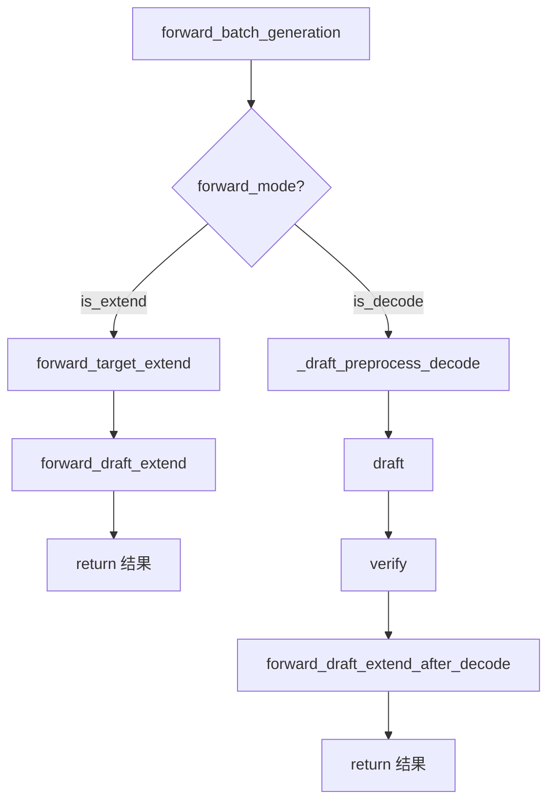

# SGLang EAGLE3 投机采样深度解析

本文档深入分析 EAGLE3 (Extrapolation Algorithm for Greater Language Model Efficiency) 投机采样的架构设计和详细实现逻辑。

---

## 1. EAGLE 架构概览

### 1.1 核心思想

EAGLE 投机采样的核心思想是：使用一个**小型 Draft 模型**快速生成多个候选 token，然后让**大型 Target 模型**并行验证这些候选，接受正确预测的 token，从而加速生成。

```
┌─────────────────────────────────────────────────────────────────┐
│                     EAGLE 投机采样流程                           │
├─────────────────────────────────────────────────────────────────┤
│                                                                 │
│   输入: Target 模型的 hidden_states + 上一个 token              │
│                          ↓                                      │
│   ┌─────────────────────────────────────────────┐               │
│   │  Draft Phase (草稿阶段)                      │               │
│   │  • Draft 模型连续生成 N 步                   │               │
│   │  • 每步取 Top-K 候选                         │               │
│   │  • 构建 Token Tree                          │               │
│   └─────────────────────────────────────────────┘               │
│                          ↓                                      │
│   ┌─────────────────────────────────────────────┐               │
│   │  Verify Phase (验证阶段)                     │               │
│   │  • Target 模型一次性验证整个 Tree            │               │
│   │  • 使用 Tree Mask 实现并行验证               │               │
│   │  • 贪婪/采样方式确定接受路径                 │               │
│   └─────────────────────────────────────────────┘               │
│                          ↓                                      │
│   输出: 接受的 tokens + 新的 hidden_states                      │
│                                                                 │
└─────────────────────────────────────────────────────────────────┘
```

### 1.2 EAGLE vs EAGLE3

| 特性 | EAGLE (EAGLE2) | EAGLE3 |
|------|----------------|--------|
| **Token Map** | 需要手动指定 `speculative_token_map` | 模型内置 `hot_token_id` |
| **lm_head 共享** | 始终共享 Target 的 lm_head | 大多数不共享，部分模型可配置 |
| **模型结构** | 独立的 Draft 模型 | Draft 模型架构更紧密集成 |

### 1.3 算法注册系统

```python
# file: spec_info.py

# 内置算法注册
SpeculativeAlgorithm.register("NONE")

register_speculative_algorithm(
    "EAGLE",
    aliases=("NEXTN",),
    worker_cls=_create_eagle_worker,
    flags=("EAGLE",),
)

register_speculative_algorithm(
    "EAGLE3",
    worker_cls=_create_eagle_worker,
    flags=("EAGLE", "EAGLE3"),  # EAGLE3 同时有 EAGLE 和 EAGLE3 标志
)

register_speculative_algorithm(
    "NGRAM",
    worker_cls=_create_ngram_worker,
    flags=("NGRAM",),
)
```

判断算法类型：

```python
spec_algorithm.is_eagle()   # True for EAGLE, EAGLE3
spec_algorithm.is_eagle3()  # True only for EAGLE3
spec_algorithm.is_ngram()   # True for NGRAM
```

---

## 2. EAGLEWorker 核心组件

### 2.1 类结构

```python
# file: eagle_worker.py

class EAGLEWorker(TpModelWorker):
    """EAGLE 投机解码 Worker"""
    
    def __init__(self, server_args, gpu_id, tp_rank, dp_rank, 
                 moe_ep_rank, nccl_port, target_worker):
        # 核心参数
        self.topk = server_args.speculative_eagle_topk           # 每步 Top-K
        self.speculative_num_steps = server_args.speculative_num_steps  # Draft 步数
        self.speculative_num_draft_tokens = server_args.speculative_num_draft_tokens
        self.target_worker = target_worker
        
        # 共享内存池
        self.req_to_token_pool, self.token_to_kv_pool_allocator = (
            target_worker.get_memory_pool()
        )
        
        # EAGLE3 特殊处理
        if self.speculative_algorithm.is_eagle3():
            self.hot_token_id = self.draft_model_runner.model.hot_token_id
        
        # 共享 embedding 和 lm_head
        embed, head = target_worker.model_runner.model.get_embed_and_head()
        self.draft_model_runner.model.set_embed_and_head(embed, head)
```

### 2.2 配置参数

| 参数 | 说明 | 默认值 |
|------|------|--------|
| `speculative_num_steps` | Draft 生成步数 | 5 |
| `speculative_eagle_topk` | 每步 Top-K 候选数 | 8 |
| `speculative_num_draft_tokens` | 最终选取的 draft token 数 | 64 |
| `speculative_accept_threshold_single` | 单步接受阈值 | 0.0 |
| `speculative_accept_threshold_acc` | 累积接受阈值 | 0.0 |

---

## 3. Draft Phase 详解

### 3.1 整体流程



### 3.2 Draft 预处理

```python
# file: eagle_worker.py (L368-504)

def _draft_preprocess_decode(self, batch: ScheduleBatch):
    """准备 Draft 阶段所需的输入"""
    
    num_seqs = batch.batch_size()
    spec_info = batch.spec_info
    
    # 1. 累积惩罚（repetition penalty 等）
    if batch.sampling_info.penalizer_orchestrator.is_required:
        batch.sampling_info.penalizer_orchestrator.cumulate_output_tokens(
            spec_info.verified_id.to(torch.int64)
        )
    
    # 2. 分配 KV Cache 位置
    # 布局: [topk=0 的所有步] [topk=1 的所有步] ...
    if self.page_size == 1:
        out_cache_loc = alloc_token_slots(
            batch.tree_cache,
            num_seqs * self.speculative_num_steps * self.topk,
            backup_state=True,
        )
    else:
        # 大页模式需要更复杂的处理
        out_cache_loc = alloc_paged_token_slots_extend(...)
    
    # 3. 设置位置信息
    spec_info.positions = batch.seq_lens.repeat_interleave(self.topk, dim=0)
```

### 3.3 多步 Draft 生成

```python
# file: eagle_worker.py (L598-668)

def draft_forward(self, forward_batch: ForwardBatch):
    """多步 Draft 前向传播"""
    
    spec_info = forward_batch.spec_info
    topk_p, topk_index, hidden_states = (
        spec_info.topk_p, spec_info.topk_index, spec_info.hidden_states
    )
    
    # 返回值
    score_list: List[torch.Tensor] = []
    token_list: List[torch.Tensor] = []
    parents_list: List[torch.Tensor] = []
    
    # 多步生成
    for i in range(self.speculative_num_steps):
        # 1. 选择 Top-K tokens
        input_ids, hidden_states, scores, tree_info = select_top_k_tokens(
            i, topk_p, topk_index, hidden_states, scores, self.topk
        )
        score_list.append(tree_info[0])
        token_list.append(tree_info[1])
        parents_list.append(tree_info[2])
        
        # 最后一步不需要 forward
        if i == self.speculative_num_steps - 1:
            break
        
        # 2. 设置输入
        forward_batch.input_ids = input_ids
        forward_batch.out_cache_loc = out_cache_loc[i]
        forward_batch.positions.add_(1)
        
        # 3. Draft 模型 forward
        logits_output = self.draft_model_runner.forward(forward_batch)
        
        # 4. 获取下一步的 Top-K
        probs = torch.softmax(logits_output.next_token_logits, dim=-1)
        topk_p, topk_index = fast_topk(probs, self.topk, dim=-1)
        hidden_states = logits_output.hidden_states
    
    # 5. 组织 Draft 结果
    parent_list, top_scores_index, draft_tokens = organize_draft_results(
        score_list, token_list, parents_list, self.speculative_num_draft_tokens
    )
    
    return parent_list, top_scores_index, draft_tokens
```

### 3.4 构建 Token Tree

```python
# file: eagle_utils.py (L47-158)

def build_tree_kernel_efficient(
    verified_id: torch.Tensor,      # 上一轮验证的 token
    parent_list: torch.Tensor,      # 父节点索引
    top_scores_index: torch.Tensor, # 选中的 token 索引
    draft_tokens: torch.Tensor,     # Draft tokens
    seq_lens: torch.Tensor,         # 序列长度
    seq_lens_sum: int,
    topk: int,
    spec_steps: int,
    num_verify_tokens: int,
):
    """构建用于验证的 Tree 结构"""
    
    # 将 verified_id 添加到 draft_tokens 开头
    draft_tokens = torch.cat((verified_id.unsqueeze(1), draft_tokens), dim=1).flatten()
    
    # 初始化输出
    tree_mask = ...      # Attention Mask
    positions = ...      # 位置编码
    retrive_index = ...  # 检索索引
    retrive_next_token = ...   # 下一个 token
    retrive_next_sibling = ... # 兄弟节点
    
    # 调用 CUDA kernel 构建树
    sgl_build_tree_kernel_efficient(
        parent_list, top_scores_index, seq_lens,
        tree_mask, positions, retrive_index,
        retrive_next_token, retrive_next_sibling,
        topk, spec_steps, num_verify_tokens
    )
    
    return (tree_mask, positions, retrive_index, 
            retrive_next_token, retrive_next_sibling, draft_tokens)
```

---

## 4. Verify Phase 详解

### 4.1 验证入口

```python
# file: eagle_worker.py (L674-763)

def verify(self, batch: ScheduleBatch, spec_info: EagleVerifyInput):
    """使用 Target 模型验证 Draft tokens"""
    
    # 1. 准备验证
    seq_lens_pre_verify = batch.seq_lens.clone()
    spec_info.prepare_for_verify(batch, self.page_size)
    
    # 2. 设置 forward mode
    batch.forward_mode = ForwardMode.TARGET_VERIFY
    batch.spec_info = spec_info
    
    # 3. Grammar 处理（如果有）
    if batch.has_grammar:
        vocab_mask = generate_token_bitmask(...)
    
    # 4. Target 模型 forward
    batch_result = self.target_worker.forward_batch_generation(
        model_worker_batch, is_verify=True
    )
    logits_output = batch_result.logits_output
    
    # 5. 验证并获取接受的 tokens
    res: EagleVerifyOutput = spec_info.verify(
        batch, logits_output, self.token_to_kv_pool_allocator,
        self.page_size, vocab_mask
    )
    
    # 6. 后处理：只保留接受的 tokens
    logits_output.next_token_logits = logits_output.next_token_logits[res.accepted_indices]
    logits_output.hidden_states = logits_output.hidden_states[res.accepted_indices]
    
    return logits_output, res, model_worker_batch, can_run_cuda_graph
```

### 4.2 Token 验证逻辑

```python
# file: eagle_info.py (L216-613)

def verify(self, batch, logits_output, token_to_kv_pool_allocator, page_size, vocab_mask):
    """验证 Draft tokens 并确定接受路径"""
    
    bs = self.retrive_index.shape[0]
    candidates = self.draft_token.reshape(bs, self.draft_token_num)
    
    # 初始化输出
    predict = torch.empty(...)       # 预测结果
    accept_index = torch.full(..., -1)  # 接受的索引
    accept_length = torch.empty(...)    # 接受长度
    
    # 贪婪验证 vs 树形采样验证
    is_all_greedy = sampling_info.is_all_greedy
    
    if is_all_greedy:
        # 贪婪验证：直接 argmax
        target_predict = torch.argmax(logits_output.next_token_logits, dim=-1)
        target_predict = target_predict.reshape(bs, self.draft_token_num)
        
        verify_tree_greedy_func(
            predicts=predict,           # mutable
            accept_index=accept_index,  # mutable
            accept_token_num=accept_length,  # mutable
            candidates=candidates,
            retrive_index=self.retrive_index,
            retrive_next_token=self.retrive_next_token,
            retrive_next_sibling=self.retrive_next_sibling,
            target_predict=target_predict,
        )
    else:
        # 树形采样验证
        target_probs = F.softmax(logits_output.next_token_logits / temperature, dim=-1)
        target_probs = top_k_renorm_prob(target_probs, top_ks)
        
        tree_speculative_sampling_target_only(
            predicts=predict,
            accept_index=accept_index,
            accept_token_num=accept_length,
            candidates=candidates,
            uniform_samples=coins,
            target_probs=target_probs,
            threshold_single=threshold_single,
            threshold_acc=threshold_acc,
            ...
        )
    
    # 处理完成的请求
    for i, req in enumerate(batch.reqs):
        for j, idx in enumerate(accept_index_cpu[i]):
            if idx == -1:
                break
            id = predict_cpu[idx]
            req.output_ids.append(id)
            req.check_finished()
            if req.finished():
                accept_index[i, j + 1:] = -1
                break
            # Grammar 处理
            if req.grammar is not None:
                req.grammar.accept_token(id)
    
    # 释放未接受 tokens 的 KV Cache
    evict_mask = torch.full_like(self.draft_token, True, dtype=torch.bool)
    evict_mask[accept_index] = False
    token_to_kv_pool_allocator.free(batch.out_cache_loc[evict_mask])
    
    return EagleVerifyOutput(
        draft_input=EagleDraftInput(...),
        verified_id=verified_id,
        accept_length_per_req_cpu=accept_length_list,
        accepted_indices=accept_index,
    )
```

### 4.3 验证结果数据流

```
┌─────────────────────────────────────────────────────────────────┐
│                    Verify 输出数据结构                           │
├─────────────────────────────────────────────────────────────────┤
│                                                                 │
│  EagleVerifyOutput:                                             │
│  ├── draft_input: EagleDraftInput                               │
│  │   ├── hidden_states: 接受位置的 hidden states                │
│  │   ├── verified_id: 接受的 token IDs                          │
│  │   ├── accept_length: 每个请求接受的 token 数                 │
│  │   └── seq_lens_for_draft_extend: 更新后的序列长度            │
│  ├── logits_output: 过滤后的 logits                             │
│  ├── verified_id: 所有接受的 token IDs (flatten)                │
│  ├── accept_length_per_req_cpu: CPU 上的接受长度列表            │
│  └── accepted_indices: 接受位置的索引                           │
│                                                                 │
└─────────────────────────────────────────────────────────────────┘
```

---

## 5. Draft Extend 阶段

### 5.1 Prefill 后的 Draft Extend

```python
# file: eagle_worker.py (L844-879)

def forward_draft_extend(self, batch, hidden_states, next_token_ids, seq_lens_cpu):
    """在 Target Extend 后运行 Draft Extend"""
    
    # 1. 准备 Draft 输入
    draft_input = EagleDraftInput(
        hidden_states=hidden_states,
        verified_id=next_token_ids,
        ...
    )
    
    # 2. 设置 batch 状态
    batch.spec_info = draft_input
    batch.spec_info.prepare_for_extend(batch)
    
    # 3. Draft 模型 forward
    logits_output = self.draft_model_runner.forward(forward_batch)
    
    # 4. 获取 Top-K 作为下一轮的输入
    probs = torch.softmax(logits_output.next_token_logits, dim=-1)
    topk_p, topk_index = fast_topk(probs, self.topk, dim=-1)
    
    # 5. 更新 spec_info
    batch.spec_info.topk_p = topk_p
    batch.spec_info.topk_index = topk_index
    batch.spec_info.hidden_states = hidden_states
```

### 5.2 Decode 后的 Draft Extend

```python
# file: eagle_worker.py (L881-968)

def forward_draft_extend_after_decode(self, batch: ScheduleBatch):
    """在 Verify 后运行 Draft Extend，为下一轮 Draft 准备"""
    
    # 1. 准备输入
    batch.spec_info.prepare_extend_after_decode(batch, self.speculative_num_steps)
    
    # 2. 分配 KV Cache
    out_cache_loc = alloc_paged_token_slots_extend(...)
    
    # 3. Draft 模型 forward
    logits_output = self.draft_model_runner.forward(forward_batch)
    
    # 4. 获取 Top-K
    probs = torch.softmax(logits_output.next_token_logits, dim=-1)
    topk_p, topk_index = fast_topk(probs, self.topk, dim=-1)
    
    # 5. 更新 spec_info
    batch.spec_info.topk_p = topk_p
    batch.spec_info.topk_index = topk_index
    batch.spec_info.hidden_states = logits_output.hidden_states
```

---

## 6. KV Cache 生命周期

EAGLE3 投机采样中 KV Cache 的管理是一个关键且复杂的过程。本节详细分析 KV Cache 在 Draft 和 Verify 阶段的分配、释放和状态管理。

### 6.1 生命周期概览

```
┌─────────────────────────────────────────────────────────────────────────┐
│                   EAGLE3 KV Cache 生命周期                               │
├─────────────────────────────────────────────────────────────────────────┤
│                                                                         │
│  ┌──────────────────────────────────────────────────────────────────┐   │
│  │  Draft Preprocess (临时分配)                                      │   │
│  │  ├── backup_state=True 备份分配器状态                             │   │
│  │  ├── 分配 num_seqs × num_steps × topk 个 KV slots               │   │
│  │  └── alloc_token_slots / alloc_paged_token_slots_extend          │   │
│  └──────────────────────────────────────────────────────────────────┘   │
│                                ↓                                        │
│  ┌──────────────────────────────────────────────────────────────────┐   │
│  │  Draft Forward (使用临时 KV Cache)                                │   │
│  │  ├── 多步 Draft 模型推理                                          │   │
│  │  └── 生成候选 tokens 和 parent 关系                               │   │
│  └──────────────────────────────────────────────────────────────────┘   │
│                                ↓                                        │
│  ┌──────────────────────────────────────────────────────────────────┐   │
│  │  Draft Postprocess (恢复状态)                                     │   │
│  │  └── token_to_kv_pool_allocator.restore_state()                  │   │
│  └──────────────────────────────────────────────────────────────────┘   │
│                                ↓                                        │
│  ┌──────────────────────────────────────────────────────────────────┐   │
│  │  Verify Prepare (正式分配)                                        │   │
│  │  ├── 分配 len(draft_tokens) 个 KV slots                          │   │
│  │  └── assign_req_to_token_pool 更新映射                            │   │
│  └──────────────────────────────────────────────────────────────────┘   │
│                                ↓                                        │
│  ┌──────────────────────────────────────────────────────────────────┐   │
│  │  Verify (接受/拒绝决策)                                           │   │
│  │  ├── Target 模型 forward                                          │   │
│  │  ├── 确定 accept_index (接受的 token 位置)                        │   │
│  │  ├── 计算 evict_mask (拒绝的 token 掩码)                          │   │
│  │  └── token_to_kv_pool_allocator.free(out_cache_loc[evict_mask])  │   │
│  └──────────────────────────────────────────────────────────────────┘   │
│                                ↓                                        │
│  ┌──────────────────────────────────────────────────────────────────┐   │
│  │  Post-Verify (状态更新)                                           │   │
│  │  ├── req.kv_committed_len += accept_length + 1                    │   │
│  │  ├── req.kv_allocated_len = req.kv_committed_len                  │   │
│  │  └── (topk > 1) move_kv_cache() 重组 KV Cache 位置               │   │
│  └──────────────────────────────────────────────────────────────────┘   │
│                                                                         │
└─────────────────────────────────────────────────────────────────────────┘
```

### 6.2 Draft 阶段临时分配

```python
# file: eagle_worker.py (_draft_preprocess_decode)

def _draft_preprocess_decode(self, batch: ScheduleBatch):
    """Draft 预处理：分配临时 KV Cache"""
    
    num_seqs = len(batch.reqs)
    num_slots = num_seqs * self.speculative_num_steps * self.topk
    
    if self.page_size == 1:
        # 非分页模式：backup_state=True 用于后续恢复
        out_cache_loc, token_to_kv_pool_state_backup = alloc_token_slots(
            batch.tree_cache,
            num_slots,
            backup_state=True,  # 关键：备份分配器状态
        )
    else:
        # 分页模式
        out_cache_loc = alloc_paged_token_slots_extend(
            batch.tree_cache_unflatten,
            new_pages,
            ...,
            backup_state=True,
        )
    
    # 保存状态备份供后续恢复
    self.token_to_kv_pool_state_backup = token_to_kv_pool_state_backup
```

**关键点**：Draft 阶段分配的 KV slots 是**临时的**，因为：
1. Draft 模型可能生成 `num_steps × topk` 个候选
2. 但最终只有一条路径会被接受
3. 使用 `backup_state=True` 允许后续恢复分配器状态

### 6.3 Draft 后状态恢复

```python
# file: eagle_worker.py (draft 结束后)

# Draft forward 完成后恢复分配器状态
self.token_to_kv_pool_allocator.restore_state(token_to_kv_pool_state_backup)
```

### 6.4 Verify 阶段正式分配

```python
# file: eagle_info.py (prepare_for_verify)

def prepare_for_verify(self, batch: ScheduleBatch, page_size: int):
    """准备 Verify：分配正式 KV Cache"""
    
    num_draft_tokens = len(batch.input_ids)
    
    if page_size == 1:
        # 非分页模式：不使用 backup_state
        batch.out_cache_loc = alloc_token_slots(
            batch.tree_cache,
            num_draft_tokens,
        )
    else:
        # 分页模式
        batch.out_cache_loc = alloc_paged_token_slots_extend(...)
    
    # 更新 req_to_token 映射
    assign_req_to_token_pool_func(
        batch.req_pool_indices,
        batch.req_to_token_pool,
        kv_start_idx,
        batch.out_cache_loc,
        per_request_token_num,
    )
```

### 6.5 拒绝 Token 的 KV Cache 释放

```python
# file: eagle_info.py (verify)

def verify(self, batch, logits_output, token_to_kv_pool_allocator, page_size, vocab_mask):
    """验证并释放拒绝的 KV Cache"""
    
    # ... 验证逻辑确定 accept_index ...
    
    # 创建驱逐掩码：所有位置初始为 True (需要驱逐)
    evict_mask = torch.full_like(self.draft_token, True, dtype=torch.bool)
    
    # 接受的位置设为 False
    # accept_index shape: (batch_size, max_accept_length)
    # accept_index[i][j] = 被接受的 draft token 在 flatten 后的索引
    evict_mask[accept_index] = False
    
    # 释放未接受的 KV Cache slots
    # batch.out_cache_loc[evict_mask] 获取需要释放的 cache 位置
    token_to_kv_pool_allocator.free(batch.out_cache_loc[evict_mask])
```

**evict_mask 示例**：
```
Draft tokens (flatten):   [T0, T1, T2, T3, T4, T5, T6, T7]
accept_index:             [0,  2,  5, -1, -1, -1, -1, -1]  (接受 T0, T2, T5)
evict_mask (初始):        [T,  T,  T,  T,  T,  T,  T,  T]
evict_mask (设置后):      [F,  T,  F,  T,  T,  F,  T,  T]  (T=需释放)
释放的 cache locations:   out_cache_loc[1,3,4,6,7]
```

### 6.6 接受 Token 的状态更新

```python
# file: eagle_info.py (verify 后续)

for i, req in enumerate(batch.reqs):
    accept_length = accept_length_list[i]
    
    # 更新 KV Cache 提交长度
    # +1 是因为 accept_length 不包括最后一个新预测的 token
    req.kv_committed_len += accept_length + 1
    req.kv_allocated_len = req.kv_committed_len
```

**长度更新的逻辑**：
- `kv_committed_len`：已确定（committed）的 KV cache 长度
- `kv_allocated_len`：已分配的 KV cache 长度
- 验证后，两者同步更新为相同值

### 6.7 topk > 1 时的 Page 对齐

当 `topk > 1` 且使用分页模式 (`page_size > 1`) 时，需要处理 KV cache 的页对齐问题。

#### 6.7.1 Draft 阶段的 Page 复制

```python
# file: eagle_worker.py (_draft_preprocess_decode)

if self.topk > 1 and self.page_size > 1:
    # 获取需要复制的 cache 位置
    src_cache_loc, tgt_cache_loc = get_src_tgt_cache_loc(
        batch.prefix_indices_for_copy,
        batch.seq_lens,
        ...,
    )
    
    # 复制最后一个不完整页的 KV Cache
    batch.token_to_kv_pool_allocator.get_kvcache().move_kv_cache(
        tgt_cache_loc, src_cache_loc
    )
```

**目的**：确保每个 topk 分支都有自己完整的 KV cache 副本。

#### 6.7.2 Verify 后的 KV Cache 重组

```python
# file: eagle_info.py (verify)

if page_size > 1 and self.topk > 1:
    # 获取需要移动的源和目标位置
    src_cache_loc = get_source_cache_loc(...)
    tgt_cache_loc = get_target_cache_loc(...)
    
    # 重组 KV Cache 以保证连续性
    batch.token_to_kv_pool_allocator.get_kvcache().move_kv_cache(
        tgt_cache_loc, src_cache_loc
    )
```

**目的**：当接受的 tokens 来自不同的 topk 分支时，需要重新组织使其在内存中连续。

### 6.8 请求完成时的处理

```python
# file: eagle_info.py (verify)

for i, req in enumerate(batch.reqs):
    for j, idx in enumerate(accept_index_cpu[i]):
        if idx == -1:
            break
        token_id = predict_cpu[idx]
        req.output_ids.append(token_id)
        req.check_finished()
        
        if req.finished():
            # 将后续位置标记为 -1，停止处理
            accept_index[i, j + 1:] = -1
            break
```

当请求完成时（达到 EOS 或 max_tokens），后续的 accept_index 被标记为 -1，这些位置不会进一步处理，其 KV cache 会随请求释放而释放。

---

## 7. CUDA Graph 优化

### 7.1 Draft CUDA Graph

```python
# file: eagle_worker.py (L220-260)

def init_cuda_graphs(self):
    """初始化 CUDA Graph 以加速 Draft 推理"""
    
    if self.server_args.disable_cuda_graph:
        return
    
    # Draft 多步 CUDA Graph
    if self.speculative_num_steps > 1:
        self.cuda_graph_runner = EAGLEDraftCudaGraphRunner(self)
    
    # Draft Extend CUDA Graph
    if self.draft_extend_attn_backend:
        self.cuda_graph_runner_for_draft_extend = EAGLEDraftExtendCudaGraphRunner(self)
```

### 7.2 CUDA Graph 使用

```python
def draft(self, batch: ScheduleBatch):
    ...
    forward_batch = ForwardBatch.init_new(model_worker_batch, self.draft_model_runner)
    
    # 检查是否可以使用 CUDA Graph
    can_cuda_graph = self.cuda_graph_runner and self.cuda_graph_runner.can_run(forward_batch)
    
    if can_cuda_graph:
        # 使用 CUDA Graph 回放
        parent_list, top_scores_index, draft_tokens = self.cuda_graph_runner.replay(forward_batch)
    else:
        # 正常执行
        parent_list, top_scores_index, draft_tokens = self.draft_forward(forward_batch)
```

---

## 8. 数据结构详解

### 8.1 EagleDraftInput

```python
@dataclass
class EagleDraftInput(SpecInput):
    """Draft 阶段的输入/输出"""
    
    # Decode 输入 (shape: batch, topk)
    topk_p: torch.Tensor = None       # Top-K 概率
    topk_index: torch.Tensor = None   # Top-K token 索引
    hidden_states: torch.Tensor = None  # Hidden states (batch, hidden_size)
    
    # Extend 输入
    verified_id: torch.Tensor = None   # 验证通过的 token IDs
    accept_length: torch.Tensor = None # 接受长度
    
    # Attention 输入
    kv_indptr: torch.Tensor = None
    kv_indices: torch.Tensor = None
```

### 8.2 EagleVerifyInput

```python
@dataclass
class EagleVerifyInput(SpecInput):
    """Verify 阶段的输入"""
    
    draft_token: torch.Tensor        # Draft tokens (flatten)
    custom_mask: torch.Tensor        # Tree attention mask
    positions: torch.Tensor          # 位置编码
    retrive_index: torch.Tensor      # 检索索引
    retrive_next_token: torch.Tensor # 下一个 token 索引
    retrive_next_sibling: torch.Tensor  # 兄弟节点索引
    spec_steps: int
    topk: int
    draft_token_num: int
    capture_hidden_mode: CaptureHiddenMode
```

### 8.3 EagleVerifyOutput

```python
@dataclass
class EagleVerifyOutput:
    """Verify 阶段的输出"""
    
    draft_input: EagleDraftInput     # 下一轮 Draft 的输入
    logits_output: LogitsProcessorOutput
    verified_id: torch.Tensor        # 接受的 token IDs
    accept_length_per_req_cpu: List[int]  # 每个请求接受的长度
    accepted_indices: torch.Tensor   # 接受位置的索引
```

---

## 9. 关键代码位置索引

| 功能 | 文件 | 函数/类 | 行号 |
|------|------|---------|------|
| 算法注册 | spec_info.py | `register_speculative_algorithm` | L202-255 |
| EAGLEWorker 初始化 | eagle_worker.py | `EAGLEWorker.__init__` | L81-199 |
| 主入口 | eagle_worker.py | `forward_batch_generation` | L266-321 |
| Draft 预处理 | eagle_worker.py | `_draft_preprocess_decode` | L368-504 |
| Draft 多步生成 | eagle_worker.py | `draft_forward` | L598-668 |
| 构建 Token Tree | eagle_utils.py | `build_tree_kernel_efficient` | L47-158 |
| Verify 入口 | eagle_worker.py | `verify` | L674-763 |
| Token 验证 | eagle_info.py | `EagleVerifyInput.verify` | L216-613 |
| Draft Extend | eagle_worker.py | `forward_draft_extend` | L844-879 |
| 贪婪验证 Kernel | eagle_utils.py | `verify_tree_greedy_func` | L161-199 |

---

## 10. 启动配置

### 10.1 命令行参数

```bash
python -m sglang.launch_server \
    --model-path meta-llama/Llama-3.1-8B-Instruct \
    --speculative-algorithm EAGLE3 \
    --speculative-draft-model-path EAGLE3-Draft-Model \
    --speculative-num-steps 5 \
    --speculative-eagle-topk 8 \
    --speculative-num-draft-tokens 64
```

### 10.2 环境变量

```bash
# 接受阈值（用于非贪婪采样）
--speculative-accept-threshold-single 0.0
--speculative-accept-threshold-acc 0.0

# NaN 检测
--enable-nan-detection
```

---

## 11. 性能调优建议

1. **调整 `speculative_num_steps`**：更多步数可能生成更多候选，但增加开销
2. **调整 `speculative_eagle_topk`**：更大 Top-K 增加覆盖率但降低效率
3. **启用 CUDA Graph**：确保 `--disable-cuda-graph` 未设置
4. **监控接受率**：通过 `req.spec_accepted_tokens / req.spec_verify_ct` 计算

---

*学习笔记 - SGLang EAGLE3 投机采样深度解析*
*更新时间: 2026-01-14*
