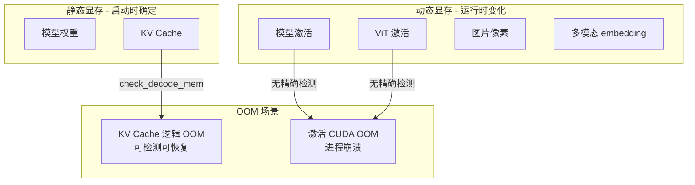
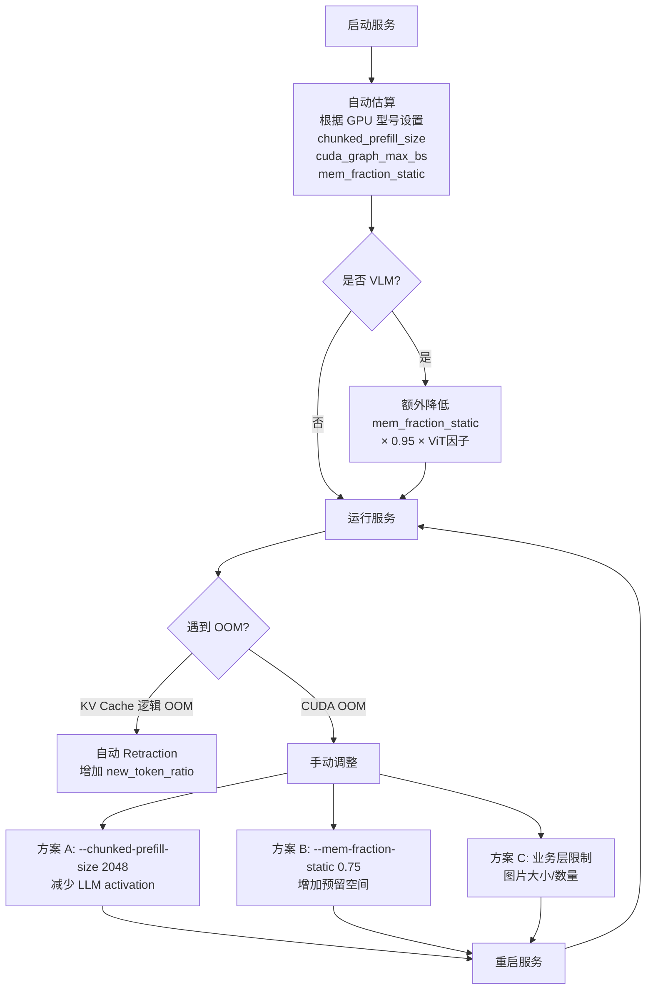

# SGLang 内存池设计详解

> **默认场景**: Qwen/Qwen3-VL-235B-A22B-Thinking 多模态模型
>
> **启用特性**: PD 分离 + Chunked Prefill + ViT DP + Overlap Schedule + 多模态缓存

## 1. 内存池架构概览

**核心文件**:
- `srt/mem_cache/memory_pool.py` - GPU 内存池
- `srt/mem_cache/allocator.py` - 索引分配器
- `srt/mem_cache/memory_pool_host.py` - Host 内存池
- `srt/mem_cache/radix_cache.py` - 前缀缓存 (Tree Cache)


**详细架构图**:


### 1.1 与 Tree Cache 的关系


**关键理解**:
- **两层架构**: ReqToTokenPool 管理请求，TokenToKVPoolAllocator + KVCache 管理 Token 存储
- **Tree Cache** 不是内存池的一部分，而是**上层的缓存管理策略**
  - Tree Cache 持有 KV 索引的「引用」
  - 当 Tree Cache 逐出节点时，调用 `token_to_kv_pool_allocator.free()` 释放索引

## 2. ReqToTokenPool

**文件**: `memory_pool.py:78`

管理请求 ID 到 token 位置的映射。

### 2.1 数据结构

```python
class ReqToTokenPool:
    def __init__(self, size, max_context_len, device, enable_memory_saver):
        # 核心张量: [请求数, 最大上下文长度]
        self.req_to_token = torch.zeros(
            (size, max_context_len), dtype=torch.int32, device=device
        )
        # 可用请求槽位
        self.free_slots = list(range(size))
```

### 2.2 核心操作

| 方法 | 功能 |
|------|------|
| `alloc(need_size)` | 分配 N 个请求槽位 |
| `free(free_index)` | 释放请求槽位 |
| `write(indices, values)` | 写入 token 位置映射 |

## 3. KVCache 变体

### 3.1 类继承关系


### 3.2 MHATokenToKVPool

**标准的 Multi-Head Attention KV Cache**

```python
class MHATokenToKVPool(KVCache):
    def __init__(self, size, page_size, dtype, head_num, head_dim, layer_num, ...):
        # 为每层创建 K/V buffer
        # Shape: [size + page_size, head_num, head_dim]
        self.k_buffer = [
            torch.zeros((size + page_size, head_num, head_dim), dtype=store_dtype)
            for _ in range(layer_num)
        ]
        self.v_buffer = [
            torch.zeros((size + page_size, head_num, v_head_dim), dtype=store_dtype)
            for _ in range(layer_num)
        ]
```

**内存布局**:


### 3.3 MLATokenToKVPool

**Multi-head Latent Attention (DeepSeek-V2 模型)**

```python
class MLATokenToKVPool(KVCache):
    def __init__(self, ..., kv_lora_rank, qk_rope_head_dim, ...):
        self.kv_lora_rank = kv_lora_rank
        self.qk_rope_head_dim = qk_rope_head_dim

        # MLA 使用压缩的 KV 表示
        # Shape: [size, kv_lora_rank + qk_rope_head_dim]
        self.kv_buffer = [
            torch.zeros((size + page_size, kv_lora_rank + qk_rope_head_dim), ...)
            for _ in range(layer_num)
        ]
```

**优势**: 通过低秩压缩大幅减少 KV 缓存内存

### 3.4 SWAKVPool

**Sliding Window Attention 混合池**


### 3.5 HybridLinearKVPool

**Mamba + Attention 混合模型 (Mamba2, Falcon-Mamba, Bamba 等)**

> **重要**: 当模型包含 Mamba 层 (通过 `hybrid_gdn_config` 或 `mamba2_config` 检测) 时，
> SGLang 使用此池来同时管理 Attention 层的 KV Cache 和 Mamba 层的 SSM 状态。

```python
class HybridLinearKVPool(KVCache):
    def __init__(self, ..., full_attention_layer_ids, mamba_pool, ...):
        # 仅 Full Attention 层使用 KV Cache
        self.full_kv_pool = MHATokenToKVPool(
            layer_num=len(full_attention_layer_ids),  # 只为 Attention 层分配
            ...
        )
        # 映射: layer_id → 在 full_kv_pool 中的索引
        self.full_attention_layer_id_mapping = {
            id: i for i, id in enumerate(full_attention_layer_ids)
        }
        # Mamba 层使用 SSM 状态存储 (由 HybridReqToTokenPool 管理)
        self.mamba_pool = mamba_pool  # 来自 HybridReqToTokenPool
```

**架构详解**:


**MambaRadixCache 的特殊处理**:

普通 RadixCache 只需管理 KV 索引，而 MambaRadixCache 需要同时管理:

```python
class TreeNode:  # mamba_radix_cache.py
    def __init__(self):
        self.key = ...                # token IDs
        self.value = ...              # KV 索引 (Attention 层)
        self.mamba_value = ...        # Mamba 状态索引
        # 双锁机制
        self.full_lock_ref = 0        # 保护 KV Cache
        self.mamba_lock_ref = 0       # 保护 Mamba 状态
```

**为什么需要双锁?**
- Mamba 状态是**顺序依赖**的，不同请求即使前缀相同也需要不同的 Mamba 状态副本
- 因此 `mamba_lock_ref` 和 `full_lock_ref` 分开管理，允许独立逐出

## 4. Allocator 分配器

### 4.1 TokenToKVPoolAllocator

**基础分配器，无分页**

```python
class TokenToKVPoolAllocator(BaseTokenToKVPoolAllocator):
    def __init__(self, size, dtype, device, kvcache, need_sort):
        self.page_size = 1  # 无分页，每次分配单个 token

    def alloc(self, need_size: int):
        if need_size > len(self.free_pages):
            return None
        select_index = self.free_pages[:need_size]
        self.free_pages = self.free_pages[need_size:]
        return select_index

    def free(self, free_index: torch.Tensor):
        self.free_pages = torch.cat((self.free_pages, free_index))
```

### 4.2 PagedTokenToKVPoolAllocator

**分页分配器，支持 extend/decode 优化**


### 4.3 SWATokenToKVPoolAllocator

**双池分配器，同时管理 Full 和 SWA 池**

```python
class SWATokenToKVPoolAllocator(BaseTokenToKVPoolAllocator):
    def __init__(self, size, size_swa, ...):
        self.full_attn_allocator = TokenToKVPoolAllocator(size, ...)
        self.swa_attn_allocator = TokenToKVPoolAllocator(size_swa, ...)
        self.full_to_swa_index_mapping = torch.empty(size + size_swa + 1, ...)

    def alloc(self, need_size):
        # 同时从两个池分配
        alloc_full_indices = self.full_attn_allocator.alloc(need_size)
        alloc_swa_indices = self.swa_attn_allocator.alloc(need_size)
        # 建立映射
        self.full_to_swa_index_mapping[alloc_full_indices] = alloc_swa_indices
        return alloc_full_indices
```

## 5. MambaPool

**用于 Mamba/SSM 模型的状态存储**

```python
class MambaPool:
    @dataclass
    class State:
        conv: List[torch.Tensor]   # 卷积状态
        temporal: torch.Tensor     # SSM 状态

    def __init__(self, size, cache_params, ...):
        # Shape: [num_mamba_layers, size + 1, conv_shape...]
        self.mamba_cache = self.State(
            conv=[torch.zeros((num_layers, size+1) + conv_shape) for ...],
            temporal=torch.zeros((num_layers, size+1) + temporal_shape)
        )
```

**与 KV Cache 的区别**:
| 特性 | KVCache | MambaPool |
|------|---------|-----------|
| 存储内容 | K, V 张量 | conv, ssm 状态 |
| 增长模式 | 随 token 线性增长 | 固定大小 |
| 分配粒度 | per-token | per-request |

## 6. Host 内存池 (Hierarchical Cache)

**文件**: `memory_pool_host.py`

### 6.1 HostKVCache

```python
class HostKVCache:
    def __init__(self, device_pool, host_to_device_ratio, host_size, ...):
        # Host 端 KV 缓存 (CPU 或 pinned memory)
        self.k_buffer = []
        self.v_buffer = []

    def load_to_device_per_layer(self, device_pool, host_indices, device_indices, layer_id):
        # 从 Host 加载到 Device (per-layer for overlap)
        pass

    def backup_from_device_all_layer(self, device_pool, host_indices, device_indices):
        # 从 Device 备份到 Host
        pass
```

### 6.2 层级缓存架构


## 7. 内存分配流程

### 7.1 Prefill 分配


### 7.2 Decode 分配

```python
# 每个请求只需 1 个新 token
out_indices = token_to_kv_pool_allocator.alloc_decode(
    seq_lens=batch.seq_lens,
    last_loc=batch.last_loc,
)
```

## 8. 关键配置参数

| 参数 | 默认值 | 说明 |
|------|--------|------|
| `mem_fraction_static` | 0.9 | 静态内存分配比例 |
| `page_size` | 16 | 分页大小 |
| `kv_cache_dtype` | auto | KV 缓存数据类型 |
| `host_to_device_ratio` | 0 | Host 缓存比例 |

## 9. 内存优化技术

### 9.1 Memory Saver

```python
# 延迟分配 GPU 内存
memory_saver_adapter = TorchMemorySaverAdapter.create(enable=enable_memory_saver)
with memory_saver_adapter.region(GPU_MEMORY_TYPE_KV_CACHE):
    self.k_buffer = torch.zeros(...)
```

### 9.2 Custom Memory Pool (NVLink)

```python
# 用于 PD 分离的自定义内存池
self.enable_custom_mem_pool, self.custom_mem_pool, _ = maybe_init_custom_mem_pool(device)
with torch.cuda.use_mem_pool(self.custom_mem_pool):
    # 分配可以跨 GPU 高效传输的内存
```

## 10. 显存占用分析与 OOM 机制

### 10.1 显存占用分类

| 类别 | 分配时机 | 是否预分配 | 生命周期 |
|------|---------|-----------|---------|
| 模型权重 | 启动时 | ✅ 静态 | 全程常驻 |
| KV Cache | 启动时 | ✅ 静态 | 全程常驻 |
| 模型激活 | 前向时 | ❌ 动态 | 单次 forward |
| ViT 激活 | 图片处理时 | ❌ 动态 | 图片处理期间 |
| 图片像素 | 请求到达时 | ❌ 动态 | 请求处理期间 |
| 多模态 embedding | ViT 后 | ⚠️ 缓存 | LRU 管理 |

### 10.2 静态显存 (启动时分配)

#### 模型权重

```python
# 加载模型时一次性分配
model = AutoModelForCausalLM.from_pretrained(...)
# 权重大小 ≈ 参数量 × bytes_per_param
```

#### KV Cache

```python
# memory_pool.py - 启动时预分配
self.k_buffer = [torch.zeros((size + page_size, head_num, head_dim), ...) for _ in range(layer_num)]
self.v_buffer = [torch.zeros((size + page_size, head_num, head_dim), ...) for _ in range(layer_num)]
```

**计算公式**:
```
KV Cache 大小 = 2 × layers × max_tokens × num_kv_heads × head_dim × bytes_per_elem
```

**关键理解**: KV cache 物理内存**启动时一次性分配完毕**，运行时 allocator 只管理索引，不触发 CUDA allocator。

### 10.3 动态显存 (运行时分配)

#### 模型激活

- **Attention**: Q/K/V 投影、attention scores、softmax 中间结果
- **FFN/MoE**: 上投影、激活函数、下投影中间结果
- **大小**: 与 `batch_size × seq_len` 成正比

#### ViT 激活 (多模态)

```python
# 处理图片时的中间激活
pixel_values = image.to(cuda)  # 动态分配
vit_embeddings = vit_model(pixel_values)  # 中间激活
```

**风险场景**:
- 超大图片 (4K+) → patch 数量多 → ViT 激活大
- 多图请求 → 累积激活

#### 图片像素到 CUDA

```python
# mm_utils.py - 请求处理时
pixel_values = pixel_values.to(device)  # 动态拷贝到 GPU
```

### 10.4 OOM 类型对比

#### SGLang 逻辑 OOM (KV Cache)

**特点**: 可检测、可恢复

```python
# allocator.py - 返回 None 而非触发 CUDA 错误
def alloc(self, need_size: int):
    if need_size > len(self.free_pages):
        return None  # ← 逻辑层面的 "OOM"
    ...
```

**检测点**:

| 阶段 | 检测函数 | 处理方式 |
|------|---------|---------|
| Prefill 调度 | `PrefillAdder.rem_total_tokens` | 拒绝新请求 |
| Decode 阶段 | `batch.check_decode_mem()` | 触发 Retraction |

#### 真正的 CUDA OOM

**特点**: 无法提前检测、进程崩溃

| 场景 | 原因 | SGLang 防护 |
|------|------|------------|
| 模型激活过大 | batch_size × seq_len 过大 | `max_running_requests`, `max_prefill_tokens` 间接限制 |
| ViT 激活过大 | 超大图片 | 无精确限制 |
| 碎片累积 | PyTorch allocator 碎片 | 依赖 PyTorch 自身整理 |



### 10.5 OOM 预防机制

#### 核心问题

真正的 CUDA OOM **原则上不可完全避免**，因为动态显存（activation、ViT 激活等）的实际大小取决于:
- 输入图片的实际分辨率/数量
- 模型的实际计算路径
- PyTorch allocator 的行为

**没有精确的运行时检测机制**，只能靠启动时的估算。

#### 自动估算机制

SGLang 会根据 GPU 型号**自动计算**关键参数，用户通常不需要手动指定：

```python
# server_args.py:909-951 - 自动计算 mem_fraction_static

reserved_mem = 512  # 元数据常量 (MB)

# 1. Activation 预留: chunked_prefill_size × 1.5 GB
#    系数 1.5 是经验值，未来可通过 dummy run 更精确估算
reserved_mem += max(chunked_prefill_size, 2048) * 1.5

# 2. CUDA Graph 预留: cuda_graph_max_bs × 2 GB
reserved_mem += cuda_graph_max_bs * 2

# 3. 并行度调整
reserved_mem += tp_size * pp_size / 8 * 1024

# 4. DP Attention 额外开销
if enable_dp_attention:
    reserved_mem += cuda_graph_max_bs * dp_size * 3

# 5. 投机解码额外开销
if speculative_algorithm == "STANDALONE":
    reserved_mem += 6 * 1024

# 最终计算
mem_fraction_static = (gpu_mem - reserved_mem) / gpu_mem
```

#### GPU 型号 → 默认配置

| GPU 显存 | 代表型号 | chunked_prefill_size | cuda_graph_max_bs |
|----------|----------|---------------------|------------------|
| < 20GB | T4, 4080 | 2048 | 8 |
| 20-35GB | A10, 4090, 5090 | 2048 | 24 (TP<4) / 80 |
| 35-60GB | A100-40G, L40 | 4096 | 32 (TP<4) / 160 |
| 60-90GB | H100, A100-80G | 8192 | 256 (TP<4) / 512 |
| 90-160GB | H20, H200 | 8192 | 256 (TP<4) / 512 |
| > 160GB | B200, MI300 | 16384 | 512 |

#### VLM 额外调整

多模态模型需要额外降低 `mem_fraction_static`：

```python
# server_args.py:4877-4913 - adjust_mem_fraction_for_vlm

# 基础降低系数
base_mem_fraction_reduction_ratio = 0.95

# 根据 ViT 复杂度动态调整 (0.8 ~ 1.05)
current_complexity = vit_num_layers * (vit_hidden_size ** 2)
baseline_complexity = 24 * (1024 ** 2)  # ViT-L/14
complexity_ratio = current_complexity / baseline_complexity

# 每增长 100% 复杂度，降低 10%
dynamic_adjustment_factor = 1.0 - 0.1 * (complexity_ratio - 1.0)
dynamic_adjustment_factor = clamp(dynamic_adjustment_factor, 0.8, 1.05)

# 最终调整
mem_fraction_static *= 0.95 * dynamic_adjustment_factor
```

#### 用户可调参数

| 参数 | 作用 | 使用场景 |
|------|------|----------|
| `--mem-fraction-static 0.75` | 降低 KV Cache 占比，预留更多动态空间 | 自动估算不准时手动调低 |
| `--chunked-prefill-size 2048` | 限制单次 prefill token 数 | 减少 activation 峰值 |

#### 预防策略决策树



#### 核心结论

1. **逻辑 OOM (KV Cache)**: 有检测、有恢复 → Retraction 机制自动处理
2. **真正 CUDA OOM (Activation)**: 无精确检测 → 只能靠经验估算 + 手动调参
3. **没有银弹**: VLM 的图片大小/数量不可预测，只能通过经验调参或业务层限制

### 10.6 碎片问题

#### KV Cache: 无碎片

基于页的分配，页大小固定:

```
free_pages: [5, 8, 12, 3, 7, ...]  # 不连续的索引
alloc(3) → [5, 8, 12]              # 从头取
free([5, 8, 12]) → 归还到尾部     # 追加到末尾
```

页内容可能分散在物理 buffer 的不同位置，但**不影响分配效率**——只要有空闲页就能分配。

#### 多模态 embedding: 可能有碎片

```python
# multimodal_cache.py - 动态分配
class MultiModalStaticCache:
    def set(self, mm_hash, embedding, ...):
        while self.current_size + data_size > self.max_size:
            self.mm_cache.popitem(last=False)  # 驱逐 LRU
        self.mm_cache[mm_hash] = embedding  # 每个 tensor 独立分配
```

不同大小图片的 embedding 动态分配/释放，可能产生 CUDA allocator 碎片，但通常不严重:
- PyTorch CUDA allocator 有碎片整理机制
- embedding 相比 KV cache 较小
- `max_size` 限制了缓存总量

### 10.7 显存监控

```python
# 运行时监控
torch.cuda.memory_allocated()      # 当前分配
torch.cuda.memory_reserved()       # 当前保留 (含 allocator 缓存)
torch.cuda.max_memory_allocated()  # 峰值

# SGLang metrics
stats.kv_cache_usage      # KV Cache 使用率
stats.running_req_count   # 运行请求数
```

## 11. 下一步

- **06**: RadixCache 前缀缓存 (radix_cache.py)
- **07**: ModelRunner 与 CUDA Graph
