# SGLang RadixCache 前缀缓存详解

> **默认场景**: Qwen/Qwen3-VL-235B-A22B-Thinking 多模态模型
>
> **启用特性**: PD 分离 + Chunked Prefill + ViT DP + Overlap Schedule + 多模态缓存

## 1. RadixCache 概览

**核心文件**:
- `srt/mem_cache/radix_cache.py` - 基础 RadixCache
- `srt/mem_cache/base_prefix_cache.py` - 抽象基类
- `srt/mem_cache/evict_policy.py` - 逐出策略
- `srt/mem_cache/swa_radix_cache.py` - SWA 变体
- `srt/mem_cache/mamba_radix_cache.py` - Mamba 变体
- `srt/mem_cache/hiradix_cache.py` - 层级缓存变体

### 1.1 什么是 RadixAttention?

RadixAttention 是 SGLang 的核心创新，通过 **Radix Tree (基数树)** 数据结构高效管理 KV Cache 的前缀共享。

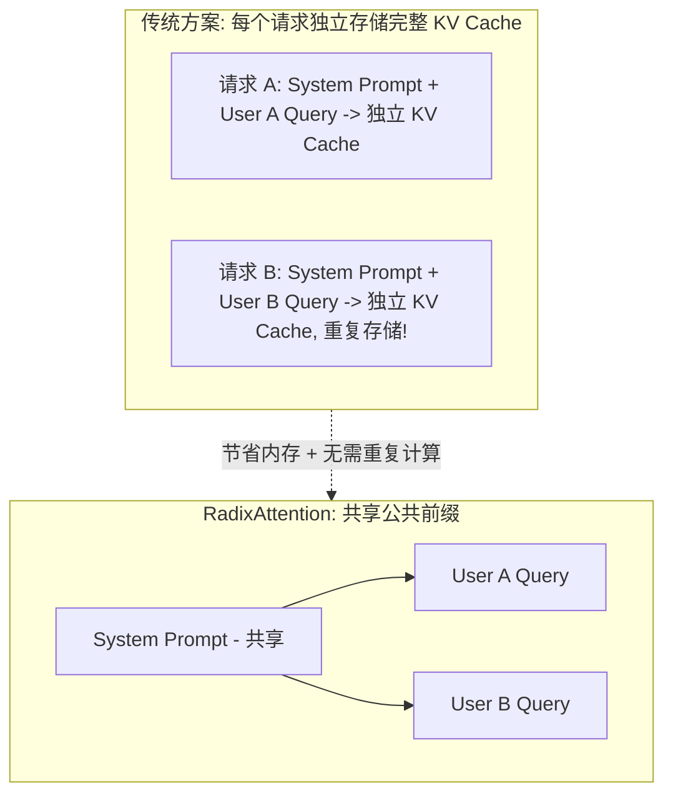

### 1.2 类继承关系

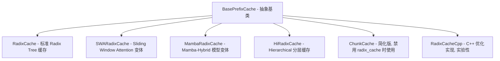

## 2. 核心数据结构

### 2.1 RadixKey

```python
class RadixKey:
    def __init__(self, token_ids: List[int], extra_key: Optional[str] = None):
        self.token_ids = token_ids  # Token ID 序列
        self.extra_key = extra_key  # 额外键 (LoRA ID, cache_salt 等)
```

**用途**:
- `token_ids`: 实际的 token 序列，用于前缀匹配
- `extra_key`: 隔离不同 LoRA 或数据集的缓存命名空间

### 2.2 TreeNode

```python
class TreeNode:
    def __init__(self, id=None, priority=0):
        self.children = defaultdict(TreeNode)  # 子节点 (按首 token 索引)
        self.parent: TreeNode = None           # 父节点
        self.key: RadixKey = None              # 本节点存储的 token 序列
        self.value: torch.Tensor = None        # KV Cache 索引

        # 锁和访问控制
        self.lock_ref = 0                      # 引用计数 (防止逐出)
        self.last_access_time = time.monotonic()
        self.creation_time = time.monotonic()
        self.hit_count = 0                     # 访问次数 (LFU 用)
        self.priority = priority               # 优先级 (Priority eviction)

        # Hierarchical Cache 相关
        self.host_value: torch.Tensor = None   # Host 端 KV 索引
        self.host_ref_counter = 0              # Host 引用计数
        self.hash_value: List[str] = None      # SHA256 块哈希
```

### 2.3 Radix Tree 结构示例

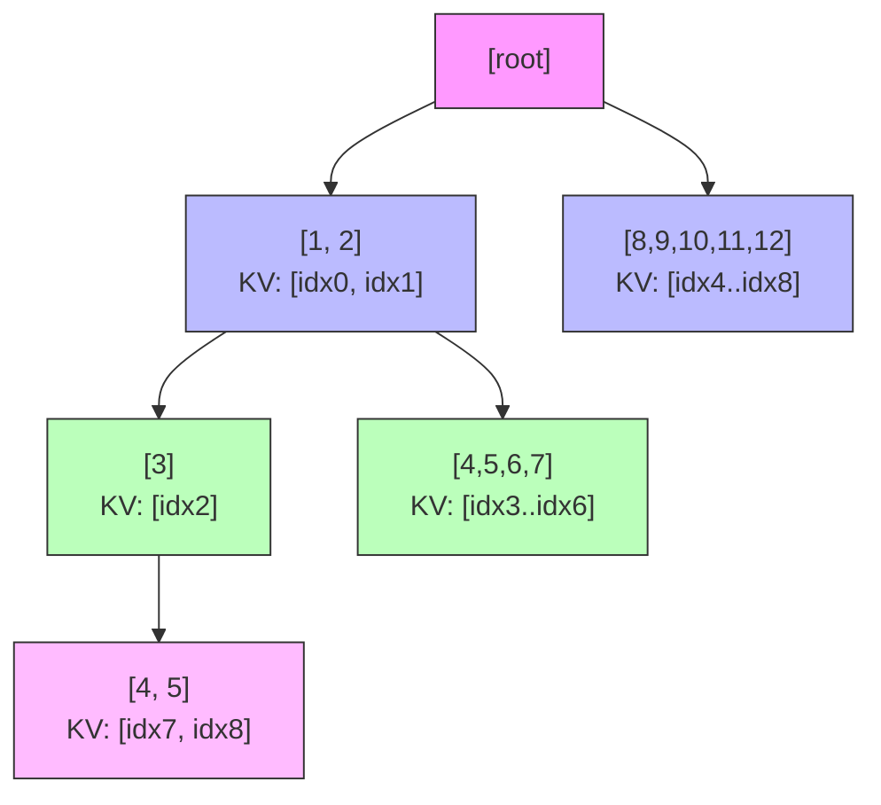

**插入序列说明**:

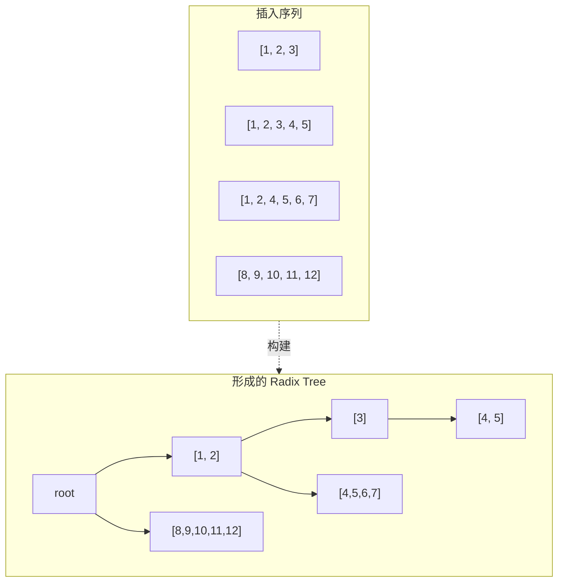

每个节点的 value 存储对应 token 的 KV 索引

## 3. 核心操作

### 3.1 match_prefix

**最长前缀匹配**

```python
def match_prefix(self, key: RadixKey, **kwargs) -> MatchResult:
    """
    查找 key 在 Radix Tree 中的最长公共前缀

    返回:
        MatchResult(
            device_indices: 匹配到的 KV 索引
            last_device_node: 匹配终止的节点
            last_host_node: (HiCache) Host 端匹配节点
        )
    """
```

**匹配流程**:

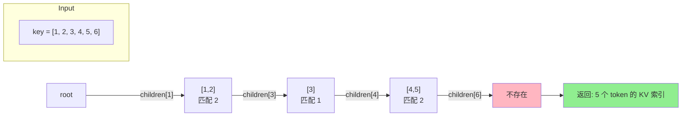

**详细步骤**:

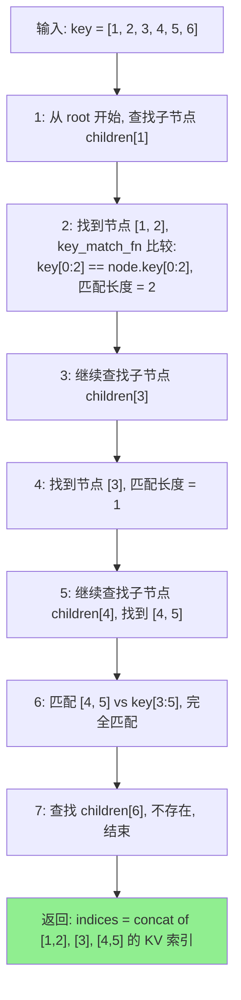

### 3.2 insert

**插入新序列**

```python
def insert(self, key: RadixKey, value=None, priority: int = 0):
    """
    插入 token 序列及其 KV 索引到树中

    返回: 已存在的前缀长度 (用于释放重复的 KV 索引)
    """
```

**关键细节**:
- 如果前缀已存在，只插入新增部分
- 返回 `total_prefix_length` 告知调用方哪些 KV 已存在（可释放）

### 3.3 _split_node

**节点分裂**

当匹配在节点中间结束时，需要分裂节点：

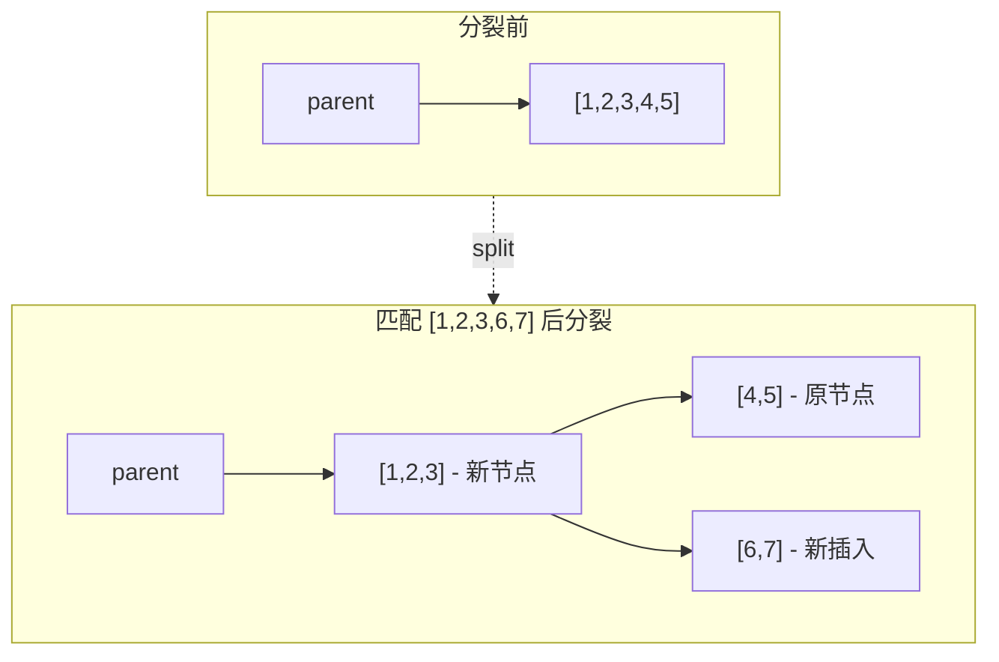

```python
def _split_node(self, key: RadixKey, child: TreeNode, split_len: int):
    new_node = TreeNode(priority=child.priority)
    new_node.key = child.key[:split_len]
    new_node.value = child.value[:split_len]
    new_node.children = {get_child_key(child.key[split_len:]): child}
    child.key = child.key[split_len:]
    child.value = child.value[split_len:]
    # ... 更新父子关系
```

## 4. 锁机制 (lock_ref)

### 4.1 为什么需要锁?

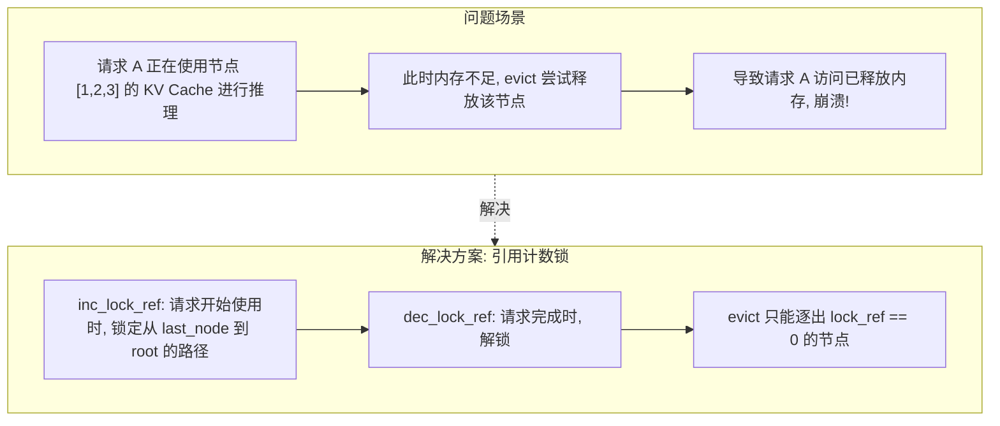

### 4.2 实现细节

```python
def inc_lock_ref(self, node: TreeNode):
    """锁定从 node 到 root 的整个路径"""
    while node != self.root_node:
        if node.lock_ref == 0:
            # 从 evictable 转为 protected
            self.evictable_size_ -= len(node.key)
            self.protected_size_ += len(node.key)
        node.lock_ref += 1
        node = node.parent

def dec_lock_ref(self, node: TreeNode):
    """解锁路径"""
    while node != self.root_node:
        if node.lock_ref == 1:
            # 从 protected 转为 evictable
            self.evictable_size_ += len(node.key)
            self.protected_size_ -= len(node.key)
        node.lock_ref -= 1
        node = node.parent
```

## 5. 逐出策略

**文件**: `evict_policy.py`

| 策略 | 优先级计算 | 适用场景 |
|------|-----------|---------|
| **LRU** | `last_access_time` | 热点数据保留 (默认) |
| **LFU** | `(hit_count, last_access_time)` | 高频访问优先 |
| **FIFO** | `creation_time` | 按创建顺序 |
| **MRU** | `-last_access_time` | 最近使用优先逐出 |
| **FILO** | `-creation_time` | 后进先出 |
| **Priority** | `(priority, last_access_time)` | 请求优先级感知 |

### 5.1 evict() 流程

```python
def evict(self, num_tokens: int):
    leaves = self._collect_leaves()  # 收集所有叶子节点
    eviction_heap = [
        (eviction_strategy.get_priority(node), node)
        for node in leaves if node.lock_ref == 0
    ]
    heapq.heapify(eviction_heap)

    num_evicted = 0
    while num_evicted < num_tokens and eviction_heap:
        priority, node = heapq.heappop(eviction_heap)
        self.token_to_kv_pool_allocator.free(node.value)  # 释放 KV
        self._delete_leaf(node)                           # 删除节点
        num_evicted += len(node.value)

        # 如果父节点变成叶子且未被锁定，可能成为下一个逐出候选
        if len(node.parent.children) == 0 and node.parent.lock_ref == 0:
            heapq.heappush(eviction_heap, (get_priority(node.parent), node.parent))
```

## 6. 请求生命周期中的缓存操作

### 6.1 cache_finished_req

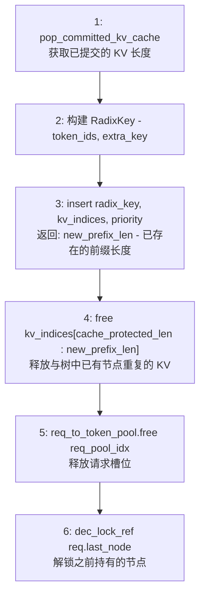

### 6.2 cache_unfinished_req

用于 **Chunked Prefill**，请求未完成但需要中间缓存：

```python
def cache_unfinished_req(self, req: Req, chunked=False):
    # 插入当前已处理的 token
    new_prefix_len = self.insert(radix_key, kv_indices)

    # 释放重复部分
    self.token_to_kv_pool_allocator.free(kv_indices[cache_protected_len:new_prefix_len])

    # 重新匹配以获取最新的节点引用
    match_result = self.match_prefix(radix_key)
    new_last_node = match_result.last_device_node

    # 更新请求的 prefix_indices 供下一个 chunk 使用
    req.prefix_indices = new_indices
    req.cache_protected_len = len(new_indices)

    # 更新锁
    self.dec_lock_ref(req.last_node)
    self.inc_lock_ref(new_last_node)
    req.last_node = new_last_node
```

## 7. Page Size 与对齐

当 `page_size > 1` 时，匹配和插入以 page 为单位：

```python
if self.page_size != 1:
    page_aligned_len = len(key) // self.page_size * self.page_size
    key = key[:page_aligned_len]
```

**影响**:
- 匹配粒度变粗 (以 page_size 个 token 为单位)
- 部分页 (partial page) 需要特殊处理，不能进入 RadixCache

## 8. extra_key 命名空间隔离

```python
# 不同 LoRA 的请求共享相同 system prompt 也不会混用
key1 = RadixKey([1,2,3], extra_key="lora_adapter_A")
key2 = RadixKey([1,2,3], extra_key="lora_adapter_B")
# key1 和 key2 被视为完全不同的缓存条目
```

命名空间隔离确保:
- 不同 LoRA adapter 的 KV Cache 不会混用
- 不同 `cache_salt` 的请求隔离

## 9. EAGLE Bigram 转换

对于 EAGLE 投机解码，使用 bigram key：

```python
def convert_to_bigram_key(token_ids: List[int]) -> List[int]:
    """
    [1, 2, 3, 4] → [(1,2), (2,3), (3,4)]
    """
    return [combine(token_ids[i], token_ids[i+1]) for i in range(len(token_ids)-1)]
```

这允许 EAGLE 的 draft model 共享 target model 的部分 KV Cache。

## 10. Scheduler 集成

```python
# scheduler.py 中的选择逻辑
if self.is_hybrid_ssm:
    self.tree_cache = MambaRadixCache(params)
elif self.is_hybrid_swa:
    self.tree_cache = SWARadixCache(params, sliding_window_size)
elif enable_hierarchical_cache:
    self.tree_cache = HiRadixCache(params, server_args)
else:
    self.tree_cache = RadixCache(params)
```

## 11. 配置参数

| 参数 | 默认值 | 说明 |
|------|--------|------|
| `disable_radix_cache` | False | 禁用前缀缓存 |
| `radix_eviction_policy` | "lru" | 逐出策略 |
| `page_size` | 16 | 页大小 |
| `enable_hierarchical_cache` | False | 启用层级缓存 |

## 12. 多模态 Chunked Prefill 与缓存命中案例

### 12.1 场景设定

```
假设:
  chunk_size = 512 tokens
  image1 token 数 = 1024 (> chunk_size，需要 2 个 chunk)
  image2 token 数 = 768  (> chunk_size，需要 2 个 chunk)
  image3 token 数 = 896  (> chunk_size，需要 2 个 chunk)
  text1 token 数 = 100

请求:
  req1: text1 + image1 + image2
  req2: text1 + image1 + image3
```

### 12.2 req1 处理流程 (首次请求)

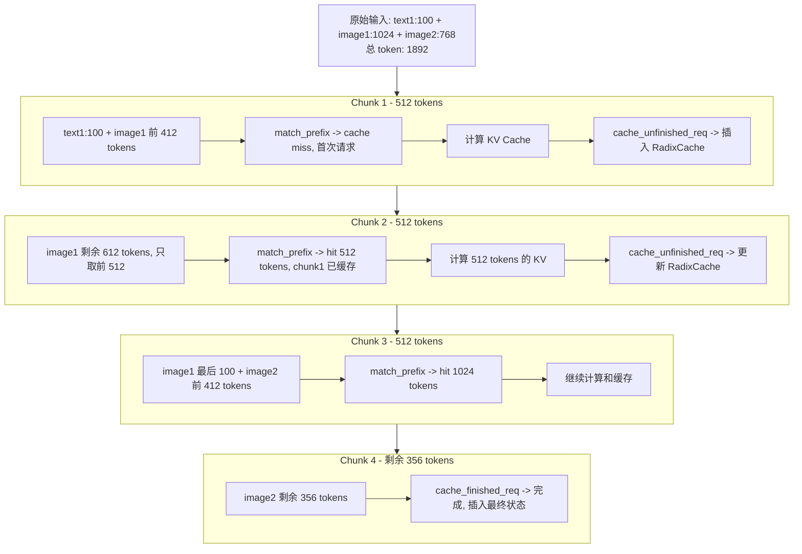

### 12.3 req2 部分命中场景

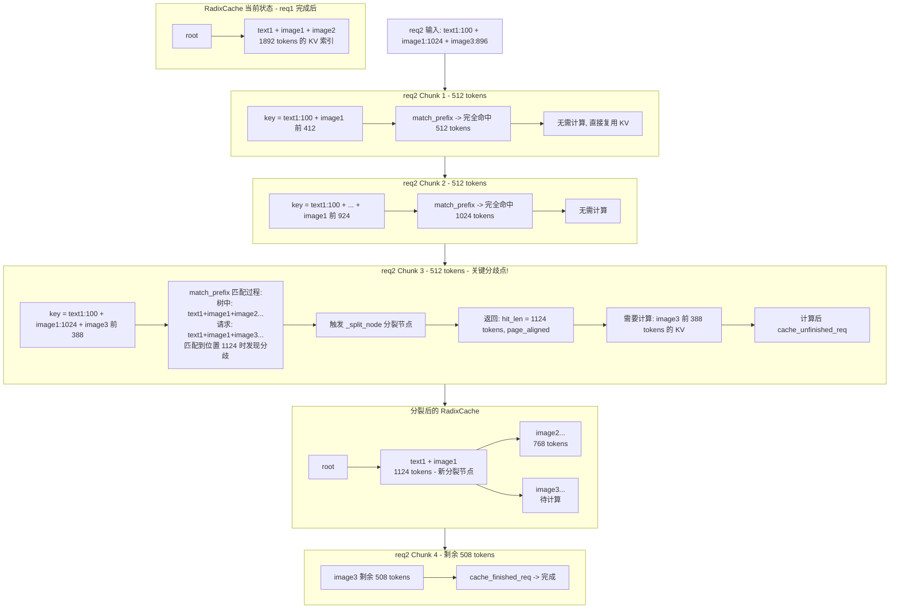

### 12.4 Page Alignment 对部分命中的影响

```python
# page_size = 16 时的对齐
actual_match = 1124
page_aligned_match = (1124 // 16) * 16  # = 1120

# 结果: 虽然精确匹配到 1124，但只能复用 1120 tokens
# 后 4 tokens 需要重新计算 (页对齐开销)
```

### 12.5 多模态缓存隔离机制

> **注意**: `extra_key` 用于 **LoRA ID 和 cache_salt**，不是多模态图片隔离！

```python
# schedule_batch.py - extra_key 的真正用途
# extra key for classifying the request (e.g. cache_salt)
if lora_id is not None:
    extra_key = (extra_key or "") + lora_id  # LoRA ID 拼接到 extra_key
```

**多模态图片如何隔离?**

图片通过 **pad_value (图片 hash)** 嵌入到 token_ids 中：

```python
# MultimodalDataItem.set_pad_value()
self.hash = hash_feature(self.feature)  # 图片内容 hash
self.pad_value = self.hash % (1 << 30)  # 作为 token 占位符

# 最终 token_ids 示例:
# [text_tokens..., pad_value_image1, pad_value_image1, ..., pad_value_image2, ...]
```

因此，不同图片组合的请求：
- **不同 pad_value** -> 不同 token_ids -> 自然不会匹配
- **不需要 extra_key** 来隔离多模态

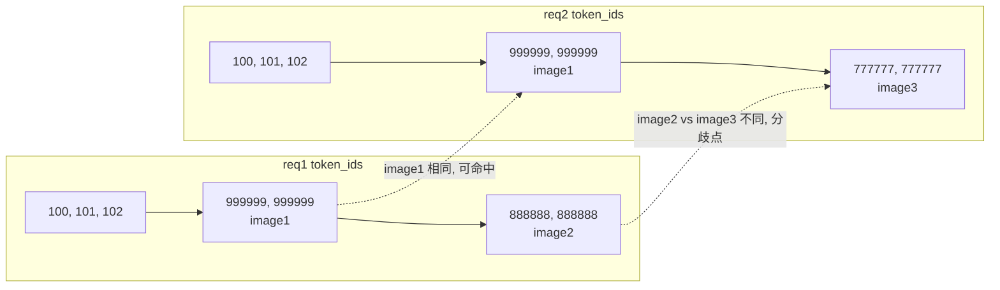

---

## 13. MambaRadixCache 详解

### 13.1 Mamba-Hybrid 模型的特殊挑战

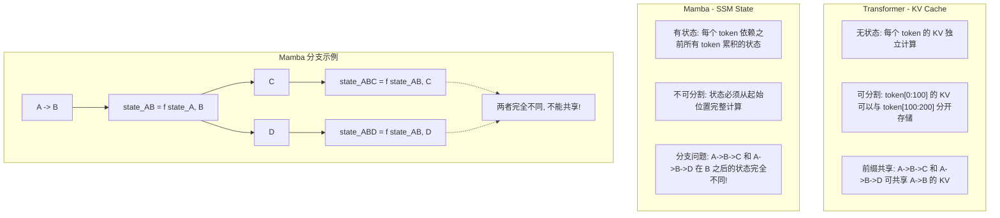

### 13.2 MambaRadixCache 双锁机制

```python
# MambaRadixCache 的 TreeNode
class TreeNode:
    # KV Cache 相关 (Attention 层)
    self.value: torch.Tensor = None           # KV 索引
    self.full_lock_ref = 0                    # KV 锁

    # Mamba State 相关 (SSM 层)
    self.mamba_value: torch.Tensor = None     # Mamba 状态索引
    self.mamba_lock_ref = 0                   # Mamba 锁

    # LRU 链表 (分开管理)
    self.prev, self.next = None, None         # KV LRU
    self.mamba_prev, self.mamba_next = None, None  # Mamba LRU
```

**不变量 (Invariant)**:

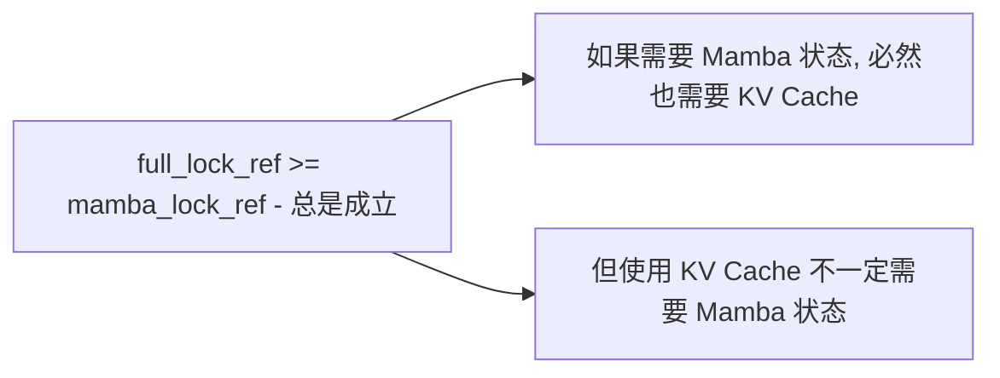

### 13.3 Mamba Tombstone (墓碑节点)

当节点被分裂时，Mamba 状态无法分割：

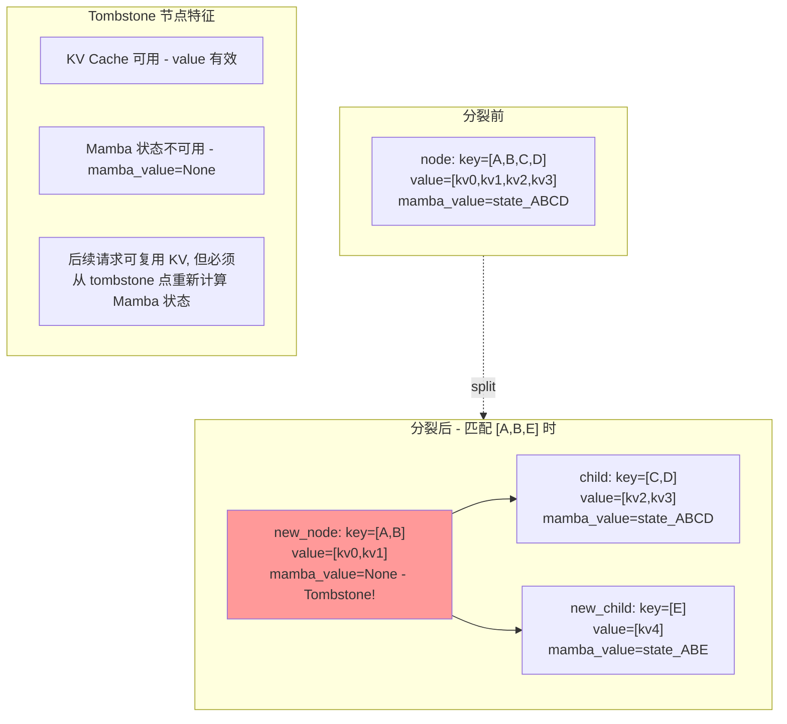

### 13.4 cow_mamba (Copy-On-Write) 机制

```python
def match_prefix(self, key: RadixKey, cow_mamba: bool = False, req=None):
    """
    cow_mamba=True 时，将匹配节点的 Mamba 状态复制到请求的本地空间
    """
    value, last_node, mamba_branching_seqlen = self._match_prefix_helper(key)

    if cow_mamba and last_node.mamba_value is not None:
        # 分配请求私有的 Mamba 状态槽
        if req.mamba_pool_idx is None:
            dst_index = self.req_to_token_pool.mamba_pool.alloc(1)
            req.mamba_pool_idx = dst_index[0]

        # 复制节点状态到请求私有空间
        src_index = last_node.mamba_value
        self.req_to_token_pool.mamba_pool.copy_from(src_index, dst_index)
```

**为什么需要 Copy-On-Write?**

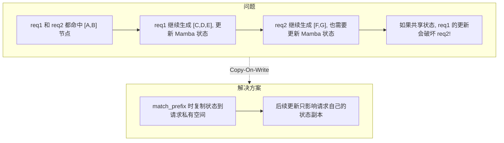

### 13.5 mamba_branching_seqlen

```python
# _match_prefix_helper 返回值
return value[:best_value_len], best_last_node, mamba_branching_seqlen

# mamba_branching_seqlen 含义:
# 在匹配过程中，最后一个有 mamba_value 的节点之后的 FLA_CHUNK_SIZE 对齐位置
```

**作用**: 告诉调度器从哪个位置开始需要重新计算 Mamba 状态

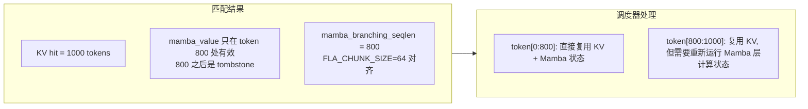

### 13.6 Chunked Prefill 与 Mamba 的特殊关联

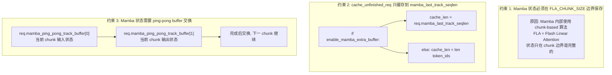

### 13.7 Mamba Eviction 策略

```python
# 两个独立的 LRU 链表
self.full_lru_list = LRUList(mamba=False)   # 管理 KV Cache
self.mamba_lru_list = LRUList(mamba=True)   # 管理 Mamba 状态

def evict_mamba(self, num_slots: int):
    """只逐出 Mamba 状态，保留 KV Cache"""
    node = self.mamba_lru_list.get_lru_no_lock()
    while num_evicted < num_slots and node:
        self.req_to_token_pool.mamba_pool.free(node.mamba_value)
        node.mamba_value = None  # 变成 tombstone
        self.mamba_lru_list.remove_node(node)
        # 节点保留在 full_lru_list 中 (KV 仍可用)
        num_evicted += 1
        node = self.mamba_lru_list.get_lru_no_lock()

def evict(self, num_tokens: int):
    """逐出 KV Cache (同时会释放 Mamba 状态)"""
    # 先尝试只逐出 Mamba 状态释放内存
    # 如果不够，再逐出 KV Cache
```

**逐出优先级**:
1. 先逐出 Mamba 状态 (创建 tombstone)
2. 如果 KV 内存不足，再逐出完整节点

---

## 14. 下一步

- **07**: ModelRunner 与 CUDA Graph
- **08**: Attention 后端 (FlashInfer, FlashAttention)
