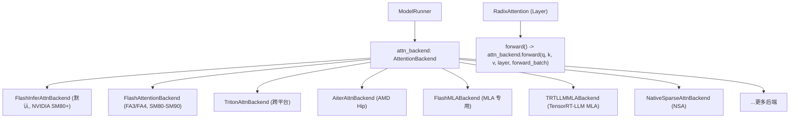
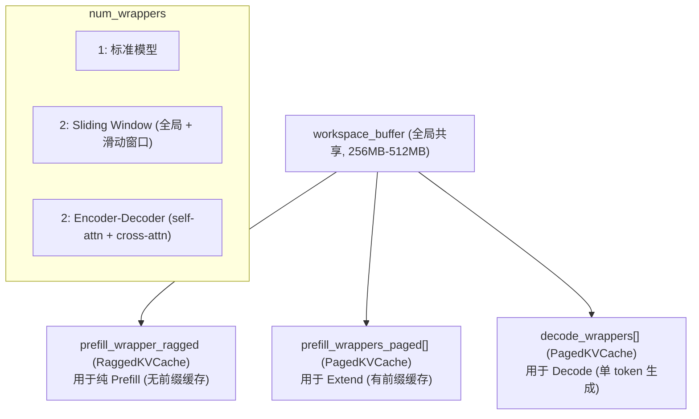
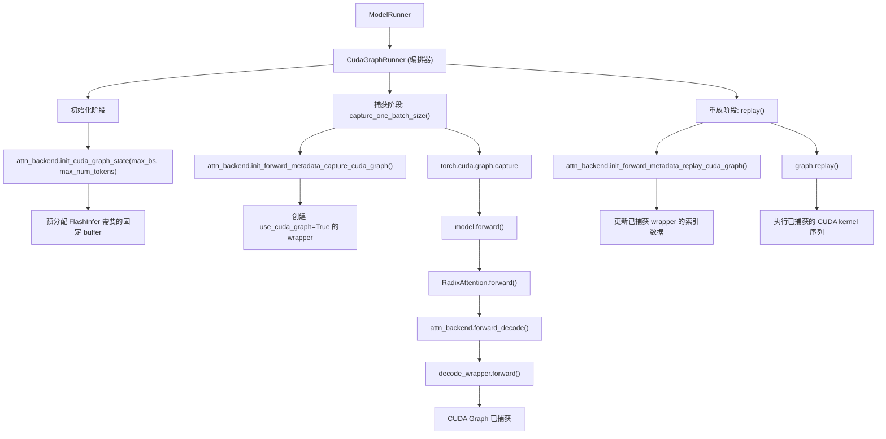
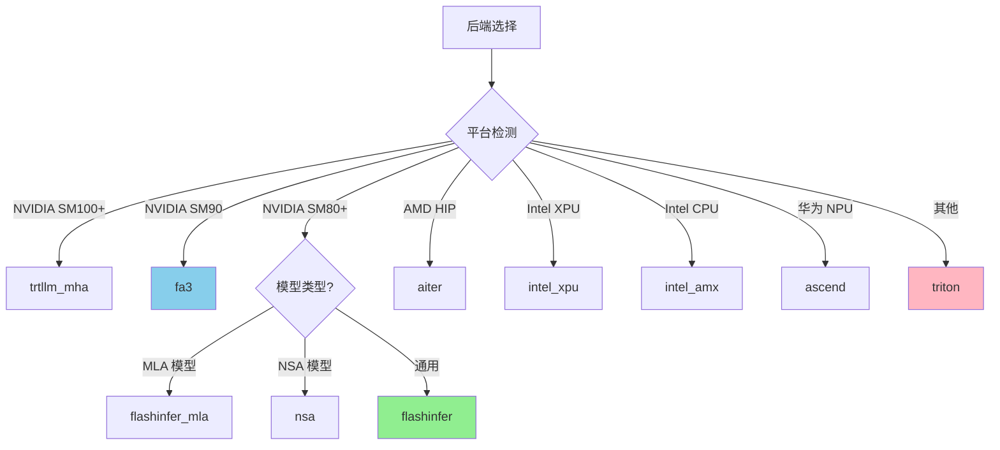
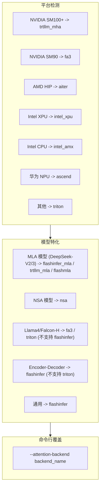

# 08: Attention 后端

## 1. 概述

Attention 后端是 SGLang 中负责执行注意力计算的核心组件。不同的后端针对不同的硬件和场景进行了优化。



## 2. 基础接口 (AttentionBackend)

`base_attn_backend.py` 定义了所有后端必须实现的接口：

```python
class AttentionBackend(ABC):

    @abstractmethod
    def init_forward_metadata(self, forward_batch: ForwardBatch):
        """每次 forward 前初始化元数据"""
        pass

    def forward(self, q, k, v, layer, forward_batch, save_kv_cache=True):
        """主入口，根据 forward_mode 分发到具体方法"""
        if forward_batch.forward_mode.is_decode():
            return self.forward_decode(...)
        else:
            return self.forward_extend(...)

    @abstractmethod
    def forward_decode(self, q, k, v, layer, forward_batch, save_kv_cache=True):
        """Decode 阶段 (单 token 生成)"""
        pass

    @abstractmethod
    def forward_extend(self, q, k, v, layer, forward_batch, save_kv_cache=True):
        """Extend/Prefill 阶段 (多 token 处理)"""
        pass

    # CUDA Graph 支持
    def init_cuda_graph_state(self, max_bs, max_num_tokens): ...
    def init_forward_metadata_capture_cuda_graph(...): ...
    def init_forward_metadata_replay_cuda_graph(...): ...
    def get_cuda_graph_seq_len_fill_value(self): ...
```

## 3. 后端注册机制

`attention_registry.py` 使用装饰器模式注册后端：

```python
ATTENTION_BACKENDS = {}

def register_attention_backend(name):
    def decorator(fn):
        ATTENTION_BACKENDS[name] = fn
        return fn
    return decorator

@register_attention_backend("flashinfer")
def create_flashinfer_backend(runner):
    if not runner.use_mla_backend:
        return FlashInferAttnBackend(runner)
    else:
        return FlashInferMLAAttnBackend(runner)

@register_attention_backend("triton")
def create_triton_backend(runner):
    if runner.server_args.enable_double_sparsity:
        return DoubleSparseAttnBackend(runner)
    else:
        return TritonAttnBackend(runner)

@register_attention_backend("fa3")
def create_flashattention_v3_backend(runner):
    assert torch.cuda.get_device_capability()[0] >= 8
    return FlashAttentionBackend(runner)
```

## 4. 后端列表

| 后端 | 目标平台 | 适用模型 | 特点 |
|------|----------|----------|------|
| `flashinfer` | NVIDIA SM80+ | 通用 | 默认后端, 高性能 |
| `flashinfer_mla` | NVIDIA SM80+ | DeepSeek-V2/3 | MLA 优化 |
| `fa3` | NVIDIA SM80-SM90 | 通用 | FlashAttention v3 |
| `fa4` | NVIDIA SM90+ | 通用 | FlashAttention v4 |
| `triton` | 跨平台 | 通用 | 可定制, 易调试 |
| `aiter` | AMD HIP | 通用 | AMD 专用优化 |
| `wave` | AMD HIP | 通用 | AMD 替代方案 |
| `flashmla` | NVIDIA | MLA | 专用 MLA kernel |
| `trtllm_mla` | NVIDIA | MLA | TensorRT-LLM MLA |
| `trtllm_mha` | NVIDIA | 通用 | TensorRT-LLM MHA |
| `cutlass_mla` | NVIDIA | MLA | CUTLASS MLA |
| `nsa` | NVIDIA | NSA 模型 | Native Sparse Attention |
| `torch_native` | 通用 | 通用 | PyTorch 原生 |
| `flex_attention` | NVIDIA | 通用 | PyTorch Flex Attention |
| `intel_amx` | Intel CPU | 通用 | AMX 加速 |
| `intel_xpu` | Intel XPU | 通用 | XPU 优化 |
| `ascend` | 华为 NPU | 通用 | Ascend 优化 |
| `dual_chunk_flash_attn` | NVIDIA | 长序列 | 双块 FA |

## 5. FlashInfer 后端 (深入详解)

FlashInfer 是 SGLang 默认的 Attention 后端，由 [flashinfer-ai](https://github.com/flashinfer-ai/flashinfer) 提供高性能 kernel。

### 5.1 Qwen3 / Qwen3-VL 特殊处理

```python
# flashinfer_backend.py L162-172
# Qwen2/Qwen3 模型需要更大的 workspace
if (
    "Qwen2ForCausalLM" in model_runner.model_config.hf_config.architectures
    or "Qwen3ForCausalLM" in model_runner.model_config.hf_config.architectures
    or "Qwen3VLForConditionalGeneration" in ...
    or "Qwen3VLMoeForConditionalGeneration" in ...
):
    envs.SGLANG_FLASHINFER_WORKSPACE_SIZE.set(512 * 1024 * 1024)  # 512MB
```

> [!NOTE]
> Qwen3 系列模型（包括 Qwen3-VL 235B）由于其 attention head 配置和序列长度，需要更大的 FlashInfer workspace buffer。SGLang 自动检测并设置为 512MB。

### 5.2 核心架构



### 5.3 Wrapper 类型

| Wrapper | 类型 | 场景 | 说明 |
|---------|------|------|------|
| `BatchPrefillWithRaggedKVCacheWrapper` | Ragged | 纯 Prefill | 新请求，无前缀命中 |
| `BatchPrefillWithPagedKVCacheWrapper` | Paged | Extend | 有前缀命中，需查页表 |
| `BatchDecodeWithPagedKVCacheWrapper` | Paged | Decode | 单 token 生成 |

### 5.4 Metadata 结构

```python
@dataclass
class DecodeMetadata:
    decode_wrappers: List[BatchDecodeWithPagedKVCacheWrapper]

@dataclass
class PrefillMetadata:
    prefill_wrappers: List[BatchPrefillWithPagedKVCacheWrapper]
    use_ragged: bool              # True = 使用 ragged wrapper (纯 prefill)
    extend_no_prefix: bool        # True = 无前缀命中
    multi_item_params: Optional[MultiItemScoringParams]  # 多项评分 (reranker)
```

### 5.5 Forward 流程

#### Decode 流程

```python
def forward_decode(self, q, k, v, layer, forward_batch, save_kv_cache=True):
    # 1. 获取对应的 decode wrapper
    decode_wrapper = self.forward_metadata.decode_wrappers[self._get_wrapper_idx(layer)]

    # 2. 保存新生成 token 的 KV 到 cache
    if save_kv_cache:
        forward_batch.token_to_kv_pool.set_kv_buffer(
            layer, cache_loc, k, v, layer.k_scale, layer.v_scale
        )

    # 3. 调用 FlashInfer decode kernel
    o = decode_wrapper.forward(
        q.view(-1, layer.tp_q_head_num, layer.head_dim),
        forward_batch.token_to_kv_pool.get_kv_buffer(layer.layer_id),
        sm_scale=layer.scaling,
        logits_soft_cap=layer.logit_cap,
        k_scale=layer.k_scale_float,  # 必须用 float 避免 D2H copy
        v_scale=layer.v_scale_float,
    )

    return o.view(-1, layer.tp_q_head_num * layer.head_dim)
```

#### Extend 流程 (有前缀)

```python
def forward_extend(self, q, k, v, layer, forward_batch, save_kv_cache=True):
    prefill_wrapper = self.forward_metadata.prefill_wrappers[...]

    if not self.forward_metadata.use_ragged:
        # 情况 1: 有前缀命中 -> 使用 Paged wrapper
        forward_batch.token_to_kv_pool.set_kv_buffer(...)
        o = prefill_wrapper.forward(...)

    elif self.forward_metadata.extend_no_prefix:
        # 情况 2: 无前缀 -> 使用 Ragged wrapper (最优)
        o = self.prefill_wrapper_ragged.forward(q, k, v, causal=True)

    else:
        # 情况 3: 部分前缀命中 -> Cascade: Ragged + Paged 合并
        o1, s1 = self.prefill_wrapper_ragged.forward_return_lse(q, k, v)  # 新 KV
        o2, s2 = prefill_wrapper.forward_return_lse(q, cached_kv)         # 缓存 KV
        o, _ = merge_state(o1, s1, o2, s2)  # Log-Sum-Exp 合并
```

### 5.6 IndicesUpdater

FlashInfer 使用 `IndicesUpdater` 来计算 wrapper 需要的索引数据：

```python
class FlashInferIndicesUpdaterDecode:
    def update(self, req_pool_indices, seq_lens, seq_lens_cpu, seq_lens_sum,
               decode_wrappers, encoder_lens, spec_info, ...):
        # 1. 计算 kv_indptr (KV 累积位置)
        # 2. 计算 kv_indices (实际 KV 位置)
        # 3. 计算 kv_last_page_len (最后一页长度)
        # 4. 调用 wrapper.plan() 或 wrapper.begin_forward()

class FlashInferIndicesUpdaterPrefill:
    def update(self, req_pool_indices, seq_lens, ..., prefix_lens, ...):
        # 类似 decode，但还需处理 qo_indptr (query 位置)
```

---

## 6. CUDA Graph 与 Attention Backend 的组件关系

> [!IMPORTANT]
> **关键理解**: `CudaGraphRunner` (07_model_runner.md) 是**编排器 (Orchestrator)**，而 `AttentionBackend` (FlashInfer 等) 是**组件 (Component)**。
>
> CUDA Graph 捕获的是**整个模型 forward 过程**，其中 attention 计算只是其中一部分。

### 6.1 调用关系图



### 6.2 关键代码对应

| CudaGraphRunner 阶段 | 代码位置 | 调用的 AttentionBackend 方法 |
|----------------------|----------|------------------------------|
| 初始化 | `cuda_graph_runner.py` L301-303 | `init_cuda_graph_state()` |
| 捕获 | `cuda_graph_runner.py` L676-684 | `init_forward_metadata_capture_cuda_graph()` |
| 重放 | `replay_prepare()` | `init_forward_metadata_replay_cuda_graph()` |
| 填充值 | `__init__` L307-311 | `get_cuda_graph_seq_len_fill_value()` |

### 6.3 FlashInfer 的 CUDA Graph 支持实现

```python
class FlashInferAttnBackend:

    def init_cuda_graph_state(self, max_bs, max_num_tokens):
        """预分配固定大小 buffer (捕获前调用一次)"""
        # kv_indices: 存储所有可能的 KV 位置
        self.cuda_graph_kv_indices = torch.zeros(
            max_num_tokens * self.max_context_len, dtype=torch.int32, device="cuda"
        )
        # custom_mask: 投机解码时的 tree mask
        self.cuda_graph_custom_mask = torch.zeros(...)

    def init_forward_metadata_capture_cuda_graph(self, bs, num_tokens, ...):
        """捕获时创建 use_cuda_graph=True 的 wrapper"""
        decode_wrappers = []
        for i in range(self.num_wrappers):
            wrapper = BatchDecodeWithPagedKVCacheWrapper(
                self.workspace_buffer,
                "NHD",
                use_cuda_graph=True,  # 关键: 告诉 FlashInfer 使用 CUDA Graph 模式
                paged_kv_indptr_buffer=self.kv_indptr[i][:num_tokens + 1],
                paged_kv_indices_buffer=self.cuda_graph_kv_indices[i],
                paged_kv_last_page_len_buffer=self.kv_last_page_len[:num_tokens],
            )
            decode_wrappers.append(wrapper)

        # 使用预分配 buffer 更新 wrapper
        self.indices_updater_decode.update(...)
        self.decode_cuda_graph_metadata[bs] = decode_wrappers

    def init_forward_metadata_replay_cuda_graph(self, bs, ...):
        """重放时仅更新索引数据，不创建新 wrapper"""
        # 复用已捕获的 wrapper
        wrappers = self.decode_cuda_graph_metadata[bs]
        # 仅更新变化的内容 (seq_lens, kv_indices 等)
        self.indices_updater_decode.update(..., decode_wrappers=wrappers)

    def get_cuda_graph_seq_len_fill_value(self):
        """Padding 请求的 seq_len 填充值"""
        return 1  # FlashInfer 需要 1 (不能是 0，否则 kernel 会出错)
```

### 6.4 为什么 FlashInfer 需要特殊的 CUDA Graph 支持？

| 问题 | 解决方案 |
|------|----------|
| **动态 batch size** | 预捕获多个 batch size 的 graph，运行时选择最接近的 |
| **动态 seq_lens** | 使用 `indptr` + `indices` 间接索引，不改变 tensor shape |
| **内存分配** | `init_cuda_graph_state` 预分配所有可能需要的 buffer |
| **Wrapper 状态** | 用 `use_cuda_graph=True` 创建特殊 wrapper，内部跳过某些检查 |
| **Host-Device 拷贝** | 使用 `k_scale_float` 等预先转换好的值，避免捕获时的 D2H 拷贝 |

---

## 7. FlashAttention 后端 (FA3/FA4)

### 7.1 架构

```python
class FlashAttentionBackend(AttentionBackend):
    def __init__(self, model_runner, fa_impl_ver=3):
        self.fa_impl_ver = fa_impl_ver  # 3 或 4

        # 用于 merge 多个 attention 结果
        from sgl_kernel.flash_attn import flash_attn_varlen_func, flash_attn_with_kvcache

@dataclass
class FlashAttentionMetadata:
    query_start_loc: torch.Tensor      # [bs+1], query 累积位置
    max_query_len: int
    seq_lens_int32: torch.Tensor       # [bs], 序列长度
    page_table: torch.Tensor           # [bs, max_pages], 页表
    max_seq_len_k: int

    # Local Attention 支持 (chunked prefill)
    local_attn_metadata: Optional[LocalAttentionMetadata] = None
```

### 7.2 Local Attention (Chunked Prefill)

```python
@dataclass
class LocalAttentionMetadata:
    local_query_start_loc: torch.Tensor
    local_seqused_k: torch.Tensor
    local_block_table: torch.Tensor
    local_max_query_len: int
    local_max_seq_len: int

def make_local_attention_virtual_batches(
    attn_chunk_size,      # 注意力块大小 (如 8192)
    query_start_loc_np,   # Query 起始位置
    seq_lens_np,          # 序列长度
    block_table,          # 页表
    page_size,
):
    """将长序列拆分成多个 local attention 块"""
    # 每个块作为独立的 "virtual batch item"
    # 实现 chunked prefill 时的 local attention window
```

### 7.3 Forward 实现

```python
def forward_extend(self, q, k, v, layer, forward_batch, save_kv_cache=True):
    # 保存 KV
    if save_kv_cache:
        forward_batch.token_to_kv_pool.set_kv_buffer(...)

    metadata = self.forward_metadata

    if metadata.local_attn_metadata is not None:
        # Local Attention (chunked)
        o = flash_attn_varlen_func(
            q, k, v,
            cu_seqlens_q=metadata.local_attn_metadata.local_query_start_loc,
            cu_seqlens_k=...,
            max_seqlen_q=metadata.local_attn_metadata.local_max_query_len,
            max_seqlen_k=metadata.local_attn_metadata.local_max_seq_len,
            window_size=(-1, -1),  # 或指定窗口
        )
    else:
        # 标准 Paged Attention
        o = flash_attn_with_kvcache(
            q, k_cache, v_cache,
            cache_seqlens=metadata.seq_lens_int32,
            block_table=metadata.page_table,
            causal=True,
        )

    return o

def forward_decode(self, q, k, v, layer, forward_batch, save_kv_cache=True):
    # Decode 使用 flash_attn_with_kvcache
    o = flash_attn_with_kvcache(
        q.unsqueeze(1),  # [bs, 1, heads, head_dim]
        k_cache, v_cache,
        cache_seqlens=metadata.seq_lens_int32,
        block_table=metadata.page_table,
        causal=True,
    )
    return o.squeeze(1)
```

## 7. Triton 后端

### 7.1 架构

```python
class TritonAttnBackend(AttentionBackend):
    def __init__(self, model_runner, skip_prefill=False):
        # KV split 优化: 将长序列分成多段并行计算
        self.num_kv_splits = get_int_env_var(
            "SGLANG_TRITON_ATTENTION_NUM_KV_SPLITS", 8
        )

        # 用于 split attention 的输出 buffer
        self.attn_logits = None
        self.attn_lse = None  # Log-sum-exp

@dataclass
class ForwardMetadata:
    attn_logits: torch.Tensor        # Split attention 输出
    attn_lse: torch.Tensor           # Log-sum-exp
    max_extend_len: int
    num_kv_splits: torch.Tensor      # 每个请求的 KV 分片数
    kv_indptr: torch.Tensor          # KV 索引指针
    kv_indices: torch.Tensor         # KV 实际索引
    qo_indptr: torch.Tensor          # Query 索引指针
    custom_mask: torch.Tensor        # 自定义 mask (投机解码)

    # Sliding Window Attention
    window_kv_indptr: torch.Tensor
    window_kv_indices: torch.Tensor
    window_num_kv_splits: torch.Tensor
```

### 7.2 KV Split 机制

```python
def get_num_kv_splits(self, num_kv_splits, seq_lens):
    """计算每个请求需要的 KV 分片数"""
    # 长序列分成多段并行计算
    # 然后用 log-sum-exp 合并结果

    for i, seq_len in enumerate(seq_lens):
        if seq_len <= split_tile_size:
            num_kv_splits[i] = 1
        else:
            num_kv_splits[i] = min(
                (seq_len + split_tile_size - 1) // split_tile_size,
                max_num_kv_splits
            )
```

### 7.3 Forward 实现

```python
def forward_decode(self, q, k, v, layer, forward_batch, save_kv_cache=True):
    # 保存 KV
    if save_kv_cache:
        forward_batch.token_to_kv_pool.set_kv_buffer(...)

    # 调用 Triton kernel
    from sglang.srt.layers.attention.triton_ops.decode_attention import (
        decode_attention_fwd
    )

    decode_attention_fwd(
        q, k_cache, v_cache,
        o,
        kv_indptr=metadata.kv_indptr,
        kv_indices=metadata.kv_indices,
        num_kv_splits=metadata.num_kv_splits,
        attn_logits=metadata.attn_logits,
        attn_lse=metadata.attn_lse,
        sm_scale=layer.scaling,
        logit_cap=layer.logit_cap,
    )

    return o

def forward_extend(self, q, k, v, layer, forward_batch, save_kv_cache=True):
    # 调用 Triton prefill kernel
    from sglang.srt.layers.attention.triton_ops.prefill_attention import (
        context_attention_fwd
    )

    context_attention_fwd(
        q, k, v, o,
        qo_indptr=metadata.qo_indptr,
        kv_indptr=metadata.kv_indptr,
        kv_indices=metadata.kv_indices,
        sm_scale=layer.scaling,
        logit_cap=layer.logit_cap,
        causal=True,
    )

    return o
```

## 8. 后端选择逻辑

### 8.1 自动选择优先级



**详细路由图**:



### 8.2 相关配置参数

```python
# server_args.py
attention_backend: Optional[str] = None         # 通用后端
decode_attention_backend: Optional[str] = None  # Decode 专用
prefill_attention_backend: Optional[str] = None # Prefill 专用
mm_attention_backend: Optional[str] = None      # 多模态 VIT 专用

# Triton 后端特定参数
triton_attention_reduce_in_fp32: bool = False
triton_attention_num_kv_splits: int = 8
triton_attention_split_tile_size: Optional[int] = None
```

## 9. CUDA Graph 集成

所有后端都需要支持 CUDA Graph 相关接口：

```python
class AttentionBackend:
    def init_cuda_graph_state(self, max_bs, max_num_tokens):
        """预分配 CUDA Graph 需要的固定 buffer"""
        self.cuda_graph_kv_indptr = torch.zeros(max_bs + 1, ...)
        self.cuda_graph_kv_indices = torch.zeros(max_num_tokens, ...)
        # ...

    def init_forward_metadata_capture_cuda_graph(
        self, bs, num_tokens, req_pool_indices, seq_lens, ...
    ):
        """捕获 Graph 时初始化 metadata"""
        # 使用预分配 buffer
        # 设置为当前 batch 的值

    def init_forward_metadata_replay_cuda_graph(
        self, bs, req_pool_indices, seq_lens, seq_lens_sum, ...
    ):
        """重放 Graph 时更新 metadata"""
        # 仅更新变化的值 (如 seq_lens)
        # 不能分配新内存

    def get_cuda_graph_seq_len_fill_value(self):
        """Padding 的 seq_len 填充值, 通常是 0 或 1"""
        return 1  # FlashInfer 需要 1, 其他通常 0
```

## 10. 特殊后端

### 10.1 Hybrid Linear Attention (Mamba/GDN)

```python
class HybridLinearAttnBackend(AttentionBackend):
    """混合注意力后端, 支持 Mamba-style 线性注意力 + Full Attention"""

    def __init__(self, full_attn_backend, linear_attn_backend, full_attn_layers):
        self.full_attn_backend = full_attn_backend    # 如 FlashInfer
        self.linear_attn_backend = linear_attn_backend # 如 Mamba2Backend
        self.full_attn_layers = set(full_attn_layers)  # Full attention 层索引

    def forward(self, q, k, v, layer, forward_batch, ...):
        if layer.layer_id in self.full_attn_layers:
            return self.full_attn_backend.forward(...)
        else:
            return self.linear_attn_backend.forward(...)
```

### 10.2 Double Sparsity (DS)

```python
class DoubleSparseAttnBackend(AttentionBackend):
    """双稀疏注意力, 用于长上下文优化"""

    # 只保留 "heavy" channel 和 "heavy" token
    # 大幅减少内存和计算
```

### 10.3 Native Sparse Attention (NSA)

```python
class NativeSparseAttnBackend(AttentionBackend):
    """原生稀疏注意力, 用于 NSA 模型"""

    # 支持多种实现: flashmla_sparse, fa3, tilelang, aiter
```

## 11. 后端对比

| 特性 | FlashInfer | FlashAttention | Triton |
|------|------------|----------------|--------|
| **性能** | 最优 | 优秀 | 良好 |
| **可定制性** | 低 | 低 | **高** |
| **调试难度** | 高 | 高 | **低** |
| **跨平台** | NVIDIA | NVIDIA | **广泛** |
| **MLA 支持** | ✓ | 部分 | ✗ |
| **SWA 支持** | ✓ | ✓ | ✓ |
| **投机解码** | ✓ | ✓ | ✓ |
| **CUDA Graph** | ✓ | ✓ | ✓ |

```
性能排序 (NVIDIA 通用场景):
FlashInfer ≈ FA3 > Triton > torch_native

易用性/可定制性:
Triton > torch_native > FlashInfer > FA3
```

## 12. 调试技巧

### 12.1 切换后端

```bash
# 使用 Triton 后端 (易调试)
python -m sglang.launch_server ... --attention-backend triton

# 使用 FlashAttention v3
python -m sglang.launch_server ... --attention-backend fa3

# Prefill/Decode 分离
python -m sglang.launch_server ... \
    --prefill-attention-backend fa3 \
    --decode-attention-backend flashinfer
```

### 12.2 Triton 调试参数

```bash
# FP32 reduce (更精确)
--triton-attention-reduce-in-fp32

# KV 分片数
--triton-attention-num-kv-splits 8
```

## 13. 下一步

- **09**: 模型加载、权重处理、量化支持
- **10**: 多模态完整生命周期 (Qwen3-VL)
