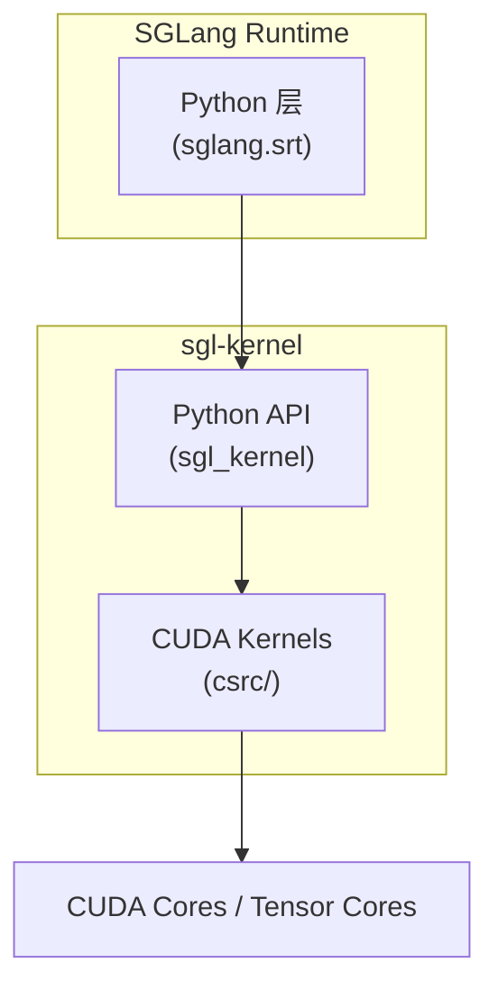
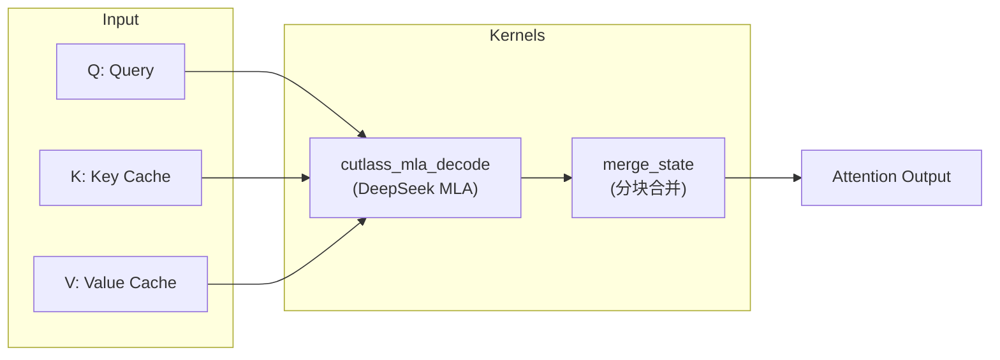
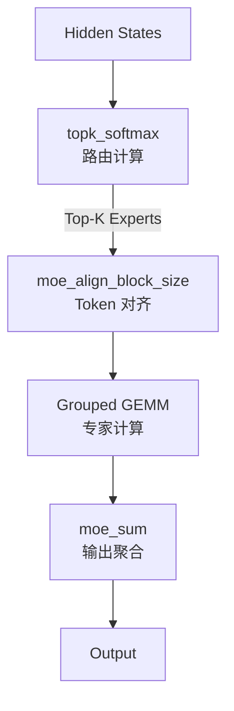
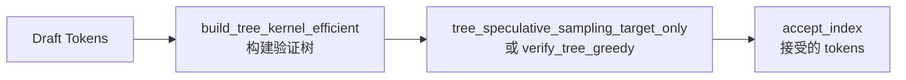

# SGLang sgl-kernel 架构详解

> **默认场景**: Qwen/Qwen3-VL-235B-A22B-Thinking 多模态模型
>
> **启用特性**: PD 分离 + Chunked Prefill + ViT DP + Overlap Schedule + 多模态缓存

## 1. 概览

`sgl-kernel` 是 SGLang 的高性能 CUDA kernel 库，提供 LLM 推理所需的核心计算原语。



### 1.1 目录结构

```
sgl-kernel/
├── csrc/                    # CUDA 源码
│   ├── allreduce/           # 集合通信
│   ├── attention/           # Attention 相关
│   ├── elementwise/         # 逐元素操作
│   ├── gemm/                # 矩阵乘法
│   ├── moe/                 # Mixture-of-Experts
│   ├── quantization/        # 量化
│   ├── speculative/         # 投机解码
│   ├── kvcacheio/           # KV Cache I/O
│   ├── mamba/               # Mamba 状态空间模型
│   ├── memory/              # 内存操作
│   └── common_extension.cc  # PyTorch 扩展注册
├── python/sgl_kernel/       # Python 接口
│   ├── __init__.py          # 导出所有 API
│   ├── attention.py         # Attention API
│   ├── gemm.py              # GEMM API
│   ├── moe.py               # MoE API
│   ├── sampling.py          # 采样 API
│   └── ...
├── benchmark/               # 性能测试
├── tests/                   # 单元测试
└── CMakeLists.txt           # 构建配置
```

### 1.2 Kernel 分类

| 类别 | 功能 | 关键 API |
|------|------|----------|
| **Attention** | MLA/MHA 解码 | `cutlass_mla_decode`, `merge_state` |
| **GEMM** | 矩阵乘法 | `fp8_scaled_mm`, `gptq_marlin_gemm` |
| **MoE** | 专家路由/计算 | `topk_softmax`, `moe_align_block_size` |
| **Elementwise** | RMSNorm, RoPE, 激活 | `rmsnorm`, `silu_and_mul` |
| **Sampling** | Top-K/P 采样 | `top_k_top_p_sampling_from_probs` |
| **Quantization** | FP8/INT8 量化 | `sgl_per_token_quant_fp8` |
| **AllReduce** | 分布式通信 | `init_custom_ar`, `all_reduce` |

## 2. 核心 Kernel 详解

### 2.1 Attention Kernels



**关键函数**:
```python
# MLA Decode (DeepSeek 系列)
cutlass_mla_decode(
    out, q_nope, q_pe, kv_c_and_k_pe_cache,
    seq_lens, page_table, workspace, sm_scale, num_kv_splits
)

# 状态合并 (多 chunk 场景)
merge_state(v_a, s_a, v_b, s_b, v_merged, s_merged)
```

### 2.2 GEMM Kernels (矩阵乘法)

支持多种量化格式:

| 格式 | API | 适用场景 |
|------|-----|----------|
| FP8 | `fp8_scaled_mm` | 高性能推理 |
| FP8 Block | `fp8_blockwise_scaled_mm` | 块级量化 |
| INT8 | `int8_scaled_mm` | 通用量化 |
| FP4 | `cutlass_scaled_fp4_mm` | SM100+ (Blackwell) |
| GPTQ | `gptq_marlin_gemm` | GPTQ 模型 |
| AWQ | `awq_dequantize` | AWQ 模型 |

```python
# FP8 矩阵乘法
result = fp8_scaled_mm(
    mat_a, mat_b,           # FP8 输入
    scales_a, scales_b,     # 缩放因子
    out_dtype,              # 输出类型 (BF16/FP16)
    bias                    # 可选偏置
)

# GPTQ Marlin 优化
output = gptq_marlin_gemm(
    a, c_or_none,
    b_q_weight, b_scales, global_scale_or_none,
    b_zeros_or_none, g_idx_or_none, perm_or_none,
    workspace, b_q_type_id, size_m, size_n, size_k,
    is_k_full, use_atomic_add, use_fp32_reduce, is_zp_float
)
```

### 2.3 MoE Kernels



**核心函数**:
```python
# 路由 Top-K
topk_softmax(
    topk_weights,      # 输出: Top-K 权重
    topk_indices,      # 输出: Top-K 专家 ID
    gating_output,     # 输入: Router 输出
    renormalize,       # 是否重新归一化
    moe_softcapping,   # Softcap 值
    correction_bias    # 校正偏置 (可选)
)

# Token 对齐 (按块大小)
moe_align_block_size(
    topk_ids, num_experts, block_size,
    sorted_token_ids,     # 输出: 排序后的 token ID
    experts_ids,          # 输出: 专家 ID
    num_tokens_post_pad,  # 输出: padding 后的 token 数
    cumsum_buffer,
    pad_sorted_token_ids
)

# FP8 Grouped GEMM
fp8_blockwise_scaled_grouped_mm(
    output, a_ptrs, b_ptrs, out_ptrs,
    a_scales_ptrs, b_scales_ptrs,
    a, b, scales_a, scales_b,
    stride_a, stride_b, stride_c,
    layout_sfa, layout_sfb,
    problem_sizes, expert_offsets, workspace
)
```

### 2.4 Elementwise Kernels

```python
# RMSNorm
rmsnorm(output, input, weight, eps, enable_pdl)

# 融合 Add + RMSNorm
fused_add_rmsnorm(input, residual, weight, eps, enable_pdl)

# RoPE 位置编码
apply_rope_pos_ids_cos_sin_cache(
    q, k, q_rope, k_rope, cos_sin_cache, pos_ids,
    interleave, enable_pdl, v, k_buffer, v_buffer, kv_cache_loc
)

# 激活函数
silu_and_mul(out, input)       # SiLU * Gate
gelu_tanh_and_mul(out, input)  # GeLU TANH * Gate
gelu_and_mul(out, input)       # GeLU * Gate
```

### 2.5 Sampling Kernels

```python
# Top-K + Top-P 采样
top_k_top_p_sampling_from_probs(
    probs, output, maybe_indices,
    maybe_top_k_arr, top_k_val,
    maybe_top_p_arr, top_p_val,
    deterministic, gen
)

# Min-P 采样
min_p_sampling_from_probs(
    probs, output, maybe_indices,
    maybe_min_p_arr, min_p_val,
    deterministic, gen
)

# Renormalization
top_k_renorm_probs(probs, renorm_probs, maybe_top_k_arr, top_k_val)
top_p_renorm_probs(probs, renorm_probs, maybe_top_p_arr, top_p_val)
```

### 2.6 AllReduce Kernels

```python
# 初始化自定义 AllReduce
fa_id = init_custom_ar(ipc_tensors, rank_data, rank, full_nvlink)

# 执行 AllReduce
all_reduce(fa_id, inp, out, reg_buffer, reg_buffer_sz_bytes)

# MSCCLPP 后端
ctx = mscclpp_init_context(unique_id, rank, world_size, scratch, put_buffer, ...)
mscclpp_allreduce(ctx, inp, out, nthreads, nblocks)
```

## 3. 量化支持

### 3.1 支持的量化格式

| 格式 | 精度 | API | 硬件要求 |
|------|------|-----|----------|
| FP8 E4M3 | 8-bit | `sgl_per_token_quant_fp8` | SM89+ |
| FP8 Block | 8-bit | `sgl_per_token_group_quant_8bit` | SM89+ |
| INT8 | 8-bit | `int8_scaled_mm` | All |
| FP4 (NVFP4) | 4-bit | `scaled_fp4_quant` | SM100+ |
| GPTQ | 4-bit | `gptq_marlin_gemm` | All |
| AWQ | 4-bit | `awq_dequantize` | All |
| GGUF | 混合 | `ggml_dequantize` | All |

### 3.2 量化 API

```python
# FP8 Per-Tensor 量化
sgl_per_tensor_quant_fp8(input, output_q, output_s, is_static)

# FP8 Per-Token 量化
sgl_per_token_quant_fp8(input, output_q, output_s)

# FP8 Per-Group 量化
sgl_per_token_group_quant_8bit(
    input, output_q, output_s,
    group_size, eps, fp8_min, fp8_max, scale_ue8m0
)

# NVFP4 量化 (Blackwell)
scaled_fp4_quant(output, input, output_scale, input_scale)
```

## 4. 投机解码 Kernels



```python
# 树结构投机采样
tree_speculative_sampling_target_only(
    predicts, accept_index, accept_token_num,
    candidates, retrive_index, retrive_next_token, retrive_next_sibling,
    uniform_samples, uniform_samples_for_final_sampling,
    target_probs, draft_probs,
    threshold_single, threshold_acc, deterministic
)

# 贪婪验证
verify_tree_greedy(
    predicts, accept_index, accept_token_num,
    candidates, retrive_index, retrive_next_token, retrive_next_sibling,
    target_predict
)

# 高效树构建
build_tree_kernel_efficient(
    parent_list, selected_index, verified_seq_len,
    tree_mask, positions, retrive_index,
    retrive_next_token, retrive_next_sibling,
    topk, depth, draft_token_num, tree_mask_mode
)
```

## 5. KV Cache I/O

PD 分离场景下的 KV 传输优化:

```python
# 单层传输
transfer_kv_per_layer(
    src_k, dst_k, src_v, dst_v,
    src_indices, dst_indices,
    item_size, block_quota, num_warps_per_block
)

# 所有层传输
transfer_kv_all_layer(
    src_k_layers, dst_k_layers,
    src_v_layers, dst_v_layers,
    src_indices, dst_indices,
    item_size, num_layers, block_quota, num_warps_per_block
)

# MLA 格式传输
transfer_kv_per_layer_mla(
    src, dst, src_indices, dst_indices,
    item_size, block_quota, num_warps_per_block
)
```

## 6. 使用示例

### 6.1 Python 调用

```python
import torch
import sgl_kernel

# RMSNorm
output = torch.empty_like(input)
sgl_kernel.rmsnorm(output, input, weight, eps=1e-6, enable_pdl=True)

# FP8 GEMM
result = sgl_kernel.fp8_scaled_mm(
    a_fp8, b_fp8,
    a_scale, b_scale,
    out_dtype=torch.bfloat16,
    bias=None
)

# Top-K + Top-P 采样
output = torch.empty(batch_size, dtype=torch.int32, device="cuda")
sgl_kernel.top_k_top_p_sampling_from_probs(
    probs, output, None,
    None, 50,    # top_k
    None, 0.9,   # top_p
    deterministic=True, gen=None
)
```

### 6.2 torch.ops 调用

```python
# 通过 torch.ops 调用 (支持 torch.compile)
torch.ops.sgl_kernel.rmsnorm(output, input, weight, eps, enable_pdl)
torch.ops.sgl_kernel.silu_and_mul(out, input)
torch.ops.sgl_kernel.all_reduce(fa_id, inp, out, reg_buffer, sz)
```

## 7. 构建与安装

```bash
# 安装 release 版本
pip install sgl-kernel --upgrade

# 从源码构建
cd sgl-kernel
make build

# 构建要求
# - CMake >= 3.31
# - Python >= 3.10
# - PyTorch 2.9.1
# - CUDA Toolkit (匹配版本)
```

## 8. 性能优化技巧

### 8.1 PDL (Programmatic Dependent Launch)

```python
# 启用 PDL 减少 kernel launch 开销
sgl_kernel.rmsnorm(output, input, weight, eps, enable_pdl=True)
sgl_kernel.fused_add_rmsnorm(input, residual, weight, eps, enable_pdl=True)
```

### 8.2 CUDA Graph 兼容

大多数 kernel 支持 CUDA Graph 捕获:
```python
# 在 graph capture 期间正常调用
with torch.cuda.graph(graph):
    sgl_kernel.silu_and_mul(out, input)
    # ...
```

## 9. 下一步

- **16**: Attention kernel 详解 (FlashAttention, MLA, Sparse)
- **17**: MoE kernel 详解 (路由, Grouped GEMM)
