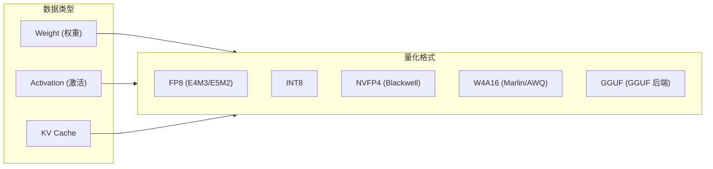
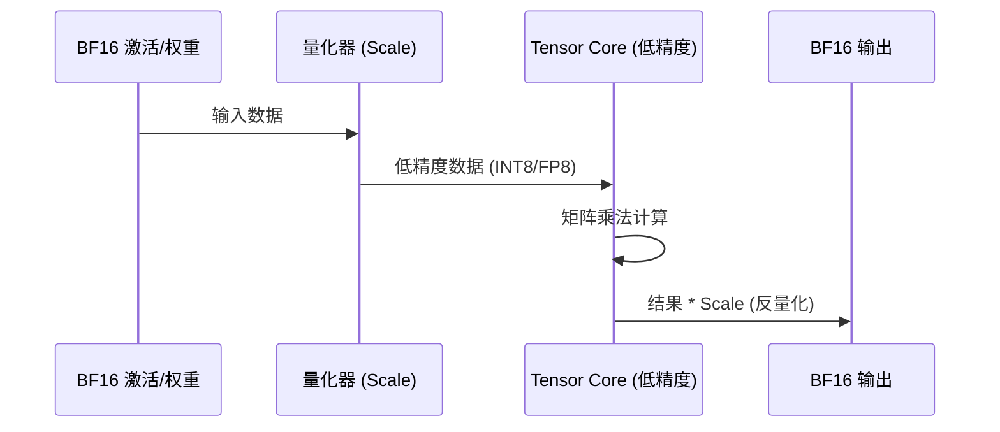

# SGLang 量化实现详解

> **默认场景**: DeepSeek-V3 (FP8), Llama-3-70B (Marlin/GPTQ/AWQ), GGUF 模型
>
> **核心组件**: FP8/INT8/FP4/Marlin/QServe/GGUF

## 1. 概览

SGLang 提供了端到端的量化支持，涵盖了从激活量化、权重量化到 KV Cache 量化的完整链路。



## 2. 量化基本原理

量化的核心是将高精度（如 FP16/BF16, 16-bit）的数值映射到低精度（如 INT8, FP8, INT4, 4-8 bit）的空间。

### 2.1 映射公式

对于线性量化（Linear Quantization），公式通常为：

$$Q = \text{clip}(\text{round}(\frac{X}{Scale}) + \text{ZeroPoint}, Q_{min}, Q_{max})$$

*   **Scale**: 缩放因子，决定了量化步长。
*   **ZeroPoint**: 零点，用于处理非对称分布（SGLang 中多用对称量化，ZeroPoint=0）。
*   **$Q_{min}, Q_{max}$**: 目标格式的取值范围（如 INT8 为 -128 到 127）。

### 2.2 模型执行过程

量化模型的执行并非简单的全程低精度，而是一个混合精度的过程：

1.  **量化 (Quantize)**: 在算子输入端，将 BF16 的激活（Activation）实时转换为低精度格式。
2.  **计算 (Compute)**: 使用专门的硬件（Tensor Core）执行低精度矩阵乘法（如 FP8 MMA 或 INT8 IMMA）。
3.  **反量化 (Dequantize)**: 得到结果后，乘以 Scale 恢复回 BF16 精度，供后续非线性算子（如 LayerNorm, Softmax）使用。



## 3. 动态量化 vs 静态量化

SGLang 同时支持动态和静态量化，两者的区别在于 **Scale 的生成时机**。

| 特性 | 动态量化 (Dynamic) | 静态量化 (Static) |
| :--- | :--- | :--- |
| **Scale 来源** | 运行时根据当前 Batch 的值计算 | 离线校正（Calibration）提前算好 |
| **计算开销** | 略高（需统计最大值/均值） | 极低（直接读取常量因子） |
| **精度** | **更高**（能自适应处理离群值） | 略低（可能因校正数据分布不均导致精度下降） |
| **SGLang API** | `is_static=False` | `is_static=True` |
| **适用场景** | 激活（Activation） | 权重（Weight）或极稳定的激活 |

## 4. 不同量化策略的对比

| 策略 | 实现方式 | 优势 | 劣势 |
| :--- | :--- | :--- | :--- |
| **W4A16** | 权重 4-bit, 激活 16-bit | 节省显存带宽，几乎不降准 | 计算不加速（需转换回 16-bit） |
| **W8A8** | 权重 8-bit, 激活 8-bit | **计算速度快**（利用 Tensor Core） | 对模型精度有一定要求 |
| **W4A8** | 权重 4-bit, 激活 8-bit | 极致平衡，带宽与计算同时加速 | 实现复杂度高 |

## 5. 场景化选择指南

| 场景 | 推荐方案 | 理由 |
| :--- | :--- | :--- |
| **显存不足 (内存受限)** | **AWQ / Marlin (4-bit)** | 核心矛盾是显存大小，4-bit 能显著减少权重占用。 |
| **追求高吞吐 (计算受限)** | **FP8 (W8A8)** | 核心矛盾是计算速度，FP8 在 H100 上吞吐量是 BF16 的 2 倍。 |
| **长文本 / 大 Batch** | **FP8 KV Cache** | 核心矛盾是 KV Cache 占用，FP8 能让缓存容量翻倍。 |
| **追求单次请求低延迟** | **静态量化 (Static)** | 减少运行时动态统计 Scale 的延迟。 |
| **模型对量化异常敏感** | **动态量化 (Dynamic)** | 通过实时计算 Scale 保障每一层输出的范围准确性。 |

---

## 6. FP8 量化 (主流推荐)

FP8 是目前推断性能与精度平衡最好的格式，特别是在 H100 (SM90) 架构上。

### 6.1 缩放策略 (Scaling)
- **Per-Tensor**: 整个张量共享一个缩放因子。
- **Per-Token**: 每个 token 拥有独立的缩放因子（动态量化）。
- **Per-Block / Group**: 按块（如 1x128）设置缩放因子，提供更高的精度。

### 6.2 核心算子
```python
# gemm.py
sgl_per_token_quant_fp8(input, output_q, output_s)
sgl_per_tensor_quant_fp8(input, output_q, output_s, is_static)
sgl_per_token_group_quant_8bit(input, output_q, output_s, group_size, ...)
```

## 7. 权重量化 (W4A16)

针对显存带宽瓶颈场景，将权重压缩到 4-bit，而保持激活为 16-bit。

### 7.1 Marlin (GPTQ / AWQ 优化)
Marlin 是针对 4-bit 量化权重的高性能 GEMM 实现，支持 GPTQ 和 AWQ 格式。

```python
# gemm.py: gptq_marlin_gemm
# 支持高效的重排 (repack) 和洗牌 (shuffle) 逻辑
gptq_marlin_repack(b_q_weight, perm, size_k, size_n, num_bits)
```

### 7.2 AWQ 反量化
`awq_dequantize` 将 4-bit 权重转换回 FP16/BF16 进行计算，适用于通用后端。

## 8. SM100 (Blackwell) 原生 FP4

在 SM100 架构上，`sgl-kernel` 实现了先进的 NVFP4 (NVIDIA FP4) 支持。

### 8.1 块缩放量化 (Blockscaled Quant)
FP4 需要非常精细的缩放策略。SGLang 实现了 `scaled_fp4_quant`，每 16 个元素共享一个缩放因子。

```python
# gemm.py: scaled_fp4_quant
output, output_scale = scaled_fp4_quant(input, input_global_scale)
```
- **物理布局**: 缩放因子以特殊的经过混洗 (swizzled) 的布局存储，以匹配硬件 MMA 操作。

### 8.2 计算算子
- `cutlass_scaled_fp4_mm`: 标准矩阵乘算法。
- `cutlass_fp4_group_mm`: 针对 MoE 场景的组內矩阵乘。

## 9. QServe 量化 (W4A8)

QServe 是一种 W4A8 (4-bit 权重, 8-bit 激活) 的推理算法，`sgl-kernel` 深度集成了其核心算子。

- `qserve_w4a8_per_chn_gemm`: 每通道量化的 W4A8。
- `qserve_w4a8_per_group_gemm`: 每组量化的 W4A8。

## 10. GGUF 支持

`sgl-kernel` 对 GGUF (llama.cpp 格式) 提供了原生 CUDA 支持。

**文件**: `csrc/quantization/gguf/`

```python
# gguf.py
ggml_dequantize(weight, quant_type, M, N, dtype) # 执行权重量化
ggml_mul_mat_a8(weight, x, quant_type, row)     # A8 表示 8-bit 激活加速
```

- **兼容模式**: 支持多种 GGUF 量化类型（Q4_K, Q5_K, Q8_0 等）。
- **专家加速**: 专门为 GGUF 格式的 MoE 提供了 `ggml_moe_a8` 系列算子。

## 11. 精度与性能对比

| 量化方案 | 激活位宽 | 权重位宽 | 硬件建议 | 特点 |
|----------|----------|----------|----------|------|
| **FP8** | 8 | 8 | SM90/89 | 性能最佳，精度损失几乎为零 |
| **Marlin** | 16 | 4 | SM80+ | 显存占用减半，适合带宽瓶颈模型 |
| **NVFP4** | 4 | 4 | SM100 | Blackwell 终极加速 |
| **QServe** | 8 | 4 | All | 优秀的吞吐量平衡 |
| **GGUF** | 16/8 | 混合 | All | 离线量化生态，多平台兼容 |

## 12. 下一步

- **19**: 采样与生成控制 (Sampling, Logits Processing)
