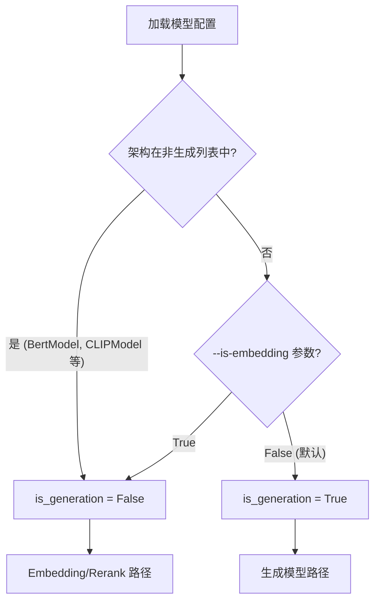
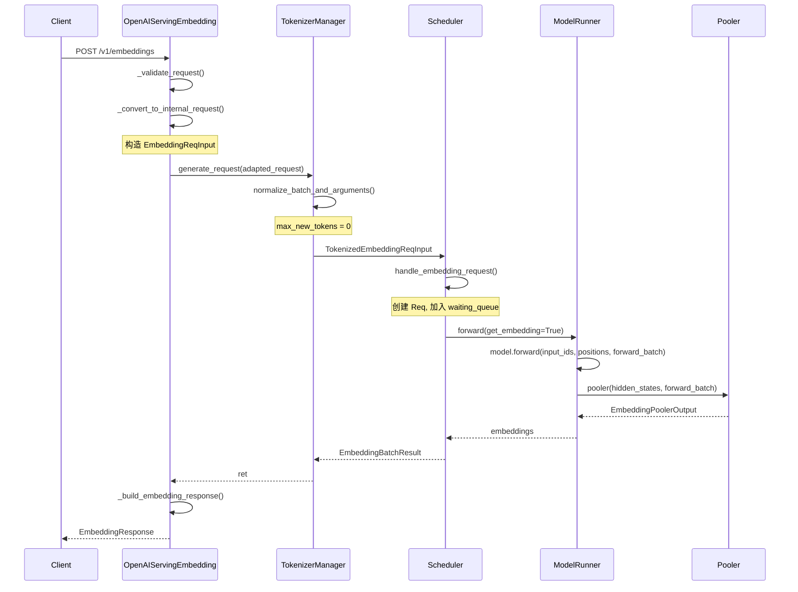
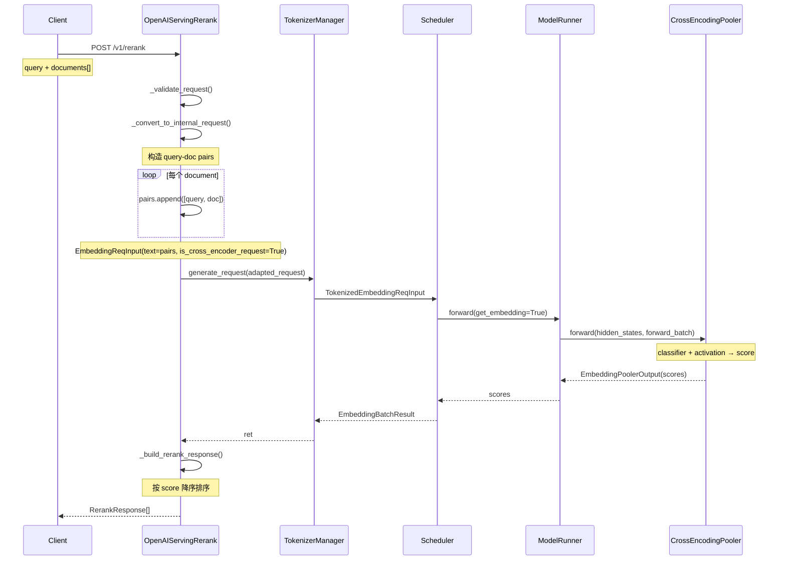
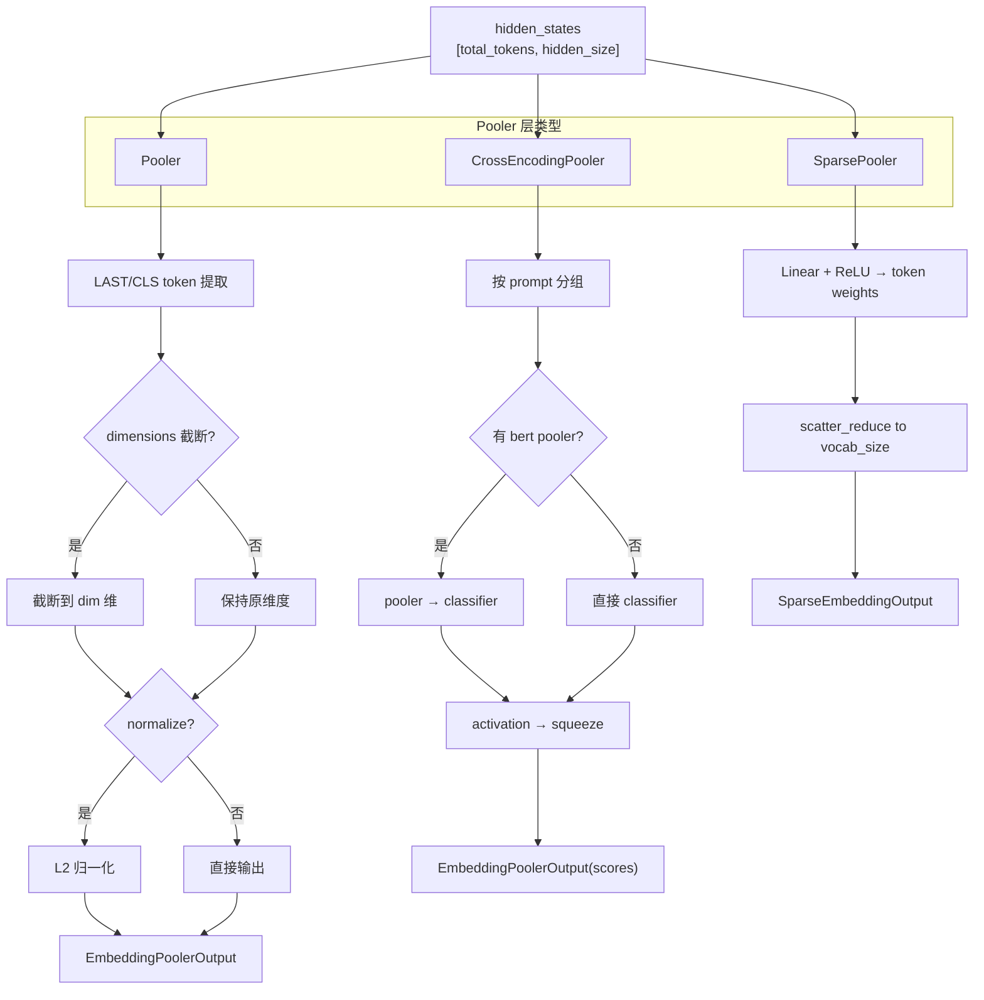
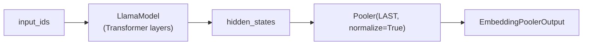
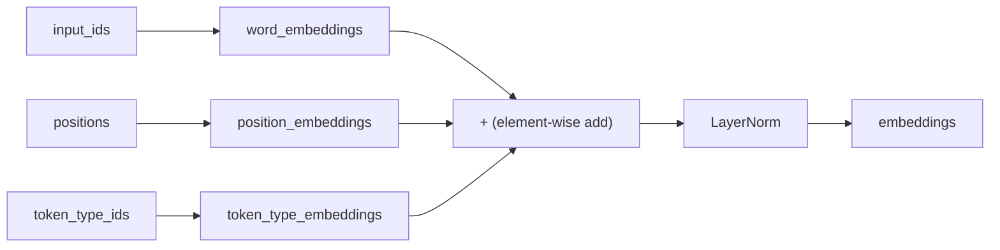
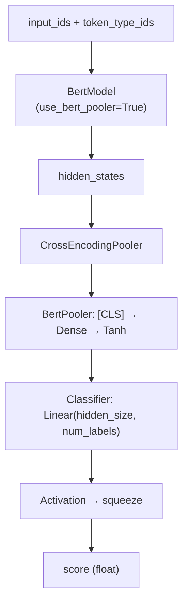
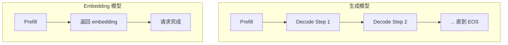

# SGLang Embedding 与 Rerank 模型详解

## 1. 概览

SGLang 除了支持生成式 LLM 推理外，还原生支持 **Embedding** 和 **Rerank** 模型。这两类任务的核心区别在于：

| 特性 | 生成模型 | Embedding 模型 | Rerank 模型 |
|------|---------|---------------|-------------|
| 输出类型 | Token 序列 | 向量 | 分数 |
| Decode 阶段 | 需要多轮 | 不需要 | 不需要 |
| Pooler | 无 | Pooler | CrossEncodingPooler |
| API 端点 | /v1/completions | /v1/embeddings | /v1/rerank |
| 典型模型 | LLaMA, Qwen | BGE, E5, GTE | bge-reranker, cross-encoder |

### 1.1 模型类型判定

**文件**: `srt/configs/model_config.py:1024`

SGLang 通过 `is_generation_model()` 函数判定模型类型：

```python
def is_generation_model(model_architectures: List[str], is_embedding: bool = False):
    # 方式 1: 根据模型架构自动判定
    if (
        "LlamaEmbeddingModel" in model_architectures
        or "MistralModel" in model_architectures
        or "BertModel" in model_architectures
        or "CLIPModel" in model_architectures
        or "XLMRobertaModel" in model_architectures
        or "BertForSequenceClassification" in model_architectures
        # ... 更多非生成架构
    ):
        return False
    # 方式 2: 通过 --is-embedding 参数强制指定
    else:
        return not is_embedding
```



### 1.2 支持的模型架构

| 架构类 | 文件 | 类型 | 说明 |
|--------|------|------|------|
| `LlamaEmbeddingModel` | `models/llama_embedding.py` | Embedding | LLaMA 基础 embedding |
| `MistralModel` | `models/llama_embedding.py` | Embedding | Mistral embedding (复用 LLaMA) |
| `BertModel` | `models/bert.py` | Embedding | BERT 系列 (BGE, GTE 等) |
| `Contriever` | `models/bert.py` | Embedding | Contriever (继承 BertModel) |
| `BertForSequenceClassification` | `models/bert.py` | Rerank | BERT 交叉编码器 |
| `CLIPModel` | `models/clip.py` | Embedding | CLIP 文本+视觉 embedding |
| `XLMRobertaModel` | `models/xlm_roberta.py` | Embedding | 多语言 RoBERTa |
| `XLMRobertaForSequenceClassification` | `models/xlm_roberta.py` | Rerank | 多语言 RoBERTa reranker |

---

## 2. 请求流程

### 2.1 Embedding 请求 (/v1/embeddings)

**文件**: `srt/entrypoints/openai/serving_embedding.py`



核心转换步骤：

1. **输入解析**: `_convert_to_internal_request` 处理三种输入格式：
   - 字符串 → `text` 字段
   - 字符串列表 → `text` 字段 (批量)
   - 整数列表 → `input_ids` 字段 (token IDs)
   - `MultimodalEmbeddingInput` → `text` + `image_data`

2. **EmbeddingReqInput 构造**: 设置 `rid`, `priority`, `dimensions` 参数

3. **TokenizerManager**: 调用 `normalize_batch_and_arguments()` 设置 `max_new_tokens=0`

4. **Scheduler**: 只执行 prefill，不进入 decode 循环

### 2.2 Rerank 请求 (/v1/rerank)

**文件**: `srt/entrypoints/openai/serving_rerank.py`



Rerank 的关键区别：
- 输入为 `[query, document]` 对
- 设置 `is_cross_encoder_request=True`
- 使用 `CrossEncodingPooler` 而非普通 `Pooler`
- 响应按 score 降序排序

### 2.3 多模态 Embedding

SGLang 支持多模态 embedding（如 CLIP），处理流程：

```python
# serving_embedding.py:_convert_to_internal_request
if isinstance(prompt[0], MultimodalEmbeddingInput):
    texts, images = [], []
    for item in prompt:
        texts.append(item.text if item.text is not None else "padding")
        images.append(item.image if item.image is not None else None)
    # 如果有 chat template，使用模板格式化
    if self.template_manager.chat_template_name is not None:
        convs = generate_embedding_convs(texts, images, ...)
```

---

## 3. EmbeddingReqInput 数据结构

**文件**: `srt/managers/io_struct.py:769`

```python
class EmbeddingReqInput(BaseReq, APIServingTimingMixin):
    # 文本输入 - 支持单条、批量、交叉编码对
    text: Optional[Union[List[List[str]], List[str], str]] = None
    # 多模态输入
    image_data: Optional[MultimodalDataInputFormat] = None
    video_data: Optional[MultimodalDataInputFormat] = None
    audio_data: Optional[MultimodalDataInputFormat] = None
    # Token IDs 输入 (与 text 二选一)
    input_ids: Optional[Union[List[List[int]], List[int]]] = None
    # 交叉编码器标记
    is_cross_encoder_request: bool = False
    # Matryoshka 维度截断
    dimensions: Optional[int] = None
    # 请求优先级
    priority: Optional[int] = None
```

### 3.1 normalize_batch_and_arguments

```python
def normalize_batch_and_arguments(self):
    # 1. 验证输入: text / input_ids / image_data 至少一个
    # 2. 推导 batch_size 和 is_single
    if isinstance(self.text, list):
        self.batch_size = len(self.text)
        self.is_single = False
    else:
        self.batch_size = 1

    # 3. 关键: 设置 max_new_tokens = 0 (不生成任何 token)
    self.sampling_params["max_new_tokens"] = 0
```

`max_new_tokens=0` 确保模型只执行一次 prefill forward，不进入 decode 循环。

---

## 4. Pooler 层

Pooler 层是 Embedding/Rerank 模型的核心组件，负责将 hidden_states 转换为最终输出。



### 4.1 Pooler

**文件**: `srt/layers/pooler.py:28`

```python
class Pooler(nn.Module):
    def __init__(self, pooling_type: PoolingType, normalize: bool):
        self.pooling_type = pooling_type  # LAST=0 或 CLS=1
        self.normalize = normalize

    def forward(self, hidden_states, forward_batch):
        # 1. Token 选择
        if self.pooling_type == PoolingType.LAST:
            # 取每个序列的最后一个 token
            last_token_indices = torch.cumsum(forward_batch.extend_seq_lens, dim=0) - 1
            pooled_data = hidden_states[last_token_indices]
        elif self.pooling_type == PoolingType.CLS:
            # 取每个序列的第一个 token ([CLS])
            first_token_flat_indices = torch.zeros_like(prompt_lens)
            first_token_flat_indices[1:] += torch.cumsum(prompt_lens, dim=0)[:-1]
            pooled_data = hidden_states[first_token_flat_indices]

        # 2. Matryoshka 维度截断 (可选)
        if forward_batch.dimensions is not None:
            pooled_data = pooled_data[..., :forward_batch.dimensions[0]]

        # 3. L2 归一化 (可选)
        if self.normalize:
            pooled_data = nn.functional.normalize(pooled_data, p=2, dim=-1)

        return EmbeddingPoolerOutput(embeddings=pooled_data)
```

**Matryoshka Embedding 支持**: 通过 `dimensions` 参数，可以动态截断 embedding 维度，支持 Matryoshka 表示学习的模型（如 nomic-embed）。当批内请求的 dimensions 不同时，返回 `list[Tensor]` 而非单一 Tensor。

### 4.2 CrossEncodingPooler

**文件**: `srt/layers/pooler.py:81`

用于 Rerank 模型，将 hidden_states 转换为相关性分数：

```python
class CrossEncodingPooler(nn.Module):
    def __init__(self, config, classifier, pooler=None):
        self.classifier = classifier       # nn.Linear(hidden_size, num_labels)
        self.pooler = pooler              # 可选的 BertPooler
        self.default_activation_function = get_cross_encoder_activation_function(config)

    def forward(self, hidden_states, forward_batch):
        # 按 prompt 分组处理
        for prompt_len in prompt_lens:
            pooled_data_i = hidden_states[offset:offset+prompt_len]
            if self.pooler is not None:
                final_shape_tensor = self.pooler(pooled_data_i, forward_batch)
            else:
                final_shape_tensor = self.classifier(pooled_data_i)
            pooled_data_lst.append(final_shape_tensor)

        pooled_output = torch.stack(pooled_data_lst)

        if self.pooler is not None:
            pooled_output = self.classifier(pooled_output)

        scores = self.default_activation_function(pooled_output).squeeze(-1)
        return EmbeddingPoolerOutput(embeddings=scores)
```

### 4.3 SparsePooler

**文件**: `srt/layers/sparse_pooler.py:16`

用于稀疏检索模型（如 SPLADE），在词表空间生成稀疏向量：

```python
class SparsePooler(nn.Module):
    def __init__(self, config):
        self.vocab_size = config.vocab_size
        self.sparse_linear = nn.Linear(config.hidden_size, 1)

    def forward(self, hidden_states, forward_batch):
        # 1. 计算每个 token 的权重
        token_weights = F.relu(self.sparse_linear(hidden_states)).squeeze(-1)

        # 2. 创建 batch 索引
        batch_indices = torch.repeat_interleave(
            torch.arange(len(forward_batch.extend_seq_lens), ...),
            forward_batch.extend_seq_lens
        )

        # 3. scatter_reduce 到词表空间 (max pooling)
        sparse_embedding = torch.zeros(batch_size, self.vocab_size, ...)
        flat_indices = batch_indices * self.vocab_size + forward_batch.input_ids
        sparse_embedding.view(-1).scatter_reduce_(0, flat_indices, token_weights, reduce="amax")

        return SparseEmbeddingOutput(embeddings=sparse_embedding)
```

---

## 5. 模型实现细节

### 5.1 LlamaEmbeddingModel

**文件**: `srt/models/llama_embedding.py:14`

最简单的 embedding 模型实现，复用生成式 LlamaModel 的 transformer 层：

```python
class LlamaEmbeddingModel(nn.Module):
    def __init__(self, config, quant_config=None, prefix=""):
        self.model = LlamaModel(config, quant_config=quant_config, ...)
        self.pooler = Pooler(pooling_type=PoolingType.LAST, normalize=True)

    @torch.no_grad()
    def forward(self, input_ids, positions, forward_batch, input_embeds=None, get_embedding=True):
        assert get_embedding  # 只能用于 embedding
        hidden_states = self.model(input_ids, positions, forward_batch, input_embeds)
        return self.pooler(hidden_states, forward_batch)
```



特点：
- `@torch.no_grad()`: embedding 推理不需要梯度
- 使用 LAST token pooling + L2 归一化
- `MistralModel` 直接继承 `LlamaEmbeddingModel`，无需额外代码

### 5.2 BertModel 系列

**文件**: `srt/models/bert.py`

BERT 实现是最复杂的 embedding 模型，具有以下特点：

#### 5.2.1 BertEmbedding

BERT 的输入嵌入由三部分相加：

```python
class BertEmbedding(nn.Module):
    def forward(self, input_ids, positions, forward_batch):
        inputs_embeds = self.word_embeddings(input_ids)
        position_embeddings = self.position_embeddings(positions)
        token_type_embeddings = self.token_type_embeddings(token_type_ids)
        embeddings = inputs_embeds + token_type_embeddings + position_embeddings
        embeddings = self.LayerNorm(embeddings)
        return embeddings
```



#### 5.2.2 双向注意力

BERT 使用 **双向注意力** (非因果)：

```python
self.attn = RadixAttention(
    ...,
    attn_type=AttentionType.ENCODER_ONLY,  # 双向注意力
)
```

`ENCODER_ONLY` 注意力类型使得每个 token 可以关注序列中的所有 token，而非仅关注之前的 token。

#### 5.2.3 BertForSequenceClassification

用于 Rerank 任务的 BERT 变体：

```python
class BertForSequenceClassification(nn.Module):
    def __init__(self, config, ...):
        self.bert = BertModel(config, use_bert_pooler=True, ...)
        self.classifier = nn.Linear(config.hidden_size, config.num_labels)
        self.pooler = CrossEncodingPooler(config, self.classifier, self.bert.pooler)

    def forward(self, input_ids, positions, forward_batch, ..., get_embedding=True):
        hidden_states = self.bert(input_ids, positions, forward_batch, ...)
        return self.pooler(hidden_states, forward_batch)
```



#### 5.2.4 模型入口

```python
# bert.py 末尾
EntryClass = [BertModel, Contriever, BertForSequenceClassification]
```

### 5.3 CLIPModel

**文件**: `srt/models/clip.py:393`

CLIP 模型同时支持文本和视觉 embedding：

```python
class CLIPModel(nn.Module):
    def __init__(self, config, ...):
        self.text_model = CLIPTextModel(config.text_config, ...)
        self.visual_projection = nn.Linear(config.vision_config.hidden_size,
                                           config.projection_dim, bias=False)
        self.text_projection = nn.Linear(config.text_config.hidden_size,
                                         config.projection_dim, bias=False)
        self.pooler = Pooler(pooling_type=PoolingType.CLS, normalize=True)
```

CLIP 使用 **CLS pooling**（取第一个 token）而非 LAST pooling，并将 hidden_states 投影到共享的 projection 空间。

---

## 6. ModelRunner 集成

**文件**: `srt/model_executor/model_runner.py`

ModelRunner 通过 `is_generation` 标志来区分路径：

```python
# model_runner.py:1947 (forward_extend)
if not self.is_generation:
    kwargs["get_embedding"] = True

logits_output_or_pp_proxy_tensors = self.model.forward(
    buffers.input_ids,
    forward_batch.positions,
    forward_batch,
    **kwargs
)
```

Embedding 路径的关键区别：
- **传入 `get_embedding=True`**: 告诉模型返回 pooled embedding 而非 logits
- **无 sampling**: 不需要 `sample()` 步骤
- **无 logits 处理**: 返回值直接是 `EmbeddingPoolerOutput`

---

## 7. Scheduler 差异

**文件**: `srt/managers/scheduler.py`

### 7.1 请求处理

```python
# scheduler.py:1027 - 请求分发
(TokenizedEmbeddingReqInput, self.handle_embedding_request),
(BatchTokenizedEmbeddingReqInput, self.handle_batch_embedding_request),
```

### 7.2 handle_embedding_request

```python
def handle_embedding_request(self, recv_req: TokenizedEmbeddingReqInput):
    req = Req(
        recv_req.rid,
        recv_req.input_text,
        recv_req.input_ids,
        recv_req.sampling_params,
        token_type_ids=recv_req.token_type_ids,
        priority=recv_req.priority,
        dimensions=recv_req.dimensions,
    )
    # 处理多模态输入
    if recv_req.image_inputs is not None:
        image_inputs = self._get_multimodal_inputs(recv_req.image_inputs)
        if self.pad_input_ids_func:
            req.origin_input_ids = self.pad_input_ids_func(...)
        req.extend_image_inputs(image_inputs)
    # 加入等待队列
    self.waiting_queue.append(req)
```

### 7.3 无 Decode 阶段

Embedding 模型的核心调度差异：



由于 `max_new_tokens=0`，embedding 请求在 prefill 完成后立即标记为完成，不进入 `running_batch` 的 decode 循环。

### 7.4 EmbeddingBatchResult

```python
@dataclass
class EmbeddingBatchResult:
    embeddings: torch.Tensor
    copy_done: Optional[torch.cuda.Event] = None

    def copy_to_cpu(self):
        """在 overlap scheduling 中将 embeddings 拷贝到 CPU"""
        if isinstance(self.embeddings, torch.Tensor):
            self.copy_done = torch.get_device_module(self.embeddings.device).Event()
            self.embeddings = self.embeddings.to("cpu", non_blocking=True)
        else:
            # list[Tensor] 情况 (不同 dimensions)
            self.embeddings = [emb.to("cpu", non_blocking=True) for emb in self.embeddings]
        self.copy_done.record()
```

---

## 8. 配置与启动

### 8.1 服务器参数

| 参数 | 说明 | 默认值 |
|------|------|--------|
| `--is-embedding` | 强制将生成模型作为 embedding 模型运行 | False |
| `--dimensions` | 全局 embedding 维度截断 | None |

### 8.2 启动示例

```bash
# Embedding 模型 (自动检测)
python -m sglang.launch_server --model-path BAAI/bge-large-en-v1.5 --port 30000

# 生成模型作为 Embedding 运行
python -m sglang.launch_server --model-path meta-llama/Llama-3-8B --port 30000 --is-embedding

# Rerank 模型
python -m sglang.launch_server --model-path BAAI/bge-reranker-v2-m3 --port 30000
```

### 8.3 API 调用

#### Embedding 请求

```bash
curl http://localhost:30000/v1/embeddings \
  -H "Content-Type: application/json" \
  -d '{
    "model": "BAAI/bge-large-en-v1.5",
    "input": ["Hello world", "How are you"],
    "dimensions": 512
  }'
```

响应格式：
```json
{
  "data": [
    {"embedding": [0.123, -0.456, ...], "index": 0},
    {"embedding": [0.789, -0.012, ...], "index": 1}
  ],
  "model": "BAAI/bge-large-en-v1.5",
  "usage": {"prompt_tokens": 10, "total_tokens": 10}
}
```

#### Rerank 请求

```bash
curl http://localhost:30000/v1/rerank \
  -H "Content-Type: application/json" \
  -d '{
    "query": "What is machine learning?",
    "documents": [
      "Machine learning is a branch of AI",
      "The weather is nice today",
      "Deep learning uses neural networks"
    ]
  }'
```

响应格式（按 score 降序）：
```json
[
  {"score": 0.95, "document": "Machine learning is a branch of AI", "index": 0},
  {"score": 0.82, "document": "Deep learning uses neural networks", "index": 2},
  {"score": 0.12, "document": "The weather is nice today", "index": 1}
]
```

---

## 9. 关键文件索引

| 文件 | 说明 |
|------|------|
| `srt/layers/pooler.py` | Pooler, CrossEncodingPooler |
| `srt/layers/sparse_pooler.py` | SparsePooler |
| `srt/entrypoints/openai/serving_embedding.py` | /v1/embeddings 处理 |
| `srt/entrypoints/openai/serving_rerank.py` | /v1/rerank 处理 |
| `srt/managers/io_struct.py:769` | EmbeddingReqInput 数据结构 |
| `srt/configs/model_config.py:1024` | is_generation_model() |
| `srt/models/llama_embedding.py` | LlamaEmbeddingModel |
| `srt/models/bert.py` | BertModel, BertForSequenceClassification |
| `srt/models/clip.py` | CLIPModel |
| `srt/model_executor/model_runner.py` | get_embedding=True 路径 |
| `srt/managers/scheduler.py` | handle_embedding_request |
