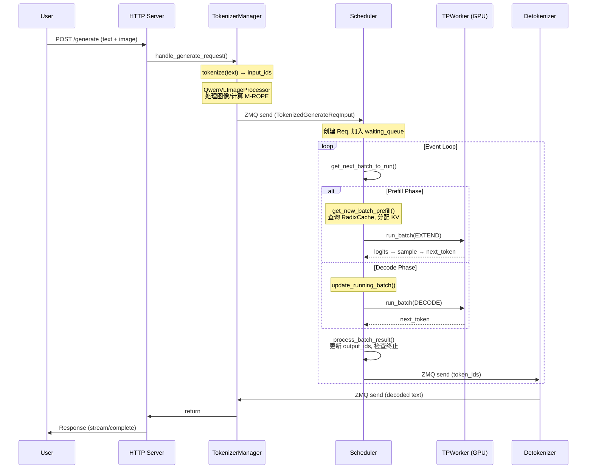

# SGLang 系统架构详解

> **默认场景**: Qwen/Qwen3-VL-235B-A22B-Thinking 多模态模型
>
> **启用特性**: PD 分离 + Chunked Prefill + ViT DP + Overlap Schedule + 多模态缓存

## 1. 进程模型

SGLang 采用多进程架构，核心进程包括：

```
┌─────────────────────────────────────────────────────────────────┐
│                        Main Process                              │
│  ┌─────────────┐  ┌─────────────────┐  ┌──────────────────┐    │
│  │ HTTP Server │──│ TokenizerManager │──│ TemplateManager  │    │
│  │  (FastAPI)  │  │   (tokenize)     │  │  (chat template) │    │
│  └─────────────┘  └────────┬────────┘  └──────────────────┘    │
│                            │ ZMQ                                 │
└────────────────────────────┼────────────────────────────────────┘
                             │
        ┌────────────────────┴────────────────────┐
        │                                          │
        ▼                                          ▼
┌───────────────────┐                    ┌─────────────────────┐
│ Scheduler Process │                    │ Detokenizer Process │
│  ┌─────────────┐  │                    │  ┌───────────────┐  │
│  │  Scheduler  │  │                    │  │ Detokenizer   │  │
│  │  (调度批次)  │  │◄───────────────────│  │  (解码token)  │  │
│  └──────┬──────┘  │       ZMQ          │  └───────────────┘  │
│         │         │                    └─────────────────────┘
│  ┌──────▼──────┐  │
│  │  TPWorker   │  │
│  │ (模型执行)   │  │
│  └─────────────┘  │
└───────────────────┘
```

### 1.1 各进程职责

| 进程 | 组件 | 职责 |
|------|------|------|
| Main | HTTP Server | 接收 HTTP/gRPC 请求 |
| Main | TokenizerManager | 文本分词、多模态预处理 (Qwen3-VL 图像/视频处理) |
| Subprocess | Scheduler | 批次调度、GPU 执行 |
| Subprocess | Detokenizer | token 解码为文本 |

### 1.2 进程间通信

使用 **ZMQ (ZeroMQ)** 进行进程间通信：
- Main → Scheduler: 发送 tokenized 请求
- Scheduler → Detokenizer: 发送生成的 token IDs
- Detokenizer → Main: 发送解码后的文本

**关键代码位置**:
- 进程启动: `srt/entrypoints/engine.py:_launch_subprocesses()` (L900)
- ZMQ 通信: `srt/managers/tokenizer_communicator_mixin.py`

## 2. 核心组件

### 2.1 TokenizerManager (主进程)

**文件**: `srt/managers/tokenizer_manager.py`

职责：
1. 接收原始请求 (文本 + 多模态数据)
2. Tokenize 文本
3. 处理多模态输入 (图像/视频/音频)
4. 发送 TokenizedGenerateReqInput 给 Scheduler
5. 接收并返回结果

```python
# 核心类
class TokenizerManager:
    def __init__(self, server_args, port_args):
        self.tokenizer = get_tokenizer(...)  # 加载 tokenizer
        self.mm_processor = get_mm_processor(...)  # 多模态处理器 (如 QwenVLImageProcessor)
```

**Qwen3-VL 多模态处理器**: `srt/multimodal/processors/qwen_vl.py:QwenVLImageProcessor` (L223)

```python
# Qwen3-VL 处理器支持的模型
class QwenVLImageProcessor(SGLangBaseProcessor):
    models = [
        Qwen2VLForConditionalGeneration,
        Qwen2_5_VLForConditionalGeneration,
        Qwen3VLForConditionalGeneration,  # Qwen3-VL
        Qwen3VLMoeForConditionalGeneration,
        Qwen3OmniMoeForConditionalGeneration,
    ]
```

### 2.2 Scheduler (子进程)

**文件**: `srt/managers/scheduler.py`

职责：
1. 管理请求队列 (waiting_queue, running_batch)
2. 调度 Prefill/Decode 批次
3. 管理 KV Cache
4. 调用 TPWorker 执行模型前向

```python
# 核心类
class Scheduler:
    def __init__(self, ...):
        self.waiting_queue = []      # 等待队列
        self.running_batch = None    # 正在运行的批次
        self.tree_cache = RadixCache(...)  # 前缀缓存
        self.tp_worker = TPWorker(...)     # 模型执行器
```

### 2.3 TPWorker (Scheduler 内)

**文件**: `srt/managers/tp_worker.py`

职责：
1. 加载模型权重
2. 执行模型前向传播
3. 管理 CUDA Graph

### 2.4 DetokenizerManager (子进程)

**文件**: `srt/managers/detokenizer_manager.py`

职责：
1. 接收 token IDs
2. 解码为文本
3. 处理流式输出

## 3. 事件循环 (event_loop_overlap)

SGLang 默认使用 **overlap 模式** 的事件循环，通过 CPU/GPU 重叠执行来提高吞吐量。

**文件**: `srt/managers/scheduler.py:event_loop_overlap()` (L1099)

### 3.1 Overlap 机制原理

```
时间线:
├── Batch N-1 ──────────────────────┤
│   GPU: forward()                   │
│                                    │
│        ├── Batch N ───────────────────────────┤
│        │   CPU: recv_requests()                │
│        │   CPU: get_next_batch_to_run()        │
│        │   CPU: process_batch_result(N-1)      │  ← 处理上一批结果
│        │   GPU: forward()                      │
│        │                                       │
│        │        ├── Batch N+1 ────────────────────────┤
│        │        │   CPU: recv_requests()               │
│        │        │   ...                                │
```

**核心思想**: 当 GPU 执行当前批次的 forward 时，CPU 同时处理上一批次的结果，实现流水线并行。

### 3.2 event_loop_overlap 详细代码分析

```python
# srt/managers/scheduler.py:1099
@DynamicGradMode()
def event_loop_overlap(self):
    """A scheduler loop that overlaps the CPU processing and GPU computation."""

    # result_queue 用于存储待处理的 (batch, result) 对
    # 关键: 结果不会立即处理，而是延迟到下一轮循环
    self.result_queue: Deque[
        Tuple[ScheduleBatch, Union[GenerationBatchResult, EmbeddingBatchResult]]
    ] = deque()

    def pop_and_process():
        # 从队列取出并处理上一批结果
        tmp_batch, tmp_result = self.result_queue.popleft()
        self.process_batch_result(tmp_batch, tmp_result)

    while True:
        # ========== 阶段1: 接收新请求 ==========
        recv_reqs = self.recv_requests()
        self.process_input_requests(recv_reqs)
        if self._engine_paused:
            continue

        # ========== 阶段2: 获取下一个批次 ==========
        # 统一入口: get_next_batch_to_run()
        # 内部会调用 get_new_batch_prefill() 或 update_running_batch()
        batch = self.get_next_batch_to_run()
        self.cur_batch = batch

        # 检查是否需要禁用 overlap (如连续 prefill)
        disable_overlap_for_batch = self.is_disable_overlap_for_batch(batch)

        # 如果需要禁用 overlap，立即处理上一批结果
        if disable_overlap_for_batch:
            pop_and_process()

        # ========== 阶段3: 启动当前批次的 GPU 计算 ==========
        if batch:
            batch_result = self.run_batch(batch)
            # 将结果加入队列，延迟处理
            self.result_queue.append((batch.copy(), batch_result))
        else:
            batch_result = None

        # ========== 阶段4: 处理上一批结果 (CPU/GPU 重叠) ==========
        if self.last_batch:
            if not disable_overlap_for_batch:
                # 关键: 在 GPU 执行当前 batch 的同时，CPU 处理上一批结果
                pop_and_process()
        elif batch is None:
            # 空闲时执行自检
            self.self_check_during_idle()

        # ========== 阶段5: 启动采样 (如需要) ==========
        if self.is_generation:
            self.launch_batch_sample_if_needed(batch_result)

        # 更新 last_batch
        self.last_batch = batch
```

### 3.3 get_next_batch_to_run() 调度逻辑

**文件**: `srt/managers/scheduler.py:get_next_batch_to_run()` (L1778)

这是调度的核心入口，决定下一个要运行的批次：

```python
def get_next_batch_to_run(self) -> Optional[ScheduleBatch]:
    # 1. 处理 chunked prefill 的请求
    if self.chunked_req:
        # 将 chunked 请求移出当前 batch，释放其 req_pool_idx
        chunked_req_to_exclude.add(self.chunked_req)
        self.tree_cache.cache_unfinished_req(self.chunked_req, chunked=True)
        self.req_to_token_pool.free(self.chunked_req.req_pool_idx)

    # 2. 合并上一轮 prefill 完成的请求到 running_batch
    if self.last_batch and self.last_batch.forward_mode.is_extend():
        self.last_batch.filter_batch(chunked_req_to_exclude=...)
        if not self.last_batch.is_empty() and not self.last_batch.is_prefill_only:
            if self.running_batch.is_empty():
                self.running_batch = self.last_batch
            else:
                self.running_batch.merge_batch(self.last_batch)

    # 3. 尝试获取新的 prefill 批次
    new_batch = self.get_new_batch_prefill()

    # 4. 决定返回 prefill 还是 decode 批次
    if new_batch is not None:
        # 优先运行 prefill
        ret = new_batch
    else:
        # 运行 decode
        if not self.running_batch.is_empty():
            self.running_batch = self.update_running_batch(self.running_batch)
            ret = self.running_batch if not self.running_batch.is_empty() else None
        else:
            ret = None

    return ret
```

**调度优先级**: Prefill > Decode

### 3.4 为什么没有 get_new_batch_decode()?

SGLang 的设计中，decode 批次不需要单独创建函数：
- **Prefill 完成后**，请求自动合并到 `running_batch`
- **update_running_batch()** 负责更新 decode 批次（检查内存、处理 retraction 等）
- `running_batch` 会持续进行 decode 直到请求完成

```
请求生命周期:
waiting_queue → get_new_batch_prefill() → prefill 完成 → 合并到 running_batch
                                                              ↓
                                          update_running_batch() → decode 循环 → 完成
```

## 4. 请求生命周期 (以 Qwen3-VL 多模态请求为例)

一个包含图像的生成请求的完整流程：



**详细步骤分解**:

```
1. 用户请求到达 (包含图像 + 文本)
   │
   ▼
2. HTTP Server 接收 (http_server.py)
   │
   ▼
3. TokenizerManager 处理
   ├─ tokenize(text) → input_ids
   ├─ QwenVLImageProcessor.process_mm_data_async()
   │   ├─ 加载图像/视频数据
   │   ├─ smart_resize() 调整图像尺寸
   │   ├─ 计算 mrope_positions (多模态旋转位置编码)
   │   └─ 构造 MultimodalInputs
   └─ 构造 TokenizedGenerateReqInput
   │
   ▼ ZMQ send
4. Scheduler 接收 (handle_generate_request)
   ├─ 创建 Req 对象
   │   └─ req.multimodal_inputs = MultimodalInputs
   ├─ 加入 waiting_queue
   │
   ▼ 事件循环
5. Scheduler.event_loop_overlap()
   │
   ├─ get_next_batch_to_run()
   │   ├─ get_new_batch_prefill()
   │   │   ├─ 从 waiting_queue 选取请求
   │   │   ├─ 查询 RadixCache (前缀复用)
   │   │   ├─ 分配 KV Cache
   │   │   └─ 构造 ScheduleBatch (forward_mode=EXTEND)
   │   │
   │   └─ 或 update_running_batch() (用于 decode)
   │       ├─ 检查内存，必要时 retract
   │       └─ 准备 decode 批次
   │
   ├─ run_batch(batch)
   │   ├─ batch.get_model_worker_batch() → ModelWorkerBatch
   │   └─ model_worker.forward_batch_generation()
   │       ├─ 模型前向 (包含视觉编码器)
   │       ├─ logits → 采样 → next_token
   │       └─ 返回 GenerationBatchResult
   │
   └─ process_batch_result()
       ├─ 更新 req.output_ids
       ├─ 检查终止条件 (EOS, max_tokens)
       └─ 发送结果到 Detokenizer
   │
   ▼ ZMQ send
6. Detokenizer 解码
   ├─ decode(token_ids) → text
   └─ 发送回 TokenizerManager
   │
   ▼ ZMQ send
7. 返回给用户
```

## 5. 核心数据结构与转换链

SGLang 的批次数据在不同层级有不同的表示，形成完整的转换链：

```
GenerateReqInput → TokenizedGenerateReqInput → Req → ScheduleBatch
    → ModelWorkerBatch → ForwardBatch
```

> **详细说明**: 各数据结构的字段定义、转换方法及生命周期管理见 **02_core_data_structures.md**。

**输出数据**:

```python
# Token 输出 (io_struct.py)
BatchTokenIDOutput:
    rids: List[str]              # 请求 IDs
    output_token_ids: List[List[int]]

# 最终输出 (io_struct.py)
BatchStrOutput:
    rids: List[str]
    output_strs: List[str]       # 解码后的文本
```

## 6. 源码阅读建议

### 6.1 入门顺序

1. **先看 Engine**: `srt/entrypoints/engine.py`
   - 理解进程启动流程
   - `_launch_subprocesses()` 函数

2. **再看 Scheduler 初始化**: `srt/managers/scheduler.py`
   - `__init__()` 方法
   - 理解各组件如何初始化

3. **跟踪一个请求**:
   - `TokenizerManager.handle_generate_request()`
   - `Scheduler.handle_generate_request()`
   - `Scheduler.event_loop_overlap()`

### 6.2 关键函数

| 函数 | 文件 | 行号 | 作用 |
|------|------|------|------|
| `_launch_subprocesses()` | engine.py | ~900 | 启动所有进程 |
| `event_loop_overlap()` | scheduler.py | 1099 | 主调度循环 (默认) |
| `get_next_batch_to_run()` | scheduler.py | 1778 | 获取下一批次 (统一入口) |
| `get_new_batch_prefill()` | scheduler.py | 1861 | 创建 Prefill 批次 |
| `update_running_batch()` | scheduler.py | 2073 | 更新 Decode 批次 |
| `run_batch()` | scheduler.py | 2162 | 执行批次前向 |
| `forward_batch_generation()` | tp_worker.py | - | 模型前向 |

### 6.3 核心数据结构

| 数据结构 | 文件 | 行号 | 说明 |
|----------|------|------|------|
| `Req` | schedule_batch.py | 484 | 请求级别状态 |
| `ScheduleBatch` | schedule_batch.py | 1156 | 调度层批次 |
| `ModelWorkerBatch` | schedule_batch.py | 2189 | Worker 层批次 |
| `ForwardBatch` | forward_batch_info.py | 227 | GPU 层批次 |
| `ForwardMode` | forward_batch_info.py | 70 | 前向模式枚举 |

## 7. 下一步

理解了全局架构后，下一步深入学习：
- **02**: 核心数据结构详解 (`Req`, `ScheduleBatch`, `ModelWorkerBatch`, `ForwardBatch`)
