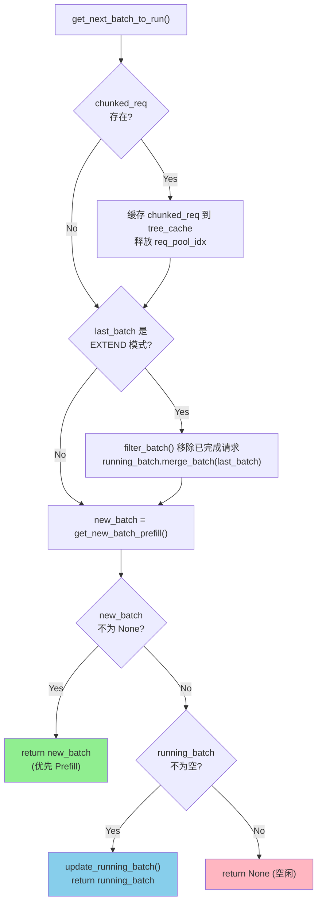

# SGLang 调度系统详解

> **默认场景**: Qwen/Qwen3-VL-235B-A22B-Thinking 多模态模型
>
> **启用特性**: PD 分离 + Chunked Prefill + ViT DP + Overlap Schedule + 多模态缓存

## 1. Scheduler 概览

**文件**: `srt/managers/scheduler.py:234`

Scheduler 是 SGLang 的核心调度器，运行在独立的子进程中，负责：
- 接收 tokenized 请求
- 管理请求队列和批次
- 调度 GPU 执行
- 处理输出结果

### 1.1 类继承结构

```python
class Scheduler(
    SchedulerOutputProcessorMixin,      # 输出处理
    SchedulerUpdateWeightsMixin,        # 权重更新
    SchedulerProfilerMixin,             # 性能分析
    SchedulerMetricsMixin,              # 指标收集
    SchedulerDisaggregationDecodeMixin, # PD 分离 - Decode 端
    SchedulerDisaggregationPrefillMixin,# PD 分离 - Prefill 端
    SchedulerMultiplexMixin,            # PD 复用
    SchedulerRuntimeCheckerMixin,       # 运行时检查
    SchedulerPPMixin,                   # Pipeline Parallel
    SchedulerDPAttnMixin,               # DP Attention
):
```

### 1.2 核心状态

```python
class Scheduler:
    def init_running_status(self):
        # ========== 请求队列 ==========
        self.waiting_queue: List[Req] = []         # 等待 prefill 的请求

        # ========== 批次管理 ==========
        self.running_batch: ScheduleBatch = ScheduleBatch(reqs=[], batch_is_full=False)
                                                   # 正在 decode 的批次
        self.cur_batch: Optional[ScheduleBatch] = None
                                                   # 当前正在执行的批次
        self.last_batch: Optional[ScheduleBatch] = None
                                                   # 上一个执行的批次 (用于 overlap)

        # ========== Chunked Prefill ==========
        self.chunked_req: Req = None               # 正在分块处理的请求

        # ========== 计数器 ==========
        self.forward_ct = 0                        # 前向计数
```

## 2. 事件循环架构

SGLang 提供两种事件循环模式：

```
┌─────────────────────────────────────────────────────────────────────────────┐
│                          事件循环模式选择                                    │
├─────────────────────────────────────────────────────────────────────────────┤
│                                                                              │
│   event_loop_normal()          event_loop_overlap() ★ 默认                  │
│   ├─ 简单串行执行               ├─ CPU/GPU 重叠执行                          │
│   ├─ 无 CUDA Stream 切换       ├─ 使用 forward_stream 和 default_stream     │
│   └─ 适用于调试                 └─ 更高吞吐量                                │
│                                                                              │
│   启用条件:                                                                  │
│   server_args.disable_overlap_schedule = True   False (默认)                │
│                                                                              │
└─────────────────────────────────────────────────────────────────────────────┘
```

### 2.1 event_loop_overlap 详细流程

**文件**: `scheduler.py:1099`

```
┌─────────────────────────────────────────────────────────────────────────────┐
│                     event_loop_overlap 单轮循环                             │
├─────────────────────────────────────────────────────────────────────────────┤
│                                                                              │
│  ┌──────────────────────────────────────────────────────────────────────┐   │
│  │ Phase 1: 接收请求                                                      │   │
│  │ recv_reqs = self.recv_requests()                                      │   │
│  │ self.process_input_requests(recv_reqs)                                │   │
│  └──────────────────────────────────────────────────────────────────────┘   │
│                              │                                               │
│                              ▼                                               │
│  ┌──────────────────────────────────────────────────────────────────────┐   │
│  │ Phase 2: 获取下一批次                                                  │   │
│  │ batch = self.get_next_batch_to_run()                                  │   │
│  │   ├─ 合并上轮 prefill 到 running_batch                                │   │
│  │   ├─ 尝试 get_new_batch_prefill() → 新 prefill 批次                   │   │
│  │   └─ 或 update_running_batch() → decode 批次                          │   │
│  └──────────────────────────────────────────────────────────────────────┘   │
│                              │                                               │
│                              ▼                                               │
│  ┌──────────────────────────────────────────────────────────────────────┐   │
│  │ Phase 3: 检查是否禁用 overlap                                         │   │
│  │ disable_overlap = self.is_disable_overlap_for_batch(batch)            │   │
│  │   └─ 连续 prefill 或 spec+grammar 场景禁用                            │   │
│  │                                                                        │   │
│  │ if disable_overlap:                                                   │   │
│  │     pop_and_process()  # 立即处理上一批结果                           │   │
│  └──────────────────────────────────────────────────────────────────────┘   │
│                              │                                               │
│                              ▼                                               │
│  ┌──────────────────────────────────────────────────────────────────────┐   │
│  │ Phase 4: 执行当前批次 (GPU)                                           │   │
│  │ if batch:                                                             │   │
│  │     batch_result = self.run_batch(batch)         ← GPU 执行           │   │
│  │     self.result_queue.append((batch.copy(), batch_result))            │   │
│  └──────────────────────────────────────────────────────────────────────┘   │
│                              │                                               │
│                              ▼                                               │
│  ┌──────────────────────────────────────────────────────────────────────┐   │
│  │ Phase 5: 处理上一批结果 (CPU) ← 与 Phase 4 重叠                       │   │
│  │ if self.last_batch and not disable_overlap:                           │   │
│  │     pop_and_process()                                                 │   │
│  │       ├─ 更新 req.output_ids                                          │   │
│  │       ├─ 检查终止条件                                                 │   │
│  │       └─ 发送结果到 Detokenizer                                       │   │
│  └──────────────────────────────────────────────────────────────────────┘   │
│                              │                                               │
│                              ▼                                               │
│  ┌──────────────────────────────────────────────────────────────────────┐   │
│  │ Phase 6: 启动采样 (如需要)                                            │   │
│  │ self.launch_batch_sample_if_needed(batch_result)                      │   │
│  └──────────────────────────────────────────────────────────────────────┘   │
│                              │                                               │
│                              ▼                                               │
│                     self.last_batch = batch                                  │
│                     继续下一轮循环                                           │
│                                                                              │
└─────────────────────────────────────────────────────────────────────────────┘
```

### 2.2 Overlap 时序图

```
时间 ──────────────────────────────────────────────────────────────────────────►

      ┌─ Batch N-1 ───────────────────────┐
GPU:  │      forward()                     │
      └────────────────────────────────────┘
              ┌─ Batch N ───────────────────────────┐
      │       │      forward()                       │
      │       └──────────────────────────────────────┘
      │               ┌─ Batch N+1 ──────────────────────────┐
      │       │       │      forward()                        │
      │       │       └───────────────────────────────────────┘
      ▼       ▼       ▼

      ┌───────────────────────┐
CPU:  │ recv + schedule       │
      │ process_result(N-2)   │
      └───────────────────────┘
              ┌───────────────────────┐
              │ recv + schedule       │
              │ process_result(N-1)   │ ← 与 GPU forward(N) 重叠
              └───────────────────────┘
                      ┌───────────────────────┐
                      │ recv + schedule       │
                      │ process_result(N)     │ ← 与 GPU forward(N+1) 重叠
                      └───────────────────────┘
```

### 2.3 result_queue 机制

```python
# scheduler.py:1101
self.result_queue: Deque[Tuple[ScheduleBatch, BatchResult]] = deque()

# 延迟处理: 当前批次的结果放入队列，下一轮循环处理
batch_result = self.run_batch(batch)
self.result_queue.append((batch.copy(), batch_result))

# 下一轮循环时处理
def pop_and_process():
    tmp_batch, tmp_result = self.result_queue.popleft()
    self.process_batch_result(tmp_batch, tmp_result)
```

## 3. 请求处理流程

### 3.1 请求接收与分发

```
┌─────────────────────────────────────────────────────────────────────────────┐
│                          请求接收与分发                                      │
├─────────────────────────────────────────────────────────────────────────────┤
│                                                                              │
│  TokenizerManager ──ZMQ──► recv_requests()                                  │
│                                │                                             │
│                                ▼                                             │
│                        process_input_requests()                              │
│                                │                                             │
│                                ▼                                             │
│                        _request_dispatcher(recv_req)                         │
│                                │                                             │
│               ┌────────────────┼────────────────┐                            │
│               ▼                ▼                ▼                            │
│    TokenizedGenerateReqInput  AbortReq    FlushCacheReqInput                │
│               │                                                              │
│               ▼                                                              │
│    handle_generate_request()                                                 │
│               │                                                              │
│               ├─ 创建 Req 对象                                               │
│               ├─ 处理多模态输入 (Qwen3-VL)                                   │
│               ├─ 验证输入长度                                                │
│               └─ _add_request_to_queue()                                     │
│                       │                                                      │
│       ┌───────────────┼───────────────┐                                      │
│       ▼               ▼               ▼                                      │
│   NULL 模式      PREFILL 模式    DECODE 模式                                 │
│   (普通模式)     (PD分离-P端)    (PD分离-D端)                                │
│       │               │               │                                      │
│       ▼               ▼               ▼                                      │
│  waiting_queue   bootstrap_queue  prealloc_queue                             │
│                                                                              │
└─────────────────────────────────────────────────────────────────────────────┘
```

### 3.2 handle_generate_request 详解

**文件**: `scheduler.py:1409`

```python
def handle_generate_request(self, recv_req: TokenizedGenerateReqInput):
    # 1. 创建 Req 对象
    req = Req(
        recv_req.rid,
        recv_req.input_text,
        recv_req.input_ids,
        recv_req.sampling_params,
        # ... 其他参数 ...
        disagg_mode=self.disaggregation_mode,
    )

    # 2. 处理多模态输入 (Qwen3-VL)
    if recv_req.mm_inputs is not None:
        image_inputs = self._get_multimodal_inputs(recv_req.mm_inputs)
        # 扩展图像 token
        req.origin_input_ids = self.pad_input_ids_func(
            req.origin_input_ids, image_inputs
        )
        req.extend_image_inputs(image_inputs)

    # 3. 验证输入长度
    error_msg = validate_input_length(req, self.max_req_input_len, ...)
    if error_msg:
        req.set_finish_with_abort(error_msg)

    # 4. 初始化 grammar (如需要)
    if req.sampling_params.json_schema:
        req.grammar = self.grammar_backend.init_grammar(...)

    # 5. 加入队列
    self._add_request_to_queue(req)
```

### 3.3 _add_request_to_queue 路由

```python
def _add_request_to_queue(self, req: Req, is_retracted: bool = False):
    if self.disaggregation_mode == DisaggregationMode.NULL:
        # 普通模式: 直接加入 waiting_queue
        self._prefetch_kvcache(req)
        self.waiting_queue.append(req)

    elif self.disaggregation_mode == DisaggregationMode.PREFILL:
        # PD 分离 - Prefill 端: 加入 bootstrap_queue
        self.disagg_prefill_bootstrap_queue.add(req, ...)

    elif self.disaggregation_mode == DisaggregationMode.DECODE:
        # PD 分离 - Decode 端: 加入 prealloc_queue
        self.disagg_decode_prealloc_queue.add(req, is_retracted=is_retracted)
```

## 4. 批次调度核心

### 4.1 get_next_batch_to_run

**文件**: `scheduler.py:1778`

这是调度的统一入口，决定下一个要运行的批次。



**调度优先级**: **Prefill > Decode**

**详细流程图**:

```
┌─────────────────────────────────────────────────────────────────────────────┐
│                     get_next_batch_to_run() 流程图                          │
├─────────────────────────────────────────────────────────────────────────────┤
│                                                                              │
│  ┌──────────────────────────────────────────────────────────────────────┐   │
│  │ Step 1: 处理 chunked_req                                              │   │
│  │ if self.chunked_req:                                                  │   │
│  │     ├─ 缓存 chunked_req 到 tree_cache                                │   │
│  │     └─ 释放其 req_pool_idx (稍后重新分配)                            │   │
│  └──────────────────────────────────────────────────────────────────────┘   │
│                              │                                               │
│                              ▼                                               │
│  ┌──────────────────────────────────────────────────────────────────────┐   │
│  │ Step 2: 合并 prefill 完成的请求到 running_batch                       │   │
│  │ if self.last_batch and self.last_batch.forward_mode.is_extend():     │   │
│  │     ├─ filter_batch() 移除已完成的请求                               │   │
│  │     └─ running_batch.merge_batch(last_batch)                         │   │
│  └──────────────────────────────────────────────────────────────────────┘   │
│                              │                                               │
│                              ▼                                               │
│  ┌──────────────────────────────────────────────────────────────────────┐   │
│  │ Step 3: 尝试创建 prefill 批次                                         │   │
│  │ new_batch = self.get_new_batch_prefill()                              │   │
│  │   ├─ 检查 waiting_queue                                              │   │
│  │   ├─ 使用 PrefillAdder 选择请求                                      │   │
│  │   └─ 分配 KV Cache                                                   │   │
│  └──────────────────────────────────────────────────────────────────────┘   │
│                              │                                               │
│                              ▼                                               │
│  ┌──────────────────────────────────────────────────────────────────────┐   │
│  │ Step 4: 决定返回 prefill 还是 decode                                  │   │
│  │ if new_batch is not None:                                            │   │
│  │     ret = new_batch              ← 优先 Prefill                       │   │
│  │ else:                                                                 │   │
│  │     if not running_batch.is_empty():                                 │   │
│  │         running_batch = update_running_batch()                       │   │
│  │         ret = running_batch      ← 继续 Decode                       │   │
│  │     else:                                                             │   │
│  │         ret = None               ← 空闲                               │   │
│  └──────────────────────────────────────────────────────────────────────┘   │
│                              │                                               │
│                              ▼                                               │
│                         return ret                                           │
│                                                                              │
└─────────────────────────────────────────────────────────────────────────────┘
```

**调度优先级**: **Prefill > Decode**

### 4.2 get_new_batch_prefill

**文件**: `scheduler.py:1861`

从 waiting_queue 创建 prefill 批次。

```python
def get_new_batch_prefill(self) -> Optional[ScheduleBatch]:
    # 1. 检查是否允许 prefill
    if (self.running_batch.batch_is_full or len(self.waiting_queue) == 0
        ) and self.chunked_req is None:
        return None

    # 2. 计算优先级
    self.policy.calc_priority(self.waiting_queue)

    # 3. 创建 PrefillAdder
    adder = PrefillAdder(
        page_size=self.page_size,
        tree_cache=self.tree_cache,
        token_to_kv_pool_allocator=self.token_to_kv_pool_allocator,
        running_batch=self.running_batch,
        new_token_ratio=self.new_token_ratio,
        rem_input_tokens=self.max_prefill_tokens,
        rem_chunk_tokens=self.chunked_prefill_size,
    )

    # 4. 添加 chunked_req (如有)
    if self.chunked_req is not None:
        self.chunked_req = adder.add_chunked_req(self.chunked_req)

    # 5. 从 waiting_queue 选择请求
    for req in self.waiting_queue:
        req.init_next_round_input(self.tree_cache)  # 查询前缀缓存
        result = adder.add_one_req(req, ...)
        if result != AddReqResult.CONTINUE:
            break

    # 6. 创建批次
    if adder.can_run_list:
        # 从 waiting_queue 移除已选请求
        # 创建 ScheduleBatch
        new_batch = ScheduleBatch.init_new(
            reqs=adder.can_run_list,
            req_to_token_pool=self.req_to_token_pool,
            token_to_kv_pool_allocator=self.token_to_kv_pool_allocator,
            tree_cache=self.tree_cache,
            model_config=self.model_config,
        )
        new_batch.prepare_for_extend()
        return new_batch

    return None
```

### 4.3 update_running_batch

**文件**: `scheduler.py:2073`

更新正在 decode 的批次。

```python
def update_running_batch(self, batch: ScheduleBatch) -> Optional[ScheduleBatch]:
    # 1. 过滤已完成的请求
    batch.filter_batch(v1_spec_info_filtered=True)
    if batch.is_empty():
        return batch

    # 2. 检查是否 OOM，必要时 retract
    if not batch.check_decode_mem(...):
        retracted_reqs, new_token_ratio, reqs_to_abort = batch.retract_decode(...)
        self.new_token_ratio = new_token_ratio
        for req in retracted_reqs:
            self._add_request_to_queue(req, is_retracted=True)

    # 3. 准备 decode 数据
    batch.prepare_for_decode()
    return batch
```

## 5. PrefillAdder 详解

**文件**: `schedule_policy.py:316`

PrefillAdder 负责选择要 prefill 的请求，管理 token 预算。

### 5.1 Token 预算管理

```
┌─────────────────────────────────────────────────────────────────────────────┐
│                         PrefillAdder Token 预算                             │
├─────────────────────────────────────────────────────────────────────────────┤
│                                                                              │
│  rem_total_tokens = available_tokens + evictable_tokens - reserved_tokens   │
│                                                                              │
│  ┌─────────────────────────────────────────────────────────────────────┐    │
│  │ 预算组成:                                                            │    │
│  │                                                                       │    │
│  │ available_tokens   = token_to_kv_pool_allocator.available_size()    │    │
│  │                      (空闲的 KV cache slots)                         │    │
│  │                                                                       │    │
│  │ evictable_tokens   = tree_cache.evictable_size()                    │    │
│  │                      (可驱逐的缓存 token)                            │    │
│  │                                                                       │    │
│  │ reserved_tokens    = running_batch 请求的预估新 token                │    │
│  │                      (new_token_ratio * max_new_tokens)              │    │
│  └─────────────────────────────────────────────────────────────────────┘    │
│                                                                              │
│  预算检查:                                                                   │
│  ├─ rem_total_tokens > 0      → 总 token 预算                               │
│  ├─ rem_input_tokens > 0      → 输入 token 预算 (max_prefill_tokens)        │
│  └─ rem_chunk_tokens > 0      → 分块 token 预算 (chunked_prefill_size)      │
│                                                                              │
└─────────────────────────────────────────────────────────────────────────────┘
```

### 5.2 add_one_req 流程

```python
def add_one_req(self, req: Req, has_chunked_req: bool, ...):
    # 1. 计算 token 需求
    total_tokens = req.extend_input_len + min(max_new_tokens, CLIP_MAX_NEW_TOKENS)

    # 2. 检查总预算
    if total_tokens >= self.rem_total_tokens:
        return AddReqResult.NO_TOKEN

    # 3. 检查输入预算
    if input_tokens >= self.rem_input_tokens and len(self.can_run_list) != 0:
        return AddReqResult.OTHER

    # 4. 锁定前缀节点 (防止被驱逐)
    with self._lock_node(req.last_node):
        # 5a. 非 chunked prefill
        if self.rem_chunk_tokens is None or input_tokens <= self.rem_chunk_tokens:
            self.can_run_list.append(req)
            self.tree_cache.inc_lock_ref(req.last_node)
            self._update_prefill_budget(prefix_len, input_tokens, max_new_tokens)

        # 5b. Chunked prefill
        else:
            trunc_len = self.rem_chunk_tokens // self.page_size * self.page_size
            req.set_extend_input_len(trunc_len)
            self.can_run_list.append(req)
            self.new_chunked_req = req

    return self.budget_state()
```

### 5.3 AddReqResult 状态

```python
class AddReqResult(Enum):
    CONTINUE = auto()    # 可以继续添加请求
    NO_TOKEN = auto()    # token 预算不足
    OTHER = auto()       # 其他原因 (如达到批次限制)
```

## 6. 调度策略 (SchedulePolicy)

**文件**: `schedule_policy.py:80`

### 6.1 策略类型

```python
class CacheAwarePolicy(Enum):
    """缓存感知策略"""
    LPM = "lpm"           # Longest Prefix Match - 最长前缀匹配
    DFS_WEIGHT = "dfs-weight"  # DFS 权重

class CacheAgnosticPolicy(Enum):
    """缓存无关策略"""
    FCFS = "fcfs"         # First Come First Serve - 先进先出
    LOF = "lof"           # Longest Output First - 最长输出优先
    RANDOM = "random"     # 随机
```

### 6.2 优先级计算

```python
def calc_priority(self, waiting_queue: List[Req]) -> bool:
    if self.policy == CacheAgnosticPolicy.FCFS:
        if self.enable_priority_scheduling:
            self._sort_by_priority_and_fcfs(waiting_queue, ...)
        return False

    if isinstance(self.policy, CacheAwarePolicy):
        # 计算前缀匹配
        self._compute_prefix_matches(waiting_queue, policy)

        if policy == CacheAwarePolicy.LPM:
            # 按最长前缀排序
            self._sort_by_longest_prefix(waiting_queue, ...)
        elif policy == CacheAwarePolicy.DFS_WEIGHT:
            # 按 DFS 权重排序
            self._sort_by_dfs_weight(waiting_queue, self.tree_cache)
```

## 7. run_batch 执行流程

**文件**: `scheduler.py:2162`

```
┌─────────────────────────────────────────────────────────────────────────────┐
│                            run_batch() 执行流程                             │
├─────────────────────────────────────────────────────────────────────────────┤
│                                                                              │
│  run_batch(batch: ScheduleBatch)                                            │
│      │                                                                       │
│      ├─ 1. 记录 prefill 开始时间 (EXTEND 模式)                              │
│      │                                                                       │
│      ├─ 2. 转换为 ModelWorkerBatch                                          │
│      │   worker_batch = batch.get_model_worker_batch()                      │
│      │                                                                       │
│      ├─ 3. 选择执行路径                                                     │
│      │   if self.enable_overlap:                                            │
│      │       ├─ 使用 forward_stream                                         │
│      │       ├─ 等待 default_stream                                         │
│      │       ├─ resolve_future (解析上一批的 future 值)                     │
│      │       └─ forward_batch_generation()                                  │
│      │   else:                                                               │
│      │       └─ forward_batch_generation()                                  │
│      │                                                                       │
│      └─ 4. 返回 GenerationBatchResult                                       │
│          ├─ next_token_ids: 采样结果                                        │
│          ├─ logprobs: token 概率                                            │
│          └─ hidden_states: (可选)                                           │
│                                                                              │
└─────────────────────────────────────────────────────────────────────────────┘
```

## 8. PD 分离模式

### 8.1 架构概览

```
┌─────────────────────────────────────────────────────────────────────────────┐
│                          PD 分离架构                                         │
├─────────────────────────────────────────────────────────────────────────────┤
│                                                                              │
│  ┌─────────────────────┐         ┌─────────────────────┐                   │
│  │   Prefill Worker    │         │   Decode Worker     │                   │
│  │                     │         │                     │                   │
│  │  ┌───────────────┐  │         │  ┌───────────────┐  │                   │
│  │  │   Scheduler   │  │         │  │   Scheduler   │  │                   │
│  │  │ (PREFILL mode)│  │         │  │ (DECODE mode) │  │                   │
│  │  └───────┬───────┘  │         │  └───────┬───────┘  │                   │
│  │          │          │         │          │          │                   │
│  │  ┌───────▼───────┐  │         │  ┌───────▼───────┐  │                   │
│  │  │ bootstrap_    │  │         │  │ prealloc_     │  │                   │
│  │  │ queue         │──┼────────►├──│ queue         │  │                   │
│  │  └───────────────┘  │  KV     │  └───────────────┘  │                   │
│  │                     │ Transfer│                     │                   │
│  │  ┌───────────────┐  │         │  ┌───────────────┐  │                   │
│  │  │ inflight_     │  │         │  │ transfer_     │  │                   │
│  │  │ queue         │  │         │  │ queue         │  │                   │
│  │  └───────────────┘  │         │  └───────────────┘  │                   │
│  └─────────────────────┘         └─────────────────────┘                   │
│                                                                              │
│  流程:                                                                       │
│  1. Prefill Worker 执行 prefill，生成 KV Cache                              │
│  2. 通过 RDMA/NVLink 传输 KV Cache 到 Decode Worker                         │
│  3. Decode Worker 继续 decode 直到完成                                      │
│                                                                              │
└─────────────────────────────────────────────────────────────────────────────┘
```

### 8.2 Prefill 端队列

```python
# scheduler.py:943
self.disagg_prefill_bootstrap_queue = PrefillBootstrapQueue(...)
self.disagg_prefill_inflight_queue: List[Req] = []  # 正在传输 KV 的请求
```

### 8.3 Decode 端队列

```python
# scheduler.py:890
self.disagg_decode_transfer_queue = DecodeTransferQueue(...)  # 等待 KV 传输
self.disagg_decode_prealloc_queue = DecodePreallocQueue(...)  # 预分配 KV
```

## 9. 关键配置参数

| 参数 | 默认值 | 说明 |
|------|--------|------|
| `disable_overlap_schedule` | False | 禁用 overlap 调度 |
| `chunked_prefill_size` | -1 | Chunked prefill 大小 (-1 禁用) |
| `enable_mixed_chunk` | False | 混合 chunked prefill + decode |
| `max_prefill_tokens` | 计算 | 单批最大 prefill token 数 |
| `max_running_requests` | 计算 | 最大并发请求数 |
| `schedule_policy` | "lpm" | 调度策略 |
| `new_token_ratio` | 0.4 | 新 token 预留比例 |
| `disaggregation_mode` | "null" | PD 分离模式 |

## 10. Retraction 机制 (OOM 处理)

**文件**: `scheduler.py:2073` - `update_running_batch()`

当 decode 阶段 KV Cache 不足时，会触发 retraction (请求回退)。

### 10.1 触发条件

```python
def update_running_batch(self, batch: ScheduleBatch):
    # 检查 decode 内存是否足够
    if not batch.check_decode_mem(self.decode_mem_cache_buf_multiplier):
        # 触发 retraction
        retracted_reqs, new_token_ratio, reqs_to_abort = batch.retract_decode(...)
```

### 10.2 Retraction 流程

```
┌─────────────────────────────────────────────────────────────────────────────┐
│                          Retraction 流程                                     │
├─────────────────────────────────────────────────────────────────────────────┤
│                                                                              │
│  1. check_decode_mem() 失败                                                  │
│      │                                                                       │
│      ▼                                                                       │
│  2. batch.retract_decode()                                                   │
│      ├─ 选择要回退的请求 (优先级低/输出长的)                                 │
│      ├─ 释放 KV Cache                                                        │
│      └─ 调整 new_token_ratio                                                 │
│      │                                                                       │
│      ▼                                                                       │
│  3. _add_request_to_queue(req, is_retracted=True)                           │
│      └─ 请求重新加入 waiting_queue                                          │
│      │                                                                       │
│      ▼                                                                       │
│  4. 下一轮调度时重新 prefill                                                 │
│                                                                              │
└─────────────────────────────────────────────────────────────────────────────┘
```

### 10.3 new_token_ratio 动态调整

```python
# OOM 时增加预留比例
self.new_token_ratio = new_token_ratio  # 增加

# 正常运行时衰减
self.new_token_ratio = max(
    self.new_token_ratio - self.new_token_ratio_decay,
    self.min_new_token_ratio,
)
```

## 11. 结果处理流程

**文件**: `scheduler_output_processor_mixin.py`

### 11.1 process_batch_result 分发

```python
def process_batch_result(self, batch, result):
    if batch.forward_mode.is_prebuilt():
        self.process_batch_result_prebuilt(batch)
    elif batch.forward_mode.is_idle():
        self.process_batch_result_idle(batch, result)
    elif batch.forward_mode.is_extend():
        self.process_batch_result_prefill(batch, result)
    else:  # DECODE
        self.process_batch_result_decode(batch, result)
```

### 11.2 Prefill 结果处理

```
┌─────────────────────────────────────────────────────────────────────────────┐
│                    process_batch_result_prefill                              │
├─────────────────────────────────────────────────────────────────────────────┤
│                                                                              │
│  for req in batch.reqs:                                                      │
│      │                                                                       │
│      ├─ if req.is_chunked > 0:                                              │
│      │      req.is_chunked -= 1   # 分块未完成，跳过                        │
│      │      continue                                                         │
│      │                                                                       │
│      ├─ req.output_ids.append(next_token_id)   # 添加首个输出 token         │
│      │                                                                       │
│      ├─ req.check_finished()   # 检查终止条件                               │
│      │                                                                       │
│      ├─ if req.finished():                                                  │
│      │      release_kv_cache(req)   # 释放缓存                              │
│      │  else:                                                                │
│      │      tree_cache.cache_unfinished_req(req)   # 更新 RadixCache        │
│      │                                                                       │
│      ├─ 处理 logprobs (如需要)                                              │
│      │                                                                       │
│      └─ grammar.accept_token(next_token_id)   # 更新语法状态                │
│                                                                              │
│  stream_output(batch.reqs)   # 发送到 Detokenizer                           │
│                                                                              │
└─────────────────────────────────────────────────────────────────────────────┘
```

### 11.3 Decode 结果处理

```python
def process_batch_result_decode(self, batch, result):
    for i, (req, next_token_id) in enumerate(zip(batch.reqs, next_token_ids)):
        # 1. 添加 token
        req.output_ids.append(next_token_id)  # 普通 decode
        # 或 req.output_ids.extend(next_token_id)  # spec v2

        # 2. 检查完成
        req.check_finished(new_accepted_len)

        # 3. 释放 KV Cache (如完成)
        if req.finished():
            release_kv_cache(req, self.tree_cache)

        # 4. 更新 logprobs
        if req.return_logprob:
            req.output_token_logprobs_val.append(...)

    # 5. 流式输出
    self.stream_output(batch.reqs, batch.return_logprob)
```

## 12. run_batch 详细流程

**文件**: `scheduler.py:2162`

### 12.1 普通模式 vs Overlap 模式

```
┌─────────────────────────────────────────────────────────────────────────────┐
│                          run_batch 分支                                      │
├─────────────────────────────────────────────────────────────────────────────┤
│                                                                              │
│  if self.enable_overlap:                                                     │
│      ┌─────────────────────────────────────────┐                            │
│      │  1. 切换到 forward_stream               │                            │
│      │  2. 等待 default_stream                 │                            │
│      │  3. resolve_future() 解析上批次值       │                            │
│      │  4. forward_batch_generation()          │                            │
│      │  5. 创建 copy_done Event                │                            │
│      │  6. copy_to_cpu() 异步拷贝              │                            │
│      │  7. store_to_map() 存储 future 值       │                            │
│      └─────────────────────────────────────────┘                            │
│                                                                              │
│  else:                                                                       │
│      ┌─────────────────────────────────────────┐                            │
│      │  1. forward_batch_generation()          │                            │
│      │  2. 同步返回结果                        │                            │
│      └─────────────────────────────────────────┘                            │
│                                                                              │
└─────────────────────────────────────────────────────────────────────────────┘
```

### 12.2 Future Map 机制

```python
# Overlap 调度中的延迟值解析
class FutureMap:
    def alloc_future_indices(self, bs) -> FutureIndices:
        # 分配 future 索引
        pass

    def resolve_future(self, model_worker_batch):
        # 解析上一批次的 future 值为真实值
        pass

    def store_to_map(self, future_indices, batch_result):
        # 存储当前批次结果到 map
        pass
```

## 13. Mixed Chunk 模式

**启用条件**: `--enable-mixed-chunk`

### 13.1 概念

在同一批次中混合 chunked prefill 和 decode 请求。

```
┌─────────────────────────────────────────────────────────────────────────────┐
│                          Mixed Chunk 批次                                    │
├─────────────────────────────────────────────────────────────────────────────┤
│                                                                              │
│  ┌─────────────────────────┐  ┌──────────────────────────────────────┐      │
│  │    Chunked Prefill      │  │         Decode 请求                   │      │
│  │    (分块的 prefill)     │  │    (已在 running_batch 中)            │      │
│  │                         │  │                                      │      │
│  │   ← rem_chunk_tokens →  │  │   ← mixed_with_decode_tokens →       │      │
│  └─────────────────────────┘  └──────────────────────────────────────┘      │
│                                                                              │
│  总 token 预算 = chunked_prefill_size + running_batch_decode_tokens         │
│                                                                              │
└─────────────────────────────────────────────────────────────────────────────┘
```

### 13.2 PrefillAdder 中的处理

```python
# schedule_policy.py:317
adder = PrefillAdder(
    ...
    mixed_with_decode_tokens=running_bs if self.is_mixed_chunk else 0,
)
```

## 14. Grammar Queue 机制

**文件**: `scheduler.py:2347`

用于异步初始化 grammar (如 JSON Schema)。

### 14.1 流程

```
┌─────────────────────────────────────────────────────────────────────────────┐
│                          Grammar Queue 流程                                  │
├─────────────────────────────────────────────────────────────────────────────┤
│                                                                              │
│  handle_generate_request():                                                  │
│      │                                                                       │
│      ├─ if req.sampling_params.json_schema:                                 │
│      │      grammar = grammar_backend.init_grammar()                        │
│      │      if grammar == INVALID_GRAMMAR_OBJ:                              │
│      │          grammar_queue.append(req)  # 异步初始化                     │
│      │      else:                                                            │
│      │          req.grammar = grammar                                        │
│      │          waiting_queue.append(req)                                   │
│      │                                                                       │
│  每轮 event_loop:                                                            │
│      │                                                                       │
│      └─ move_ready_grammar_requests()                                       │
│             ├─ 检查 grammar_queue 中的请求                                  │
│             ├─ 已就绪的移入 waiting_queue                                   │
│             └─ 超时的 abort                                                 │
│                                                                              │
└─────────────────────────────────────────────────────────────────────────────┘
```

## 15. Priority 调度与 Preemption

**文件**: `schedule_policy.py:668`

### 15.1 优先级抢占条件

```python
def preempt_to_schedule(self, req: Req, server_args: ServerArgs) -> bool:
    # 遍历 running 请求，找可抢占的
    for running_req in sorted_valid_running_reqs:
        priority_diff = (req.priority - running_req.priority) * (-priority_sign)

        # 优先级差需超过阈值
        if priority_diff > self.priority_scheduling_preemption_threshold:
            preemptible_reqs.append(running_req)
```

### 15.2 抢占执行

```python
# 释放被抢占请求的资源
for running_req in preemptible_reqs:
    self.running_batch.release_req(i, ...)

# 过滤批次
self.running_batch.filter_batch(keep_indices=keep_indices)

# 记录被抢占请求
self.preempt_list.extend(preemptible_reqs)
```

## 16. LoRA 批次管理

**文件**: `scheduler.py:1932`

### 16.1 LoRA Slot 检查

```python
# get_new_batch_prefill 中
if self.enable_lora:
    lora_set = set([req.lora_id for req in self.running_batch.reqs])

for req in self.waiting_queue:
    if self.enable_lora:
        new_lora_set = lora_set | set([req.lora_id for req in adder.can_run_list]) | {req.lora_id}

        if not self.tp_worker.can_run_lora_batch(new_lora_set):
            # 跳过会触发 adapter 切换的请求
            if req.lora_id is not None:
                continue
```

## 17. Embedding 请求处理

**文件**: `scheduler.py:1711`

Embedding 请求与 generation 请求的区别：

| 特性 | Generation | Embedding |
|------|------------|-----------|
| 输出 | token 序列 | 向量 |
| 终止条件 | EOS/max_tokens | prefill 完成 |
| KV Cache | 需要 | 可选 |
| 流式输出 | 支持 | 不支持 |

```python
def handle_embedding_request(self, recv_req):
    req = Req(
        ...,
        is_embedding=True,
    )
    # 直接加入 waiting_queue
    self.waiting_queue.append(req)
```

## 18. 调度器 Mixin 架构

```
┌─────────────────────────────────────────────────────────────────────────────┐
│                          Scheduler Mixin 架构                                │
├─────────────────────────────────────────────────────────────────────────────┤
│                                                                              │
│  Scheduler                                                                   │
│      │                                                                       │
│      ├── SchedulerOutputProcessorMixin    # 输出处理 (1151行)              │
│      │       ├─ process_batch_result_*                                      │
│      │       └─ stream_output_*                                             │
│      │                                                                       │
│      ├── SchedulerMetricsMixin            # 指标收集 (23967字节)            │
│      │       └─ 各种 metrics 记录                                           │
│      │                                                                       │
│      ├── SchedulerProfilerMixin           # 性能分析 (15624字节)            │
│      │       └─ profiler 控制                                               │
│      │                                                                       │
│      ├── SchedulerPPMixin                 # Pipeline Parallel (57557字节)   │
│      │       └─ PP 阶段管理                                                 │
│      │                                                                       │
│      ├── SchedulerDPAttnMixin             # DP Attention (7831字节)         │
│      │       └─ DP 注意力调度                                               │
│      │                                                                       │
│      ├── SchedulerDisaggregationPrefillMixin  # PD-Prefill                  │
│      ├── SchedulerDisaggregationDecodeMixin   # PD-Decode                   │
│      │                                                                       │
│      ├── SchedulerUpdateWeightsMixin      # 权重更新 (8126字节)             │
│      └── SchedulerRuntimeCheckerMixin     # 运行时检查 (14919字节)          │
│                                                                              │
└─────────────────────────────────────────────────────────────────────────────┘
```

## 19. 关键配置参数 (完整版)

| 参数 | 默认值 | 说明 |
|------|--------|------|
| `disable_overlap_schedule` | False | 禁用 overlap 调度 |
| `chunked_prefill_size` | -1 | Chunked prefill 大小 (-1 禁用) |
| `enable_mixed_chunk` | False | 混合 chunked prefill + decode |
| `max_prefill_tokens` | 计算 | 单批最大 prefill token 数 |
| `max_running_requests` | 计算 | 最大并发请求数 |
| `schedule_policy` | "lpm" | 调度策略 |
| `new_token_ratio` | 0.4 | 新 token 预留比例 |
| `min_new_token_ratio` | 0.1 | 最小新 token 预留比例 |
| `new_token_ratio_decay` | 0.001 | 预留比例衰减速率 |
| `disaggregation_mode` | "null" | PD 分离模式 |
| `enable_priority_scheduling` | False | 启用优先级调度 |
| `priority_scheduling_preemption_threshold` | 0 | 抢占阈值 |
| `prefill_max_requests` | None | Prefill 批次最大请求数 |

## 20. 调试与监控

### 20.1 环境变量

```bash
# 测试 retraction
SGLANG_TEST_RETRACT=1
SGLANG_TEST_RETRACT_INTERVAL=100

# 日志级别
SGLANG_LOG_LEVEL=debug

# Grammar 超时
SGLANG_GRAMMAR_TIMEOUT=300
```

### 20.2 关键日志

```python
# Retraction 日志
logger.warning(f"KV cache pool is full. Retract requests. #retracted_reqs: {len(retracted_reqs)}")

# Grammar 错误
logger.error(f"Grammar accept_token failed for req {req.rid}")
```

## 21. 下一步

- **04**: 调度策略深入 (DFS-weight、In-batch prefix caching)
- **05**: KV Cache 管理与 RadixCache
- **06**: Chunked Prefill 与动态分块
