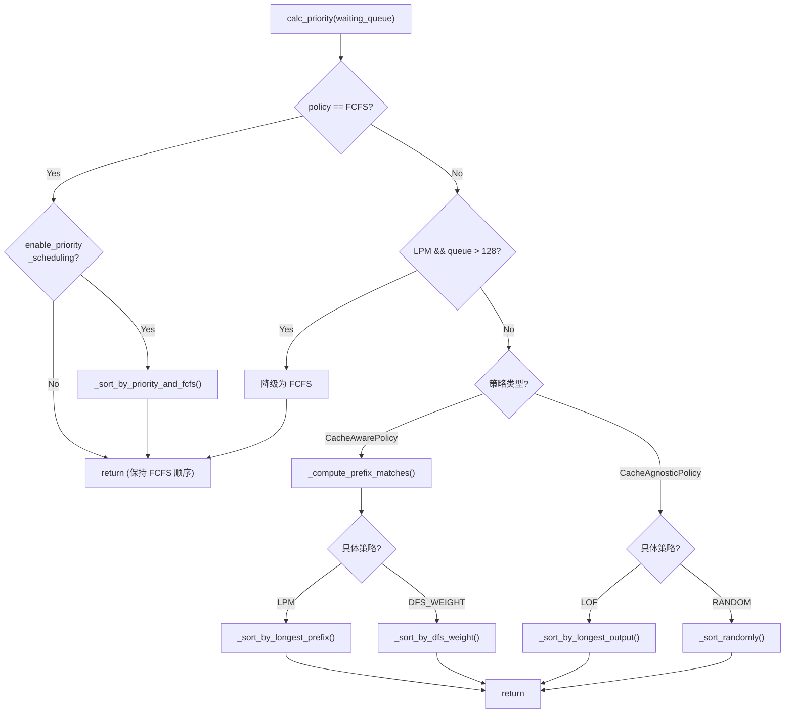

# SGLang 调度策略详解

> **默认场景**: Qwen/Qwen3-VL-235B-A22B-Thinking 多模态模型
>
> **启用特性**: PD 分离 + Chunked Prefill + ViT DP + Overlap Schedule + 多模态缓存

## 1. 调度策略概览

**文件**: `srt/managers/schedule_policy.py`

调度策略决定了 waiting_queue 中请求的执行顺序，直接影响缓存命中率和系统吞吐量。

### 1.1 策略分类

```
┌─────────────────────────────────────────────────────────────────────────────┐
│                          调度策略分类                                        │
├─────────────────────────────────────────────────────────────────────────────┤
│                                                                              │
│  ┌─────────────────────────────┐   ┌─────────────────────────────────────┐  │
│  │    CacheAwarePolicy         │   │    CacheAgnosticPolicy              │  │
│  │    (缓存感知策略)            │   │    (缓存无关策略)                   │  │
│  │                             │   │                                     │  │
│  │  • LPM (longest prefix      │   │  • FCFS (first come first serve)   │  │
│  │    match)                   │   │    先进先出 ★ 默认                  │  │
│  │  • DFS_WEIGHT               │   │  • LOF (longest output first)      │  │
│  │    深度优先权重              │   │    最长输出优先                     │  │
│  │                             │   │  • RANDOM 随机                      │  │
│  └─────────────────────────────┘   └─────────────────────────────────────┘  │
│                                                                              │
│  选择依据: tree_cache 是否启用                                               │
│  • tree_cache.disable = True  →  使用 CacheAgnosticPolicy                   │
│  • tree_cache.disable = False →  使用 CacheAwarePolicy                      │
│                                                                              │
└─────────────────────────────────────────────────────────────────────────────┘
```

## 2. SchedulePolicy 类

**文件**: `schedule_policy.py:80`

### 2.1 初始化

```python
class SchedulePolicy:
    def __init__(
        self,
        policy: str,
        tree_cache: BasePrefixCache,
        enable_hierarchical_cache: bool,
        enable_priority_scheduling: bool,
        schedule_low_priority_values_first: bool,
    ):
        self.policy = self._validate_and_adjust_policy(policy, tree_cache)
        self.tree_cache = tree_cache
        self.enable_priority_scheduling = enable_priority_scheduling
        self.priority_sign = 1 if schedule_low_priority_values_first else -1

        # 用于 in-batch prefix caching
        self.waiting_queue_radix_tree = RadixCache.create_simulated()
```

### 2.2 calc_priority 流程



**详细流程图**:

```
┌─────────────────────────────────────────────────────────────────────────────┐
│                    calc_priority() 流程                                      │
├─────────────────────────────────────────────────────────────────────────────┤
│                                                                              │
│  calc_priority(waiting_queue)                                                │
│      │                                                                       │
│      ├─ if policy == FCFS:                                                  │
│      │      if enable_priority_scheduling:                                  │
│      │          _sort_by_priority_and_fcfs()                                │
│      │      return                                                           │
│      │                                                                       │
│      ├─ 动态策略调整:                                                        │
│      │  if policy == LPM and len(waiting_queue) > 128:                      │
│      │      policy = FCFS  # 队列过长时降级为 FCFS                          │
│      │                                                                       │
│      ├─ if isinstance(policy, CacheAwarePolicy):                            │
│      │      │                                                                │
│      │      ├─ _compute_prefix_matches()  # 计算前缀匹配                    │
│      │      │                                                                │
│      │      ├─ if LPM:                                                       │
│      │      │      _sort_by_longest_prefix()                                │
│      │      │                                                                │
│      │      └─ if DFS_WEIGHT:                                               │
│      │             _sort_by_dfs_weight()                                    │
│      │                                                                       │
│      └─ else (CacheAgnosticPolicy):                                         │
│             if LOF: _sort_by_longest_output()                               │
│             if RANDOM: _sort_randomly()                                     │
│                                                                              │
└─────────────────────────────────────────────────────────────────────────────┘
```

## 3. LPM 策略 (Longest Prefix Match)

优先选择与现有缓存匹配最长前缀的请求，适用于高缓存命中率场景。

### 3.1 前缀匹配计算

```python
def _compute_prefix_matches(self, waiting_queue: List[Req], policy):
    for r in waiting_queue:
        prefix_ids = r.origin_input_ids + r.output_ids
        extra_key = r.extra_key  # LoRA adapter ID 或 cache_salt

        # 查询 tree_cache 获取匹配结果
        match_result = self.tree_cache.match_prefix(
            rid=r.rid,
            key=RadixKey(token_ids=prefix_ids, extra_key=extra_key)
        )

        # 更新请求的前缀信息
        r.prefix_indices = match_result.device_indices
        r.last_node = match_result.last_device_node
        r.last_host_node = match_result.last_host_node
        r.host_hit_length = match_result.host_hit_length
```

### 3.2 排序逻辑

```python
def _sort_by_longest_prefix(waiting_queue, temporary_deprioritized):
    waiting_queue.sort(
        key=lambda r: (
            -len(r.prefix_indices)  # 前缀越长优先级越高
            if r.rid not in temporary_deprioritized
            else float("inf")  # 被降优先级的排最后
        )
    )
```

## 4. In-Batch Prefix Caching

**目的**: 避免同时调度共享前缀但没有缓存的请求，提高缓存利用率。

### 4.1 机制

```
┌─────────────────────────────────────────────────────────────────────────────┐
│                    In-Batch Prefix Caching                                   │
├─────────────────────────────────────────────────────────────────────────────┤
│                                                                              │
│  场景: 多个请求共享相同前缀，但该前缀尚未在缓存中                            │
│                                                                              │
│  Req A: [System prompt] + [User query A]  ← prefix_indices = []             │
│  Req B: [System prompt] + [User query B]  ← prefix_indices = []             │
│  Req C: [System prompt] + [User query C]  ← prefix_indices = []             │
│                                                                              │
│  策略: 只调度 Req A，等其完成 prefill 后，                                   │
│        B 和 C 可以复用 [System prompt] 的缓存                               │
│                                                                              │
│  实现:                                                                       │
│  • 使用 waiting_queue_radix_tree 追踪队列内请求的前缀                       │
│  • 如果请求的 in-batch 匹配长度 > 阈值，则临时降低优先级                    │
│                                                                              │
└─────────────────────────────────────────────────────────────────────────────┘
```

### 4.2 阈值配置

```python
# 检查阈值: 现有缓存匹配 < 此值时才检查 in-batch
IN_BATCH_PREFIX_CACHING_CHECK_THRESHOLD = 32

# 降优先级阈值: in-batch 匹配 > 此值时降低优先级
IN_BATCH_PREFIX_CACHING_DEPRIORITIZE_THRESHOLD = 32
```

### 4.3 代码逻辑

```python
if len(r.prefix_indices) <= IN_BATCH_PREFIX_CACHING_CHECK_THRESHOLD:
    # 在 waiting_queue 的模拟 radix tree 中查找匹配
    match_result = self.waiting_queue_radix_tree.match_prefix(...)
    in_batch_matching_prefixes = match_result.device_indices

    if len(in_batch_matching_prefixes) >= IN_BATCH_PREFIX_CACHING_DEPRIORITIZE_THRESHOLD:
        temporary_deprioritized.add(r.rid)  # 降低优先级
    else:
        # 插入到模拟 tree 中
        self.waiting_queue_radix_tree.insert(...)
```

## 5. DFS-Weight 策略

**深度优先权重**: 按照 RadixCache 树结构进行深度优先遍历，优先调度同一分支的请求。

### 5.1 权重计算

```python
def _sort_by_dfs_weight(waiting_queue, tree_cache):
    # 1. 统计每个节点下的请求数
    last_node_to_reqs = defaultdict(list)
    for req in waiting_queue:
        last_node_to_reqs[req.last_node].append(req)

    # 2. 计算每个节点的权重 (子树中的请求总数)
    node_to_weight = defaultdict(int)
    for node in last_node_to_reqs:
        node_to_weight[node] = len(last_node_to_reqs[node])
    _calc_weight(tree_cache.root_node, node_to_weight)

    # 3. DFS 遍历，按权重排序子节点
    waiting_queue.clear()
    _get_dfs_priority(tree_cache.root_node, node_to_weight, last_node_to_reqs, waiting_queue)
```

### 5.2 DFS 遍历

```python
def _get_dfs_priority(cur_node, node_to_priority, last_node_to_reqs, q):
    # 子节点按权重降序排列
    childs = sorted(cur_node.children.values(), key=lambda x: -node_to_priority[x])

    for child in childs:
        _get_dfs_priority(child, node_to_priority, last_node_to_reqs, q)

    # 当前节点的请求加入队列
    q.extend(last_node_to_reqs[cur_node])
```

### 5.3 优势

```
RadixCache 树:
        root
       /    \
    [A]      [B]
   / | \       \
 R1 R2 R3      R4

权重计算:
- [A] 节点权重 = 3 (R1 + R2 + R3)
- [B] 节点权重 = 1 (R4)

DFS 遍历顺序: R1, R2, R3, R4
→ 同一分支的请求连续调度，最大化缓存局部性
```

## 6. PrefillAdder 详解

**文件**: `schedule_policy.py:316`

PrefillAdder 负责从 waiting_queue 选择请求构建 prefill 批次。

### 6.1 核心属性

```python
class PrefillAdder:
    def __init__(self, ...):
        # Token 预算
        self.rem_input_tokens     # 剩余输入 token 预算
        self.rem_chunk_tokens     # 剩余分块 token 预算
        self.rem_total_token_offset  # 预留的 token 数

        # 结果列表
        self.can_run_list = []    # 可运行的请求
        self.preempt_list = []    # 被抢占的请求
        self.new_chunked_req = None  # 新的分块请求

        # 特殊模式
        self.is_hybrid_swa        # Sliding Window Attention
        self.is_hybrid_ssm_cache  # Mamba 缓存
```

### 6.2 Token 预算计算

```
┌─────────────────────────────────────────────────────────────────────────────┐
│                    Token 预算体系                                            │
├─────────────────────────────────────────────────────────────────────────────┤
│                                                                              │
│  rem_total_tokens = available_tokens + evictable_tokens - reserved_tokens   │
│                                                                              │
│  ┌─────────────────────────────────────────────────────────────────────┐    │
│  │ 组成:                                                                │    │
│  │                                                                       │    │
│  │ available_tokens = token_to_kv_pool_allocator.available_size()      │    │
│  │                    空闲的 KV cache slots                             │    │
│  │                                                                       │    │
│  │ evictable_tokens = tree_cache.evictable_size()                      │    │
│  │                    可驱逐的 RadixCache 节点                          │    │
│  │                                                                       │    │
│  │ reserved_tokens  = Σ(running_req.max_new_tokens * new_token_ratio)  │    │
│  │                    running_batch 中请求的预留空间                    │    │
│  └─────────────────────────────────────────────────────────────────────┘    │
│                                                                              │
│  三重预算检查:                                                               │
│  1. rem_total_tokens > 0   →  总 token 不能超                              │
│  2. rem_input_tokens > 0   →  输入 token 不能超 (max_prefill_tokens)       │
│  3. rem_chunk_tokens > 0   →  分块 token 不能超 (chunked_prefill_size)     │
│                                                                              │
└─────────────────────────────────────────────────────────────────────────────┘
```

### 6.3 add_one_req 流程

```
┌─────────────────────────────────────────────────────────────────────────────┐
│                    add_one_req() 流程                                        │
├─────────────────────────────────────────────────────────────────────────────┤
│                                                                              │
│  add_one_req(req, has_chunked_req, truncation_align_size)                   │
│      │                                                                       │
│      ├─ 前置检查:                                                            │
│      │  • prefill_max_requests 限制                                         │
│      │  • NSA prefill CP 限制 (仅支持单请求)                                │
│      │  • ignore_eos 特殊处理                                               │
│      │                                                                       │
│      ├─ 计算 token 需求:                                                     │
│      │  total_tokens = extend_input_len + min(max_new_tokens, 4096)         │
│      │                                                                       │
│      ├─ 预算检查 1: total_tokens >= rem_total_tokens?                       │
│      │      → NO_TOKEN                                                       │
│      │                                                                       │
│      ├─ 预算检查 2: input_tokens >= rem_input_tokens?                       │
│      │      → OTHER (如果已有请求)                                          │
│      │                                                                       │
│      ├─ with _lock_node(req.last_node):   # 锁定节点防止驱逐                │
│      │      │                                                                │
│      │      ├─ Hierarchical Cache: 加载 host 缓存                           │
│      │      │                                                                │
│      │      ├─ if input_tokens <= rem_chunk_tokens:                         │
│      │      │      # Non-chunked prefill                                    │
│      │      │      can_run_list.append(req)                                 │
│      │      │      tree_cache.inc_lock_ref(req.last_node)                   │
│      │      │      _update_prefill_budget(...)                              │
│      │      │                                                                │
│      │      └─ else:                                                         │
│      │             # Chunked prefill                                         │
│      │             trunc_len = rem_chunk_tokens // page_size * page_size    │
│      │             req.set_extend_input_len(trunc_len)                      │
│      │             can_run_list.append(req)                                 │
│      │             new_chunked_req = req                                    │
│      │                                                                       │
│      └─ return budget_state()                                               │
│                                                                              │
└─────────────────────────────────────────────────────────────────────────────┘
```

### 6.4 AddReqResult 状态

```python
class AddReqResult(Enum):
    CONTINUE = auto()  # 可以继续添加请求
    NO_TOKEN = auto()  # token 预算不足
    OTHER = auto()     # 其他原因停止 (批次满、对齐等)
```

## 7. Chunked Prefill 处理

### 7.1 add_chunked_req

处理已经在进行 chunked prefill 的请求：

```python
def add_chunked_req(self, req: Req):
    # 计算本轮可处理的 token 数
    _rem_tokens = min(self.rem_chunk_tokens, int(self.rem_total_tokens))

    # 内存泄漏保护: 即使预算不足也必须处理 chunked_req
    if _rem_tokens <= 0:
        _rem_tokens = self.rem_chunk_tokens

    # 截断输入
    truncated = req.extend_input_len > _rem_tokens
    req.set_extend_input_len(min(req.extend_input_len, _rem_tokens))
    req.fill_ids = req.fill_ids[: len(req.prefix_indices) + req.extend_input_len]

    self.can_run_list.append(req)
    self._update_prefill_budget(...)

    # 返回 None 表示 chunked prefill 完成
    return req if truncated else None
```

### 7.2 截断对齐

```python
# 按 page_size 对齐
trunc_len = rem_chunk_tokens // page_size * page_size

# 可选: 按 truncation_align_size 对齐 (如 FlashInfer split size)
if truncation_align_size is not None:
    if trunc_len < truncation_align_size:
        return AddReqResult.OTHER
    trunc_len = truncation_align_size * (trunc_len // truncation_align_size)
```

## 8. 优先级抢占 (Priority Preemption)

**文件**: `schedule_policy.py:668`

### 8.1 preempt_to_schedule 流程

```
┌─────────────────────────────────────────────────────────────────────────────┐
│                    preempt_to_schedule() 流程                                │
├─────────────────────────────────────────────────────────────────────────────┤
│                                                                              │
│  preempt_to_schedule(req, server_args)                                       │
│      │                                                                       │
│      ├─ 1. 排序 running_batch 请求 (按优先级和等待时间)                     │
│      │                                                                       │
│      ├─ 2. 计算需要释放的 token 数                                          │
│      │      min_tokens_to_remove = req_tokens - rem_total_tokens            │
│      │                                                                       │
│      ├─ 3. 遍历找可抢占请求                                                  │
│      │      for running_req in sorted_reqs:                                 │
│      │          priority_diff = (req.priority - running_req.priority)       │
│      │          if priority_diff > threshold:                               │
│      │              preemptible_reqs.append(running_req)                    │
│      │              min_tokens_to_remove -= running_req_tokens              │
│      │              if min_tokens_to_remove <= 0:                           │
│      │                  break                                                │
│      │                                                                       │
│      ├─ 4. 验证: 必须有足够请求被抢占                                        │
│      │      if len(preemptible_reqs) == 0 or min_tokens_to_remove > 0:      │
│      │          return False                                                 │
│      │                                                                       │
│      └─ 5. 执行抢占                                                          │
│             running_batch.release_req(...)  # 释放资源                      │
│             running_batch.filter_batch(keep_indices=...)                    │
│             return True                                                      │
│                                                                              │
└─────────────────────────────────────────────────────────────────────────────┘
```

### 8.2 优先级差阈值

```python
# 只有优先级差超过阈值才允许抢占
priority_scheduling_preemption_threshold = 0  # 默认为 0

# 低优先级值优先 vs 高优先级值优先
priority_sign = 1 if schedule_low_priority_values_first else -1
```

## 9. ignore_eos 特殊处理

**场景**: `sampling_params.ignore_eos = True` 时，请求不会因 EOS token 终止。

### 9.1 add_one_req_ignore_eos

```python
def add_one_req_ignore_eos(self, req: Req):
    # 特殊的内存估算: 考虑所有请求的实际 token 生成情况
    def add_req_state(r, insert_sort=False):
        new_token_ratio = 1.0 if r.sampling_params.ignore_eos else self.new_token_ratio
        tokens_left = r.sampling_params.max_new_tokens * new_token_ratio - len(r.output_ids)
        tokens_occupied = len(r.origin_input_ids) + len(r.output_ids)
        self.req_states.append((tokens_left, tokens_occupied))

    # 按 tokens_left 排序后检查内存
    self.req_states.sort(key=lambda x: x[0])

    # 验证: 即使所有请求都生成到 max_new_tokens 也不会 OOM
    for i, (tokens_left, tokens_occupied) in enumerate(self.req_states):
        bs = len(self.req_states) - i
        min_free_tokens = cur_rem_tokens + tokens_freed - tokens_left * bs
        if min_free_tokens <= IGNORE_EOS_RESERVE_TOKENS * bs:
            return AddReqResult.NO_TOKEN
        tokens_freed += tokens_occupied
```

## 10. CLIP_MAX_NEW_TOKENS

**目的**: 防止 max_new_tokens 过大导致调度过于保守。

```python
CLIP_MAX_NEW_TOKENS = 4096  # 默认值，可通过环境变量覆盖

# 在计算 token 需求时裁剪
total_tokens = req.extend_input_len + min(
    max(req.sampling_params.max_new_tokens - len(req.output_ids), 0),
    CLIP_MAX_NEW_TOKENS,  # ← 防止过大估算
)
```

**注意**: 这只影响调度估算，不影响实际生成长度。

## 11. 关键配置参数

| 参数 | 默认值 | 环境变量 | 说明 |
|------|--------|----------|------|
| `schedule_policy` | "fcfs" | - | 调度策略 |
| `CLIP_MAX_NEW_TOKENS` | 4096 | `SGLANG_CLIP_MAX_NEW_TOKENS_ESTIMATION` | max_new_tokens 裁剪 |
| `IN_BATCH_PREFIX_CACHING_CHECK_THRESHOLD` | 32 | 同名 | In-batch 检查阈值 |
| `IN_BATCH_PREFIX_CACHING_DEPRIORITIZE_THRESHOLD` | 32 | 同名 | In-batch 降优先级阈值 |
| `priority_scheduling_preemption_threshold` | 0 | - | 抢占优先级差阈值 |

## 12. 策略选择建议

| 场景 | 推荐策略 | 原因 |
|------|----------|------|
| 通用场景 | FCFS (默认) | 先到先服务，保证公平 |
| 长队列 (>128) | 自动降级 FCFS | LPM 计算开销大 |
| 树状对话 | DFS-WEIGHT | 优化缓存局部性 |
| 公平性要求高 | FCFS | 先到先服务 |
| 优先处理长输出 | LOF | 避免长请求饥饿 |
| 禁用缓存 | FCFS | CacheAware 无意义 |

## 13. 下一步

- **05**: KV Cache 内存池设计 (memory_pool.py)
- **06**: RadixCache 前缀缓存实现 (radix_cache.py)
