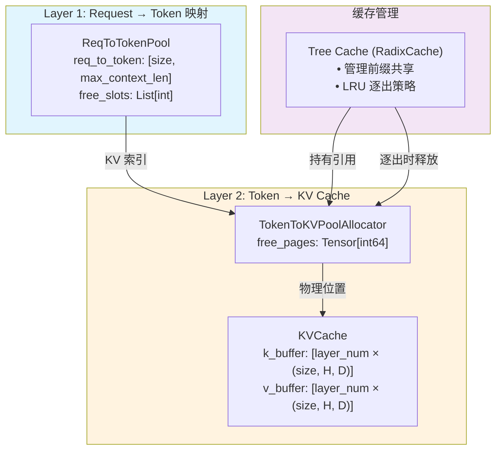

# SGLang 内存池设计详解

> **默认场景**: Qwen/Qwen3-VL-235B-A22B-Thinking 多模态模型
>
> **启用特性**: PD 分离 + Chunked Prefill + ViT DP + Overlap Schedule + 多模态缓存

## 1. 内存池架构概览

**核心文件**:
- `srt/mem_cache/memory_pool.py` - GPU 内存池
- `srt/mem_cache/allocator.py` - 索引分配器  
- `srt/mem_cache/memory_pool_host.py` - Host 内存池
- `srt/mem_cache/radix_cache.py` - 前缀缓存 (Tree Cache)



**详细架构图**:

```
┌──────────────────────────────────────────────────────────────────────────────┐
│                           内存池两层架构                                      │
├──────────────────────────────────────────────────────────────────────────────┤
│                                                                               │
│  ┌──────────────────────────────────────────────────────────────────────┐    │
│  │ Layer 1: Request → Token 映射                                        │    │
│  │                                                                        │    │
│  │  ReqToTokenPool                                                       │    │
│  │  ├─ req_to_token: [size, max_context_len]                            │    │
│  │  │  记录每个请求的 token 在 KVCache 中的位置索引 (存储的是 Layer 2   │    │
│  │  │  的 KV 索引)                                                       │    │
│  │  └─ free_slots: List[int]                                            │    │
│  │     可用的请求槽位，最多支持 size 个并发请求                          │    │
│  └──────────────────────────────────────────────────────────────────────┘    │
│                              ▼                                                │
│  ┌──────────────────────────────────────────────────────────────────────┐    │
│  │ Layer 2: Token → KV Cache (Allocator + 物理存储)                     │    │
│  │                                                                        │    │
│  │  TokenToKVPoolAllocator ─────────── 管理可用索引                      │    │
│  │  ├─ free_pages: Tensor[int64]      (哪些 token 位置可用)             │    │
│  │  └─────────────────────────────────────────────────────────────────┐ │    │
│  │                                                                     │ │    │
│  │  KVCache (MHATokenToKVPool / MLATokenToKVPool / ...)                │ │    │
│  │  ├─ k_buffer: List[Tensor]  [layer_num x (size, head_num, head_dim)]│ │    │
│  │  └─ v_buffer: List[Tensor]  同上                                   │ │    │
│  │                                     实际的 K/V 张量数据 ◀───────────┘ │    │
│  └──────────────────────────────────────────────────────────────────────┘    │
│                                                                               │
└──────────────────────────────────────────────────────────────────────────────┘
```

### 1.1 与 Tree Cache 的关系

```
                    ┌─────────────────────────────┐
                    │        Tree Cache           │ (RadixCache / MambaRadixCache)
                    │  • 管理前缀共享             │
                    │  • LRU 逐出策略             │
                    │  • 存储 KV 索引的引用       │
                    └─────────────────────────────┘
                              │
          ┌───────────────────┼───────────────────┐
          ▼                   ▼                   ▼
    ReqToTokenPool    TokenToKVPoolAllocator   KVCache
    (请求槽位管理)     (索引分配管理)         (物理存储)
```

**关键理解**:
- **两层架构**: ReqToTokenPool 管理请求，TokenToKVPoolAllocator + KVCache 管理 Token 存储
- **Tree Cache** 不是内存池的一部分，而是**上层的缓存管理策略**
  - Tree Cache 持有 KV 索引的「引用」
  - 当 Tree Cache 逐出节点时，调用 `token_to_kv_pool_allocator.free()` 释放索引

## 2. ReqToTokenPool

**文件**: `memory_pool.py:78`

管理请求 ID 到 token 位置的映射。

### 2.1 数据结构

```python
class ReqToTokenPool:
    def __init__(self, size, max_context_len, device, enable_memory_saver):
        # 核心张量: [请求数, 最大上下文长度]
        self.req_to_token = torch.zeros(
            (size, max_context_len), dtype=torch.int32, device=device
        )
        # 可用请求槽位
        self.free_slots = list(range(size))
```

### 2.2 核心操作

| 方法 | 功能 |
|------|------|
| `alloc(need_size)` | 分配 N 个请求槽位 |
| `free(free_index)` | 释放请求槽位 |
| `write(indices, values)` | 写入 token 位置映射 |

## 3. KVCache 变体

### 3.1 类继承关系

```
┌─────────────────────────────────────────────────────────────────────────────┐
│                          KVCache 继承树                                      │
├─────────────────────────────────────────────────────────────────────────────┤
│                                                                              │
│  KVCache (抽象基类)                                                          │
│      │                                                                       │
│      ├── MHATokenToKVPool           # 标准 Multi-Head Attention             │
│      │       └── MHATokenToKVPoolFP4   # FP4 量化版本                      │
│      │                                                                       │
│      ├── MLATokenToKVPool           # Multi-head Latent Attention (DeepSeek)│
│      │       └── MLATokenToKVPoolFP4   # FP4 量化版本                      │
│      │                                                                       │
│      ├── SWAKVPool                  # Sliding Window Attention 混合池       │
│      │                                                                       │
│      ├── HybridLinearKVPool         # Mamba + Attention 混合池             │
│      │                                                                       │
│      └── DoubleSparseTokenToKVPool  # 稀疏注意力池                         │
│                                                                              │
└─────────────────────────────────────────────────────────────────────────────┘
```

### 3.2 MHATokenToKVPool

**标准的 Multi-Head Attention KV Cache**

```python
class MHATokenToKVPool(KVCache):
    def __init__(self, size, page_size, dtype, head_num, head_dim, layer_num, ...):
        # 为每层创建 K/V buffer
        # Shape: [size + page_size, head_num, head_dim]
        self.k_buffer = [
            torch.zeros((size + page_size, head_num, head_dim), dtype=store_dtype)
            for _ in range(layer_num)
        ]
        self.v_buffer = [
            torch.zeros((size + page_size, head_num, v_head_dim), dtype=store_dtype)
            for _ in range(layer_num)
        ]
```

**内存布局**:
```
k_buffer[layer_id]:
┌─────────────────────────────────────────────────────────────────┐
│ Token 0 │ Token 1 │ Token 2 │ ... │ Token N │ Padding (page_size)│
│ [H, D]  │ [H, D]  │ [H, D]  │     │ [H, D]  │                    │
└─────────────────────────────────────────────────────────────────┘
         H = head_num, D = head_dim
```

### 3.3 MLATokenToKVPool

**Multi-head Latent Attention (DeepSeek-V2 模型)**

```python
class MLATokenToKVPool(KVCache):
    def __init__(self, ..., kv_lora_rank, qk_rope_head_dim, ...):
        self.kv_lora_rank = kv_lora_rank
        self.qk_rope_head_dim = qk_rope_head_dim

        # MLA 使用压缩的 KV 表示
        # Shape: [size, kv_lora_rank + qk_rope_head_dim]
        self.kv_buffer = [
            torch.zeros((size + page_size, kv_lora_rank + qk_rope_head_dim), ...)
            for _ in range(layer_num)
        ]
```

**优势**: 通过低秩压缩大幅减少 KV 缓存内存

### 3.4 SWAKVPool

**Sliding Window Attention 混合池**

```
┌─────────────────────────────────────────────────────────────────────────────┐
│                          SWAKVPool 架构                                      │
├─────────────────────────────────────────────────────────────────────────────┤
│                                                                              │
│  ┌───────────────────────────┐    ┌────────────────────────────────────┐   │
│  │    Full Attention Pool    │    │    Sliding Window Attention Pool    │   │
│  │    (部分层)               │    │    (部分层)                          │   │
│  │                           │    │                                      │   │
│  │  size = size              │    │  size = size_swa (通常更小)         │   │
│  │  存储完整历史             │    │  只存储窗口内 token                  │   │
│  └───────────────────────────┘    └────────────────────────────────────┘   │
│                                                                              │
│  full_attention_layer_ids: [0, 4, 8, ...]  按间隔选择                       │
│  swa_attention_layer_ids: [1, 2, 3, 5, 6, 7, ...]  其余层                   │
│                                                                              │
│  索引映射: full_to_swa_index_mapping                                         │
│                                                                              │
└─────────────────────────────────────────────────────────────────────────────┘
```

### 3.5 HybridLinearKVPool

**Mamba + Attention 混合模型 (Mamba2, Falcon-Mamba, Bamba 等)**

> **重要**: 当模型包含 Mamba 层 (通过 `hybrid_gdn_config` 或 `mamba2_config` 检测) 时，
> SGLang 使用此池来同时管理 Attention 层的 KV Cache 和 Mamba 层的 SSM 状态。

```python
class HybridLinearKVPool(KVCache):
    def __init__(self, ..., full_attention_layer_ids, mamba_pool, ...):
        # 仅 Full Attention 层使用 KV Cache
        self.full_kv_pool = MHATokenToKVPool(
            layer_num=len(full_attention_layer_ids),  # 只为 Attention 层分配
            ...
        )
        # 映射: layer_id → 在 full_kv_pool 中的索引
        self.full_attention_layer_id_mapping = {
            id: i for i, id in enumerate(full_attention_layer_ids)
        }
        # Mamba 层使用 SSM 状态存储 (由 HybridReqToTokenPool 管理)
        self.mamba_pool = mamba_pool  # 来自 HybridReqToTokenPool
```

**架构详解**:

```
┌─────────────────────────────────────────────────────────────────────────────┐
│                    Mamba-Hybrid 模型 KV 存储架构                             │
├─────────────────────────────────────────────────────────────────────────────┤
│                                                                              │
│  模型层数: 假设 32 层，其中 8 层是 Full Attention，24 层是 Mamba            │
│                                                                              │
│  ┌─────────────────────────────────┐                                        │
│  │   HybridReqToTokenPool          │  (继承自 ReqToTokenPool)               │
│  │   ├─ req_to_token[]             │  token 位置映射 (仅 Attention 层)      │
│  │   ├─ mamba_pool: MambaPool      │  SSM 状态存储                          │
│  │   └─ req_to_mamba_index_mapping │  请求 → Mamba 状态映射                 │
│  └─────────────────────────────────┘                                        │
│                                                                              │
│  ┌─────────────────────────────────┐                                        │
│  │   HybridLinearKVPool            │                                        │
│  │   ├─ full_kv_pool (8 层)        │  仅存储 Attention 层的 KV              │
│  │   │   k_buffer[0..7]            │                                        │
│  │   │   v_buffer[0..7]            │                                        │
│  │   └─ mamba_pool (引用)          │  指向 HybridReqToTokenPool.mamba_pool  │
│  └─────────────────────────────────┘                                        │
│                                                                              │
│  Mamba 层 vs Attention 层:                                                   │
│  ┌───────────┬────────────────────────┬──────────────────────────────────┐  │
│  │ 属性      │ Attention 层           │ Mamba 层                         │  │
│  ├───────────┼────────────────────────┼──────────────────────────────────┤  │
│  │ 存储类型  │ K, V 张量              │ conv + ssm_state                 │  │
│  │ 增长模式  │ 随 token 数线性增长    │ 固定大小 (per request)           │  │
│  │ 缓存特性  │ 可前缀共享             │ 不可共享 (状态依赖顺序)          │  │
│  │ 分配粒度  │ per-token              │ per-request                      │  │
│  └───────────┴────────────────────────┴──────────────────────────────────┘  │
│                                                                              │
└─────────────────────────────────────────────────────────────────────────────┘
```

**MambaRadixCache 的特殊处理**:

普通 RadixCache 只需管理 KV 索引，而 MambaRadixCache 需要同时管理:

```python
class TreeNode:  # mamba_radix_cache.py
    def __init__(self):
        self.key = ...                # token IDs
        self.value = ...              # KV 索引 (Attention 层)
        self.mamba_value = ...        # Mamba 状态索引
        # 双锁机制
        self.full_lock_ref = 0        # 保护 KV Cache
        self.mamba_lock_ref = 0       # 保护 Mamba 状态
```

**为什么需要双锁?**
- Mamba 状态是**顺序依赖**的，不同请求即使前缀相同也需要不同的 Mamba 状态副本
- 因此 `mamba_lock_ref` 和 `full_lock_ref` 分开管理，允许独立逐出

## 4. Allocator 分配器

### 4.1 TokenToKVPoolAllocator

**基础分配器，无分页**

```python
class TokenToKVPoolAllocator(BaseTokenToKVPoolAllocator):
    def __init__(self, size, dtype, device, kvcache, need_sort):
        self.page_size = 1  # 无分页，每次分配单个 token

    def alloc(self, need_size: int):
        if need_size > len(self.free_pages):
            return None
        select_index = self.free_pages[:need_size]
        self.free_pages = self.free_pages[need_size:]
        return select_index

    def free(self, free_index: torch.Tensor):
        self.free_pages = torch.cat((self.free_pages, free_index))
```

### 4.2 PagedTokenToKVPoolAllocator

**分页分配器，支持 extend/decode 优化**

```
┌─────────────────────────────────────────────────────────────────────────────┐
│                    PagedTokenToKVPoolAllocator                               │
├─────────────────────────────────────────────────────────────────────────────┤
│                                                                              │
│  分配粒度: page_size (如 16 tokens)                                          │
│                                                                              │
│  优化的分配方法:                                                             │
│  ┌─────────────────────────────────────────────────────────────────────┐    │
│  │ alloc_extend():                                                      │    │
│  │   • 处理 prefill 扩展，考虑已有 prefix                              │    │
│  │   • Part 1: 填充旧的 partial page                                   │    │
│  │   • Part 2: 分配完整新页                                            │    │
│  │   • Part 3: 填充新的 partial page                                   │    │
│  │   使用 Triton kernel 并行处理所有请求                               │    │
│  └─────────────────────────────────────────────────────────────────────┘    │
│                                                                              │
│  ┌─────────────────────────────────────────────────────────────────────┐    │
│  │ alloc_decode():                                                      │    │
│  │   • 每个请求只需 1 token                                            │    │
│  │   • 可能需要分配新页 (当 seq_len 跨页边界时)                        │    │
│  │   使用 Triton kernel 并行处理                                       │    │
│  └─────────────────────────────────────────────────────────────────────┘    │
│                                                                              │
└─────────────────────────────────────────────────────────────────────────────┘
```

### 4.3 SWATokenToKVPoolAllocator

**双池分配器，同时管理 Full 和 SWA 池**

```python
class SWATokenToKVPoolAllocator(BaseTokenToKVPoolAllocator):
    def __init__(self, size, size_swa, ...):
        self.full_attn_allocator = TokenToKVPoolAllocator(size, ...)
        self.swa_attn_allocator = TokenToKVPoolAllocator(size_swa, ...)
        self.full_to_swa_index_mapping = torch.empty(size + size_swa + 1, ...)

    def alloc(self, need_size):
        # 同时从两个池分配
        alloc_full_indices = self.full_attn_allocator.alloc(need_size)
        alloc_swa_indices = self.swa_attn_allocator.alloc(need_size)
        # 建立映射
        self.full_to_swa_index_mapping[alloc_full_indices] = alloc_swa_indices
        return alloc_full_indices
```

## 5. MambaPool

**用于 Mamba/SSM 模型的状态存储**

```python
class MambaPool:
    @dataclass
    class State:
        conv: List[torch.Tensor]   # 卷积状态
        temporal: torch.Tensor     # SSM 状态

    def __init__(self, size, cache_params, ...):
        # Shape: [num_mamba_layers, size + 1, conv_shape...]
        self.mamba_cache = self.State(
            conv=[torch.zeros((num_layers, size+1) + conv_shape) for ...],
            temporal=torch.zeros((num_layers, size+1) + temporal_shape)
        )
```

**与 KV Cache 的区别**:
| 特性 | KVCache | MambaPool |
|------|---------|-----------|
| 存储内容 | K, V 张量 | conv, ssm 状态 |
| 增长模式 | 随 token 线性增长 | 固定大小 |
| 分配粒度 | per-token | per-request |

## 6. Host 内存池 (Hierarchical Cache)

**文件**: `memory_pool_host.py`

### 6.1 HostKVCache

```python
class HostKVCache:
    def __init__(self, device_pool, host_to_device_ratio, host_size, ...):
        # Host 端 KV 缓存 (CPU 或 pinned memory)
        self.k_buffer = []
        self.v_buffer = []

    def load_to_device_per_layer(self, device_pool, host_indices, device_indices, layer_id):
        # 从 Host 加载到 Device (per-layer for overlap)
        pass

    def backup_from_device_all_layer(self, device_pool, host_indices, device_indices):
        # 从 Device 备份到 Host
        pass
```

### 6.2 层级缓存架构

```
┌─────────────────────────────────────────────────────────────────────────────┐
│                    Hierarchical Cache 架构                                   │
├─────────────────────────────────────────────────────────────────────────────┤
│                                                                              │
│  ┌─────────────────────┐     ┌────────────────────────────────────────────┐ │
│  │   GPU KV Cache      │ ←→  │   Host KV Cache (Pinned Memory)           │ │
│  │   (hot data)        │     │   (warm data)                             │ │
│  │                      │     │                                           │ │
│  │   容量受限          │     │   容量 = host_to_device_ratio × GPU容量   │ │
│  └─────────────────────┘     └────────────────────────────────────────────┘ │
│                                                   │                          │
│                                                   ▼                          │
│                              ┌────────────────────────────────────────────┐ │
│                              │   Disk Storage (可选)                      │ │
│                              │   (cold data)                              │ │
│                              └────────────────────────────────────────────┘ │
│                                                                              │
│  数据流:                                                                     │
│  • Eviction: GPU → Host → Disk                                              │
│  • Load back: Disk → Host → GPU (per-layer pipelining)                      │
│                                                                              │
└─────────────────────────────────────────────────────────────────────────────┘
```

## 7. 内存分配流程

### 7.1 Prefill 分配

```
┌─────────────────────────────────────────────────────────────────────────────┐
│                    Prefill 内存分配流程                                      │
├─────────────────────────────────────────────────────────────────────────────┤
│                                                                              │
│  1. ReqToTokenPool.alloc(batch_size)                                        │
│     └─ 分配请求槽位 → req_pool_indices                                      │
│                                                                              │
│  2. token_to_kv_pool_allocator.alloc_extend(...)                            │
│     └─ 分配 KV 索引 → out_indices                                           │
│                                                                              │
│  3. req_to_token_pool.write(req_pool_indices, out_indices)                  │
│     └─ 记录映射关系                                                         │
│                                                                              │
│  4. 模型前向: kv_cache.set_kv_buffer(layer, loc, cache_k, cache_v)          │
│     └─ 写入实际 K/V 数据                                                    │
│                                                                              │
└─────────────────────────────────────────────────────────────────────────────┘
```

### 7.2 Decode 分配

```python
# 每个请求只需 1 个新 token
out_indices = token_to_kv_pool_allocator.alloc_decode(
    seq_lens=batch.seq_lens,
    last_loc=batch.last_loc,
)
```

## 8. 关键配置参数

| 参数 | 默认值 | 说明 |
|------|--------|------|
| `mem_fraction_static` | 0.9 | 静态内存分配比例 |
| `page_size` | 16 | 分页大小 |
| `kv_cache_dtype` | auto | KV 缓存数据类型 |
| `host_to_device_ratio` | 0 | Host 缓存比例 |

## 9. 内存优化技术

### 9.1 Memory Saver

```python
# 延迟分配 GPU 内存
memory_saver_adapter = TorchMemorySaverAdapter.create(enable=enable_memory_saver)
with memory_saver_adapter.region(GPU_MEMORY_TYPE_KV_CACHE):
    self.k_buffer = torch.zeros(...)
```

### 9.2 Custom Memory Pool (NVLink)

```python
# 用于 PD 分离的自定义内存池
self.enable_custom_mem_pool, self.custom_mem_pool, _ = maybe_init_custom_mem_pool(device)
with torch.cuda.use_mem_pool(self.custom_mem_pool):
    # 分配可以跨 GPU 高效传输的内存
```

## 10. 下一步

- **06**: RadixCache 前缀缓存 (radix_cache.py)
- **07**: ModelRunner 与 CUDA Graph
