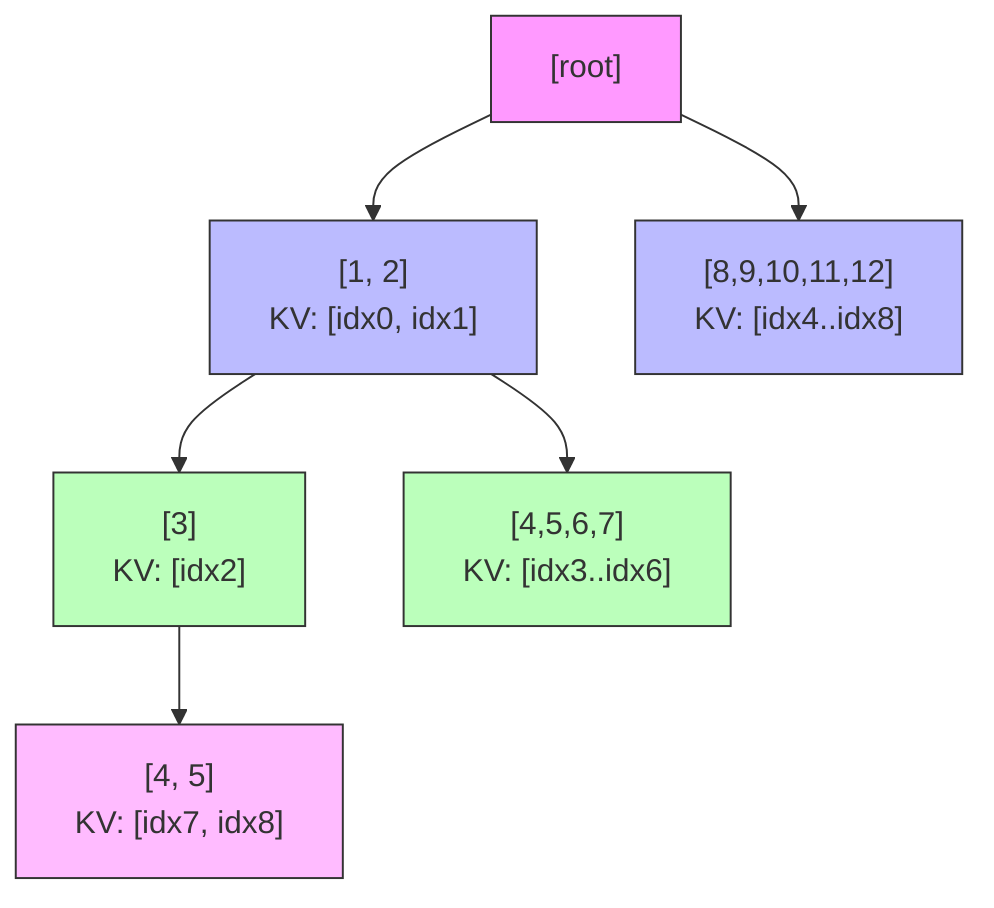
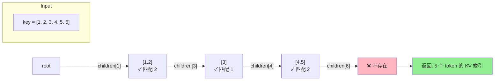

# SGLang RadixCache 前缀缓存详解

> **默认场景**: Qwen/Qwen3-VL-235B-A22B-Thinking 多模态模型
>
> **启用特性**: PD 分离 + Chunked Prefill + ViT DP + Overlap Schedule + 多模态缓存

## 1. RadixCache 概览

**核心文件**:
- `srt/mem_cache/radix_cache.py` - 基础 RadixCache
- `srt/mem_cache/base_prefix_cache.py` - 抽象基类
- `srt/mem_cache/evict_policy.py` - 逐出策略
- `srt/mem_cache/swa_radix_cache.py` - SWA 变体
- `srt/mem_cache/mamba_radix_cache.py` - Mamba 变体
- `srt/mem_cache/hiradix_cache.py` - 层级缓存变体

### 1.1 什么是 RadixAttention?

RadixAttention 是 SGLang 的核心创新，通过 **Radix Tree (基数树)** 数据结构高效管理 KV Cache 的前缀共享。

```
┌─────────────────────────────────────────────────────────────────────────────┐
│                         RadixCache 核心思想                                  │
├─────────────────────────────────────────────────────────────────────────────┤
│                                                                              │
│  传统方案: 每个请求独立存储完整 KV Cache                                     │
│                                                                              │
│  请求 A: [System Prompt] + [User A Query]  → 独立 KV Cache                  │
│  请求 B: [System Prompt] + [User B Query]  → 独立 KV Cache (重复存储!)      │
│                                                                              │
│  RadixAttention: 共享公共前缀                                                │
│                                                                              │
│                     [System Prompt] (共享)                                   │
│                          /           \                                       │
│               [User A Query]    [User B Query]                               │
│                                                                              │
│  节省内存 + 无需重复计算                                                     │
│                                                                              │
└─────────────────────────────────────────────────────────────────────────────┘
```

### 1.2 类继承关系

```
BasePrefixCache (抽象基类)
    │
    ├── RadixCache              # 标准 Radix Tree 缓存
    │
    ├── SWARadixCache           # Sliding Window Attention 变体
    │
    ├── MambaRadixCache         # Mamba-Hybrid 模型变体
    │
    ├── HiRadixCache            # Hierarchical 分层缓存
    │
    ├── ChunkCache              # 简化版 (禁用 radix_cache 时使用)
    │
    └── RadixCacheCpp           # C++ 优化实现 (实验性)
```

## 2. 核心数据结构

### 2.1 RadixKey

```python
class RadixKey:
    def __init__(self, token_ids: List[int], extra_key: Optional[str] = None):
        self.token_ids = token_ids  # Token ID 序列
        self.extra_key = extra_key  # 额外键 (LoRA ID, cache_salt 等)
```

**用途**:
- `token_ids`: 实际的 token 序列，用于前缀匹配
- `extra_key`: 隔离不同 LoRA 或数据集的缓存命名空间

### 2.2 TreeNode

```python
class TreeNode:
    def __init__(self, id=None, priority=0):
        self.children = defaultdict(TreeNode)  # 子节点 (按首 token 索引)
        self.parent: TreeNode = None           # 父节点
        self.key: RadixKey = None              # 本节点存储的 token 序列
        self.value: torch.Tensor = None        # KV Cache 索引

        # 锁和访问控制
        self.lock_ref = 0                      # 引用计数 (防止逐出)
        self.last_access_time = time.monotonic()
        self.creation_time = time.monotonic()
        self.hit_count = 0                     # 访问次数 (LFU 用)
        self.priority = priority               # 优先级 (Priority eviction)

        # Hierarchical Cache 相关
        self.host_value: torch.Tensor = None   # Host 端 KV 索引
        self.host_ref_counter = 0              # Host 引用计数
        self.hash_value: List[str] = None      # SHA256 块哈希
```

### 2.3 Radix Tree 结构示例



**插入序列说明**:
```
插入序列:
  [1, 2, 3]
  [1, 2, 3, 4, 5]
  [1, 2, 4, 5, 6, 7]
  [8, 9, 10, 11, 12]

形成的 Radix Tree:
                       [root]
                         │
            ┌────────────┴────────────┐
            ▼                         ▼
        [1, 2]                    [8,9,10,11,12]
           │
     ┌─────┴─────┐
     ▼           ▼
   [3]        [4,5,6,7]
     │
     ▼
  [4, 5]

每个节点的 value 存储对应 token 的 KV 索引
```

## 3. 核心操作

### 3.1 match_prefix

**最长前缀匹配**

```python
def match_prefix(self, key: RadixKey, **kwargs) -> MatchResult:
    """
    查找 key 在 Radix Tree 中的最长公共前缀

    返回:
        MatchResult(
            device_indices: 匹配到的 KV 索引
            last_device_node: 匹配终止的节点
            last_host_node: (HiCache) Host 端匹配节点
        )
    """
```

**匹配流程**:



**详细步骤**:

```
┌─────────────────────────────────────────────────────────────────────────────┐
│                         match_prefix 流程                                    │
├─────────────────────────────────────────────────────────────────────────────┤
│                                                                              │
│  输入: key = [1, 2, 3, 4, 5, 6]                                              │
│                                                                              │
│  1. 从 root 开始，查找子节点 children[1]                                     │
│                                                                              │
│  2. 找到节点 [1, 2]，调用 key_match_fn 比较:                                 │
│     key[0:2] == node.key[0:2] → 匹配长度 = 2                                │
│                                                                              │
│  3. 继续查找子节点 children[3]                                               │
│                                                                              │
│  4. 找到节点 [3]，匹配长度 = 1                                               │
│                                                                              │
│  5. 继续查找子节点 children[4] → 找到 [4, 5]                                 │
│                                                                              │
│  6. 匹配 [4, 5] vs key[3:5] → 完全匹配                                       │
│                                                                              │
│  7. 查找 children[6] → 不存在，结束                                          │
│                                                                              │
│  返回: indices = concat([1,2], [3], [4,5]) 的 KV 索引                        │
│                                                                              │
└─────────────────────────────────────────────────────────────────────────────┘
```

### 3.2 insert

**插入新序列**

```python
def insert(self, key: RadixKey, value=None, priority: int = 0):
    """
    插入 token 序列及其 KV 索引到树中

    返回: 已存在的前缀长度 (用于释放重复的 KV 索引)
    """
```

**关键细节**:
- 如果前缀已存在，只插入新增部分
- 返回 `total_prefix_length` 告知调用方哪些 KV 已存在（可释放）

### 3.3 _split_node

**节点分裂**

当匹配在节点中间结束时，需要分裂节点：

```
分裂前:
  parent → [1,2,3,4,5]

匹配 [1,2,3,6,7] 后分裂:

  parent → [1,2,3] (新节点)
               │
         ┌─────┴─────┐
         ↓           ↓
      [4,5]       [6,7] (新插入)
     (原节点)
```

```python
def _split_node(self, key: RadixKey, child: TreeNode, split_len: int):
    new_node = TreeNode(priority=child.priority)
    new_node.key = child.key[:split_len]
    new_node.value = child.value[:split_len]
    new_node.children = {get_child_key(child.key[split_len:]): child}
    child.key = child.key[split_len:]
    child.value = child.value[split_len:]
    # ... 更新父子关系
```

## 4. 锁机制 (lock_ref)

### 4.1 为什么需要锁?

```
问题场景:
  请求 A 正在使用节点 [1,2,3] 的 KV Cache 进行推理
  此时内存不足，evict() 尝试释放该节点
  → 导致请求 A 访问已释放内存，崩溃！

解决方案: 引用计数锁
  inc_lock_ref(): 请求开始使用时，锁定从 last_node 到 root 的路径
  dec_lock_ref(): 请求完成时，解锁
  evict() 只能逐出 lock_ref == 0 的节点
```

### 4.2 实现细节

```python
def inc_lock_ref(self, node: TreeNode):
    """锁定从 node 到 root 的整个路径"""
    while node != self.root_node:
        if node.lock_ref == 0:
            # 从 evictable 转为 protected
            self.evictable_size_ -= len(node.key)
            self.protected_size_ += len(node.key)
        node.lock_ref += 1
        node = node.parent

def dec_lock_ref(self, node: TreeNode):
    """解锁路径"""
    while node != self.root_node:
        if node.lock_ref == 1:
            # 从 protected 转为 evictable
            self.evictable_size_ += len(node.key)
            self.protected_size_ -= len(node.key)
        node.lock_ref -= 1
        node = node.parent
```

## 5. 逐出策略

**文件**: `evict_policy.py`

| 策略 | 优先级计算 | 适用场景 |
|------|-----------|---------|
| **LRU** | `last_access_time` | 热点数据保留 (默认) |
| **LFU** | `(hit_count, last_access_time)` | 高频访问优先 |
| **FIFO** | `creation_time` | 按创建顺序 |
| **MRU** | `-last_access_time` | 最近使用优先逐出 |
| **FILO** | `-creation_time` | 后进先出 |
| **Priority** | `(priority, last_access_time)` | 请求优先级感知 |

### 5.1 evict() 流程

```python
def evict(self, num_tokens: int):
    leaves = self._collect_leaves()  # 收集所有叶子节点
    eviction_heap = [
        (eviction_strategy.get_priority(node), node)
        for node in leaves if node.lock_ref == 0
    ]
    heapq.heapify(eviction_heap)

    num_evicted = 0
    while num_evicted < num_tokens and eviction_heap:
        priority, node = heapq.heappop(eviction_heap)
        self.token_to_kv_pool_allocator.free(node.value)  # 释放 KV
        self._delete_leaf(node)                           # 删除节点
        num_evicted += len(node.value)

        # 如果父节点变成叶子且未被锁定，可能成为下一个逐出候选
        if len(node.parent.children) == 0 and node.parent.lock_ref == 0:
            heapq.heappush(eviction_heap, (get_priority(node.parent), node.parent))
```

## 6. 请求生命周期中的缓存操作

### 6.1 cache_finished_req

```
┌─────────────────────────────────────────────────────────────────────────────┐
│                    请求完成时的缓存流程                                       │
├─────────────────────────────────────────────────────────────────────────────┤
│                                                                              │
│  1. pop_committed_kv_cache()                                                 │
│     获取已提交的 KV 长度                                                    │
│                                                                              │
│  2. 构建 RadixKey(token_ids, extra_key)                                     │
│                                                                              │
│  3. insert(radix_key, kv_indices, priority)                                 │
│     返回: new_prefix_len (已存在的前缀长度)                                 │
│                                                                              │
│  4. free(kv_indices[cache_protected_len : new_prefix_len])                  │
│     释放与树中已有节点重复的 KV                                             │
│                                                                              │
│  5. req_to_token_pool.free(req_pool_idx)                                    │
│     释放请求槽位                                                            │
│                                                                              │
│  6. dec_lock_ref(req.last_node)                                             │
│     解锁之前持有的节点                                                       │
│                                                                              │
└─────────────────────────────────────────────────────────────────────────────┘
```

### 6.2 cache_unfinished_req

用于 **Chunked Prefill**，请求未完成但需要中间缓存：

```python
def cache_unfinished_req(self, req: Req, chunked=False):
    # 插入当前已处理的 token
    new_prefix_len = self.insert(radix_key, kv_indices)

    # 释放重复部分
    self.token_to_kv_pool_allocator.free(kv_indices[cache_protected_len:new_prefix_len])

    # 重新匹配以获取最新的节点引用
    match_result = self.match_prefix(radix_key)
    new_last_node = match_result.last_device_node

    # 更新请求的 prefix_indices 供下一个 chunk 使用
    req.prefix_indices = new_indices
    req.cache_protected_len = len(new_indices)

    # 更新锁
    self.dec_lock_ref(req.last_node)
    self.inc_lock_ref(new_last_node)
    req.last_node = new_last_node
```

## 7. Page Size 与对齐

当 `page_size > 1` 时，匹配和插入以 page 为单位：

```python
if self.page_size != 1:
    page_aligned_len = len(key) // self.page_size * self.page_size
    key = key[:page_aligned_len]
```

**影响**:
- 匹配粒度变粗 (以 page_size 个 token 为单位)
- 部分页 (partial page) 需要特殊处理，不能进入 RadixCache

## 8. extra_key 命名空间隔离

```python
# 不同 LoRA 的请求共享相同 system prompt 也不会混用
key1 = RadixKey([1,2,3], extra_key="lora_adapter_A")
key2 = RadixKey([1,2,3], extra_key="lora_adapter_B")
# key1 和 key2 被视为完全不同的缓存条目
```

命名空间隔离确保:
- 不同 LoRA adapter 的 KV Cache 不会混用
- 不同 `cache_salt` 的请求隔离

## 9. EAGLE Bigram 转换

对于 EAGLE 投机解码，使用 bigram key：

```python
def convert_to_bigram_key(token_ids: List[int]) -> List[int]:
    """
    [1, 2, 3, 4] → [(1,2), (2,3), (3,4)]
    """
    return [combine(token_ids[i], token_ids[i+1]) for i in range(len(token_ids)-1)]
```

这允许 EAGLE 的 draft model 共享 target model 的部分 KV Cache。

## 10. Scheduler 集成

```python
# scheduler.py 中的选择逻辑
if self.is_hybrid_ssm:
    self.tree_cache = MambaRadixCache(params)
elif self.is_hybrid_swa:
    self.tree_cache = SWARadixCache(params, sliding_window_size)
elif enable_hierarchical_cache:
    self.tree_cache = HiRadixCache(params, server_args)
else:
    self.tree_cache = RadixCache(params)
```

## 11. 配置参数

| 参数 | 默认值 | 说明 |
|------|--------|------|
| `disable_radix_cache` | False | 禁用前缀缓存 |
| `radix_eviction_policy` | "lru" | 逐出策略 |
| `page_size` | 16 | 页大小 |
| `enable_hierarchical_cache` | False | 启用层级缓存 |

## 12. 多模态 Chunked Prefill 与缓存命中案例

### 12.1 场景设定

```
假设:
  chunk_size = 512 tokens
  image1 token 数 = 1024 (> chunk_size，需要 2 个 chunk)
  image2 token 数 = 768  (> chunk_size，需要 2 个 chunk)
  image3 token 数 = 896  (> chunk_size，需要 2 个 chunk)
  text1 token 数 = 100

请求:
  req1: text1 + image1 + image2
  req2: text1 + image1 + image3
```

### 12.2 req1 处理流程 (首次请求)

```
┌─────────────────────────────────────────────────────────────────────────────┐
│                            req1 Chunked Prefill 流程                         │
├─────────────────────────────────────────────────────────────────────────────┤
│                                                                              │
│  原始输入: [text1:100] + [image1:1024] + [image2:768]                       │
│  总 token: 100 + 1024 + 768 = 1892 tokens                                   │
│                                                                              │
│  ─────────────────────────────────────────────────────────────────────────  │
│  Chunk 1 (512 tokens):                                                      │
│  ├── [text1:100] + [image1 前 412 tokens]                                   │
│  ├── match_prefix() → cache miss (首次请求)                                 │
│  ├── 计算 KV Cache                                                          │
│  └── cache_unfinished_req() → 插入 RadixCache                               │
│                                                                              │
│  Chunk 2 (512 tokens):                                                      │
│  ├── [image1 剩余 612 tokens] (只取前 512)                                  │
│  ├── match_prefix() → hit 512 tokens (chunk1 已缓存)                        │
│  ├── 计算 512 tokens 的 KV                                                  │
│  └── cache_unfinished_req() → 更新 RadixCache                               │
│                                                                              │
│  Chunk 3 (512 tokens):                                                      │
│  ├── [image1 最后 100] + [image2 前 412 tokens]                             │
│  ├── match_prefix() → hit 1024 tokens                                       │
│  └── ... 继续计算和缓存 ...                                                  │
│                                                                              │
│  Chunk 4 (剩余 356 tokens):                                                 │
│  ├── [image2 剩余 356 tokens]                                               │
│  └── cache_finished_req() → 完成，插入最终状态                               │
│                                                                              │
└─────────────────────────────────────────────────────────────────────────────┘
```

### 12.3 req2 部分命中场景

```
┌─────────────────────────────────────────────────────────────────────────────┐
│                        req2 部分命中场景详解                                  │
├─────────────────────────────────────────────────────────────────────────────┤
│                                                                              │
│  req2 输入: [text1:100] + [image1:1024] + [image3:896]                      │
│                                                                              │
│  RadixCache 当前状态 (req1 完成后):                                          │
│                                                                              │
│                          [root]                                              │
│                             │                                                │
│               [text1 + image1 + image2]                                     │
│               (1892 tokens 的 KV 索引)                                       │
│                                                                              │
│  ─────────────────────────────────────────────────────────────────────────  │
│                                                                              │
│  req2 Chunk 1 (512 tokens):                                                 │
│  ├── key = [text1:100] + [image1 前 412]                                    │
│  ├── match_prefix() → 完全命中 512 tokens ✓                                 │
│  └── 无需计算，直接复用 KV                                                   │
│                                                                              │
│  req2 Chunk 2 (512 tokens):                                                 │
│  ├── key = [text1:100] + ... + [image1 前 924]                              │
│  ├── match_prefix() → 完全命中 1024 tokens ✓                                │
│  └── 无需计算                                                                │
│                                                                              │
│  req2 Chunk 3 (512 tokens): ⚠️ 关键分歧点!                                  │
│  ├── key = [text1:100] + [image1:1024] + [image3 前 388]                    │
│  ├── match_prefix() 匹配过程:                                               │
│  │      树中节点: [text1 + image1 + image2...]                              │
│  │      请求 key: [text1 + image1 + image3...]                              │
│  │      匹配到位置 1124 时 (text1 + image1)，发现分歧:                       │
│  │        node.key[1124] = image2[0] ≠ image3[0]                            │
│  │                                                                           │
│  │      触发 _split_node() 分裂节点:                                        │
│  │                                                                           │
│  │                       [root]                                              │
│  │                          │                                                │
│  │              [text1 + image1] (1124 tokens)  ← 新分裂节点                 │
│  │                     /           \                                         │
│  │              [image2...]    [image3...] (新插入)                          │
│  │              (768 tokens)   (待计算)                                      │
│  │                                                                           │
│  ├── 返回: hit_len = 1124 tokens (page_aligned)                             │
│  ├── 需要计算: image3 前 388 tokens 的 KV                                   │
│  └── 计算后 cache_unfinished_req()                                          │
│                                                                              │
│  req2 Chunk 4 (剩余 508 tokens):                                            │
│  ├── [image3 剩余 508 tokens]                                               │
│  └── cache_finished_req() → 完成                                             │
│                                                                              │
└─────────────────────────────────────────────────────────────────────────────┘
```

### 12.4 Page Alignment 对部分命中的影响

```python
# page_size = 16 时的对齐
actual_match = 1124
page_aligned_match = (1124 // 16) * 16  # = 1120

# 结果: 虽然精确匹配到 1124，但只能复用 1120 tokens
# 后 4 tokens 需要重新计算 (页对齐开销)
```

### 12.5 多模态缓存隔离机制

> **注意**: `extra_key` 用于 **LoRA ID 和 cache_salt**，不是多模态图片隔离！

```python
# schedule_batch.py - extra_key 的真正用途
# extra key for classifying the request (e.g. cache_salt)
if lora_id is not None:
    extra_key = (extra_key or "") + lora_id  # LoRA ID 拼接到 extra_key
```

**多模态图片如何隔离?**

图片通过 **pad_value (图片 hash)** 嵌入到 token_ids 中：

```python
# MultimodalDataItem.set_pad_value()
self.hash = hash_feature(self.feature)  # 图片内容 hash
self.pad_value = self.hash % (1 << 30)  # 作为 token 占位符

# 最终 token_ids 示例:
# [text_tokens..., pad_value_image1, pad_value_image1, ..., pad_value_image2, ...]
```

因此，不同图片组合的请求：
- **不同 pad_value** → 不同 token_ids → 自然不会匹配
- **不需要 extra_key** 来隔离多模态

```
req1 token_ids: [100, 101, 102, 999999, 999999, 888888, 888888]  # image1=999999, image2=888888
req2 token_ids: [100, 101, 102, 999999, 999999, 777777, 777777]  # image1=999999, image3=777777
                                        ↑ image1 相同，可命中
                                                      ↑ image2 vs image3 不同，分歧点
```

---

## 13. MambaRadixCache 详解

### 13.1 Mamba-Hybrid 模型的特殊挑战

```
┌─────────────────────────────────────────────────────────────────────────────┐
│                   为什么 Mamba 需要特殊的 RadixCache?                        │
├─────────────────────────────────────────────────────────────────────────────┤
│                                                                              │
│  Transformer (KV Cache):                                                     │
│  ├── 无状态: 每个 token 的 KV 独立计算                                       │
│  ├── 可分割: token[0:100] 的 KV 可以与 token[100:200] 分开存储              │
│  └── 前缀共享: A→B→C 和 A→B→D 可共享 A→B 的 KV                              │
│                                                                              │
│  Mamba (SSM State):                                                          │
│  ├── 有状态: 每个 token 依赖之前所有 token 累积的状态                        │
│  ├── 不可分割: 状态必须从起始位置完整计算                                    │
│  └── 分支问题: A→B→C 和 A→B→D 在 B 之后的状态完全不同!                      │
│                                                                              │
│                     [A → B]                                                  │
│                       ↓                                                       │
│              state_AB = f(state_A, B)                                        │
│                    /           \                                              │
│         [C]                       [D]                                         │
│           ↓                         ↓                                         │
│  state_ABC = f(state_AB, C)   state_ABD = f(state_AB, D)                    │
│       ≠                             ≠                                        │
│  (两者完全不同，不能共享!)                                                   │
│                                                                              │
└─────────────────────────────────────────────────────────────────────────────┘
```

### 13.2 MambaRadixCache 双锁机制

```python
# MambaRadixCache 的 TreeNode
class TreeNode:
    # KV Cache 相关 (Attention 层)
    self.value: torch.Tensor = None           # KV 索引
    self.full_lock_ref = 0                    # KV 锁

    # Mamba State 相关 (SSM 层)
    self.mamba_value: torch.Tensor = None     # Mamba 状态索引
    self.mamba_lock_ref = 0                   # Mamba 锁

    # LRU 链表 (分开管理)
    self.prev, self.next = None, None         # KV LRU
    self.mamba_prev, self.mamba_next = None, None  # Mamba LRU
```

**不变量 (Invariant)**:
```
full_lock_ref >= mamba_lock_ref (总是成立)

原因:
- 如果需要 Mamba 状态，必然也需要 KV Cache
- 但使用 KV Cache 不一定需要 Mamba 状态
```

### 13.3 Mamba Tombstone (墓碑节点)

当节点被分裂时，Mamba 状态无法分割：

```
分裂前:
  node: key=[A,B,C,D], value=[kv0,kv1,kv2,kv3], mamba_value=state_ABCD

分裂后 (匹配 [A,B,E] 时):
  new_node: key=[A,B], value=[kv0,kv1], mamba_value=None  ← Tombstone!
       │
       ├── child: key=[C,D], value=[kv2,kv3], mamba_value=state_ABCD
       │
       └── new_child: key=[E], value=[kv4], mamba_value=state_ABE

Tombstone 节点:
- KV Cache 可用 (value 有效)
- Mamba 状态不可用 (mamba_value=None)
- 后续请求可复用 KV，但必须从 tombstone 点重新计算 Mamba 状态
```

### 13.4 cow_mamba (Copy-On-Write) 机制

```python
def match_prefix(self, key: RadixKey, cow_mamba: bool = False, req=None):
    """
    cow_mamba=True 时，将匹配节点的 Mamba 状态复制到请求的本地空间
    """
    value, last_node, mamba_branching_seqlen = self._match_prefix_helper(key)

    if cow_mamba and last_node.mamba_value is not None:
        # 分配请求私有的 Mamba 状态槽
        if req.mamba_pool_idx is None:
            dst_index = self.req_to_token_pool.mamba_pool.alloc(1)
            req.mamba_pool_idx = dst_index[0]

        # 复制节点状态到请求私有空间
        src_index = last_node.mamba_value
        self.req_to_token_pool.mamba_pool.copy_from(src_index, dst_index)
```

**为什么需要 Copy-On-Write?**
```
问题:
  req1 和 req2 都命中 [A,B] 节点
  req1 继续生成 [C,D,E]，更新 Mamba 状态
  req2 继续生成 [F,G]，也需要更新 Mamba 状态
  → 如果共享状态，req1 的更新会破坏 req2!

解决方案:
  match_prefix 时复制状态到请求私有空间
  后续更新只影响请求自己的状态副本
```

### 13.5 mamba_branching_seqlen

```python
# _match_prefix_helper 返回值
return value[:best_value_len], best_last_node, mamba_branching_seqlen

# mamba_branching_seqlen 含义:
# 在匹配过程中，最后一个有 mamba_value 的节点之后的 FLA_CHUNK_SIZE 对齐位置
```

**作用**: 告诉调度器从哪个位置开始需要重新计算 Mamba 状态

```
匹配结果:
  KV hit = 1000 tokens
  但 mamba_value 只在 token 800 处有效 (800 之后是 tombstone)

mamba_branching_seqlen = 800 (假设 FLA_CHUNK_SIZE=64 对齐)

调度器处理:
  token[0:800]: 直接复用 KV + Mamba 状态
  token[800:1000]: 复用 KV，但需要重新运行 Mamba 层计算状态
```

### 13.6 Chunked Prefill 与 Mamba 的特殊关联

```
┌─────────────────────────────────────────────────────────────────────────────┐
│                 Mamba + Chunked Prefill 的约束                               │
├─────────────────────────────────────────────────────────────────────────────┤
│                                                                              │
│  约束 1: Mamba 状态必须在 FLA_CHUNK_SIZE 边界保存                           │
│                                                                              │
│    原因: Mamba 内部使用 chunk-based 算法 (FLA = Flash Linear Attention)     │
│          状态只在 chunk 边界是完整的                                         │
│                                                                              │
│  约束 2: cache_unfinished_req 只缓存到 mamba_last_track_seqlen             │
│                                                                              │
│    if self.enable_mamba_extra_buffer:                                        │
│        cache_len = req.mamba_last_track_seqlen                              │
│    else:                                                                     │
│        cache_len = len(token_ids)                                           │
│                                                                              │
│  约束 3: Mamba 状态需要 ping-pong buffer 交换                               │
│                                                                              │
│    req.mamba_ping_pong_track_buffer[0] ← 当前 chunk 输入状态                │
│    req.mamba_ping_pong_track_buffer[1] ← 当前 chunk 输出状态                │
│    完成后交换，下一 chunk 继续                                               │
│                                                                              │
└─────────────────────────────────────────────────────────────────────────────┘
```

### 13.7 Mamba Eviction 策略

```python
# 两个独立的 LRU 链表
self.full_lru_list = LRUList(mamba=False)   # 管理 KV Cache
self.mamba_lru_list = LRUList(mamba=True)   # 管理 Mamba 状态

def evict_mamba(self, num_slots: int):
    """只逐出 Mamba 状态，保留 KV Cache"""
    node = self.mamba_lru_list.get_lru_no_lock()
    while num_evicted < num_slots and node:
        self.req_to_token_pool.mamba_pool.free(node.mamba_value)
        node.mamba_value = None  # 变成 tombstone
        self.mamba_lru_list.remove_node(node)
        # 节点保留在 full_lru_list 中 (KV 仍可用)
        num_evicted += 1
        node = self.mamba_lru_list.get_lru_no_lock()

def evict(self, num_tokens: int):
    """逐出 KV Cache (同时会释放 Mamba 状态)"""
    # 先尝试只逐出 Mamba 状态释放内存
    # 如果不够，再逐出 KV Cache
```

**逐出优先级**:
1. 先逐出 Mamba 状态 (创建 tombstone)
2. 如果 KV 内存不足，再逐出完整节点

---

## 14. 下一步

- **07**: ModelRunner 与 CUDA Graph
- **08**: Attention 后端 (FlashInfer, FlashAttention)
