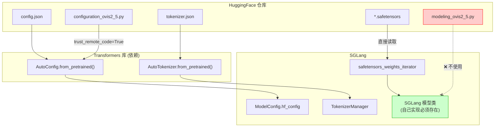
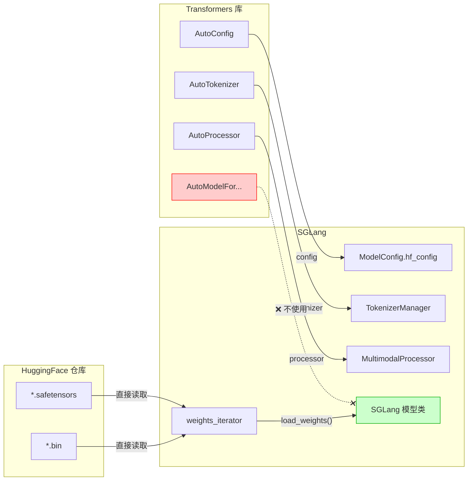

# 09. 模型加载 (Model Loading)

## 1. 概述

SGLang 的模型加载系统负责从各种格式（SafeTensors、PyTorch、GGUF 等）加载模型权重，并处理量化、分片等需求。

```
┌─────────────────────────────────────────────────────────────────────────────┐
│                        模型加载完整流程                                      │
├─────────────────────────────────────────────────────────────────────────────┤
│                                                                              │
│  1. 确定加载格式                                                             │
│     LoadFormat: AUTO | SAFETENSORS | PT | GGUF | DUMMY | SHARDED...         │
│                                                                              │
│  2. 选择 ModelLoader                                                        │
│     ├── DefaultModelLoader (通用)                                           │
│     ├── LayeredModelLoader (逐层量化)                                       │
│     ├── QuantizedRLModelLoader (FP8 RL)                                     │
│     ├── BitsAndBytesModelLoader (BNB 4/8bit)                                │
│     ├── GGUFModelLoader (GGUF 格式)                                         │
│     └── ShardedStateLoader (分片加载)                                       │
│                                                                              │
│  3. 准备权重                                                                │
│     _prepare_weights() → 下载 / 定位本地文件                                │
│                                                                              │
│  4. 初始化模型                                                               │
│     _initialize_model() → 创建模型结构 (带 quant_config)                    │
│                                                                              │
│  5. 加载权重                                                                │
│     model.load_weights(weights_iterator)                                    │
│                                                                              │
│  6. 后处理                                                                  │
│     quant_method.process_weights_after_loading()                            │
│                                                                              │
└─────────────────────────────────────────────────────────────────────────────┘
```

## 2. 核心类层次

### 2.1 BaseModelLoader (抽象基类)

```python
# loader.py L280-299
class BaseModelLoader(ABC):
    """Base class for model loaders."""
    
    def __init__(self, load_config: LoadConfig):
        self.load_config = load_config
    
    @abstractmethod
    def download_model(self, model_config: ModelConfig) -> None:
        """Download a model so that it can be immediately loaded."""
        raise NotImplementedError
    
    @abstractmethod
    def load_model(
        self,
        *,
        model_config: ModelConfig,
        device_config: DeviceConfig,
    ) -> nn.Module:
        """Load a model with the given configurations."""
        raise NotImplementedError
```

### 2.2 LoadConfig 与 LoadFormat

```python
# load_config.py
class LoadFormat(str, Enum):
    AUTO = "auto"              # 自动检测
    SAFETENSORS = "safetensors" # .safetensors 文件
    FASTSAFETENSORS = "fastsafetensors"  # 使用 fastsafetensors 库
    PT = "pt"                  # PyTorch .pt/.bin 文件
    NPCACHE = "npcache"        # NumPy 缓存
    DUMMY = "dummy"            # 随机权重 (测试用)
    GGUF = "gguf"              # GGUF 格式
    BITSANDBYTES = "bitsandbytes"  # BNB 量化
    SHARDED_STATE = "sharded_state"  # TP 分片
    LAYERED = "layered"        # 逐层加载
    FLASH_RL = "flash_rl"      # FP8 RL 训练

@dataclass
class LoadConfig:
    load_format: LoadFormat = LoadFormat.AUTO
    download_dir: Optional[str] = None
    model_loader_extra_config: Dict[str, Any] = field(default_factory=dict)
    ignore_patterns: Optional[List[str]] = None
    draft_model_idx: Optional[int] = None  # MTP 草稿模型索引
```

## 3. DefaultModelLoader (主力加载器)

### 3.1 权重准备流程

```python
# loader.py L372-457
def _prepare_weights(
    self, model_name_or_path: str, revision: Optional[str], fall_back_to_pt: bool
) -> Tuple[str, List[str], bool]:
    """Prepare weights for the model. If not local, download from HF."""
    
    # 1. 尝试从 ModelScope 下载 (中国区)
    model_name_or_path = self._maybe_download_from_modelscope(...) or model_name_or_path
    
    # 2. 确定文件匹配模式
    if load_format == LoadFormat.AUTO:
        allow_patterns = ["*.safetensors", "*.bin"]
    elif load_format == LoadFormat.SAFETENSORS:
        allow_patterns = ["*.safetensors"]
    elif load_format == LoadFormat.MISTRAL:
        allow_patterns = ["consolidated*.safetensors"]
    ...
    
    # 3. 下载或定位本地文件
    if not is_local:
        hf_folder = download_weights_from_hf(
            model_name_or_path,
            self.load_config.download_dir,
            allow_patterns,
            revision,
        )
    else:
        hf_folder = model_name_or_path
    
    # 4. 过滤重复文件
    hf_weights_files = filter_duplicate_safetensors_files(...)
    
    return hf_folder, hf_weights_files, use_safetensors
```

### 3.2 权重迭代器

```python
# loader.py L459-527
def _get_weights_iterator(self, source: "Source") -> Generator:
    """Get an iterator for the model weights based on the load format."""
    
    hf_folder, hf_weights_files, use_safetensors = self._prepare_weights(...)
    
    if self.load_config.load_format == LoadFormat.NPCACHE:
        weights_iterator = np_cache_weights_iterator(...)
    elif use_safetensors:
        if load_format == LoadFormat.FASTSAFETENSORS:
            weights_iterator = fastsafetensors_weights_iterator(hf_weights_files)
        elif extra_config.get("enable_multithread_load"):
            # 多线程加载 (默认 8 线程)
            weights_iterator = multi_thread_safetensors_weights_iterator(
                hf_weights_files,
                max_workers=extra_config.get("num_threads", 8),
            )
        else:
            weights_iterator = safetensors_weights_iterator(hf_weights_files)
    else:
        weights_iterator = pt_weights_iterator(hf_weights_files)
    
    # 返回带前缀的权重 (name, tensor)
    return ((source.prefix + name, tensor) for (name, tensor) in weights_iterator)
```

### 3.3 模型加载主流程

```python
# loader.py L616-642
def load_model(
    self,
    *,
    model_config: ModelConfig,
    device_config: DeviceConfig,
) -> nn.Module:
    
    target_device = torch.device(device_config.device)
    
    with set_default_torch_dtype(model_config.dtype):
        with target_device:
            # 1. 初始化模型结构 (带量化配置)
            model = _initialize_model(model_config, self.load_config)
        
        # 2. 加载权重并后处理
        self.load_weights_and_postprocess(
            model, 
            self._get_all_weights(model_config, model), 
            target_device
        )
    
    return model.eval()

@staticmethod
def load_weights_and_postprocess(model, weights, target_device):
    # 1. 加载权重
    model.load_weights(weights)
    
    # 2. 量化后处理
    for _, module in model.named_modules():
        quant_method = getattr(module, "quant_method", None)
        if quant_method is not None:
            with device_loading_context(module, target_device):
                quant_method.process_weights_after_loading(module)
```

## 4. 模型的 load_weights 方法

每个模型类都实现自己的 `load_weights()` 方法来处理权重映射：

### 4.1 典型实现 (Qwen3)

```python
# models/qwen3.py L485-540
class Qwen3ForCausalLM(nn.Module):
    
    # 合并权重映射
    packed_modules_mapping = {
        "qkv_proj": ["q_proj", "k_proj", "v_proj"],
        "gate_up_proj": ["gate_proj", "up_proj"],
    }
    
    def load_weights(self, weights: Iterable[Tuple[str, torch.Tensor]]):
        # 定义需要特殊处理的合并参数
        stacked_params_mapping = [
            ("qkv_proj", "q_proj", "q"),
            ("qkv_proj", "k_proj", "k"),
            ("qkv_proj", "v_proj", "v"),
            ("gate_up_proj", "gate_proj", 0),
            ("gate_up_proj", "up_proj", 1),
        ]
        
        params_dict = dict(self.named_parameters())
        
        for name, loaded_weight in weights:
            # 1. 重映射名称
            for param_name, weight_name, shard_id in stacked_params_mapping:
                if weight_name in name:
                    name = name.replace(weight_name, param_name)
                    # 使用 weight_loader 处理合并
                    param = params_dict[name]
                    weight_loader = param.weight_loader
                    weight_loader(param, loaded_weight, shard_id)
                    break
            else:
                # 2. 普通权重直接加载
                param = params_dict[name]
                if hasattr(param, "weight_loader"):
                    param.weight_loader(param, loaded_weight)
                else:
                    param.data.copy_(loaded_weight)
```

### 4.2 权重加载器 (weight_loader)

`weight_loader` 是 SGLang 处理张量并行 (TP) 和合并权重的核心机制：

```python
# Column Parallel 权重加载
def load_column_parallel_weight(param, loaded_weight, shard_id):
    """处理 Column Parallel 分片权重"""
    tp_rank = get_tensor_model_parallel_rank()
    tp_size = get_tensor_model_parallel_world_size()
    
    # 计算当前 rank 应该加载的切片
    shard_size = loaded_weight.shape[0] // tp_size
    start = tp_rank * shard_size
    end = start + shard_size
    
    param.data.copy_(loaded_weight[start:end])

# QKV 合并权重加载
def load_qkv_weight(param, loaded_weight, shard_id):
    """处理 QKV 合并权重"""
    if shard_id == "q":
        offset = 0
    elif shard_id == "k":
        offset = q_size
    elif shard_id == "v":
        offset = q_size + k_size
    
    param.data[offset:offset + shard_size].copy_(loaded_weight)
```

## 5. 与 Transformers 的关系

SGLang 的模型加载与 Transformers 的关系如下：

### 5.1 配置加载：依赖 Transformers

```python
# hf_transformers_utils.py L246-342
def get_config(model, trust_remote_code, revision=None, ...):
    """使用 Transformers AutoConfig 加载模型配置"""
    
    # 核心：使用 AutoConfig.from_pretrained 加载 config.json
    config = AutoConfig.from_pretrained(
        model, 
        trust_remote_code=trust_remote_code, 
        revision=revision,
    )
    
    # 特殊模型的配置注册
    if config.model_type in _CONFIG_REGISTRY:
        config_class = _CONFIG_REGISTRY[config.model_type]
        config = config_class.from_pretrained(model, revision=revision)
    
    return config
```

**配置加载流程：**
```
model_path → AutoConfig.from_pretrained() → config.json → hf_config
                                                           ↓
                                            ModelConfig(hf_config=config)
```

### 5.2 Tokenizer/Processor：依赖 Transformers

```python
# hf_transformers_utils.py
def get_tokenizer(tokenizer_name, ...):
    return AutoTokenizer.from_pretrained(tokenizer_name, ...)

def get_processor(tokenizer_name, ...):
    return AutoProcessor.from_pretrained(tokenizer_name, ...)
```

### 5.3 模型结构：完全独立

**SGLang 不使用 transformers 的模型类，而是自己实现。** 原因：

1. **性能优化**：融合 Attention、使用 Paged KV Cache
2. **Tensor Parallel**：原生 TP 支持
3. **量化适配**：与量化层深度集成

```python
# loader.py L228-277
def _initialize_model(model_config, load_config):
    """使用 SGLang 自己的模型类，不用 transformers 的"""
    
    # 获取 SGLang 模型类 (如 Qwen3ForCausalLM)
    model_class, _ = get_model_architecture(model_config)
    
    # 传入 transformers 的 config，但创建 SGLang 的模型
    return model_class(
        config=model_config.hf_config,  # ← Transformers 的 config
        quant_config=quant_config,
    )
```

### 5.4 权重加载：直接读取 SafeTensors

**SGLang 直接从 .safetensors/.bin 文件读取权重，不经过 transformers。**

```python
# weight_utils.py
def safetensors_weights_iterator(hf_weights_files, disable_mmap=False):
    """直接使用 safetensors 库读取，不用 transformers"""
    for st_file in hf_weights_files:
        with safe_open(st_file, framework="pt", device="cpu") as f:
            for name in f.keys():
                yield name, f.get_tensor(name)
```

### 5.5 权重名称映射

HuggingFace 权重名称与 SGLang 模型可能不同，需要映射：

```python
# 模型类定义映射关系
class Qwen3ForCausalLM(nn.Module):
    # HF 权重名 → SGLang 参数名
    packed_modules_mapping = {
        "qkv_proj": ["q_proj", "k_proj", "v_proj"],
        "gate_up_proj": ["gate_proj", "up_proj"],
    }
    
    def load_weights(self, weights):
        for name, tensor in weights:
            # HF: model.layers.0.self_attn.q_proj.weight
            # SGLang: model.layers.0.self_attn.qkv_proj.weight (合并后)
            ...
```

### 5.6 自定义模型的加载 (trust_remote_code)

对于 **自定义模型**（如 Ovis2.5、InternVL 等），HuggingFace 仓库包含自定义的 Python 文件：

```
HuggingFace 仓库结构 (以 Ovis2.5 为例)
├── config.json                   # 模型配置
├── configuration_ovis2_5.py      # 自定义 Config 类 (Python)
├── modeling_ovis2_5.py           # 自定义模型类 (Python) ← SGLang 不使用!
├── model-00001-of-00004.safetensors
├── model-00002-of-00004.safetensors
├── model-00003-of-00004.safetensors
├── model-00004-of-00004.safetensors
├── model.safetensors.index.json
├── tokenizer.json
└── preprocessor_config.json
```

**加载流程：**

| 文件 | 用途 | SGLang 行为 |
|------|------|-------------|
| `config.json` | 模型配置 | ✅ 通过 `AutoConfig` 读取 |
| `configuration_ovis2_5.py` | 自定义 Config 类 | ✅ `trust_remote_code=True` 时执行 |
| `modeling_ovis2_5.py` | HF 模型实现 | ❌ **不使用**，SGLang 自己实现 |
| `*.safetensors` | 权重文件 | ✅ 直接读取 |
| `tokenizer.json` | Tokenizer | ✅ 通过 `AutoTokenizer` 读取 |

> [!IMPORTANT]
> **关键点**：即使 HuggingFace 仓库包含 `modeling_*.py`，SGLang 也**不会使用**它。
> SGLang 必须在 `python/sglang/srt/models/` 中有对应的模型实现才能支持该模型。

```python
# 启动时需要 trust_remote_code
python -m sglang.launch_server \
    --model-path BAAI/Ovis2.5-Gemma3-8B \
    --trust-remote-code  # ← 必需：用于加载自定义 Config
```

**为什么需要 trust_remote_code？**

```python
# hf_transformers_utils.py
def get_config(model, trust_remote_code, ...):
    config = AutoConfig.from_pretrained(
        model,
        trust_remote_code=trust_remote_code,  # ← 允许执行远程 Python 代码
    )
    # 这会加载 configuration_ovis2_5.py 中定义的自定义 Config 类
    return config
```

**自定义模型加载流程图：**



### 5.7 总结：各组件依赖关系

| 组件 | 是否依赖 Transformers | 说明 |
|------|---------------------|------|
| **Config 加载** | ✅ 依赖 | `AutoConfig.from_pretrained()` |
| **自定义 Config 类** | ✅ 依赖 | 需要 `trust_remote_code=True` |
| **Tokenizer** | ✅ 依赖 | `AutoTokenizer.from_pretrained()` |
| **Processor** | ✅ 依赖 | `AutoProcessor.from_pretrained()` |
| **模型结构** | ❌ 不依赖 | SGLang 自己实现 |
| **权重加载** | ❌ 不依赖 | 直接读取 SafeTensors |
| **权重格式** | ✅ 兼容 | 使用 HF 仓库的权重文件 |



## 6. 量化支持

### 6.1 量化配置获取

```python
# loader.py L190-225
def _get_quantization_config(
    model_config: ModelConfig,
    load_config: LoadConfig,
    packed_modules_mapping: Dict[str, List[str]],
) -> Optional[QuantizationConfig]:
    """Get the quantization config."""
    
    if model_config.quantization is not None:
        # 从权重文件解析量化配置
        quant_config = get_quant_config(
            model_config, load_config, packed_modules_mapping
        )
        
        # 检查 GPU 能力
        major, minor = get_device_capability()
        capability = major * 10 + minor
        if capability < quant_config.get_min_capability():
            raise ValueError(f"Quantization {model_config.quantization} "
                           f"requires capability {quant_config.get_min_capability()}")
        
        return quant_config
    return None
```

### 6.2 支持的量化方法

| 量化方法 | 描述 | 最低 SM 版本 | 模型加载器 |
|----------|------|------------|------------|
| **AWQ** | 4-bit 权重量化 | SM70 | DefaultModelLoader |
| **GPTQ** | 4-bit 权重量化 | SM70 | DefaultModelLoader |
| **FP8** | FP8 量化 (E4M3/E5M2) | SM89 | DefaultModelLoader |
| **BitsAndBytes** | 4/8-bit 混合精度 | SM75 | BitsAndBytesModelLoader |
| **GGUF** | GGML 量化格式 | - | GGUFModelLoader |
| **TorchAO** | PyTorch AO 量化 | SM80+ | LayeredModelLoader |
| **ModelOpt** | NVIDIA ModelOpt | SM80+ | DefaultModelLoader |

### 6.3 量化后处理

```python
# 在 load_weights_and_postprocess 中调用
for _, module in model.named_modules():
    quant_method = getattr(module, "quant_method", None)
    if quant_method is not None:
        # 将模块临时移到 GPU 进行处理
        with device_loading_context(module, target_device):
            quant_method.process_weights_after_loading(module)
```

## 7. 特殊加载器

### 7.1 LayeredModelLoader (逐层量化)

用于大模型逐层加载和量化，减少峰值内存使用：

```python
# loader.py L662-731
class LayeredModelLoader(DefaultModelLoader):
    """Load weights layer by layer, quantize before loading next layer."""
    
    def load_model(self, *, model_config, device_config):
        # 1. 在 meta 设备上创建模型 (不分配内存)
        with torch.device("meta"):
            model = _initialize_model(model_config, self.load_config)
        
        # 2. 逐层加载和量化
        def fill_module(module, fqn, weights):
            for name, submod in module.named_children():
                fill_module(submod, fqn + [name], weights)
            
            # 移到目标设备
            module.to_empty(device=target_device, recurse=False)
            
            # 加载权重
            model.load_weights_to_module(fqn_path, weights)
            
            # 立即量化 (如果适用)
            if torchao_config and "proj" in fqn_path:
                apply_torchao_config_to_model(module, torchao_config)
        
        fill_module(model, [], weights)
```

### 7.2 BitsAndBytesModelLoader

处理 BNB 4-bit 和 8-bit 量化：

```python
# loader.py L1433-1906
class BitsAndBytesModelLoader(BaseModelLoader):
    """Load model with BitsAndBytes quantization."""
    
    def _get_quantized_weights_iterator(
        self, model_name_or_path, revision, pre_quant, load_8bit
    ):
        if pre_quant:
            # 预量化模型: 直接加载
            if load_8bit:
                return self._quantized_8bit_generator(...)
            else:
                return self._quantized_4bit_generator(...)
        else:
            # 动态量化: 加载原始权重，运行时量化
            return self._unquantized_generator(...)
```

### 7.3 GGUFModelLoader

加载 GGUF 格式模型：

```python
# loader.py L1909-2011
class GGUFModelLoader(BaseModelLoader):
    """Load GGUF format models."""
    
    def _get_weights_iterator(self):
        # 使用 gguf_quant_weights_iterator
        return gguf_quant_weights_iterator(
            gguf_files,
            model_config.quantization,
        )
```

### 7.4 QuantizedRLModelLoader (FP8 RL)

用于 VERL 等 RL 训练场景的 FP8 量化：

```python
# loader.py L734-1204
class QuantizedRLModelLoader(DefaultModelLoader):
    """Profile-free FP8 quantization for RL training."""
    
    # 跳过量化的参数
    SKIP_QUANTIZATION_PARAMS = [
        "lm_head.weight",
        "embed_tokens",
        "layernorm.weight",
        ...
    ]
    
    def rebinding_and_load_weights(model, first_time_load_weights, weights):
        """Reload: VERL sends BF16 → Quantize to FP8 → Copy to original memory."""
        
        def quantize_weights_iterator(weights_iter):
            for name, tensor in weights_iter:
                if should_quantize(name):
                    # 量化为 FP8
                    tensor, scale = quantize_fp8(tensor)
                yield name, tensor
```

## 8. 权重下载

### 8.1 HuggingFace Hub 下载

```python
# weight_utils.py L438-521
def download_weights_from_hf(
    model_name_or_path: str,
    cache_dir: Optional[str],
    allow_patterns: List[str],
    revision: Optional[str] = None,
    max_retries: int = 3,
):
    """Download model weights from Hugging Face Hub."""
    
    # 1. 检查本地缓存
    local_dir = _find_local_hf_snapshot_dir_unlocked(
        model_name_or_path, cache_dir, allow_patterns, revision
    )
    if local_dir:
        return local_dir
    
    # 2. 启用 hf_transfer 加速
    enable_hf_transfer()
    
    # 3. 下载 (带重试)
    for attempt in range(max_retries):
        try:
            return huggingface_hub.snapshot_download(
                model_name_or_path,
                cache_dir=cache_dir,
                allow_patterns=allow_patterns,
                revision=revision,
                tqdm_class=DisabledTqdm if is_rank0 else None,
            )
        except Exception:
            if attempt == max_retries - 1:
                raise
```

### 8.2 ModelScope 下载 (中国区)

```python
# loader.py L346-370
def _maybe_download_from_modelscope(self, model, revision):
    """Download from ModelScope if SGLANG_USE_MODELSCOPE=True."""
    
    if get_bool_env_var("SGLANG_USE_MODELSCOPE"):
        from modelscope.hub.snapshot_download import snapshot_download
        
        return snapshot_download(
            model_id=model,
            cache_dir=self.load_config.download_dir,
            revision=revision,
        )
    return None
```

## 9. 并行加载优化

### 9.1 多线程 SafeTensors 加载

```python
# weight_utils.py
def multi_thread_safetensors_weights_iterator(
    hf_weights_files: List[str],
    max_workers: int = 8,
    disable_mmap: bool = False,
):
    """Load safetensors files using multiple threads."""
    
    with concurrent.futures.ThreadPoolExecutor(max_workers=max_workers) as executor:
        futures = {
            executor.submit(load_safetensor_file, f): f 
            for f in hf_weights_files
        }
        for future in concurrent.futures.as_completed(futures):
            for name, tensor in future.result().items():
                yield name, tensor
```

### 9.2 FastSafeTensors (GPU 直接加载)

```python
# weight_utils.py
def fastsafetensors_weights_iterator(hf_weights_files: List[str]):
    """Load safetensors directly to GPU using fastsafetensors."""
    
    loader = SafeTensorsFileLoader(hf_weights_files, device="cuda")
    for name, tensor in loader:
        yield name, tensor
```

## 10. 环境变量

| 变量 | 默认值 | 说明 |
|------|--------|------|
| `SGLANG_USE_MODELSCOPE` | False | 使用 ModelScope 下载 |
| `HF_HUB_OFFLINE` | False | 离线模式 |
| `HF_HUB_ENABLE_HF_TRANSFER` | True | 启用高速传输 |
| `SGLANG_WEIGHT_LOADER_DISABLE_MMAP` | False | 禁用 mmap |
| `SGLANG_FLASHINFER_WORKSPACE_SIZE` | 256MB | FlashInfer 工作区 (Qwen3 需 512MB) |

## 11. 调试技巧

### 11.1 查看加载格式

```bash
# 强制使用特定格式
python -m sglang.launch_server \
    --model-path Qwen/Qwen3-8B \
    --load-format safetensors
```

### 11.2 多线程加载

```python
# 启用多线程加载
load_config = LoadConfig(
    load_format=LoadFormat.AUTO,
    model_loader_extra_config={
        "enable_multithread_load": True,
        "num_threads": 16,
    }
)
```

### 11.3 查看权重映射

```python
# 打印模型的权重映射
model_class, _ = get_model_architecture(model_config)
print(f"packed_modules_mapping: {model_class.packed_modules_mapping}")
```
