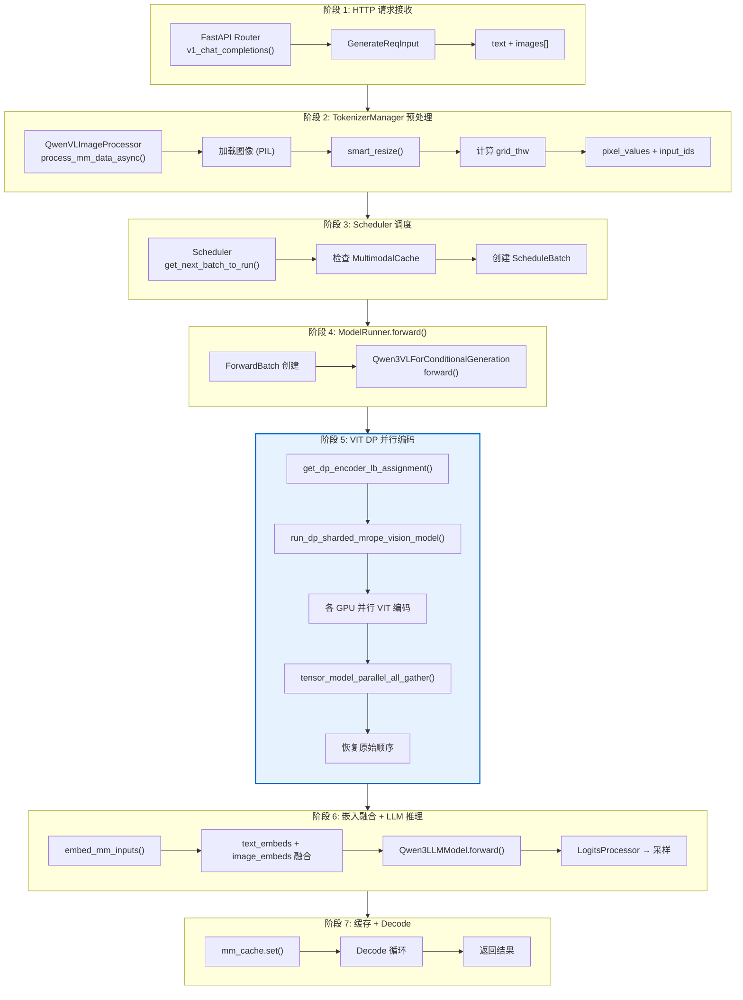
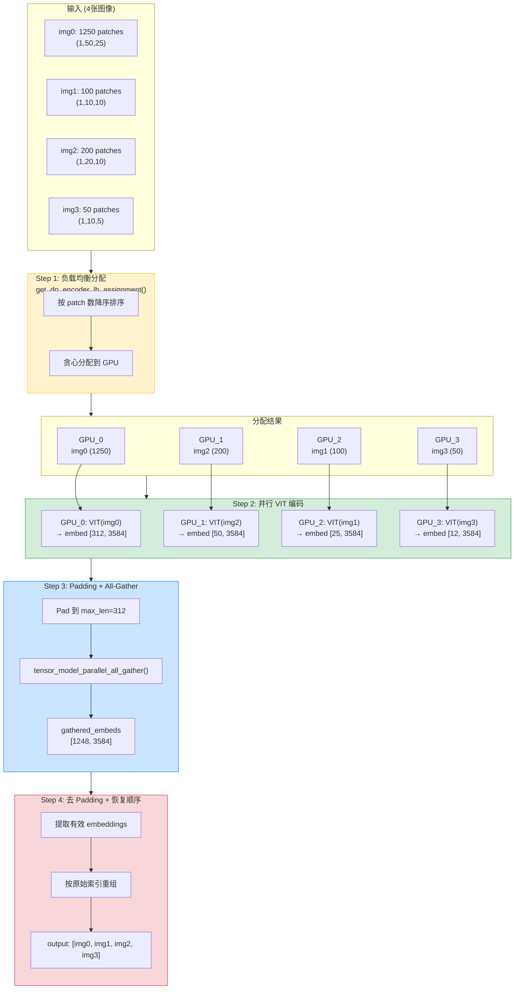
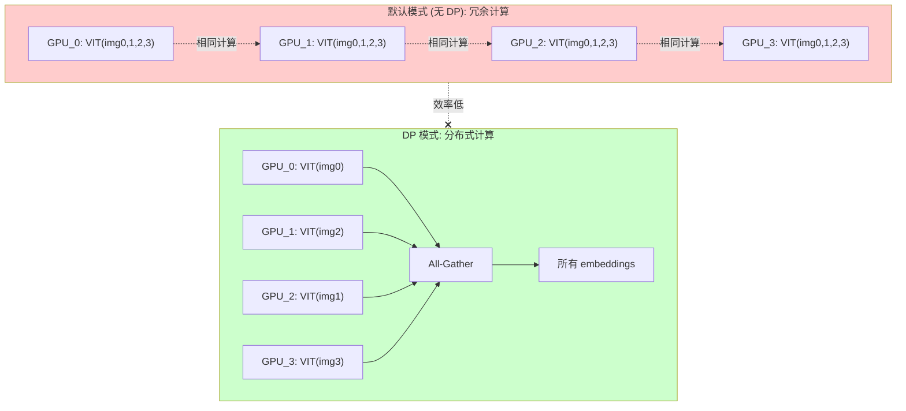

# 10. 多模态处理 (Multimodal Processing)

## 1. 概述

SGLang 的多模态系统处理图像、视频、音频等非文本输入，支持 Qwen3-VL、LLaVA、InternVL 等模型。

```
┌─────────────────────────────────────────────────────────────────────────────┐
│                      多模态完整生命周期                                      │
├─────────────────────────────────────────────────────────────────────────────┤
│                                                                              │
│  1. 请求接收 (HTTP/API)                                                     │
│     └── images=[base64/URL], text="<image> Describe this"                   │
│                                                                              │
│  2. 预处理 (Tokenizer Manager)                                              │
│     ├── 加载图像 (PIL/decord)                                               │
│     ├── 调整尺寸 (smart_resize)                                             │
│     ├── 计算 grid_thw (temporal, height, width)                             │
│     └── 生成 hash (用于缓存)                                                │
│                                                                              │
│  3. Tokenizer                                                               │
│     ├── 替换 <image> → <|image_pad|> * num_patches                          │
│     └── 构建 input_ids + image_offsets                                      │
│                                                                              │
│  4. Scheduler 调度                                                          │
│     ├── 检查 MultimodalCache 命中                                           │
│     └── 分配 mm_embedding 位置                                              │
│                                                                              │
│  5. VIT 编码 (ModelRunner)                                                  │
│     ├── 像素值 → Vision Encoder                                             │
│     ├── patch_embedding + position_embedding                                │
│     ├── Transformer Blocks (可使用 CUDA Graph)                              │
│     └── 输出 image_embeddings [num_patches, hidden_size]                    │
│                                                                              │
│  6. 嵌入融合                                                                │
│     ├── text_embeddings = embed_tokens(input_ids)                           │
│     ├── text_embeddings[image_offsets] = image_embeddings                  │
│     └── 合并后的 hidden_states                                              │
│                                                                              │
│  7. LLM 推理                                                                │
│     └── Prefill / Decode (使用融合后的 embeddings)                          │
│                                                                              │
└─────────────────────────────────────────────────────────────────────────────┘
```

## 2. 核心类层次

### 2.1 BaseMultimodalProcessor

```python
# base_processor.py L162-901
class BaseMultimodalProcessor(ABC):
    """Base class for all multimodal processors."""
    
    models = []  # 支持的模型类列表
    
    def __init__(self, hf_config, server_args, _processor, transport_mode, *args, **kwargs):
        self.hf_config = hf_config
        self._processor = _processor  # HuggingFace AutoProcessor
        self.multimodal_tokens = MultimodalSpecialTokens(...)  # 特殊 token
        
        # 缓存配置
        self.mm_cache_enabled = server_args.mm_cache_enabled
        self.mm_feature_cache = LRUCache(maxsize=MM_FEATURE_CACHE_SIZE)
        
        # 并行处理
        self.executor = concurrent.futures.ThreadPoolExecutor(max_workers=8)
    
    @abstractmethod
    def process_mm_data(self, input_text, images=None, videos=None, audios=None):
        """Process multimodal data with transformers AutoProcessor."""
        raise NotImplementedError
    
    def get_mm_data(self, prompt, embeddings, img_grid_thw):
        """Get multimodal metadata for scheduling."""
        return {
            "embeddings": embeddings,
            "img_grid_thw": img_grid_thw,
            ...
        }
```

### 2.2 MultimodalSpecialTokens

```python
# base_processor.py L65-159
@dataclass
class MultimodalSpecialTokens:
    """Manages special tokens for multimodal inputs."""
    
    image_token: Optional[Union[str, List[str]]] = None   # "<image>"
    video_token: Optional[Union[str, List[str]]] = None   # "<video>"
    audio_token: Optional[Union[str, List[str]]] = None   # "<audio>"
    image_token_id: Optional[int] = None
    video_token_id: Optional[int] = None
    audio_token_id: Optional[int] = None
    
    def get_modality_of_token(self, token: str) -> Optional[Modality]:
        """返回 token 对应的模态类型"""
        if token == self.image_token:
            return Modality.IMAGE
        ...
    
    def get_combined_regex(self) -> str:
        """构建用于分割输入的正则表达式"""
        patterns = []
        if self.image_token:
            patterns.append(re.escape(self.image_token))
        ...
        return "|".join(patterns)
```

### 2.3 QwenVLImageProcessor (Qwen3-VL 专用)

```python
# processors/qwen_vl.py L223-417
class QwenVLImageProcessor(BaseMultimodalProcessor):
    """Compatible with Qwen-VL & Qwen-Omni Series."""
    
    models = [
        Qwen2VLForConditionalGeneration,
        Qwen2_5_VLForConditionalGeneration,
        Qwen3VLForConditionalGeneration,
        Qwen3VLMoeForConditionalGeneration,
        Qwen3OmniMoeForConditionalGeneration,
    ]
    
    def __init__(self, hf_config, server_args, _processor, *args, **kwargs):
        super().__init__(...)
        
        # Qwen 特有配置
        self.image_factor = IMAGE_FACTOR  # 28
        self.min_pixels = MIN_PIXELS      # 4 * 28 * 28
        self.max_pixels = MAX_PIXELS      # 16384 * 28 * 28
        
        # 特殊 token
        self.multimodal_tokens = MultimodalSpecialTokens(
            image_token="<|image_pad|>",
            video_token="<|video_pad|>",
        )
    
    def process_mm_data_async(self, image_data, input_text, request_obj, **kwargs):
        """异步处理多模态数据"""
        
        # 1. 并行加载图像
        futures = [
            self.executor.submit(self._load_single_item, img, Modality.IMAGE)
            for img in image_data
        ]
        
        # 2. 调整尺寸 (smart_resize)
        for future in concurrent.futures.as_completed(futures):
            image = future.result()
            height, width = image.size
            new_h, new_w = smart_resize(height, width, self.image_factor, 
                                        self.min_pixels, self.max_pixels)
            image = image.resize((new_w, new_h))
        
        # 3. 计算 grid_thw
        grid_thw = self._compute_grid_thw(images)
        
        # 4. 调用 HuggingFace processor
        return self._processor(
            text=input_text,
            images=images,
            return_tensors="pt",
        )
```

## 3. 图像预处理

### 3.1 smart_resize (Qwen-VL)

```python
# processors/qwen_vl.py L49-79
def smart_resize(
    height: int,
    width: int,
    factor: int = IMAGE_FACTOR,      # 28
    min_pixels: int = MIN_PIXELS,    # 4 * 28 * 28
    max_pixels: int = MAX_PIXELS,    # 16384 * 28 * 28
) -> Tuple[int, int]:
    """
    Rescales the image ensuring:
    1. Both dimensions are divisible by 'factor'
    2. Total pixels within [min_pixels, max_pixels]
    3. Aspect ratio maintained
    """
    
    # 调整到 factor 的倍数
    h_bar = max(factor, round_by_factor(height, factor))
    w_bar = max(factor, round_by_factor(width, factor))
    
    # 检查像素限制
    if h_bar * w_bar > max_pixels:
        # 缩小
        beta = math.sqrt((height * width) / max_pixels)
        h_bar = floor_by_factor(height / beta, factor)
        w_bar = floor_by_factor(width / beta, factor)
    elif h_bar * w_bar < min_pixels:
        # 放大
        beta = math.sqrt(min_pixels / (height * width))
        h_bar = ceil_by_factor(height * beta, factor)
        w_bar = ceil_by_factor(width * beta, factor)
    
    return h_bar, w_bar
```

### 3.2 grid_thw 计算

Qwen-VL 使用 3D grid (temporal, height, width) 表示视觉 patches：

```python
def _compute_grid_thw(images):
    """计算每张图像的 grid 尺寸"""
    grid_thw = []
    for img in images:
        h, w = img.size
        # patches = (h // 28) * (w // 28)
        t = 1  # 图像: temporal=1, 视频: temporal=num_frames
        grid_h = h // IMAGE_FACTOR
        grid_w = w // IMAGE_FACTOR
        grid_thw.append((t, grid_h, grid_w))
    return grid_thw
```

### 3.3 视频处理

```python
# processors/qwen_vl.py L146-219
def preprocess_video(vr, image_factor=28, video_config={}):
    """Process video for Qwen-VL."""
    
    total_frames = len(vr)
    video_fps = vr.get_avg_fps()
    
    # 1. 计算采样帧数
    nframes = smart_nframes(video_config, total_frames, video_fps)
    
    # 2. 均匀采样
    frame_indices = np.linspace(0, total_frames - 1, nframes, dtype=int)
    frames = vr.get_batch(frame_indices).asnumpy()
    
    # 3. 调整尺寸 (考虑总像素限制)
    h, w = frames.shape[1:3]
    new_h, new_w = smart_resize(
        h, w, 
        factor=image_factor,
        min_pixels=VIDEO_MIN_PIXELS,
        max_pixels=VIDEO_MAX_PIXELS // nframes,  # 分摊到每帧
    )
    
    return frames, (nframes, new_h // image_factor, new_w // image_factor)
```

## 4. 多模态缓存 (MultimodalCache)

### 4.1 缓存机制

```python
# mem_cache/multimodal_cache.py
class MultimodalCache(ABC):
    """Abstract base for multimodal embedding cache."""
    
    @staticmethod
    def combine_hashes(mm_hashes: List[int]) -> Optional[int]:
        """Combine multiple item hashes into one."""
        if not mm_hashes:
            return None
        return hash(tuple(mm_hashes))
    
    @abstractmethod
    def get(self, mm_hashes: List[int], combined_hash=None) -> Optional[torch.Tensor]:
        """Get cached embedding by hash."""
        raise NotImplementedError
    
    @abstractmethod
    def set(self, mm_hash: int, embedding: torch.Tensor, allocator) -> bool:
        """Store embedding with hash."""
        raise NotImplementedError

class MultiModalStaticCache(MultimodalCache):
    """LRU cache for multimodal embeddings."""
    
    def __init__(self, max_size: int):
        self.max_size = max_size
        self.mm_cache: OrderedDict[int, torch.Tensor] = OrderedDict()
        self.current_size = 0
    
    def set(self, mm_hash, embedding, loc=None):
        data_size = embedding.element_size() * embedding.numel()
        
        # LRU 逐出
        while self.current_size + data_size > self.max_size:
            if not self.mm_cache:
                return False
            lru_hash, lru_embedding = self.mm_cache.popitem(last=False)
            self.current_size -= _get_tensor_size(lru_embedding)
        
        self.mm_cache[mm_hash] = embedding
        self.current_size += data_size
        return True
```

### 4.2 缓存工作流

```python
# 在 Scheduler 中使用
def handle_multimodal_request(req):
    # 1. 计算 hash
    mm_hash = MultimodalCache.combine_hashes(req.mm_hashes)
    
    # 2. 检查缓存
    cached = self.mm_cache.get(req.mm_hashes, mm_hash)
    if cached is not None:
        req.mm_embeddings = cached
        return
    
    # 3. 未命中: 需要 VIT 编码
    req.need_mm_encode = True
```

## 5. VIT CUDA Graph

### 5.1 ViTCudaGraphRunner

```python
# multimodal/vit_cuda_graph_runner.py L28-381
class ViTCudaGraphRunner:
    """
    Generic ViT CUDA Graph Runner.
    
    Captures "blocks + merger + deepstack merger" into CUDA graph.
    Lazily captures graphs for each unique sequence length.
    """
    
    def __init__(self, vit: nn.Module):
        self.vit = vit
        self.graphs: Dict[int, torch.cuda.CUDAGraph] = {}
        self.graph_inputs: Dict[int, Dict] = {}
        self.graph_outputs: Dict[int, torch.Tensor] = {}
        
        # 启用条件
        self.enabled = get_global_server_args().vit_enable_cuda_graph
    
    def _get_graph_key(self, x_3d: torch.Tensor) -> int:
        """Graph key = sequence length."""
        return x_3d.shape[0]
    
    def run(self, x, cu_seqlens, cu_window_seqlens, position_embeddings, ...):
        """Run VIT with CUDA Graph if available."""
        
        graph_key = self._get_graph_key(x)
        
        if graph_key not in self.graphs:
            # 首次遇到此 shape: 捕获 graph
            return self.create_graph(x, cu_seqlens, ...)
        else:
            # 命中: 重放
            return self.replay(graph_key, x, position_embeddings, ...)
```

### 5.2 Graph 捕获

```python
def _create_graph(self, graph_key, position_embeddings, ...):
    """Capture VIT forward as CUDA Graph."""
    
    # 1. 分配输入 buffer
    x_buffer = torch.empty((graph_key, 1, self.hidden_size), ...)
    
    # 2. warmup
    with torch.no_grad():
        _ = self._run_vit_forward(x_buffer, ...)
    
    # 3. 捕获
    graph = torch.cuda.CUDAGraph()
    with torch.cuda.graph(graph):
        output = self._run_vit_forward(x_buffer, ...)
    
    self.graphs[graph_key] = graph
    self.graph_inputs[graph_key] = {"x": x_buffer, ...}
    self.graph_outputs[graph_key] = output
```

### 5.3 环境变量

```bash
# 启用 VIT CUDA Graph
export SGLANG_VIT_ENABLE_CUDA_GRAPH=1

# 仅支持部分 attention backend
# 支持: triton_attn, fa3
# 不支持: flashinfer (目前)
```

## 6. 嵌入融合

### 6.1 融合流程 (Qwen3-VL)

```python
# models/qwen3_vl.py
class Qwen3VLForConditionalGeneration(nn.Module):
    
    def forward(
        self,
        input_ids: torch.Tensor,
        positions: torch.Tensor,
        pixel_values: Optional[torch.Tensor] = None,
        image_grid_thw: Optional[torch.Tensor] = None,
        **kwargs,
    ):
        # 1. 获取视觉嵌入
        if pixel_values is not None:
            # VIT 编码
            image_embeds = self.visual(
                pixel_values, 
                grid_thw=image_grid_thw
            )
        
        # 2. 获取文本嵌入
        inputs_embeds = self.language_model.embed_tokens(input_ids)
        
        # 3. 融合 (替换 image pad token 位置)
        if image_embeds is not None:
            # 找到 <|image_pad|> 的位置
            image_mask = (input_ids == self.image_token_id)
            inputs_embeds[image_mask] = image_embeds.flatten(0, 1)
        
        # 4. 送入 LLM
        return self.language_model(
            input_ids=None,
            inputs_embeds=inputs_embeds,
            positions=positions,
            ...
        )
```

### 6.2 mrope (Multi-Resolution RoPE)

Qwen-VL 使用 3D RoPE 处理不同分辨率：

```python
def get_rope_index(
    input_ids: torch.Tensor,
    image_grid_thw: torch.Tensor,
    attention_mask: torch.Tensor,
):
    """Calculate 3D position indices for mrope."""
    
    # 文本 token: [0, 1, 2, 3, ...]
    # 图像 token: [t, h, w] 坐标
    
    position_ids = torch.zeros((batch_size, seq_len, 3), ...)
    
    for i, (t, h, w) in enumerate(image_grid_thw):
        # 图像 patches 的 3D 位置
        temporal = torch.arange(t).repeat_interleave(h * w)
        height = torch.arange(h).repeat(t * w)
        width = torch.arange(w).repeat(t * h)
        
        position_ids[i, image_start:image_end, 0] = temporal
        position_ids[i, image_start:image_end, 1] = height
        position_ids[i, image_start:image_end, 2] = width
    
    return position_ids
```

## 7. 支持的模态和模型

### 7.1 模态类型

```python
# 定义在 base_processor.py
class Modality(Enum):
    IMAGE = "image"
    VIDEO = "video"
    AUDIO = "audio"
```

### 7.2 支持的模型

| 模型 | 支持模态 | Processor 类 |
|------|----------|--------------|
| **Qwen3-VL** | 图像, 视频 | `QwenVLImageProcessor` |
| **Qwen2.5-VL** | 图像, 视频 | `QwenVLImageProcessor` |
| **Qwen3-Omni** | 图像, 视频, 音频 | `QwenVLImageProcessor` |
| **LLaVA** | 图像 | `LLaVAImageProcessor` |
| **LLaVA-OneVision** | 图像, 视频 | `LLaVAImageProcessor` |
| **InternVL** | 图像 | `InternVLImageProcessor` |
| **GLM-4V** | 图像 | `GLM4VImageProcessor` |
| **MiniCPM-V** | 图像, 视频 | `MiniCPMImageProcessor` |
| **Phi-4-MM** | 图像 | `Phi4MMImageProcessor` |

## 8. 数据流转

```
┌─────────────────────────────────────────────────────────────────────────────┐
│                        多模态数据流转                                        │
├─────────────────────────────────────────────────────────────────────────────┤
│                                                                              │
│  HTTP Request                                                                │
│  ├── images: ["base64:...", "http://..."]                                   │
│  └── messages: [{"role": "user", "content": "<image> Describe"}]            │
│                                                                              │
│       ↓                                                                      │
│                                                                              │
│  Tokenizer Manager (process_mm_data_async)                                  │
│  ├── images: [PIL.Image, PIL.Image, ...]                                    │
│  ├── pixel_values: [B, C, H, W] tensor                                      │
│  ├── image_grid_thw: [[1, 24, 32], [1, 16, 20], ...]                        │
│  └── input_ids: [1, 2, 3, IMG_PAD, IMG_PAD, ..., 100, 101]                  │
│                                                                              │
│       ↓                                                                      │
│                                                                              │
│  Req 对象                                                                   │
│  ├── mm_data: {"pixel_values": tensor, "image_grid_thw": tensor}            │
│  ├── mm_hashes: [hash1, hash2, ...]                                         │
│  └── image_offsets: [3, 4, 5, 6, ...]  # IMG_PAD 位置                       │
│                                                                              │
│       ↓                                                                      │
│                                                                              │
│  Scheduler (ScheduleBatch → ModelWorkerBatch)                               │
│  ├── 检查 MultimodalCache                                                   │
│  └── 分配 mm_embedding_loc                                                  │
│                                                                              │
│       ↓                                                                      │
│                                                                              │
│  ModelRunner (ForwardBatch)                                                 │
│  ├── VIT 编码: pixel_values → image_embeddings                             │
│  ├── 缓存: mm_cache.set(hash, embeddings)                                   │
│  └── 融合 + LLM forward                                                    │
│                                                                              │
└─────────────────────────────────────────────────────────────────────────────┘
```

## 9. 优化策略

### 9.1 图像缓存

```python
# 启用多模态缓存
python -m sglang.launch_server \
    --model-path Qwen/Qwen3-VL-7B \
    --mm-cache-size 2048  # MB
```

### 9.2 VIT CUDA Graph

```bash
# 对于 Triton/FA3 backend
export SGLANG_VIT_ENABLE_CUDA_GRAPH=1
```

### 9.3 VIT DP Encoder (Data Parallel 编码)

启用 `--mm-enable-dp-encoder` 后，VIT 编码会在多个 GPU 上并行执行：

```bash
python -m sglang.launch_server \
    --model-path Qwen/Qwen3-VL-7B \
    --tp 4 \
    --mm-enable-dp-encoder  # 启用 VIT DP
```

#### 9.3.1 为什么需要 VIT DP？

默认情况下，VIT 编码在每个 TP rank 上执行完全相同的计算（冗余），浪费计算资源：

```
默认模式 (无 DP)：每个 GPU 处理所有图像
┌─────────────────────────────────────────────────────────────────────────────┐
│  GPU_0: VIT([img1, img2, img3, img4]) → [emb1, emb2, emb3, emb4]           │
│  GPU_1: VIT([img1, img2, img3, img4]) → [emb1, emb2, emb3, emb4]  (冗余)   │
│  GPU_2: VIT([img1, img2, img3, img4]) → [emb1, emb2, emb3, emb4]  (冗余)   │
│  GPU_3: VIT([img1, img2, img3, img4]) → [emb1, emb2, emb3, emb4]  (冗余)   │
└─────────────────────────────────────────────────────────────────────────────┘

DP 模式：每个 GPU 处理部分图像，然后 All-Gather
┌─────────────────────────────────────────────────────────────────────────────┐
│  GPU_0: VIT([img1])        → [emb1]        ─┐                              │
│  GPU_1: VIT([img2])        → [emb2]         │    All-Gather                │
│  GPU_2: VIT([img3])        → [emb3]         ├─────────────→ 全部 embeddings│
│  GPU_3: VIT([img4])        → [emb4]        ─┘                              │
└─────────────────────────────────────────────────────────────────────────────┘
```

#### 9.3.2 负载均衡算法

不同图像的 patch 数量可能差异很大，简单轮询分配会导致负载不均衡：

```python
# mm_utils.py L361-427
def get_dp_encoder_lb_assignment(
    sizes: list[int],      # 每张图像的 patch 数量
    num_gpus: int = 2,     # GPU 数量
) -> tuple[list[int], list[int], list[int]]:
    """
    贪心算法：按图像大小负载均衡分配到 GPU。
    
    Example:
        sizes = [1000, 100, 200, 50]  # 4 张图像的 patch 数
        num_gpus = 2
        
        # 按大小降序排列: [1000, 200, 100, 50] → 索引 [0, 2, 1, 3]
        # 贪心分配：
        #   GPU_0: [1000] (图像 0)
        #   GPU_1: [200, 100, 50] (图像 2, 1, 3)
        
        Returns:
            shuffle_indices = [0, 2, 1, 3]  # 重排序索引
            gpu_sample_counts = [1, 3]       # 每 GPU 分配的图像数
            grouped_sizes = [1000, 350]      # 每 GPU 的总 patch 数
    """
    
    # 1. 按大小降序排列
    large_to_small_indices = sorted(
        range(len(sizes)), key=lambda i: sizes[i], reverse=True
    )
    
    # 2. 贪心分配：每次分配给当前负载最小的 GPU
    gpu_loads = [0] * num_gpus
    gpu_assignments = [[] for _ in range(num_gpus)]
    
    for idx in large_to_small_indices:
        min_gpu = min(range(num_gpus), key=lambda i: gpu_loads[i])
        gpu_assignments[min_gpu].append(idx)
        gpu_loads[min_gpu] += sizes[idx]
    
    return shuffle_indices, gpu_sample_counts, gpu_loads
```

#### 9.3.3 完整执行流程

```python
# mm_utils.py L465-651
def run_dp_sharded_mrope_vision_model(
    vision_model: torch.nn.Module,
    pixel_values: torch.Tensor,       # [total_patches, channel]
    grid_thw_list: list,              # [(t1,h1,w1), (t2,h2,w2), ...]
    rope_type: str,                   # "rope_3d" or "rope_2d"
):
    """
    在 TP 组上并行执行 VIT 编码。
    
    执行流程:
    1. 计算每张图像的 patch 数
    2. 负载均衡分配
    3. 每个 rank 提取自己负责的 pixel_values
    4. 执行 VIT 编码
    5. All-Gather 收集所有 rank 的结果
    6. 按原始顺序重组 embeddings
    """
    
    tp_size = get_tensor_model_parallel_world_size()
    tp_rank = get_tensor_model_parallel_rank()
    
    # 1. 计算每张图像的 patch 数
    patches_per_image = [t * h * w for t, h, w in grid_thw_list]
    cum_patches = [0, *itertools.accumulate(patches_per_image)]
    
    # 2. 负载均衡分配
    (image_to_tp_rank, gpu_sample_counts, grouped_pixel_values_len) = \
        get_dp_encoder_lb_assignment(patches_per_image, tp_size)
    
    # 3. 提取本 rank 负责的图像索引
    cum_gpu_sample_counts = [0, *itertools.accumulate(gpu_sample_counts)]
    image_idxs_local = image_to_tp_rank[
        cum_gpu_sample_counts[tp_rank]:cum_gpu_sample_counts[tp_rank + 1]
    ]
    
    # 4. 提取本 rank 负责的 pixel_values
    pixel_values_local = torch.cat([
        pixel_values[cum_patches[i]:cum_patches[i + 1]]
        for i in image_idxs_local
    ])
    local_grid_thw = [grid_thw_list[i] for i in image_idxs_local]
    
    # 5. 执行 VIT 编码
    image_embeds_local = vision_model(pixel_values_local, torch.tensor(local_grid_thw))
    
    # 6. Padding + All-Gather
    max_len = max(grouped_pixel_values_len) // embed_dim_reduction_factor
    padded = pad_to_length(image_embeds_local, max_len)
    gathered_embeds = tensor_model_parallel_all_gather(padded, dim=0)
    
    # 7. 按原始顺序重组
    original_order_embeddings = [None] * len(grid_thw_list)
    for rank in range(tp_size):
        rank_images = get_images_for_rank(rank)
        for img_idx, embed in zip(rank_images, split_embeddings(rank)):
            original_order_embeddings[img_idx] = embed
    
    return torch.cat(original_order_embeddings, dim=0)
```

## 附录: VIT DP 完整请求生命周期

### 整体流程概览



### 阶段 5 详解: VIT DP 并行编码

这是 VIT DP 的核心阶段，详细展示负载均衡和并行处理过程：



### 负载均衡算法详解

```mermaid
flowchart LR
    subgraph Input["输入: patches = [1250, 100, 200, 50]"]
        direction TB
        P0["img0: 1250"]
        P1["img1: 100"]
        P2["img2: 200"]
        P3["img3: 50"]
    end

    subgraph Sort["Step 1: 降序排序"]
        S["[1250, 200, 100, 50]<br/>索引: [0, 2, 1, 3]"]
    end

    subgraph Greedy["Step 2: 贪心分配"]
        direction TB
        G1["Round 1: img0(1250) → GPU_0"]
        G2["Round 2: img2(200) → GPU_1"]
        G3["Round 3: img1(100) → GPU_2"]
        G4["Round 4: img3(50) → GPU_3"]
    end

    subgraph Result["分配结果"]
        direction TB
        R0["GPU_0: [img0]<br/>负载=1250"]
        R1["GPU_1: [img2]<br/>负载=200"]
        R2["GPU_2: [img1]<br/>负载=100"]
        R3["GPU_3: [img3]<br/>负载=50"]
    end

    Input --> Sort --> Greedy --> Result

    style G1 fill:#d4edda
    style G2 fill:#d4edda
    style G3 fill:#d4edda
    style G4 fill:#d4edda
```



### 与非 DP 模式对比



### 涉及的核心类和函数

| 阶段 | 类/文件 | 核心函数 |
|------|---------|----------|
| 1. 请求接收 | `v1_chat_completions.py` | `v1_chat_completions()` |
| 2. 预处理 | `QwenVLImageProcessor` | `process_mm_data_async()` |
| 2. 预处理 | `mm_utils.py` | `smart_resize()` |
| 3. 调度 | `Scheduler` | `get_next_batch_to_run()` |
| 3. 调度 | `MultiModalStaticCache` | `get()`, `set()` |
| 4. 模型前向 | `Qwen3VLForConditionalGeneration` | `forward()` |
| 5. VIT DP | `mm_utils.py` | `get_dp_encoder_lb_assignment()` |
| 5. VIT DP | `mm_utils.py` | `run_dp_sharded_mrope_vision_model()` |
| 5. VIT DP | `Qwen3VLMoeVisionModel` | `forward()` |
| 5. VIT DP | `communication_op.py` | `tensor_model_parallel_all_gather()` |
| 6. 融合 | `mm_utils.py` | `embed_mm_inputs()`, `general_mm_embed_routine()` |
| 6. LLM | `Qwen3LLMModel` | `forward()` |
| 7. 采样 | `LogitsProcessor` | `forward()` |

## 10. 调试技巧

### 10.1 查看图像处理

```python
# 打印 grid_thw
processor = QwenVLImageProcessor(...)
result = processor.process_mm_data(text, images=[img])
print(f"grid_thw: {result['image_grid_thw']}")
print(f"pixel_values shape: {result['pixel_values'].shape}")
```

### 10.2 检查缓存命中

```python
# 设置日志级别
export SGLANG_LOG_LEVEL=debug

# 查看日志中的缓存命中信息
# [DEBUG] MultimodalCache hit for hash=12345678
```

### 10.3 禁用缓存 (调试)

```bash
python -m sglang.launch_server \
    --model-path Qwen/Qwen3-VL-7B \
    --mm-cache-size 0  # 禁用缓存
```
