# SGLang Chunked Prefill 分块预填充

## 1. 概述

Chunked Prefill（分块预填充）是 SGLang 的核心调度优化技术，用于解决长序列预填充阻塞 Decode 请求的问题。

### 1.1 问题背景

在传统预填充模式下，长序列会独占 GPU 资源，导致：
- **延迟尖峰**：Decode 请求被阻塞，TTFT (Time To First Token) 增加
- **批处理效率低**：GPU 利用率不稳定
- **内存压力**：需要一次性分配整个序列的 KV Cache

### 1.2 解决方案

Chunked Prefill 将长序列分成多个 chunk 逐步处理：

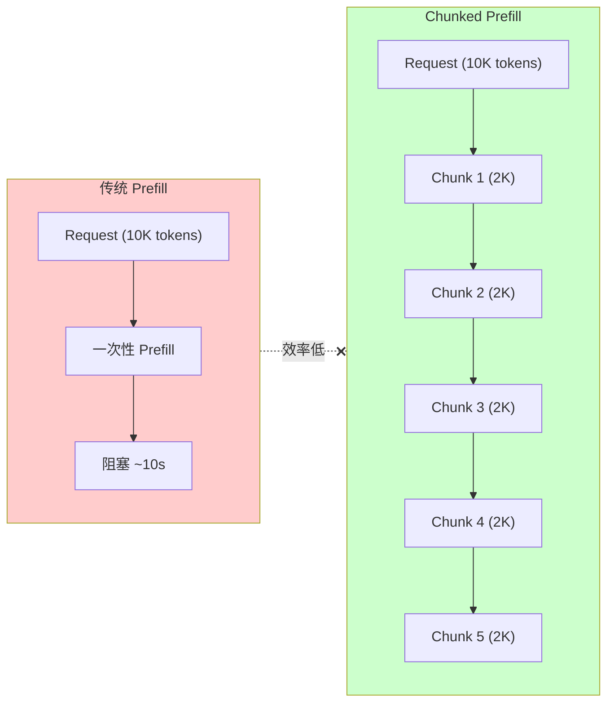

## 2. 核心参数

| 参数 | 类型 | 默认值 | 说明 |
|------|------|--------|------|
| `--chunked-prefill-size` | int | None | 每个 chunk 的最大 token 数 |
| `--enable-mixed-chunk` | bool | False | 允许 Prefill + Decode 混合批次 |
| `--enable-dynamic-chunking` | bool | False | PP 模式下动态调整 chunk 大小 |
| `--max-prefill-tokens` | int | 16384 | 单批次最大 prefill token 数 |

### 2.1 启用方式

```bash
# 基本 Chunked Prefill
python -m sglang.launch_server \
    --model-path Qwen/Qwen2.5-7B \
    --chunked-prefill-size 4096

# Chunked Prefill + Mixed Chunk (推荐)
python -m sglang.launch_server \
    --model-path Qwen/Qwen2.5-7B \
    --chunked-prefill-size 4096 \
    --enable-mixed-chunk
```

## 3. 初始化流程

```python
# scheduler.py L742-769
def init_chunked_prefill(self):
    # 从 server_args 读取 chunked_prefill_size
    self.chunked_prefill_size = self.server_args.chunked_prefill_size
    
    # 特殊情况: Diffusion LLM 使用 block_size 作为 chunk size
    if self.dllm_config is not None:
        self.chunked_prefill_size = self.dllm_config.block_size
    
    # -1 表示禁用
    if self.chunked_prefill_size <= 0:
        self.chunked_prefill_size = None
    
    # 当前正在分块处理的请求
    self.chunked_req = None
    
    # Mixed Chunk 模式: 允许 Prefill + Decode 混合
    self.is_mixed_chunk = (
        self.chunked_prefill_size is not None
        and self.server_args.enable_mixed_chunk
    )
    
    # PP 动态调整 chunk size
    self.enable_dynamic_chunking = (
        self.server_args.enable_dynamic_chunking and self.pp_size > 1
    )
```

## 4. 调度流程

### 4.1 整体流程

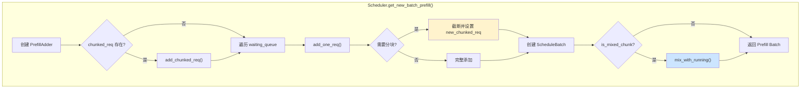

### 4.2 PrefillAdder 核心参数

```python
# schedule_policy.py L317-367
class PrefillAdder:
    def __init__(
        self,
        page_size: int,                      # 页大小
        tree_cache: BasePrefixCache,         # Radix Cache
        token_to_kv_pool_allocator,          # KV Pool 分配器
        running_batch: ScheduleBatch,        # 当前运行批次
        new_token_ratio: float,              # 新 token 比率
        rem_input_tokens: int,               # 剩余 input token 预算 (max_prefill_tokens)
        rem_chunk_tokens: Optional[int],     # 剩余 chunk token 预算 (chunked_prefill_size)
        mixed_with_decode_tokens: int = 0,   # Mixed Chunk 时的 decode tokens
        ...
    ):
        self.rem_input_tokens = rem_input_tokens - mixed_with_decode_tokens
        self.rem_chunk_tokens = rem_chunk_tokens
        if self.rem_chunk_tokens is not None:
            self.rem_chunk_tokens -= mixed_with_decode_tokens
        
        # 结果状态
        self.can_run_list = []      # 可以运行的请求列表
        self.new_chunked_req = None # 新的分块请求
```

### 4.3 add_one_req 分块判断

```python
# schedule_policy.py L570-666
def add_one_req(self, req: Req, has_chunked_req: bool, truncation_align_size: Optional[int]):
    input_tokens = self.ceil_paged_tokens(req.extend_input_len)
    
    # 判断是否需要分块
    if self.rem_chunk_tokens is None or input_tokens <= self.rem_chunk_tokens:
        # 不需要分块: 完整添加
        self.can_run_list.append(req)
        self.tree_cache.inc_lock_ref(req.last_node)
        self._update_prefill_budget(prefix_len, input_tokens, max_new_tokens)
    else:
        # 需要分块: 截断并标记为 chunked_req
        trunc_len = self.rem_chunk_tokens // self.page_size * self.page_size
        if trunc_len <= 0:
            return AddReqResult.OTHER
        
        # 考虑对齐要求 (如 FlashInfer 的 attention split size)
        if truncation_align_size is not None:
            trunc_len = truncation_align_size * (trunc_len // truncation_align_size)
        
        # 截断请求
        req.set_extend_input_len(trunc_len)
        req.fill_ids = req.fill_ids[: len(req.prefix_indices) + trunc_len]
        
        self.can_run_list.append(req)
        self.new_chunked_req = req  # ← 标记为分块请求
        self.tree_cache.inc_lock_ref(req.last_node)
        self._update_prefill_budget(prefix_len, trunc_len, 0)  # max_new_tokens=0
    
    return self.budget_state()
```

### 4.4 分块请求生命周期

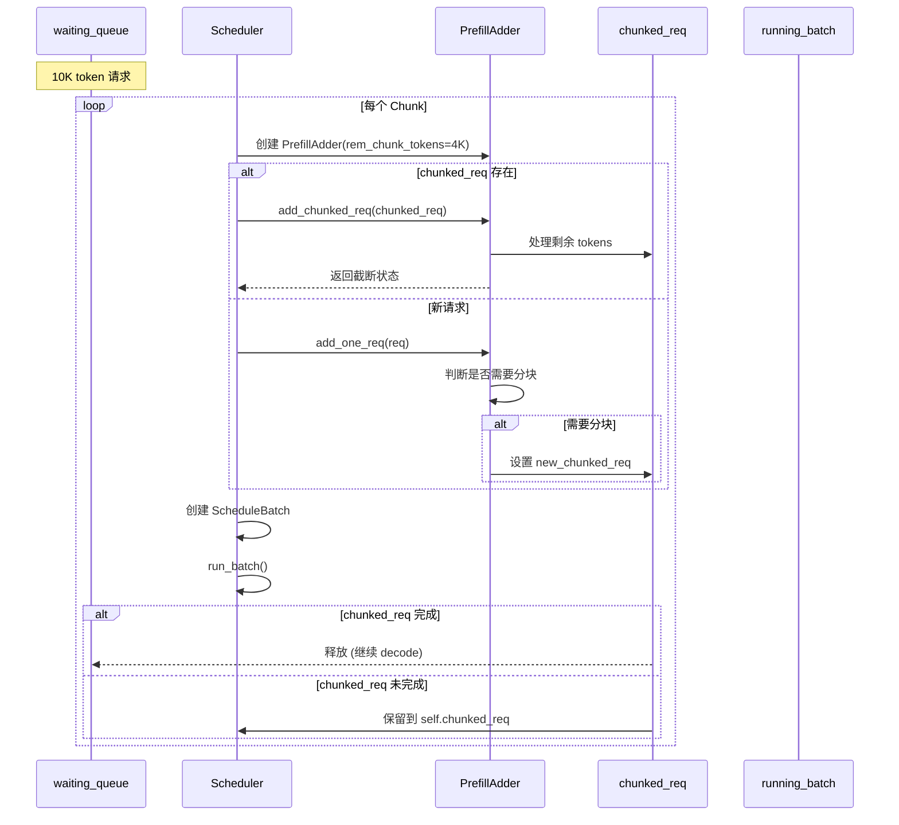

## 5. Forward Mode

Chunked Prefill 引入了 `ForwardMode.MIXED` 模式：

```python
# forward_batch_info.py L70-77
class ForwardMode(IntEnum):
    EXTEND = auto()   # 普通 Prefill
    DECODE = auto()   # Decode 1 token
    MIXED = auto()    # Chunked Prefill + Decode 混合
    IDLE = auto()     # 空闲
    ...
```

### 5.1 ForwardMode 状态转换

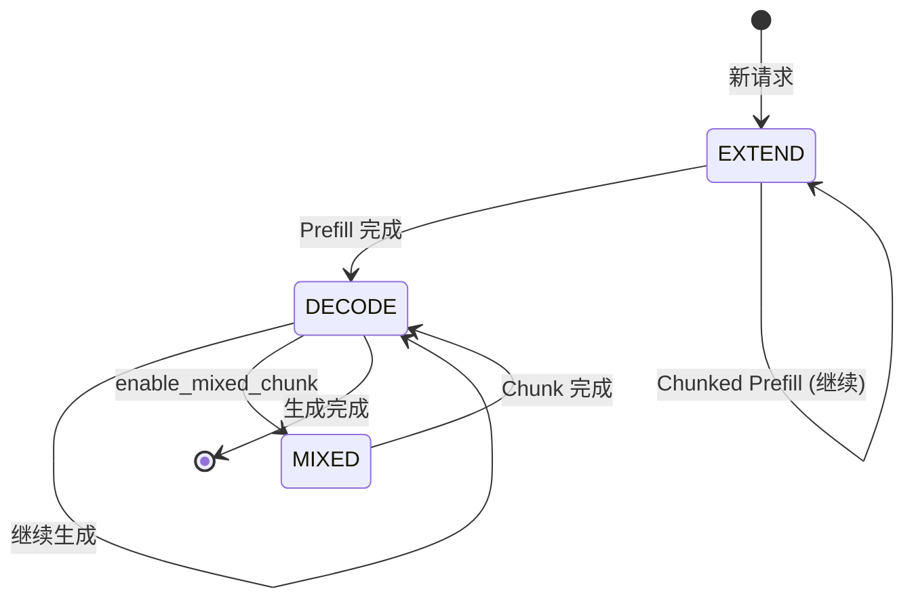

## 6. Mixed Chunk 模式

Mixed Chunk 允许将 Chunked Prefill 和 Decode 请求合并到同一批次，最大化 GPU 利用率。

### 6.1 启用条件

```python
# scheduler.py L2053-2067
# Mixed-style chunked prefill
if (
    self.is_mixed_chunk
    and not self.running_batch.is_empty()
    and not (new_batch.return_logprob or self.running_batch.return_logprob)
):
    # 合并 Prefill + Decode
    self.running_batch.filter_batch(v1_spec_info_filtered=True)
    if not self.running_batch.is_empty():
        self.running_batch.prepare_for_decode()
        new_batch.mix_with_running(self.running_batch)
        new_batch.decoding_reqs = self.running_batch.reqs
```

### 6.2 mix_with_running 实现

```python
# schedule_batch.py L1671-1700
def mix_with_running(self, running_batch: "ScheduleBatch"):
    # 设置为 MIXED 模式
    self.forward_mode = ForwardMode.MIXED
    running_bs = running_batch.batch_size()
    
    # 为每个 decode 请求设置 extend_input_len = 1
    for req in running_batch.reqs:
        req.fill_ids = req.origin_input_ids + req.output_ids
        req.set_extend_input_len(1)
    
    # 合并 input_ids 和 out_cache_loc
    input_ids = torch.cat([self.input_ids, running_batch.input_ids])
    out_cache_loc = torch.cat([self.out_cache_loc, running_batch.out_cache_loc])
    
    self.merge_batch(running_batch)
    self.input_ids = input_ids
    self.out_cache_loc = out_cache_loc
    
    # 更新 extend 信息
    self.extend_lens.extend([1] * running_bs)  # Decode 请求 extend_len=1
    self.extend_num_tokens += running_bs
    self.is_prefill_only = False
```

### 6.3 Mixed Batch 结构

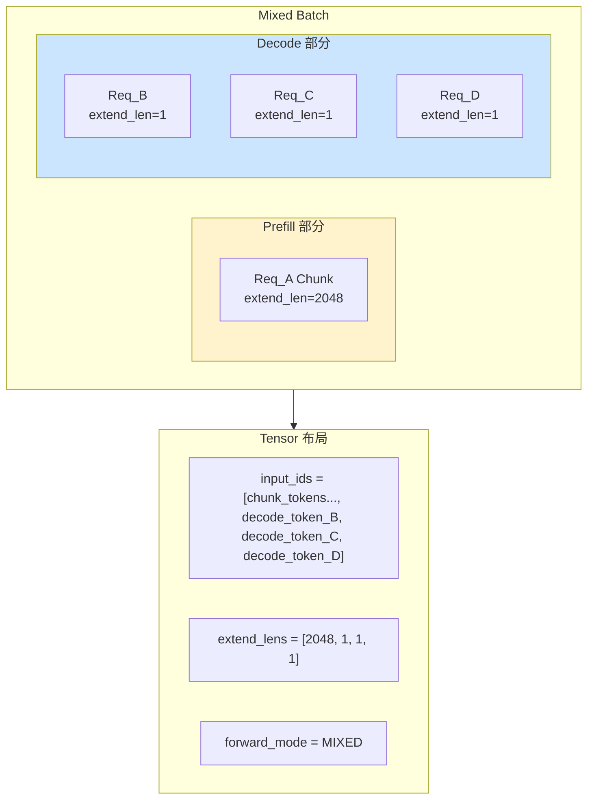

## 7. 多模态分块预填充

多模态模型的 Chunked Prefill 需要特殊处理，确保图像/视频 embedding 能够正确地按 chunk 提取。

### 7.1 支持的模型

```python
# model_config.py L1126-1136
def is_multimodal_chunked_prefill_supported(model_architectures: List[str]):
    """检查多模态模型是否支持 Chunked Prefill"""
    return any(
        arch in model_architectures
        for arch in [
            "Qwen2VLForConditionalGeneration",
            "Qwen3VLForConditionalGeneration",
            "InternVLChatModel",
            ...
        ]
    )
```

### 7.2 核心机制: Embedding Chunk 提取

多模态 Chunked Prefill 的关键是 **从完整的多模态 embedding 中提取当前 chunk 对应的部分**。

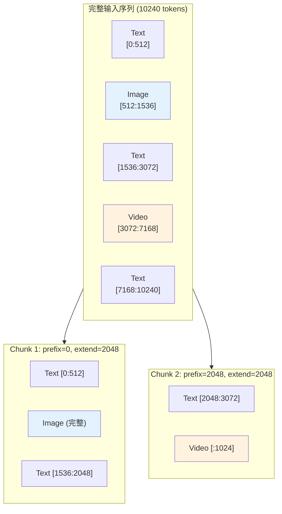

### 7.3 get_embedding_chunk 函数

```python
# mm_utils.py L379-421
def get_embedding_chunk(
    embedding: torch.Tensor,          # 完整的多模态 embedding
    extend_prefix_len: int,           # 当前 chunk 的起始位置
    extend_seq_len: int,              # 当前 chunk 的长度
    items_offset: List[Tuple[int, int]],  # 每个多模态 item 在序列中的 [start, end]
) -> Tuple[torch.Tensor, int, int]:
    """
    从完整 embedding 中提取当前 chunk 需要的部分。

    工作原理:
    1. 计算 chunk 的 token 范围 [extend_prefix_len, extend_prefix_len + extend_seq_len)
    2. 遍历每个多模态 item 的 offset, 找出与当前 chunk 重叠的部分
    3. 从 embedding 中切片出对应的 rows
    """
    start_index, end_index = 0, 0
    extend_start_index = extend_prefix_len
    extend_end_index = extend_prefix_len + extend_seq_len - 1

    for start, end in items_offset:
        # 计算 embedding 中的 start_index
        if extend_start_index >= start and extend_start_index <= end:
            start_index += extend_start_index - start
        elif extend_start_index > end:
            start_index += end - start + 1

        # 计算 embedding 中的 end_index
        if extend_end_index >= start and extend_end_index <= end:
            end_index += extend_end_index - start + 1
        elif extend_end_index > end:
            end_index += end - start + 1

    embedding = embedding.reshape(-1, embedding.shape[-1])
    embedding_chunk = embedding[start_index:end_index]
    return embedding_chunk, start_index, end_index
```

### 7.4 长视频分块处理

对于包含大量帧的视频，SGLang 提供了优化的分块处理机制：

```python
# mm_utils.py L700-787
def _get_chunked_prefill_embedding_for_chunked_items(...):
    """
    多模态 embedding 的分块计算优化。
    
    对于长视频（如 500 帧）:
    1. 不一次性计算所有帧的 embedding
    2. 只计算与当前 chunk 相关的帧
    3. 使用 embedding cache 避免重复计算
    """
    for i in range(max_iterations):
        # 选择与当前 chunk 相关的 items (带额外 padding)
        embedding_items_per_chunk = get_embedding_items_per_chunk_with_extra_padding(
            embedding_items_per_req,
            extend_prefix_len=prefix_length[i],
            extend_seq_len=extend_length[i],
            items_offset=items_offset,
        )
        
        # 尝试从 cache 获取
        embedding_per_chunk = embedding_cache.get(embedding_items_hash)
        if embedding_per_chunk is None:
            # Cache miss: 只对相关帧执行 ViT forward
            embedding_per_chunk = data_embedding_func(embedding_items_per_chunk)
            embedding_cache.set(embedding_items_hash, embedding_per_chunk.cpu())
```

### 7.5 Embedding 长度不匹配处理

当 embedding 长度与 input_ids 中的 placeholder 数量不匹配时：

```python
# mm_utils.py L796-825
def _adjust_embedding_length(embedding, mask, logger):
    num_mm_tokens_in_embedding = embedding.shape[0]
    num_mm_tokens_in_input_ids = mask.sum().item()
    
    if num_mm_tokens_in_input_ids < num_mm_tokens_in_embedding:
        chunked_prefill_size = get_global_server_args().chunked_prefill_size
        if chunked_prefill_size != -1:
            logger.warning(
                "You may want to avoid this issue by raising "
                "`chunked_prefill_size`, or disabling chunked prefill"
            )
        # 从末尾截取需要的部分
        embedding = embedding[-num_mm_tokens_in_input_ids:, :]
    return embedding
```

### 7.6 多模态分块流程图

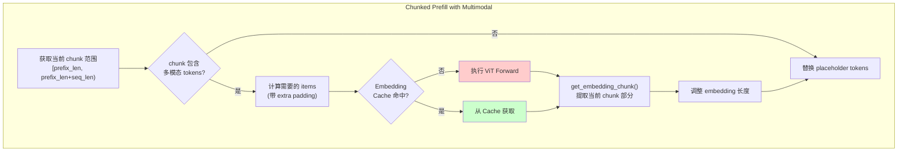

> [!IMPORTANT]
> 多模态 Chunked Prefill 不会切分单个图像/视频的 embedding 计算，而是在 **embedding 级别** 按 chunk 边界提取。VIT 计算仍然是原子性的。

---

## 8. PD 分离场景下的 Chunked Prefill

在 Prefill-Decode 分离架构中，Chunked Prefill 有独特的处理流程。

### 8.1 整体架构

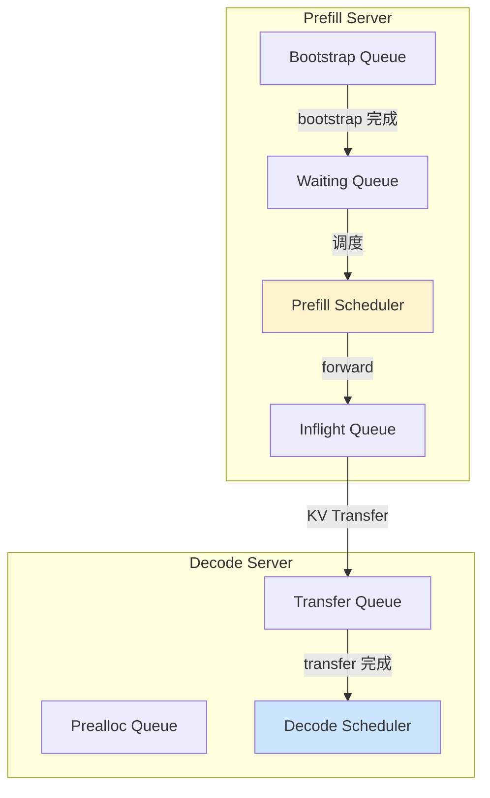

### 8.2 请求状态跟踪

PD 分离使用 `is_chunked` 计数器跟踪分块进度：

```python
# prefill.py L448-501
def process_batch_result_disagg_prefill(self, batch, result):
    for i, (req, next_token_id) in enumerate(zip(batch.reqs, next_token_ids)):
        if req.is_chunked <= 0:
            # Prefill 完成，发送 KV 到 Decode Server
            req.output_ids.append(next_token_id)
            self.tree_cache.cache_unfinished_req(req)
            self.disagg_prefill_inflight_queue.append(req)
            self.send_kv_chunk(req, last_chunk=True)
        else:
            # 还有后续 chunk
            req.is_chunked -= 1
            if self.enable_overlap:
                # Overlap 模式: 延迟 KV 发送
                self.send_kv_chunk(req, last_chunk=False, end_idx=req.tmp_end_idx)
```

### 8.3 分块 KV 传输

在 PD 分离模式下，每个 chunk 完成后都可以开始 KV 传输：

```python
# prefill.py L656-734
def send_kv_chunk(
    self: Scheduler,
    req: Req,
    last_chunk: bool = False,
    end_idx: Optional[int] = None,
):
    """
    发送 prefill 完成的 chunk 到 decode server
    """
    page_size = self.token_to_kv_pool_allocator.page_size
    start_idx = req.start_send_idx
    end_idx = end_idx or min(len(req.fill_ids), len(req.origin_input_ids))

    if not last_chunk:
        # 非最后 chunk: 只发送完整的 pages
        end_idx = end_idx - end_idx % page_size

    kv_indices = self.req_to_token_pool.req_to_token[
        req.req_pool_idx, start_idx:end_idx
    ].cpu().numpy()
    
    req.start_send_idx = end_idx  # 更新下次发送的起始位置
    page_indices = kv_to_page_indices(kv_indices, page_size)
    
    if last_chunk:
        # 最后 chunk: 发送 metadata
        self.disagg_metadata_buffers.set_buf(req)
        
        # 处理 hybrid model 的特殊状态
        if isinstance(self.token_to_kv_pool_allocator.get_kvcache(), HybridLinearKVPool):
            # Mamba: 发送 state index
            state_indices = [...]
        elif isinstance(self.token_to_kv_pool_allocator.get_kvcache(), SWAKVPool):
            # SWA: 发送 sliding window KV
            state_indices = ...
    
    req.disagg_kv_sender.send(page_indices, state_indices)
```

### 8.4 分块传输时序

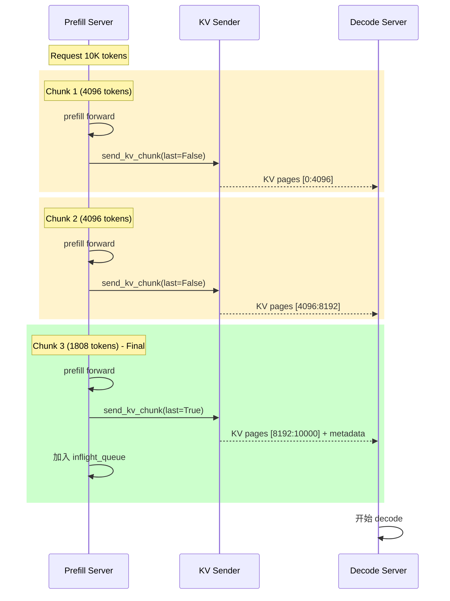

### 8.5 缓存处理

分块请求在每个 chunk 完成后更新 RadixCache：

```python
# prefill.py L621-654
def process_prefill_chunk(self: Scheduler):
    if self.chunked_req:
        # 将当前 chunk 的 KV 缓存到 tree_cache
        self.tree_cache.cache_unfinished_req(self.chunked_req, chunked=True)
        
        if self.enable_overlap:
            # Overlap 模式: 记录 end_idx 供后续 KV 发送
            self.chunked_req.tmp_end_idx = min(
                len(self.chunked_req.fill_ids),
                len(self.chunked_req.origin_input_ids),
            )
        else:
            # 非 Overlap: 立即发送 KV
            self.send_kv_chunk(self.chunked_req)
        
        # 释放 req_pool_idx (保留 KV cache)
        self.req_to_token_pool.free(self.chunked_req.req_pool_idx)
```

### 8.6 与普通模式的差异

| 方面 | 普通 Chunked Prefill | PD 分离 Chunked Prefill |
|------|---------------------|------------------------|
| KV 处理 | 保留在本地 | 每 chunk 传输到 Decode Server |
| max_new_tokens | 正常值 | 设置为 1 (内存估算优化) |
| req_pool_idx | 持续使用 | 每 chunk 后释放再分配 |
| 完成后处理 | 进入 running_batch | 进入 inflight_queue 等待传输确认 |
| Cache 锁定 | 持续锁定 | 持续锁定直到传输完成 |

### 8.7 配置示例

```bash
# PD 分离 + Chunked Prefill
# Prefill Server
python -m sglang.launch_server \
    --model-path Qwen/Qwen2.5-72B \
    --tp-size 4 \
    --chunked-prefill-size 8192 \
    --disaggregation-mode prefill \
    --disaggregation-bootstrap-port 12345

# Decode Server
python -m sglang.launch_server \
    --model-path Qwen/Qwen2.5-72B \
    --tp-size 4 \
    --disaggregation-mode decode \
    --disaggregation-bootstrap-port 12345
```

---

## 9. PP 动态分块

在 Pipeline Parallelism (PP) 场景下，可以启用动态分块来优化延迟。

### 9.1 工作原理

```python
# scheduler_pp_mixin.py L669-701
def predict_next_chunk_size(self: Scheduler, history_len: int) -> Optional[int]:
    """
    根据历史长度动态预测下一个 chunk 大小。
    使用二次模型: f(l) = al^2 + bl + c 预测延迟。
    """
    if not self.enable_dynamic_chunking or not self.length_predictor.is_ready:
        return None
    
    predicted_size = self.length_predictor.predict_next_chunk_size(
        history_len=history_len,
        base_chunk_size=self.chunked_prefill_size,
        page_size=self.page_size,
        context_len=self.model_config.context_len,
        max_chunk_size=self.max_prefill_tokens,
    )
    
    return predicted_size
```

### 9.2 启用方式

```bash
python -m sglang.launch_server \
    --model-path Qwen/Qwen2.5-72B \
    --tp-size 4 \
    --pp-size 2 \
    --chunked-prefill-size 4096 \
    --enable-dynamic-chunking
```

---

## 10. 底层数据结构交互

### 10.1 Req 状态变化

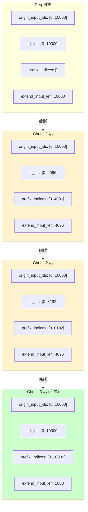

### 10.2 KV Cache 增量分配

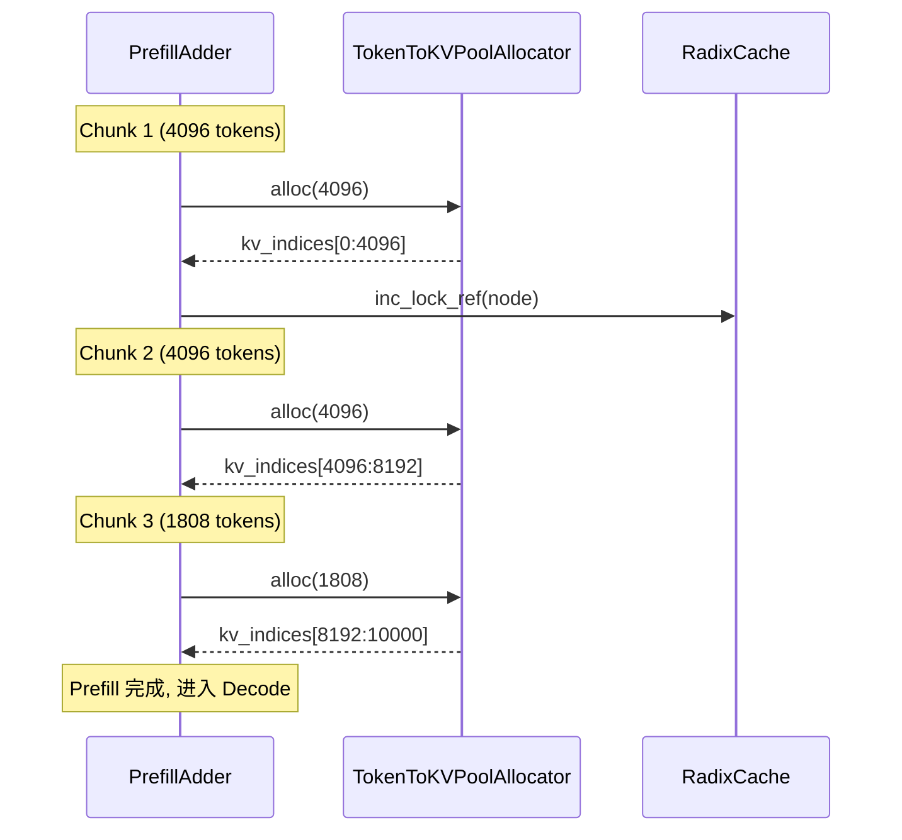

---

## 11. 性能对比

### 11.1 典型场景

| 场景 | 无 Chunked | Chunked | Mixed |
|------|------------|---------|-------|
| 长序列 TTFT | 高 | 中 | 低 |
| 短序列 TTFT | 低 | 低 | 低 |
| Decode 延迟 | 波动大 | 稳定 | 最稳定 |
| GPU 利用率 | 波动 | 较稳定 | 最高 |

### 11.2 推荐配置

```bash
# 高吞吐场景
python -m sglang.launch_server \
    --model-path meta-llama/Llama-3.1-70B \
    --tp-size 4 \
    --chunked-prefill-size 8192 \
    --enable-mixed-chunk \
    --max-prefill-tokens 32768

# 低延迟场景
python -m sglang.launch_server \
    --model-path meta-llama/Llama-3.1-8B \
    --chunked-prefill-size 2048 \
    --enable-mixed-chunk
```

---

## 12. 调试技巧

### 12.1 查看分块状态

```python
# 启用详细日志
export SGLANG_LOG_LEVEL=debug

# 日志中可以看到:
# [DEBUG] PrefillAdder: rem_chunk_tokens=4096, rem_input_tokens=16384
# [DEBUG] add_one_req: truncated to 4096 tokens, new_chunked_req=True
```

### 12.2 禁用 Chunked Prefill

```bash
# 设置为 -1 禁用
python -m sglang.launch_server \
    --model-path Qwen/Qwen2.5-7B \
    --chunked-prefill-size -1
```

### 12.3 监控指标

```python
# 关键指标
# - prefill_tokens_per_batch: 每批次预填充 token 数
# - decode_batch_size: decode 批次大小
# - forward_mode: EXTEND/MIXED/DECODE 分布
```

---

## 13. 涉及的核心类和函数

| 组件 | 文件 | 关键函数 |
|------|------|----------|
| 初始化 | `scheduler.py` | `init_chunked_prefill()` |
| 调度决策 | `schedule_policy.py` | `PrefillAdder.add_one_req()` |
| 分块处理 | `schedule_policy.py` | `PrefillAdder.add_chunked_req()` |
| 混合批次 | `schedule_batch.py` | `ScheduleBatch.mix_with_running()` |
| 前向模式 | `forward_batch_info.py` | `ForwardMode.MIXED` |
| PP 动态 | `scheduler_pp_mixin.py` | `predict_next_chunk_size()` |
| 多模态 Embedding | `mm_utils.py` | `get_embedding_chunk()` |
| 多模态分块计算 | `mm_utils.py` | `_get_chunked_prefill_embedding_for_chunked_items()` |
| PD 分离处理 | `disaggregation/prefill.py` | `process_batch_result_disagg_prefill()` |
| PD KV 传输 | `disaggregation/prefill.py` | `send_kv_chunk()` |

