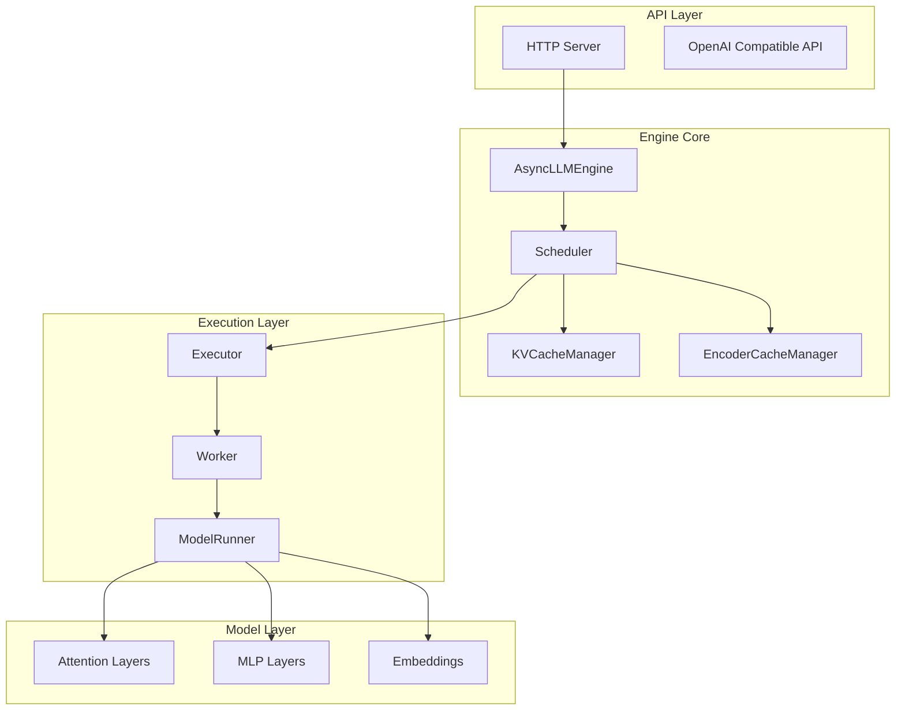
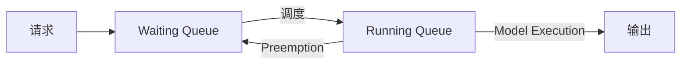
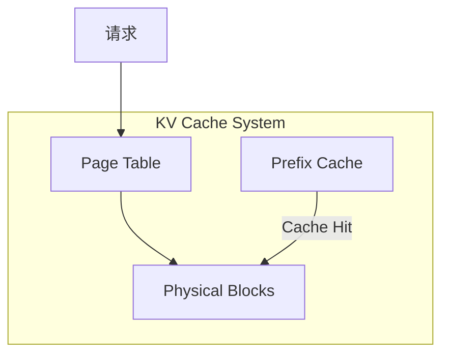
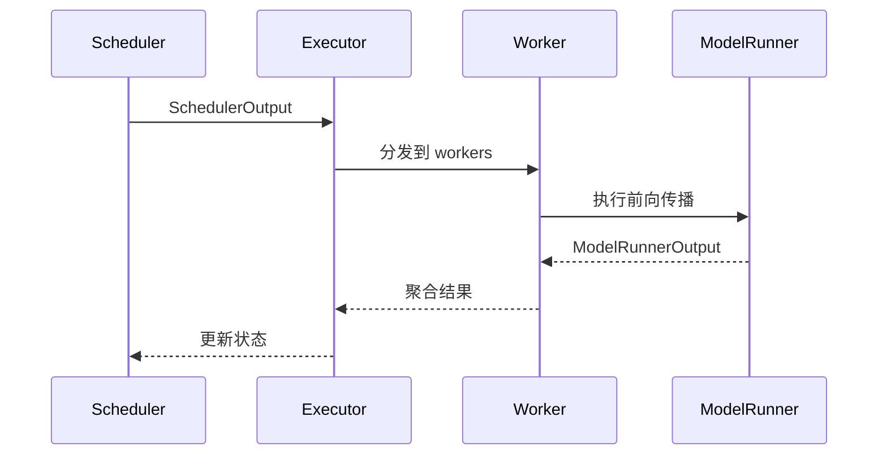
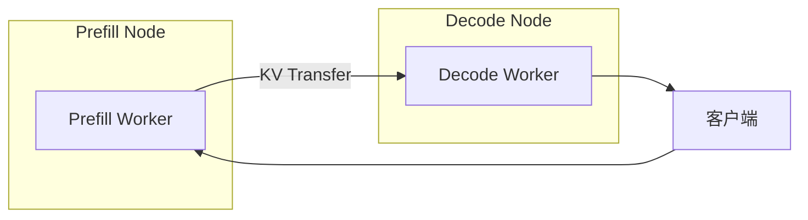
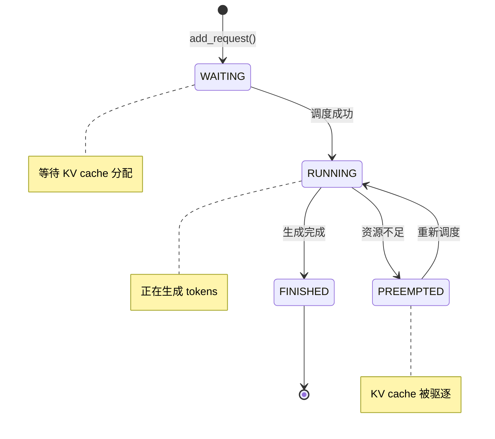

# vLLM v1 架构概述

本文档是 vLLM v1 架构学习笔记系列的总览，涵盖调度、优化技术和分布式特性。

---

## 1. 文档索引

| 文档 | 主题 | 核心内容 |
|------|------|----------|
| [01_scheduler.md](01_scheduler.md) | 调度器 | 调度循环、KV Cache 管理、抢占机制 |
| [02_chunked_prefill.md](02_chunked_prefill.md) | 分块预填充 | Prefill/Decode 混合调度、注意力 kernel |
| [03_multimodal.md](03_multimodal.md) | 多模态 | 输入处理、Encoder 缓存、VLM 集成 |
| [04_speculative_decoding.md](04_speculative_decoding.md) | 投机采样 | EAGLE、N-gram、调度集成 |
| [05_pd_disaggregation.md](05_pd_disaggregation.md) | P/D 分离 | KV 传输、连接器架构、分布式推理 |

---

## 2. 整体架构



---

## 3. 核心组件关系

### 3.1 调度器 (Scheduler)

调度器是 vLLM 的核心，负责决定每个 step 处理哪些请求：



**关键特性**：
- Continuous Batching：动态批处理
- PagedAttention：基于 block 的 KV 缓存
- Preemption：资源不足时抢占低优先级请求

### 3.2 KV Cache 管理



### 3.3 执行层



---

## 4. 优化技术

### 4.1 Chunked Prefill

将长 prompt 分块处理，减少阻塞：

```
传统: |====== Prefill (100%) ======| Decode | Decode | ...
分块: | Chunk1 | Decode | Chunk2 | Decode | Chunk3 | Decode | ...
```

### 4.2 投机采样

使用小模型加速生成：

```
Target:  T → V → V → V → T → V → V → ...
         ↑   ↑   ↑   ↑   ↑   ↑   ↑
Draft:   D → A → A → R → D → A → A → ...

D = Draft, A = Accept, R = Reject, T = Target, V = Verify
```

### 4.3 Prefix Caching

复用相同前缀的 KV 缓存：

```
请求1: [System Prompt] + [User A] → 计算完整 KV
请求2: [System Prompt] + [User B] → 复用 [System Prompt] 的 KV
```

---

## 5. 分布式特性

### 5.1 并行策略

| 类型 | 说明 |
|------|------|
| **Tensor Parallel (TP)** | 跨 GPU 切分模型层 |
| **Pipeline Parallel (PP)** | 跨 GPU 切分模型阶段 |
| **Data Parallel (DP)** | 复制模型处理不同数据 |

### 5.2 P/D 分离



---

## 6. 请求生命周期



---

## 7. 关键数据结构

### 7.1 Request

```python
class Request:
    request_id: str
    prompt_token_ids: list[int]
    num_computed_tokens: int
    status: RequestStatus
    kv_block_hashes: list[BlockHash]
    # ...
```

### 7.2 SchedulerOutput

```python
@dataclass
class SchedulerOutput:
    scheduled_new_reqs: list[NewRequestData]
    scheduled_cached_reqs: CachedRequestData
    num_scheduled_tokens: dict[str, int]
    total_num_scheduled_tokens: int
    # ...
```

---

## 8. 目录结构

```
vllm/
├── v1/                      # v1 引擎
│   ├── core/
│   │   ├── sched/          # 调度器
│   │   │   ├── scheduler.py
│   │   │   ├── interface.py
│   │   │   └── output.py
│   │   ├── kv_cache_manager.py
│   │   └── encoder_cache_manager.py
│   ├── worker/             # Worker 实现
│   └── spec_decode/        # 投机采样
├── attention/              # 注意力实现
│   ├── backends/           # 后端 (Flash, Triton, etc.)
│   └── ops/                # 算子
├── distributed/            # 分布式
│   └── kv_transfer/        # KV 传输
├── multimodal/            # 多模态处理
└── model_executor/        # 模型执行
```

---

## 9. 学习路径建议

1. **入门**: 先阅读 [01_scheduler.md](01_scheduler.md) 理解核心调度逻辑
2. **优化**: 阅读 [02_chunked_prefill.md](02_chunked_prefill.md) 和 [04_speculative_decoding.md](04_speculative_decoding.md)
3. **多模态**: 阅读 [03_multimodal.md](03_multimodal.md) 了解 VLM 支持
4. **分布式**: 阅读 [05_pd_disaggregation.md](05_pd_disaggregation.md) 了解 P/D 分离

---

## 参考资源

- [vLLM 官方文档](https://docs.vllm.ai/)
- [vLLM GitHub](https://github.com/vllm-project/vllm)
- [PagedAttention 论文](https://arxiv.org/abs/2309.06180)
